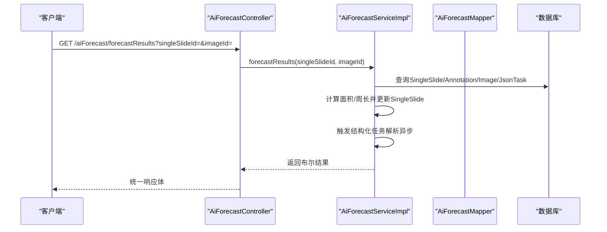
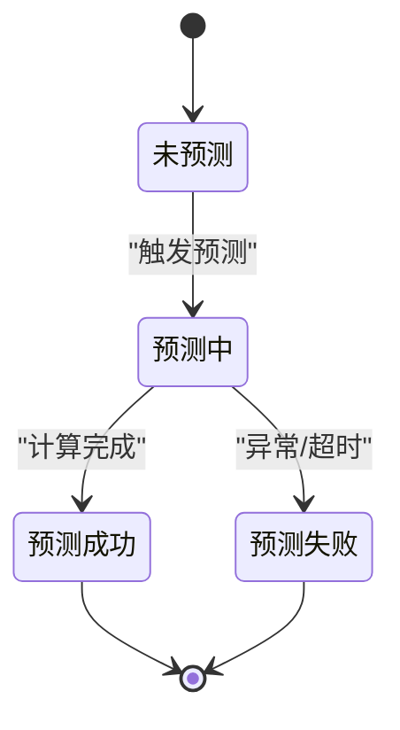
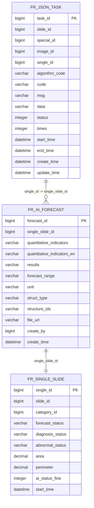
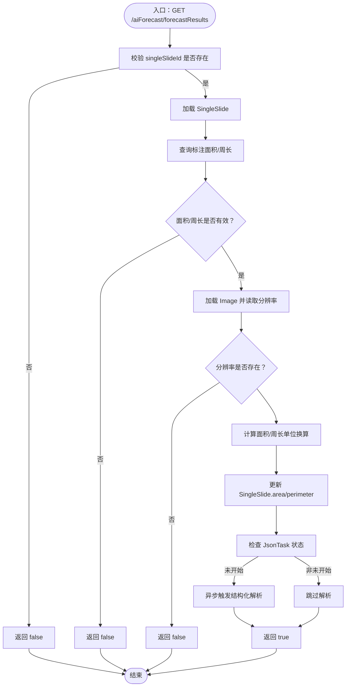
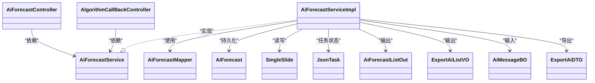

# AI预测接口

<cite>
**本文引用的文件**
- [AiForecastController.java](file://src/main/java/cn/staitech/fr/controller/AiForecastController.java)
- [AlgorithmCallBackController.java](file://src/main/java/cn/staitech/fr/controller/AlgorithmCallBackController.java)
- [AiForecastService.java](file://src/main/java/cn/staitech/fr/service/AiForecastService.java)
- [AiForecastServiceImpl.java](file://src/main/java/cn/staitech/fr/service/impl/AiForecastServiceImpl.java)
- [AiForecast.java](file://src/main/java/cn/staitech/fr/domain/AiForecast.java)
- [AiForecastListOut.java](file://src/main/java/cn/staitech/fr/domain/out/AiForecastListOut.java)
- [ExportAiListVO.java](file://src/main/java/cn/staitech/fr/domain/out/ExportAiListVO.java)
- [AiMessageBO.java](file://src/main/java/cn/staitech/fr/domain/in/AiMessageBO.java)
- [SingleSlide.java](file://src/main/java/cn/staitech/fr/domain/SingleSlide.java)
- [JsonTask.java](file://src/main/java/cn/staitech/fr/domain/JsonTask.java)
- [AiForecastMapper.java](file://src/main/java/cn/staitech/fr/mapper/AiForecastMapper.java)
- [AiForecastMapper.xml](file://src/main/resources/mapper/AiForecastMapper.xml)
- [ForecastStatusEnum.java](file://src/main/java/cn/staitech/fr/enums/ForecastStatusEnum.java)
- [AiStatusEnum.java](file://src/main/java/cn/staitech/fr/enums/AiStatusEnum.java)
- [ExportAiDTO.java](file://src/main/java/cn/staitech/fr/domain/dto/ExportAiDTO.java)
</cite>

## 目录
1. [简介](#简介)
2. [项目结构](#项目结构)
3. [核心组件](#核心组件)
4. [架构总览](#架构总览)
5. [详细组件分析](#详细组件分析)
6. [依赖关系分析](#依赖关系分析)
7. [性能考虑](#性能考虑)
8. [故障排查指南](#故障排查指南)
9. [结论](#结论)
10. [附录](#附录)

## 简介
本文件面向AI预测相关接口的使用者与维护者，系统性梳理“预测结果查询”“预测状态管理”“预测数据导出”的HTTP接口定义、请求参数、响应格式与业务流程，并给出AI预测生命周期管理（任务创建、状态查询、结果获取）的端到端说明。同时提供性能优化建议与最佳实践，帮助在高并发场景下稳定运行。

## 项目结构
围绕AI预测能力的关键模块如下：
- 控制层：AiForecastController、AlgorithmCallBackController
- 服务层：AiForecastService、AiForecastServiceImpl
- 数据模型：AiForecast、SingleSlide、JsonTask、AiForecastListOut、ExportAiListVO、AiMessageBO、ExportAiDTO
- 数据访问：AiForecastMapper、AiForecastMapper.xml
- 枚举：ForecastStatusEnum、AiStatusEnum

```mermaid
graph TB
subgraph "控制层"
C1["AiForecastController"]
C2["AlgorithmCallBackController"]
end
subgraph "服务层"
S1["AiForecastService"]
S2["AiForecastServiceImpl"]
end
subgraph "数据模型"
M1["AiForecast"]
M2["SingleSlide"]
M3["JsonTask"]
M4["AiForecastListOut"]
M5["ExportAiListVO"]
M6["AiMessageBO"]
M7["ExportAiDTO"]
end
subgraph "数据访问"
D1["AiForecastMapper"]
D2["AiForecastMapper.xml"]
end
C1 --> S1
C2 --> S1
S1 < --> S2
S2 --> D1
D1 --> D2
S2 --> M1
S2 --> M2
S2 --> M3
S2 --> M4
S2 --> M5
S2 --> M6
S2 --> M7
```

图表来源
- [AiForecastController.java:17-31](file://src/main/java/cn/staitech/fr/controller/AiForecastController.java#L17-L31)
- [AlgorithmCallBackController.java:39-88](file://src/main/java/cn/staitech/fr/controller/AlgorithmCallBackController.java#L39-L88)
- [AiForecastService.java:16-28](file://src/main/java/cn/staitech/fr/service/AiForecastService.java#L16-L28)
- [AiForecastServiceImpl.java:53-367](file://src/main/java/cn/staitech/fr/service/impl/AiForecastServiceImpl.java#L53-L367)
- [AiForecast.java:18-84](file://src/main/java/cn/staitech/fr/domain/AiForecast.java#L18-L84)
- [SingleSlide.java:20-77](file://src/main/java/cn/staitech/fr/domain/SingleSlide.java#L20-L77)
- [JsonTask.java:26-69](file://src/main/java/cn/staitech/fr/domain/JsonTask.java#L26-L69)
- [AiForecastListOut.java:12-43](file://src/main/java/cn/staitech/fr/domain/out/AiForecastListOut.java#L12-L43)
- [ExportAiListVO.java:11-32](file://src/main/java/cn/staitech/fr/domain/out/ExportAiListVO.java#L11-L32)
- [AiMessageBO.java:11-39](file://src/main/java/cn/staitech/fr/domain/in/AiMessageBO.java#L11-L39)
- [ExportAiDTO.java:11-24](file://src/main/java/cn/staitech/fr/domain/dto/ExportAiDTO.java#L11-L24)
- [AiForecastMapper.java:13-17](file://src/main/java/cn/staitech/fr/mapper/AiForecastMapper.java#L13-L17)
- [AiForecastMapper.xml:5-38](file://src/main/resources/mapper/AiForecastMapper.xml#L5-L38)

章节来源
- [AiForecastController.java:17-31](file://src/main/java/cn/staitech/fr/controller/AiForecastController.java#L17-L31)
- [AlgorithmCallBackController.java:39-88](file://src/main/java/cn/staitech/fr/controller/AlgorithmCallBackController.java#L39-L88)
- [AiForecastService.java:16-28](file://src/main/java/cn/staitech/fr/service/AiForecastService.java#L16-L28)
- [AiForecastServiceImpl.java:53-367](file://src/main/java/cn/staitech/fr/service/impl/AiForecastServiceImpl.java#L53-L367)
- [AiForecast.java:18-84](file://src/main/java/cn/staitech/fr/domain/AiForecast.java#L18-L84)
- [SingleSlide.java:20-77](file://src/main/java/cn/staitech/fr/domain/SingleSlide.java#L20-L77)
- [JsonTask.java:26-69](file://src/main/java/cn/staitech/fr/domain/JsonTask.java#L26-L69)
- [AiForecastListOut.java:12-43](file://src/main/java/cn/staitech/fr/domain/out/AiForecastListOut.java#L12-L43)
- [ExportAiListVO.java:11-32](file://src/main/java/cn/staitech/fr/domain/out/ExportAiListVO.java#L11-L32)
- [AiMessageBO.java:11-39](file://src/main/java/cn/staitech/fr/domain/in/AiMessageBO.java#L11-L39)
- [ExportAiDTO.java:11-24](file://src/main/java/cn/staitech/fr/domain/dto/ExportAiDTO.java#L11-L24)
- [AiForecastMapper.java:13-17](file://src/main/java/cn/staitech/fr/mapper/AiForecastMapper.java#L13-L17)
- [AiForecastMapper.xml:5-38](file://src/main/resources/mapper/AiForecastMapper.xml#L5-L38)

## 核心组件
- 控制器
  - AiForecastController：提供预测结果查询接口
  - AlgorithmCallBackController：提供结构化回调与预测结果查询接口（兼容旧版本）
- 服务接口与实现
  - AiForecastService：定义预测结果查询、批量写入、列表查询等能力
  - AiForecastServiceImpl：实现预测结果计算、批量插入、参考范围设置、导出数据准备等
- 数据模型
  - AiForecast：预测结果持久化模型
  - SingleSlide：单切片状态与面积/周长等属性
  - JsonTask：结构化任务状态
  - 输出模型：AiForecastListOut、ExportAiListVO
  - 输入模型：AiMessageBO
  - 导出DTO：ExportAiDTO
- 枚举
  - ForecastStatusEnum：预测状态枚举
  - AiStatusEnum：脏器识别状态枚举

章节来源
- [AiForecastController.java:17-31](file://src/main/java/cn/staitech/fr/controller/AiForecastController.java#L17-L31)
- [AlgorithmCallBackController.java:39-88](file://src/main/java/cn/staitech/fr/controller/AlgorithmCallBackController.java#L39-L88)
- [AiForecastService.java:16-28](file://src/main/java/cn/staitech/fr/service/AiForecastService.java#L16-L28)
- [AiForecastServiceImpl.java:53-367](file://src/main/java/cn/staitech/fr/service/impl/AiForecastServiceImpl.java#L53-L367)
- [AiForecast.java:18-84](file://src/main/java/cn/staitech/fr/domain/AiForecast.java#L18-L84)
- [SingleSlide.java:20-77](file://src/main/java/cn/staitech/fr/domain/SingleSlide.java#L20-L77)
- [JsonTask.java:26-69](file://src/main/java/cn/staitech/fr/domain/JsonTask.java#L26-L69)
- [AiForecastListOut.java:12-43](file://src/main/java/cn/staitech/fr/domain/out/AiForecastListOut.java#L12-L43)
- [ExportAiListVO.java:11-32](file://src/main/java/cn/staitech/fr/domain/out/ExportAiListVO.java#L11-L32)
- [AiMessageBO.java:11-39](file://src/main/java/cn/staitech/fr/domain/in/AiMessageBO.java#L11-L39)
- [ExportAiDTO.java:11-24](file://src/main/java/cn/staitech/fr/domain/dto/ExportAiDTO.java#L11-L24)
- [ForecastStatusEnum.java:6-15](file://src/main/java/cn/staitech/fr/enums/ForecastStatusEnum.java#L6-L15)
- [AiStatusEnum.java:3-25](file://src/main/java/cn/staitech/fr/enums/AiStatusEnum.java#L3-L25)

## 架构总览
AI预测接口围绕“单切片”作为核心对象，通过控制器接收请求，调用服务层完成预测结果计算与落库，最终返回统一响应体。结构化任务（JsonTask）与算法回调（AlgorithmCallBackController）负责异步触发与结果回传。



图表来源
- [AiForecastController.java:27-30](file://src/main/java/cn/staitech/fr/controller/AiForecastController.java#L27-L30)
- [AiForecastServiceImpl.java:85-157](file://src/main/java/cn/staitech/fr/service/impl/AiForecastServiceImpl.java#L85-L157)
- [AiForecastMapper.java:13-17](file://src/main/java/cn/staitech/fr/mapper/AiForecastMapper.java#L13-L17)

## 详细组件分析

### 接口定义与使用说明

- 接口一：预测结果查询
  - 方法与路径
    - GET /aiForecast/forecastResults
  - 请求参数
    - singleSlideId：单切片ID（Long，必填）
    - imageId：图片ID（Long，必填）
  - 响应
    - 统一响应体，data为布尔值：true表示成功，false表示失败
  - 业务逻辑
    - 校验单切片存在性与标注面积/周长可用性
    - 读取图像分辨率，计算面积与周长（单位换算）
    - 更新SingleSlide的面积与周长
    - 若结构化任务处于未开始状态，则异步触发结构化解析
  - 错误码与语义
    - 返回false可能由以下原因导致：单切片不存在、标注为空、图像分辨率缺失、更新失败、异常捕获
  - 请求示例
    - GET /aiForecast/forecastResults?singleSlideId=1001&imageId=2001
  - 响应示例
    - 成功：{"code":200,"data":true,"msg":"success"}
    - 失败：{"code":200,"data":false,"msg":"success"}

- 接口二：结构化回调（兼容旧版）
  - 方法与路径
    - POST /algorithmCallBack/structure
    - GET /algorithmCallBack/forecastResults
  - 请求参数
    - POST体：字符串形式的回调JSON（AiMessageBO结构）
    - GET参数：singleSlideId、imageId（同上）
  - 响应
    - 结构化回调：{"code":200,"data":null,"msg":"success"}
    - 预测结果查询：布尔值统一响应体
  - 业务逻辑
    - 结构化回调：写入算法回调队列或直接处理
    - 预测结果查询：复用AiForecastController的逻辑

章节来源
- [AiForecastController.java:27-30](file://src/main/java/cn/staitech/fr/controller/AiForecastController.java#L27-L30)
- [AlgorithmCallBackController.java:74-86](file://src/main/java/cn/staitech/fr/controller/AlgorithmCallBackController.java#L74-L86)
- [AiForecastServiceImpl.java:85-157](file://src/main/java/cn/staitech/fr/service/impl/AiForecastServiceImpl.java#L85-L157)

### AI预测生命周期管理



- 生命周期阶段
  - 未预测：初始状态
  - 预测中：正在计算面积/周长并触发结构化任务
  - 预测成功：计算与落库完成
  - 预测失败：异常或数据不满足条件
- 关键状态字段
  - SingleSlide.forecastStatus：预测状态（枚举见ForecastStatusEnum）
  - SingleSlide.aiStatusFine：精细轮廓分析状态（枚举见AiStatusEnum）
  - JsonTask.status：结构化任务状态（0未开始、1解析中、2成功、3失败）

章节来源
- [ForecastStatusEnum.java:6-15](file://src/main/java/cn/staitech/fr/enums/ForecastStatusEnum.java#L6-L15)
- [AiStatusEnum.java:3-25](file://src/main/java/cn/staitech/fr/enums/AiStatusEnum.java#L3-L25)
- [SingleSlide.java:35-69](file://src/main/java/cn/staitech/fr/domain/SingleSlide.java#L35-L69)
- [JsonTask.java:51-52](file://src/main/java/cn/staitech/fr/domain/JsonTask.java#L51-L52)

### 数据模型与映射



图表来源
- [AiForecast.java:18-84](file://src/main/java/cn/staitech/fr/domain/AiForecast.java#L18-L84)
- [SingleSlide.java:20-77](file://src/main/java/cn/staitech/fr/domain/SingleSlide.java#L20-L77)
- [JsonTask.java:26-69](file://src/main/java/cn/staitech/fr/domain/JsonTask.java#L26-L69)
- [AiForecastMapper.xml:7-22](file://src/main/resources/mapper/AiForecastMapper.xml#L7-L22)

章节来源
- [AiForecast.java:18-84](file://src/main/java/cn/staitech/fr/domain/AiForecast.java#L18-L84)
- [SingleSlide.java:20-77](file://src/main/java/cn/staitech/fr/domain/SingleSlide.java#L20-L77)
- [JsonTask.java:26-69](file://src/main/java/cn/staitech/fr/domain/JsonTask.java#L26-L69)
- [AiForecastMapper.xml:7-22](file://src/main/resources/mapper/AiForecastMapper.xml#L7-L22)

### 预测结果查询流程



图表来源
- [AiForecastController.java:27-30](file://src/main/java/cn/staitech/fr/controller/AiForecastController.java#L27-L30)
- [AiForecastServiceImpl.java:85-157](file://src/main/java/cn/staitech/fr/service/impl/AiForecastServiceImpl.java#L85-L157)

章节来源
- [AiForecastController.java:27-30](file://src/main/java/cn/staitech/fr/controller/AiForecastController.java#L27-L30)
- [AiForecastServiceImpl.java:85-157](file://src/main/java/cn/staitech/fr/service/impl/AiForecastServiceImpl.java#L85-L157)

### 预测数据导出能力
- 导出维度
  - 专题号、项目名称、图像名称、脏器名称
- 使用场景
  - 生成报告或导出Excel时，结合ExportAiListVO/AiForecastListOut中的指标、单位、参考范围等字段
- 关键字段
  - ExportAiDTO：topicName、specialName、imageName、organName
  - ExportAiListVO：quantitativeIndicators、results、forecastRange、unit、averageValue、normalDistribution
  - AiForecastListOut：quantitativeIndicators、results、averageValue、normalDistribution、unit

章节来源
- [ExportAiDTO.java:11-24](file://src/main/java/cn/staitech/fr/domain/dto/ExportAiDTO.java#L11-L24)
- [ExportAiListVO.java:11-32](file://src/main/java/cn/staitech/fr/domain/out/ExportAiListVO.java#L11-L32)
- [AiForecastListOut.java:12-43](file://src/main/java/cn/staitech/fr/domain/out/AiForecastListOut.java#L12-L43)

## 依赖关系分析



图表来源
- [AiForecastController.java:21-31](file://src/main/java/cn/staitech/fr/controller/AiForecastController.java#L21-L31)
- [AlgorithmCallBackController.java:42-88](file://src/main/java/cn/staitech/fr/controller/AlgorithmCallBackController.java#L42-L88)
- [AiForecastService.java:16-28](file://src/main/java/cn/staitech/fr/service/AiForecastService.java#L16-L28)
- [AiForecastServiceImpl.java:53-367](file://src/main/java/cn/staitech/fr/service/impl/AiForecastServiceImpl.java#L53-L367)
- [AiForecast.java:18-84](file://src/main/java/cn/staitech/fr/domain/AiForecast.java#L18-L84)
- [SingleSlide.java:20-77](file://src/main/java/cn/staitech/fr/domain/SingleSlide.java#L20-L77)
- [JsonTask.java:26-69](file://src/main/java/cn/staitech/fr/domain/JsonTask.java#L26-L69)
- [AiForecastListOut.java:12-43](file://src/main/java/cn/staitech/fr/domain/out/AiForecastListOut.java#L12-L43)
- [ExportAiListVO.java:11-32](file://src/main/java/cn/staitech/fr/domain/out/ExportAiListVO.java#L11-L32)
- [AiMessageBO.java:11-39](file://src/main/java/cn/staitech/fr/domain/in/AiMessageBO.java#L11-L39)
- [ExportAiDTO.java:11-24](file://src/main/java/cn/staitech/fr/domain/dto/ExportAiDTO.java#L11-L24)
- [AiForecastMapper.java:13-17](file://src/main/java/cn/staitech/fr/mapper/AiForecastMapper.java#L13-L17)

章节来源
- [AiForecastController.java:21-31](file://src/main/java/cn/staitech/fr/controller/AiForecastController.java#L21-L31)
- [AlgorithmCallBackController.java:42-88](file://src/main/java/cn/staitech/fr/controller/AlgorithmCallBackController.java#L42-L88)
- [AiForecastService.java:16-28](file://src/main/java/cn/staitech/fr/service/AiForecastService.java#L16-L28)
- [AiForecastServiceImpl.java:53-367](file://src/main/java/cn/staitech/fr/service/impl/AiForecastServiceImpl.java#L53-L367)
- [AiForecastMapper.java:13-17](file://src/main/java/cn/staitech/fr/mapper/AiForecastMapper.java#L13-L17)

## 性能考虑
- 异步解析
  - 当JsonTask状态为未开始时，服务会异步提交结构化解析任务，避免阻塞主线程
- 线程池配置
  - 内部使用可扩容线程池，最大线程数与队列容量可根据业务峰值调整
- 批量写入
  - 指标写入采用批量保存，减少数据库往返
- 参考范围计算
  - 在有对照组的情况下，按指标、脏器类别、性别、结构类型聚合统计，注意索引与SQL优化
- 缓存与降级
  - 对热点指标与任务状态可引入缓存；对第三方算法回调失败进行重试与熔断

[本节为通用性能建议，无需特定文件引用]

## 故障排查指南
- 常见问题
  - 单切片不存在或标注为空：返回false，检查singleSlideId与标注数据
  - 图像分辨率缺失：返回false，确认图像元数据完整性
  - 更新失败：检查数据库连接与权限
  - 结构化任务未触发：确认JsonTask状态为未开始
- 日志定位
  - 服务层异常捕获与日志打印，便于快速定位
- 错误码说明
  - 统一响应体中的data为布尔值：true/false
  - 具体业务错误可通过日志与异常栈定位

章节来源
- [AiForecastServiceImpl.java:152-156](file://src/main/java/cn/staitech/fr/service/impl/AiForecastServiceImpl.java#L152-L156)
- [AiForecastController.java:27-30](file://src/main/java/cn/staitech/fr/controller/AiForecastController.java#L27-L30)

## 结论
本文档从接口定义、生命周期、数据模型与依赖关系四个维度，系统化梳理了AI预测相关接口的能力边界与使用方式。通过统一的控制器与服务层抽象，配合异步解析与批量写入机制，能够在保证稳定性的同时提升吞吐。建议在生产环境中结合监控与缓存策略，持续优化性能与可靠性。

## 附录

### 统一响应体约定
- 字段
  - code：状态码（如200）
  - data：业务数据（布尔值或对象列表）
  - msg：消息描述（如success）

[本节为通用约定说明，无需特定文件引用]