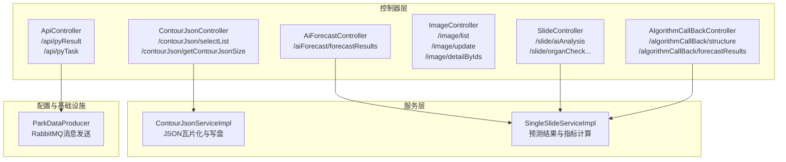
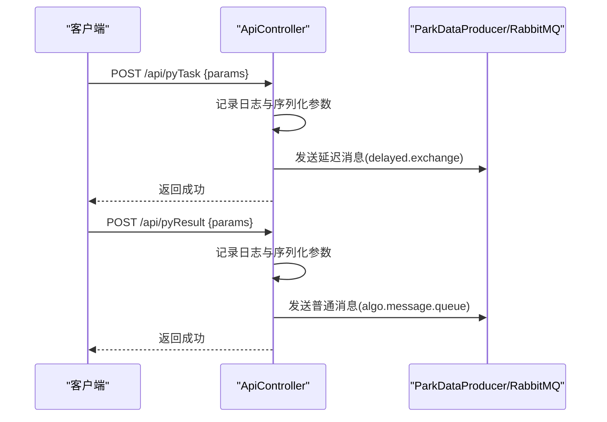
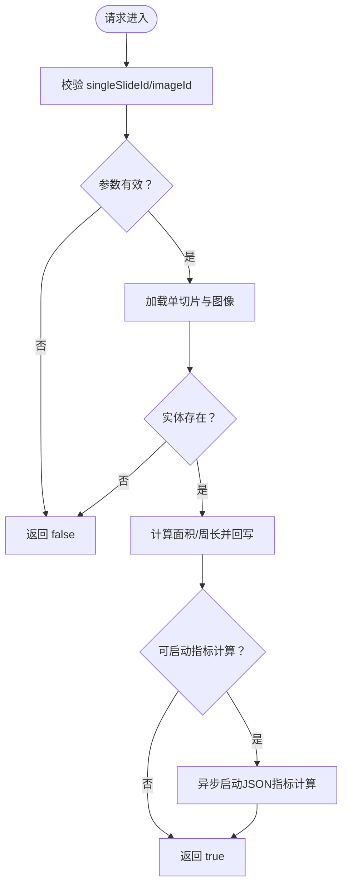
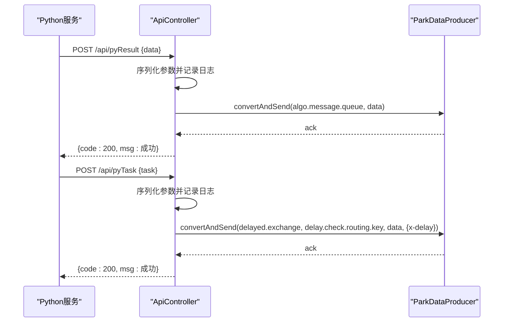
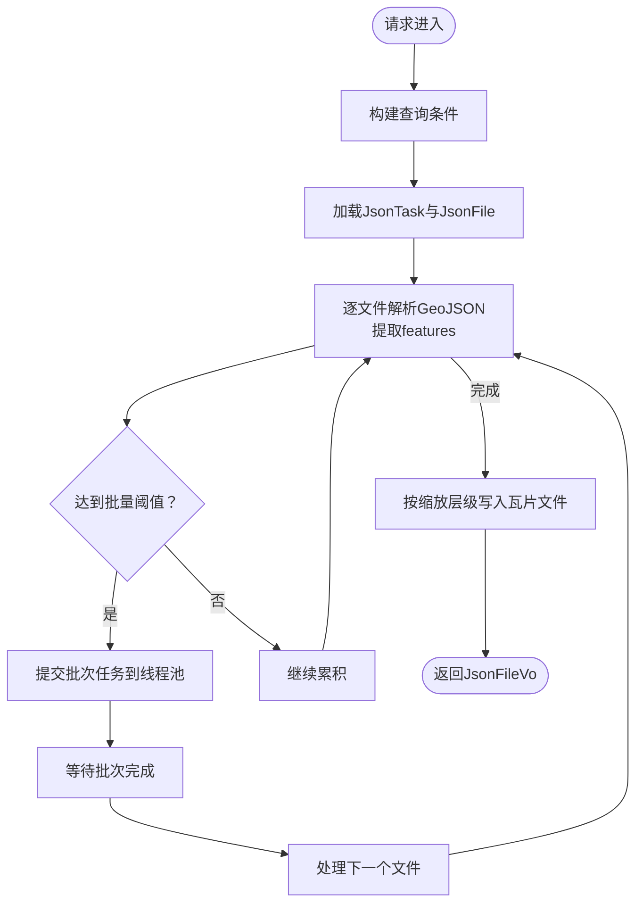
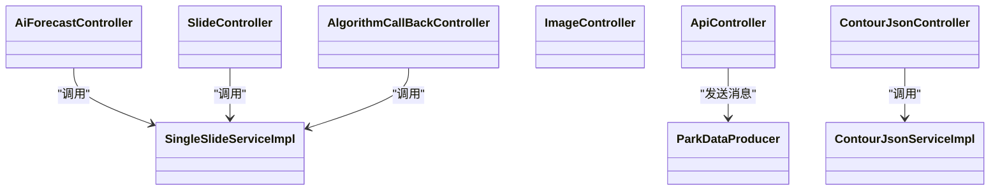

# API接口文档

<cite>
**本文档引用的文件**
- [AiForecastController.java](file://src/main/java/cn/staitech/fr/controller/AiForecastController.java)
- [ApiController.java](file://src/main/java/cn/staitech/fr/controller/ApiController.java)
- [ContourJsonController.java](file://src/main/java/cn/staitech/fr/controller/ContourJsonController.java)
- [ImageController.java](file://src/main/java/cn/staitech/fr/controller/ImageController.java)
- [SlideController.java](file://src/main/java/cn/staitech/fr/controller/SlideController.java)
- [AlgorithmCallBackController.java](file://src/main/java/cn/staitech/fr/controller/AlgorithmCallBackController.java)
- [ContourJsonServiceImpl.java](file://src/main/java/cn/staitech/fr/service/impl/ContourJsonServiceImpl.java)
- [SingleSlideServiceImpl.java](file://src/main/java/cn/staitech/fr/service/impl/SingleSlideServiceImpl.java)
- [ParkDataProducer.java](file://src/main/java/cn/staitech/fr/config/ParkDataProducer.java)
- [AiStatusEnum.java](file://src/main/java/cn/staitech/fr/enums/AiStatusEnum.java)
- [ForecastStatusEnum.java](file://src/main/java/cn/staitech/fr/enums/ForecastStatusEnum.java)
- [JsonFileVo.java](file://src/main/java/cn/staitech/fr/domain/out/JsonFileVo.java)
</cite>

## 目录
1. [简介](#简介)
2. [项目结构](#项目结构)
3. [核心组件](#核心组件)
4. [架构总览](#架构总览)
5. [详细组件分析](#详细组件分析)
6. [依赖关系分析](#依赖关系分析)
7. [性能考量](#性能考量)
8. [故障排查指南](#故障排查指南)
9. [结论](#结论)
10. [附录](#附录)

## 简介
本文件为FR模块的API接口文档，覆盖以下能力：
- AI预测结果查询
- 算法回调与任务投递
- 单切片处理与指标计算
- JSON轮廓瓦片化与下载
- 切片管理与阅片流程
- 数据模型与枚举说明

文档面向后端与前端开发者，提供HTTP方法、URL模式、请求/响应结构、认证方式、错误处理策略、安全与性能建议。

## 项目结构
FR模块采用Spring Boot标准结构，按功能域划分控制器、服务、领域模型与配置：
- 控制器层：对外暴露REST接口
- 服务层：业务编排与数据处理
- 配置层：消息队列生产者、线程池与过滤器
- 枚举与领域模型：状态码与输出对象

图表来源
- [AiForecastController.java:27-30](file://src/main/java/cn/staitech/fr/controller/AiForecastController.java#L27-L30)
- [ApiController.java:38-59](file://src/main/java/cn/staitech/fr/controller/ApiController.java#L38-L59)
- [ContourJsonController.java:55-78](file://src/main/java/cn/staitech/fr/controller/ContourJsonController.java#L55-L78)
- [ImageController.java:69-151](file://src/main/java/cn/staitech/fr/controller/ImageController.java#L69-L151)
- [SlideController.java:202-222](file://src/main/java/cn/staitech/fr/controller/SlideController.java#L202-L222)
- [AlgorithmCallBackController.java:76-86](file://src/main/java/cn/staitech/fr/controller/AlgorithmCallBackController.java#L76-L86)
- [ContourJsonServiceImpl.java:133-186](file://src/main/java/cn/staitech/fr/service/impl/ContourJsonServiceImpl.java#L133-L186)
- [SingleSlideServiceImpl.java:65-138](file://src/main/java/cn/staitech/fr/service/impl/SingleSlideServiceImpl.java#L65-L138)
- [ParkDataProducer.java:27-44](file://src/main/java/cn/staitech/fr/config/ParkDataProducer.java#L27-L44)

章节来源
- [AiForecastController.java:1-31](file://src/main/java/cn/staitech/fr/controller/AiForecastController.java#L1-L31)
- [ApiController.java:1-61](file://src/main/java/cn/staitech/fr/controller/ApiController.java#L1-L61)
- [ContourJsonController.java:1-93](file://src/main/java/cn/staitech/fr/controller/ContourJsonController.java#L1-L93)
- [ImageController.java:1-155](file://src/main/java/cn/staitech/fr/controller/ImageController.java#L1-L155)
- [SlideController.java:1-260](file://src/main/java/cn/staitech/fr/controller/SlideController.java#L1-L260)
- [AlgorithmCallBackController.java:1-88](file://src/main/java/cn/staitech/fr/controller/AlgorithmCallBackController.java#L1-L88)

## 核心组件
- AI预测结果查询：通过单切片ID与图片ID查询预测结果状态并触发指标计算。
- 算法回调与任务投递：接收外部Python服务回调，投递算法任务至消息队列。
- JSON轮廓瓦片化：解析GeoJSON轮廓，按缩放层级生成瓦片文件，支持多脏器文件大小查询与单脏器下载。
- 切片管理：提供切片状态、分页列表、批量删除、更新、详情查询等能力。
- 阅片与AI分析：提供AI分析、脏器识别校对、阅片记录等流程接口。

章节来源
- [AiForecastController.java:27-30](file://src/main/java/cn/staitech/fr/controller/AiForecastController.java#L27-L30)
- [ApiController.java:38-59](file://src/main/java/cn/staitech/fr/controller/ApiController.java#L38-L59)
- [ContourJsonController.java:55-78](file://src/main/java/cn/staitech/fr/controller/ContourJsonController.java#L55-L78)
- [ImageController.java:69-151](file://src/main/java/cn/staitech/fr/controller/ImageController.java#L69-L151)
- [SlideController.java:202-222](file://src/main/java/cn/staitech/fr/controller/SlideController.java#L202-L222)

## 架构总览
FR模块通过控制器接收请求，调用服务层完成业务处理，必要时与消息队列交互或落盘文件。

图表来源
- [ApiController.java:52-59](file://src/main/java/cn/staitech/fr/controller/ApiController.java#L52-L59)
- [ApiController.java:38-49](file://src/main/java/cn/staitech/fr/controller/ApiController.java#L38-L49)
- [ParkDataProducer.java:27-44](file://src/main/java/cn/staitech/fr/config/ParkDataProducer.java#L27-L44)

## 详细组件分析

### AI预测结果查询
- 接口：GET /aiForecast/forecastResults
- 请求参数
  - singleSlideId: 单切片ID（Long，必填）
  - imageId: 图片ID（Long，必填）
- 响应
  - 成功：Boolean，表示预测结果可用
  - 失败：通用错误响应
- 处理逻辑
  - 校验参数与实体存在性
  - 计算面积与周长并回写单切片
  - 若满足条件则异步启动JSON指标计算
- 错误处理
  - 参数缺失或实体不存在返回false
  - 计算异常更新预测状态为失败

图表来源
- [AiForecastController.java:27-30](file://src/main/java/cn/staitech/fr/controller/AiForecastController.java#L27-L30)
- [SingleSlideServiceImpl.java:65-138](file://src/main/java/cn/staitech/fr/service/impl/SingleSlideServiceImpl.java#L65-L138)

章节来源
- [AiForecastController.java:27-30](file://src/main/java/cn/staitech/fr/controller/AiForecastController.java#L27-L30)
- [SingleSlideServiceImpl.java:65-138](file://src/main/java/cn/staitech/fr/service/impl/SingleSlideServiceImpl.java#L65-L138)

### 算法回调与任务投递
- 接口：POST /api/pyResult
  - 用途：接收Python算法回调结果
  - 请求体：任意JSON对象（Map）
  - 响应：通用成功/失败包装
- 接口：POST /api/pyTask
  - 用途：投递算法任务（带延迟）
  - 请求体：任意JSON对象（Map）
  - 响应：通用成功/失败包装
- 消息队列
  - 普通消息：algo.message.queue
  - 延迟消息：delayed.exchange + routing key
- 安全与认证
  - 文档未声明显式鉴权头；建议在网关或代理层统一鉴权
- 错误处理
  - 发送异常捕获并返回失败

图表来源
- [ApiController.java:38-59](file://src/main/java/cn/staitech/fr/controller/ApiController.java#L38-L59)
- [ParkDataProducer.java:27-44](file://src/main/java/cn/staitech/fr/config/ParkDataProducer.java#L27-L44)

章节来源
- [ApiController.java:38-59](file://src/main/java/cn/staitech/fr/controller/ApiController.java#L38-L59)
- [ParkDataProducer.java:27-44](file://src/main/java/cn/staitech/fr/config/ParkDataProducer.java#L27-L44)

### JSON轮廓瓦片化与下载
- 接口：GET /contourJson/selectList
  - 用途：单脏器JSON下载清单
  - 参数：
    - slideId: 切片ID（Long，必填）
    - projectId: 专题ID（Long，必填）
    - organTagId: 脏器ID（Long，必填）
  - 响应：JsonFileVo（包含files与totalSize）
- 接口：GET /contourJson/getContourJsonSize
  - 用途：多脏器文件大小统计
  - 参数：
    - slideId: 切片ID（Long，必填）
    - projectId: 专题ID（Long，必填）
    - organTagIds: 脏器ID列表（List<Long>，必填）
  - 响应：ContourFileVo（包含统计信息）
- 接口：POST /contourJson/test（隐藏）
  - 用途：内部测试触发AI JSON瓦片化
  - 参数：taskId（路径参数）

服务处理要点
- 读取任务与文件列表，按缩放层级生成瓦片文件
- 使用线程池并发处理，支持批量提交与拒绝策略
- 对GeoJSON进行几何变换与属性增强，写入目标目录

图表来源
- [ContourJsonController.java:55-78](file://src/main/java/cn/staitech/fr/controller/ContourJsonController.java#L55-L78)
- [ContourJsonServiceImpl.java:133-186](file://src/main/java/cn/staitech/fr/service/impl/ContourJsonServiceImpl.java#L133-L186)
- [ContourJsonServiceImpl.java:311-371](file://src/main/java/cn/staitech/fr/service/impl/ContourJsonServiceImpl.java#L311-L371)
- [ContourJsonServiceImpl.java:389-415](file://src/main/java/cn/staitech/fr/service/impl/ContourJsonServiceImpl.java#L389-L415)

章节来源
- [ContourJsonController.java:55-78](file://src/main/java/cn/staitech/fr/controller/ContourJsonController.java#L55-L78)
- [ContourJsonServiceImpl.java:133-186](file://src/main/java/cn/staitech/fr/service/impl/ContourJsonServiceImpl.java#L133-L186)
- [ContourJsonServiceImpl.java:311-371](file://src/main/java/cn/staitech/fr/service/impl/ContourJsonServiceImpl.java#L311-L371)
- [ContourJsonServiceImpl.java:389-415](file://src/main/java/cn/staitech/fr/service/impl/ContourJsonServiceImpl.java#L389-L415)
- [JsonFileVo.java:11-16](file://src/main/java/cn/staitech/fr/domain/out/JsonFileVo.java#L11-L16)

### 切片管理
- 接口：POST /image/list
  - 用途：分页查询原始切片
  - 请求体：ImagePageReq
  - 响应：CustomPage<Image>
- 接口：POST /image/update
  - 用途：更新切片信息
  - 请求体：ImageUpdateVO
  - 响应：通用结果
- 接口：POST /image/detailByIds
  - 用途：批量获取切片详情
  - 请求体：List<Long>
  - 响应：List<ImageLogDetail>
- 接口：POST /image/deleteBatchIds
  - 用途：批量删除切片
  - 请求体：ImageBatchIdsVO
  - 响应：被删除ID列表
- 接口：POST /image/status
  - 用途：获取切片状态列表
  - 响应：List<ImageStatusVo>
- 接口：POST /image/addLog
  - 用途：记录审计日志（内部使用）
  - 响应：通用结果

章节来源
- [ImageController.java:69-151](file://src/main/java/cn/staitech/fr/controller/ImageController.java#L69-L151)

### 阅片与AI分析
- 接口：POST /slide/aiAnalysis
  - 用途：触发AI分析
  - 请求体：AiAnalysisReq
  - 响应：通用字符串结果
- 接口：POST /slide/organCheck
  - 用途：脏器识别校对（Python服务）
  - 请求体：OrganCheckReq
  - 响应：OrganCheckVo
- 接口：POST /slide/organCheckView
  - 用途：脏器识别校对（View页面）
  - 请求体：OrganCheckViewReq
  - 响应：OrganCheckViewVo
- 接口：POST /slide/organCheckConfirm
  - 用途：确认修改
  - 请求体：OrganCheckViewReq
  - 响应：通用字符串结果
- 接口：POST /slide/getAiInfoList
  - 用途：AI分析列表数据
  - 请求体：AiInfoListRequest
  - 响应：AiInfoAnalyzeVo
- 其他：下拉列表、选片、删除、相邻切片等

章节来源
- [SlideController.java:202-244](file://src/main/java/cn/staitech/fr/controller/SlideController.java#L202-L244)

### 已弃用接口
- 接口：POST /algorithmCallBack/structure
  - 用途：结构回调（已标记为@Deprecated）
  - 请求体：String
  - 响应：通用结果
- 接口：GET /algorithmCallBack/forecastResults
  - 用途：预测结果（已标记为@Deprecated）
  - 请求体：同AI预测结果查询
  - 响应：Boolean

迁移建议
- 优先迁移到新的 /aiForecast/forecastResults 与 /api/pyTask/pyResult
- 旧接口将在后续版本移除，请尽快替换

章节来源
- [AlgorithmCallBackController.java:76-86](file://src/main/java/cn/staitech/fr/controller/AlgorithmCallBackController.java#L76-L86)

## 依赖关系分析
- 控制器依赖服务层接口
- 服务层依赖Mapper与工具类
- 消息发送依赖ParkDataProducer与RabbitTemplate
- JSON瓦片化依赖线程池与几何工具

图表来源
- [AiForecastController.java:23-24](file://src/main/java/cn/staitech/fr/controller/AiForecastController.java#L23-L24)
- [ApiController.java:32-33](file://src/main/java/cn/staitech/fr/controller/ApiController.java#L32-L33)
- [ContourJsonController.java:36-41](file://src/main/java/cn/staitech/fr/controller/ContourJsonController.java#L36-L41)
- [SlideController.java:53-54](file://src/main/java/cn/staitech/fr/controller/SlideController.java#L53-L54)
- [AlgorithmCallBackController.java:46-56](file://src/main/java/cn/staitech/fr/controller/AlgorithmCallBackController.java#L46-L56)
- [ContourJsonServiceImpl.java:60-62](file://src/main/java/cn/staitech/fr/service/impl/ContourJsonServiceImpl.java#L60-L62)
- [SingleSlideServiceImpl.java:38-43](file://src/main/java/cn/staitech/fr/service/impl/SingleSlideServiceImpl.java#L38-L43)
- [ParkDataProducer.java:19-25](file://src/main/java/cn/staitech/fr/config/ParkDataProducer.java#L19-L25)

## 性能考量
- JSON瓦片化
  - 使用线程池并发处理，合理设置队列长度与拒绝策略
  - 批量提交（BATCH_SIZE）减少IO开销
  - 对大文件与多级缩放进行差异化处理
- 指标计算
  - 预测完成后异步启动指标计算，避免阻塞主流程
- 消息队列
  - 延迟消息用于重试与削峰
- 建议
  - 监控线程池队列长度与活跃线程数
  - 对大请求体进行限流与超时控制
  - 对磁盘写入进行容量与IO监控

## 故障排查指南
- 常见错误
  - 参数缺失或非法：返回false或通用失败
  - 实体不存在：返回false或失败
  - 计算异常：更新预测状态为失败
  - 消息发送失败：捕获异常并返回失败
- 日志
  - 控制器与服务层均记录关键日志，便于定位问题
- 建议
  - 在网关层增加统一异常拦截与限流
  - 对外部回调接口增加幂等与去重机制

章节来源
- [SingleSlideServiceImpl.java:132-137](file://src/main/java/cn/staitech/fr/service/impl/SingleSlideServiceImpl.java#L132-L137)
- [ApiController.java:42-47](file://src/main/java/cn/staitech/fr/controller/ApiController.java#L42-L47)
- [ParkDataProducer.java:32-35](file://src/main/java/cn/staitech/fr/config/ParkDataProducer.java#L32-L35)

## 结论
FR模块提供了完整的AI预测、JSON轮廓瓦片化、切片管理与阅片流程接口。建议优先使用新接口，逐步迁移已弃用接口；在生产环境配合网关鉴权、限流与监控，确保系统稳定与性能。

## 附录

### 数据模型与枚举
- JsonFileVo
  - totalSize: Long
  - files: List<String>
- AiStatusEnum
  - NOT_ANALYZED(0)
  - ORGAN_RECOGNITION(1)
  - ABNORMAL_ORGAN_RECOGNITION(2)
  - ORGAN_IDENTIFICATION_COMPLETED(3)
- ForecastStatusEnum
  - NO_FORECAST("0")
  - FORECAST_SUCCESS("1")
  - FORECAST_FAIL("2")
  - FORECAST_ING("3")

章节来源
- [JsonFileVo.java:11-16](file://src/main/java/cn/staitech/fr/domain/out/JsonFileVo.java#L11-L16)
- [AiStatusEnum.java:3-8](file://src/main/java/cn/staitech/fr/enums/AiStatusEnum.java#L3-L8)
- [ForecastStatusEnum.java:6-14](file://src/main/java/cn/staitech/fr/enums/ForecastStatusEnum.java#L6-L14)