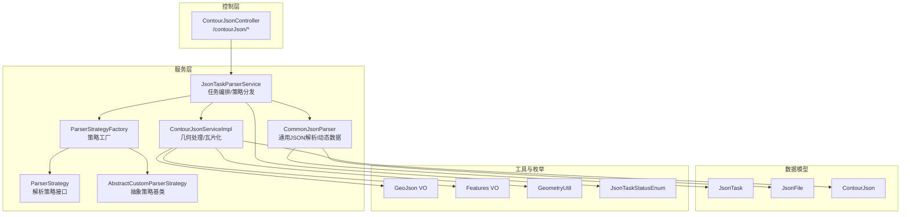
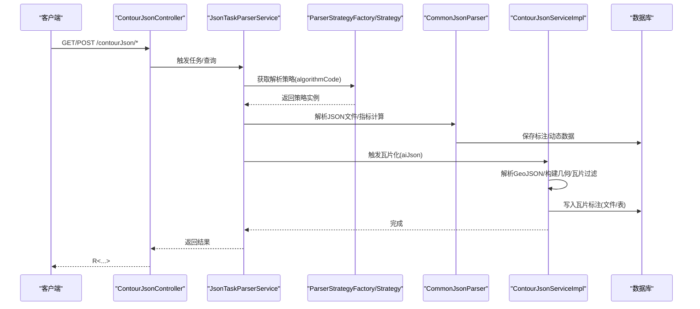
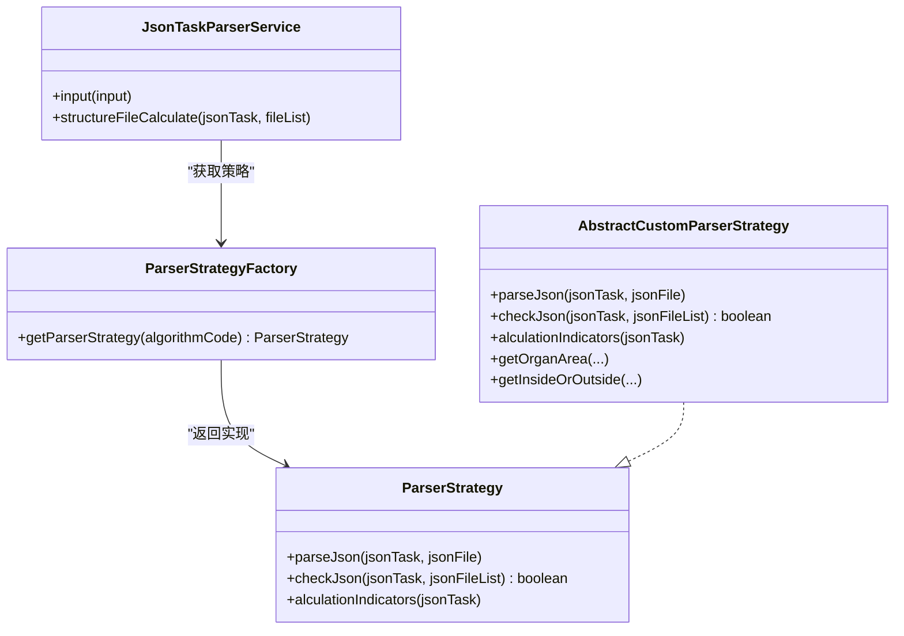
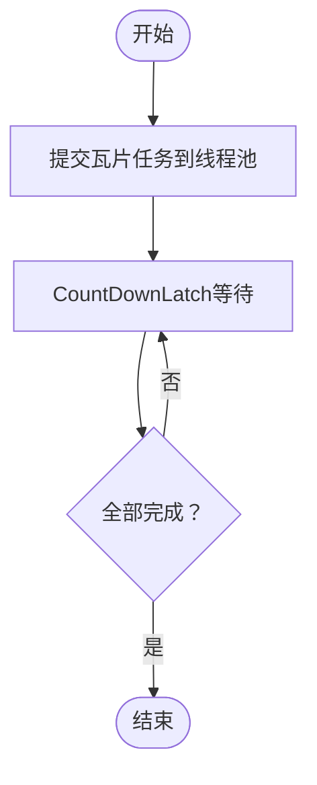
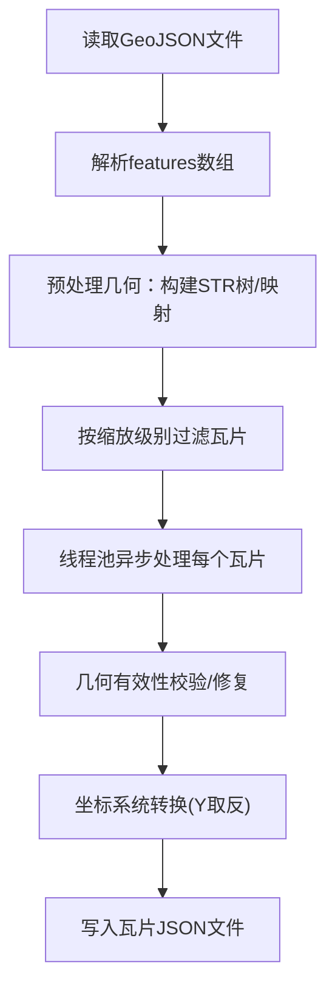
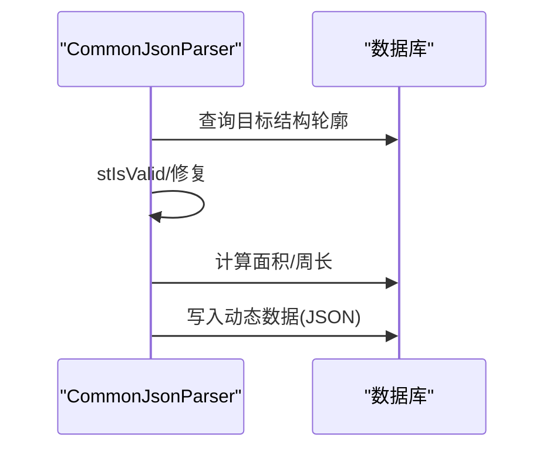
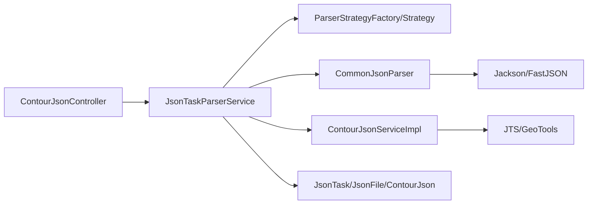

# JSON解析接口

<cite>
**本文档引用的文件**
- [ContourJsonController.java](file://src/main/java/cn/staitech/fr/controller/ContourJsonController.java)
- [ContourJsonServiceImpl.java](file://src/main/java/cn/staitech/fr/service/impl/ContourJsonServiceImpl.java)
- [JsonTaskParserService.java](file://src/main/java/cn/staitech/fr/service/strategy/json/JsonTaskParserService.java)
- [CommonJsonParser.java](file://src/main/java/cn/staitech/fr/service/strategy/json/CommonJsonParser.java)
- [ParserStrategyFactory.java](file://src/main/java/cn/staitech/fr/service/strategy/json/ParserStrategyFactory.java)
- [ParserStrategy.java](file://src/main/java/cn/staitech/fr/service/strategy/json/ParserStrategy.java)
- [AbstractCustomParserStrategy.java](file://src/main/java/cn/staitech/fr/service/strategy/json/AbstractCustomParserStrategy.java)
- [JsonTask.java](file://src/main/java/cn/staitech/fr/domain/JsonTask.java)
- [JsonFile.java](file://src/main/java/cn/staitech/fr/domain/JsonFile.java)
- [ContourJson.java](file://src/main/java/cn/staitech/fr/domain/ContourJson.java)
- [GeoJson.java](file://src/main/java/cn/staitech/fr/vo/geojson/GeoJson.java)
- [Features.java](file://src/main/java/cn/staitech/fr/vo/geojson/Features.java)
- [GeometryUtil.java](file://src/main/java/cn/staitech/fr/utils/GeometryUtil.java)
- [JsonTaskStatusEnum.java](file://src/main/java/cn/staitech/fr/enums/JsonTaskStatusEnum.java)
</cite>

## 目录
1. [简介](#简介)
2. [项目结构](#项目结构)
3. [核心组件](#核心组件)
4. [架构总览](#架构总览)
5. [详细组件分析](#详细组件分析)
6. [依赖关系分析](#依赖关系分析)
7. [性能考虑](#性能考虑)
8. [故障排查指南](#故障排查指南)
9. [结论](#结论)
10. [附录](#附录)

## 简介
本文件面向JSON解析相关接口，覆盖以下能力与流程：
- JSON文件上传与任务创建
- 解析任务调度与多算法策略支持
- 几何数据处理与瓦片化（Tile）输出
- ROI区域操作与动态数据融合
- 异步处理机制、错误处理与重试策略
- 性能监控与指标计算

接口目标用户包括后端开发者、算法工程师与运维人员。

## 项目结构
围绕JSON解析的关键模块如下：
- 控制层：提供REST接口，接收任务请求与文件下载
- 服务层：任务编排、策略分发、几何处理、瓦片生成
- 数据模型：任务、文件、标注、瓦片结果等
- 工具与枚举：几何解析、坐标系统、精度控制、状态枚举

**图表来源**
- [ContourJsonController.java:34-92](file://src/main/java/cn/staitech/fr/controller/ContourJsonController.java#L34-L92)
- [JsonTaskParserService.java:54-107](file://src/main/java/cn/staitech/fr/service/strategy/json/JsonTaskParserService.java#L54-L107)
- [ContourJsonServiceImpl.java:60-121](file://src/main/java/cn/staitech/fr/service/impl/ContourJsonServiceImpl.java#L60-L121)
- [CommonJsonParser.java:48-67](file://src/main/java/cn/staitech/fr/service/strategy/json/CommonJsonParser.java#L48-L67)
- [ParserStrategyFactory.java:16-43](file://src/main/java/cn/staitech/fr/service/strategy/json/ParserStrategyFactory.java#L16-L43)
- [ParserStrategy.java:14-32](file://src/main/java/cn/staitech/fr/service/strategy/json/ParserStrategy.java#L14-L32)
- [AbstractCustomParserStrategy.java:23-24](file://src/main/java/cn/staitech/fr/service/strategy/json/AbstractCustomParserStrategy.java#L23-L24)
- [JsonTask.java:26-67](file://src/main/java/cn/staitech/fr/domain/JsonTask.java#L26-L67)
- [JsonFile.java:22-50](file://src/main/java/cn/staitech/fr/domain/JsonFile.java#L22-L50)
- [ContourJson.java:17-91](file://src/main/java/cn/staitech/fr/domain/ContourJson.java#L17-L91)
- [GeoJson.java:9-17](file://src/main/java/cn/staitech/fr/vo/geojson/GeoJson.java#L9-L17)
- [Features.java:10-30](file://src/main/java/cn/staitech/fr/vo/geojson/Features.java#L10-L30)
- [GeometryUtil.java:20-75](file://src/main/java/cn/staitech/fr/utils/GeometryUtil.java#L20-L75)
- [JsonTaskStatusEnum.java:6-15](file://src/main/java/cn/staitech/fr/enums/JsonTaskStatusEnum.java#L6-L15)

**章节来源**
- [ContourJsonController.java:34-92](file://src/main/java/cn/staitech/fr/controller/ContourJsonController.java#L34-L92)
- [JsonTaskParserService.java:54-107](file://src/main/java/cn/staitech/fr/service/strategy/json/JsonTaskParserService.java#L54-L107)

## 核心组件
- 任务编排服务：负责任务输入、校验、文件解析、指标计算、瓦片化输出与状态管理
- 几何处理服务：负责GeoJSON解析、几何有效性校验、坐标系统转换、瓦片边界计算与输出
- 通用JSON解析器：负责标准JSON要素解析、动态数据注入、面积/周长计算
- 策略工厂与策略：支持多算法解析策略的注册与选择
- 控制器：提供下载与测试接口

**章节来源**
- [JsonTaskParserService.java:54-107](file://src/main/java/cn/staitech/fr/service/strategy/json/JsonTaskParserService.java#L54-L107)
- [ContourJsonServiceImpl.java:60-121](file://src/main/java/cn/staitech/fr/service/impl/ContourJsonServiceImpl.java#L60-L121)
- [CommonJsonParser.java:48-67](file://src/main/java/cn/staitech/fr/service/strategy/json/CommonJsonParser.java#L48-L67)
- [ParserStrategyFactory.java:16-43](file://src/main/java/cn/staitech/fr/service/strategy/json/ParserStrategyFactory.java#L16-L43)
- [ParserStrategy.java:14-32](file://src/main/java/cn/staitech/fr/service/strategy/json/ParserStrategy.java#L14-L32)
- [AbstractCustomParserStrategy.java:23-24](file://src/main/java/cn/staitech/fr/service/strategy/json/AbstractCustomParserStrategy.java#L23-L24)

## 架构总览
JSON解析流程从任务输入开始，经过策略选择、文件解析、指标计算，最终生成瓦片化的标注数据。

**图表来源**
- [ContourJsonController.java:54-91](file://src/main/java/cn/staitech/fr/controller/ContourJsonController.java#L54-L91)
- [JsonTaskParserService.java:174-263](file://src/main/java/cn/staitech/fr/service/strategy/json/JsonTaskParserService.java#L174-L263)
- [CommonJsonParser.java:209-297](file://src/main/java/cn/staitech/fr/service/strategy/json/CommonJsonParser.java#L209-L297)
- [ContourJsonServiceImpl.java:132-186](file://src/main/java/cn/staitech/fr/service/impl/ContourJsonServiceImpl.java#L132-L186)

## 详细组件分析

### 接口定义与参数规范

#### 1) JSON文件上传与任务创建
- 接口：POST /contourJson/test（测试接口）
- 请求参数：路径变量 taskId（Long，必填）
- 响应：R<…>，返回成功标记
- 说明：该接口用于触发基于任务ID的瓦片化处理流程，内部会查询任务与文件列表并调用几何处理服务。

**章节来源**
- [ContourJsonController.java:82-91](file://src/main/java/cn/staitech/fr/controller/ContourJsonController.java#L82-L91)

#### 2) 单脏器JSON下载
- 接口：GET /contourJson/selectList
- 请求参数：
  - slideId（Long，必填）
  - projectId（Long，必填）
  - organTagId（Long，必填）
- 响应：R<JsonFileVo>
- 说明：根据专题、切片与脏器标签查询对应的JSON文件列表，用于下载。

**章节来源**
- [ContourJsonController.java:54-60](file://src/main/java/cn/staitech/fr/controller/ContourJsonController.java#L54-L60)

#### 3) 多脏器文件大小查询
- 接口：GET /contourJson/getContourJsonSize
- 请求参数：
  - slideId（Long，必填）
  - projectId（Long，必填）
  - organTagIds（List<Long>，必填）
- 响应：R<ContourFileVo>
- 说明：批量获取多个脏器对应的JSON文件大小信息。

**章节来源**
- [ContourJsonController.java:73-79](file://src/main/java/cn/staitech/fr/controller/ContourJsonController.java#L73-L79)

### JSON解析策略与多算法支持
- 策略接口：ParserStrategy
  - parseJson(jsonTask, jsonFile)：单文件解析与存储
  - checkJson(jsonTask, jsonFileList)：JSON校验
  - alculationIndicators(jsonTask)：指标计算
- 策略工厂：ParserStrategyFactory
  - 通过algorithmCode获取具体策略实现
- 抽象策略基类：AbstractCustomParserStrategy
  - 提供常用指标构建、单位转换、脏器轮廓面积/周长获取等便捷方法

**图表来源**
- [ParserStrategy.java:14-32](file://src/main/java/cn/staitech/fr/service/strategy/json/ParserStrategy.java#L14-L32)
- [ParserStrategyFactory.java:16-43](file://src/main/java/cn/staitech/fr/service/strategy/json/ParserStrategyFactory.java#L16-L43)
- [AbstractCustomParserStrategy.java:23-24](file://src/main/java/cn/staitech/fr/service/strategy/json/AbstractCustomParserStrategy.java#L23-L24)
- [JsonTaskParserService.java:319-336](file://src/main/java/cn/staitech/fr/service/strategy/json/JsonTaskParserService.java#L319-L336)

**章节来源**
- [ParserStrategy.java:14-32](file://src/main/java/cn/staitech/fr/service/strategy/json/ParserStrategy.java#L14-L32)
- [ParserStrategyFactory.java:16-43](file://src/main/java/cn/staitech/fr/service/strategy/json/ParserStrategyFactory.java#L16-L43)
- [AbstractCustomParserStrategy.java:23-24](file://src/main/java/cn/staitech/fr/service/strategy/json/AbstractCustomParserStrategy.java#L23-L24)
- [JsonTaskParserService.java:319-336](file://src/main/java/cn/staitech/fr/service/strategy/json/JsonTaskParserService.java#L319-L336)

### 异步处理机制与线程池
- 任务线程池：JsonTaskParserService中注入的ExecutorService，使用TTL包装以传递上下文
- 几何处理线程池：ContourJsonServiceImpl内部自定义线程池，监控队列与活跃线程数
- 异步提交：submitPathList按瓦片列表异步提交任务，使用CountDownLatch等待完成
- 监控日志：在execute/beforeExecute/afterExecute阶段输出线程池状态

**图表来源**
- [JsonTaskParserService.java:94-107](file://src/main/java/cn/staitech/fr/service/strategy/json/JsonTaskParserService.java#L94-L107)
- [ContourJsonServiceImpl.java:85-121](file://src/main/java/cn/staitech/fr/service/impl/ContourJsonServiceImpl.java#L85-L121)
- [ContourJsonServiceImpl.java:389-415](file://src/main/java/cn/staitech/fr/service/impl/ContourJsonServiceImpl.java#L389-L415)

**章节来源**
- [JsonTaskParserService.java:94-107](file://src/main/java/cn/staitech/fr/service/strategy/json/JsonTaskParserService.java#L94-L107)
- [ContourJsonServiceImpl.java:85-121](file://src/main/java/cn/staitech/fr/service/impl/ContourJsonServiceImpl.java#L85-L121)
- [ContourJsonServiceImpl.java:389-415](file://src/main/java/cn/staitech/fr/service/impl/ContourJsonServiceImpl.java#L389-L415)

### 几何数据处理与瓦片化
- 输入：GeoJSON FeatureCollection，逐条解析features
- 几何有效性：使用JTS进行有效性校验与修复
- 坐标系统：采用8307投影（高斯-克吕格）；Y坐标取反以适配平台坐标系
- 瓦片化：根据缩放级别与瓦片尺寸（512）计算边界，按z-x-y命名输出
- 输出：按瓦片拆分的JSON文件，包含标注ID、属性与几何

**图表来源**
- [ContourJsonServiceImpl.java:198-241](file://src/main/java/cn/staitech/fr/service/impl/ContourJsonServiceImpl.java#L198-L241)
- [ContourJsonServiceImpl.java:311-371](file://src/main/java/cn/staitech/fr/service/impl/ContourJsonServiceImpl.java#L311-L371)
- [ContourJsonServiceImpl.java:501-581](file://src/main/java/cn/staitech/fr/service/impl/ContourJsonServiceImpl.java#L501-L581)
- [GeometryUtil.java:45-72](file://src/main/java/cn/staitech/fr/utils/GeometryUtil.java#L45-L72)

**章节来源**
- [ContourJsonServiceImpl.java:198-241](file://src/main/java/cn/staitech/fr/service/impl/ContourJsonServiceImpl.java#L198-L241)
- [ContourJsonServiceImpl.java:311-371](file://src/main/java/cn/staitech/fr/service/impl/ContourJsonServiceImpl.java#L311-L371)
- [ContourJsonServiceImpl.java:501-581](file://src/main/java/cn/staitech/fr/service/impl/ContourJsonServiceImpl.java#L501-L581)
- [GeometryUtil.java:45-72](file://src/main/java/cn/staitech/fr/utils/GeometryUtil.java#L45-L72)

### ROI区域操作与动态数据
- ROI计算：通过“体内/体外”布尔运算获取目标轮廓，支持stIsValid与stMakeValid修复
- 动态数据：将面积、周长、数量等指标写入动态数据字段，支持批量异步更新
- 单脏器轮廓：针对特定结构（如组织轮廓）直接写入标注表，同时计算面积/周长

**图表来源**
- [CommonJsonParser.java:475-508](file://src/main/java/cn/staitech/fr/service/strategy/json/CommonJsonParser.java#L475-L508)
- [CommonJsonParser.java:604-634](file://src/main/java/cn/staitech/fr/service/strategy/json/CommonJsonParser.java#L604-L634)

**章节来源**
- [CommonJsonParser.java:475-508](file://src/main/java/cn/staitech/fr/service/strategy/json/CommonJsonParser.java#L475-L508)
- [CommonJsonParser.java:604-634](file://src/main/java/cn/staitech/fr/service/strategy/json/CommonJsonParser.java#L604-L634)

### 错误处理、重试与性能监控
- 错误处理：
  - 任务输入校验失败：更新单滑块预测状态为失败
  - 文件缺失：记录日志并终止流程
  - 解析异常：捕获并抛出自定义异常
- 重试机制：
  - 线程池拒绝：记录告警，必要时手动countDown保证一致性
  - 可扩展：可在此基础上增加指数退避与最大重试次数
- 性能监控：
  - 任务线程池：初始化日志、队列长度、活跃线程数
  - 几何线程池：提交/开始/完成阶段日志
  - 文件大小统计：按MB统计，保留两位小数

**章节来源**
- [JsonTaskParserService.java:174-263](file://src/main/java/cn/staitech/fr/service/strategy/json/JsonTaskParserService.java#L174-L263)
- [ContourJsonServiceImpl.java:104-120](file://src/main/java/cn/staitech/fr/service/impl/ContourJsonServiceImpl.java#L104-L120)
- [ContourJsonServiceImpl.java:401-413](file://src/main/java/cn/staitech/fr/service/impl/ContourJsonServiceImpl.java#L401-L413)

## 依赖关系分析
- 控制层依赖服务层；服务层依赖策略工厂与策略接口
- 几何处理依赖JTS与GeoTools；通用解析依赖Jackson/FastJSON
- 数据模型贯穿各层，作为任务、文件与结果的载体

**图表来源**
- [ContourJsonController.java:34-92](file://src/main/java/cn/staitech/fr/controller/ContourJsonController.java#L34-L92)
- [JsonTaskParserService.java:54-107](file://src/main/java/cn/staitech/fr/service/strategy/json/JsonTaskParserService.java#L54-L107)
- [CommonJsonParser.java:48-67](file://src/main/java/cn/staitech/fr/service/strategy/json/CommonJsonParser.java#L48-L67)
- [ContourJsonServiceImpl.java:60-121](file://src/main/java/cn/staitech/fr/service/impl/ContourJsonServiceImpl.java#L60-L121)

**章节来源**
- [ContourJsonController.java:34-92](file://src/main/java/cn/staitech/fr/controller/ContourJsonController.java#L34-L92)
- [JsonTaskParserService.java:54-107](file://src/main/java/cn/staitech/fr/service/strategy/json/JsonTaskParserService.java#L54-L107)
- [CommonJsonParser.java:48-67](file://src/main/java/cn/staitech/fr/service/strategy/json/CommonJsonParser.java#L48-L67)
- [ContourJsonServiceImpl.java:60-121](file://src/main/java/cn/staitech/fr/service/impl/ContourJsonServiceImpl.java#L60-L121)

## 性能考虑
- 流式解析：使用Jackson Streaming API逐条读取features，降低内存占用
- 批量处理：按批次（如4000/5000）处理要素，减少数据库往返
- 并行处理：多线程池并行处理瓦片与动态数据，提升吞吐
- 精度控制：面积/周长计算使用BigDecimal，保留三位小数，避免浮点误差
- 瓦片化优化：预构建STR树加速空间查询，按缩放级别过滤瓦片

[本节为通用指导，无需列出具体文件来源]

## 故障排查指南
- 任务状态异常
  - 检查JsonTaskStatusEnum状态流转与更新逻辑
  - 关注任务唯一性约束冲突与重复任务处理
- 文件解析失败
  - 校验JSON结构与features字段
  - 检查文件路径是否存在与权限
- 几何无效
  - 使用stIsValid/修复流程
  - 确认坐标系统与Y轴取反逻辑
- 线程池问题
  - 查看线程池监控日志，定位队列堆积与拒绝原因
  - 调整线程池参数或增加资源

**章节来源**
- [JsonTaskStatusEnum.java:6-15](file://src/main/java/cn/staitech/fr/enums/JsonTaskStatusEnum.java#L6-L15)
- [JsonTaskParserService.java:174-263](file://src/main/java/cn/staitech/fr/service/strategy/json/JsonTaskParserService.java#L174-L263)
- [ContourJsonServiceImpl.java:104-120](file://src/main/java/cn/staitech/fr/service/impl/ContourJsonServiceImpl.java#L104-L120)
- [CommonJsonParser.java:475-508](file://src/main/java/cn/staitech/fr/service/strategy/json/CommonJsonParser.java#L475-L508)

## 结论
本接口体系以任务驱动为核心，结合多算法策略与高效的几何处理能力，实现了从JSON上传到瓦片化标注的完整链路。通过异步线程池与流式解析，兼顾性能与稳定性；通过ROI布尔运算与动态数据注入，满足复杂指标计算需求。建议在生产环境中配合完善的监控与告警机制，持续优化线程池与IO参数。

[本节为总结性内容，无需列出具体文件来源]

## 附录

### 数据模型与字段说明
- JsonTask：任务元数据、状态、时间戳、算法标识
- JsonFile：文件路径、结构编码/名称、状态、AI识别状态
- ContourJson：瓦片化结果（瓦片名、不同结构大小的文件字段）

**章节来源**
- [JsonTask.java:26-67](file://src/main/java/cn/staitech/fr/domain/JsonTask.java#L26-L67)
- [JsonFile.java:22-50](file://src/main/java/cn/staitech/fr/domain/JsonFile.java#L22-L50)
- [ContourJson.java:17-91](file://src/main/java/cn/staitech/fr/domain/ContourJson.java#L17-L91)

### 几何数据格式与坐标系统
- 几何类型：支持Polygon/MultiPolygon
- 坐标系统：8307投影；Y坐标取反以适配平台坐标系
- 精度控制：面积/周长计算使用BigDecimal，保留三位小数

**章节来源**
- [GeometryUtil.java:45-72](file://src/main/java/cn/staitech/fr/utils/GeometryUtil.java#L45-L72)
- [ContourJsonServiceImpl.java:625-647](file://src/main/java/cn/staitech/fr/service/impl/ContourJsonServiceImpl.java#L625-L647)
- [ContourJsonServiceImpl.java:718-735](file://src/main/java/cn/staitech/fr/service/impl/ContourJsonServiceImpl.java#L718-L735)