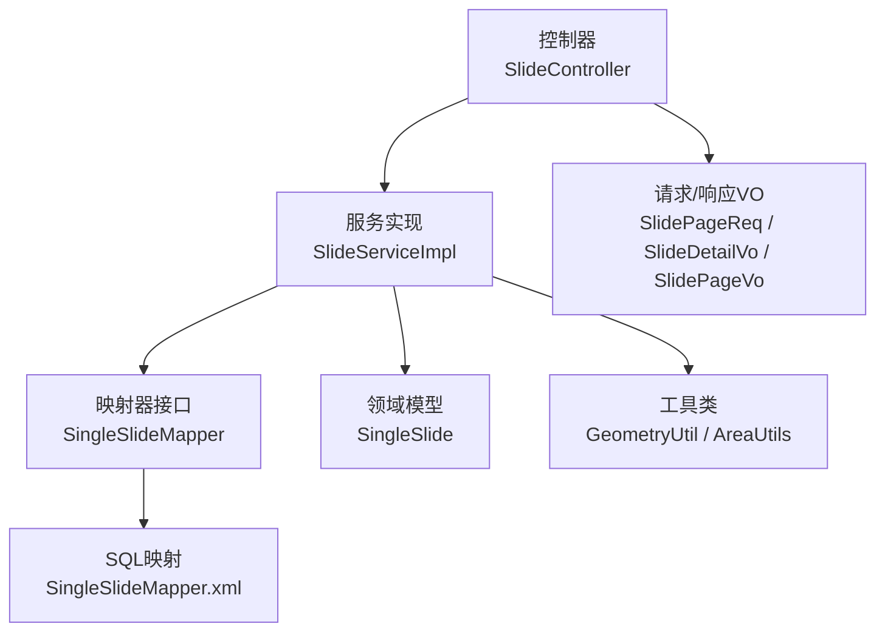
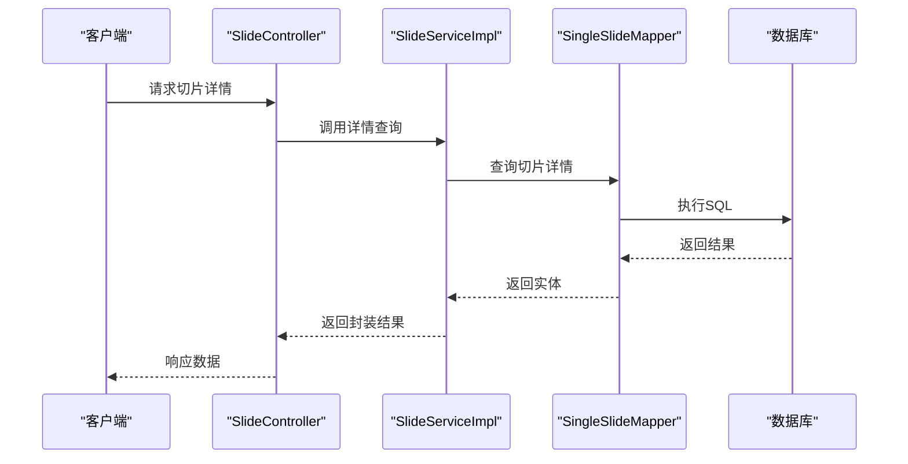
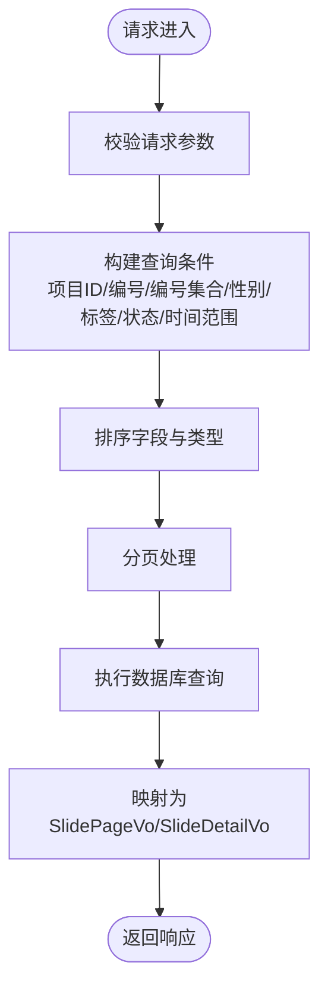
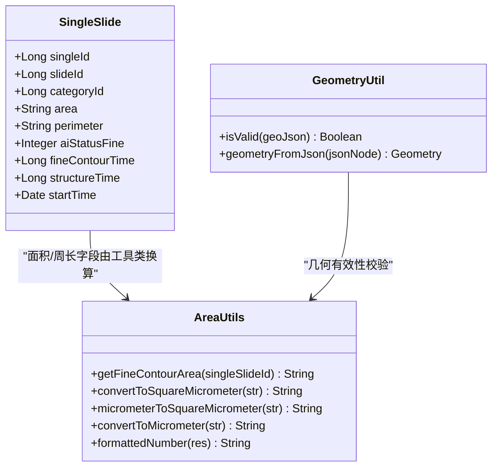
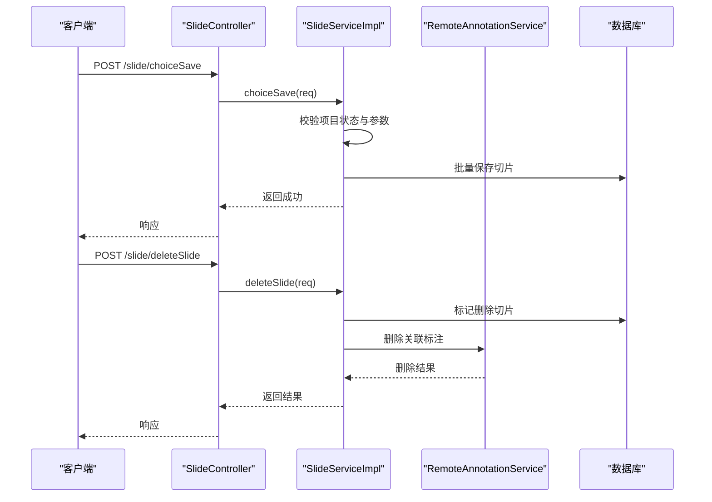
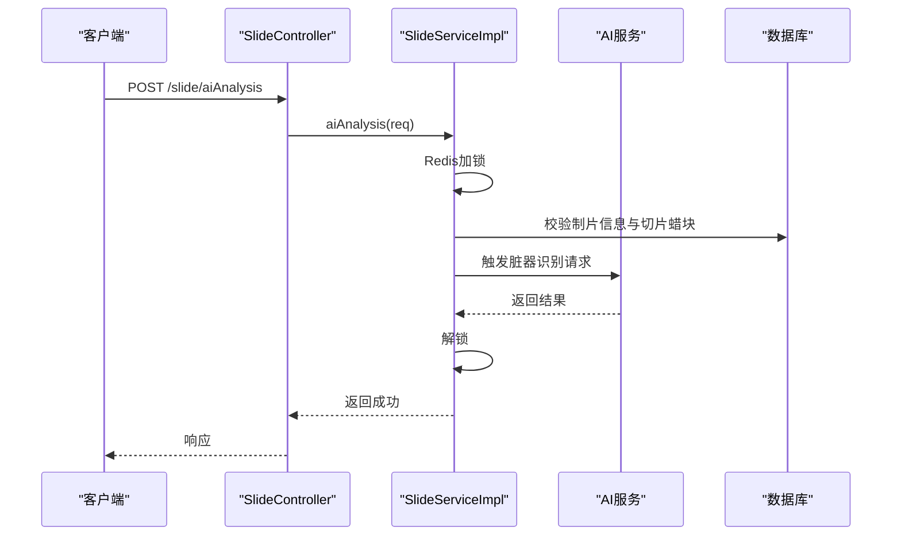
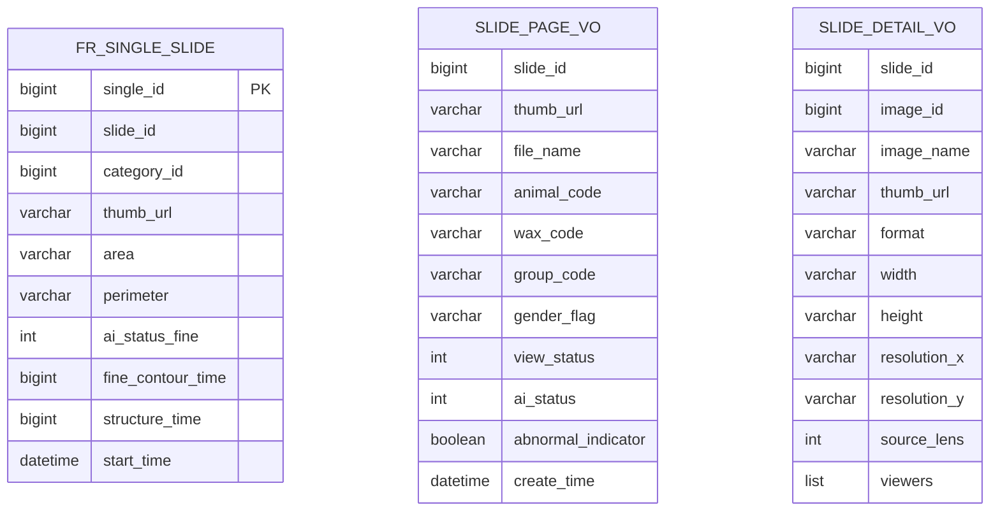
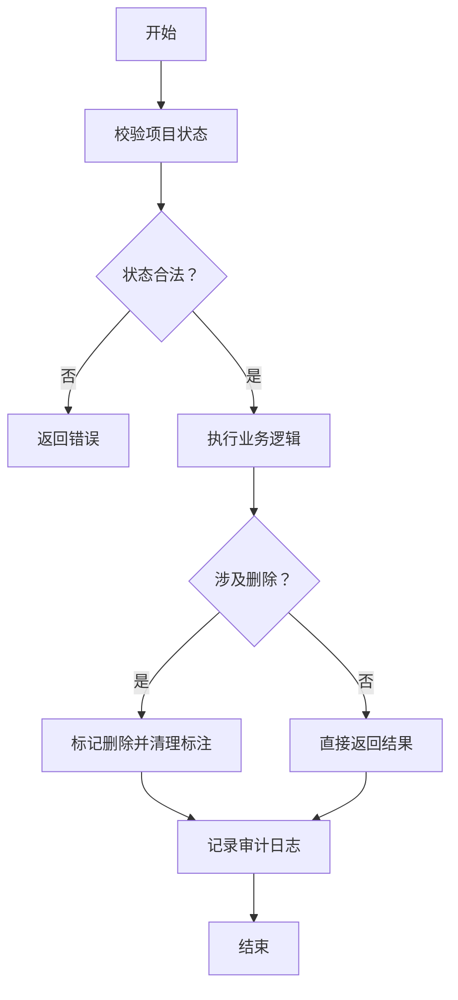
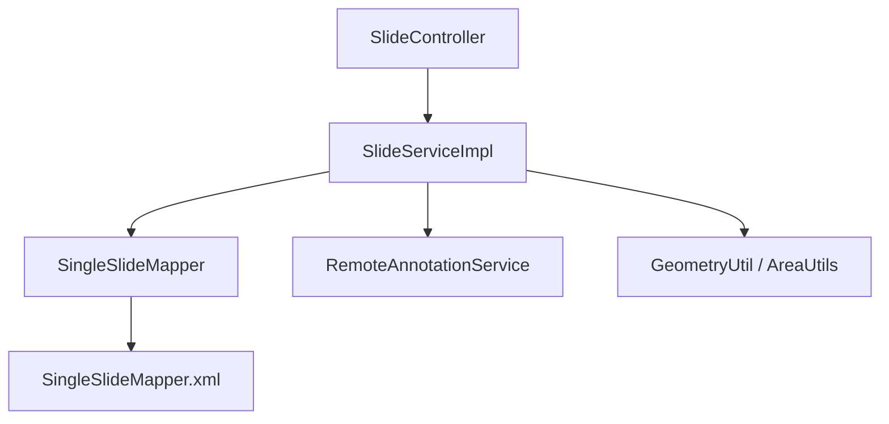

# 单切片处理接口

<cite>
**本文引用的文件**
- [SlideController.java](file://src/main/java/cn/staitech/fr/controller/SlideController.java)
- [SlideServiceImpl.java](file://src/main/java/cn/staitech/fr/service/impl/SlideServiceImpl.java)
- [SingleSlide.java](file://src/main/java/cn/staitech/fr/domain/SingleSlide.java)
- [SingleSlideMapper.java](file://src/main/java/cn/staitech/fr/mapper/SingleSlideMapper.java)
- [SingleSlideMapper.xml](file://src/main/resources/mapper/SingleSlideMapper.xml)
- [SlidePageReq.java](file://src/main/java/cn/staitech/fr/vo/project/slide/SlidePageReq.java)
- [SlideDetailVo.java](file://src/main/java/cn/staitech/fr/vo/project/slide/SlideDetailVo.java)
- [SlidePageVo.java](file://src/main/java/cn/staitech/fr/vo/project/slide/SlidePageVo.java)
- [SlideInfoReq.java](file://src/main/java/cn/staitech/fr/domain/in/SlideInfoReq.java)
- [SlideSelectListReq.java](file://src/main/java/cn/staitech/fr/vo/project/slide/SlideSelectListReq.java)
- [SlideListReq.java](file://src/main/java/cn/staitech/fr/vo/project/slide/SlideListReq.java)
- [SlideOrganTagVo.java](file://src/main/java/cn/staitech/fr/vo/project/slide/SlideOrganTagVo.java)
- [SlideInfo.java](file://src/main/java/cn/staitech/fr/vo/project/slide/SlideInfo.java)
- [GeometryUtil.java](file://src/main/java/cn/staitech/fr/utils/GeometryUtil.java)
- [AreaUtils.java](file://src/main/java/cn/staitech/fr/utils/AreaUtils.java)
</cite>

## 目录
1. [简介](#简介)
2. [项目结构](#项目结构)
3. [核心组件](#核心组件)
4. [架构概览](#架构概览)
5. [详细组件分析](#详细组件分析)
6. [依赖分析](#依赖分析)
7. [性能考虑](#性能考虑)
8. [故障排除指南](#故障排除指南)
9. [结论](#结论)

## 简介
本文件面向单切片处理相关接口的全面API文档，涵盖切片信息查询、面积与周长计算、切片详情获取、脏器识别与校对、AI分析、选片与删除等核心能力。文档详细说明了单切片数据模型、几何计算接口、批量操作接口的参数定义与返回值格式，并提供切片选择、过滤条件、排序规则等查询参数说明，以及业务流程、数据验证规则和异常处理机制。

## 项目结构
围绕单切片处理的相关模块主要分布在以下层次：
- 控制层：提供REST接口，负责请求接收、鉴权与响应封装
- 服务层：实现业务逻辑，包括权限校验、项目状态检查、AI分析调度、脏器识别校对等
- 数据访问层：MyBatis映射器与XML SQL，负责数据库交互
- 领域模型与VO：定义单切片实体、查询参数、返回视图等
- 工具类：几何校验与面积单位换算工具

**图表来源**
- [SlideController.java:1-260](file://src/main/java/cn/staitech/fr/controller/SlideController.java#L1-L260)
- [SlideServiceImpl.java:1-800](file://src/main/java/cn/staitech/fr/service/impl/SlideServiceImpl.java#L1-L800)
- [SingleSlideMapper.java:1-66](file://src/main/java/cn/staitech/fr/mapper/SingleSlideMapper.java#L1-L66)
- [SingleSlideMapper.xml:1-277](file://src/main/resources/mapper/SingleSlideMapper.xml#L1-L277)
- [SingleSlide.java:1-77](file://src/main/java/cn/staitech/fr/domain/SingleSlide.java#L1-L77)
- [GeometryUtil.java:1-76](file://src/main/java/cn/staitech/fr/utils/GeometryUtil.java#L1-L76)
- [AreaUtils.java:1-208](file://src/main/java/cn/staitech/fr/utils/AreaUtils.java#L1-L208)

**章节来源**
- [SlideController.java:1-260](file://src/main/java/cn/staitech/fr/controller/SlideController.java#L1-L260)
- [SlideServiceImpl.java:1-800](file://src/main/java/cn/staitech/fr/service/impl/SlideServiceImpl.java#L1-L800)

## 核心组件
- 控制器层：提供切片查询、详情获取、选片、删除、AI分析、脏器识别校对等接口
- 服务层：实现权限校验、项目状态检查、批量操作、AI分析调度、脏器识别校对、指标对比与高亮
- 数据访问层：提供单切片查询、面积/周长范围查询、导出信息查询等SQL映射
- 领域模型：单切片实体包含面积、周长、预测状态、诊断状态等字段
- 工具类：几何有效性校验、面积单位换算

**章节来源**
- [SlideController.java:47-260](file://src/main/java/cn/staitech/fr/controller/SlideController.java#L47-L260)
- [SlideServiceImpl.java:64-800](file://src/main/java/cn/staitech/fr/service/impl/SlideServiceImpl.java#L64-L800)
- [SingleSlide.java:18-77](file://src/main/java/cn/staitech/fr/domain/SingleSlide.java#L18-L77)
- [SingleSlideMapper.java:19-66](file://src/main/java/cn/staitech/fr/mapper/SingleSlideMapper.java#L19-L66)
- [SingleSlideMapper.xml:113-276](file://src/main/resources/mapper/SingleSlideMapper.xml#L113-L276)
- [GeometryUtil.java:20-76](file://src/main/java/cn/staitech/fr/utils/GeometryUtil.java#L20-L76)
- [AreaUtils.java:27-208](file://src/main/java/cn/staitech/fr/utils/AreaUtils.java#L27-L208)

## 架构概览
单切片处理接口遵循典型的三层架构：
- 接口层：REST控制器接收请求，进行基础校验与鉴权
- 业务层：服务实现复杂业务逻辑，如项目状态校验、权限控制、AI分析调度、脏器识别校对
- 数据访问层：MyBatis映射器与XML SQL执行数据库查询与统计

**图表来源**
- [SlideController.java:176-181](file://src/main/java/cn/staitech/fr/controller/SlideController.java#L176-L181)
- [SlideServiceImpl.java:438-453](file://src/main/java/cn/staitech/fr/service/impl/SlideServiceImpl.java#L438-L453)
- [SingleSlideMapper.xml:196-231](file://src/main/resources/mapper/SingleSlideMapper.xml#L196-L231)

## 详细组件分析

### 切片信息查询与详情
- 接口：POST /slide/page（分页查询）
  - 请求体：SlidePageReq
  - 支持过滤条件：项目ID、切片编号、动物编号集合、蜡块编号集合、组号集合、性别、脏器标签ID集合、阅片状态、AI分析状态、描述、创建时间范围、是否处理指标异常、是否归档查询、是否过滤异常状态、排序字段与类型、是否已阅、当前登录人
  - 返回：分页结果SlidePageVo列表
- 接口：POST /slide/list（按ID集合查询）
  - 请求体：SlideListReq（包含项目ID与切片ID集合）
  - 返回：SlidePageVo列表
- 接口：POST /slide/slideInfo（切片详情）
  - 请求体：SlideInfoReq（包含切片ID）
  - 返回：SlideDetailVo（包含图像信息、缩略图、分辨率、阅片用户等）

**图表来源**
- [SlidePageReq.java:16-124](file://src/main/java/cn/staitech/fr/vo/project/slide/SlidePageReq.java#L16-L124)
- [SlideListReq.java:13-36](file://src/main/java/cn/staitech/fr/vo/project/slide/SlideListReq.java#L13-L36)
- [SlideInfoReq.java:9-14](file://src/main/java/cn/staitech/fr/domain/in/SlideInfoReq.java#L9-L14)
- [SlidePageVo.java:20-120](file://src/main/java/cn/staitech/fr/vo/project/slide/SlidePageVo.java#L20-L120)
- [SlideDetailVo.java:19-143](file://src/main/java/cn/staitech/fr/vo/project/slide/SlideDetailVo.java#L19-L143)

**章节来源**
- [SlideController.java:93-181](file://src/main/java/cn/staitech/fr/controller/SlideController.java#L93-L181)
- [SlideServiceImpl.java:104-141](file://src/main/java/cn/staitech/fr/service/impl/SlideServiceImpl.java#L104-L141)

### 几何计算与面积/周长接口
- 单切片实体包含面积与周长字段，可通过工具类进行单位换算与格式化
- 几何有效性校验：支持GeoJSON多边形/复合多边形解析与有效性判断
- 面积换算工具：
  - 平方毫米 → 平方微米
  - 平方毫米 → 10³平方微米
  - 微米 → 平方微米
  - 数字格式化

**图表来源**
- [SingleSlide.java:20-77](file://src/main/java/cn/staitech/fr/domain/SingleSlide.java#L20-L77)
- [GeometryUtil.java:20-76](file://src/main/java/cn/staitech/fr/utils/GeometryUtil.java#L20-L76)
- [AreaUtils.java:27-208](file://src/main/java/cn/staitech/fr/utils/AreaUtils.java#L27-L208)

**章节来源**
- [SingleSlide.java:56-76](file://src/main/java/cn/staitech/fr/domain/SingleSlide.java#L56-L76)
- [GeometryUtil.java:22-72](file://src/main/java/cn/staitech/fr/utils/GeometryUtil.java#L22-L72)
- [AreaUtils.java:45-114](file://src/main/java/cn/staitech/fr/utils/AreaUtils.java#L45-L114)

### 批量操作接口
- 选片保存：POST /slide/choiceSave（保存所选图像为切片）
- 全部选片：POST /slide/choiceAll（基于专题下的可用图像批量生成切片）
- 删除切片：POST /slide/deleteSlide 与 /slide/deleteSlideByIds（删除切片并联动清理标注）
- 检查删除：POST /slide/checkDeleteSlide（检查切片是否有关联标注）

**图表来源**
- [SlideController.java:126-150](file://src/main/java/cn/staitech/fr/controller/SlideController.java#L126-L150)
- [SlideServiceImpl.java:168-359](file://src/main/java/cn/staitech/fr/service/impl/SlideServiceImpl.java#L168-L359)

**章节来源**
- [SlideController.java:124-157](file://src/main/java/cn/staitech/fr/controller/SlideController.java#L124-L157)
- [SlideServiceImpl.java:168-359](file://src/main/java/cn/staitech/fr/service/impl/SlideServiceImpl.java#L168-L359)

### 脏器识别与校对
- 脏器识别校对（Python服务使用）：POST /slide/organCheck
- 脏器识别校对（View页面数据）：POST /slide/organCheckView
- 脏器识别确认修改：POST /slide/organCheckConfirm
- AI分析：POST /slide/aiAnalysis（基于Redis分布式锁，校验制片信息完整性后触发AI服务）

**图表来源**
- [SlideController.java:200-222](file://src/main/java/cn/staitech/fr/controller/SlideController.java#L200-L222)
- [SlideServiceImpl.java:488-543](file://src/main/java/cn/staitech/fr/service/impl/SlideServiceImpl.java#L488-L543)

**章节来源**
- [SlideController.java:206-222](file://src/main/java/cn/staitech/fr/controller/SlideController.java#L206-L222)
- [SlideServiceImpl.java:488-701](file://src/main/java/cn/staitech/fr/service/impl/SlideServiceImpl.java#L488-L701)

### 下拉列表与筛选
- 动物编号下拉：POST /slide/getAnimalCode
- 蜡块编号下拉：POST /slide/getWaxCode
- 组号下拉：POST /slide/getGroupCode
- 脏器标签下拉：POST /slide/getOrganCode
- 机构编码：POST /slide/getOrganizationCode
- AI切片完成状态：POST /slide/isAiSlideFinished

**章节来源**
- [SlideController.java:60-89](file://src/main/java/cn/staitech/fr/controller/SlideController.java#L60-L89)
- [SlideServiceImpl.java:456-485](file://src/main/java/cn/staitech/fr/service/impl/SlideServiceImpl.java#L456-L485)

### 单切片数据模型
- 单切片实体：SingleSlide
  - 关键字段：单切片ID、切片ID、脏器类别ID、缩略图URL、面积、周长、预测状态、诊断状态、异常状态、时间统计等
- 切片详情视图：SlideDetailVo
  - 包含图像ID、图像名称、缩略图、分辨率、阅片用户列表等
- 列表视图：SlidePageVo
  - 包含切片ID、缩略图、编号、动物/蜡块/组号、性别、阅片状态、AI状态、异常标识、脏器状态集合、描述、创建时间等

**图表来源**
- [SingleSlide.java:20-77](file://src/main/java/cn/staitech/fr/domain/SingleSlide.java#L20-L77)
- [SlidePageVo.java:20-120](file://src/main/java/cn/staitech/fr/vo/project/slide/SlidePageVo.java#L20-L120)
- [SlideDetailVo.java:19-143](file://src/main/java/cn/staitech/fr/vo/project/slide/SlideDetailVo.java#L19-L143)

**章节来源**
- [SingleSlide.java:20-77](file://src/main/java/cn/staitech/fr/domain/SingleSlide.java#L20-L77)
- [SlidePageVo.java:20-120](file://src/main/java/cn/staitech/fr/vo/project/slide/SlidePageVo.java#L20-L120)
- [SlideDetailVo.java:19-143](file://src/main/java/cn/staitech/fr/vo/project/slide/SlideDetailVo.java#L19-L143)

### 查询参数与过滤规则
- SlidePageReq
  - 过滤：项目ID、切片编号、动物编号集合、蜡块编号集合、组号集合、性别、脏器标签ID集合、阅片状态、AI分析状态、描述、创建时间范围
  - 行为：是否处理指标异常、是否归档查询、是否过滤异常状态、排序字段与类型、是否已阅、当前登录人
- SlideListReq
  - 必填：项目ID、切片ID集合
  - 附加：脏器标签ID集合（用于搜索条件传递）、当前登录人
- SlideSelectListReq
  - 项目ID、机构ID（用于下拉列表筛选）

**章节来源**
- [SlidePageReq.java:16-124](file://src/main/java/cn/staitech/fr/vo/project/slide/SlidePageReq.java#L16-L124)
- [SlideListReq.java:13-36](file://src/main/java/cn/staitech/fr/vo/project/slide/SlideListReq.java#L13-L36)
- [SlideSelectListReq.java:7-14](file://src/main/java/cn/staitech/fr/vo/project/slide/SlideSelectListReq.java#L7-L14)

### 业务流程与异常处理
- 权限与状态校验：项目不存在、用户无访问权限、项目状态不可访问（运行中/已完成/暂停但无权限）
- 批量操作：保存/删除切片时进行项目状态检查与参数校验，删除时联动清理标注并记录审计
- AI分析：Redis分布式锁避免重复触发；校验制片信息完整性后再发起请求
- 脏器识别校对：比较AI识别标签与制片信息标签一致性，支持View页面展示与确认修改

**图表来源**
- [SlideServiceImpl.java:104-141](file://src/main/java/cn/staitech/fr/service/impl/SlideServiceImpl.java#L104-L141)
- [SlideServiceImpl.java:381-397](file://src/main/java/cn/staitech/fr/service/impl/SlideServiceImpl.java#L381-L397)
- [SlideServiceImpl.java:282-359](file://src/main/java/cn/staitech/fr/service/impl/SlideServiceImpl.java#L282-L359)

**章节来源**
- [SlideServiceImpl.java:104-141](file://src/main/java/cn/staitech/fr/service/impl/SlideServiceImpl.java#L104-L141)
- [SlideServiceImpl.java:381-397](file://src/main/java/cn/staitech/fr/service/impl/SlideServiceImpl.java#L381-L397)
- [SlideServiceImpl.java:282-359](file://src/main/java/cn/staitech/fr/service/impl/SlideServiceImpl.java#L282-L359)

## 依赖分析
- 控制器依赖服务实现，服务实现依赖映射器与远程服务
- 映射器XML提供SQL查询与统计，如面积范围、导出信息、数量统计等
- 工具类为业务层提供几何与面积计算支撑

**图表来源**
- [SlideController.java:51-260](file://src/main/java/cn/staitech/fr/controller/SlideController.java#L51-L260)
- [SlideServiceImpl.java:64-96](file://src/main/java/cn/staitech/fr/service/impl/SlideServiceImpl.java#L64-L96)
- [SingleSlideMapper.java:19-66](file://src/main/java/cn/staitech/fr/mapper/SingleSlideMapper.java#L19-L66)
- [SingleSlideMapper.xml:1-277](file://src/main/resources/mapper/SingleSlideMapper.xml#L1-L277)

**章节来源**
- [SlideController.java:51-260](file://src/main/java/cn/staitech/fr/controller/SlideController.java#L51-L260)
- [SlideServiceImpl.java:64-96](file://src/main/java/cn/staitech/fr/service/impl/SlideServiceImpl.java#L64-L96)
- [SingleSlideMapper.java:19-66](file://src/main/java/cn/staitech/fr/mapper/SingleSlideMapper.java#L19-L66)
- [SingleSlideMapper.xml:1-277](file://src/main/resources/mapper/SingleSlideMapper.xml#L1-L277)

## 性能考虑
- 分页查询：合理设置分页大小与排序字段，避免全表扫描
- 过滤条件：优先使用索引列（如项目ID、切片ID、蜡块编号、动物编号），减少不必要的字符串匹配
- 批量操作：批量保存/删除时利用批处理接口，减少事务开销
- 缓存与锁：AI分析与脏器识别确认采用Redis分布式锁，避免重复触发
- 导出与统计：SQL层面进行聚合与排序，减少应用层处理

## 故障排除指南
- 项目状态错误：当项目处于运行中、已完成或暂停且无权限时，接口会返回相应错误码
- 参数校验失败：请求体为空或必填字段缺失将触发校验错误
- 权限不足：用户无访问权限或非项目成员时拒绝访问
- 删除失败：若切片存在关联标注，需先清理标注再删除
- AI分析异常：制片信息缺失或AI服务不可达时返回错误提示

**章节来源**
- [SlideServiceImpl.java:111-134](file://src/main/java/cn/staitech/fr/service/impl/SlideServiceImpl.java#L111-L134)
- [SlideServiceImpl.java:170-174](file://src/main/java/cn/staitech/fr/service/impl/SlideServiceImpl.java#L170-L174)
- [SlideServiceImpl.java:362-373](file://src/main/java/cn/staitech/fr/service/impl/SlideServiceImpl.java#L362-L373)
- [SlideServiceImpl.java:498-519](file://src/main/java/cn/staitech/fr/service/impl/SlideServiceImpl.java#L498-L519)

## 结论
单切片处理接口围绕切片查询、详情获取、批量操作、几何计算与面积/周长换算、AI分析与脏器识别校对等核心能力构建，具备完善的参数过滤、权限校验与异常处理机制。通过清晰的分层设计与工具类支撑，能够满足多场景下的单切片数据处理需求。