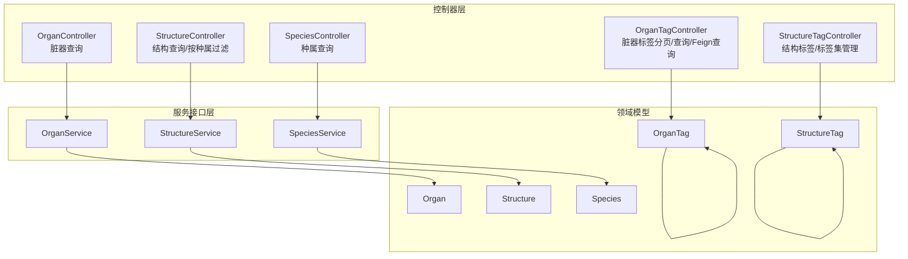
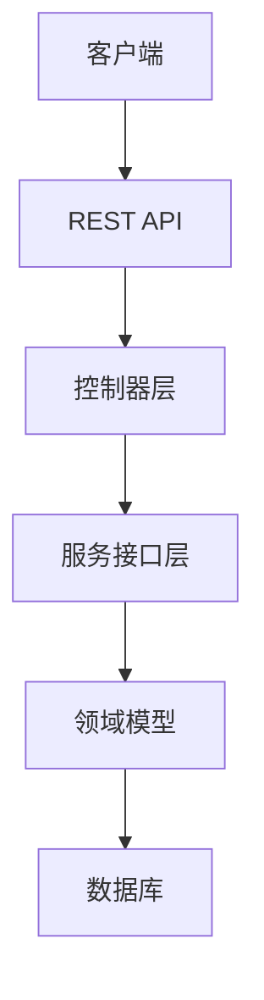
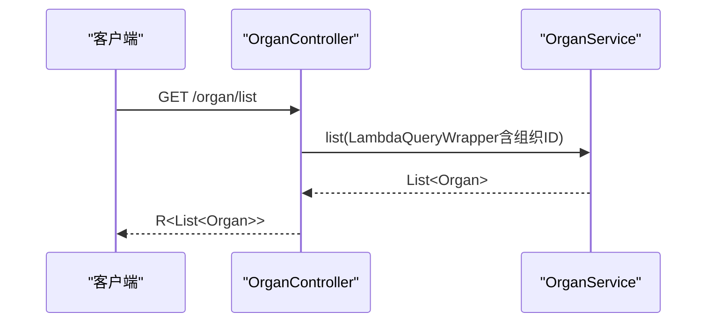
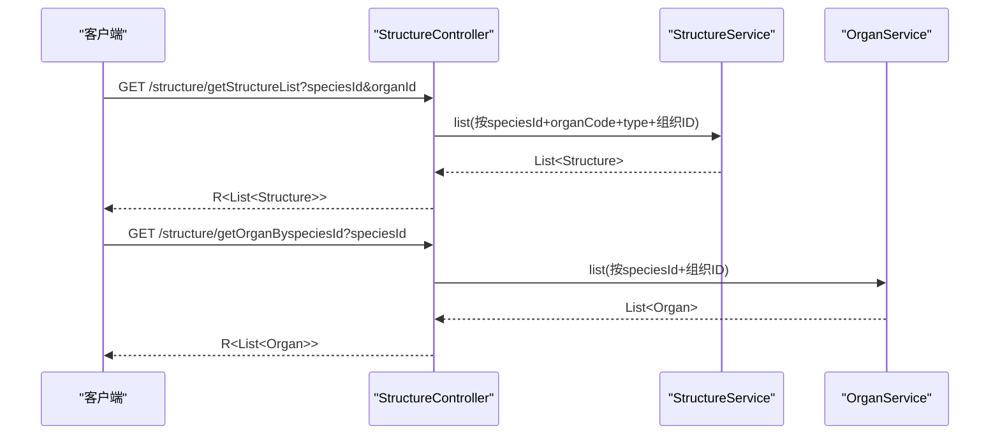
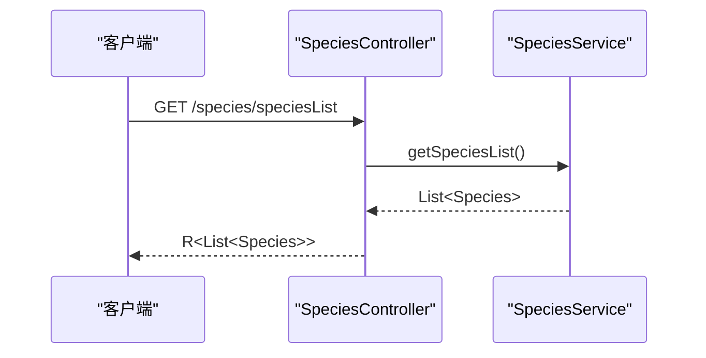
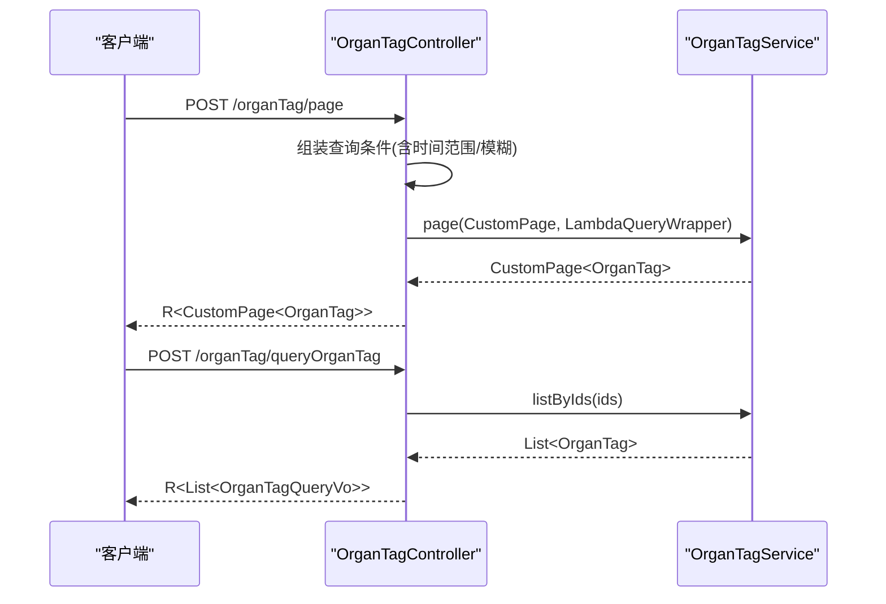
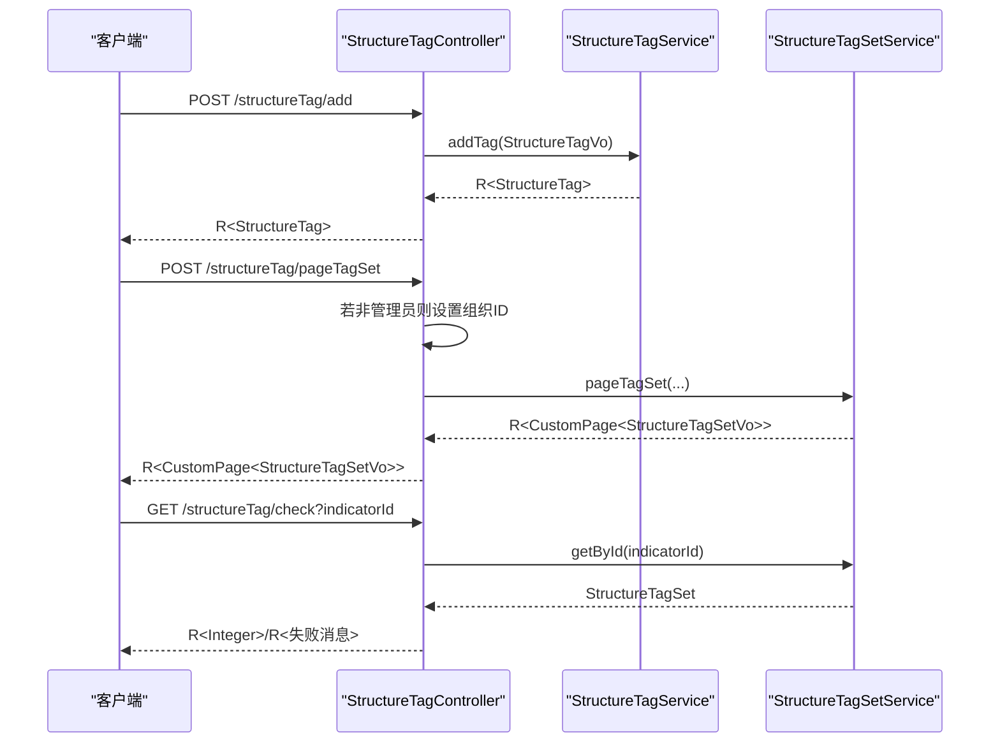
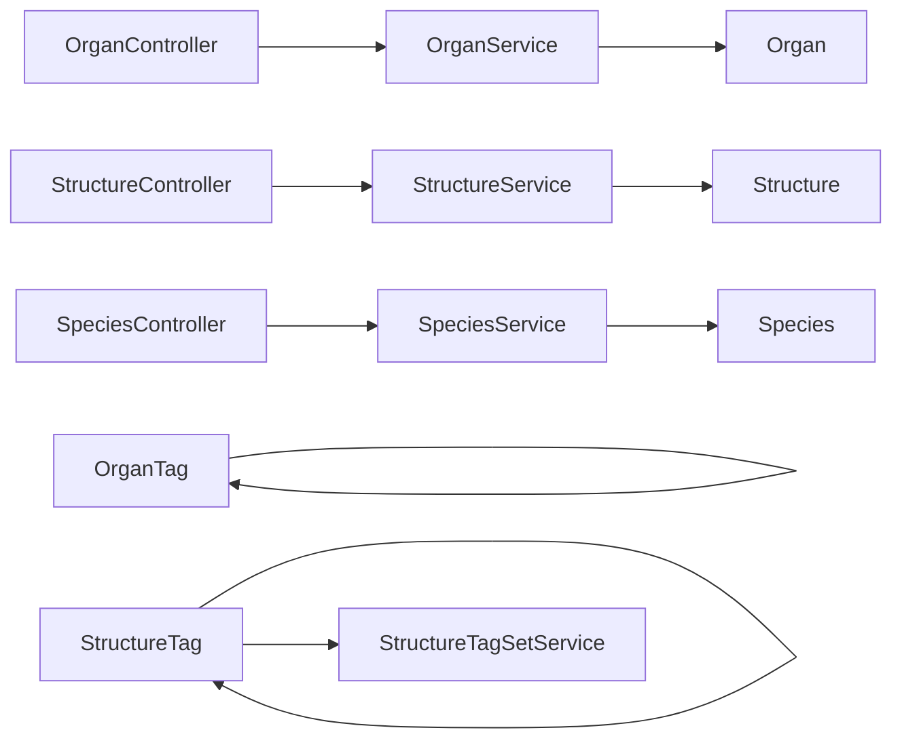
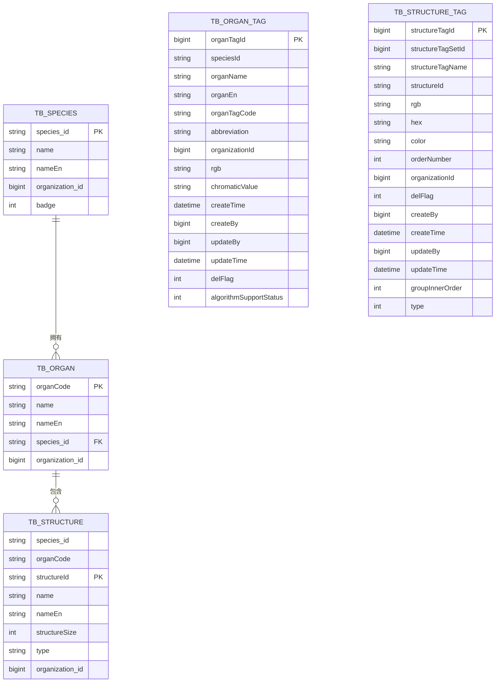

# 器官结构接口

<cite>
**本文引用的文件**
- [OrganController.java](file://src/main/java/cn/staitech/fr/controller/OrganController.java)
- [StructureController.java](file://src/main/java/cn/staitech/fr/controller/StructureController.java)
- [SpeciesController.java](file://src/main/java/cn/staitech/fr/controller/SpeciesController.java)
- [OrganTagController.java](file://src/main/java/cn/staitech/fr/controller/OrganTagController.java)
- [StructureTagController.java](file://src/main/java/cn/staitech/fr/controller/StructureTagController.java)
- [Organ.java](file://src/main/java/cn/staitech/fr/domain/Organ.java)
- [Structure.java](file://src/main/java/cn/staitech/fr/domain/Structure.java)
- [Species.java](file://src/main/java/cn/staitech/fr/domain/Species.java)
- [OrganTag.java](file://src/main/java/cn/staitech/fr/domain/OrganTag.java)
- [StructureTag.java](file://src/main/java/cn/staitech/fr/domain/StructureTag.java)
- [StructureTypeEnum.java](file://src/main/java/cn/staitech/fr/enums/StructureTypeEnum.java)
- [Constants.java](file://src/main/java/cn/staitech/fr/constant/Constants.java)
- [OrganService.java](file://src/main/java/cn/staitech/fr/service/OrganService.java)
- [StructureService.java](file://src/main/java/cn/staitech/fr/service/StructureService.java)
- [SpeciesService.java](file://src/main/java/cn/staitech/fr/service/SpeciesService.java)
</cite>

## 目录
1. [简介](#简介)
2. [项目结构](#项目结构)
3. [核心组件](#核心组件)
4. [架构总览](#架构总览)
5. [详细组件分析](#详细组件分析)
6. [依赖分析](#依赖分析)
7. [性能考虑](#性能考虑)
8. [故障排查指南](#故障排查指南)
9. [结论](#结论)
10. [附录](#附录)

## 简介
本文件面向“器官结构”相关接口，提供全面的API文档与数据模型说明，覆盖以下能力：
- 多物种支持：种属查询、按种属过滤的脏器与结构列表
- 脏器结构配置：脏器与结构的查询、层级关系与类型约束
- 标签管理：脏器标签与结构标签的分页查询、新增/编辑/删除、标签集管理
- 权限控制：基于组织ID与管理员角色的访问控制
- 数据同步机制：通过控制器与服务层的职责分离，结合常量与枚举保障一致性

## 项目结构
围绕“器官结构”的模块化组织如下：
- 控制器层：OrganController、StructureController、SpeciesController、OrganTagController、StructureTagController
- 领域模型：Organ、Structure、Species、OrganTag、StructureTag
- 枚举与常量：StructureTypeEnum、Constants
- 服务接口：OrganService、StructureService、SpeciesService

图表来源
- [OrganController.java:29-42](file://src/main/java/cn/staitech/fr/controller/OrganController.java#L29-L42)
- [StructureController.java:33-67](file://src/main/java/cn/staitech/fr/controller/StructureController.java#L33-L67)
- [SpeciesController.java:25-37](file://src/main/java/cn/staitech/fr/controller/SpeciesController.java#L25-L37)
- [OrganTagController.java:34-93](file://src/main/java/cn/staitech/fr/controller/OrganTagController.java#L34-L93)
- [StructureTagController.java:38-148](file://src/main/java/cn/staitech/fr/controller/StructureTagController.java#L38-L148)
- [OrganService.java:13-15](file://src/main/java/cn/staitech/fr/service/OrganService.java#L13-L15)
- [StructureService.java:13-15](file://src/main/java/cn/staitech/fr/service/StructureService.java#L13-L15)
- [SpeciesService.java:16-19](file://src/main/java/cn/staitech/fr/service/SpeciesService.java#L16-L19)
- [Organ.java:12-88](file://src/main/java/cn/staitech/fr/domain/Organ.java#L12-L88)
- [Structure.java:14-112](file://src/main/java/cn/staitech/fr/domain/Structure.java#L14-L112)
- [Species.java:25-49](file://src/main/java/cn/staitech/fr/domain/Species.java#L25-L49)
- [OrganTag.java:21-77](file://src/main/java/cn/staitech/fr/domain/OrganTag.java#L21-L77)
- [StructureTag.java:15-181](file://src/main/java/cn/staitech/fr/domain/StructureTag.java#L15-L181)

章节来源
- [OrganController.java:29-42](file://src/main/java/cn/staitech/fr/controller/OrganController.java#L29-L42)
- [StructureController.java:33-67](file://src/main/java/cn/staitech/fr/controller/StructureController.java#L33-L67)
- [SpeciesController.java:25-37](file://src/main/java/cn/staitech/fr/controller/SpeciesController.java#L25-L37)
- [OrganTagController.java:34-93](file://src/main/java/cn/staitech/fr/controller/OrganTagController.java#L34-L93)
- [StructureTagController.java:38-148](file://src/main/java/cn/staitech/fr/controller/StructureTagController.java#L38-L148)

## 核心组件
- 器官查询接口：按当前组织过滤返回脏器列表
- 结构查询接口：按组织过滤返回结构列表；按种属+脏器+结构类型过滤返回结构列表；按种属返回脏器列表
- 种属查询接口：返回可用种属列表
- 脏器标签接口：分页查询、模糊查询、Feign查询
- 结构标签接口：标签增删改查、标签集分页/查询/增删改、绑定校验

章节来源
- [OrganController.java:33-40](file://src/main/java/cn/staitech/fr/controller/OrganController.java#L33-L40)
- [StructureController.java:39-65](file://src/main/java/cn/staitech/fr/controller/StructureController.java#L39-L65)
- [SpeciesController.java:30-35](file://src/main/java/cn/staitech/fr/controller/SpeciesController.java#L30-L35)
- [OrganTagController.java:39-92](file://src/main/java/cn/staitech/fr/controller/OrganTagController.java#L39-L92)
- [StructureTagController.java:49-147](file://src/main/java/cn/staitech/fr/controller/StructureTagController.java#L49-L147)

## 架构总览
系统采用典型的分层架构：
- 表现层：REST 控制器负责请求接收与响应封装
- 业务层：服务接口定义能力边界，具体实现由实现类提供
- 持久层：MyBatis Plus 进行数据库操作（通过 IService 接口）
- 数据模型：以实体类承载表结构与字段语义
- 枚举与常量：统一结构类型与标签类型等业务常量

图表来源
- [OrganController.java:29-42](file://src/main/java/cn/staitech/fr/controller/OrganController.java#L29-L42)
- [StructureController.java:33-67](file://src/main/java/cn/staitech/fr/controller/StructureController.java#L33-L67)
- [SpeciesController.java:25-37](file://src/main/java/cn/staitech/fr/controller/SpeciesController.java#L25-L37)
- [OrganTagController.java:34-93](file://src/main/java/cn/staitech/fr/controller/OrganTagController.java#L34-L93)
- [StructureTagController.java:38-148](file://src/main/java/cn/staitech/fr/controller/StructureTagController.java#L38-L148)
- [OrganService.java:13-15](file://src/main/java/cn/staitech/fr/service/OrganService.java#L13-L15)
- [StructureService.java:13-15](file://src/main/java/cn/staitech/fr/service/StructureService.java#L13-L15)
- [SpeciesService.java:16-19](file://src/main/java/cn/staitech/fr/service/SpeciesService.java#L16-L19)

## 详细组件分析

### 器官查询接口
- 功能：按当前登录用户的组织ID过滤，返回该组织下的脏器列表
- 请求方式：GET
- 路径：/organ/list
- 参数：无
- 返回：R<List<Organ>>
- 关键点：
  - 使用安全工具获取组织ID
  - 查询条件自动附加组织ID

图表来源
- [OrganController.java:33-40](file://src/main/java/cn/staitech/fr/controller/OrganController.java#L33-L40)
- [OrganService.java:13-15](file://src/main/java/cn/staitech/fr/service/OrganService.java#L13-L15)

章节来源
- [OrganController.java:33-40](file://src/main/java/cn/staitech/fr/controller/OrganController.java#L33-L40)

### 结构查询接口
- 功能：按组织过滤返回结构列表；按种属+脏器+结构类型过滤返回结构列表；按种属返回脏器列表
- 请求方式：GET
- 路径：
  - /structure/list
  - /structure/getStructureList?speciesId=&organId=
  - /structure/getOrganByspeciesId?speciesId=
- 参数：
  - /structure/list：无
  - /structure/getStructureList：speciesId（种属ID）、organId（脏器编码）
  - /structure/getOrganByspeciesId：speciesId（种属ID）
- 返回：R<List<Structure>>
- 关键点：
  - 结构类型通过常量限定（RO/ROA/ROE）
  - 自动附加组织ID过滤
  - 脏器过滤通过 organCode

图表来源
- [StructureController.java:39-65](file://src/main/java/cn/staitech/fr/controller/StructureController.java#L39-L65)
- [StructureService.java:13-15](file://src/main/java/cn/staitech/fr/service/StructureService.java#L13-L15)
- [OrganService.java:13-15](file://src/main/java/cn/staitech/fr/service/OrganService.java#L13-L15)
- [Constants.java:59-64](file://src/main/java/cn/staitech/fr/constant/Constants.java#L59-L64)

章节来源
- [StructureController.java:39-65](file://src/main/java/cn/staitech/fr/controller/StructureController.java#L39-L65)
- [Constants.java:59-64](file://src/main/java/cn/staitech/fr/constant/Constants.java#L59-L64)

### 种属查询接口
- 功能：返回可用种属列表
- 请求方式：GET
- 路径：/species/speciesList
- 参数：无
- 返回：R<List<Species>>
- 关键点：
  - 无需组织过滤
  - 直接调用服务层方法

图表来源
- [SpeciesController.java:30-35](file://src/main/java/cn/staitech/fr/controller/SpeciesController.java#L30-L35)
- [SpeciesService.java](file://src/main/java/cn/staitech/fr/service/SpeciesService.java#L18)

章节来源
- [SpeciesController.java:30-35](file://src/main/java/cn/staitech/fr/controller/SpeciesController.java#L30-L35)

### 脏器标签接口
- 功能：分页查询脏器标签、模糊查询、Feign查询
- 请求方式：
  - POST /organTag/page
  - GET /organTag/list?organName=...
  - POST /organTag/queryOrganTag
- 参数：
  - /organTag/page：OrganTagPageReq（可选字段：speciesId、organName、abbreviation、createTime）
  - /organTag/list：organName（模糊匹配）
  - /organTag/queryOrganTag：OrganTagQuery（包含 organTagIds 列表）
- 返回：
  - 分页：R<CustomPage<OrganTag>>
  - 列表：R<List<OrganTag>>
  - Feign查询：R<List<OrganTagQueryVo>>
- 关键点：
  - 自动过滤已删除标签（delFlag=false）
  - 支持时间范围过滤
  - Feign查询用于跨服务批量查询

图表来源
- [OrganTagController.java:39-92](file://src/main/java/cn/staitech/fr/controller/OrganTagController.java#L39-L92)

章节来源
- [OrganTagController.java:39-92](file://src/main/java/cn/staitech/fr/controller/OrganTagController.java#L39-L92)

### 结构标签接口
- 功能：结构标签的新增、编辑、删除、详情查询；标签集的分页/查询/新增/编辑/删除、绑定校验
- 请求方式：
  - POST /structureTag/add
  - POST /structureTag/edit
  - POST /structureTag/del/{structureTagId}
  - GET /structureTag/details?categoryId=...
  - POST /structureTag/queryTag
  - POST /structureTag/all
  - POST /structureTag/pageTagSet
  - POST /structureTag/queryTagSet
  - POST /structureTag/addTagSet
  - POST /structureTag/updateTagSet
  - POST /structureTag/delSet/{tagSetId}
  - GET /structureTag/{structureTagSetId}
  - GET /structureTag/check?indicatorId=...
- 参数：
  - 新增/编辑：StructureTagVo
  - 删除：路径变量 structureTagId
  - 详情：categoryId（标签ID）
  - 分页/查询：StructureTagPageReq
  - 标签集：StructureTagSetVo
  - 绑定校验：indicatorId（标签集ID）
- 返回：
  - 新增/编辑/删除：R<StructureTag>/R<String>
  - 详情：R<StructureTagPageVo>
  - 分页/查询：R<CustomPage<List<StructureTagPageVo>>>/R<List<StructureTagPageVo>>
  - 标签集：R<CustomPage<StructureTagSetVo>>/R<List<StructureTagSetVo>>/R<StructureTagSet>
- 关键点：
  - 标签集分页/查询默认按当前组织过滤，管理员可绕过
  - 绑定校验防止标签集被项目占用时被删除或修改
  - 结构类型通过枚举与常量统一（RO/ROA/ROE）

图表来源
- [StructureTagController.java:49-147](file://src/main/java/cn/staitech/fr/controller/StructureTagController.java#L49-L147)
- [StructureTagService.java](file://src/main/java/cn/staitech/fr/service/StructureTagService.java)
- [StructureTagSetService.java](file://src/main/java/cn/staitech/fr/service/StructureTagSetService.java)
- [StructureTypeEnum.java:6-9](file://src/main/java/cn/staitech/fr/enums/StructureTypeEnum.java#L6-L9)
- [Constants.java:59-64](file://src/main/java/cn/staitech/fr/constant/Constants.java#L59-L64)

章节来源
- [StructureTagController.java:49-147](file://src/main/java/cn/staitech/fr/controller/StructureTagController.java#L49-L147)
- [StructureTypeEnum.java:6-9](file://src/main/java/cn/staitech/fr/enums/StructureTypeEnum.java#L6-L9)
- [Constants.java:59-64](file://src/main/java/cn/staitech/fr/constant/Constants.java#L59-L64)

## 依赖分析
- 控制器到服务：各控制器均通过资源注入调用对应服务接口
- 服务到模型：服务接口扩展自 MyBatis Plus 的 IService，直接映射到实体类
- 枚举与常量：结构类型与标签类型通过枚举与常量统一管理，避免魔法字符串
- 权限控制：控制器在标签集管理处根据管理员身份决定是否强制组织过滤

图表来源
- [OrganController.java:30-31](file://src/main/java/cn/staitech/fr/controller/OrganController.java#L30-L31)
- [StructureController.java:34-37](file://src/main/java/cn/staitech/fr/controller/StructureController.java#L34-L37)
- [SpeciesController.java:27-28](file://src/main/java/cn/staitech/fr/controller/SpeciesController.java#L27-L28)
- [OrganTagController.java:36-37](file://src/main/java/cn/staitech/fr/controller/OrganTagController.java#L36-L37)
- [StructureTagController.java:40-47](file://src/main/java/cn/staitech/fr/controller/StructureTagController.java#L40-L47)
- [OrganService.java:13-15](file://src/main/java/cn/staitech/fr/service/OrganService.java#L13-L15)
- [StructureService.java:13-15](file://src/main/java/cn/staitech/fr/service/StructureService.java#L13-L15)
- [SpeciesService.java:16-19](file://src/main/java/cn/staitech/fr/service/SpeciesService.java#L16-L19)

章节来源
- [OrganController.java:30-31](file://src/main/java/cn/staitech/fr/controller/OrganController.java#L30-L31)
- [StructureController.java:34-37](file://src/main/java/cn/staitech/fr/controller/StructureController.java#L34-L37)
- [SpeciesController.java:27-28](file://src/main/java/cn/staitech/fr/controller/SpeciesController.java#L27-L28)
- [OrganTagController.java:36-37](file://src/main/java/cn/staitech/fr/controller/OrganTagController.java#L36-L37)
- [StructureTagController.java:40-47](file://src/main/java/cn/staitech/fr/controller/StructureTagController.java#L40-L47)

## 性能考虑
- 查询过滤：所有涉及组织维度的查询均自动附加组织ID过滤，减少跨组织数据扫描
- 分页查询：标签接口采用分页包装，建议前端传入合理页码与大小
- 批量查询：脏器标签提供基于ID列表的批量查询接口，降低多次往返开销
- 缓存策略：可在服务层引入缓存（如标签集、种属列表）以减少重复查询

## 故障排查指南
- 403/权限问题：标签集管理需管理员身份，否则会强制按组织过滤；确认当前用户角色
- 404/资源不存在：删除标签或标签集前先校验是否存在绑定项目
- 500/参数错误：确保必填参数（如 speciesId、organId、categoryId、tagSetId）正确传递
- 查询结果为空：确认组织ID是否正确、过滤条件是否过于严格（如时间范围、缩写模糊匹配）

章节来源
- [StructureTagController.java:95-100](file://src/main/java/cn/staitech/fr/controller/StructureTagController.java#L95-L100)
- [StructureTagController.java:140-147](file://src/main/java/cn/staitech/fr/controller/StructureTagController.java#L140-L147)

## 结论
本接口体系围绕“多物种 + 器官结构 + 标签管理”的核心场景构建，通过清晰的控制器-服务-模型分层与统一的结构/标签类型常量，实现了稳定的查询、配置与权限控制能力。建议在生产环境中配合缓存与合理的分页策略，持续优化查询性能。

## 附录

### 数据模型说明

图表来源
- [Species.java:25-49](file://src/main/java/cn/staitech/fr/domain/Species.java#L25-L49)
- [Organ.java:10-40](file://src/main/java/cn/staitech/fr/domain/Organ.java#L10-L40)
- [Structure.java:11-58](file://src/main/java/cn/staitech/fr/domain/Structure.java#L11-L58)
- [OrganTag.java:21-77](file://src/main/java/cn/staitech/fr/domain/OrganTag.java#L21-L77)
- [StructureTag.java:15-100](file://src/main/java/cn/staitech/fr/domain/StructureTag.java#L15-L100)

### 结构类型与标签类型
- 结构类型（type）：RO（结构）、ROA（标注区域）、ROE（考核区域）
- 标签类型（type）：0（下拉筛选标签）、1（自定义标签）

章节来源
- [Constants.java:59-64](file://src/main/java/cn/staitech/fr/constant/Constants.java#L59-L64)
- [StructureTypeEnum.java:6-9](file://src/main/java/cn/staitech/fr/enums/StructureTypeEnum.java#L6-L9)