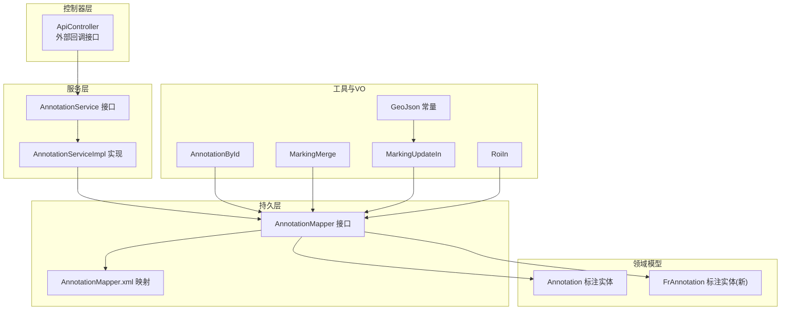
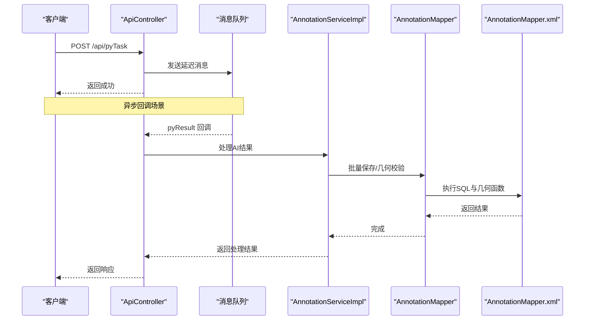
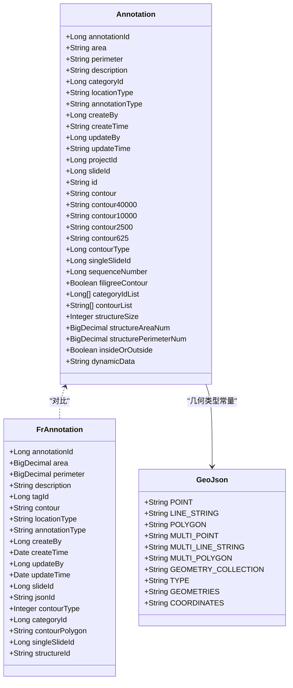
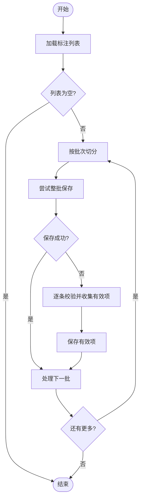
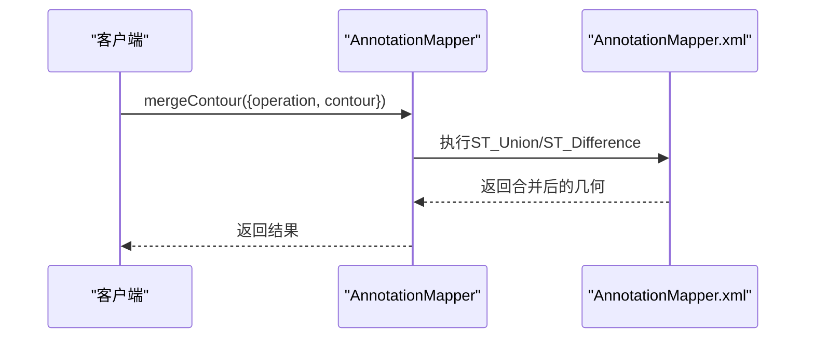
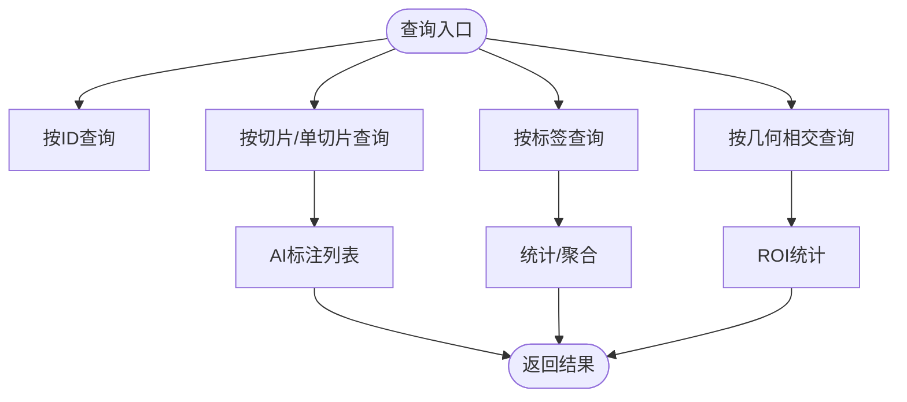
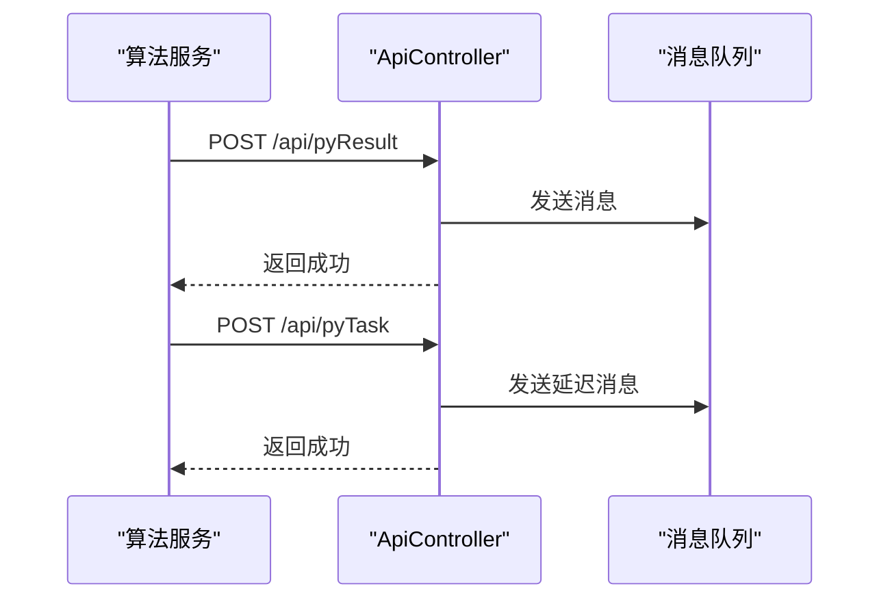
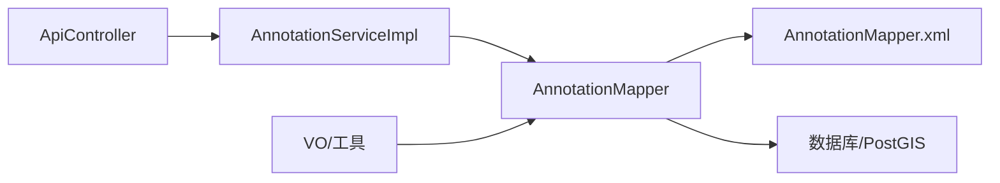

# 标注管理接口

<cite>
**本文引用的文件**
- [Annotation.java](file://src/main/java/cn/staitech/fr/domain/Annotation.java)
- [FrAnnotation.java](file://src/main/java/cn/staitech/fr/domain/FrAnnotation.java)
- [AnnotationService.java](file://src/main/java/cn/staitech/fr/service/AnnotationService.java)
- [AnnotationServiceImpl.java](file://src/main/java/cn/staitech/fr/service/impl/AnnotationServiceImpl.java)
- [AnnotationMapper.java](file://src/main/java/cn/staitech/fr/mapper/AnnotationMapper.java)
- [AnnotationMapper.xml](file://src/main/resources/mapper/AnnotationMapper.xml)
- [ApiController.java](file://src/main/java/cn/staitech/fr/controller/ApiController.java)
- [AnnotationById.java](file://src/main/java/cn/staitech/fr/vo/annotation/AnnotationById.java)
- [MarkingMerge.java](file://src/main/java/cn/staitech/fr/vo/annotation/MarkingMerge.java)
- [MarkingUpdateIn.java](file://src/main/java/cn/staitech/fr/vo/geojson/in/MarkingUpdateIn.java)
- [RoiIn.java](file://src/main/java/cn/staitech/fr/vo/geojson/in/RoiIn.java)
- [GeoJson.java](file://src/main/java/cn/staitech/fr/utils/geo/GeoJson.java)
</cite>

## 目录
1. [简介](#简介)
2. [项目结构](#项目结构)
3. [核心组件](#核心组件)
4. [架构总览](#架构总览)
5. [详细组件分析](#详细组件分析)
6. [依赖分析](#依赖分析)
7. [性能考虑](#性能考虑)
8. [故障排查指南](#故障排查指南)
9. [结论](#结论)
10. [附录](#附录)

## 简介
本文件面向标注管理相关接口，提供从创建、修改、删除到查询的完整API规范；详述标注数据模型与几何标注、文本标注、批注管理的参数定义与操作流程；覆盖标注合并、冲突处理、版本控制等高级能力的技术实现要点；并给出标注质量控制、数据校验与性能优化建议。

## 项目结构
标注管理涉及领域模型、持久层映射、服务层与控制器层，以及与外部算法回调的集成。核心模块包括：
- 领域模型：标注实体与标注扩展实体
- 持久层：MyBatis Mapper与XML映射
- 服务层：标注业务逻辑与批处理
- 控制器层：对外API与标注相关接口
- 工具与VO：几何类型常量、请求入参对象

**图表来源**
- [ApiController.java:1-61](file://src/main/java/cn/staitech/fr/controller/ApiController.java#L1-L61)
- [AnnotationService.java:1-21](file://src/main/java/cn/staitech/fr/service/AnnotationService.java#L1-L21)
- [AnnotationServiceImpl.java:1-79](file://src/main/java/cn/staitech/fr/service/impl/AnnotationServiceImpl.java#L1-L79)
- [AnnotationMapper.java:1-137](file://src/main/java/cn/staitech/fr/mapper/AnnotationMapper.java#L1-L137)
- [AnnotationMapper.xml:1-800](file://src/main/resources/mapper/AnnotationMapper.xml#L1-L800)
- [Annotation.java:1-352](file://src/main/java/cn/staitech/fr/domain/Annotation.java#L1-L352)
- [FrAnnotation.java:1-123](file://src/main/java/cn/staitech/fr/domain/FrAnnotation.java#L1-L123)
- [AnnotationById.java:1-26](file://src/main/java/cn/staitech/fr/vo/annotation/AnnotationById.java#L1-L26)
- [MarkingMerge.java:1-20](file://src/main/java/cn/staitech/fr/vo/annotation/MarkingMerge.java#L1-L20)
- [MarkingUpdateIn.java:1-78](file://src/main/java/cn/staitech/fr/vo/geojson/in/MarkingUpdateIn.java#L1-L78)
- [RoiIn.java:1-44](file://src/main/java/cn/staitech/fr/vo/geojson/in/RoiIn.java#L1-L44)
- [GeoJson.java:1-21](file://src/main/java/cn/staitech/fr/utils/geo/GeoJson.java#L1-L21)

**章节来源**
- [Annotation.java:1-352](file://src/main/java/cn/staitech/fr/domain/Annotation.java#L1-L352)
- [FrAnnotation.java:1-123](file://src/main/java/cn/staitech/fr/domain/FrAnnotation.java#L1-L123)
- [AnnotationMapper.java:1-137](file://src/main/java/cn/staitech/fr/mapper/AnnotationMapper.java#L1-L137)
- [AnnotationMapper.xml:1-800](file://src/main/resources/mapper/AnnotationMapper.xml#L1-L800)
- [AnnotationService.java:1-21](file://src/main/java/cn/staitech/fr/service/AnnotationService.java#L1-L21)
- [AnnotationServiceImpl.java:1-79](file://src/main/java/cn/staitech/fr/service/impl/AnnotationServiceImpl.java#L1-L79)
- [ApiController.java:1-61](file://src/main/java/cn/staitech/fr/controller/ApiController.java#L1-L61)
- [AnnotationById.java:1-26](file://src/main/java/cn/staitech/fr/vo/annotation/AnnotationById.java#L1-L26)
- [MarkingMerge.java:1-20](file://src/main/java/cn/staitech/fr/vo/annotation/MarkingMerge.java#L1-L20)
- [MarkingUpdateIn.java:1-78](file://src/main/java/cn/staitech/fr/vo/geojson/in/MarkingUpdateIn.java#L1-L78)
- [RoiIn.java:1-44](file://src/main/java/cn/staitech/fr/vo/geojson/in/RoiIn.java#L1-L44)
- [GeoJson.java:1-21](file://src/main/java/cn/staitech/fr/utils/geo/GeoJson.java#L1-L21)

## 核心组件
- 标注实体
  - 旧版标注实体：包含面积、周长、描述、标签ID、位置类型、标注类型、创建/更新信息、项目ID、切片ID、几何字段、轮廓类型、序列号、放大倍数、动态数据等
  - 新版标注实体：采用BigDecimal存储面积与周长，支持轮廓坐标、标签ID、类型、创建/更新信息、切片ID、JSON ID、轮廓类型、脏器ID、组织轮廓ID等
- Mapper接口：提供插入、更新、查询、几何运算、批量操作、AI标注表管理等方法
- XML映射：定义SQL语句、索引、几何函数调用、AI标注分表策略与字段映射
- 服务实现：封装批量保存、异常降级与逐条校验、几何有效性校验等
- 控制器：提供外部回调接口，接收算法结果并投递消息队列
- VO与工具：标注查询、合并、更新、ROI等入参对象，以及几何类型常量

**章节来源**
- [Annotation.java:1-352](file://src/main/java/cn/staitech/fr/domain/Annotation.java#L1-L352)
- [FrAnnotation.java:1-123](file://src/main/java/cn/staitech/fr/domain/FrAnnotation.java#L1-L123)
- [AnnotationMapper.java:1-137](file://src/main/java/cn/staitech/fr/mapper/AnnotationMapper.java#L1-L137)
- [AnnotationMapper.xml:1-800](file://src/main/resources/mapper/AnnotationMapper.xml#L1-L800)
- [AnnotationServiceImpl.java:1-79](file://src/main/java/cn/staitech/fr/service/impl/AnnotationServiceImpl.java#L1-L79)
- [ApiController.java:1-61](file://src/main/java/cn/staitech/fr/controller/ApiController.java#L1-L61)
- [AnnotationById.java:1-26](file://src/main/java/cn/staitech/fr/vo/annotation/AnnotationById.java#L1-L26)
- [MarkingMerge.java:1-20](file://src/main/java/cn/staitech/fr/vo/annotation/MarkingMerge.java#L1-L20)
- [MarkingUpdateIn.java:1-78](file://src/main/java/cn/staitech/fr/vo/geojson/in/MarkingUpdateIn.java#L1-L78)
- [RoiIn.java:1-44](file://src/main/java/cn/staitech/fr/vo/geojson/in/RoiIn.java#L1-L44)
- [GeoJson.java:1-21](file://src/main/java/cn/staitech/fr/utils/geo/GeoJson.java#L1-L21)

## 架构总览
标注管理采用分层架构：控制器负责对外接口与消息投递；服务层封装业务逻辑与批处理；持久层通过MyBatis映射数据库与PostGIS几何函数；领域模型承载标注数据与扩展属性。

**图表来源**
- [ApiController.java:1-61](file://src/main/java/cn/staitech/fr/controller/ApiController.java#L1-L61)
- [AnnotationServiceImpl.java:1-79](file://src/main/java/cn/staitech/fr/service/impl/AnnotationServiceImpl.java#L1-L79)
- [AnnotationMapper.java:1-137](file://src/main/java/cn/staitech/fr/mapper/AnnotationMapper.java#L1-L137)
- [AnnotationMapper.xml:1-800](file://src/main/resources/mapper/AnnotationMapper.xml#L1-L800)

## 详细组件分析

### 数据模型与几何标注
- 字段概览
  - 旧版标注实体：包含面积、周长、描述、标签ID、位置类型、标注类型、创建/更新者与时间、项目ID、切片ID、几何字段（多分辨率）、轮廓类型、序列号、放大倍数、动态数据等
  - 新版标注实体：使用BigDecimal存储面积与周长，支持轮廓坐标、标签ID、类型、创建/更新信息、切片ID、JSON ID、轮廓类型、脏器ID、组织轮廓ID等
- 几何字段
  - 支持多种几何类型常量（点、线、面、多点、多线、多面、几何集合）
  - 提供几何有效性校验、相交、并集、差集、缓冲、包络等空间运算
- ROI与区域管理
  - ROI入参对象支持几何列表、状态（包含/删除）、切片ID、单切片ID、标签ID列表等

**图表来源**
- [Annotation.java:1-352](file://src/main/java/cn/staitech/fr/domain/Annotation.java#L1-L352)
- [FrAnnotation.java:1-123](file://src/main/java/cn/staitech/fr/domain/FrAnnotation.java#L1-L123)
- [GeoJson.java:1-21](file://src/main/java/cn/staitech/fr/utils/geo/GeoJson.java#L1-L21)

**章节来源**
- [Annotation.java:1-352](file://src/main/java/cn/staitech/fr/domain/Annotation.java#L1-L352)
- [FrAnnotation.java:1-123](file://src/main/java/cn/staitech/fr/domain/FrAnnotation.java#L1-L123)
- [GeoJson.java:1-21](file://src/main/java/cn/staitech/fr/utils/geo/GeoJson.java#L1-L21)

### 批注管理与批处理
- 批量保存
  - 服务实现按批次提交，若整批异常则逐条校验并重试，确保部分可写入
  - 支持几何有效性校验与降级处理
- AI标注分表
  - XML映射根据序列号创建AI标注分表，建立多分辨率几何索引，支持批量插入与查询
- ROI与区域操作
  - 提供包含/删除ROI的几何运算入口，支持按条件批量删除

**图表来源**
- [AnnotationServiceImpl.java:1-79](file://src/main/java/cn/staitech/fr/service/impl/AnnotationServiceImpl.java#L1-L79)
- [AnnotationMapper.xml:247-289](file://src/main/resources/mapper/AnnotationMapper.xml#L247-L289)

**章节来源**
- [AnnotationServiceImpl.java:1-79](file://src/main/java/cn/staitech/fr/service/impl/AnnotationServiceImpl.java#L1-L79)
- [AnnotationMapper.xml:247-289](file://src/main/resources/mapper/AnnotationMapper.xml#L247-L289)

### 标注合并、冲突处理与版本控制
- 合并与差异
  - 提供几何合并（UNION）与差异（DIFFERENCE）操作，支持传入几何与操作类型
- 冲突处理
  - 通过几何有效性校验与逐条降级保存，避免整批失败
- 版本控制
  - 通过序列号驱动AI标注分表，支持不同版本数据隔离与并行处理
  - 提供批量删除与按条件删除，便于清理与回滚

**图表来源**
- [AnnotationMapper.java:30-30](file://src/main/java/cn/staitech/fr/mapper/AnnotationMapper.java#L30-L30)
- [AnnotationMapper.xml:554-566](file://src/main/resources/mapper/AnnotationMapper.xml#L554-L566)

**章节来源**
- [AnnotationMapper.java:30-30](file://src/main/java/cn/staitech/fr/mapper/AnnotationMapper.java#L30-L30)
- [AnnotationMapper.xml:554-566](file://src/main/resources/mapper/AnnotationMapper.xml#L554-L566)

### 查询与统计
- 基础查询
  - 支持按标注ID、切片ID、单切片ID、标签ID、几何相交等条件查询
  - 提供AI标注查询与多分辨率几何返回
- 统计与聚合
  - 提供区域面积与周长统计、脏器/结构面积汇总、内部/外部区域统计等
- ROI统计
  - 提供ROI区域内标注数量与面积统计

**图表来源**
- [AnnotationMapper.xml:373-552](file://src/main/resources/mapper/AnnotationMapper.xml#L373-L552)
- [AnnotationMapper.xml:664-728](file://src/main/resources/mapper/AnnotationMapper.xml#L664-L728)
- [AnnotationMapper.xml:756-791](file://src/main/resources/mapper/AnnotationMapper.xml#L756-L791)

**章节来源**
- [AnnotationMapper.xml:373-552](file://src/main/resources/mapper/AnnotationMapper.xml#L373-L552)
- [AnnotationMapper.xml:664-728](file://src/main/resources/mapper/AnnotationMapper.xml#L664-L728)
- [AnnotationMapper.xml:756-791](file://src/main/resources/mapper/AnnotationMapper.xml#L756-L791)

### 外部回调与异步处理
- 算法回调
  - 提供pyResult接口接收算法结果，记录日志并投递消息队列
  - 提供pyTask接口发送延迟消息，支持延迟时间配置
- 消息生产
  - 通过消息生产者将回调数据发送至队列，供后续处理

**图表来源**
- [ApiController.java:1-61](file://src/main/java/cn/staitech/fr/controller/ApiController.java#L1-L61)

**章节来源**
- [ApiController.java:1-61](file://src/main/java/cn/staitech/fr/controller/ApiController.java#L1-L61)

## 依赖分析
- 组件耦合
  - 控制器依赖服务层；服务层依赖Mapper；Mapper依赖XML映射与数据库
  - 领域模型与工具类（如几何常量）被广泛使用
- 外部依赖
  - PostGIS几何函数在XML中大量使用，支撑空间运算
  - 消息队列用于异步回调处理

**图表来源**
- [ApiController.java:1-61](file://src/main/java/cn/staitech/fr/controller/ApiController.java#L1-L61)
- [AnnotationServiceImpl.java:1-79](file://src/main/java/cn/staitech/fr/service/impl/AnnotationServiceImpl.java#L1-L79)
- [AnnotationMapper.java:1-137](file://src/main/java/cn/staitech/fr/mapper/AnnotationMapper.java#L1-L137)
- [AnnotationMapper.xml:1-800](file://src/main/resources/mapper/AnnotationMapper.xml#L1-L800)

**章节来源**
- [AnnotationMapper.xml:1-800](file://src/main/resources/mapper/AnnotationMapper.xml#L1-L800)

## 性能考虑
- 索引与分表
  - AI标注表按序列号分表，并建立几何GIST索引与普通索引，提升查询与空间运算性能
- 批处理与降级
  - 批量保存时整批失败自动降级为逐条校验，减少整体耗时与失败影响
- 几何运算
  - 使用ST_MakeValid等函数保证几何有效性，降低后续运算失败率
- 缓存与批量删除
  - 提供批量删除接口，结合条件过滤，减少无效数据占用

[本节为通用性能建议，不直接分析具体文件]

## 故障排查指南
- 批量保存异常
  - 观察服务实现中的异常捕获与逐条校验逻辑，确认是否触发降级保存
- 几何有效性问题
  - 使用几何有效性校验接口定位问题几何，必要时进行修复或转换
- ROI删除不生效
  - 检查传入的几何与内部/外部判断标志，确认删除条件是否匹配

**章节来源**
- [AnnotationServiceImpl.java:1-79](file://src/main/java/cn/staitech/fr/service/impl/AnnotationServiceImpl.java#L1-L79)
- [AnnotationMapper.xml:706-740](file://src/main/resources/mapper/AnnotationMapper.xml#L706-L740)

## 结论
标注管理接口围绕几何标注、文本标注与批注管理构建，具备完善的批处理、空间运算与异步回调能力。通过分表与索引优化、几何有效性校验与降级策略，系统在高并发与大数据量场景下仍可保持稳定与高效。

## 附录

### API定义与参数说明

- 获取标注详情
  - 方法：GET
  - 路径：/api/annotation/detail
  - 入参：见“标注查询入参”
  - 返回：标注详情（含几何字段）

- 批量创建/更新标注
  - 方法：POST
  - 路径：/api/annotation/batch
  - 入参：见“标注更新入参”
  - 返回：批量处理结果

- 合并/差异标注
  - 方法：POST
  - 路径：/api/annotation/merge
  - 入参：见“标注合并入参”
  - 返回：合并后几何

- ROI区域操作
  - 方法：POST
  - 路径：/api/annotation/roi
  - 入参：见“ROI入参”
  - 返回：区域统计或操作结果

- 外部回调
  - 方法：POST
  - 路径：/api/pyResult
  - 入参：算法回调参数
  - 返回：处理结果

- 延迟任务
  - 方法：POST
  - 路径：/api/pyTask
  - 入参：任务参数与延迟时间
  - 返回：投递结果

**章节来源**
- [AnnotationById.java:1-26](file://src/main/java/cn/staitech/fr/vo/annotation/AnnotationById.java#L1-L26)
- [MarkingMerge.java:1-20](file://src/main/java/cn/staitech/fr/vo/annotation/MarkingMerge.java#L1-L20)
- [MarkingUpdateIn.java:1-78](file://src/main/java/cn/staitech/fr/vo/geojson/in/MarkingUpdateIn.java#L1-L78)
- [RoiIn.java:1-44](file://src/main/java/cn/staitech/fr/vo/geojson/in/RoiIn.java#L1-L44)
- [ApiController.java:1-61](file://src/main/java/cn/staitech/fr/controller/ApiController.java#L1-L61)