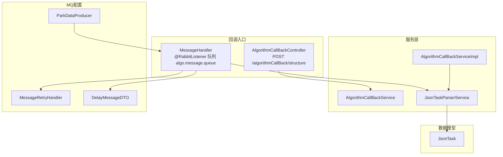
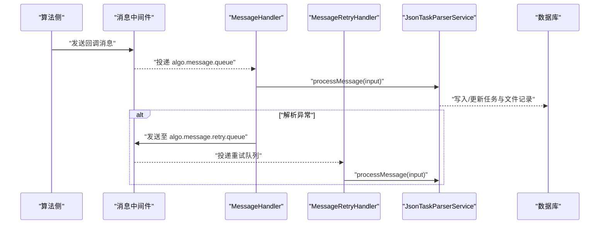
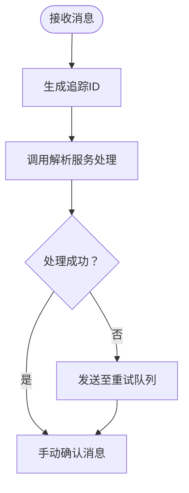
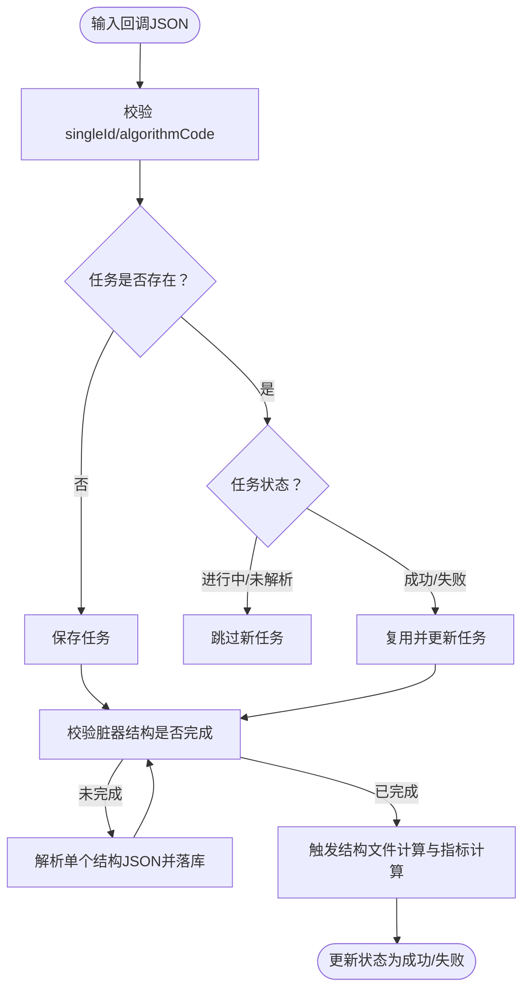
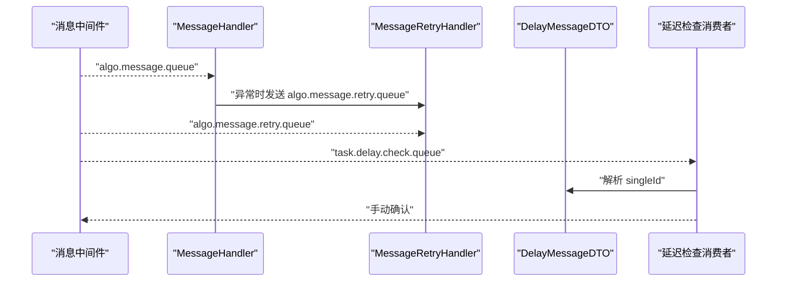
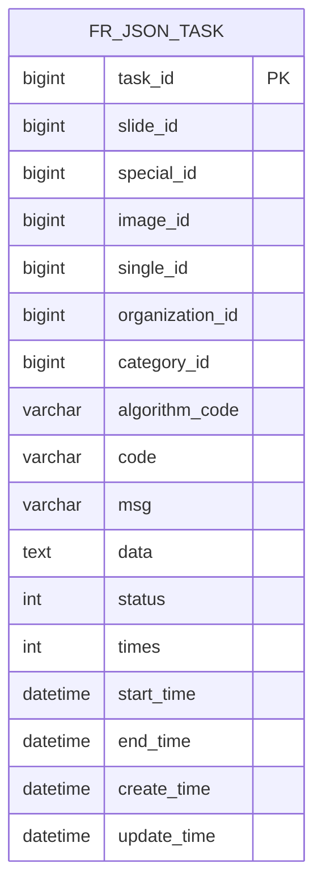
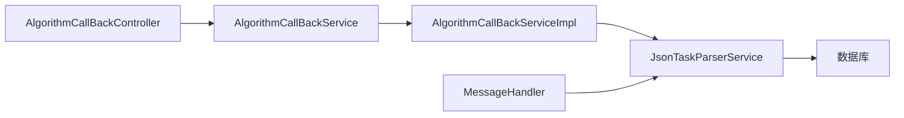

# 算法回调接口

<cite>
**本文引用的文件**
- [AlgorithmCallBackController.java](file://src/main/java/cn/staitech/fr/controller/AlgorithmCallBackController.java)
- [AlgorithmCallBackService.java](file://src/main/java/cn/staitech/fr/service/AlgorithmCallBackService.java)
- [AlgorithmCallBackServiceImpl.java](file://src/main/java/cn/staitech/fr/service/impl/AlgorithmCallBackServiceImpl.java)
- [MessageHandler.java](file://src/main/java/cn/staitech/fr/config/MessageHandler.java)
- [MessageRetryHandler.java](file://src/main/java/cn/staitech/fr/config/MessageRetryHandler.java)
- [ParkDataProducer.java](file://src/main/java/cn/staitech/fr/config/ParkDataProducer.java)
- [JsonTaskParserService.java](file://src/main/java/cn/staitech/fr/service/strategy/json/JsonTaskParserService.java)
- [DelayMessageDTO.java](file://src/main/java/cn/staitech/fr/domain/dto/DelayMessageDTO.java)
- [JsonTask.java](file://src/main/java/cn/staitech/fr/domain/JsonTask.java)
</cite>

## 目录
1. [简介](#简介)
2. [项目结构](#项目结构)
3. [核心组件](#核心组件)
4. [架构总览](#架构总览)
5. [详细组件分析](#详细组件分析)
6. [依赖关系分析](#依赖关系分析)
7. [性能考量](#性能考量)
8. [故障排查指南](#故障排查指南)
9. [结论](#结论)
10. [附录](#附录)

## 简介
本文件面向“算法回调接口”的API文档与技术说明，覆盖以下能力范围：
- 算法执行结果回调接收与处理
- 异步任务通知与消息队列处理
- 回调机制、消息传递、错误重试、超时处理的参数定义与业务逻辑
- 回调地址配置、签名验证、幂等性保证等安全措施
- 回调接口的监控、调试与故障排查指南

说明：
- 当前仓库中存在两类回调入口：HTTP回调与MQ回调。HTTP回调入口已标记为过时，建议优先使用MQ回调通道。
- MQ回调具备完善的重试、延迟检查、手动确认、异常转移至重试队列等机制，适合高可靠场景。

## 项目结构
与算法回调相关的关键模块如下：
- 控制器层：HTTP回调入口（已废弃）
- 服务层：回调接口抽象与实现
- MQ配置：消息监听、重试处理、延迟消息发送
- 解析服务：JSON任务解析、状态更新、指标计算、结果落库
- 数据模型：任务与文件实体

图表来源
- [AlgorithmCallBackController.java:74-80](file://src/main/java/cn/staitech/fr/controller/AlgorithmCallBackController.java#L74-L80)
- [MessageHandler.java:43-86](file://src/main/java/cn/staitech/fr/config/MessageHandler.java#L43-L86)
- [AlgorithmCallBackServiceImpl.java:29-55](file://src/main/java/cn/staitech/fr/service/impl/AlgorithmCallBackServiceImpl.java#L29-L55)
- [JsonTaskParserService.java:174-263](file://src/main/java/cn/staitech/fr/service/strategy/json/JsonTaskParserService.java#L174-L263)
- [ParkDataProducer.java:27-44](file://src/main/java/cn/staitech/fr/config/ParkDataProducer.java#L27-L44)
- [MessageRetryHandler.java:25-42](file://src/main/java/cn/staitech/fr/config/MessageRetryHandler.java#L25-L42)
- [DelayMessageDTO.java:7](file://src/main/java/cn/staitech/fr/domain/dto/DelayMessageDTO.java#L7)
- [JsonTask.java:26-69](file://src/main/java/cn/staitech/fr/domain/JsonTask.java#L26-L69)

章节来源
- [AlgorithmCallBackController.java:44-88](file://src/main/java/cn/staitech/fr/controller/AlgorithmCallBackController.java#L44-L88)
- [AlgorithmCallBackService.java:11-13](file://src/main/java/cn/staitech/fr/service/AlgorithmCallBackService.java#L11-L13)
- [AlgorithmCallBackServiceImpl.java:23-62](file://src/main/java/cn/staitech/fr/service/impl/AlgorithmCallBackServiceImpl.java#L23-L62)
- [MessageHandler.java:30-128](file://src/main/java/cn/staitech/fr/config/MessageHandler.java#L30-L128)
- [MessageRetryHandler.java:18-44](file://src/main/java/cn/staitech/fr/config/MessageRetryHandler.java#L18-L44)
- [ParkDataProducer.java:17-48](file://src/main/java/cn/staitech/fr/config/ParkDataProducer.java#L17-L48)
- [JsonTaskParserService.java:52-760](file://src/main/java/cn/staitech/fr/service/strategy/json/JsonTaskParserService.java#L52-L760)
- [DelayMessageDTO.java:6-9](file://src/main/java/cn/staitech/fr/domain/dto/DelayMessageDTO.java#L6-L9)
- [JsonTask.java:24-69](file://src/main/java/cn/staitech/fr/domain/JsonTask.java#L24-L69)

## 核心组件
- HTTP回调控制器（已废弃）
  - 接口：POST /algorithmCallBack/structure
  - 行为：接收原始字符串数据，调用回调服务处理
  - 注意：该接口已标注为过时，建议迁移至MQ通道
- MQ回调处理器
  - 监听队列：algo.message.queue
  - 行为：手动确认消息、异常转入重试队列、支持延迟消息
- 回调服务实现
  - 将回调数据提交到有界阻塞队列线程池异步处理，避免阻塞请求线程
- JSON任务解析服务
  - 解析回调JSON、去重/幂等、状态机推进、指标计算、结果落库
- 生产者与重试处理器
  - 提供消息发送与延迟消息能力；重试队列消费处理

章节来源
- [AlgorithmCallBackController.java:74-80](file://src/main/java/cn/staitech/fr/controller/AlgorithmCallBackController.java#L74-L80)
- [MessageHandler.java:43-86](file://src/main/java/cn/staitech/fr/config/MessageHandler.java#L43-L86)
- [AlgorithmCallBackServiceImpl.java:29-55](file://src/main/java/cn/staitech/fr/service/impl/AlgorithmCallBackServiceImpl.java#L29-L55)
- [JsonTaskParserService.java:174-263](file://src/main/java/cn/staitech/fr/service/strategy/json/JsonTaskParserService.java#L174-L263)
- [ParkDataProducer.java:27-44](file://src/main/java/cn/staitech/fr/config/ParkDataProducer.java#L27-L44)
- [MessageRetryHandler.java:25-42](file://src/main/java/cn/staitech/fr/config/MessageRetryHandler.java#L25-L42)

## 架构总览
回调整体流程分为两条路径：
- HTTP回调（已废弃）：直接进入回调服务，再交由解析服务处理
- MQ回调（推荐）：消息监听后进入解析服务；异常进入重试队列；支持延迟检查队列

图表来源
- [MessageHandler.java:43-86](file://src/main/java/cn/staitech/fr/config/MessageHandler.java#L43-L86)
- [MessageRetryHandler.java:25-42](file://src/main/java/cn/staitech/fr/config/MessageRetryHandler.java#L25-L42)
- [JsonTaskParserService.java:174-263](file://src/main/java/cn/staitech/fr/service/strategy/json/JsonTaskParserService.java#L174-L263)

## 详细组件分析

### HTTP回调（已废弃）
- 接口定义
  - 方法：POST
  - 路径：/algorithmCallBack/structure
  - 请求体：字符串（原始回调数据）
  - 返回值：统一响应包装
- 处理流程
  - 记录完整回调数据
  - 调用回调服务的input方法
  - 返回成功响应
- 适用场景
  - 临时或兼容性用途；生产环境建议使用MQ通道

章节来源
- [AlgorithmCallBackController.java:74-80](file://src/main/java/cn/staitech/fr/controller/AlgorithmCallBackController.java#L74-L80)

### MQ回调（推荐）
- 监听队列
  - 主队列：algo.message.queue
  - 重试队列：algo.message.retry.queue
  - 延迟检查队列：task.delay.check.queue
- 处理流程
  - 接收消息后生成追踪ID
  - 调用解析服务处理
  - 成功则手动确认；失败则发送至重试队列并确认原消息
  - 支持延迟消息发送（通过延迟交换机与路由键）

图表来源
- [MessageHandler.java:44-75](file://src/main/java/cn/staitech/fr/config/MessageHandler.java#L44-L75)

章节来源
- [MessageHandler.java:30-128](file://src/main/java/cn/staitech/fr/config/MessageHandler.java#L30-L128)

### 回调服务实现
- 功能要点
  - 使用有界阻塞队列线程池异步处理回调数据
  - 避免阻塞IO线程，提升吞吐
- 关键参数
  - 核心线程数：CPU核数
  - 最大线程数：CPU核数×2
  - 队列容量：4096
- 异常处理
  - 任务执行异常被捕获，不影响外部回调返回

章节来源
- [AlgorithmCallBackServiceImpl.java:23-62](file://src/main/java/cn/staitech/fr/service/impl/AlgorithmCallBackServiceImpl.java#L23-L62)

### JSON任务解析服务
- 输入规范
  - 必填字段：singleId、algorithmCode
  - 可选字段：slideId、imageId、organizationId、elapsed_time、data、code、file_url、structureCode
- 幂等性与去重
  - 基于singleId唯一约束，避免重复任务
  - 若任务已存在且状态为成功/失败，则复用；若状态为进行中/未解析，则跳过新任务
- 状态机推进
  - 任务状态：未解析、解析中、解析成功、解析失败
  - 单切片状态：未预测、预测成功、预测失败、预测中
- 解析与计算
  - 校验算法标识与JSON结构
  - 解析文件路径并落库
  - 指标计算与结果存储
  - 结果回写单切片与任务表

图表来源
- [JsonTaskParserService.java:174-263](file://src/main/java/cn/staitech/fr/service/strategy/json/JsonTaskParserService.java#L174-L263)
- [JsonTaskParserService.java:265-286](file://src/main/java/cn/staitech/fr/service/strategy/json/JsonTaskParserService.java#L265-L286)
- [JsonTaskParserService.java:319-452](file://src/main/java/cn/staitech/fr/service/strategy/json/JsonTaskParserService.java#L319-L452)

章节来源
- [JsonTaskParserService.java:174-263](file://src/main/java/cn/staitech/fr/service/strategy/json/JsonTaskParserService.java#L174-L263)
- [JsonTaskParserService.java:265-286](file://src/main/java/cn/staitech/fr/service/strategy/json/JsonTaskParserService.java#L265-L286)
- [JsonTaskParserService.java:319-452](file://src/main/java/cn/staitech/fr/service/strategy/json/JsonTaskParserService.java#L319-L452)

### 重试与延迟机制
- 重试队列
  - 异常时将消息发送至algo.message.retry.queue
  - 重试处理器负责再次调用解析服务
- 延迟检查
  - 延迟消息通过延迟交换机与路由键投递至task.delay.check.queue
  - 消费端根据singleId检查任务状态并确认消息

图表来源
- [MessageHandler.java:57-71](file://src/main/java/cn/staitech/fr/config/MessageHandler.java#L57-L71)
- [MessageRetryHandler.java:25-42](file://src/main/java/cn/staitech/fr/config/MessageRetryHandler.java#L25-L42)
- [DelayMessageDTO.java:7](file://src/main/java/cn/staitech/fr/domain/dto/DelayMessageDTO.java#L7)
- [MessageHandler.java:102-127](file://src/main/java/cn/staitech/fr/config/MessageHandler.java#L102-L127)

章节来源
- [MessageHandler.java:88-127](file://src/main/java/cn/staitech/fr/config/MessageHandler.java#L88-L127)
- [MessageRetryHandler.java:18-44](file://src/main/java/cn/staitech/fr/config/MessageRetryHandler.java#L18-L44)
- [DelayMessageDTO.java:6-9](file://src/main/java/cn/staitech/fr/domain/dto/DelayMessageDTO.java#L6-L9)

### 数据模型与状态
- 任务实体（JsonTask）
  - 关键字段：taskId、slideId、specialId、imageId、singleId、organizationId、categoryId、algorithmCode、status、times、structureTime、startTime、endTime、createTime、updateTime
  - 状态枚举：未解析、解析中、解析成功、解析失败
- 单切片状态
  - 未预测、预测成功、预测失败、预测中

图表来源
- [JsonTask.java:26-69](file://src/main/java/cn/staitech/fr/domain/JsonTask.java#L26-L69)

章节来源
- [JsonTask.java:24-69](file://src/main/java/cn/staitech/fr/domain/JsonTask.java#L24-L69)

## 依赖关系分析
- 组件耦合
  - HTTP回调仅作为入口，最终仍委托给回调服务与解析服务
  - MQ回调直接对接解析服务，具备更强的可靠性与扩展性
- 外部依赖
  - 消息中间件：RabbitMQ（队列、延迟交换机、路由键）
  - 线程池：有界阻塞队列，防止内存膨胀
- 潜在风险
  - HTTP回调已废弃，不建议在生产使用
  - MQ异常路径需关注重试队列堆积与死信处理

图表来源
- [AlgorithmCallBackController.java:74-80](file://src/main/java/cn/staitech/fr/controller/AlgorithmCallBackController.java#L74-L80)
- [AlgorithmCallBackServiceImpl.java:29-55](file://src/main/java/cn/staitech/fr/service/impl/AlgorithmCallBackServiceImpl.java#L29-L55)
- [JsonTaskParserService.java:174-263](file://src/main/java/cn/staitech/fr/service/strategy/json/JsonTaskParserService.java#L174-L263)

章节来源
- [AlgorithmCallBackController.java:44-88](file://src/main/java/cn/staitech/fr/controller/AlgorithmCallBackController.java#L44-L88)
- [AlgorithmCallBackServiceImpl.java:23-62](file://src/main/java/cn/staitech/fr/service/impl/AlgorithmCallBackServiceImpl.java#L23-L62)
- [JsonTaskParserService.java:52-760](file://src/main/java/cn/staitech/fr/service/strategy/json/JsonTaskParserService.java#L52-L760)

## 性能考量
- 线程池参数
  - CPU密集型建议保持核心线程数与最大线程数与CPU核数匹配，避免过度上下文切换
  - 队列容量4096可承载突发流量，但需结合GC与内存压力评估
- IO与解析
  - 解析服务内部使用线程池执行结构化计算，注意磁盘IO与数据库写入瓶颈
- MQ吞吐
  - 合理拆分主队列与重试队列，避免重试风暴
  - 延迟消息用于削峰填谷，减少瞬时压力

## 故障排查指南
- 常见问题定位
  - 回调未生效
    - 确认回调地址是否指向MQ通道（HTTP已废弃）
    - 检查algo.message.queue是否被正确监听
  - 任务未更新或重复执行
    - 核对singleId是否一致，检查唯一约束与任务状态
  - 解析失败
    - 查看算法标识与JSON结构是否符合要求
    - 检查文件路径是否存在
  - 重试队列堆积
    - 检查MessageHandler异常分支是否频繁触发
    - 关注MessageRetryHandler处理日志
- 关键日志与指标
  - 消息监听与确认日志
  - 解析服务耗时统计（结构化、指标计算）
  - 单切片状态变更日志
- 调试步骤
  - 在MessageHandler中打印原始消息与异常栈
  - 在JsonTaskParserService中输出任务状态推进过程
  - 使用延迟检查队列验证任务恢复逻辑

章节来源
- [MessageHandler.java:44-75](file://src/main/java/cn/staitech/fr/config/MessageHandler.java#L44-L75)
- [MessageRetryHandler.java:25-42](file://src/main/java/cn/staitech/fr/config/MessageRetryHandler.java#L25-L42)
- [JsonTaskParserService.java:265-286](file://src/main/java/cn/staitech/fr/service/strategy/json/JsonTaskParserService.java#L265-L286)

## 结论
- 生产环境应优先采用MQ回调通道，具备完善的重试、延迟与手动确认机制
- HTTP回调入口已废弃，不建议继续使用
- 解析服务实现了幂等、状态机推进与指标计算闭环，满足高可靠场景
- 建议结合监控与告警完善回调链路可观测性

## 附录

### 回调接口清单（HTTP已废弃）
- POST /algorithmCallBack/structure
  - 请求体：字符串（原始回调数据）
  - 返回：统一响应包装

章节来源
- [AlgorithmCallBackController.java:74-80](file://src/main/java/cn/staitech/fr/controller/AlgorithmCallBackController.java#L74-L80)

### MQ回调配置要点
- 队列与交换机
  - 主队列：algo.message.queue
  - 重试队列：algo.message.retry.queue
  - 延迟交换机与路由键：delayed.exchange / delay.check.routing.key
- 参数与行为
  - 手动确认消息
  - 异常时发送至重试队列
  - 支持延迟消息投递与检查

章节来源
- [MessageHandler.java:32-100](file://src/main/java/cn/staitech/fr/config/MessageHandler.java#L32-L100)
- [ParkDataProducer.java:38-44](file://src/main/java/cn/staitech/fr/config/ParkDataProducer.java#L38-L44)

### 回调数据字段规范
- 必填字段
  - singleId：单切片ID
  - algorithmCode：算法标识
- 可选字段
  - slideId、imageId、organizationId、elapsed_time、data、code、file_url、structureCode

章节来源
- [JsonTaskParserService.java:174-263](file://src/main/java/cn/staitech/fr/service/strategy/json/JsonTaskParserService.java#L174-L263)
- [JsonTaskParserService.java:611-656](file://src/main/java/cn/staitech/fr/service/strategy/json/JsonTaskParserService.java#L611-L656)

### 安全与合规建议
- 回调地址配置
  - 仅在可信网络内暴露MQ通道
- 签名验证
  - 建议在算法侧对回调消息进行签名，服务端校验后再进入解析流程
- 幂等性保证
  - 基于singleId与唯一约束实现幂等
  - 解析服务内部对任务状态进行判断，避免重复执行

章节来源
- [JsonTaskParserService.java:198-222](file://src/main/java/cn/staitech/fr/service/strategy/json/JsonTaskParserService.java#L198-L222)