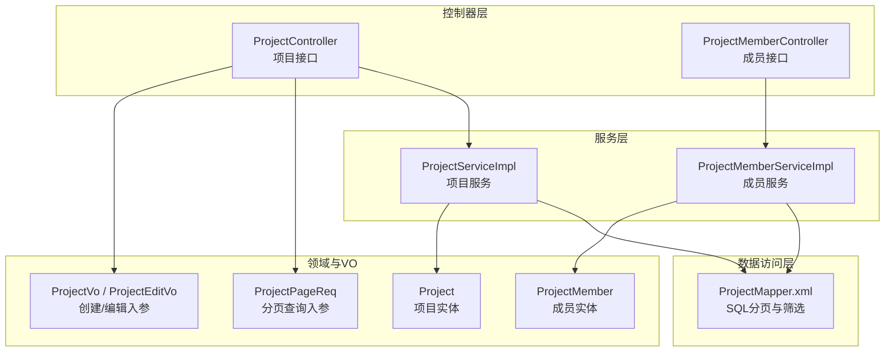
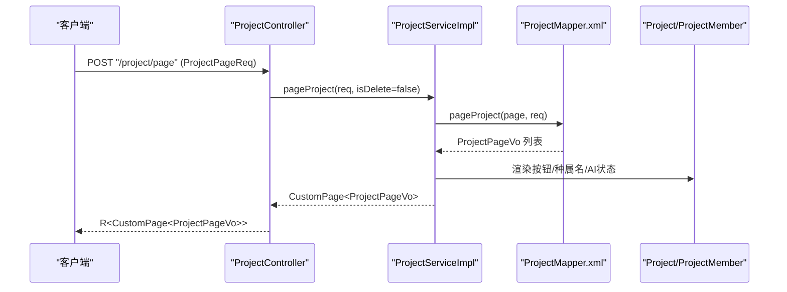
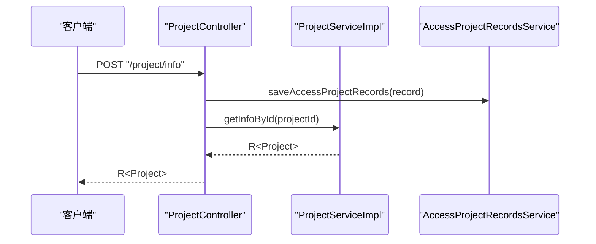
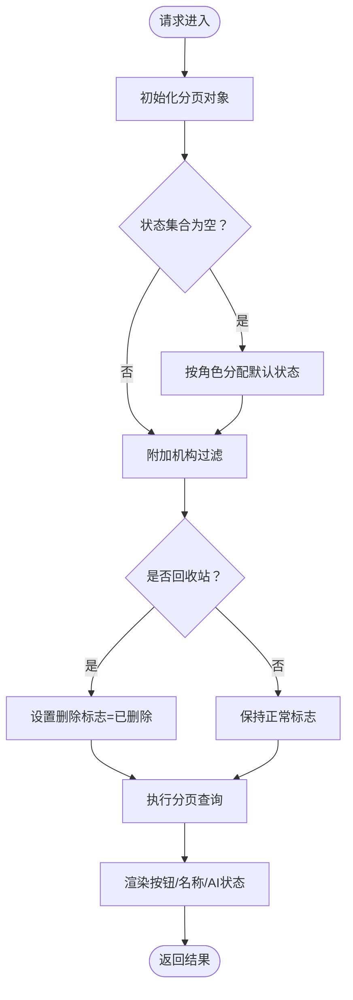
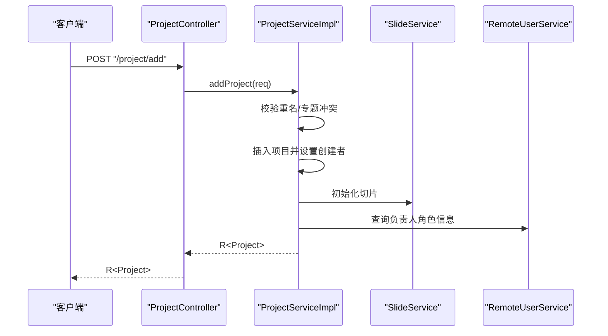
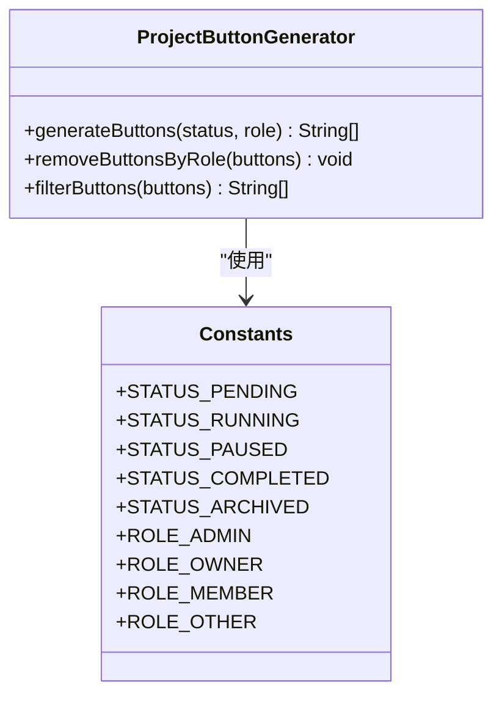
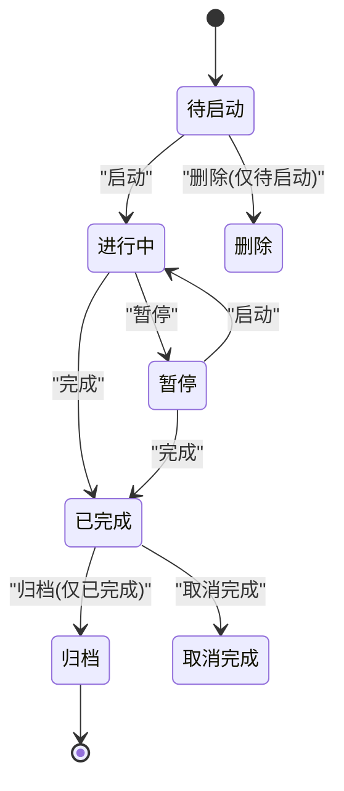
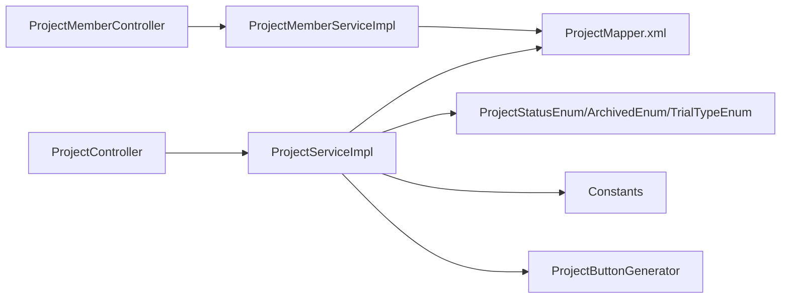
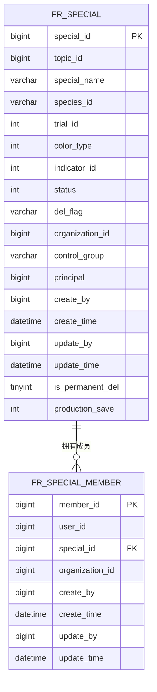

# 项目管理接口

<cite>
**本文引用的文件**
- [ProjectController.java](file://src/main/java/cn/staitech/fr/controller/ProjectController.java)
- [ProjectMemberController.java](file://src/main/java/cn/staitech/fr/controller/ProjectMemberController.java)
- [ProjectServiceImpl.java](file://src/main/java/cn/staitech/fr/service/impl/ProjectServiceImpl.java)
- [ProjectMemberServiceImpl.java](file://src/main/java/cn/staitech/fr/service/impl/ProjectMemberServiceImpl.java)
- [Project.java](file://src/main/java/cn/staitech/fr/domain/Project.java)
- [ProjectMember.java](file://src/main/java/cn/staitech/fr/domain/ProjectMember.java)
- [ProjectPageReq.java](file://src/main/java/cn/staitech/fr/vo/project/ProjectPageReq.java)
- [ProjectVo.java](file://src/main/java/cn/staitech/fr/vo/project/ProjectVo.java)
- [ProjectEditVo.java](file://src/main/java/cn/staitech/fr/vo/project/ProjectEditVo.java)
- [ProjectMemberPageReq.java](file://src/main/java/cn/staitech/fr/vo/project/ProjectMemberPageReq.java)
- [ProjectMemberVo.java](file://src/main/java/cn/staitech/fr/vo/project/ProjectMemberVo.java)
- [ProjectStatusEnum.java](file://src/main/java/cn/staitech/fr/enums/ProjectStatusEnum.java)
- [ProjectStatusArchivedEnum.java](file://src/main/java/cn/staitech/fr/enums/ProjectStatusArchivedEnum.java)
- [TrialTypeEnum.java](file://src/main/java/cn/staitech/fr/enums/TrialTypeEnum.java)
- [Constants.java](file://src/main/java/cn/staitech/fr/constant/Constants.java)
- [ProjectButtonGenerator.java](file://src/main/java/cn/staitech/fr/utils/ProjectButtonGenerator.java)
- [ProjectMapper.xml](file://src/main/resources/mapper/ProjectMapper.xml)
</cite>

## 目录
1. [简介](#简介)
2. [项目结构](#项目结构)
3. [核心组件](#核心组件)
4. [架构总览](#架构总览)
5. [详细组件分析](#详细组件分析)
6. [依赖分析](#依赖分析)
7. [性能考虑](#性能考虑)
8. [故障排查指南](#故障排查指南)
9. [结论](#结论)
10. [附录](#附录)

## 简介
本文件面向项目管理相关接口，覆盖项目创建、成员管理、权限控制、项目状态管理、项目生命周期与成员角色权限、访问控制策略、查询与筛选、分页机制、以及项目协作与数据共享的安全最佳实践。内容基于后端控制器、服务层、领域模型、VO/DTO、枚举与常量、MyBatis 映射等源码进行梳理与总结。

## 项目结构
项目采用典型的分层架构：
- 控制器层：负责接收请求、参数校验、调用服务层、返回响应
- 服务层：封装业务逻辑、事务控制、角色与权限判断
- 数据访问层：MyBatis Mapper XML 实现复杂查询与分页
- 领域模型与 VO/DTO：承载实体与接口入参/出参
- 枚举与常量：统一状态、类型与权限标识
- 工具类：按钮生成、国际化语言切换等

**图表来源**
- [ProjectController.java:1-285](file://src/main/java/cn/staitech/fr/controller/ProjectController.java#L1-L285)
- [ProjectMemberController.java:1-62](file://src/main/java/cn/staitech/fr/controller/ProjectMemberController.java#L1-L62)
- [ProjectServiceImpl.java:1-558](file://src/main/java/cn/staitech/fr/service/impl/ProjectServiceImpl.java#L1-L558)
- [ProjectMemberServiceImpl.java:1-195](file://src/main/java/cn/staitech/fr/service/impl/ProjectMemberServiceImpl.java#L1-L195)
- [ProjectMapper.xml:1-97](file://src/main/resources/mapper/ProjectMapper.xml#L1-L97)
- [Project.java:1-117](file://src/main/java/cn/staitech/fr/domain/Project.java#L1-L117)
- [ProjectMember.java:1-65](file://src/main/java/cn/staitech/fr/domain/ProjectMember.java#L1-L65)
- [ProjectPageReq.java:1-64](file://src/main/java/cn/staitech/fr/vo/project/ProjectPageReq.java#L1-L64)
- [ProjectVo.java:1-81](file://src/main/java/cn/staitech/fr/vo/project/ProjectVo.java#L1-L81)
- [ProjectEditVo.java:1-59](file://src/main/java/cn/staitech/fr/vo/project/ProjectEditVo.java#L1-L59)

**章节来源**
- [ProjectController.java:1-285](file://src/main/java/cn/staitech/fr/controller/ProjectController.java#L1-L285)
- [ProjectMemberController.java:1-62](file://src/main/java/cn/staitech/fr/controller/ProjectMemberController.java#L1-L62)
- [ProjectServiceImpl.java:1-558](file://src/main/java/cn/staitech/fr/service/impl/ProjectServiceImpl.java#L1-L558)
- [ProjectMemberServiceImpl.java:1-195](file://src/main/java/cn/staitech/fr/service/impl/ProjectMemberServiceImpl.java#L1-L195)
- [ProjectMapper.xml:1-97](file://src/main/resources/mapper/ProjectMapper.xml#L1-L97)

## 核心组件
- 项目控制器：提供项目详情、分页查询、状态变更、删除、回收站恢复/永久删除、对照组设置、成员昵称查询、访问统计等接口
- 成员控制器：提供成员列表、成员删除、成员详情、成员新增等接口
- 项目服务：实现项目创建、编辑、删除、状态变更、回收站处理、按钮渲染、对照组设置等业务逻辑
- 成员服务：实现成员列表、成员删除、成员详情、成员新增等业务逻辑
- 领域模型：项目与成员实体，承载字段与扩展属性（如按钮集合、种属名称、是否AI训练等）
- 查询与入参：分页请求、创建/编辑入参、成员管理入参
- 枚举与常量：项目状态、试验类型、权限角色、按钮常量等
- SQL 分页与筛选：基于 MyBatis 的复杂条件查询与排序

**章节来源**
- [ProjectController.java:69-285](file://src/main/java/cn/staitech/fr/controller/ProjectController.java#L69-L285)
- [ProjectMemberController.java:32-61](file://src/main/java/cn/staitech/fr/controller/ProjectMemberController.java#L32-L61)
- [ProjectServiceImpl.java:92-558](file://src/main/java/cn/staitech/fr/service/impl/ProjectServiceImpl.java#L92-L558)
- [ProjectMemberServiceImpl.java:50-195](file://src/main/java/cn/staitech/fr/service/impl/ProjectMemberServiceImpl.java#L50-L195)
- [Project.java:32-117](file://src/main/java/cn/staitech/fr/domain/Project.java#L32-L117)
- [ProjectMember.java:29-65](file://src/main/java/cn/staitech/fr/domain/ProjectMember.java#L29-L65)
- [ProjectPageReq.java:18-63](file://src/main/java/cn/staitech/fr/vo/project/ProjectPageReq.java#L18-L63)
- [ProjectVo.java:29-80](file://src/main/java/cn/staitech/fr/vo/project/ProjectVo.java#L29-L80)
- [ProjectEditVo.java:24-58](file://src/main/java/cn/staitech/fr/vo/project/ProjectEditVo.java#L24-L58)
- [ProjectStatusEnum.java:11-50](file://src/main/java/cn/staitech/fr/enums/ProjectStatusEnum.java#L11-L50)
- [ProjectStatusArchivedEnum.java:11-61](file://src/main/java/cn/staitech/fr/enums/ProjectStatusArchivedEnum.java#L11-L61)
- [TrialTypeEnum.java:11-65](file://src/main/java/cn/staitech/fr/enums/TrialTypeEnum.java#L11-L65)
- [Constants.java:14-111](file://src/main/java/cn/staitech/fr/constant/Constants.java#L14-L111)
- [ProjectMapper.xml:5-94](file://src/main/resources/mapper/ProjectMapper.xml#L5-L94)

## 架构总览
项目管理接口遵循“控制器-服务-数据访问-领域模型”的分层设计，结合 MyBatis XML 实现复杂筛选与分页，配合枚举与常量统一状态与权限语义，通过工具类生成按钮集合以适配不同角色与项目状态。

**图表来源**
- [ProjectController.java:98-101](file://src/main/java/cn/staitech/fr/controller/ProjectController.java#L98-L101)
- [ProjectServiceImpl.java:92-112](file://src/main/java/cn/staitech/fr/service/impl/ProjectServiceImpl.java#L92-L112)
- [ProjectMapper.xml:5-94](file://src/main/resources/mapper/ProjectMapper.xml#L5-L94)

## 详细组件分析

### 项目接口规范

#### 1) 项目详情与访问记录
- 接口：POST "/project/info"
- 入参：VisitProjectVO（包含 projectId）
- 行为：记录访问项目记录，随后返回项目详情
- 返回：R<Project>

**图表来源**
- [ProjectController.java:72-77](file://src/main/java/cn/staitech/fr/controller/ProjectController.java#L72-L77)
- [ProjectServiceImpl.java:465-506](file://src/main/java/cn/staitech/fr/service/impl/ProjectServiceImpl.java#L465-L506)

**章节来源**
- [ProjectController.java:72-77](file://src/main/java/cn/staitech/fr/controller/ProjectController.java#L72-L77)
- [ProjectServiceImpl.java:465-506](file://src/main/java/cn/staitech/fr/service/impl/ProjectServiceImpl.java#L465-L506)

#### 2) 项目列表分页查询
- 接口：POST "/project/page"
- 入参：ProjectPageReq（支持按专题编号、项目名称、种属、试验类型、染色类型、状态、创建人、负责人、时间范围等筛选）
- 行为：默认状态集合按角色动态赋值；非管理员自动附加机构过滤；支持普通/回收站分页
- 返回：R<CustomPage<ProjectPageVo>>

**图表来源**
- [ProjectServiceImpl.java:92-112](file://src/main/java/cn/staitech/fr/service/impl/ProjectServiceImpl.java#L92-L112)
- [ProjectMapper.xml:5-94](file://src/main/resources/mapper/ProjectMapper.xml#L5-L94)

**章节来源**
- [ProjectController.java:98-101](file://src/main/java/cn/staitech/fr/controller/ProjectController.java#L98-L101)
- [ProjectServiceImpl.java:92-112](file://src/main/java/cn/staitech/fr/service/impl/ProjectServiceImpl.java#L92-L112)
- [ProjectPageReq.java:18-63](file://src/main/java/cn/staitech/fr/vo/project/ProjectPageReq.java#L18-L63)
- [ProjectMapper.xml:5-94](file://src/main/resources/mapper/ProjectMapper.xml#L5-L94)

#### 3) 已归档项目分页查询
- 接口：POST "/project/pageArchived"
- 行为：固定状态为归档，其余逻辑同上
- 返回：R<CustomPage<ProjectPageVo>>

**章节来源**
- [ProjectController.java:104-108](file://src/main/java/cn/staitech/fr/controller/ProjectController.java#L104-L108)

#### 4) 回收站项目分页查询
- 接口：POST "/project/pageRecycle"
- 行为：对到期时间参数进行偏移（向前推30天），用于展示回收期窗口内的项目
- 返回：R<CustomPage<ProjectPageVo>>

**章节来源**
- [ProjectController.java:111-125](file://src/main/java/cn/staitech/fr/controller/ProjectController.java#L111-L125)

#### 5) 项目新增
- 接口：POST "/project/add"
- 入参：ProjectVo（包含专题ID、项目名称、种属、试验类型、染色类型、机构、负责人等）
- 行为：校验重名/专题冲突；创建项目；初始化切片；添加项目成员；生成审计日志对象
- 返回：R<Project>

**图表来源**
- [ProjectController.java:140-144](file://src/main/java/cn/staitech/fr/controller/ProjectController.java#L140-L144)
- [ProjectServiceImpl.java:150-240](file://src/main/java/cn/staitech/fr/service/impl/ProjectServiceImpl.java#L150-L240)

**章节来源**
- [ProjectController.java:140-144](file://src/main/java/cn/staitech/fr/controller/ProjectController.java#L140-L144)
- [ProjectServiceImpl.java:150-240](file://src/main/java/cn/staitech/fr/service/impl/ProjectServiceImpl.java#L150-L240)
- [ProjectVo.java:29-80](file://src/main/java/cn/staitech/fr/vo/project/ProjectVo.java#L29-L80)

#### 6) 项目修改
- 接口：POST "/project/edit"
- 入参：ProjectEditVo（可选字段：项目名称、种属、试验类型、染色类型、机构、负责人）
- 行为：校验组织归属与状态；仅在暂停或待启动时允许修改；更新后确保负责人加入成员表
- 返回：R<Project>

**章节来源**
- [ProjectController.java:179-182](file://src/main/java/cn/staitech/fr/controller/ProjectController.java#L179-L182)
- [ProjectServiceImpl.java:346-392](file://src/main/java/cn/staitech/fr/service/impl/ProjectServiceImpl.java#L346-L392)
- [ProjectEditVo.java:24-58](file://src/main/java/cn/staitech/fr/vo/project/ProjectEditVo.java#L24-L58)

#### 7) 编辑项目状态
- 接口：POST "/project/editStatus"
- 入参：ProjectStatusVo（包含 projectId 与目标 status）
- 行为：启动前校验切片数量；仅已完成项目可归档；禁止在进行中/完成后修改
- 返回：R

**章节来源**
- [ProjectController.java:186-189](file://src/main/java/cn/staitech/fr/controller/ProjectController.java#L186-L189)
- [ProjectServiceImpl.java:433-462](file://src/main/java/cn/staitech/fr/service/impl/ProjectServiceImpl.java#L433-L462)

#### 8) 项目删除
- 接口：POST "/project/remove"
- 入参：ProjectEditVo（包含 projectId）
- 行为：仅待启动项目可删除；删除前校验切片是否存在
- 返回：R

**章节来源**
- [ProjectController.java:194-196](file://src/main/java/cn/staitech/fr/controller/ProjectController.java#L194-L196)
- [ProjectServiceImpl.java:400-424](file://src/main/java/cn/staitech/fr/service/impl/ProjectServiceImpl.java#L400-L424)

#### 9) 回收站恢复
- 接口：POST "/project/recycleProjectRecover/{projectId}"
- 行为：校验专题与项目名称唯一性后恢复
- 返回：R

**章节来源**
- [ProjectController.java:260-263](file://src/main/java/cn/staitech/fr/controller/ProjectController.java#L260-L263)
- [ProjectServiceImpl.java:527-543](file://src/main/java/cn/staitech/fr/service/impl/ProjectServiceImpl.java#L527-L543)

#### 10) 回收站永久删除
- 接口：POST "/project/recycleProjectDel/{projectId}"
- 行为：标记永久删除（后续清理切片/标注数据）
- 返回：R

**章节来源**
- [ProjectController.java:266-269](file://src/main/java/cn/staitech/fr/controller/ProjectController.java#L266-L269)
- [ProjectServiceImpl.java:515-519](file://src/main/java/cn/staitech/fr/service/impl/ProjectServiceImpl.java#L515-L519)

#### 11) 对照组设置与查询
- 接口：POST "/project/changeControlGroup"、POST "/project/getControlGroup"
- 入参：ChangeControlGroupReq、GetControlGroupReq
- 行为：设置/查询项目对照组
- 返回：R<Boolean>、R<String>

**章节来源**
- [ProjectController.java:274-282](file://src/main/java/cn/staitech/fr/controller/ProjectController.java#L274-L282)
- [ProjectServiceImpl.java:546-556](file://src/main/java/cn/staitech/fr/service/impl/ProjectServiceImpl.java#L546-L556)

#### 12) 项目状态/试验类型/染色类型枚举
- 接口：GET "/project/projectStatus?flag=Boolean"、GET "/project/trialType"、GET "/project/colorType"
- 行为：返回对应枚举映射（中英双语）
- 返回：R<Map<Integer,String>>

**章节来源**
- [ProjectController.java:214-228](file://src/main/java/cn/staitech/fr/controller/ProjectController.java#L214-L228)
- [ProjectStatusEnum.java:43-49](file://src/main/java/cn/staitech/fr/enums/ProjectStatusEnum.java#L43-L49)
- [ProjectStatusArchivedEnum.java:52-58](file://src/main/java/cn/staitech/fr/enums/ProjectStatusArchivedEnum.java#L52-L58)
- [TrialTypeEnum.java:58-64](file://src/main/java/cn/staitech/fr/enums/TrialTypeEnum.java#L58-L64)

#### 13) 项目锁定日志
- 接口：GET "/project/getLockLog?projectId=Long"
- 行为：按时间倒序查询项目锁定记录
- 返回：R<List<ProjectLockLog>>

**章节来源**
- [ProjectController.java:233-238](file://src/main/java/cn/staitech/fr/controller/ProjectController.java#L233-L238)

#### 14) 根据账号查询昵称
- 接口：GET "/project/getNickName?userName=String"
- 行为：远程查询用户昵称
- 返回：R<String>

**章节来源**
- [ProjectController.java:242-257](file://src/main/java/cn/staitech/fr/controller/ProjectController.java#L242-L257)

#### 15) 项目访问统计与首页访问视图统计
- 接口：GET "/project/accessProjectStatistics"、POST "/project/accessViewStatistics"
- 行为：访问项目统计、访问视图统计
- 返回：R<List<AccessProjectRecordsVo>>、R

**章节来源**
- [ProjectController.java:87-95](file://src/main/java/cn/staitech/fr/controller/ProjectController.java#L87-L95)

### 成员管理接口规范

#### 1) 成员列表
- 接口：POST "/specialMember/list"
- 入参：ProjectMemberPageReq（包含 projectId、用户名、姓名、性别、角色ID）
- 行为：分页查询项目成员
- 返回：R<CustomPage<ProjectMemberPageVo>>

**章节来源**
- [ProjectMemberController.java:34-37](file://src/main/java/cn/staitech/fr/controller/ProjectMemberController.java#L34-L37)
- [ProjectMemberServiceImpl.java:50-57](file://src/main/java/cn/staitech/fr/service/impl/ProjectMemberServiceImpl.java#L50-L57)
- [ProjectMemberPageReq.java:11-23](file://src/main/java/cn/staitech/fr/vo/project/ProjectMemberPageReq.java#L11-L23)

#### 2) 成员删除
- 接口：POST "/specialMember/remove"
- 入参：ProjectMemberRemoveVo（包含 member_id）
- 行为：校验项目状态与标注占用；禁止删除项目负责人；标记删除
- 返回：R

**章节来源**
- [ProjectMemberController.java:42-44](file://src/main/java/cn/staitech/fr/controller/ProjectMemberController.java#L42-L44)
- [ProjectMemberServiceImpl.java:60-99](file://src/main/java/cn/staitech/fr/service/impl/ProjectMemberServiceImpl.java#L60-L99)

#### 3) 成员详情
- 接口：GET "/specialMember/detail/{memberId}"
- 行为：查询成员详情并合并角色信息
- 返回：R<ProjectMemberInfo>

**章节来源**
- [ProjectMemberController.java:49-51](file://src/main/java/cn/staitech/fr/controller/ProjectMemberController.java#L49-L51)
- [ProjectMemberServiceImpl.java:150-169](file://src/main/java/cn/staitech/fr/service/impl/ProjectMemberServiceImpl.java#L150-L169)

#### 4) 成员新增
- 接口：POST "/specialMember/addMember"
- 入参：ProjectMemberVo（包含 projectId 与 userId 列表）
- 行为：校验项目状态；去重后批量新增；合并用户与角色信息
- 返回：R

**章节来源**
- [ProjectMemberController.java:57-59](file://src/main/java/cn/staitech/fr/controller/ProjectMemberController.java#L57-L59)
- [ProjectMemberServiceImpl.java:102-147](file://src/main/java/cn/staitech/fr/service/impl/ProjectMemberServiceImpl.java#L102-L147)
- [ProjectMemberVo.java:13-25](file://src/main/java/cn/staitech/fr/vo/project/ProjectMemberVo.java#L13-L25)

### 权限与按钮控制
- 角色与按钮生成：根据项目状态与成员角色生成按钮集合；质量管理员/数字阅片管理员会移除AI相关按钮
- 项目详情按钮：依据按钮生成器与种属类型过滤AI相关按钮
- 状态变更权限：仅项目负责人或机构管理员可在特定状态下操作；暂停状态下仅负责人可编辑基础信息

**图表来源**
- [ProjectButtonGenerator.java:75-161](file://src/main/java/cn/staitech/fr/utils/ProjectButtonGenerator.java#L75-L161)
- [Constants.java:19-48](file://src/main/java/cn/staitech/fr/constant/Constants.java#L19-L48)

**章节来源**
- [ProjectButtonGenerator.java:17-168](file://src/main/java/cn/staitech/fr/utils/ProjectButtonGenerator.java#L17-L168)
- [ProjectServiceImpl.java:114-139](file://src/main/java/cn/staitech/fr/service/impl/ProjectServiceImpl.java#L114-L139)
- [ProjectServiceImpl.java:465-506](file://src/main/java/cn/staitech/fr/service/impl/ProjectServiceImpl.java#L465-L506)

### 项目生命周期与状态流转
- 状态定义：待启动、进行中、暂停、已完成、归档
- 流转规则：启动需满足切片存在；仅已完成可归档；进行中/完成后禁止修改；暂停仅负责人可编辑基础信息

**图表来源**
- [ProjectStatusEnum.java:12-15](file://src/main/java/cn/staitech/fr/enums/ProjectStatusEnum.java#L12-L15)
- [ProjectStatusArchivedEnum.java:20-24](file://src/main/java/cn/staitech/fr/enums/ProjectStatusArchivedEnum.java#L20-L24)
- [ProjectServiceImpl.java:433-462](file://src/main/java/cn/staitech/fr/service/impl/ProjectServiceImpl.java#L433-L462)

**章节来源**
- [ProjectStatusEnum.java:11-50](file://src/main/java/cn/staitech/fr/enums/ProjectStatusEnum.java#L11-L50)
- [ProjectStatusArchivedEnum.java:11-61](file://src/main/java/cn/staitech/fr/enums/ProjectStatusArchivedEnum.java#L11-L61)
- [ProjectServiceImpl.java:433-462](file://src/main/java/cn/staitech/fr/service/impl/ProjectServiceImpl.java#L433-L462)

### 查询、筛选与分页机制
- 支持筛选字段：项目ID、专题编号、项目名称、种属、试验类型、染色类型、状态集合、创建人、负责人、创建/回收/到期时间范围
- 分页：基于 PageRequest，返回 CustomPage<T>
- SQL 实现：MyBatis XML 动态拼接 where 条件与排序

**章节来源**
- [ProjectPageReq.java:18-63](file://src/main/java/cn/staitech/fr/vo/project/ProjectPageReq.java#L18-L63)
- [ProjectMapper.xml:5-94](file://src/main/resources/mapper/ProjectMapper.xml#L5-L94)

## 依赖分析
- 控制器依赖服务：ProjectController 依赖 ProjectServiceImpl；ProjectMemberController 依赖 ProjectMemberServiceImpl
- 服务依赖数据访问：ProjectServiceImpl 依赖 ProjectMapper.xml；ProjectMemberServiceImpl 依赖 ProjectMapper.xml
- 服务依赖远程用户/标注服务：用于角色信息与标注占用校验
- 枚举与常量：统一状态、类型与权限标识
- 工具类：按钮生成器、国际化语言工具

**图表来源**
- [ProjectController.java:54-67](file://src/main/java/cn/staitech/fr/controller/ProjectController.java#L54-L67)
- [ProjectMemberController.java:29-31](file://src/main/java/cn/staitech/fr/controller/ProjectMemberController.java#L29-L31)
- [ProjectServiceImpl.java:58-83](file://src/main/java/cn/staitech/fr/service/impl/ProjectServiceImpl.java#L58-L83)
- [ProjectMemberServiceImpl.java:39-48](file://src/main/java/cn/staitech/fr/service/impl/ProjectMemberServiceImpl.java#L39-L48)
- [ProjectStatusEnum.java:11-50](file://src/main/java/cn/staitech/fr/enums/ProjectStatusEnum.java#L11-L50)
- [ProjectStatusArchivedEnum.java:11-61](file://src/main/java/cn/staitech/fr/enums/ProjectStatusArchivedEnum.java#L11-L61)
- [TrialTypeEnum.java:11-65](file://src/main/java/cn/staitech/fr/enums/TrialTypeEnum.java#L11-L65)
- [Constants.java:19-48](file://src/main/java/cn/staitech/fr/constant/Constants.java#L19-L48)
- [ProjectButtonGenerator.java:75-161](file://src/main/java/cn/staitech/fr/utils/ProjectButtonGenerator.java#L75-L161)

**章节来源**
- [ProjectController.java:54-67](file://src/main/java/cn/staitech/fr/controller/ProjectController.java#L54-L67)
- [ProjectMemberController.java:29-31](file://src/main/java/cn/staitech/fr/controller/ProjectMemberController.java#L29-L31)
- [ProjectServiceImpl.java:58-83](file://src/main/java/cn/staitech/fr/service/impl/ProjectServiceImpl.java#L58-L83)
- [ProjectMemberServiceImpl.java:39-48](file://src/main/java/cn/staitech/fr/service/impl/ProjectMemberServiceImpl.java#L39-L48)

## 性能考虑
- 分页查询：使用 MyBatis XML 动态条件与排序，避免一次性加载全量数据
- 缓存：项目标注关系表通过 Redis 缓存减少数据库压力
- 批量写入：成员新增使用批量插入，降低网络与数据库往返次数
- 条件过滤：非管理员自动附加机构过滤，缩小查询范围
- 字段裁剪：分页查询仅返回必要字段，减少序列化开销

**章节来源**
- [ProjectMapper.xml:5-94](file://src/main/resources/mapper/ProjectMapper.xml#L5-L94)
- [ProjectServiceImpl.java:254-315](file://src/main/java/cn/staitech/fr/service/impl/ProjectServiceImpl.java#L254-L315)
- [ProjectMemberServiceImpl.java:109-127](file://src/main/java/cn/staitech/fr/service/impl/ProjectMemberServiceImpl.java#L109-L127)
- [ProjectServiceImpl.java:103-105](file://src/main/java/cn/staitech/fr/service/impl/ProjectServiceImpl.java#L103-L105)

## 故障排查指南
- 项目创建失败：检查专题ID与项目名称唯一性；确认专题下存在解析成功的图像切片
- 项目编辑失败：确认项目状态；仅暂停或待启动可编辑；仅项目负责人或机构管理员可操作
- 项目删除失败：仅待启动项目可删除；若项目下存在切片则无法删除
- 成员删除失败：若成员在切片上存在标注数据则不可删除；禁止删除项目负责人
- 状态变更异常：仅已完成项目可归档；进行中/完成后禁止修改状态
- 权限不足：质量管理员/数字阅片管理员角色将被限制AI相关按钮

**章节来源**
- [ProjectServiceImpl.java:150-240](file://src/main/java/cn/staitech/fr/service/impl/ProjectServiceImpl.java#L150-L240)
- [ProjectServiceImpl.java:346-392](file://src/main/java/cn/staitech/fr/service/impl/ProjectServiceImpl.java#L346-L392)
- [ProjectServiceImpl.java:400-424](file://src/main/java/cn/staitech/fr/service/impl/ProjectServiceImpl.java#L400-L424)
- [ProjectMemberServiceImpl.java:60-99](file://src/main/java/cn/staitech/fr/service/impl/ProjectMemberServiceImpl.java#L60-L99)
- [ProjectServiceImpl.java:433-462](file://src/main/java/cn/staitech/fr/service/impl/ProjectServiceImpl.java#L433-L462)
- [ProjectButtonGenerator.java:52-66](file://src/main/java/cn/staitech/fr/utils/ProjectButtonGenerator.java#L52-L66)

## 结论
项目管理接口围绕“项目生命周期、成员角色权限、访问控制策略、查询筛选与分页”构建，通过清晰的状态机与严格的权限校验保障数据一致性与安全性。建议在前端侧结合按钮生成器与多语言枚举，提升用户体验与国际化支持；在运维侧关注分页查询与缓存命中率，持续优化性能。

## 附录

### 数据模型与字段说明

**图表来源**
- [Project.java:36-116](file://src/main/java/cn/staitech/fr/domain/Project.java#L36-L116)
- [ProjectMember.java:35-61](file://src/main/java/cn/staitech/fr/domain/ProjectMember.java#L35-L61)

**章节来源**
- [Project.java:32-117](file://src/main/java/cn/staitech/fr/domain/Project.java#L32-L117)
- [ProjectMember.java:29-65](file://src/main/java/cn/staitech/fr/domain/ProjectMember.java#L29-L65)