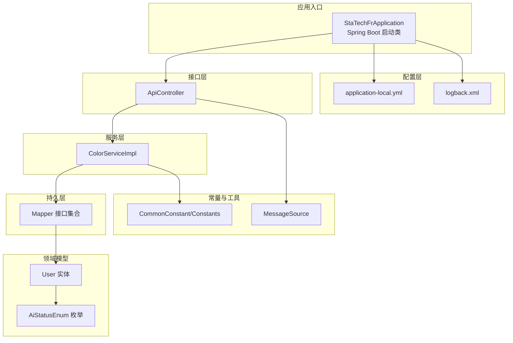
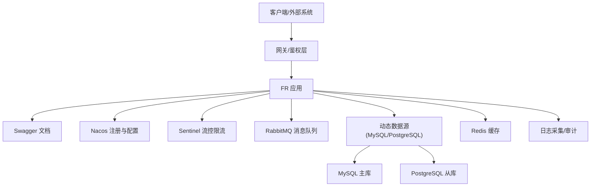
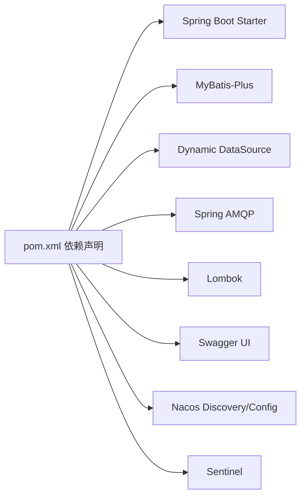
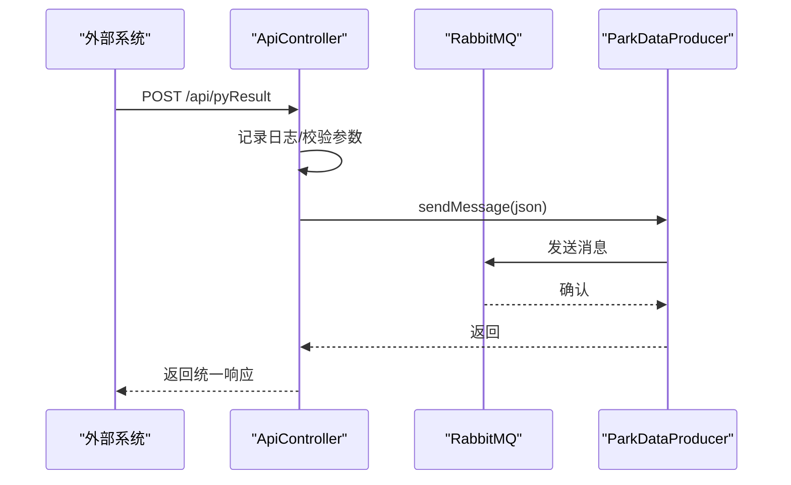

# 代码规范与风格

<cite>
**本文引用的文件**
- [StaTechFrApplication.java](file://src/main/java/cn/staitech/fr/StaTechFrApplication.java)
- [CommonConstant.java](file://src/main/java/cn/staitech/fr/constant/CommonConstant.java)
- [Constants.java](file://src/main/java/cn/staitech/fr/constant/Constants.java)
- [MapConstant.java](file://src/main/java/cn/staitech/fr/config/MapConstant.java)
- [AiStatusEnum.java](file://src/main/java/cn/staitech/fr/enums/AiStatusEnum.java)
- [User.java](file://src/main/java/cn/staitech/fr/domain/User.java)
- [ColorServiceImpl.java](file://src/main/java/cn/staitech/fr/service/impl/ColorServiceImpl.java)
- [ApiController.java](file://src/main/java/cn/staitech/fr/controller/ApiController.java)
- [MessageSource.java](file://src/main/java/cn/staitech/fr/utils/MessageSource.java)
- [application-local.yml](file://src/main/resources/application-local.yml)
- [logback.xml](file://src/main/resources/logback.xml)
- [.gitignore](file://.gitignore)
- [pom.xml](file://pom.xml)
</cite>

## 目录
1. [引言](#引言)
2. [项目结构](#项目结构)
3. [核心组件](#核心组件)
4. [架构总览](#架构总览)
5. [详细组件分析](#详细组件分析)
6. [依赖分析](#依赖分析)
7. [性能考虑](#性能考虑)
8. [故障排查指南](#故障排查指南)
9. [结论](#结论)
10. [附录](#附录)

## 引言
本指南面向 FR 模块的 Java 开发团队，旨在统一编码风格、命名约定、注释标准、包结构组织原则，并明确 Lombok 使用规范、日志记录标准、异常处理模式、代码格式化配置、IDEA 代码检查规则以及 Git 提交信息规范。同时提供高质量单元测试与集成测试的编写建议，帮助提升代码质量与可维护性。

## 项目结构
FR 模块采用标准 Maven 结构，按领域分层组织代码：
- config：配置类、线程池、过滤器、消息队列等
- constant：常量定义
- controller：REST 接口层
- domain：实体与 DTO/VO
- enums：枚举
- mapper：MyBatis 映射接口
- service：服务接口与实现
- utils：通用工具类
- resources：配置文件、Mapper XML、国际化资源

图表来源
- [StaTechFrApplication.java:39-62](file://src/main/java/cn/staitech/fr/StaTechFrApplication.java#L39-L62)
- [application-local.yml:1-311](file://src/main/resources/application-local.yml#L1-L311)
- [logback.xml:1-102](file://src/main/resources/logback.xml#L1-L102)
- [ApiController.java:30-60](file://src/main/java/cn/staitech/fr/controller/ApiController.java#L30-L60)
- [ColorServiceImpl.java:14-18](file://src/main/java/cn/staitech/fr/service/impl/ColorServiceImpl.java#L14-L18)
- [User.java:14-216](file://src/main/java/cn/staitech/fr/domain/User.java#L14-L216)
- [AiStatusEnum.java:3-24](file://src/main/java/cn/staitech/fr/enums/AiStatusEnum.java#L3-L24)
- [CommonConstant.java:8-43](file://src/main/java/cn/staitech/fr/constant/CommonConstant.java#L8-L43)
- [Constants.java:14-110](file://src/main/java/cn/staitech/fr/constant/Constants.java#L14-L110)
- [MessageSource.java:13-82](file://src/main/java/cn/staitech/fr/utils/MessageSource.java#L13-L82)

章节来源
- [StaTechFrApplication.java:39-62](file://src/main/java/cn/staitech/fr/StaTechFrApplication.java#L39-L62)
- [application-local.yml:1-311](file://src/main/resources/application-local.yml#L1-L311)
- [logback.xml:1-102](file://src/main/resources/logback.xml#L1-L102)

## 核心组件
- 应用启动类：启用发现、异步、事务、MyBatis Plus 分页拦截器、Swagger、安全注解等
- 配置文件：本地开发环境、动态数据源、RabbitMQ、Swagger、日志级别、管理端点暴露
- 日志配置：控制台输出、按日志文件名分拣的滚动文件输出、模块级别控制
- 常量与枚举：业务常量、通用常量、枚举定义
- 实体与服务：MyBatis-Plus 实体注解、基础 Service 实现
- 工具类：国际化消息工具

章节来源
- [StaTechFrApplication.java:39-62](file://src/main/java/cn/staitech/fr/StaTechFrApplication.java#L39-L62)
- [application-local.yml:1-311](file://src/main/resources/application-local.yml#L1-L311)
- [logback.xml:1-102](file://src/main/resources/logback.xml#L1-L102)
- [CommonConstant.java:8-43](file://src/main/java/cn/staitech/fr/constant/CommonConstant.java#L8-L43)
- [Constants.java:14-110](file://src/main/java/cn/staitech/fr/constant/Constants.java#L14-L110)
- [AiStatusEnum.java:3-24](file://src/main/java/cn/staitech/fr/enums/AiStatusEnum.java#L3-L24)
- [User.java:14-216](file://src/main/java/cn/staitech/fr/domain/User.java#L14-L216)
- [ColorServiceImpl.java:14-18](file://src/main/java/cn/staitech/fr/service/impl/ColorServiceImpl.java#L14-L18)
- [MessageSource.java:13-82](file://src/main/java/cn/staitech/fr/utils/MessageSource.java#L13-L82)

## 架构总览
FR 模块采用 Spring Boot + Spring Cloud Alibaba + MyBatis-Plus 架构，结合多数据源、RabbitMQ、Sentinel、Nacos 发现与配置中心，提供高可用、可扩展的阅片能力。

图表来源
- [pom.xml:19-211](file://pom.xml#L19-L211)
- [application-local.yml:1-311](file://src/main/resources/application-local.yml#L1-L311)
- [logback.xml:1-102](file://src/main/resources/logback.xml#L1-L102)

## 详细组件分析

### 包结构组织原则
- 域名反写 + 模块标识：cn.staitech.fr
- 层次清晰：config、constant、controller、domain、enums、mapper、service、utils、vo
- 领域内聚：同一业务域内的实体、枚举、服务、策略在同一包或子包内
- 配置集中：公共配置在 config，环境相关在 resources

章节来源
- [StaTechFrApplication.java:1-25](file://src/main/java/cn/staitech/fr/StaTechFrApplication.java#L1-L25)

### 类与方法命名规范
- 类名：采用名词或复合词，首字母大写，驼峰式；如 User、ApiController、AiStatusEnum
- 方法名：动词短语，小驼峰；如 pyResult、sendDelayedMessage
- 接口实现：以 Impl 结尾，如 ColorServiceImpl
- 枚举：名词或形容词，全大写下划线风格常量名（若需兼容旧版），或使用枚举类型（推荐）
- 常量：全大写下划线，语义明确；如 FORECAST_STATUS_PROCESS

章节来源
- [User.java:14-216](file://src/main/java/cn/staitech/fr/domain/User.java#L14-L216)
- [ApiController.java:30-60](file://src/main/java/cn/staitech/fr/controller/ApiController.java#L30-L60)
- [ColorServiceImpl.java:14-18](file://src/main/java/cn/staitech/fr/service/impl/ColorServiceImpl.java#L14-L18)
- [AiStatusEnum.java:3-24](file://src/main/java/cn/staitech/fr/enums/AiStatusEnum.java#L3-L24)
- [CommonConstant.java:8-43](file://src/main/java/cn/staitech/fr/constant/CommonConstant.java#L8-L43)
- [Constants.java:14-110](file://src/main/java/cn/staitech/fr/constant/Constants.java#L14-L110)

### 常量定义规则
- 业务常量：集中于 Constants.java，使用语义化字段名与注释
- 通用常量：集中于 CommonConstant.java，如文件扩展名、单位、URL 模板
- 枚举常量：优先使用枚举类型表达离散状态，避免魔法数
- 配置常量：通过 application-local.yml 或 Nacos 配置中心注入，避免硬编码

章节来源
- [Constants.java:14-110](file://src/main/java/cn/staitech/fr/constant/Constants.java#L14-L110)
- [CommonConstant.java:8-43](file://src/main/java/cn/staitech/fr/constant/CommonConstant.java#L8-L43)
- [AiStatusEnum.java:3-24](file://src/main/java/cn/staitech/fr/enums/AiStatusEnum.java#L3-L24)

### Lombok 使用规范
- 实体类：使用 @Data 简化 getter/setter/toString/hashCode/equals
- 日志：使用 @Slf4j 统一日志注入
- 注解：避免过度使用，保持可读性；仅在必要处简化样板代码
- 注意：与 MyBatis-Plus 的注解配合使用时，确保生成器与注解不冲突

章节来源
- [User.java:14-216](file://src/main/java/cn/staitech/fr/domain/User.java#L14-L216)
- [StaTechFrApplication.java:10-10](file://src/main/java/cn/staitech/fr/StaTechFrApplication.java#L10-L10)
- [ColorServiceImpl.java:14-18](file://src/main/java/cn/staitech/fr/service/impl/ColorServiceImpl.java#L14-L18)

### 日志记录标准
- 输出格式：包含时间戳、线程名、Trace ID、方法名、行号、级别、Logger 名称、消息
- 分级：INFO/DEBUG/WARN/ERROR；生产环境避免过细粒度日志
- 模块级别：针对 cn.staitech.fr.mapper、特定 Service 等设置独立级别
- 文件输出：按日志文件名分拣，保留最近若干天

章节来源
- [logback.xml:6-101](file://src/main/resources/logback.xml#L6-L101)

### 异常处理模式
- 控制器层：返回统一响应包装对象，捕获异常并返回错误信息
- 服务层：抛出受检/非受检异常，由上层统一处理
- 建议：定义统一异常处理器，规范化错误码与提示

章节来源
- [ApiController.java:42-48](file://src/main/java/cn/staitech/fr/controller/ApiController.java#L42-L48)

### 代码格式化与 IDE 规则
- 格式化：使用项目统一的 IDE 格式化模板（建议基于 Google Java Style 或 Alibaba Java Coding Guidelines）
- 规则：禁止导入未使用的类、禁止静态导入、禁止魔法数、统一换行与缩进
- 插件：启用 SonarLint、SpotBugs、Checkstyle 等增强静态检查
- 提交前：执行格式化、静态检查、单元测试

章节来源
- [.gitignore:1-50](file://.gitignore#L1-L50)

### Git 提交信息规范
- 类型：feat: 新功能；fix: 修复；docs: 文档；style: 格式；refactor: 重构；test: 测试；chore: 构建
- 格式：type(scope): subject
- 示例：feat(controller): 添加外部算法回调接口
- 冲突：合并前确保提交信息清晰可追溯

章节来源
- [.gitignore:1-50](file://.gitignore#L1-L50)

### 单元测试与集成测试
- 单元测试：覆盖核心业务逻辑、边界条件、异常分支；使用 Mockito stub/spy；断言清晰
- 集成测试：验证接口行为、数据库交互、消息队列流程；使用 Testcontainers 或嵌入式数据库
- 覆盖率：目标行覆盖率≥80%，分支覆盖率≥60%
- 命名：Test 后缀类；方法以 test 前缀，语义化描述场景

章节来源
- [ColorServiceImpl.java:14-18](file://src/main/java/cn/staitech/fr/service/impl/ColorServiceImpl.java#L14-L18)
- [ApiController.java:30-60](file://src/main/java/cn/staitech/fr/controller/ApiController.java#L30-L60)

## 依赖分析
FR 模块依赖 Spring 生态、MyBatis-Plus、动态数据源、RabbitMQ、Swagger、Lombok 等，构建阶段支持多环境 Profile 切换。

图表来源
- [pom.xml:19-211](file://pom.xml#L19-L211)

章节来源
- [pom.xml:19-211](file://pom.xml#L19-L211)

## 性能考虑
- 数据访问：合理使用分页拦截器、索引优化、批量操作
- 缓存：热点数据使用 Redis，注意缓存一致性
- 并发：线程池参数与队列容量按业务峰值评估
- 日志：避免高频 INFO/DEBUG 输出，生产环境降低级别
- MQ：确认消息幂等、重试策略与死信队列

## 故障排查指南
- 启动日志：查看应用启动端口、Swagger 地址、Nacos 加载配置
- 数据源：确认主从库连接、连接池参数、事务隔离级别
- MQ：确认队列、交换机、路由键、消费者确认模式
- 日志：按模块与级别定位问题，结合 Trace ID 追踪请求链路

章节来源
- [StaTechFrApplication.java:45-52](file://src/main/java/cn/staitech/fr/StaTechFrApplication.java#L45-L52)
- [application-local.yml:15-75](file://src/main/resources/application-local.yml#L15-L75)
- [logback.xml:85-101](file://src/main/resources/logback.xml#L85-L101)

## 结论
通过统一的包结构、命名与注释规范，结合 Lombok、日志与异常处理最佳实践，以及完善的静态检查与测试策略，FR 模块可在保证可读性的同时提升可维护性与稳定性。建议持续引入自动化检查与 CI 流水线，确保规范落地。

## 附录

### 关键流程时序图：外部算法回调处理

图表来源
- [ApiController.java:38-49](file://src/main/java/cn/staitech/fr/controller/ApiController.java#L38-L49)