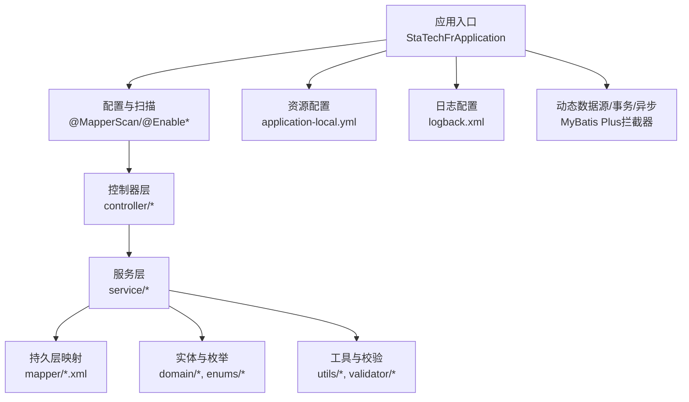
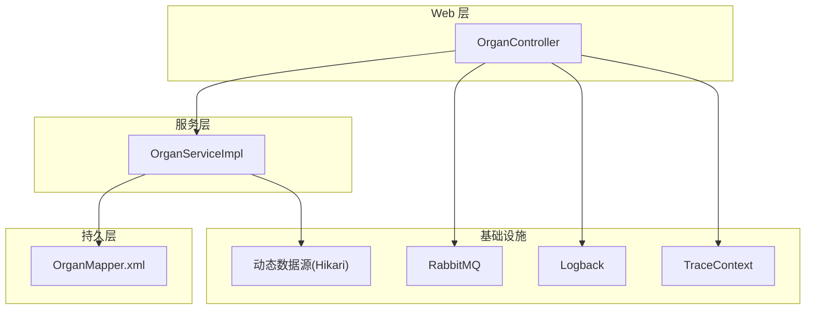
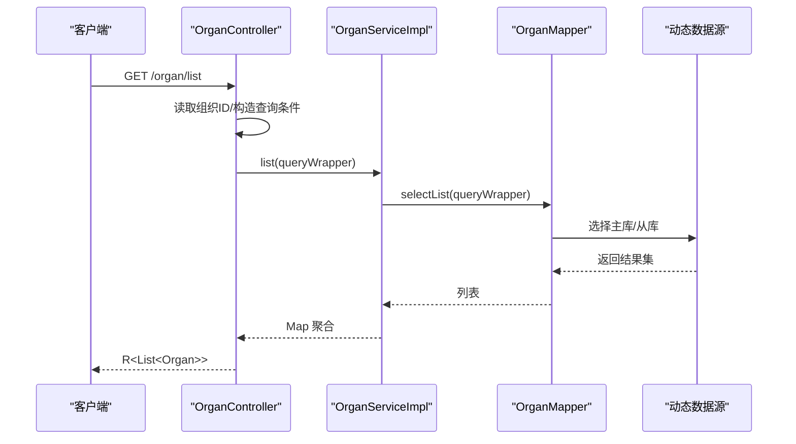
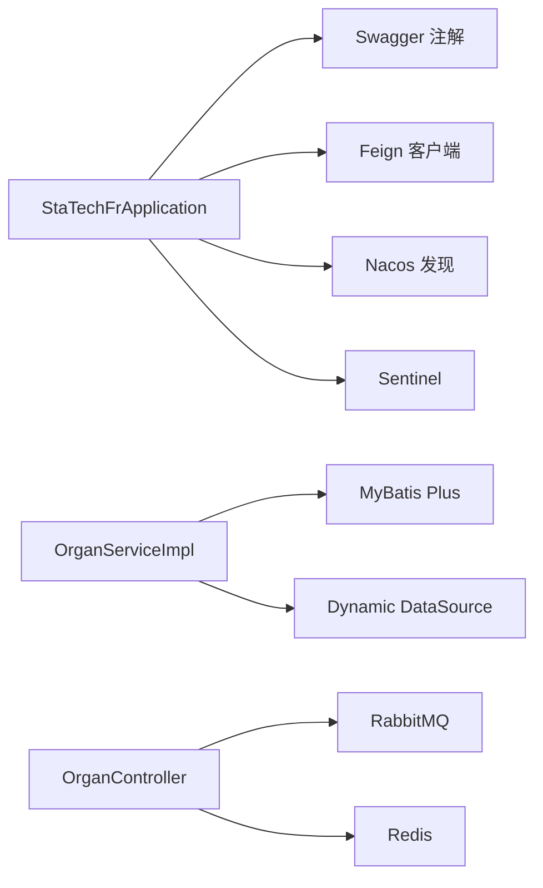
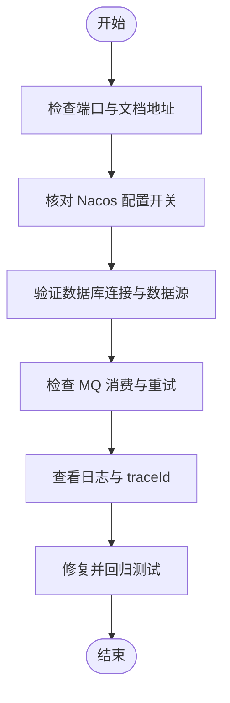

# 开发指南

<cite>
**本文引用的文件**
- [pom.xml](file://pom.xml)
- [StaTechFrApplication.java](file://src/main/java/cn/staitech/fr/StaTechFrApplication.java)
- [application-local.yml](file://src/main/resources/application-local.yml)
- [bootstrap-local.yml](file://src/main/resources/bootstrap-local.yml)
- [logback.xml](file://src/main/resources/logback.xml)
- [.gitignore](file://.gitignore)
- [MapConstant.java](file://src/main/java/cn/staitech/fr/config/MapConstant.java)
- [TraceContext.java](file://src/main/java/cn/staitech/fr/config/TraceContext.java)
- [CommonConstant.java](file://src/main/java/cn/staitech/fr/constant/CommonConstant.java)
- [AiStatusEnum.java](file://src/main/java/cn/staitech/fr/enums/AiStatusEnum.java)
- [DelayMessageDTO.java](file://src/main/java/cn/staitech/fr/domain/dto/DelayMessageDTO.java)
- [OrganController.java](file://src/main/java/cn/staitech/fr/controller/OrganController.java)
- [OrganServiceImpl.java](file://src/main/java/cn/staitech/fr/service/impl/OrganServiceImpl.java)
- [StringItemInValidator.java](file://src/main/java/cn/staitech/fr/utils/validator/StringItemInValidator.java)
</cite>

## 目录
1. [简介](#简介)
2. [项目结构](#项目结构)
3. [核心组件](#核心组件)
4. [架构总览](#架构总览)
5. [详细组件分析](#详细组件分析)
6. [依赖分析](#依赖分析)
7. [性能考虑](#性能考虑)
8. [故障排查指南](#故障排查指南)
9. [结论](#结论)
10. [附录](#附录)

## 简介
本指南面向新加入的开发者，帮助你快速搭建 FR 数字阅片模块的开发环境，掌握代码规范、测试策略与调试技巧，并明确新增功能、修改现有代码与代码审查的流程。FR 模块基于 Spring Boot 与 MyBatis-Plus 构建，使用动态数据源、RabbitMQ、Nacos/Sentinel 等中间件，提供脏器、结构、标注、AI 预测等能力。

## 项目结构
FR 模块采用标准 Maven 结构，主要代码位于 src/main/java 与 src/main/resources 下，包含配置、常量、控制器、领域模型、服务、工具类与 XML 映射文件。Maven POM 定义了多环境 Profile 与资源过滤，便于在不同环境快速切换。

图表来源
- [StaTechFrApplication.java:34-60](file://src/main/java/cn/staitech/fr/StaTechFrApplication.java#L34-L60)
- [application-local.yml:5-83](file://src/main/resources/application-local.yml#L5-L83)
- [logback.xml:85-101](file://src/main/resources/logback.xml#L85-L101)

章节来源
- [pom.xml:1-366](file://pom.xml#L1-L366)
- [StaTechFrApplication.java:1-63](file://src/main/java/cn/staitech/fr/StaTechFrApplication.java#L1-L63)
- [application-local.yml:1-311](file://src/main/resources/application-local.yml#L1-L311)
- [logback.xml:1-102](file://src/main/resources/logback.xml#L1-L102)

## 核心组件
- 应用入口与装配
  - 启动类启用发现、异步、事务、Swagger、Feign 客户端与 Mapper 扫描，注册分页插件。
- 动态数据源与连接池
  - 通过 Hikari 配置主从库连接池，支持读写分离与连接超时、校验等参数。
- MQ 与消息重试
  - RabbitMQ 配置手动确认、重试次数与间隔；提供延迟消息 DTO。
- 日志与追踪
  - Logback 按模块与启动类型输出；TraceContext 提供跨线程传播的 traceId。
- 常量与枚举
  - 通用常量与 AI 状态枚举，统一业务语义与取值。

章节来源
- [StaTechFrApplication.java:26-62](file://src/main/java/cn/staitech/fr/StaTechFrApplication.java#L26-L62)
- [application-local.yml:15-54](file://src/main/resources/application-local.yml#L15-L54)
- [application-local.yml:57-75](file://src/main/resources/application-local.yml#L57-L75)
- [DelayMessageDTO.java:1-9](file://src/main/java/cn/staitech/fr/domain/dto/DelayMessageDTO.java#L1-L9)
- [TraceContext.java:1-82](file://src/main/java/cn/staitech/fr/config/TraceContext.java#L1-L82)
- [logback.xml:1-102](file://src/main/resources/logback.xml#L1-L102)
- [CommonConstant.java:1-44](file://src/main/java/cn/staitech/fr/constant/CommonConstant.java#L1-L44)
- [AiStatusEnum.java:1-25](file://src/main/java/cn/staitech/fr/enums/AiStatusEnum.java#L1-L25)

## 架构总览
FR 模块采用典型的分层架构：Web 层（控制器）负责请求接入与返回封装；Service 层编排业务；Mapper 层访问数据库；配置层提供动态数据源、MQ、日志与追踪；工具层提供校验与几何计算等支撑。

图表来源
- [OrganController.java:1-43](file://src/main/java/cn/staitech/fr/controller/OrganController.java#L1-L43)
- [OrganServiceImpl.java:1-38](file://src/main/java/cn/staitech/fr/service/impl/OrganServiceImpl.java#L1-L38)
- [application-local.yml:15-54](file://src/main/resources/application-local.yml#L15-L54)
- [application-local.yml:57-75](file://src/main/resources/application-local.yml#L57-L75)
- [logback.xml:85-101](file://src/main/resources/logback.xml#L85-L101)
- [TraceContext.java:1-82](file://src/main/java/cn/staitech/fr/config/TraceContext.java#L1-L82)

## 详细组件分析

### 控制器与服务调用链
控制器负责鉴权上下文与查询条件拼装，服务层进行聚合与转换，最终返回统一响应包装。

图表来源
- [OrganController.java:33-40](file://src/main/java/cn/staitech/fr/controller/OrganController.java#L33-L40)
- [OrganServiceImpl.java:24-32](file://src/main/java/cn/staitech/fr/service/impl/OrganServiceImpl.java#L24-L32)
- [application-local.yml:15-54](file://src/main/resources/application-local.yml#L15-L54)

章节来源
- [OrganController.java:1-43](file://src/main/java/cn/staitech/fr/controller/OrganController.java#L1-L43)
- [OrganServiceImpl.java:1-38](file://src/main/java/cn/staitech/fr/service/impl/OrganServiceImpl.java#L1-L38)

### 动态数据源与连接池配置
- 主库/从库均使用 Hikari，配置连接池大小、空闲超时、最大生命周期、连接超时与校验。
- 默认主库，支持按需路由至从库。

章节来源
- [application-local.yml:15-56](file://src/main/resources/application-local.yml#L15-L56)

### MQ 消费与重试
- 生产者确认模式为 correlated，消费者手动确认；失败重试次数与间隔可配置。
- 提供延迟消息 DTO，用于延时队列场景。

章节来源
- [application-local.yml:57-75](file://src/main/resources/application-local.yml#L57-L75)
- [DelayMessageDTO.java:1-9](file://src/main/java/cn/staitech/fr/domain/dto/DelayMessageDTO.java#L1-L9)

### 日志与追踪
- Logback 按模块与启动类型输出，支持 Console 与按文件名分拣的 Rolling 文件。
- TraceContext 使用 TransmittableThreadLocal 传递 traceId 至 MDC，保证日志关联性。

章节来源
- [logback.xml:1-102](file://src/main/resources/logback.xml#L1-L102)
- [TraceContext.java:1-82](file://src/main/java/cn/staitech/fr/config/TraceContext.java#L1-L82)

### 常量与枚举
- 通用常量集中定义缓存键、文件后缀、单位等。
- AI 状态枚举统一状态码与描述，便于前端展示与状态机演进。

章节来源
- [CommonConstant.java:1-44](file://src/main/java/cn/staitech/fr/constant/CommonConstant.java#L1-L44)
- [AiStatusEnum.java:1-25](file://src/main/java/cn/staitech/fr/enums/AiStatusEnum.java#L1-L25)

### 校验器与约束
- 自定义字符串枚举校验器，支持注解声明允许值集合，简化入参校验。

章节来源
- [StringItemInValidator.java:1-39](file://src/main/java/cn/staitech/fr/utils/validator/StringItemInValidator.java#L1-L39)

### 配置常量初始化
- MapConstant 在启动后初始化脏器、机构、结构尺寸与病理指标映射，供全局使用。

章节来源
- [MapConstant.java:1-119](file://src/main/java/cn/staitech/fr/config/MapConstant.java#L1-L119)

## 依赖分析
- 核心依赖
  - Spring Cloud Alibaba（Nacos 发现/配置、Sentinel）
  - MyBatis-Plus 与动态数据源
  - RabbitMQ Starter
  - Redis、MySQL/PGSQL 连接
  - Swagger、安全与通用组件
- 资源打包
  - 打包时包含本地 lib 与模板目录，便于嵌入第三方依赖与模板文件。

图表来源
- [pom.xml:19-211](file://pom.xml#L19-L211)
- [StaTechFrApplication.java:29-37](file://src/main/java/cn/staitech/fr/StaTechFrApplication.java#L29-L37)

章节来源
- [pom.xml:1-366](file://pom.xml#L1-L366)

## 性能考虑
- 数据访问
  - 使用 MyBatis Plus 分页拦截器，避免全表扫描；合理使用索引与查询条件。
  - 动态数据源建议读写分离，长事务与大批量查询走从库。
- MQ
  - 手动确认与重试策略降低丢消息风险；对高吞吐场景调整消费者并发与批处理大小。
- 缓存与常量
  - MapConstant 初始化后复用，减少重复查询；注意缓存失效与热更新策略。
- 日志
  - 控制台输出与滚动文件分离，避免 IO 抖动；生产环境建议降低日志级别。

章节来源
- [StaTechFrApplication.java:54-60](file://src/main/java/cn/staitech/fr/StaTechFrApplication.java#L54-L60)
- [application-local.yml:15-54](file://src/main/resources/application-local.yml#L15-L54)
- [application-local.yml:57-75](file://src/main/resources/application-local.yml#L57-L75)
- [MapConstant.java:100-116](file://src/main/java/cn/staitech/fr/config/MapConstant.java#L100-L116)
- [logback.xml:85-101](file://src/main/resources/logback.xml#L85-L101)

## 故障排查指南
- 启动与端口
  - 启动日志会打印文档地址与端口；如无法访问，检查 server.port 与防火墙。
- Nacos 与配置
  - 本地关闭 Nacos 配置与发现；若需远程配置，请开启相应 Profile 并核对地址与命名空间。
- 数据库连接
  - 核对主从库地址、账号密码与驱动；关注连接池参数与超时设置。
- MQ 消费
  - 确认手动确认与重试配置；查看队列与死信策略；必要时开启生产者确认回调。
- 日志与追踪
  - 查看 traceId 是否正确注入；结合 MDC 字段定位请求链路。
- 常见问题定位流程

图表来源
- [StaTechFrApplication.java:45-52](file://src/main/java/cn/staitech/fr/StaTechFrApplication.java#L45-L52)
- [bootstrap-local.yml:1-9](file://src/main/resources/bootstrap-local.yml#L1-L9)
- [application-local.yml:15-54](file://src/main/resources/application-local.yml#L15-L54)
- [application-local.yml:57-75](file://src/main/resources/application-local.yml#L57-L75)
- [logback.xml:85-101](file://src/main/resources/logback.xml#L85-L101)
- [TraceContext.java:47-80](file://src/main/java/cn/staitech/fr/config/TraceContext.java#L47-L80)

## 结论
本指南提供了 FR 模块的开发环境、代码规范、测试与调试要点以及新增与修改流程。建议新同学先从启动配置与日志追踪入手，再逐步熟悉控制器-服务-映射的调用链与动态数据源、MQ 的使用方式，最后结合常量与枚举统一业务语义，持续提升代码质量与交付效率。

## 附录

### 开发环境搭建
- JDK 与 Maven
  - 使用 Maven 3.6+，JDK 8/11（按团队约定）。
- IDE 推荐
  - IntelliJ IDEA；导入项目后启用 Lombok 插件与注解处理器。
- 本地运行
  - 使用本地 Profile 启动，确保 Redis、MQ、数据库可达。
- Git 工作流
  - 基于分支策略提交变更，遵循提交信息规范与 PR 流程。

章节来源
- [.gitignore:1-50](file://.gitignore#L1-L50)
- [bootstrap-local.yml:1-9](file://src/main/resources/bootstrap-local.yml#L1-L9)

### Maven 构建与环境
- 构建命令
  - 开发：mvn clean package -pl . -am -DskipTests
  - 指定 Profile：mvn spring-boot:run -P local
- 资源与模板
  - 打包包含本地 lib 与 template 目录，确保第三方依赖与模板可用。

章节来源
- [pom.xml:236-300](file://pom.xml#L236-L300)
- [pom.xml:254-273](file://pom.xml#L254-L273)

### 代码规范与命名约定
- 包与层级
  - controller、service、mapper、domain、utils、config、enums 等分层清晰。
- 类命名
  - 控制器以 Controller 结尾；服务以 Service 结尾；实现类以 Impl 结尾；枚举以 Enum 结尾；常量类以 Constant 结尾。
- 方法命名
  - 驼峰命名；GET/POST/PUT/DELETE 对应 RESTful 路由；返回统一使用 R<T> 包装。
- 注释规范
  - 类与方法保留作者与版本信息；公共接口与复杂逻辑补充注释；枚举与常量提供语义说明。

章节来源
- [OrganController.java:1-43](file://src/main/java/cn/staitech/fr/controller/OrganController.java#L1-L43)
- [OrganServiceImpl.java:1-38](file://src/main/java/cn/staitech/fr/service/impl/OrganServiceImpl.java#L1-L38)
- [AiStatusEnum.java:1-25](file://src/main/java/cn/staitech/fr/enums/AiStatusEnum.java#L1-L25)
- [CommonConstant.java:1-44](file://src/main/java/cn/staitech/fr/constant/CommonConstant.java#L1-L44)

### 测试策略与最佳实践
- 单元测试
  - 针对 Service 层进行 Mock 与断言；使用 @Test 与断言库验证返回值与异常。
- 集成测试
  - 使用 @SpringBootTest 启动容器，结合 @AutoConfigureTestDatabase 与测试数据库。
- 场景覆盖
  - 正常路径、边界条件、异常路径与并发场景；对 MQ 消费与重试进行模拟或真实验证。
- 性能测试
  - 使用压力测试工具验证分页、批量操作与 MQ 吞吐；关注慢查询与连接池占用。

章节来源
- [OrganServiceImpl.java:24-32](file://src/main/java/cn/staitech/fr/service/impl/OrganServiceImpl.java#L24-L32)

### 调试技巧与问题定位
- 日志定位
  - 使用 traceId 关联请求链路；按模块与启动类型筛选日志。
- 追踪传播
  - 在异步/线程池中使用 TraceContext 传递上下文，避免日志割裂。
- 数据一致性
  - 关注动态数据源路由与事务边界；长事务拆分与只读查询走从库。
- MQ 问题
  - 开启生产者确认与消费者手动确认；检查重试与死信队列配置。

章节来源
- [logback.xml:1-102](file://src/main/resources/logback.xml#L1-L102)
- [TraceContext.java:1-82](file://src/main/java/cn/staitech/fr/config/TraceContext.java#L1-L82)
- [application-local.yml:57-75](file://src/main/resources/application-local.yml#L57-L75)

### 新增功能与代码审查
- 新增步骤
  - 新增实体与 Mapper/XML；编写 Service 接口与实现；新增 Controller 路由与权限；完善常量与枚举；更新配置与日志。
- 修改现有代码
  - 保持向后兼容；更新相关测试；补充变更日志；必要时迁移脚本。
- 代码审查清单
  - 设计合理性、异常处理、日志与追踪、性能影响、安全与权限、测试覆盖率。

章节来源
- [CommonConstant.java:1-44](file://src/main/java/cn/staitech/fr/constant/CommonConstant.java#L1-L44)
- [AiStatusEnum.java:1-25](file://src/main/java/cn/staitech/fr/enums/AiStatusEnum.java#L1-L25)
- [MapConstant.java:1-119](file://src/main/java/cn/staitech/fr/config/MapConstant.java#L1-L119)