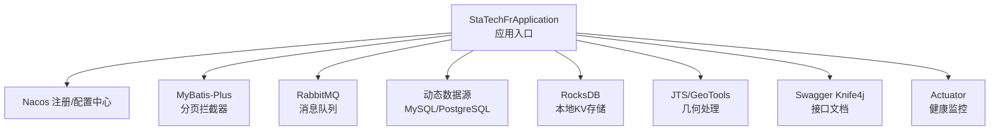
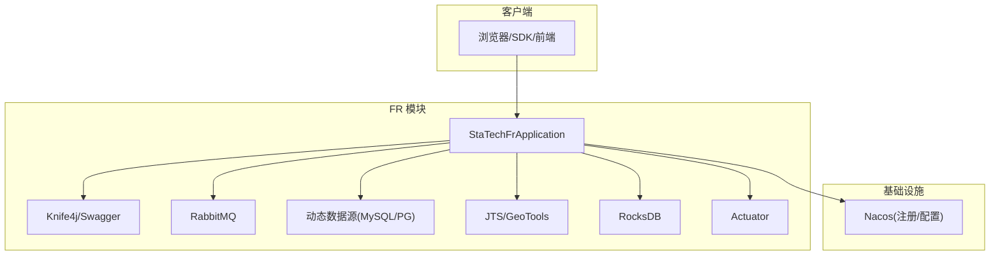
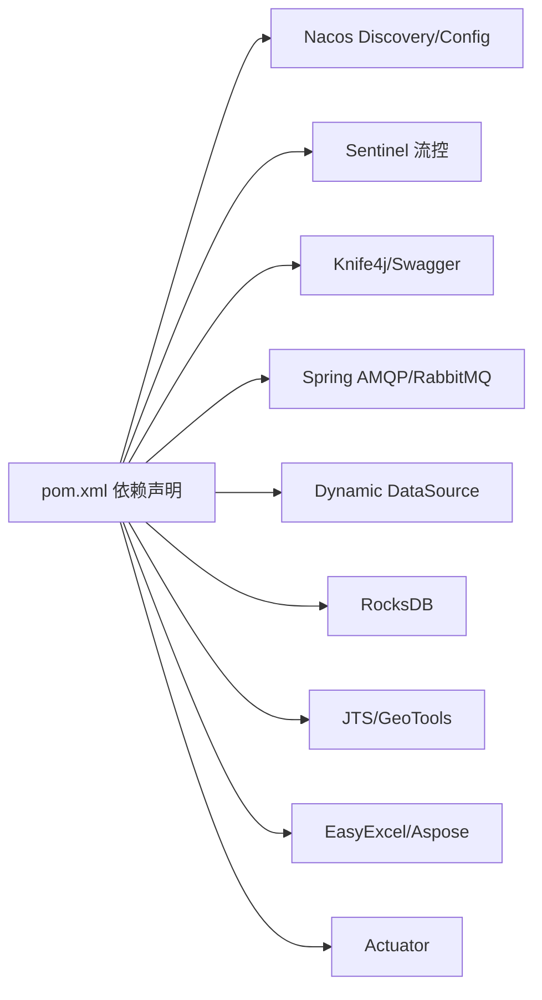

# 开发流程与协作

<cite>
**本文引用的文件**
- [pom.xml](file://pom.xml)
- [bootstrap.yml](file://src/main/resources/bootstrap.yml)
- [application-local.yml](file://src/main/resources/application-local.yml)
- [.gitignore](file://.gitignore)
- [V2.6.3-Mysql.sql](file://sql/V2.6.3-Mysql.sql)
- [update_v2.6.0.sql](file://sql/update_v2.6.0.sql)
- [StaTechFrApplication.java](file://src/main/java/cn/staitech/fr/StaTechFrApplication.java)
- [dockerfile](file://docker/staitech/modules/fr/dockerfile)
- [jmx_config.yaml](file://docker/staitech/modules/fr/jmx_config.yaml)
</cite>

## 目录
1. [简介](#简介)
2. [项目结构](#项目结构)
3. [核心组件](#核心组件)
4. [架构总览](#架构总览)
5. [详细组件分析](#详细组件分析)
6. [依赖分析](#依赖分析)
7. [性能考虑](#性能考虑)
8. [故障排查指南](#故障排查指南)
9. [结论](#结论)
10. [附录](#附录)

## 简介
本文件面向 FR 数字阅片模块的开发流程与团队协作规范，结合仓库中的配置与脚本，制定可落地的 Git 工作流、分支管理、代码评审、版本发布、变更管理与回滚策略，并配套开发任务分配、进度跟踪与质量保障流程，以及代码评审、知识分享与技术决策机制。目标是统一团队协作标准，提升交付质量与效率。

## 项目结构
FR 模块为基于 Spring Boot 的微服务应用，采用 Maven 构建，使用 Nacos 作为注册与配置中心，集成 MyBatis-Plus、RocksDB、JTS/GeoTools、AMQP/RabbitMQ 等能力，SQL 脚本用于数据库结构演进，Docker 化部署支持 JMX 监控。

图表来源
- [StaTechFrApplication.java:34-60](file://src/main/java/cn/staitech/fr/StaTechFrApplication.java#L34-L60)
- [bootstrap.yml:24-46](file://src/main/resources/bootstrap.yml#L24-L46)
- [application-local.yml:11-54](file://src/main/resources/application-local.yml#L11-L54)
- [pom.xml:19-121](file://pom.xml#L19-L121)

章节来源
- [pom.xml:19-121](file://pom.xml#L19-L121)
- [bootstrap.yml:1-48](file://src/main/resources/bootstrap.yml#L1-L48)
- [application-local.yml:1-311](file://src/main/resources/application-local.yml#L1-L311)
- [StaTechFrApplication.java:34-60](file://src/main/java/cn/staitech/fr/StaTechFrApplication.java#L34-L60)

## 核心组件
- 应用入口与装配
  - 启用服务发现、异步、事务、Swagger、Feign 客户端、Mapper 扫描等。
  - 默认时区设置为 Asia/Shanghai，启动日志输出文档地址。
- 数据访问与分页
  - MyBatis-Plus 分页拦截器全局生效，简化分页查询。
- 配置与注册中心
  - Nacos 服务注册与配置中心，支持多环境 profile 切换。
- 消息与数据源
  - RabbitMQ 消费监听与重试策略；动态数据源支持 MySQL/PostgreSQL。
- 几何与存储
  - JTS/GeoTools 几何处理；RocksDB 本地 KV 存储。
- 文档与监控
  - Knife4j/Swagger 文档；Actuator 暴露必要端点。

章节来源
- [StaTechFrApplication.java:34-60](file://src/main/java/cn/staitech/fr/StaTechFrApplication.java#L34-L60)
- [bootstrap.yml:24-46](file://src/main/resources/bootstrap.yml#L24-L46)
- [application-local.yml:57-83](file://src/main/resources/application-local.yml#L57-L83)

## 架构总览
FR 模块通过 Nacos 实现服务注册与配置下发，应用启动后加载多环境配置，连接动态数据源与消息队列，提供 REST 接口并通过 Knife4j/Swagger 暴露文档。Actuator 提供运行态健康信息，便于运维与监控。

图表来源
- [bootstrap.yml:24-46](file://src/main/resources/bootstrap.yml#L24-L46)
- [application-local.yml:11-54](file://src/main/resources/application-local.yml#L11-L54)
- [StaTechFrApplication.java:34-60](file://src/main/java/cn/staitech/fr/StaTechFrApplication.java#L34-L60)

## 详细组件分析

### Git 工作流与分支管理
- Feature Branch 工作流
  - 开发者在本地创建功能分支，命名建议：feature/模块-任务简述 或 feat/模块-任务简述。
  - 功能完成后推送远程分支并发起 Pull Request。
- 分支保护策略
  - 主分支（如 main/master）需保护，禁止直接推送，强制通过 PR 合并。
  - 重要分支（release/*、hotfix/*）需保护，合并前必须评审与测试。
- 提交规范
  - 提交信息遵循约定式提交：type(scope): subject，例如 feat(fr): 新增结构标签接口。
  - 附带 Jira/任务编号，如 feat(fr): JIRA-123 新增结构标签接口。
- 版本标记
  - 使用语义化版本号，遵循 X.Y.Z[-标识]，变更记录写入变更日志。
- 代码评审
  - PR 至少一名同级或更高权限工程师评审，确保通过 CI、单元测试与静态检查。
  - 评审要点：需求符合性、代码质量、安全性、性能影响、兼容性与回归风险。

章节来源
- [.gitignore:1-50](file://.gitignore#L1-L50)

### Pull Request 规范与合并策略
- PR 标题与描述
  - 标题明确变更类型与范围；描述包含背景、改动点、测试要点、风险评估与回滚预案。
- 评审清单
  - 是否满足需求；是否有单测覆盖；是否存在性能退化；是否引入安全漏洞；是否破坏向后兼容。
- 合并条件
  - 通过 CI 与评审；无冲突；通过自动化检查；满足分支保护规则。
- 合并方式
  - 优先使用 Squash 合并以保持提交历史整洁；重大变更可使用 Rebase 以保留完整历史。

章节来源
- [.gitignore:1-50](file://.gitignore#L1-L50)

### 版本发布流程
- 发布准备
  - 确认版本号、变更日志、数据库脚本与 Docker 镜像版本。
  - 在 release 分支上打 Tag，触发 CI 构建镜像与制品。
- 发布执行
  - 在测试环境验证；通过验收测试后发布至预生产/生产。
  - 记录发布清单与回滚点。
- 回滚策略
  - 若发布失败或严重缺陷，回滚至上一稳定版本；回滚前完成数据一致性校验与通知。

章节来源
- [pom.xml:302-363](file://pom.xml#L302-L363)
- [bootstrap.yml:20-22](file://src/main/resources/bootstrap.yml#L20-L22)

### 变更管理规范
- 变更分类
  - 功能变更、修复缺陷、性能优化、安全加固、依赖升级、配置调整。
- 变更审批
  - 中高风险变更需技术负责人审批；重大变更纳入变更委员会评审。
- 变更记录
  - 在变更日志中记录变更内容、影响面、测试情况与回滚预案。

章节来源
- [update_v2.6.0.sql:1-564](file://sql/update_v2.6.0.sql#L1-L564)
- [V2.6.3-Mysql.sql:1-15](file://sql/V2.6.3-Mysql.sql#L1-L15)

### 回滚策略
- 快速回滚
  - 通过镜像版本回滚；若涉及数据库变更，回滚至最近一次备份或执行逆向 SQL。
- 数据一致性
  - 回滚前后进行数据校验与业务验证，确保状态一致。
- 通知与复盘
  - 发布与回滚需通知相关方；事后进行复盘与改进。

章节来源
- [V2.6.3-Mysql.sql:1-15](file://sql/V2.6.3-Mysql.sql#L1-L15)
- [update_v2.6.0.sql:1-564](file://sql/update_v2.6.0.sql#L1-L564)

### 开发任务分配、进度跟踪与质量保证
- 任务分配
  - 通过项目管理工具（如 Jira/Tapd）拆解需求为任务，明确负责人与依赖关系。
- 进度跟踪
  - 每日站会同步进展；里程碑评审；可视化看板展示任务状态。
- 质量保证
  - 单元测试覆盖率不低于阈值；集成测试与端到端测试覆盖关键路径；静态检查与 Sonar 质量门禁。
  - 代码评审与结对编程用于复杂模块。

章节来源
- [pom.xml:276-297](file://pom.xml#L276-L297)

### 代码评审、知识分享与技术决策
- 代码评审
  - 强制 PR 评审；关注设计一致性、可维护性与性能。
- 知识分享
  - 技术分享会、文档沉淀、FAQ 与最佳实践库。
- 技术决策
  - 重大技术选型由技术委员会决策；评审记录与决策依据归档。

章节来源
- [pom.xml:19-121](file://pom.xml#L19-L121)

## 依赖分析
FR 模块依赖包括：Spring Cloud Alibaba（Nacos、Sentinel）、Swagger UI、RabbitMQ、动态数据源、RocksDB、JTS/GeoTools、EasyExcel/Aspose 等。构建阶段通过 Maven 插件打包资源与模板，支持多环境 Profile。

图表来源
- [pom.xml:19-121](file://pom.xml#L19-L121)

章节来源
- [pom.xml:19-121](file://pom.xml#L19-L121)

## 性能考虑
- 数据访问
  - 合理使用分页与索引；避免 N+1 查询；缓存热点数据。
- 并发与线程池
  - 控制并发度与线程池大小；异步处理耗时任务。
- 几何计算
  - 对大规模几何操作进行批处理与空间索引优化。
- 监控与调优
  - 通过 Actuator 与 JMX 监控应用指标，结合慢查询日志定位瓶颈。

章节来源
- [StaTechFrApplication.java:54-60](file://src/main/java/cn/staitech/fr/StaTechFrApplication.java#L54-L60)
- [application-local.yml:106-311](file://src/main/resources/application-local.yml#L106-L311)

## 故障排查指南
- 启动与注册
  - 检查 Nacos 地址与命名空间配置；确认服务端口与健康检查。
- 数据库与数据源
  - 核对主从库连接参数与连接池配置；确认索引与慢查询。
- 消息队列
  - 检查消费者确认与重试策略；排查死信队列与积压。
- 几何与存储
  - 校验几何输入合法性；确认 RocksDB 写入与读取路径。
- 日志与监控
  - 查看应用日志与 Actuator 指标；结合 JMX 配置进行 JVM 调优。

章节来源
- [bootstrap.yml:24-46](file://src/main/resources/bootstrap.yml#L24-L46)
- [application-local.yml:11-54](file://src/main/resources/application-local.yml#L11-L54)
- [jmx_config.yaml](file://docker/staitech/modules/fr/jmx_config.yaml)

## 结论
通过统一的 Git 工作流、严格的分支与评审规范、清晰的发布与回滚策略、完善的任务与质量保障流程，以及持续的知识分享与技术决策机制，FR 模块能够稳定高效地交付高质量功能。建议团队在实践中持续优化流程与工具链，确保长期可持续发展。

## 附录
- 部署与监控
  - 使用 Dockerfile 构建镜像；JMX 配置用于 JVM 监控；Actuator 暴露运行态信息。
- 数据库演进
  - SQL 脚本记录结构与字段变更；发布前进行兼容性与回滚验证。

章节来源
- [dockerfile](file://docker/staitech/modules/fr/dockerfile)
- [jmx_config.yaml](file://docker/staitech/modules/fr/jmx_config.yaml)
- [V2.6.3-Mysql.sql:1-15](file://sql/V2.6.3-Mysql.sql#L1-L15)
- [update_v2.6.0.sql:1-564](file://sql/update_v2.6.0.sql#L1-L564)