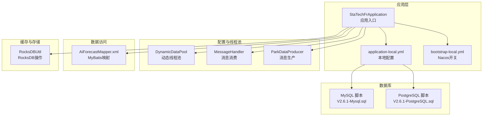
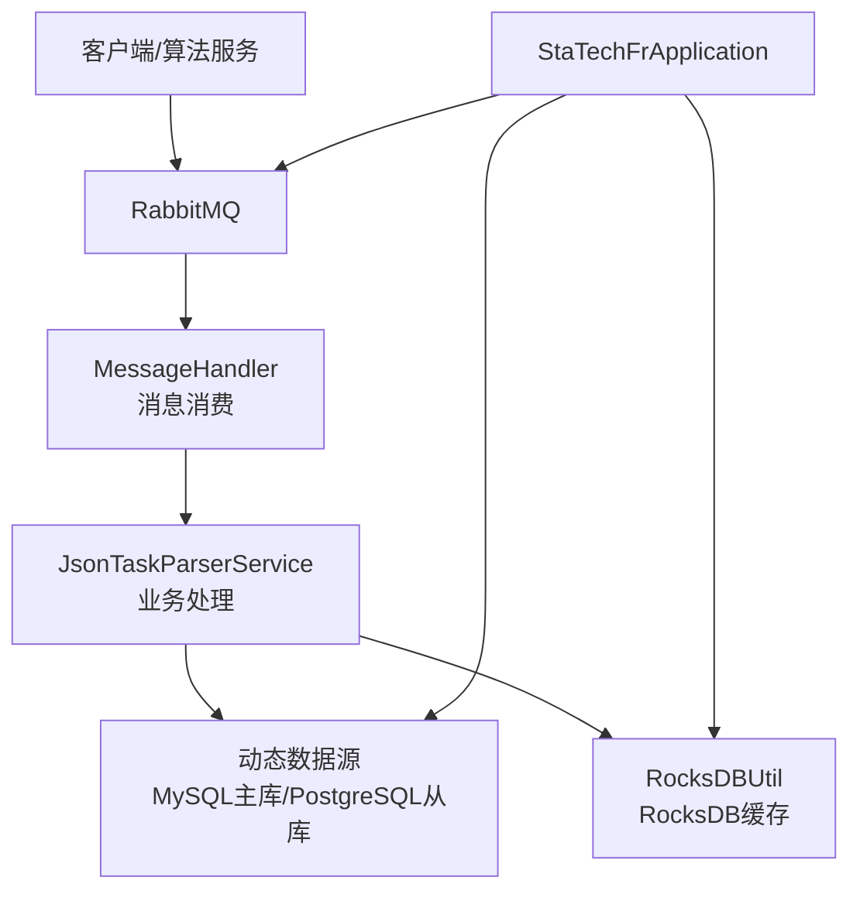
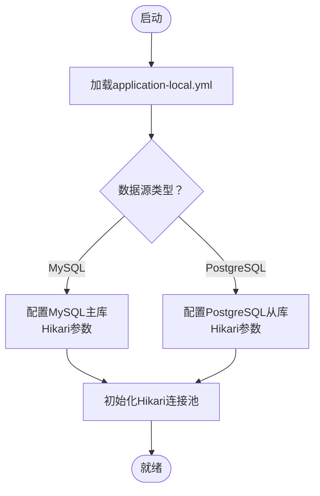
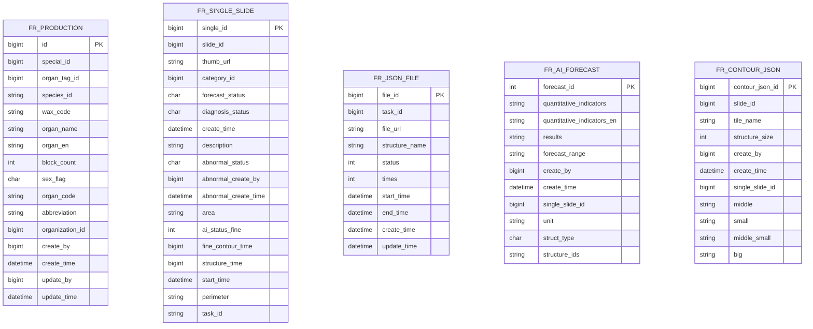
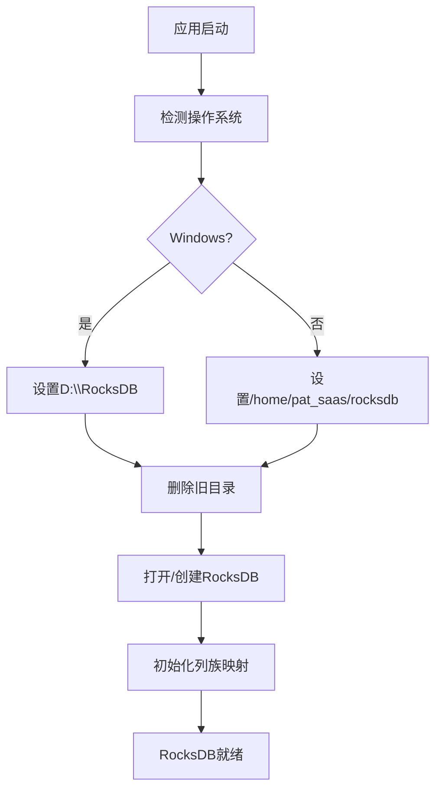
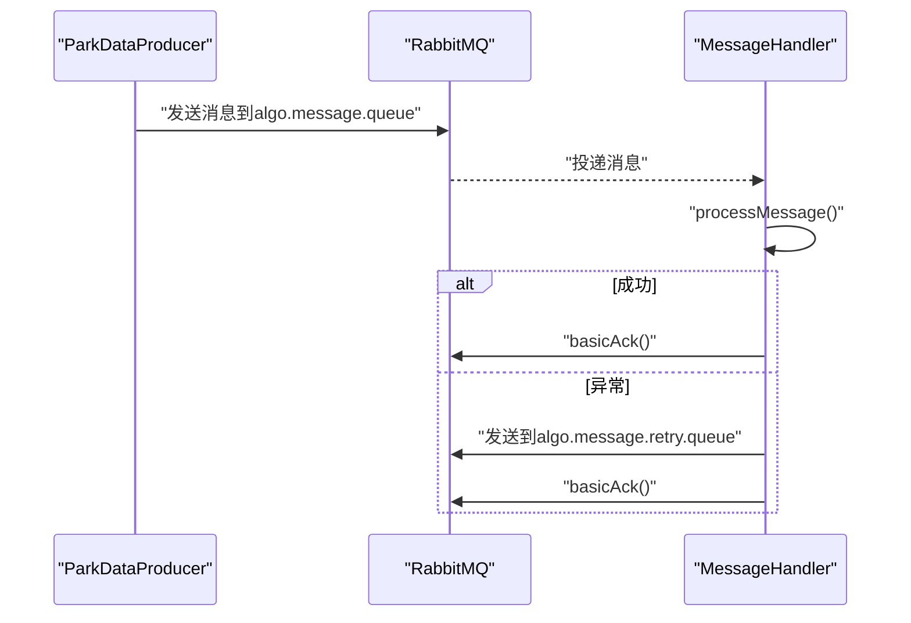
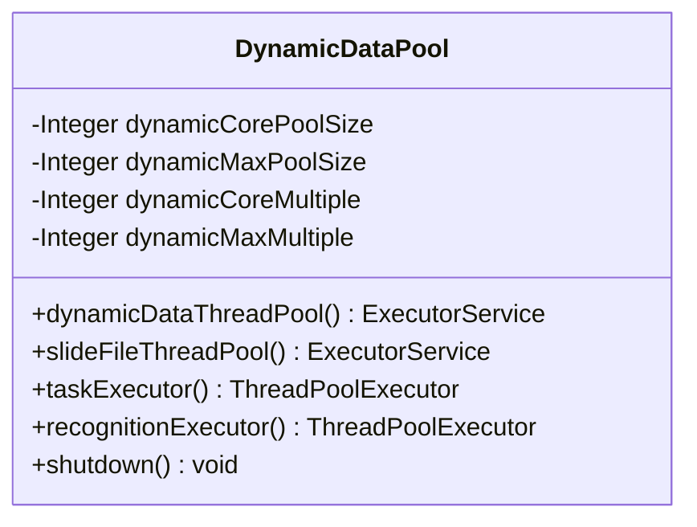
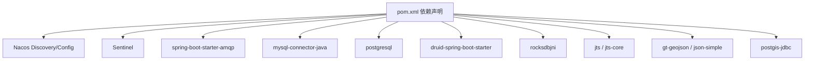

# 开发环境搭建

<cite>
**本文引用的文件**
- [pom.xml](file://pom.xml)
- [application-local.yml](file://src/main/resources/application-local.yml)
- [bootstrap-local.yml](file://src/main/resources/bootstrap-local.yml)
- [StaTechFrApplication.java](file://src/main/java/cn/staitech/fr/StaTechFrApplication.java)
- [DynamicDataPool.java](file://src/main/java/cn/staitech/fr/config/DynamicDataPool.java)
- [RocksDBUtil.java](file://src/main/java/cn/staitech/fr/utils/RocksDBUtil.java)
- [AiForecastMapper.xml](file://src/main/resources/mapper/AiForecastMapper.xml)
- [V2.6.1-Mysql.sql](file://sql/V2.6.1-Mysql.sql)
- [V2.6.1-PostgreSQL.sql](file://sql/V2.6.1-PostgreSQL.sql)
- [ParkDataProducer.java](file://src/main/java/cn/staitech/fr/config/ParkDataProducer.java)
- [MessageHandler.java](file://src/main/java/cn/staitech/fr/config/MessageHandler.java)
</cite>

## 目录
1. [简介](#简介)
2. [项目结构](#项目结构)
3. [核心组件](#核心组件)
4. [架构总览](#架构总览)
5. [详细组件分析](#详细组件分析)
6. [依赖分析](#依赖分析)
7. [性能考虑](#性能考虑)
8. [故障排查指南](#故障排查指南)
9. [结论](#结论)
10. [附录](#附录)

## 简介
本指南面向FR模块的本地开发环境搭建，覆盖JDK版本要求、IDE配置建议、Maven项目导入步骤，以及本地开发环境配置、数据库连接设置、Nacos服务配置、MySQL与PostgreSQL数据库配置、RocksDB缓存、消息队列（RabbitMQ）配置、IDEA/Eclipse项目导入方法、代码模板配置与调试环境设置，以及必要的系统依赖与环境变量配置。

## 项目结构
FR模块采用Spring Boot工程，主要由以下层次构成：
- 应用入口与配置：StaTechFrApplication、application-local.yml、bootstrap-local.yml
- 配置与线程池：DynamicDataPool、MessageHandler、ParkDataProducer
- 数据访问：MyBatis Mapper XML、数据源配置
- 缓存与存储：RocksDBUtil
- 数据库脚本：MySQL与PostgreSQL迁移脚本
- 依赖管理：pom.xml（含Nacos、Sentinel、RabbitMQ、RocksDB等）

**图表来源**
- [StaTechFrApplication.java:1-63](file://src/main/java/cn/staitech/fr/StaTechFrApplication.java#L1-L63)
- [application-local.yml:1-311](file://src/main/resources/application-local.yml#L1-L311)
- [bootstrap-local.yml:1-9](file://src/main/resources/bootstrap-local.yml#L1-L9)
- [DynamicDataPool.java:1-231](file://src/main/java/cn/staitech/fr/config/DynamicDataPool.java#L1-L231)
- [MessageHandler.java:1-128](file://src/main/java/cn/staitech/fr/config/MessageHandler.java#L1-L128)
- [ParkDataProducer.java:1-48](file://src/main/java/cn/staitech/fr/config/ParkDataProducer.java#L1-L48)
- [AiForecastMapper.xml:1-39](file://src/main/resources/mapper/AiForecastMapper.xml#L1-L39)
- [RocksDBUtil.java:1-321](file://src/main/java/cn/staitech/fr/utils/RocksDBUtil.java#L1-L321)
- [V2.6.1-Mysql.sql:1-200](file://sql/V2.6.1-Mysql.sql#L1-L200)
- [V2.6.1-PostgreSQL.sql:1-48](file://sql/V2.6.1-PostgreSQL.sql#L1-L48)

**章节来源**
- [pom.xml:1-366](file://pom.xml#L1-L366)
- [application-local.yml:1-311](file://src/main/resources/application-local.yml#L1-L311)
- [bootstrap-local.yml:1-9](file://src/main/resources/bootstrap-local.yml#L1-L9)
- [StaTechFrApplication.java:1-63](file://src/main/java/cn/staitech/fr/StaTechFrApplication.java#L1-L63)

## 核心组件
- 应用入口与启动：StaTechFrApplication负责启用发现、异步、事务、分页插件与Mapper扫描，并设置时区。
- 本地配置：application-local.yml集中管理Redis、数据源（MySQL主库、PostgreSQL从库）、RabbitMQ、MyBatis、Swagger、日志与管理端点等。
- Nacos开关：bootstrap-local.yml在本地禁用Nacos注册与配置。
- 动态线程池：DynamicDataPool提供多类线程池，支持可配置的核心/最大线程与队列容量。
- 消息队列：MessageHandler监听算法消息队列与延迟队列，实现手动确认与重试机制；ParkDataProducer负责消息发送与延迟消息投递。
- RocksDB缓存：RocksDBUtil封装列族管理、批量读写、迭代查询与计数等能力。
- 数据库脚本：V2.6.1-Mysql.sql与V2.6.1-PostgreSQL.sql分别定义MySQL与PostgreSQL的表结构与索引。

**章节来源**
- [StaTechFrApplication.java:26-62](file://src/main/java/cn/staitech/fr/StaTechFrApplication.java#L26-L62)
- [application-local.yml:5-106](file://src/main/resources/application-local.yml#L5-L106)
- [bootstrap-local.yml:1-9](file://src/main/resources/bootstrap-local.yml#L1-L9)
- [DynamicDataPool.java:12-231](file://src/main/java/cn/staitech/fr/config/DynamicDataPool.java#L12-L231)
- [MessageHandler.java:28-128](file://src/main/java/cn/staitech/fr/config/MessageHandler.java#L28-L128)
- [ParkDataProducer.java:17-48](file://src/main/java/cn/staitech/fr/config/ParkDataProducer.java#L17-L48)
- [RocksDBUtil.java:20-321](file://src/main/java/cn/staitech/fr/utils/RocksDBUtil.java#L20-L321)
- [V2.6.1-Mysql.sql:1-200](file://sql/V2.6.1-Mysql.sql#L1-L200)
- [V2.6.1-PostgreSQL.sql:1-48](file://sql/V2.6.1-PostgreSQL.sql#L1-L48)

## 架构总览
FR模块基于Spring Boot + Spring Cloud Alibaba，集成Nacos（本地禁用）、Sentinel、RabbitMQ、RocksDB与动态数据源（MySQL主库+PostgreSQL从库）。应用通过MyBatis访问数据库，通过RabbitMQ异步处理算法消息，通过RocksDB提供高性能KV存储。

**图表来源**
- [StaTechFrApplication.java:34-37](file://src/main/java/cn/staitech/fr/StaTechFrApplication.java#L34-L37)
- [MessageHandler.java:43-75](file://src/main/java/cn/staitech/fr/config/MessageHandler.java#L43-L75)
- [ParkDataProducer.java:27-44](file://src/main/java/cn/staitech/fr/config/ParkDataProducer.java#L27-L44)
- [application-local.yml:15-56](file://src/main/resources/application-local.yml#L15-L56)
- [RocksDBUtil.java:35-82](file://src/main/java/cn/staitech/fr/utils/RocksDBUtil.java#L35-L82)

## 详细组件分析

### JDK版本与构建工具
- JDK版本：pom.xml声明了Spring Boot Maven插件版本，结合父工程版本，建议使用与Spring Boot 2.6.x兼容的JDK版本（如JDK 8或11/17）以确保依赖与插件兼容性。
- Maven：使用Maven进行依赖管理与打包，包含资源过滤与模板打包配置。

**章节来源**
- [pom.xml:276-297](file://pom.xml#L276-L297)

### IDE配置建议（IDEA/Eclipse）
- IDEA
  - 导入方式：选择Maven项目，勾选“Import Maven projects automatically”，确保使用正确的JDK。
  - Lombok：启用注解处理（Enable Annotation Processing），避免编译期缺失Setter/Getter。
  - 代码模板：配置Spring Boot常用模板（如@RestController、@Service、@Component等），统一生成格式。
  - 调试配置：新建Run/Debug配置，VM选项设置时区参数以匹配应用默认时区。
- Eclipse
  - 导入方式：Maven项目导入，确保JDT启用Annotation Processing。
  - 插件：安装Lombok插件，配置注解处理与代码模板。
  - 调试：通过Maven命令或内置调试器启动StaTechFrApplication。

### Maven项目导入步骤
- 在IDE中选择“Open Project”或“Import Project”，指向仓库根目录。
- 等待Maven依赖下载完成，确保网络可达内部仓库地址。
- 切换至local或pacmvsdev等profile（见后文“环境配置”）。

**章节来源**
- [pom.xml:302-363](file://pom.xml#L302-L363)

### 本地开发环境配置
- profile与Nacos开关
  - application-local.yml：激活local profile，禁用Nacos（bootstrap-local.yml中discovery/config均设为false）。
  - 启动参数：应用入口已设置默认时区，无需额外VM参数。
- Redis：配置host/port/password，确保本地或联调环境可用。
- RabbitMQ：配置host/port/virtual-host/认证信息，开启publisher-returns与correlated confirm。
- MyBatis：配置typeAliasesPackage与mapperLocations，开启标准输出日志便于调试。
- 日志与管理端点：开启必要端点（env, health, info），便于健康检查与环境查看。

**章节来源**
- [application-local.yml:5-106](file://src/main/resources/application-local.yml#L5-L106)
- [bootstrap-local.yml:1-9](file://src/main/resources/bootstrap-local.yml#L1-L9)
- [StaTechFrApplication.java:45-52](file://src/main/java/cn/staitech/fr/StaTechFrApplication.java#L45-L52)

### 数据库连接设置
- MySQL（主库）
  - driver-class-name：com.mysql.cj.jdbc.Driver
  - url：包含时区GMT+8
  - hikari连接池参数：max-pool-size/min-idle/idle-timeout等
- PostgreSQL（从库）
  - driver-class-name：org.postgresql.Driver
  - hikari连接池参数：max-pool-size/min-idle/idle-timeout等
- 动态数据源：primary设为master，支持主从分离与读写分离场景。

**图表来源**
- [application-local.yml:15-56](file://src/main/resources/application-local.yml#L15-L56)

**章节来源**
- [application-local.yml:15-56](file://src/main/resources/application-local.yml#L15-L56)

### Nacos服务配置
- 本地禁用：bootstrap-local.yml中discovery/config均设为false，适合本地开发。
- 其他环境（pacmvsdev/testpvcmvs/pathmedics）：在pom的profiles中配置nacosNamespace、nacosAddress、nacosGroup与serverAddr。

**章节来源**
- [bootstrap-local.yml:4-8](file://src/main/resources/bootstrap-local.yml#L4-L8)
- [pom.xml:303-361](file://pom.xml#L303-L361)

### MySQL与PostgreSQL数据库配置
- MySQL
  - 脚本：V2.6.1-Mysql.sql定义了多张核心表（如fr_production、fr_single_slide、fr_json_file、fr_ai_forecast、fr_contour_json等），并包含索引与字段变更。
  - 建议：按脚本顺序执行，确保外键与索引完整。
- PostgreSQL
  - 脚本：V2.6.1-PostgreSQL.sql定义了geometry字段与索引，适用于地理空间数据存储。
  - 建议：启用postgis扩展，确保geometry类型可用。

**图表来源**
- [V2.6.1-Mysql.sql:20-143](file://sql/V2.6.1-Mysql.sql#L20-L143)

**章节来源**
- [V2.6.1-Mysql.sql:1-200](file://sql/V2.6.1-Mysql.sql#L1-L200)
- [V2.6.1-PostgreSQL.sql:1-48](file://sql/V2.6.1-PostgreSQL.sql#L1-L48)

### RocksDB缓存配置
- 默认路径
  - Windows：D:\RocksDB
  - Linux：/home/pat_saas/rocksdb
- 初始化流程：启动时删除旧目录、加载JNI库、创建DB、初始化列族映射。
- 常用操作：列族增删、批量put/get、多键查询、全量迭代与计数。
- 注意：路径需具备读写权限，且在不同操作系统下需分别配置。

**图表来源**
- [RocksDBUtil.java:35-82](file://src/main/java/cn/staitech/fr/utils/RocksDBUtil.java#L35-L82)

**章节来源**
- [RocksDBUtil.java:20-321](file://src/main/java/cn/staitech/fr/utils/RocksDBUtil.java#L20-L321)

### 消息队列（RabbitMQ）配置
- 生产者：ParkDataProducer将消息发送至算法队列，支持延迟消息（通过exchange与routing key设置x-delay头）。
- 消费者：MessageHandler监听算法消息队列，手动确认消息；异常时发送至重试队列；提供延迟检查队列处理。
- 配置要点：publisher-returns、publisher-confirm-type、simple与direct模式的ack模式、重试次数与间隔。

**图表来源**
- [ParkDataProducer.java:27-44](file://src/main/java/cn/staitech/fr/config/ParkDataProducer.java#L27-L44)
- [MessageHandler.java:43-75](file://src/main/java/cn/staitech/fr/config/MessageHandler.java#L43-L75)

**章节来源**
- [application-local.yml:57-75](file://src/main/resources/application-local.yml#L57-L75)
- [ParkDataProducer.java:17-48](file://src/main/java/cn/staitech/fr/config/ParkDataProducer.java#L17-L48)
- [MessageHandler.java:28-128](file://src/main/java/cn/staitech/fr/config/MessageHandler.java#L28-L128)

### 动态线程池与任务调度
- 线程池类型
  - dynamicDataThreadPool：通用动态数据线程池，支持可配置核心/最大线程。
  - slideFileThreadPool：切片文件线程池，用于IO密集型任务。
  - recognitionExecutor：识别任务线程池，带自定义拒绝策略，快速失败。
  - taskExecutor：低并发任务线程池，防止CPU过度占用。
- 关闭策略：应用销毁前优雅关闭各线程池，避免资源泄漏。

**图表来源**
- [DynamicDataPool.java:12-231](file://src/main/java/cn/staitech/fr/config/DynamicDataPool.java#L12-L231)

**章节来源**
- [DynamicDataPool.java:12-231](file://src/main/java/cn/staitech/fr/config/DynamicDataPool.java#L12-L231)

### MyBatis映射与数据访问
- Mapper扫描：mapperLocations指向classpath:mapper/**/*.xml，确保XML映射文件被打包与生效。
- 示例映射：AiForecastMapper.xml定义了查询单切片AI预测统计的SQL与结果映射。

**章节来源**
- [application-local.yml:76-83](file://src/main/resources/application-local.yml#L76-L83)
- [AiForecastMapper.xml:1-39](file://src/main/resources/mapper/AiForecastMapper.xml#L1-L39)

### 环境变量与系统依赖
- 系统依赖
  - RocksDB：需安装rocksdbjni（已在pom中声明），确保本地可加载JNI库。
  - PostGIS：若使用PostgreSQL地理空间功能，需启用postgis-jdbc与postgis扩展。
- 环境变量
  - 应用默认时区已在入口设置（Asia/Shanghai），无需额外JVM参数。
  - 如需切换时区，可在IDE运行配置中添加-Duser.timezone参数。

**章节来源**
- [pom.xml:106-109](file://pom.xml#L106-L109)
- [pom.xml:197-200](file://pom.xml#L197-L200)
- [StaTechFrApplication.java:46-47](file://src/main/java/cn/staitech/fr/StaTechFrApplication.java#L46-L47)

## 依赖分析
FR模块的关键外部依赖包括：
- Spring Cloud Alibaba：Nacos（本地禁用）、Sentinel
- Spring Boot：Web、Actuator、AMQP、MyBatis Plus
- 数据库：MySQL Connector/J、PostgreSQL Driver、Druid Starter
- 缓存：RocksDB JNI
- 地理空间：JTS、GeoTools、PostGIS JDBC
- 文档与安全：Swagger UI、自研common模块

**图表来源**
- [pom.xml:19-211](file://pom.xml#L19-L211)

**章节来源**
- [pom.xml:19-211](file://pom.xml#L19-L211)

## 性能考虑
- 线程池调优：根据CPU核心数与任务类型（IO密集/计算密集）合理设置核心/最大线程与队列容量，避免拒绝策略触发导致任务堆积。
- 数据库连接池：HikariCP参数需结合QPS与事务复杂度调整，关注连接超时与验证超时。
- RocksDB：批量写入使用WriteBatch，迭代查询控制批次大小，避免内存峰值过高。
- 消息队列：合理设置重试次数与延迟时间，避免死信堆积；手动确认降低重复消费风险。

## 故障排查指南
- 启动失败
  - 检查application-local.yml中的Redis、MySQL、PostgreSQL、RabbitMQ连接信息是否正确。
  - 确认Nacos在本地已禁用（bootstrap-local.yml）。
- 数据库问题
  - MySQL：确认驱动类名与URL时区参数；执行V2.6.1-Mysql.sql初始化表结构。
  - PostgreSQL：确认postgis扩展与geometry字段；执行V2.6.1-PostgreSQL.sql。
- RocksDB问题
  - 确认路径权限与磁盘空间；查看初始化日志与错误堆栈。
- 消息队列问题
  - 检查队列名与交换机绑定；确认publisher-returns与confirm配置；查看重试队列与延迟队列处理日志。
- 线程池问题
  - 关注拒绝策略日志，适当增大线程池或队列容量；避免长时间阻塞。

**章节来源**
- [application-local.yml:5-106](file://src/main/resources/application-local.yml#L5-L106)
- [bootstrap-local.yml:1-9](file://src/main/resources/bootstrap-local.yml#L1-L9)
- [RocksDBUtil.java:78-81](file://src/main/java/cn/staitech/fr/utils/RocksDBUtil.java#L78-L81)
- [MessageHandler.java:54-75](file://src/main/java/cn/staitech/fr/config/MessageHandler.java#L54-L75)
- [DynamicDataPool.java:101-115](file://src/main/java/cn/staitech/fr/config/DynamicDataPool.java#L101-L115)

## 结论
通过本指南，您可以在本地快速搭建FR模块的开发环境，完成JDK与IDE配置、Maven项目导入、数据库与消息队列初始化、RocksDB缓存准备与Nacos开关设置，并掌握线程池与数据访问的关键配置。建议在开发过程中遵循“最小可用”的原则，逐步完善配置与脚本，确保与生产环境一致。

## 附录
- 启动应用：运行StaTechFrApplication.main，访问/doc.html查看接口文档。
- 资源打包：Maven插件会将mapper.xml与模板文件打包进最终产物，确保部署一致性。

**章节来源**
- [StaTechFrApplication.java:45-52](file://src/main/java/cn/staitech/fr/StaTechFrApplication.java#L45-L52)
- [pom.xml:276-297](file://pom.xml#L276-L297)