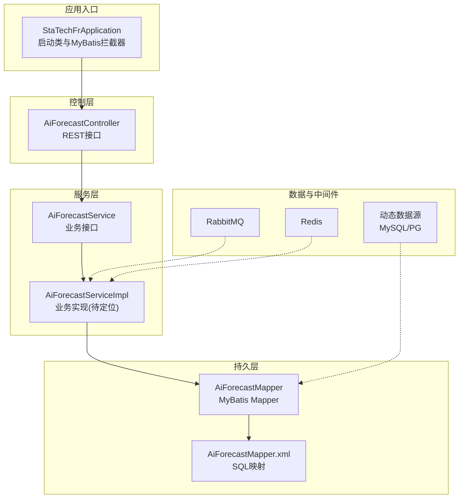
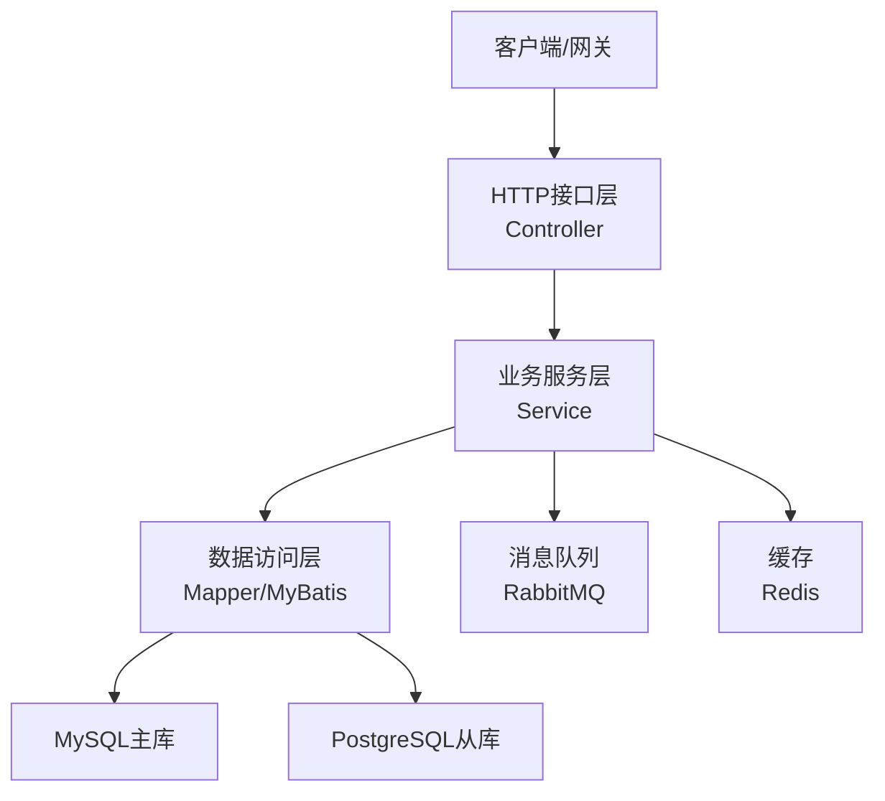
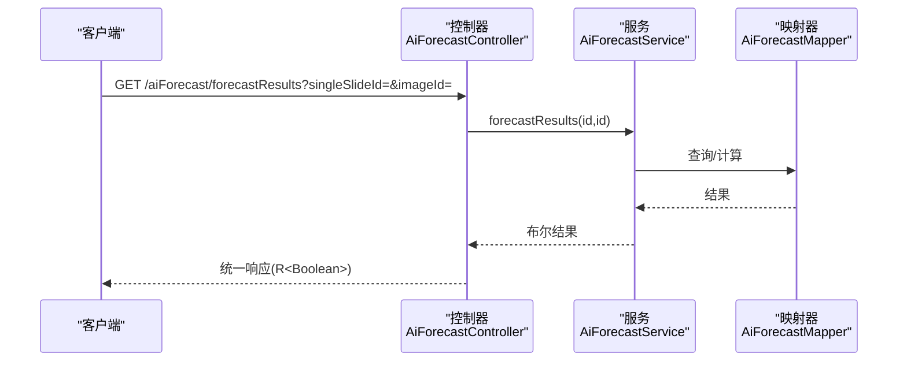
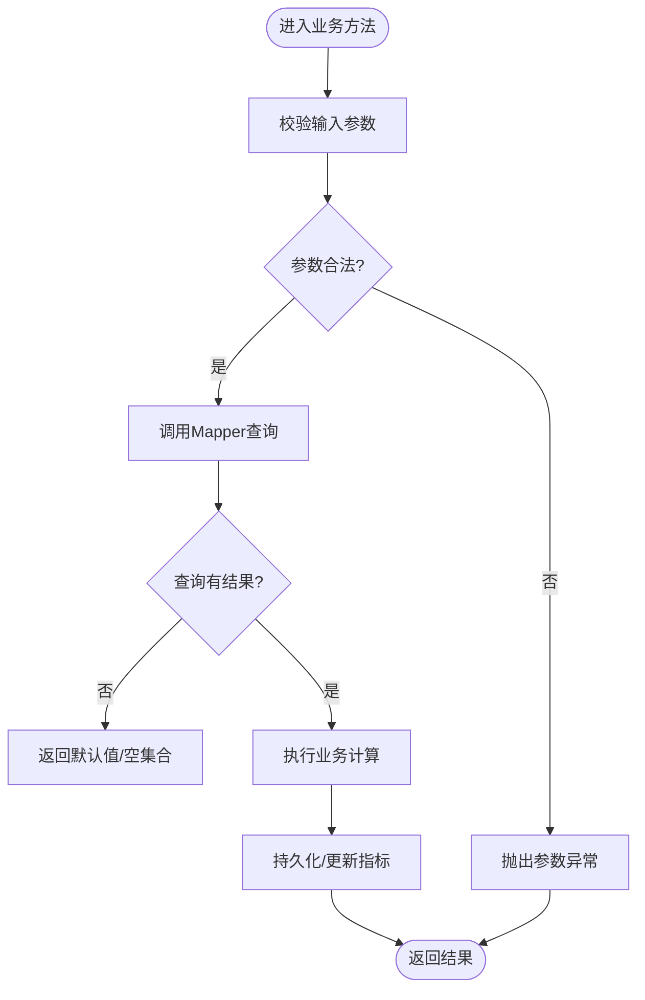
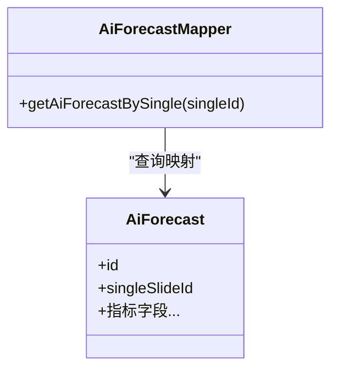
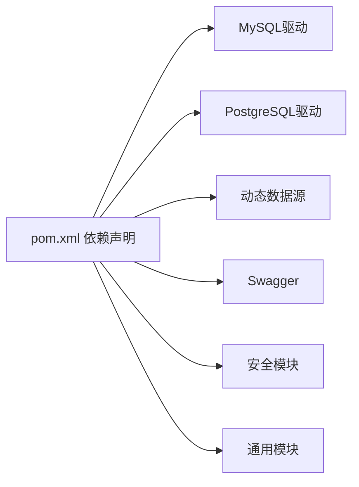

# 测试策略与实践

<cite>
**本文引用的文件**
- [StaTechFrApplication.java](file://src/main/java/cn/staitech/fr/StaTechFrApplication.java)
- [AiForecastController.java](file://src/main/java/cn/staitech/fr/controller/AiForecastController.java)
- [AiForecastService.java](file://src/main/java/cn/staitech/fr/service/AiForecastService.java)
- [AiForecastMapper.java](file://src/main/java/cn/staitech/fr/mapper/AiForecastMapper.java)
- [application-local.yml](file://src/main/resources/application-local.yml)
- [pom.xml](file://pom.xml)
</cite>

## 目录
1. [引言](#引言)
2. [项目结构](#项目结构)
3. [核心组件](#核心组件)
4. [架构总览](#架构总览)
5. [详细组件分析](#详细组件分析)
6. [依赖分析](#依赖分析)
7. [性能考虑](#性能考虑)
8. [故障排查指南](#故障排查指南)
9. [结论](#结论)
10. [附录](#附录)

## 引言
本指南面向FR模块的测试策略与实践，覆盖单元测试、集成测试与端到端测试的实施方法，重点说明Controller、Service与Mapper三层的测试要点与最佳实践。内容涵盖：
- 测试分层与职责边界
- Mockito使用建议与Mock策略
- 测试数据准备与数据库隔离
- 测试覆盖率目标与持续集成流程
- 性能测试方法与API/UI回归测试建议
- 典型调用链路的序列图与流程图

## 项目结构
FR模块采用标准Spring Boot工程结构，核心分层如下：
- controller：对外HTTP接口入口，负责参数校验、请求转发与响应封装
- service：业务逻辑层，协调领域模型与持久化
- mapper：MyBatis映射层，执行SQL与结果映射
- resources：配置文件、XML映射文件等

图表来源
- [StaTechFrApplication.java:37-60](file://src/main/java/cn/staitech/fr/StaTechFrApplication.java#L37-L60)
- [AiForecastController.java:17-31](file://src/main/java/cn/staitech/fr/controller/AiForecastController.java#L17-L31)
- [AiForecastService.java:11-29](file://src/main/java/cn/staitech/fr/service/AiForecastService.java#L11-L29)
- [AiForecastMapper.java:7-17](file://src/main/java/cn/staitech/fr/mapper/AiForecastMapper.java#L7-L17)
- [application-local.yml:15-56](file://src/main/resources/application-local.yml#L15-L56)
- [application-local.yml:57-72](file://src/main/resources/application-local.yml#L57-L72)
- [application-local.yml:106-106](file://src/main/resources/application-local.yml#L106-L106)

章节来源
- [StaTechFrApplication.java:37-60](file://src/main/java/cn/staitech/fr/StaTechFrApplication.java#L37-L60)
- [application-local.yml:15-56](file://src/main/resources/application-local.yml#L15-L56)
- [application-local.yml:57-72](file://src/main/resources/application-local.yml#L57-L72)

## 核心组件
- 启动类与分页拦截器：通过启动类启用扫描、事务与异步，注册MyBatis分页插件，确保Service层查询具备分页能力
- 控制器：以AiForecastController为例，接收HTTP请求，调用Service并返回统一响应包装
- 服务接口：定义业务契约，如预测结果计算、指标新增等
- 映射器：定义基础CRUD与自定义查询方法，配合XML完成SQL映射

章节来源
- [StaTechFrApplication.java:37-60](file://src/main/java/cn/staitech/fr/StaTechFrApplication.java#L37-L60)
- [AiForecastController.java:17-31](file://src/main/java/cn/staitech/fr/controller/AiForecastController.java#L17-L31)
- [AiForecastService.java:11-29](file://src/main/java/cn/staitech/fr/service/AiForecastService.java#L11-L29)
- [AiForecastMapper.java:7-17](file://src/main/java/cn/staitech/fr/mapper/AiForecastMapper.java#L7-L17)

## 架构总览
FR模块遵循经典的三层架构，结合动态数据源与消息队列，形成“接口-业务-存储”的清晰边界。

图表来源
- [AiForecastController.java:23-30](file://src/main/java/cn/staitech/fr/controller/AiForecastController.java#L23-L30)
- [application-local.yml:15-56](file://src/main/resources/application-local.yml#L15-L56)
- [application-local.yml:57-72](file://src/main/resources/application-local.yml#L57-L72)
- [application-local.yml:106-106](file://src/main/resources/application-local.yml#L106-L106)

## 详细组件分析

### 控制器层测试策略（以AiForecastController为例）
- 单元测试
  - 使用MockMvc或WebTestClient发起HTTP请求，验证状态码、响应体结构与日志输出
  - Mock Service层返回值，覆盖正常与异常分支
  - 参数校验：缺失参数、非法类型、越界值
- 集成测试
  - 启动完整上下文，连接本地数据库与消息队列，验证端到端链路
  - 关注统一响应包装与异常转换
- 端到端测试
  - 通过API网关或直接调用，模拟真实用户场景，关注超时、重试与幂等性

图表来源
- [AiForecastController.java:23-30](file://src/main/java/cn/staitech/fr/controller/AiForecastController.java#L23-L30)
- [AiForecastService.java:18-18](file://src/main/java/cn/staitech/fr/service/AiForecastService.java#L18-L18)
- [AiForecastMapper.java:15-15](file://src/main/java/cn/staitech/fr/mapper/AiForecastMapper.java#L15-L15)

章节来源
- [AiForecastController.java:17-31](file://src/main/java/cn/staitech/fr/controller/AiForecastController.java#L17-L31)

### 服务层测试策略（以AiForecastService为例）
- 单元测试
  - 使用Mockito对Mapper与外部依赖进行Mock，验证业务逻辑分支与边界条件
  - 关注事务传播、异常回滚与重试策略
- 集成测试
  - 在事务内执行，使用内存数据库或Flyway迁移测试Schema，保证数据隔离
  - 验证分页、排序与复杂查询的正确性
- 回归测试
  - 对历史用例集进行回归，确保变更不破坏既有行为

图表来源
- [AiForecastService.java:18-28](file://src/main/java/cn/staitech/fr/service/AiForecastService.java#L18-L28)
- [AiForecastMapper.java:15-15](file://src/main/java/cn/staitech/fr/mapper/AiForecastMapper.java#L15-L15)

章节来源
- [AiForecastService.java:11-29](file://src/main/java/cn/staitech/fr/service/AiForecastService.java#L11-L29)

### 映射层测试策略（以AiForecastMapper为例）
- 单元测试
  - 使用嵌入式数据库（如H2/SQLite）或Flyway初始化Schema，执行SQL断言
  - Mock会话与连接，避免真实数据库依赖
- 集成测试
  - 在事务中执行，使用真实驱动连接本地数据库，验证SQL与MyBatis映射
  - 关注方言差异（MySQL vs PostgreSQL）与索引使用
- 数据隔离
  - 使用测试专用库或随机schema/表前缀，避免并发测试污染

图表来源
- [AiForecastMapper.java:13-17](file://src/main/java/cn/staitech/fr/mapper/AiForecastMapper.java#L13-L17)
- [AiForecastService.java:18-28](file://src/main/java/cn/staitech/fr/service/AiForecastService.java#L18-L28)

章节来源
- [AiForecastMapper.java:7-17](file://src/main/java/cn/staitech/fr/mapper/AiForecastMapper.java#L7-L17)

## 依赖分析
- 启动类启用MyBatis分页插件，确保Service层查询具备分页能力
- 应用配置支持动态数据源（MySQL主库、PostgreSQL从库）、RabbitMQ与Redis
- Maven依赖包含MySQL/PG驱动、动态数据源、Swagger、安全与通用模块

图表来源
- [pom.xml:49-62](file://pom.xml#L49-L62)
- [pom.xml:96-99](file://pom.xml#L96-L99)
- [pom.xml:78-86](file://pom.xml#L78-L86)

章节来源
- [pom.xml:49-62](file://pom.xml#L49-L62)
- [pom.xml:96-99](file://pom.xml#L96-L99)
- [pom.xml:78-86](file://pom.xml#L78-L86)

## 性能考虑
- 接口性能
  - 使用压测工具（如JMeter/Gatling）对热点接口进行并发与吞吐测试
  - 关注分页查询的LIMIT/OFFSET成本与索引命中率
- 服务性能
  - 对耗时业务（如AI指标计算）进行拆分与异步化，结合消息队列削峰
  - 缓存热点数据，降低数据库压力
- 存储性能
  - 针对MySQL与PG分别进行基准测试，评估读写比例与连接池参数
  - 使用只读副本承接报表类查询

## 故障排查指南
- 控制层
  - 统一响应包装导致异常信息被隐藏，需开启调试日志或在测试中断言具体错误码
- 服务层
  - 事务异常回滚与重试策略需在测试中显式触发，确保异常路径可覆盖
- 持久层
  - SQL执行计划与慢查询监控，结合测试用例复现边界条件
- 配置问题
  - 动态数据源切换、连接池参数与超时设置需在测试环境中与生产一致

章节来源
- [AiForecastController.java:23-30](file://src/main/java/cn/staitech/fr/controller/AiForecastController.java#L23-L30)
- [application-local.yml:15-56](file://src/main/resources/application-local.yml#L15-L56)
- [application-local.yml:57-72](file://src/main/resources/application-local.yml#L57-L72)

## 结论
通过明确三层职责、规范Mock策略与数据隔离、建立分层测试体系与性能基线，FR模块可在快速迭代中保持高质量与稳定性。建议优先补齐Service与Mapper的单元测试，再扩展到端到端与性能测试，持续集成中引入覆盖率阈值与静态检查，保障交付质量。

## 附录

### 测试分层与覆盖率目标
- 单元测试：Service与Mapper不低于80%，Controller不低于60%
- 集成测试：关键流程100%，涉及数据库与消息队列
- 端到端测试：核心业务场景100%，回归用例随版本维护
- 性能测试：热点接口TP99延迟与并发吞吐满足SLA

### 持续集成测试流程建议
- 代码提交触发：编译、单元测试、覆盖率统计
- MR合并前：全量集成测试、API测试、安全扫描
- 预发布：端到端测试、性能回归、数据库迁移验证
- 生产发布：灰度验证、告警与回滚预案

### API测试与UI测试
- API测试：基于OpenAPI/Swagger，使用RestAssured/Postman进行接口自动化
- UI测试：基于Selenium/Cypress，覆盖关键用户路径与回归场景

### 回归测试清单（示例）
- 新增/修改接口的正反向用例
- 分页、排序、过滤参数边界
- 并发与异常场景（超时、限流、重试）
- 数据库迁移与兼容性验证