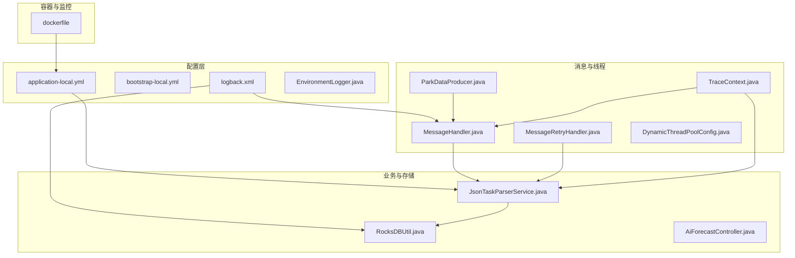
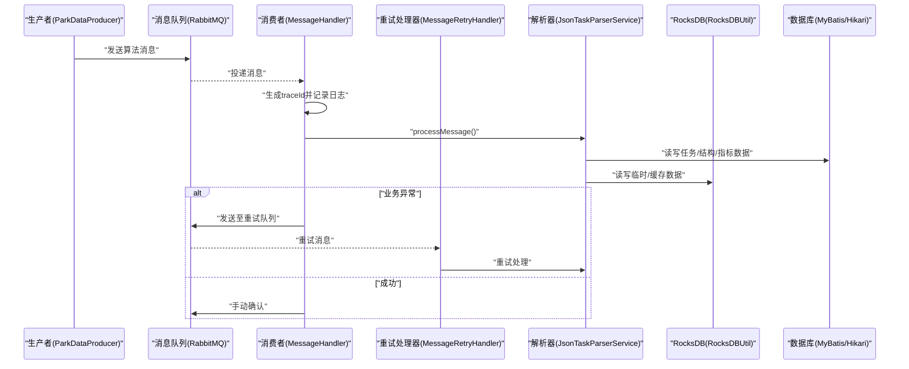
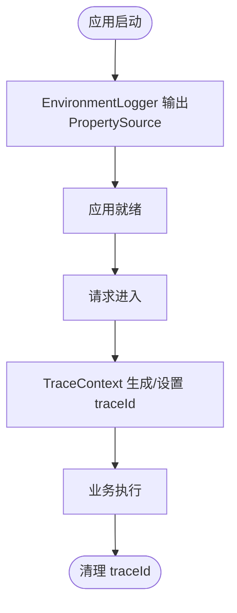
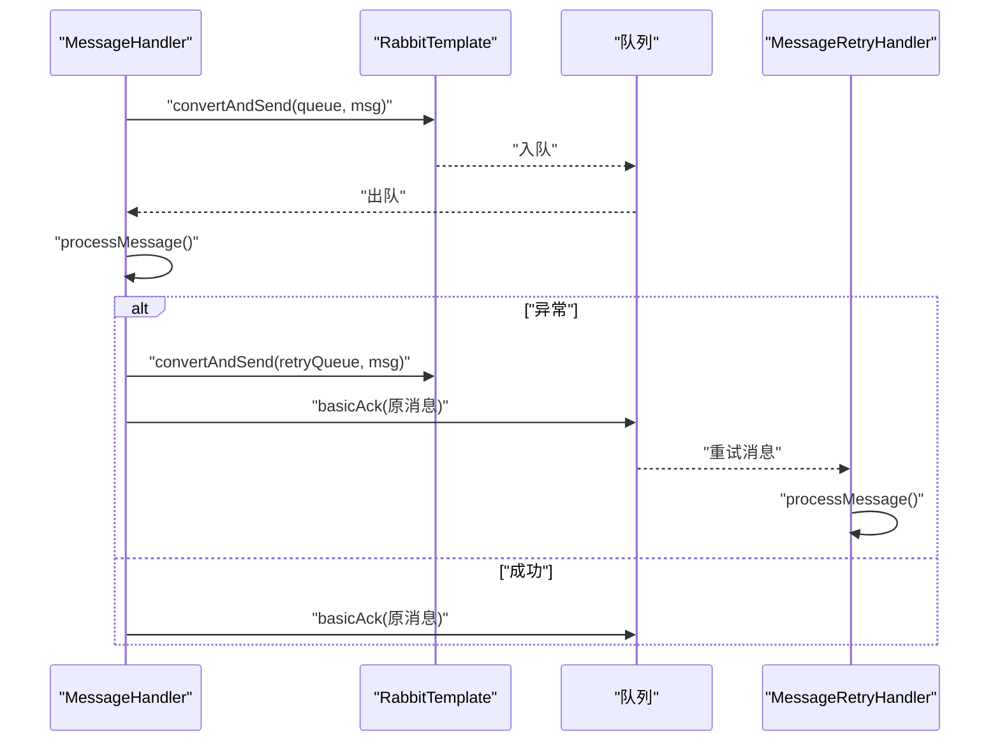
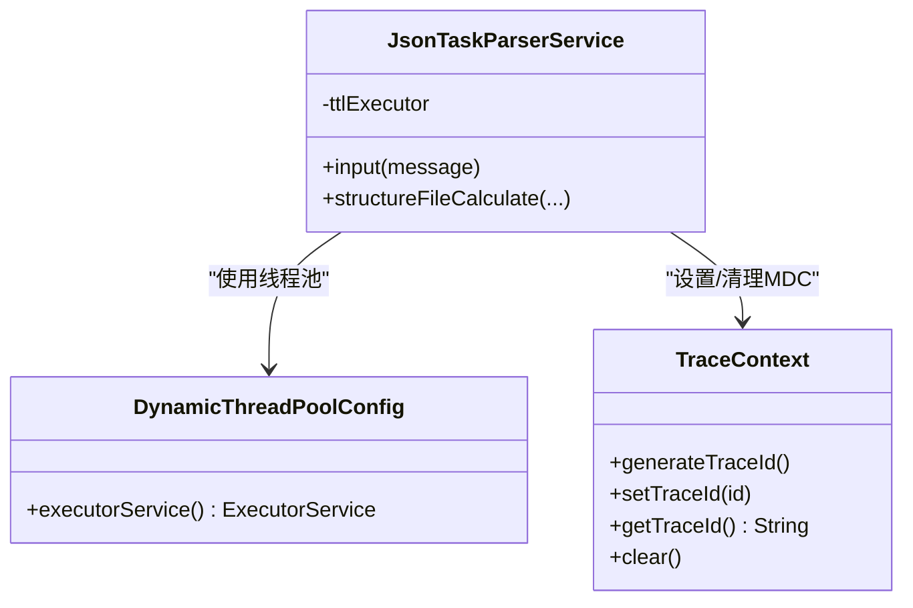
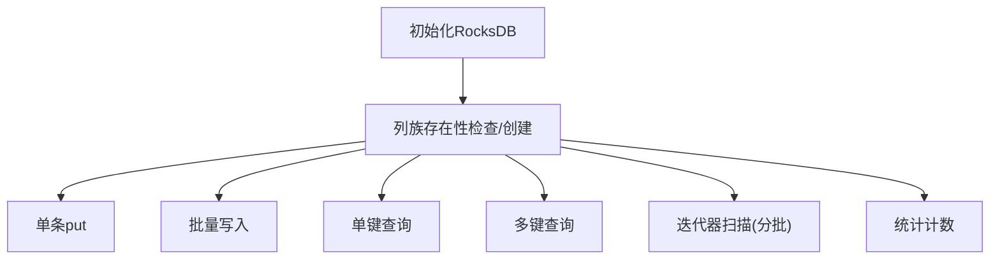
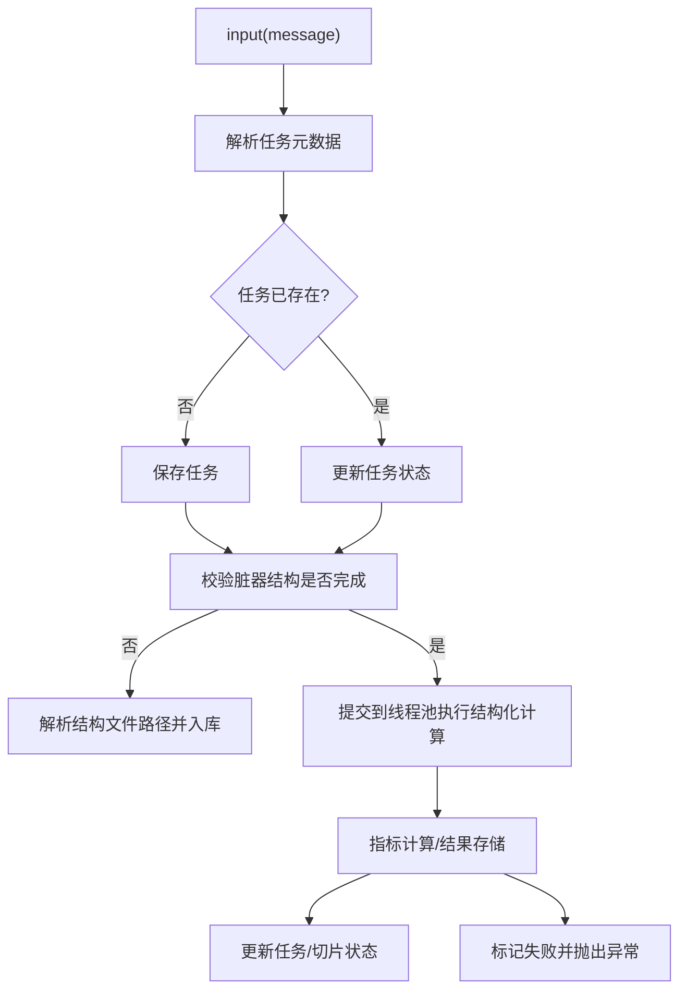
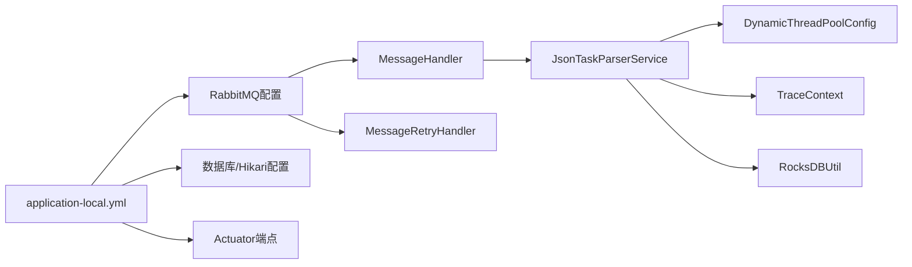

# 调试技巧与故障排查

<cite>
**本文引用的文件**
- [application-local.yml](file://src/main/resources/application-local.yml)
- [bootstrap-local.yml](file://src/main/resources/bootstrap-local.yml)
- [logback.xml](file://src/main/resources/logback.xml)
- [EnvironmentLogger.java](file://src/main/java/cn/staitech/fr/config/EnvironmentLogger.java)
- [TraceContext.java](file://src/main/java/cn/staitech/fr/config/TraceContext.java)
- [DynamicThreadPoolConfig.java](file://src/main/java/cn/staitech/fr/config/DynamicThreadPoolConfig.java)
- [ParkDataProducer.java](file://src/main/java/cn/staitech/fr/config/ParkDataProducer.java)
- [MessageHandler.java](file://src/main/java/cn/staitech/fr/config/MessageHandler.java)
- [MessageRetryHandler.java](file://src/main/java/cn/staitech/fr/config/MessageRetryHandler.java)
- [RocksDBUtil.java](file://src/main/java/cn/staitech/fr/utils/RocksDBUtil.java)
- [JsonTaskParserService.java](file://src/main/java/cn/staitech/fr/service/strategy/json/JsonTaskParserService.java)
- [AiForecastController.java](file://src/main/java/cn/staitech/fr/controller/AiForecastController.java)
- [dockerfile](file://docker/staitech/modules/fr/dockerfile)
</cite>

## 目录
1. [简介](#简介)
2. [项目结构](#项目结构)
3. [核心组件](#核心组件)
4. [架构总览](#架构总览)
5. [详细组件分析](#详细组件分析)
6. [依赖分析](#依赖分析)
7. [性能考量](#性能考量)
8. [故障排查指南](#故障排查指南)
9. [结论](#结论)
10. [附录](#附录)

## 简介
本指南聚焦于FR模块的调试与故障排查，覆盖日志分析、性能监控、问题定位、IDE/远程调试、Actuator监控、RocksDB性能分析以及数据库查询优化等主题。文档结合实际代码实现，提供可操作的排障步骤与可视化图示，帮助快速定位并解决数据库连接、消息队列异常、性能瓶颈、内存泄漏、线程死锁与网络连接问题。

## 项目结构
FR模块采用Spring Boot工程结构，核心关注点包括：
- 配置层：本地配置、日志配置、线程池与MQ配置
- 业务层：JSON任务解析与结构化处理
- 存储层：RocksDB工具类、MyBatis Mapper与实体
- 监控与运维：Actuator端点、JMX Agent、Arthas

图表来源
- [application-local.yml:1-311](file://src/main/resources/application-local.yml#L1-L311)
- [logback.xml:1-102](file://src/main/resources/logback.xml#L1-L102)
- [MessageHandler.java:1-128](file://src/main/java/cn/staitech/fr/config/MessageHandler.java#L1-L128)
- [DynamicThreadPoolConfig.java:1-53](file://src/main/java/cn/staitech/fr/config/DynamicThreadPoolConfig.java#L1-L53)
- [TraceContext.java:1-82](file://src/main/java/cn/staitech/fr/config/TraceContext.java#L1-L82)
- [JsonTaskParserService.java:1-760](file://src/main/java/cn/staitech/fr/service/strategy/json/JsonTaskParserService.java#L1-L760)
- [RocksDBUtil.java:1-321](file://src/main/java/cn/staitech/fr/utils/RocksDBUtil.java#L1-L321)
- [AiForecastController.java:1-31](file://src/main/java/cn/staitech/fr/controller/AiForecastController.java#L1-L31)
- [dockerfile:1-22](file://docker/staitech/modules/fr/dockerfile#L1-L22)

章节来源
- [application-local.yml:1-311](file://src/main/resources/application-local.yml#L1-L311)
- [logback.xml:1-102](file://src/main/resources/logback.xml#L1-L102)

## 核心组件
- 日志与环境追踪
  - 日志配置：控制台与按模块分文件输出，支持traceId注入
  - 环境打印：应用启动后输出PropertySource列表，便于核对配置来源
  - TraceContext：通过TransmittableThreadLocal与MDC传递traceId，贯穿线程池与异步任务
- 消息与重试
  - 生产者：向算法消息队列发送消息，支持延迟消息
  - 消费者：手动确认消息，异常时入重试队列并可NACK重入队
  - 重试处理器：独立消费重试队列消息
- 线程池与监控
  - 动态线程池：自定义线程命名、队列监控日志、超时策略
  - TTL包装：确保跨线程传递traceId
- 存储与性能
  - RocksDB工具：列族管理、批量写入、迭代器分批读取、统计计数
- 业务处理
  - JSON任务解析：任务幂等、状态机推进、结构化计算与指标计算
  - 控制器：对外暴露预测结果查询接口

章节来源
- [logback.xml:1-102](file://src/main/resources/logback.xml#L1-L102)
- [EnvironmentLogger.java:1-26](file://src/main/java/cn/staitech/fr/config/EnvironmentLogger.java#L1-L26)
- [TraceContext.java:1-82](file://src/main/java/cn/staitech/fr/config/TraceContext.java#L1-L82)
- [ParkDataProducer.java:1-48](file://src/main/java/cn/staitech/fr/config/ParkDataProducer.java#L1-L48)
- [MessageHandler.java:1-128](file://src/main/java/cn/staitech/fr/config/MessageHandler.java#L1-L128)
- [MessageRetryHandler.java:1-44](file://src/main/java/cn/staitech/fr/config/MessageRetryHandler.java#L1-L44)
- [DynamicThreadPoolConfig.java:1-53](file://src/main/java/cn/staitech/fr/config/DynamicThreadPoolConfig.java#L1-L53)
- [RocksDBUtil.java:1-321](file://src/main/java/cn/staitech/fr/utils/RocksDBUtil.java#L1-L321)
- [JsonTaskParserService.java:1-760](file://src/main/java/cn/staitech/fr/service/strategy/json/JsonTaskParserService.java#L1-L760)
- [AiForecastController.java:1-31](file://src/main/java/cn/staitech/fr/controller/AiForecastController.java#L1-L31)

## 架构总览
FR模块的关键交互链路如下：

图表来源
- [ParkDataProducer.java:27-44](file://src/main/java/cn/staitech/fr/config/ParkDataProducer.java#L27-L44)
- [MessageHandler.java:44-75](file://src/main/java/cn/staitech/fr/config/MessageHandler.java#L44-L75)
- [MessageRetryHandler.java:25-42](file://src/main/java/cn/staitech/fr/config/MessageRetryHandler.java#L25-L42)
- [JsonTaskParserService.java:174-263](file://src/main/java/cn/staitech/fr/service/strategy/json/JsonTaskParserService.java#L174-L263)
- [RocksDBUtil.java:158-195](file://src/main/java/cn/staitech/fr/utils/RocksDBUtil.java#L158-L195)

## 详细组件分析

### 日志与环境追踪
- 日志配置要点
  - 控制台输出与按模块分文件输出，便于区分业务日志与系统日志
  - 支持traceId/MDC字段输出，统一日志格式
- 环境打印
  - 应用启动事件触发，输出PropertySource列表，辅助定位配置来源与覆盖关系
- TraceContext
  - 在线程执行前后自动设置/清理MDC中的traceId，配合TTL保证跨线程传递

图表来源
- [EnvironmentLogger.java:17-24](file://src/main/java/cn/staitech/fr/config/EnvironmentLogger.java#L17-L24)
- [TraceContext.java:47-80](file://src/main/java/cn/staitech/fr/config/TraceContext.java#L47-L80)
- [logback.xml:6-13](file://src/main/resources/logback.xml#L6-L13)

章节来源
- [logback.xml:1-102](file://src/main/resources/logback.xml#L1-L102)
- [EnvironmentLogger.java:1-26](file://src/main/java/cn/staitech/fr/config/EnvironmentLogger.java#L1-L26)
- [TraceContext.java:1-82](file://src/main/java/cn/staitech/fr/config/TraceContext.java#L1-L82)

### 消息与重试机制
- 生产者
  - 向算法消息队列发送消息，支持延迟消息头设置
- 消费者
  - 手动确认消息，异常时发送至重试队列并确认原消息
  - 支持延迟检查队列的消息处理
- 重试处理器
  - 独立处理重试队列消息，避免阻塞主流程

图表来源
- [MessageHandler.java:44-75](file://src/main/java/cn/staitech/fr/config/MessageHandler.java#L44-L75)
- [MessageRetryHandler.java:25-42](file://src/main/java/cn/staitech/fr/config/MessageRetryHandler.java#L25-L42)
- [ParkDataProducer.java:27-44](file://src/main/java/cn/staitech/fr/config/ParkDataProducer.java#L27-L44)

章节来源
- [MessageHandler.java:1-128](file://src/main/java/cn/staitech/fr/config/MessageHandler.java#L1-L128)
- [MessageRetryHandler.java:1-44](file://src/main/java/cn/staitech/fr/config/MessageRetryHandler.java#L1-L44)
- [ParkDataProducer.java:1-48](file://src/main/java/cn/staitech/fr/config/ParkDataProducer.java#L1-L48)

### 线程池与跨线程上下文
- 自定义线程池
  - 线程命名、队列监控日志、超时策略、拒绝策略
  - 与TTL包装结合，确保traceId在异步任务中传递
- 业务执行
  - 解析器在任务线程池中执行结构化计算与指标计算

图表来源
- [DynamicThreadPoolConfig.java:14-51](file://src/main/java/cn/staitech/fr/config/DynamicThreadPoolConfig.java#L14-L51)
- [JsonTaskParserService.java:94-107](file://src/main/java/cn/staitech/fr/service/strategy/json/JsonTaskParserService.java#L94-L107)
- [TraceContext.java:47-80](file://src/main/java/cn/staitech/fr/config/TraceContext.java#L47-L80)

章节来源
- [DynamicThreadPoolConfig.java:1-53](file://src/main/java/cn/staitech/fr/config/DynamicThreadPoolConfig.java#L1-L53)
- [JsonTaskParserService.java:1-760](file://src/main/java/cn/staitech/fr/service/strategy/json/JsonTaskParserService.java#L1-L760)
- [TraceContext.java:1-82](file://src/main/java/cn/staitech/fr/config/TraceContext.java#L1-L82)

### RocksDB工具与性能
- 列族管理：按需创建/删除列族，维护列族句柄映射
- 批量写入：WriteBatch提升写入吞吐
- 迭代器分批：避免一次性读取过多键导致内存压力
- 统计计数：提供全量扫描计数能力

图表来源
- [RocksDBUtil.java:35-82](file://src/main/java/cn/staitech/fr/utils/RocksDBUtil.java#L35-L82)
- [RocksDBUtil.java:158-195](file://src/main/java/cn/staitech/fr/utils/RocksDBUtil.java#L158-L195)
- [RocksDBUtil.java:243-275](file://src/main/java/cn/staitech/fr/utils/RocksDBUtil.java#L243-L275)
- [RocksDBUtil.java:294-303](file://src/main/java/cn/staitech/fr/utils/RocksDBUtil.java#L294-L303)

章节来源
- [RocksDBUtil.java:1-321](file://src/main/java/cn/staitech/fr/utils/RocksDBUtil.java#L1-L321)

### 业务处理流程（JSON任务）
- 输入校验与幂等：根据singleId与状态推进任务
- 结构校验与文件解析：按算法策略解析JSON并落库
- 指标计算与结果存储：更新任务状态与单切片状态
- 异常处理：失败时标记状态并抛出业务异常

图表来源
- [JsonTaskParserService.java:174-263](file://src/main/java/cn/staitech/fr/service/strategy/json/JsonTaskParserService.java#L174-L263)
- [JsonTaskParserService.java:265-452](file://src/main/java/cn/staitech/fr/service/strategy/json/JsonTaskParserService.java#L265-L452)

章节来源
- [JsonTaskParserService.java:1-760](file://src/main/java/cn/staitech/fr/service/strategy/json/JsonTaskParserService.java#L1-L760)

## 依赖分析
- 配置依赖
  - application-local.yml提供数据库、Redis、RabbitMQ、MyBatis、日志与Actuator端点等配置
  - bootstrap-local.yml关闭Nacos配置中心，便于本地开发
- 组件耦合
  - MessageHandler与MessageRetryHandler分别监听不同队列，职责清晰
  - JsonTaskParserService依赖线程池与TraceContext，确保可观测性与可扩展性
  - RocksDBUtil作为独立工具类，被业务流程间接使用

图表来源
- [application-local.yml:5-102](file://src/main/resources/application-local.yml#L5-L102)
- [bootstrap-local.yml:1-9](file://src/main/resources/bootstrap-local.yml#L1-L9)
- [MessageHandler.java:43-44](file://src/main/java/cn/staitech/fr/config/MessageHandler.java#L43-L44)
- [MessageRetryHandler.java:1-44](file://src/main/java/cn/staitech/fr/config/MessageRetryHandler.java#L1-L44)
- [JsonTaskParserService.java:94-107](file://src/main/java/cn/staitech/fr/service/strategy/json/JsonTaskParserService.java#L94-L107)
- [DynamicThreadPoolConfig.java:14-51](file://src/main/java/cn/staitech/fr/config/DynamicThreadPoolConfig.java#L14-L51)
- [TraceContext.java:47-80](file://src/main/java/cn/staitech/fr/config/TraceContext.java#L47-L80)
- [RocksDBUtil.java:35-82](file://src/main/java/cn/staitech/fr/utils/RocksDBUtil.java#L35-L82)

章节来源
- [application-local.yml:1-311](file://src/main/resources/application-local.yml#L1-L311)
- [bootstrap-local.yml:1-9](file://src/main/resources/bootstrap-local.yml#L1-L9)
- [JsonTaskParserService.java:1-760](file://src/main/java/cn/staitech/fr/service/strategy/json/JsonTaskParserService.java#L1-L760)

## 性能考量
- 线程池参数
  - 核心/最大线程数、队列长度与超时策略影响吞吐与响应
  - 建议结合CPU核心数与任务特征调整
- RocksDB
  - 批量写入与分批扫描降低内存峰值
  - 列族粒度控制与合适的迭代批次大小
- 数据库
  - Hikari连接池参数（最大池大小、最小空闲、连接超时）直接影响并发与抖动
  - MyBatis日志开启仅在调试阶段使用，避免生产环境性能损耗
- 监控
  - Actuator端点按需暴露，避免泄露敏感信息
  - Dockerfile集成JMX Agent与Arthas，便于远程诊断

章节来源
- [DynamicThreadPoolConfig.java:14-51](file://src/main/java/cn/staitech/fr/config/DynamicThreadPoolConfig.java#L14-L51)
- [RocksDBUtil.java:166-174](file://src/main/java/cn/staitech/fr/utils/RocksDBUtil.java#L166-L174)
- [RocksDBUtil.java:257-275](file://src/main/java/cn/staitech/fr/utils/RocksDBUtil.java#L257-L275)
- [application-local.yml:25-54](file://src/main/resources/application-local.yml#L25-L54)
- [application-local.yml:81-83](file://src/main/resources/application-local.yml#L81-L83)
- [application-local.yml:98-102](file://src/main/resources/application-local.yml#L98-L102)
- [dockerfile:17-22](file://docker/staitech/modules/fr/dockerfile#L17-L22)

## 故障排查指南

### 一、日志分析方法
- 关键日志位置
  - 控制台与按模块分文件输出，便于快速定位模块级问题
  - traceId/MDC字段可用于跨线程/跨进程关联
- 常见问题定位
  - 配置来源：启动日志输出PropertySource，核对配置覆盖顺序
  - MQ消费：查看消费者与重试处理器的日志，确认消息确认与重试路径
  - 业务执行：解析器日志包含任务状态推进与耗时统计

章节来源
- [logback.xml:1-102](file://src/main/resources/logback.xml#L1-L102)
- [EnvironmentLogger.java:17-24](file://src/main/java/cn/staitech/fr/config/EnvironmentLogger.java#L17-L24)
- [MessageHandler.java:44-75](file://src/main/java/cn/staitech/fr/config/MessageHandler.java#L44-L75)
- [MessageRetryHandler.java:25-42](file://src/main/java/cn/staitech/fr/config/MessageRetryHandler.java#L25-L42)
- [JsonTaskParserService.java:276-282](file://src/main/java/cn/staitech/fr/service/strategy/json/JsonTaskParserService.java#L276-L282)

### 二、性能监控与Actuator
- Actuator端点
  - 仅暴露必要端点（env, health, info），避免信息泄露
- 远程监控
  - Dockerfile集成JMX Agent，结合Prometheus抓取JMX指标
  - Arthas用于线上诊断，无需停机即可采集线程、GC、堆栈等信息

章节来源
- [application-local.yml:98-102](file://src/main/resources/application-local.yml#L98-L102)
- [dockerfile:17-22](file://docker/staitech/modules/fr/dockerfile#L17-L22)

### 三、IDE调试与远程调试
- IDE断点
  - 在MessageHandler与JsonTaskParserService的关键节点设置断点
  - 结合TraceContext生成的traceId快速定位请求链路
- 远程调试
  - 通过JMX Agent与Arthas进行远程诊断
  - 使用日志过滤与条件断点减少干扰

章节来源
- [TraceContext.java:47-80](file://src/main/java/cn/staitech/fr/config/TraceContext.java#L47-L80)
- [MessageHandler.java:44-75](file://src/main/java/cn/staitech/fr/config/MessageHandler.java#L44-L75)
- [JsonTaskParserService.java:94-107](file://src/main/java/cn/staitech/fr/service/strategy/json/JsonTaskParserService.java#L94-L107)
- [dockerfile:17-22](file://docker/staitech/modules/fr/dockerfile#L17-L22)

### 四、数据库连接问题
- 排查步骤
  - 检查Hikari连接池参数与健康状态
  - 核对主从库配置与驱动版本
  - 关注MyBatis日志，定位慢SQL与异常
- 优化建议
  - 合理设置最大池大小与连接超时
  - 使用只读事务与批量操作减少连接争用

章节来源
- [application-local.yml:15-56](file://src/main/resources/application-local.yml#L15-L56)
- [application-local.yml:76-83](file://src/main/resources/application-local.yml#L76-L83)

### 五、消息队列异常
- 常见问题
  - 消费失败未确认导致重复消费
  - 重试队列堆积引发延迟
- 诊断方法
  - 查看消费者与重试处理器日志
  - 核对队列绑定与路由键
  - 检查RabbitMQ管理界面与延迟交换配置

章节来源
- [MessageHandler.java:44-75](file://src/main/java/cn/staitech/fr/config/MessageHandler.java#L44-L75)
- [MessageRetryHandler.java:25-42](file://src/main/java/cn/staitech/fr/config/MessageRetryHandler.java#L25-L42)
- [ParkDataProducer.java:38-44](file://src/main/java/cn/staitech/fr/config/ParkDataProducer.java#L38-L44)

### 六、性能瓶颈识别
- 线程池瓶颈
  - 观察队列长度与活跃线程数，必要时扩容或优化任务
- RocksDB瓶颈
  - 分批扫描与批量写入，避免一次性加载过多键
- 数据库瓶颈
  - 慢查询日志与索引优化，避免全表扫描

章节来源
- [DynamicThreadPoolConfig.java:29-45](file://src/main/java/cn/staitech/fr/config/DynamicThreadPoolConfig.java#L29-L45)
- [RocksDBUtil.java:257-275](file://src/main/java/cn/staitech/fr/utils/RocksDBUtil.java#L257-L275)
- [application-local.yml:76-83](file://src/main/resources/application-local.yml#L76-L83)

### 七、内存泄漏检测
- 方法
  - 使用Arthas观察堆内存变化与GC频率
  - 关注线程池与RocksDB句柄是否正确释放
- 建议
  - 确保finally块清理MDC与资源
  - 定期检查列族句柄映射与迭代器使用

章节来源
- [TraceContext.java:77-80](file://src/main/java/cn/staitech/fr/config/TraceContext.java#L77-L80)
- [RocksDBUtil.java:308-319](file://src/main/java/cn/staitech/fr/utils/RocksDBUtil.java#L308-L319)
- [JsonTaskParserService.java:741-758](file://src/main/java/cn/staitech/fr/service/strategy/json/JsonTaskParserService.java#L741-L758)

### 八、线程死锁排查
- 方法
  - 使用Arthas导出线程转储，分析锁等待链
  - 检查线程池拒绝策略与队列饱和行为
- 建议
  - 避免在业务线程中执行长时间阻塞操作
  - 使用TTL包装跨线程任务，减少上下文丢失

章节来源
- [DynamicThreadPoolConfig.java:27-45](file://src/main/java/cn/staitech/fr/config/DynamicThreadPoolConfig.java#L27-L45)
- [TraceContext.java:28-42](file://src/main/java/cn/staitech/fr/config/TraceContext.java#L28-L42)

### 九、网络连接问题处理
- 方法
  - 检查RabbitMQ/数据库/Redis连通性
  - 核对超时与重试配置
- 建议
  - 使用健康检查端点与连接池监控
  - 在容器环境中确保端口映射与网络策略正确

章节来源
- [application-local.yml:57-68](file://src/main/resources/application-local.yml#L57-L68)
- [application-local.yml:15-56](file://src/main/resources/application-local.yml#L15-L56)
- [application-local.yml:11-15](file://src/main/resources/application-local.yml#L11-L15)

### 十、RocksDB性能分析
- 建议
  - 使用批量写入与分批扫描
  - 监控列族数量与键空间分布
  - 定期清理与重建列族以保持性能

章节来源
- [RocksDBUtil.java:166-174](file://src/main/java/cn/staitech/fr/utils/RocksDBUtil.java#L166-L174)
- [RocksDBUtil.java:257-275](file://src/main/java/cn/staitech/fr/utils/RocksDBUtil.java#L257-L275)
- [RocksDBUtil.java:308-319](file://src/main/java/cn/staitech/fr/utils/RocksDBUtil.java#L308-L319)

### 十一、数据库查询优化
- 建议
  - 开启MyBatis日志定位慢SQL
  - 为高频查询建立合适索引
  - 使用只读事务与批量操作

章节来源
- [application-local.yml:76-83](file://src/main/resources/application-local.yml#L76-L83)

## 结论
通过日志与环境追踪、消息队列与重试机制、线程池与跨线程上下文、RocksDB工具与数据库配置的协同，FR模块具备良好的可观测性与可维护性。结合Actuator、JMX与Arthas，可在生产环境实现低侵入的远程诊断。针对数据库连接、消息队列异常、性能瓶颈、内存泄漏与线程死锁等问题，建议遵循“日志先行、端点辅助、工具定位”的原则，逐步收敛问题范围并实施优化。

## 附录
- 对外接口示例
  - 预测结果查询接口：GET /aiForecast/forecastResults?singleSlideId=&imageId=

章节来源
- [AiForecastController.java:27-30](file://src/main/java/cn/staitech/fr/controller/AiForecastController.java#L27-L30)