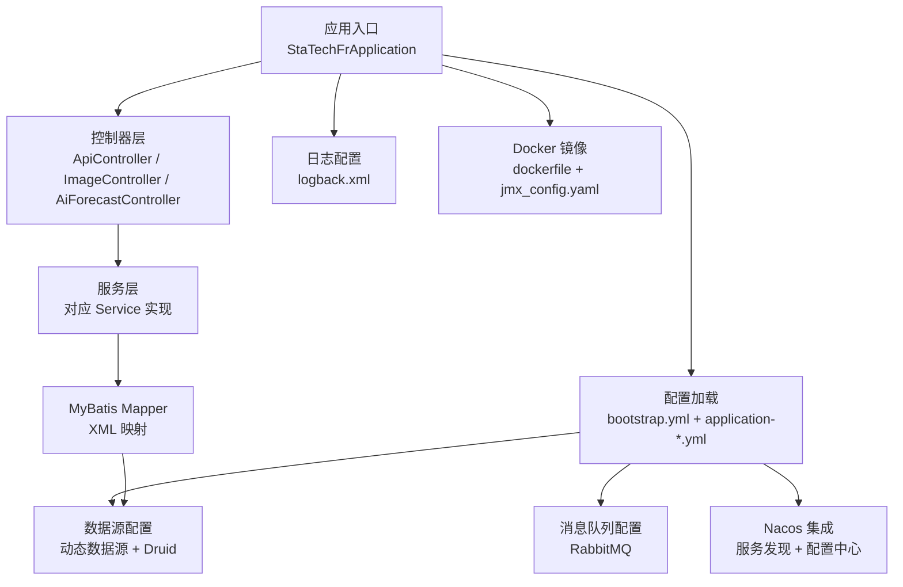
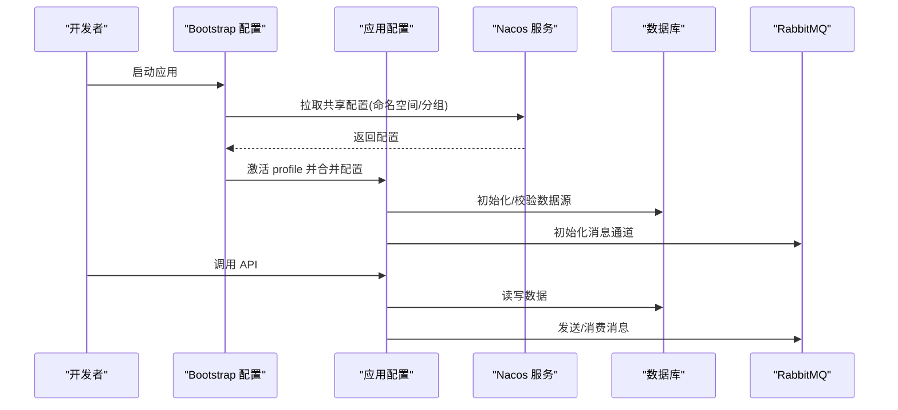
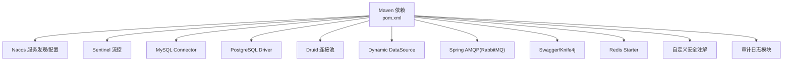

# 快速开始

<cite>
**本文引用的文件**
- [pom.xml](file://pom.xml)
- [StaTechFrApplication.java](file://src/main/java/cn/staitech/fr/StaTechFrApplication.java)
- [bootstrap.yml](file://src/main/resources/bootstrap.yml)
- [application-local.yml](file://src/main/resources/application-local.yml)
- [bootstrap-local.yml](file://src/main/resources/bootstrap-local.yml)
- [dockerfile](file://docker/staitech/modules/fr/dockerfile)
- [jmx_config.yaml](file://docker/staitech/modules/fr/jmx_config.yaml)
- [logback.xml](file://src/main/resources/logback.xml)
- [V2.6.1-Mysql.sql](file://sql/V2.6.1-Mysql.sql)
- [ApiController.java](file://src/main/java/cn/staitech/fr/controller/ApiController.java)
- [AiForecastController.java](file://src/main/java/cn/staitech/fr/controller/AiForecastController.java)
- [ImageController.java](file://src/main/java/cn/staitech/fr/controller/ImageController.java)
</cite>

## 目录
1. [简介](#简介)
2. [项目结构](#项目结构)
3. [核心组件](#核心组件)
4. [架构概览](#架构概览)
5. [详细组件分析](#详细组件分析)
6. [依赖分析](#依赖分析)
7. [性能考虑](#性能考虑)
8. [故障排除指南](#故障排除指南)
9. [结论](#结论)
10. [附录](#附录)

## 简介
本指南面向初学者与有经验的开发者，帮助您在最短时间内完成 FR 数字阅片模块的环境准备、安装部署与基本使用。内容涵盖：
- Java 版本与 Maven 构建要求
- 数据库连接与初始化脚本
- Docker 镜像构建与运行
- 本地开发环境配置与 Nacos 服务发现
- Spring Cloud Alibaba 集成要点
- 常用 API 使用示例与常见配置项
- 故障排除与常见问题

## 项目结构
FR 模块采用标准 Spring Boot 工程结构，核心目录与文件如下：
- 配置层：bootstrap.yml、application-*.yml、logback.xml
- 业务层：controller、service、mapper、domain、utils
- 资源层：i18n、mapper XML、静态资源
- 构建与打包：pom.xml、Dockerfile
- 数据库脚本：sql 目录下的多版本 SQL

图表来源
- [StaTechFrApplication.java:34-38](file://src/main/java/cn/staitech/fr/StaTechFrApplication.java#L34-L38)
- [bootstrap.yml:11-46](file://src/main/resources/bootstrap.yml#L11-L46)
- [application-local.yml:5-83](file://src/main/resources/application-local.yml#L5-L83)
- [dockerfile:1-22](file://docker/staitech/modules/fr/dockerfile#L1-L22)

章节来源
- [pom.xml:1-366](file://pom.xml#L1-L366)
- [StaTechFrApplication.java:1-63](file://src/main/java/cn/staitech/fr/StaTechFrApplication.java#L1-L63)
- [bootstrap.yml:1-48](file://src/main/resources/bootstrap.yml#L1-L48)
- [application-local.yml:1-311](file://src/main/resources/application-local.yml#L1-L311)
- [logback.xml:1-102](file://src/main/resources/logback.xml#L1-L102)
- [dockerfile:1-22](file://docker/staitech/modules/fr/dockerfile#L1-L22)

## 核心组件
- 应用入口与注解：启用服务发现、异步、事务、MyBatis Mapper 扫描等
- 配置中心与服务发现：通过 Nacos 注册与拉取配置
- 动态数据源：支持 MySQL 主库与 PostgreSQL 从库
- 消息队列：RabbitMQ 用于算法回调与延迟消息
- 日志系统：基于 logback 的多文件输出与按模块分级
- Docker 镜像：内置 JMX Exporter 与 Arthas 调试工具

章节来源
- [StaTechFrApplication.java:29-38](file://src/main/java/cn/staitech/fr/StaTechFrApplication.java#L29-L38)
- [bootstrap.yml:23-46](file://src/main/resources/bootstrap.yml#L23-L46)
- [application-local.yml:15-83](file://src/main/resources/application-local.yml#L15-L83)
- [logback.xml:85-101](file://src/main/resources/logback.xml#L85-L101)
- [dockerfile:16-22](file://docker/staitech/modules/fr/dockerfile#L16-L22)

## 架构概览
FR 模块采用微服务风格，结合 Spring Cloud Alibaba 生态实现服务治理与配置管理。核心交互流程包括：
- 启动阶段：读取 bootstrap.yml 激活 profile，连接 Nacos 获取共享配置
- 运行阶段：加载 application-*.yml 完成数据源、消息队列、Swagger 等配置
- 业务阶段：控制器接收请求，调用服务层，持久化至数据库或发送消息

图表来源
- [bootstrap.yml:23-46](file://src/main/resources/bootstrap.yml#L23-L46)
- [application-local.yml:15-83](file://src/main/resources/application-local.yml#L15-L83)
- [StaTechFrApplication.java:45-52](file://src/main/java/cn/staitech/fr/StaTechFrApplication.java#L45-L52)

## 详细组件分析

### 环境要求与安装部署

- Java 版本
  - Docker 镜像使用 OpenJDK 8 JRE（容器内）
  - 本地开发建议使用 JDK 8 或更高版本以兼容依赖
  - 应用入口设置了默认时区为 Asia/Shanghai

- Maven 构建
  - 使用 Spring Boot Maven 插件进行打包
  - 支持多环境 Profile（local、pacmvsdev、testpvcmvs、pathmedics），通过激活属性注入 Nacos 地址与命名空间
  - 资源过滤开启，可将模板与本地 lib 下的 jar 打入最终包

- 数据库连接设置
  - 动态数据源：主库为 MySQL，从库为 PostgreSQL
  - Hikari 连接池参数已配置，包含最大连接数、空闲超时、连接超时等
  - MyBatis 配置：别名包、Mapper XML 扫描、日志输出

- Docker 部署步骤
  - 基于 openjdk:8-jre 构建镜像
  - 挂载 /home/staitech 目录，复制 jar、JMX Agent、Arthas 启动器
  - 通过 JAVA_OPTS 传参，启用 JMX Exporter 暴露 JVM 指标
  - 默认端口由 bootstrap.yml 指定，可通过环境变量覆盖

- 本地开发环境配置
  - application-local.yml 提供 Redis、MySQL、PostgreSQL、RabbitMQ 示例配置
  - bootstrap-local.yml 关闭 Nacos 发现与配置，适合本地直连模式
  - 日志级别与模块输出已配置，便于调试

章节来源
- [dockerfile:1-22](file://docker/staitech/modules/fr/dockerfile#L1-L22)
- [pom.xml:276-300](file://pom.xml#L276-L300)
- [bootstrap.yml:2-4](file://src/main/resources/bootstrap.yml#L2-L4)
- [application-local.yml:5-83](file://src/main/resources/application-local.yml#L5-L83)
- [bootstrap-local.yml:1-9](file://src/main/resources/bootstrap-local.yml#L1-L9)
- [logback.xml:85-101](file://src/main/resources/logback.xml#L85-L101)

### Spring Cloud Alibaba 集成说明

- 服务发现与配置中心
  - 引入 spring-cloud-starter-alibaba-nacos-discovery 与 nacos-config
  - bootstrap.yml 中配置 discovery.server-addr、namespace、group、shared-configs
  - application-*.yml 通过 @activatedProperties@ 注入当前环境

- Sentinel（流量治理）
  - 引入 spring-cloud-starter-alibaba-sentinel，可按需启用限流/熔断策略

- Nacos 配置优先级
  - 共享配置 application-${spring.profiles.active}.${spring.cloud.nacos.config.file-extension}
  - 本地 application-*.yml 作为本地覆盖，便于开发调试

章节来源
- [pom.xml:25-41](file://pom.xml#L25-L41)
- [bootstrap.yml:23-46](file://src/main/resources/bootstrap.yml#L23-L46)
- [application-local.yml:6-7](file://src/main/resources/application-local.yml#L6-L7)

### 数据库初始化与脚本说明

- 初始化脚本
  - 提供多版本 SQL 文件，包含表结构变更、索引优化、菜单图标更新等
  - 建议先执行基础版本 SQL，再按需应用增量脚本

- 建议步骤
  - 准备 MySQL 与 PostgreSQL 实例
  - 执行基础 SQL，创建所需表与字段
  - 在 application-*.yml 中配置正确的连接信息与账号权限

章节来源
- [V2.6.1-Mysql.sql:1-200](file://sql/V2.6.1-Mysql.sql#L1-L200)

### API 使用示例

- 对外回调接口（POST /api/pyResult）
  - 接收外部算法返回的数据，写入消息队列
  - 返回统一响应结构

- 算法任务接口（POST /api/pyTask）
  - 接收算法任务请求，支持延迟消息发送
  - 延迟时长来自配置项 queues.delayTime

- AI 预测结果接口（GET /aiForecast/forecastResults）
  - 查询单切片的预测结果，返回布尔值

- 切片管理接口（POST /image/list、/image/status、/image/update、/image/detailByIds 等）
  - 支持分页查询、状态列表、批量删除、详情查询等

章节来源
- [ApiController.java:37-60](file://src/main/java/cn/staitech/fr/controller/ApiController.java#L37-L60)
- [AiForecastController.java:26-31](file://src/main/java/cn/staitech/fr/controller/AiForecastController.java#L26-L31)
- [ImageController.java:55-151](file://src/main/java/cn/staitech/fr/controller/ImageController.java#L55-L151)

### 常见配置选项

- 应用与端口
  - server.port：应用监听端口
  - spring.application.name：服务名，用于 Nacos 注册

- 配置中心与服务发现
  - spring.cloud.nacos.discovery.server-addr / namespace / group
  - spring.cloud.nacos.config.server-addr / file-extension / namespace / group
  - shared-configs：共享配置文件名模板

- 数据源与动态数据源
  - spring.datasource.dynamic.primary：默认数据源
  - master/slave 数据源驱动、URL、用户名、密码、Hikari 参数

- RabbitMQ
  - 主机、端口、虚拟主机、认证信息
  - publisher-returns、publisher-confirm-type、listener 配置

- Swagger/Knife4j
  - knife4j.enable：在线文档开关
  - swagger.title/license 等标题与许可信息

- 日志与监控
  - logging.level.*：模块日志级别
  - management.endpoints.web.exposure.include：暴露健康检查等端点
  - jmx_exporter：JMX 指标导出配置

章节来源
- [bootstrap.yml:1-48](file://src/main/resources/bootstrap.yml#L1-L48)
- [application-local.yml:5-106](file://src/main/resources/application-local.yml#L5-L106)
- [logback.xml:85-101](file://src/main/resources/logback.xml#L85-L101)

## 依赖分析

图表来源
- [pom.xml:19-211](file://pom.xml#L19-L211)

章节来源
- [pom.xml:19-211](file://pom.xml#L19-L211)

## 性能考虑
- 连接池与超时
  - Hikari 连接池参数已配置，建议根据并发与数据库性能调整最大连接数与空闲超时
- 分页与查询
  - MyBatis Plus 分页拦截器已启用，合理使用分页可降低内存压力
- 消息队列
  - RabbitMQ 手动确认与重试机制有助于提升可靠性，注意幂等性设计
- 监控与可观测性
  - JMX Exporter 暴露 JVM 指标，Prometheus 抓取后可在 Grafana 展示
  - 日志按模块分级，便于定位热点与异常

## 故障排除指南

- 启动失败（无法连接 Nacos）
  - 检查 bootstrap.yml 中 server-addr、namespace、group 是否正确
  - 若本地开发，可临时关闭 Nacos 发现与配置（bootstrap-local.yml）

- 数据库连接异常
  - 核对 application-*.yml 中 master/slave 的 URL、用户名、密码
  - 确认数据库实例可达且网络策略允许访问

- RabbitMQ 消费异常
  - 检查 virtual-host、用户名、密码是否匹配
  - 关注 listener 手动确认与重试配置

- Swagger 文档不可见
  - 确认 knife4j.enable 已开启
  - 访问 /doc.html 查看在线文档

- Docker 运行问题
  - 确认镜像使用 openjdk:8-jre
  - 检查 JAVA_OPTS 与 JMX Agent 配置
  - 端口映射与挂载卷是否正确

章节来源
- [bootstrap.yml:23-46](file://src/main/resources/bootstrap.yml#L23-L46)
- [bootstrap-local.yml:1-9](file://src/main/resources/bootstrap-local.yml#L1-L9)
- [application-local.yml:15-83](file://src/main/resources/application-local.yml#L15-L83)
- [logback.xml:85-101](file://src/main/resources/logback.xml#L85-L101)
- [dockerfile:16-22](file://docker/staitech/modules/fr/dockerfile#L16-L22)

## 结论
通过本快速开始指南，您可以完成 FR 模块的环境准备、构建与部署，并掌握常用 API 的使用方法。建议在本地开发时关闭 Nacos 配置与发现，待联调阶段再切换到线上配置。生产环境请务必完善监控与日志策略，并根据实际负载调整数据库与消息队列参数。

## 附录

### 常用命令与路径
- 构建（多环境）
  - mvn clean package -Plocal
  - mvn clean package -Ppacmvsdev
- Docker 构建
  - docker build -f docker/staitech/modules/fr/dockerfile -t staitech-fr .
- 启动（本地）
  - java -jar target/staitech-modules-fr.jar --spring.profiles.active=local
- 访问文档
  - http://localhost:9701/doc.html

### 关键配置清单
- 端口：server.port
- Nacos：discovery.server-addr / namespace / group
- 配置中心：config.server-addr / file-extension / namespace / group
- 数据源：master/slave URL、用户名、密码、Hikari 参数
- RabbitMQ：host/port/virtual-host/username/password
- Swagger：knife4j.enable、swagger.title
- 日志：logging.level.*、management.endpoints.web.exposure.include