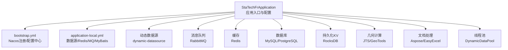
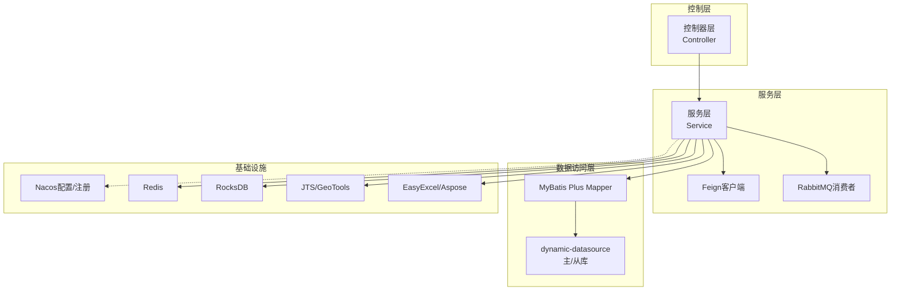
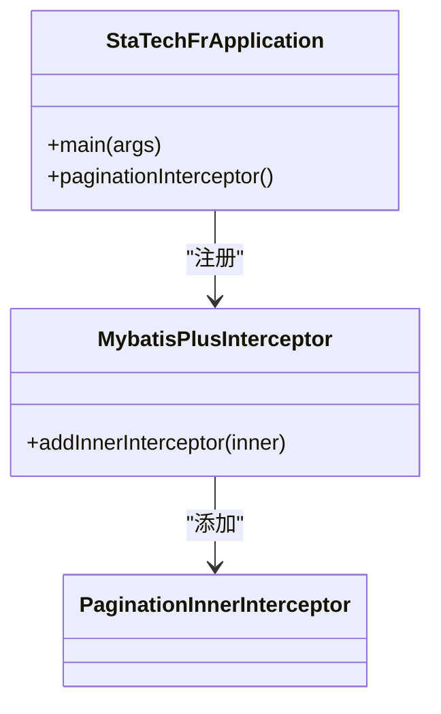
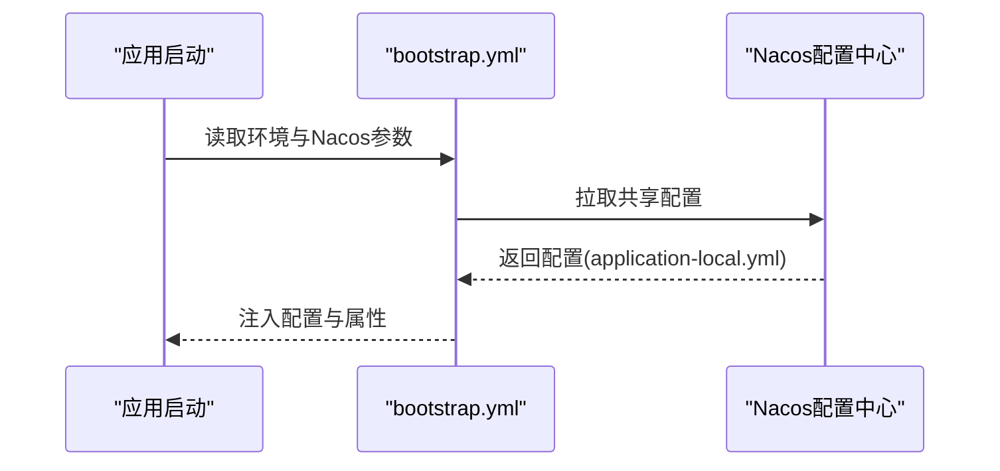
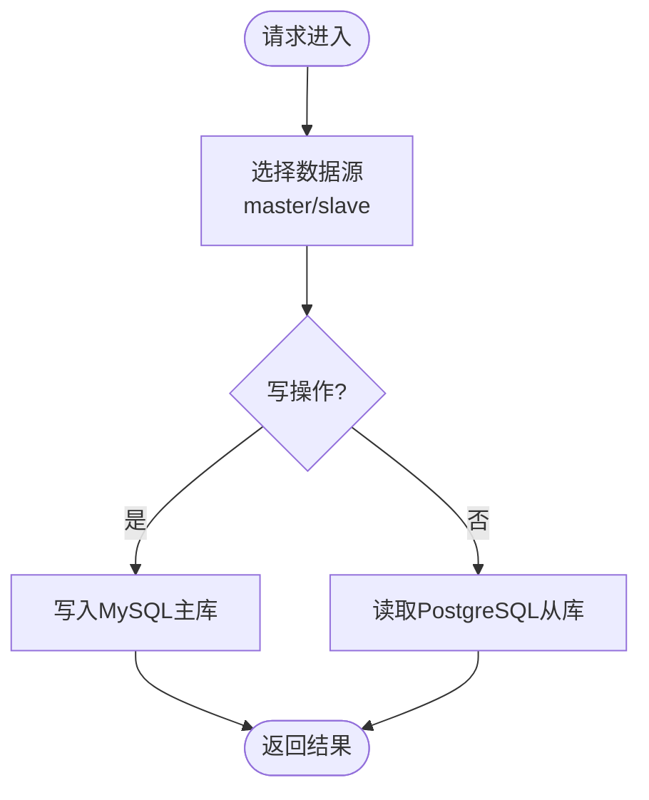
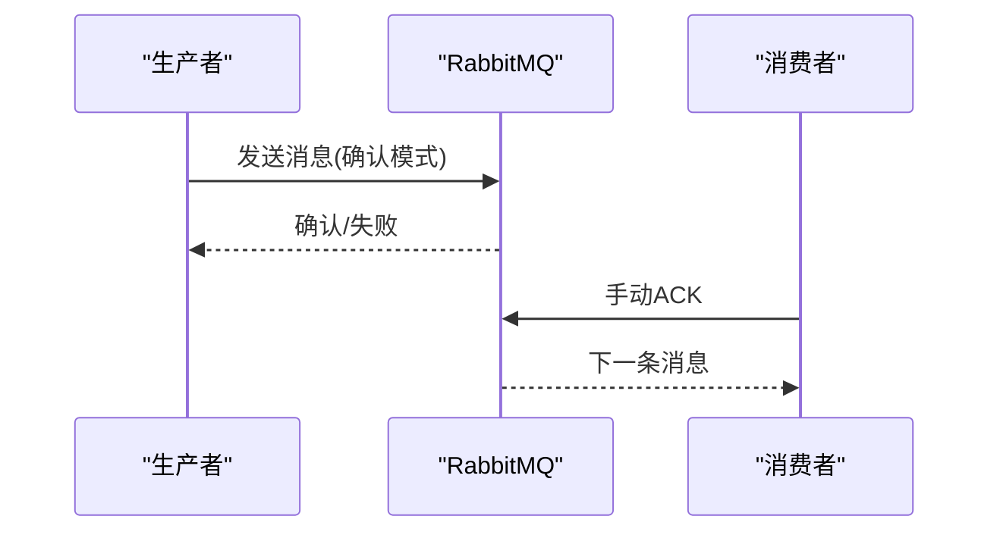
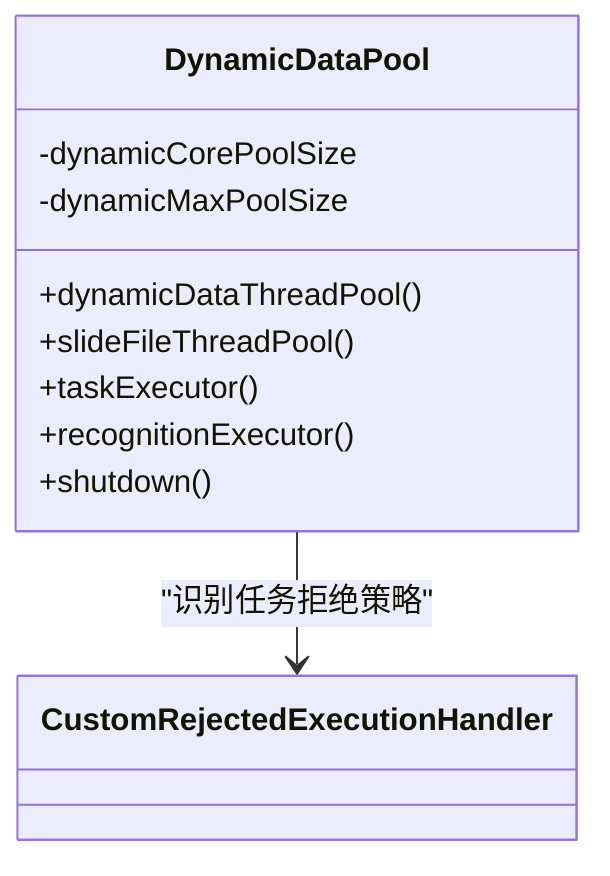
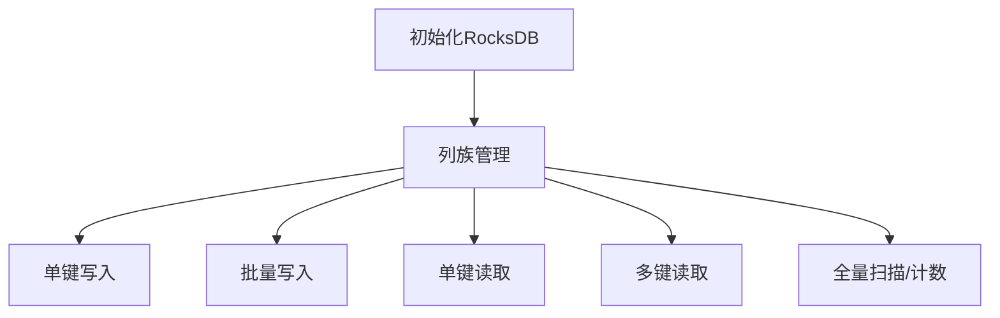
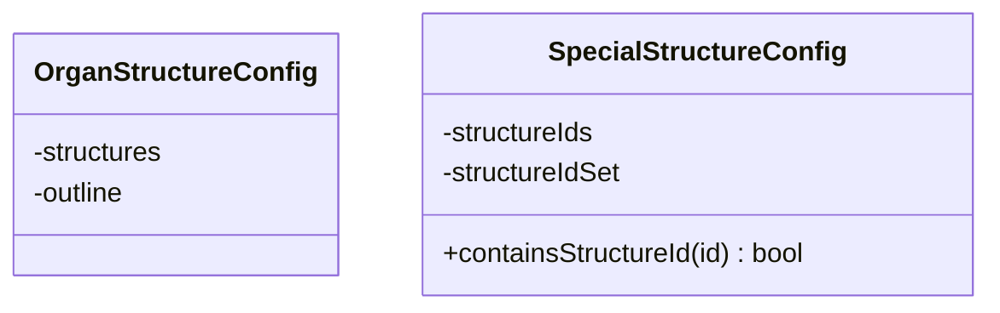
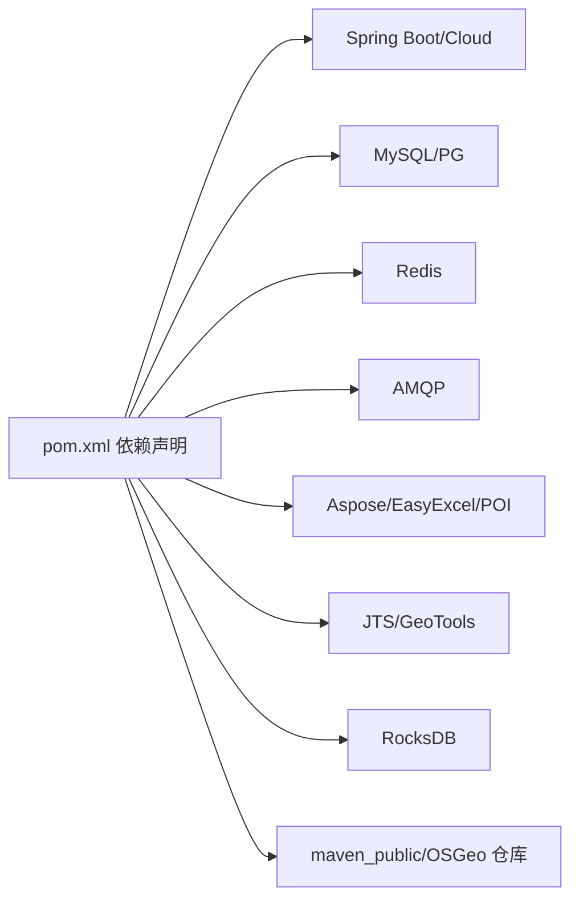

# 技术栈与依赖

<cite>
**本文引用的文件**
- [pom.xml](file://pom.xml)
- [StaTechFrApplication.java](file://src/main/java/cn/staitech/fr/StaTechFrApplication.java)
- [bootstrap.yml](file://src/main/resources/bootstrap.yml)
- [application-local.yml](file://src/main/resources/application-local.yml)
- [DynamicDataPool.java](file://src/main/java/cn/staitech/fr/config/DynamicDataPool.java)
- [InitializinConfig.java](file://src/main/java/cn/staitech/fr/config/InitializinConfig.java)
- [OrganStructureConfig.java](file://src/main/java/cn/staitech/fr/config/OrganStructureConfig.java)
- [SpecialStructureConfig.java](file://src/main/java/cn/staitech/fr/config/SpecialStructureConfig.java)
- [RocksDBUtil.java](file://src/main/java/cn/staitech/fr/utils/RocksDBUtil.java)
</cite>

## 目录
1. [简介](#简介)
2. [项目结构](#项目结构)
3. [核心组件](#核心组件)
4. [架构总览](#架构总览)
5. [详细组件分析](#详细组件分析)
6. [依赖分析](#依赖分析)
7. [性能考虑](#性能考虑)
8. [故障排查指南](#故障排查指南)
9. [结论](#结论)
10. [附录](#附录)

## 简介
本文件面向FR模块（数字阅片）的技术栈与依赖，系统性梳理Spring Boot、Spring Cloud Alibaba、MyBatis Plus等核心框架的作用与配置要点，说明外部依赖库如RocksDB、JTS几何库、Aspose文档处理、EasyExcel等的功能与集成方式，解释依赖版本管理与仓库配置，给出技术选型原因、组件在系统架构中的定位、版本兼容性与升级注意事项，并统一采用代码库中的术语，确保内容准确与实用。

## 项目结构
FR模块基于Spring Boot构建，采用多环境配置与Nacos配置中心，结合动态数据源、线程池与缓存等基础设施，支撑阅片标注、结构化数据处理与异步任务调度。核心结构包括：
- 应用入口与基础配置：StaTechFrApplication负责应用启动、事务与分页插件装配、Mapper扫描与Swagger启用。
- 配置体系：bootstrap.yml负责Nacos注册与配置中心接入；application-local.yml负责本地开发环境的数据源、Redis、MQ、MyBatis、日志与业务配置。
- 线程池与资源：DynamicDataPool提供多类线程池，满足AI解析、切片文件处理与识别任务的并发控制。
- 缓存与几何：InitializinConfig确保Redis连接校验；RocksDBUtil封装RocksDB列族与KV操作，支持高吞吐读写。
- 结构配置：OrganStructureConfig与SpecialStructureConfig分别承载器官-结构映射与特殊结构ID集合，便于运行期按配置决策。

**图表来源**
- [StaTechFrApplication.java:39-62](file://src/main/java/cn/staitech/fr/StaTechFrApplication.java#L39-L62)
- [bootstrap.yml:11-47](file://src/main/resources/bootstrap.yml#L11-L47)
- [application-local.yml:15-75](file://src/main/resources/application-local.yml#L15-L75)
- [DynamicDataPool.java:29-64](file://src/main/java/cn/staitech/fr/config/DynamicDataPool.java#L29-L64)
- [InitializinConfig.java:19-24](file://src/main/java/cn/staitech/fr/config/InitializinConfig.java#L19-L24)
- [RocksDBUtil.java:54-82](file://src/main/java/cn/staitech/fr/utils/RocksDBUtil.java#L54-L82)

**章节来源**
- [StaTechFrApplication.java:39-62](file://src/main/java/cn/staitech/fr/StaTechFrApplication.java#L39-L62)
- [bootstrap.yml:11-47](file://src/main/resources/bootstrap.yml#L11-L47)
- [application-local.yml:15-75](file://src/main/resources/application-local.yml#L15-L75)

## 核心组件
- Spring Boot与启动装配
  - 启动类启用发现、异步、事务、Swagger、Feign客户端与Mapper扫描，内置MyBatis Plus分页拦截器。
- Spring Cloud Alibaba
  - Nacos服务发现与配置中心：通过bootstrap.yml注入server-addr、namespace、group与共享配置。
  - Sentinel限流熔断：作为云原生安全边界。
- MyBatis Plus
  - 提供通用CRUD与分页能力，内置PaginationInnerInterceptor实现物理分页。
- 动态数据源
  - dynamic-datasource-spring-boot-starter实现主从分离与多数据源切换。
- 缓存与消息
  - Redis：Lettuce连接工厂校验；application-local.yml配置连接参数。
  - RabbitMQ：发布确认、手动ACK、重试策略与队列声明。
- 文档与几何
  - Aspose-words：生成Word报告。
  - EasyExcel：高性能Excel导入导出。
  - JTS/GeoTools：几何解析与GeoJSON处理。
- 持久化KV
  - RocksDB：列族管理、批量写入、迭代与计数，适配高并发场景。

**章节来源**
- [StaTechFrApplication.java:39-62](file://src/main/java/cn/staitech/fr/StaTechFrApplication.java#L39-L62)
- [bootstrap.yml:23-46](file://src/main/resources/bootstrap.yml#L23-L46)
- [application-local.yml:15-75](file://src/main/resources/application-local.yml#L15-L75)
- [InitializinConfig.java:19-24](file://src/main/java/cn/staitech/fr/config/InitializinConfig.java#L19-L24)
- [RocksDBUtil.java:54-82](file://src/main/java/cn/staitech/fr/utils/RocksDBUtil.java#L54-L82)

## 架构总览
FR模块采用“微服务+多数据源+异步处理+缓存+KV存储”的混合架构：
- 控制层通过Spring MVC暴露REST接口；
- 业务层通过Feign调用其他模块，结合RabbitMQ异步解耦；
- 数据访问层使用MyBatis Plus与动态数据源，MySQL主库写入、PostgreSQL从库查询；
- Redis提供会话与热点数据缓存；
- RocksDB作为高吞吐KV存储，支撑结构化数据与临时索引；
- JTS/GeoTools完成几何解析，Aspose/EasyExcel完成报告与报表生成。

**图表来源**
- [StaTechFrApplication.java:39-62](file://src/main/java/cn/staitech/fr/StaTechFrApplication.java#L39-L62)
- [bootstrap.yml:23-46](file://src/main/resources/bootstrap.yml#L23-L46)
- [application-local.yml:15-75](file://src/main/resources/application-local.yml#L15-L75)
- [DynamicDataPool.java:29-64](file://src/main/java/cn/staitech/fr/config/DynamicDataPool.java#L29-L64)

## 详细组件分析

### Spring Boot与MyBatis Plus
- 启动类装配
  - 启用发现、异步、事务、Swagger、Feign客户端与Mapper扫描。
  - 注册MyBatis Plus分页拦截器，实现全局分页。
- MyBatis Plus
  - 通过Mapper接口与XML映射文件实现SQL编排；application-local.yml配置了typeAliasesPackage与mapperLocations。
- 版本与兼容性
  - MyBatis Plus与Spring Boot 2.6.x配合良好；注意与数据库驱动版本匹配（MySQL Connector/J与PostgreSQL JDBC）。

**图表来源**
- [StaTechFrApplication.java:54-60](file://src/main/java/cn/staitech/fr/StaTechFrApplication.java#L54-L60)

**章节来源**
- [StaTechFrApplication.java:39-62](file://src/main/java/cn/staitech/fr/StaTechFrApplication.java#L39-L62)
- [application-local.yml:76-83](file://src/main/resources/application-local.yml#L76-L83)

### Spring Cloud Alibaba（Nacos/Sentinel）
- Nacos
  - bootstrap.yml中配置server-addr、namespace、group与共享配置application-local.yml，实现集中化配置与服务发现。
- Sentinel
  - 作为流量治理组件，保障服务稳定性与SLA。
- 升级注意事项
  - Spring Boot 2.6.x + Spring Cloud 2021.x + Spring Cloud Alibaba 2021.x版本组合较为稳定；升级需同步校验依赖版本矩阵。

**图表来源**
- [bootstrap.yml:23-46](file://src/main/resources/bootstrap.yml#L23-L46)

**章节来源**
- [bootstrap.yml:23-46](file://src/main/resources/bootstrap.yml#L23-L46)

### 动态数据源与数据库
- dynamic-datasource
  - application-local.yml中配置master/slave两套数据源，主库写、从库读；primary指向master。
  - HikariCP参数覆盖连接池大小、空闲超时、生命周期与校验查询。
- MySQL与PostgreSQL
  - MySQL Connector/J与PostgreSQL JDBC驱动版本与JDK/ServerTimezone配置需一致。
- 升级注意事项
  - 动态数据源版本需与Spring Boot版本匹配；数据库驱动版本建议与官方推荐一致。

**图表来源**
- [application-local.yml:15-56](file://src/main/resources/application-local.yml#L15-L56)

**章节来源**
- [application-local.yml:15-56](file://src/main/resources/application-local.yml#L15-L56)

### 缓存与消息（Redis/RabbitMQ）
- Redis
  - application-local.yml配置host/port/password；InitializinConfig确保LettuceConnectionFactory开启连接校验。
- RabbitMQ
  - application-local.yml配置虚拟主机、发布确认、手动ACK、重试次数与间隔；direct/simple两类监听策略。
- 升级注意事项
  - RabbitMQ客户端与Spring AMQP版本需匹配；发布确认与手动ACK策略需与业务幂等设计一致。

**图表来源**
- [application-local.yml:57-75](file://src/main/resources/application-local.yml#L57-L75)
- [InitializinConfig.java:19-24](file://src/main/java/cn/staitech/fr/config/InitializinConfig.java#L19-L24)

**章节来源**
- [application-local.yml:57-75](file://src/main/resources/application-local.yml#L57-L75)
- [InitializinConfig.java:19-24](file://src/main/java/cn/staitech/fr/config/InitializinConfig.java#L19-L24)

### 线程池与并发控制（DynamicDataPool）
- 组件职责
  - 提供动态数据线程池、切片文件线程池与识别任务线程池；支持可配置的核心/最大线程与队列容量。
  - 自定义拒绝策略，记录日志并抛出异常，便于上层感知与补偿。
- 设计要点
  - 识别任务线程池采用LinkedBlockingQueue与自定义拒绝策略，防止OOM与主线程阻塞。
  - 提供优雅关闭流程，避免资源泄露。
- 升级注意事项
  - 线程池参数与CPU核数、IO特性匹配；队列容量与内存占用平衡。

**图表来源**
- [DynamicDataPool.java:29-64](file://src/main/java/cn/staitech/fr/config/DynamicDataPool.java#L29-L64)
- [DynamicDataPool.java:101-115](file://src/main/java/cn/staitech/fr/config/DynamicDataPool.java#L101-L115)

**章节来源**
- [DynamicDataPool.java:29-64](file://src/main/java/cn/staitech/fr/config/DynamicDataPool.java#L29-L64)
- [DynamicDataPool.java:177-230](file://src/main/java/cn/staitech/fr/config/DynamicDataPool.java#L177-L230)

### RocksDB KV存储（RocksDBUtil）
- 组件职责
  - 封装RocksDB列族管理、KV增删改查、批量写入、多键查询、全量迭代与计数。
  - 支持Windows/Linux不同默认路径；启动时清理旧数据并重建实例。
- 设计要点
  - 列族Handle缓存于ConcurrentMap，减少重复句柄开销。
  - 批量写入使用WriteBatch提升吞吐。
- 升级注意事项
  - RocksDBJNI版本与平台匹配；列族命名与业务域隔离。

**图表来源**
- [RocksDBUtil.java:54-82](file://src/main/java/cn/staitech/fr/utils/RocksDBUtil.java#L54-L82)
- [RocksDBUtil.java:158-174](file://src/main/java/cn/staitech/fr/utils/RocksDBUtil.java#L158-L174)
- [RocksDBUtil.java:187-195](file://src/main/java/cn/staitech/fr/utils/RocksDBUtil.java#L187-L195)

**章节来源**
- [RocksDBUtil.java:54-82](file://src/main/java/cn/staitech/fr/utils/RocksDBUtil.java#L54-L82)
- [RocksDBUtil.java:158-174](file://src/main/java/cn/staitech/fr/utils/RocksDBUtil.java#L158-L174)
- [RocksDBUtil.java:187-195](file://src/main/java/cn/staitech/fr/utils/RocksDBUtil.java#L187-L195)
- [RocksDBUtil.java:243-252](file://src/main/java/cn/staitech/fr/utils/RocksDBUtil.java#L243-L252)

### 几何与文档处理
- 几何库
  - JTS 1.13与JTS Core 1.19.0并存，用于几何解析与拓扑运算；GeoTools gt-geojson 25.0提供GeoJSON支持。
- 文档处理
  - Aspose Words 23.1用于生成Word报告；EasyExcel 3.2.1用于高性能Excel导入导出；poi-tl 1.11.1与POI 5.2.2用于模板渲染。
- 升级注意事项
  - Aspose版本与许可证匹配；EasyExcel与POI版本需兼容；JTS与GeoTools版本需避免冲突。

**章节来源**
- [pom.xml:110-121](file://pom.xml#L110-L121)
- [pom.xml:141-145](file://pom.xml#L141-L145)
- [pom.xml:185-195](file://pom.xml#L185-L195)
- [pom.xml:157-161](file://pom.xml#L157-L161)

### 结构配置（OrganStructureConfig/SpecialStructureConfig）
- OrganStructureConfig
  - 读取organ-structures配置，将器官ID映射到结构列表与轮廓列表，便于运行期按器官维度筛选结构。
- SpecialStructureConfig
  - 将特殊结构ID列表转为HashSet，提供O(1)包含判断，降低频繁查找成本。
- 升级注意事项
  - 配置项变更需验证结构ID格式一致性与去空格处理。

**图表来源**
- [OrganStructureConfig.java:14-36](file://src/main/java/cn/staitech/fr/config/OrganStructureConfig.java#L14-L36)
- [SpecialStructureConfig.java:32-73](file://src/main/java/cn/staitech/fr/config/SpecialStructureConfig.java#L32-L73)

**章节来源**
- [OrganStructureConfig.java:14-36](file://src/main/java/cn/staitech/fr/config/OrganStructureConfig.java#L14-L36)
- [SpecialStructureConfig.java:32-73](file://src/main/java/cn/staitech/fr/config/SpecialStructureConfig.java#L32-L73)

## 依赖分析

### 依赖版本与仓库配置
- 核心依赖
  - Spring Boot Starter、Actuator、AMQP、Lombok、Swagger、Security、Redis、动态数据源、MyBatis Plus分页拦截器。
  - Spring Cloud Alibaba：Nacos Discovery/Config/Sentinel。
  - 数据库：MySQL Connector/J、PostgreSQL JDBC。
  - 缓存：Staitech Common Redis。
  - 文档：Aspose Words、EasyExcel、poi-tl、POI OOXML。
  - 几何：JTS 1.13、JTS Core 1.19.0、GeoTools gt-geojson 25.0。
  - 其他：RocksDB JNI 7.10.2、Transmittable Thread Local 2.12.2、Binlog Connector 0.17.0、日志审计等。
- 仓库
  - maven_public：内部私有仓库。
  - OSGeo Release：JTS/GeoTools相关构件。
- 升级注意事项
  - Spring Boot 2.6.x与Spring Cloud 2021.x + Spring Cloud Alibaba 2021.x组合稳定；数据库驱动与JDBC版本需与JDK/时区配置一致；RocksDB JNI与平台匹配。

**图表来源**
- [pom.xml:19-211](file://pom.xml#L19-L211)
- [pom.xml:212-234](file://pom.xml#L212-L234)

**章节来源**
- [pom.xml:19-211](file://pom.xml#L19-L211)
- [pom.xml:212-234](file://pom.xml#L212-L234)

## 性能考虑
- 线程池
  - 识别任务线程池采用有界队列与快速失败策略，避免内存膨胀；核心/最大线程按CPU比例动态调整，兼顾吞吐与稳定性。
- 缓存
  - Redis连接校验与合理超时配置，降低连接抖动；热点数据走缓存，冷数据走数据库。
- 数据库
  - 主从分离与只读路由，读写分离；HikariCP参数优化连接池性能。
- KV存储
  - RocksDB列族隔离与批量写入，适合高并发KV场景；全量扫描与计数需谨慎，建议分批处理。
- 文档与几何
  - EasyExcel与Aspose按场景选择；JTS/GeoTools几何计算需避免大规模对象创建，必要时复用几何对象。

[本节为通用性能指导，不直接分析具体文件]

## 故障排查指南
- 启动与配置
  - 若Nacos连接失败，检查bootstrap.yml中的server-addr、namespace、group与共享配置文件名。
  - 若Redis连接异常，确认application-local.yml配置与InitializinConfig中Lettuce校验开关。
- 数据库
  - 主从切换异常时，检查dynamic-datasource配置与primary指向；确认MySQL/PG驱动版本与JDBC URL参数。
- 线程池
  - 识别任务频繁被拒绝时，查看拒绝策略日志，评估队列容量与线程上限；结合CPU核数与IO特性调整。
- RocksDB
  - 初始化失败时，检查默认路径权限与平台差异；批量写入失败时，确认WriteBatch与列族句柄有效性。
- 文档与几何
  - Aspose/Excel处理异常时，核对模板与字段映射；JTS/GeoTools解析失败时，检查输入几何格式与坐标系。

**章节来源**
- [bootstrap.yml:23-46](file://src/main/resources/bootstrap.yml#L23-L46)
- [application-local.yml:15-75](file://src/main/resources/application-local.yml#L15-L75)
- [InitializinConfig.java:19-24](file://src/main/java/cn/staitech/fr/config/InitializinConfig.java#L19-L24)
- [DynamicDataPool.java:101-115](file://src/main/java/cn/staitech/fr/config/DynamicDataPool.java#L101-L115)
- [RocksDBUtil.java:54-82](file://src/main/java/cn/staitech/fr/utils/RocksDBUtil.java#L54-L82)

## 结论
FR模块通过Spring Boot与Spring Cloud Alibaba实现服务化与配置化，结合MyBatis Plus、动态数据源与Redis/RabbitMQ构建高可用数据访问与消息通道；RocksDB提供高吞吐KV能力，JTS/GeoTools支撑几何解析，Aspose/EasyExcel完善文档与报表能力。整体技术栈围绕“服务化、异步化、可扩展”展开，版本选择遵循稳定组合，升级需关注依赖矩阵与平台兼容性。

[本节为总结性内容，不直接分析具体文件]

## 附录
- 版本兼容性要点
  - Spring Boot 2.6.x + Spring Cloud 2021.x + Spring Cloud Alibaba 2021.x
  - MySQL Connector/J与PostgreSQL JDBC版本与JDK/ServerTimezone一致
  - RocksDB JNI与操作系统匹配
- 升级建议
  - 优先在同一版本矩阵内滚动升级；数据库驱动与JDBC版本同步更新；第三方库升级后进行回归测试与压测。

[本节为通用指导，不直接分析具体文件]