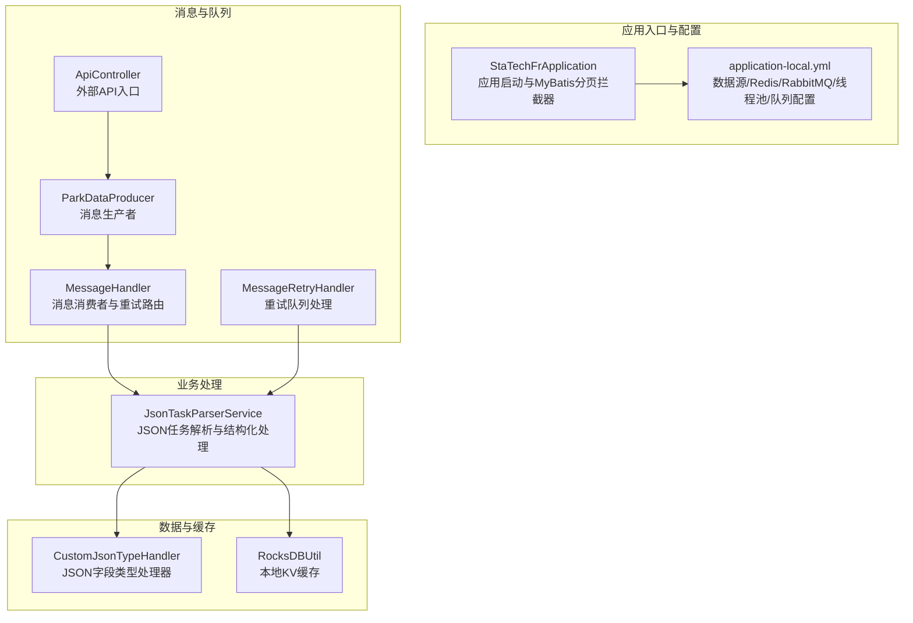
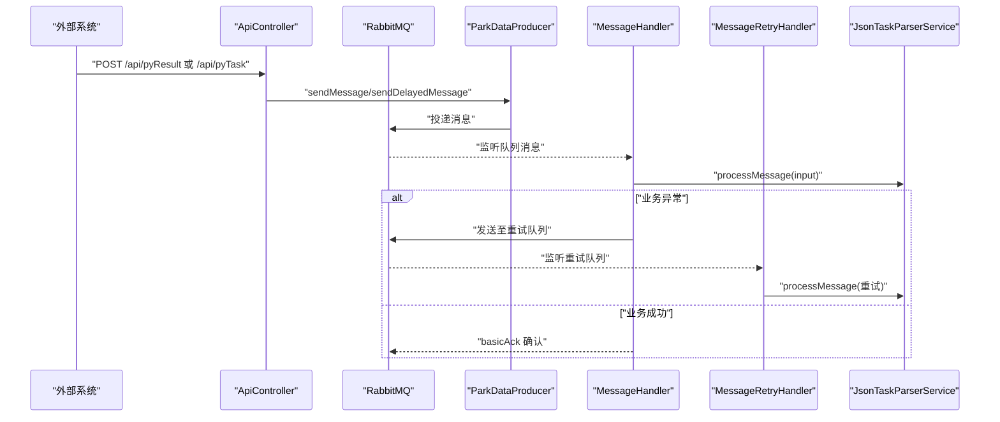
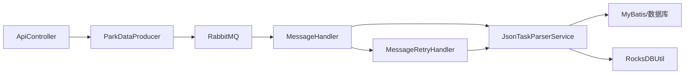

# 常见问题解答

<cite>
**本文引用的文件**
- [StaTechFrApplication.java](file://src/main/java/cn/staitech/fr/StaTechFrApplication.java)
- [application-local.yml](file://src/main/resources/application-local.yml)
- [DynamicThreadPoolConfig.java](file://src/main/java/cn/staitech/fr/config/DynamicThreadPoolConfig.java)
- [ParkDataProducer.java](file://src/main/java/cn/staitech/fr/config/ParkDataProducer.java)
- [MessageHandler.java](file://src/main/java/cn/staitech/fr/config/MessageHandler.java)
- [MessageRetryHandler.java](file://src/main/java/cn/staitech/fr/config/MessageRetryHandler.java)
- [JsonTaskParserService.java](file://src/main/java/cn/staitech/fr/service/strategy/json/JsonTaskParserService.java)
- [ApiController.java](file://src/main/java/cn/staitech/fr/controller/ApiController.java)
- [CustomJsonTypeHandler.java](file://src/main/java/cn/staitech/fr/mapper/handler/CustomJsonTypeHandler.java)
- [RocksDBUtil.java](file://src/main/java/cn/staitech/fr/utils/RocksDBUtil.java)
- [JsonTaskParserException.java](file://src/main/java/cn/staitech/fr/service/strategy/json/JsonTaskParserException.java)
- [CustomRejectionPolicies.java](file://src/main/java/cn/staitech/fr/config/CustomRejectionPolicies.java)
</cite>

## 目录
1. [简介](#简介)
2. [项目结构](#项目结构)
3. [核心组件](#核心组件)
4. [架构总览](#架构总览)
5. [详细组件分析](#详细组件分析)
6. [依赖分析](#依赖分析)
7. [性能考虑](#性能考虑)
8. [故障排查指南](#故障排查指南)
9. [结论](#结论)
10. [附录](#附录)

## 简介
本FAQ面向使用FR模块的用户与运维人员，聚焦于消息队列异常、JSON解析失败、数据库连接问题、线程池阻塞以及缓存失效等高频问题，提供症状、原因、解决步骤、预防措施、优先级与紧急度、自助排查清单、工具与升级流程指引，帮助快速定位与解决问题，降低技术支持负担。

## 项目结构
FR模块采用Spring Boot微服务架构，结合RabbitMQ消息队列、MyBatis Plus数据访问、动态线程池与RocksDB本地KV存储，围绕“算法回调消息”驱动的JSON任务解析与结构化处理展开。

图表来源
- [StaTechFrApplication.java:45-62](file://src/main/java/cn/staitech/fr/StaTechFrApplication.java#L45-L62)
- [application-local.yml:5-110](file://src/main/resources/application-local.yml#L5-L110)
- [ApiController.java:38-59](file://src/main/java/cn/staitech/fr/controller/ApiController.java#L38-L59)
- [ParkDataProducer.java:27-44](file://src/main/java/cn/staitech/fr/config/ParkDataProducer.java#L27-L44)
- [MessageHandler.java:43-75](file://src/main/java/cn/staitech/fr/config/MessageHandler.java#L43-L75)
- [MessageRetryHandler.java:25-42](file://src/main/java/cn/staitech/fr/config/MessageRetryHandler.java#L25-L42)
- [JsonTaskParserService.java:174-263](file://src/main/java/cn/staitech/fr/service/strategy/json/JsonTaskParserService.java#L174-L263)
- [CustomJsonTypeHandler.java:25-101](file://src/main/java/cn/staitech/fr/mapper/handler/CustomJsonTypeHandler.java#L25-L101)
- [RocksDBUtil.java:26-82](file://src/main/java/cn/staitech/fr/utils/RocksDBUtil.java#L26-L82)

章节来源
- [StaTechFrApplication.java:45-62](file://src/main/java/cn/staitech/fr/StaTechFrApplication.java#L45-L62)
- [application-local.yml:5-110](file://src/main/resources/application-local.yml#L5-L110)

## 核心组件
- 应用启动与分页：应用启动时设置时区并输出文档地址；注册MyBatis Plus分页拦截器。
- 配置中心：集中管理数据源（主从）、Redis、RabbitMQ、线程池、队列、脏器结构配置与日志级别。
- 消息生产与消费：API接收外部回调，生产消息至算法队列；消费者解析消息并按异常进入重试队列；重试处理器再次尝试业务处理。
- 业务解析：JSON任务解析服务负责校验、落库、结构化计算与指标生成，支持多种算法策略与特殊结构处理。
- 数据与缓存：MyBatis JSON类型处理器与RocksDB本地KV存储，支撑结构化数据的高效读写与缓存。

章节来源
- [StaTechFrApplication.java:45-62](file://src/main/java/cn/staitech/fr/StaTechFrApplication.java#L45-L62)
- [application-local.yml:5-110](file://src/main/resources/application-local.yml#L5-L110)
- [ApiController.java:38-59](file://src/main/java/cn/staitech/fr/controller/ApiController.java#L38-L59)
- [ParkDataProducer.java:27-44](file://src/main/java/cn/staitech/fr/config/ParkDataProducer.java#L27-L44)
- [MessageHandler.java:43-75](file://src/main/java/cn/staitech/fr/config/MessageHandler.java#L43-L75)
- [MessageRetryHandler.java:25-42](file://src/main/java/cn/staitech/fr/config/MessageRetryHandler.java#L25-L42)
- [JsonTaskParserService.java:174-263](file://src/main/java/cn/staitech/fr/service/strategy/json/JsonTaskParserService.java#L174-L263)
- [CustomJsonTypeHandler.java:25-101](file://src/main/java/cn/staitech/fr/mapper/handler/CustomJsonTypeHandler.java#L25-L101)
- [RocksDBUtil.java:26-82](file://src/main/java/cn/staitech/fr/utils/RocksDBUtil.java#L26-L82)

## 架构总览
消息从外部API进入，经生产者投递到RabbitMQ；消费者监听主队列，解析消息并执行业务逻辑；异常时进入重试队列，由重试处理器兜底处理；业务侧通过MyBatis与RocksDB进行数据持久化与缓存。

图表来源
- [ApiController.java:38-59](file://src/main/java/cn/staitech/fr/controller/ApiController.java#L38-L59)
- [ParkDataProducer.java:27-44](file://src/main/java/cn/staitech/fr/config/ParkDataProducer.java#L27-L44)
- [MessageHandler.java:43-75](file://src/main/java/cn/staitech/fr/config/MessageHandler.java#L43-L75)
- [MessageRetryHandler.java:25-42](file://src/main/java/cn/staitech/fr/config/MessageRetryHandler.java#L25-L42)
- [JsonTaskParserService.java:174-263](file://src/main/java/cn/staitech/fr/service/strategy/json/JsonTaskParserService.java#L174-L263)

## 详细组件分析

### 组件A：消息队列异常处理
- 症状
  - 消息发送失败、无法确认、重复入队或堆积。
  - 消费端异常导致消息进入重试队列或NACK回滚。
- 原因分析
  - RabbitMQ连接异常、认证失败、虚拟主机不可达。
  - 生产者/消费者未正确ACK/NACK，或手动确认逻辑异常。
  - 重试队列未监听或重试处理器未正确注入。
- 解决步骤
  - 检查RabbitMQ连接参数与凭证，确认虚拟主机与权限。
  - 校验队列声明与监听配置，确保主队列与重试队列均可用。
  - 在消费者中确认ACK/NACK分支逻辑，必要时开启publisher confirm/returns。
  - 重试处理器应能捕获异常并记录日志，避免吞掉异常。
- 预防措施
  - 启用publisher confirm/returns，统一异常处理与告警。
  - 限制最大重试次数与退避间隔，避免无限重试。
  - 监控队列长度与消费者拉取速率，及时扩容或降载。
- 优先级与紧急度
  - 高：影响业务闭环与数据一致性。
- 自助排查清单
  - RabbitMQ连通性测试、队列与交换机状态、消费者数量。
  - 消费者日志中ACK/NACK与重试队列投递记录。
  - 生产者发送日志与异常堆栈。
- 升级流程与技术支持
  - 一线：核对连接配置与队列状态。
  - 二线：检查ACK/NACK与重试策略，分析日志。
  - 三线：评估消息积压与消费者并发，必要时扩容。

章节来源
- [application-local.yml:57-75](file://src/main/resources/application-local.yml#L57-L75)
- [ParkDataProducer.java:27-44](file://src/main/java/cn/staitech/fr/config/ParkDataProducer.java#L27-L44)
- [MessageHandler.java:43-75](file://src/main/java/cn/staitech/fr/config/MessageHandler.java#L43-L75)
- [MessageRetryHandler.java:25-42](file://src/main/java/cn/staitech/fr/config/MessageRetryHandler.java#L25-L42)

### 组件B：JSON解析失败
- 症状
  - 任务元数据缺失或格式异常，结构文件路径无效，校验失败。
  - 指标计算阶段报错，结构化状态停留在“解析中”。
- 原因分析
  - JSON字段缺失（如singleId、algorithmCode、file_url等）。
  - JSON反序列化异常，或MyBatis JSON字段类型处理器异常。
  - 特殊结构或轮廓文件处理逻辑异常。
- 解决步骤
  - 校验回调消息结构，确保关键字段齐全且类型正确。
  - 检查JSON字段类型处理器的序列化/反序列化异常。
  - 定位parseJson/alculationIndicators阶段的日志，修复算法策略或文件路径。
- 预防措施
  - 在API层增加请求体校验与Schema校验。
  - 为JSON字段类型处理器添加更友好的异常提示与降级。
  - 对特殊结构与轮廓文件增加前置校验与容错。
- 优先级与紧急度
  - 高：直接影响结构化结果与后续指标计算。
- 自助排查清单
  - 回调消息原始JSON与字段完整性。
  - MyBatis JSON字段读写日志与异常栈。
  - 算法策略工厂与解析器匹配情况。
- 升级流程与技术支持
  - 一线：核对回调消息结构与字段。
  - 二线：检查JSON处理器与解析器实现。
  - 三线：评估算法策略扩展与兼容性。

章节来源
- [JsonTaskParserService.java:174-263](file://src/main/java/cn/staitech/fr/service/strategy/json/JsonTaskParserService.java#L174-L263)
- [CustomJsonTypeHandler.java:37-53](file://src/main/java/cn/staitech/fr/mapper/handler/CustomJsonTypeHandler.java#L37-L53)
- [ApiController.java:38-59](file://src/main/java/cn/staitech/fr/controller/ApiController.java#L38-L59)

### 组件C：数据库连接问题
- 症状
  - 任务保存/更新失败，唯一约束冲突或SQL异常。
  - 读取脏器结构配置失败，导致任务无法继续。
- 原因分析
  - 主从库连接异常、连接池耗尽、事务未提交。
  - 动态数据源配置错误或默认数据源未设置。
- 解决步骤
  - 检查主从库连通性与账号权限，确认连接池参数合理。
  - 校验默认数据源primary配置与HikariCP参数。
  - 针对唯一约束冲突，增加幂等判断与重试。
- 预防措施
  - 启用连接池健康检查与超时配置。
  - 对关键写操作增加重试与幂等保障。
  - 监控数据库慢查询与锁等待。
- 优先级与紧急度
  - 高：影响任务状态与结构化进度。
- 自助排查清单
  - 数据源配置与HikariCP参数。
  - 数据库连通性与权限日志。
  - 唯一约束冲突的SQL与索引。
- 升级流程与技术支持
  - 一线：核对数据源配置与连通性。
  - 二线：检查事务与连接池参数。
  - 三线：评估数据库性能与索引优化。

章节来源
- [application-local.yml:15-56](file://src/main/resources/application-local.yml#L15-L56)
- [JsonTaskParserService.java:208-222](file://src/main/java/cn/staitech/fr/service/strategy/json/JsonTaskParserService.java#L208-L222)

### 组件D：线程池阻塞
- 症状
  - 任务提交被拒绝，队列积压，活跃线程数长时间不变。
  - 结构化处理耗时过长，指标计算卡顿。
- 原因分析
  - 线程池容量不足，队列长度有限，拒绝策略触发。
  - 任务执行时间过长，核心线程无法及时回收。
  - TTL线程池包装不当，上下文丢失导致异常。
- 解决步骤
  - 调整核心/最大线程数与队列长度，评估负载峰值。
  - 优化单任务执行时间，拆分大任务或引入异步。
  - 使用CallerRunsPolicy或自定义拒绝策略，避免丢弃任务。
- 预防措施
  - 监控线程池队列长度与拒绝次数，提前扩容。
  - 对长任务增加超时与断点续传机制。
  - 使用TTL线程池确保上下文传递。
- 优先级与紧急度
  - 中高：影响吞吐与响应时间。
- 自助排查清单
  - 线程池配置与监控日志。
  - 任务执行耗时分布与瓶颈环节。
  - 拒绝策略触发频率与降级处理。
- 升级流程与技术支持
  - 一线：核对线程池配置与队列长度。
  - 二线：分析任务执行链路与耗时。
  - 三线：评估并发模型与异步化改造。

章节来源
- [DynamicThreadPoolConfig.java:13-51](file://src/main/java/cn/staitech/fr/config/DynamicThreadPoolConfig.java#L13-L51)
- [JsonTaskParserService.java:251-253](file://src/main/java/cn/staitech/fr/service/strategy/json/JsonTaskParserService.java#L251-L253)
- [CustomRejectionPolicies.java:23-74](file://src/main/java/cn/staitech/fr/config/CustomRejectionPolicies.java#L23-L74)

### 组件E：缓存失效
- 症状
  - 结构化结果与指标计算异常，RocksDB读取为空或异常。
  - 缓存列族缺失或数据不一致。
- 原因分析
  - RocksDB初始化失败或路径权限问题。
  - 列族创建/删除逻辑异常，导致读写失败。
  - 重启时清理逻辑误删数据或未重建列族。
- 解决步骤
  - 检查RocksDB数据目录权限与磁盘空间。
  - 校验列族创建与Handle映射，确保读写前已存在。
  - 修复重启清理逻辑，避免误删数据。
- 预防措施
  - 启动时进行RocksDB健康检查与列族校验。
  - 对关键写操作增加幂等与回滚。
  - 监控RocksDB读写耗时与错误率。
- 优先级与紧急度
  - 中：影响结构化数据持久化与查询。
- 自助排查清单
  - RocksDB初始化日志与异常栈。
  - 列族创建/删除与Handle映射状态。
  - 重启清理逻辑与数据恢复策略。
- 升级流程与技术支持
  - 一线：核对RocksDB路径与权限。
  - 二线：检查列族生命周期管理。
  - 三线：评估KV存储可靠性与备份策略。

章节来源
- [RocksDBUtil.java:35-82](file://src/main/java/cn/staitech/fr/utils/RocksDBUtil.java#L35-L82)
- [RocksDBUtil.java:125-153](file://src/main/java/cn/staitech/fr/utils/RocksDBUtil.java#L125-L153)

## 依赖分析
- 组件耦合
  - API控制器依赖消息生产者；生产者依赖RabbitTemplate；消费者依赖解析服务与重试处理器。
  - 解析服务依赖算法策略工厂、MyBatis Mapper与RocksDB工具。
- 外部依赖
  - RabbitMQ、MySQL/PG、Redis、RocksDB。
- 潜在风险
  - 消息队列与数据库双依赖，任一异常都会阻断流程。
  - 线程池与RocksDB均为关键瓶颈点，需独立监控与扩容。

图表来源
- [ApiController.java:38-59](file://src/main/java/cn/staitech/fr/controller/ApiController.java#L38-L59)
- [ParkDataProducer.java:27-44](file://src/main/java/cn/staitech/fr/config/ParkDataProducer.java#L27-L44)
- [MessageHandler.java:43-75](file://src/main/java/cn/staitech/fr/config/MessageHandler.java#L43-L75)
- [MessageRetryHandler.java:25-42](file://src/main/java/cn/staitech/fr/config/MessageRetryHandler.java#L25-L42)
- [JsonTaskParserService.java:174-263](file://src/main/java/cn/staitech/fr/service/strategy/json/JsonTaskParserService.java#L174-L263)
- [RocksDBUtil.java:26-82](file://src/main/java/cn/staitech/fr/utils/RocksDBUtil.java#L26-L82)

## 性能考虑
- 消息队列
  - 合理设置publisher confirm/returns与消费者并发，避免重复消费与丢失。
  - 控制消息体大小与重试次数，防止队列膨胀。
- 数据库
  - 优化写入批处理与索引，控制事务粒度，避免长事务。
- 线程池
  - 根据CPU与I/O特性调整核心/最大线程数与队列长度，启用合适的拒绝策略。
- 缓存
  - RocksDB写入批量化，列族按业务域隔离，定期维护与监控。

## 故障排查指南

### 自助排查清单
- 消息队列
  - 连接参数与凭证是否正确；队列/交换机是否存在；消费者是否在线。
  - 生产者发送日志与ACK/NACK记录；重试队列是否被监听。
- JSON解析
  - 回调消息字段是否完整；JSON处理器是否抛出异常；算法策略是否匹配。
- 数据库
  - 主从库连通性与权限；HikariCP参数是否合理；唯一约束冲突是否幂等处理。
- 线程池
  - 线程池配置与监控日志；拒绝策略触发频率；任务执行耗时分布。
- 缓存
  - RocksDB初始化是否成功；列族是否存在；读写是否异常。

### 关键工具与命令
- RabbitMQ
  - 管理界面查看队列长度、消费者数量与未确认消息。
  - 命令行工具检查连接与权限。
- 数据库
  - 连接测试与慢查询分析；索引与锁等待监控。
- 应用
  - 日志级别调整（如DEBUG/TRACE）；健康检查端点；线程池与RocksDB监控。

### 升级流程与联系技术支持
- 一线
  - 核对配置与连通性，恢复基本功能。
- 二线
  - 深入分析日志与链路，修复异常处理与性能瓶颈。
- 三线
  - 评估架构与容量，制定扩容与优化方案。

章节来源
- [application-local.yml:57-110](file://src/main/resources/application-local.yml#L57-L110)
- [JsonTaskParserService.java:174-263](file://src/main/java/cn/staitech/fr/service/strategy/json/JsonTaskParserService.java#L174-L263)
- [DynamicThreadPoolConfig.java:13-51](file://src/main/java/cn/staitech/fr/config/DynamicThreadPoolConfig.java#L13-L51)
- [RocksDBUtil.java:35-82](file://src/main/java/cn/staitech/fr/utils/RocksDBUtil.java#L35-L82)

## 结论
通过明确的消息队列异常处理、JSON解析校验、数据库连接与线程池配置、以及RocksDB缓存治理，FR模块可在复杂场景下保持稳定运行。建议运维团队结合本文提供的排查清单与升级流程，持续优化配置与监控，提升系统韧性与可维护性。

## 附录

### 常见异常与处理对照
- JSON解析异常
  - 症状：字段缺失、反序列化失败。
  - 处理：完善回调校验与异常提示。
- 消息发送失败
  - 症状：生产者抛出异常、无法确认。
  - 处理：检查RabbitMQ连通性与确认机制。
- 任务被拒绝
  - 症状：线程池拒绝策略触发。
  - 处理：扩容线程池或优化任务执行。
- RocksDB异常
  - 症状：初始化失败、列族缺失。
  - 处理：修复路径权限与列族生命周期。

章节来源
- [JsonTaskParserException.java:9-14](file://src/main/java/cn/staitech/fr/service/strategy/json/JsonTaskParserException.java#L9-L14)
- [CustomJsonTypeHandler.java:37-53](file://src/main/java/cn/staitech/fr/mapper/handler/CustomJsonTypeHandler.java#L37-L53)
- [MessageHandler.java:54-71](file://src/main/java/cn/staitech/fr/config/MessageHandler.java#L54-L71)
- [DynamicThreadPoolConfig.java:27-33](file://src/main/java/cn/staitech/fr/config/DynamicThreadPoolConfig.java#L27-L33)
- [RocksDBUtil.java:78-81](file://src/main/java/cn/staitech/fr/utils/RocksDBUtil.java#L78-L81)