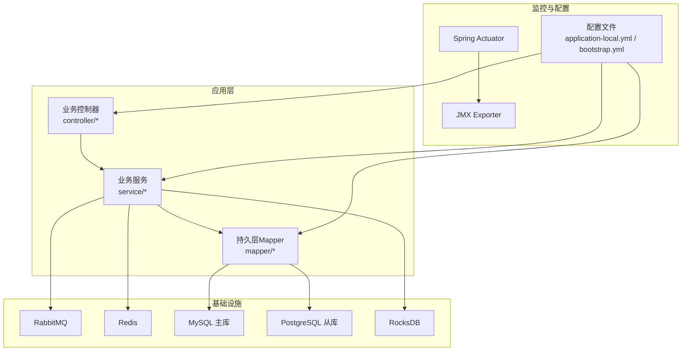
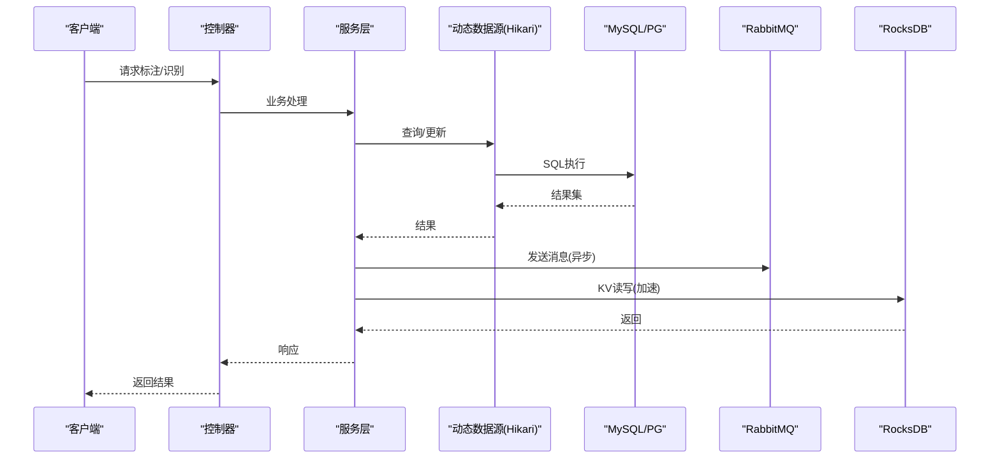
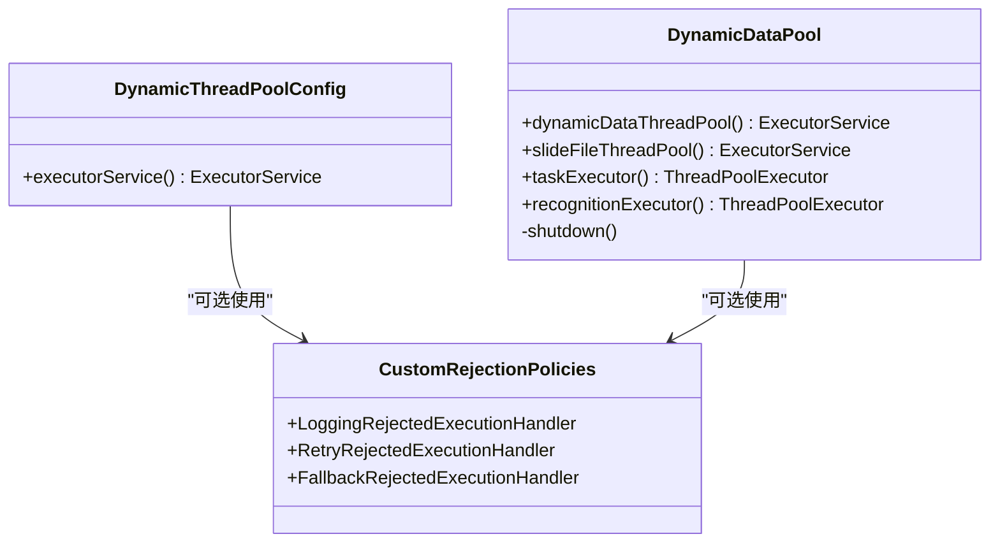
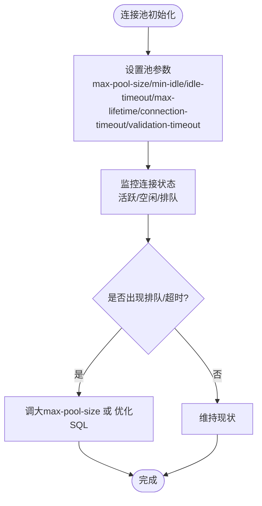
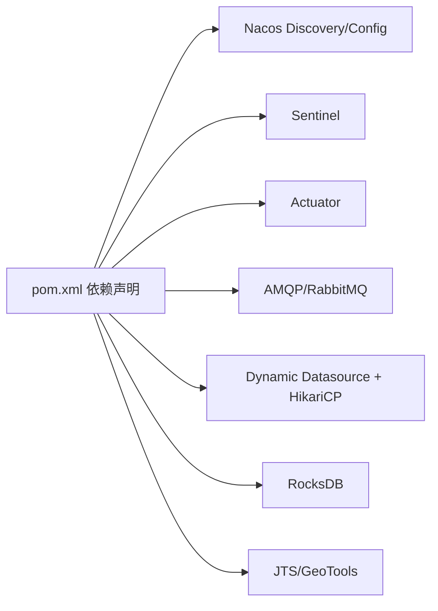

# 性能调优指南

<cite>
**本文引用的文件**
- [application-local.yml](file://src/main/resources/application-local.yml)
- [bootstrap.yml](file://src/main/resources/bootstrap.yml)
- [DynamicThreadPoolConfig.java](file://src/main/java/cn/staitech/fr/config/DynamicThreadPoolConfig.java)
- [DynamicDataPool.java](file://src/main/java/cn/staitech/fr/config/DynamicDataPool.java)
- [CustomRejectionPolicies.java](file://src/main/java/cn/staitech/fr/config/CustomRejectionPolicies.java)
- [RocksDBUtil.java](file://src/main/java/cn/staitech/fr/utils/RocksDBUtil.java)
- [jmx_config.yaml](file://docker/staitech/modules/fr/jmx_config.yaml)
- [logback.xml](file://src/main/resources/logback.xml)
- [pom.xml](file://pom.xml)
</cite>

## 目录
1. [简介](#简介)
2. [项目结构](#项目结构)
3. [核心组件](#核心组件)
4. [架构总览](#架构总览)
5. [详细组件分析](#详细组件分析)
6. [依赖分析](#依赖分析)
7. [性能考虑](#性能考虑)
8. [故障排查指南](#故障排查指南)
9. [结论](#结论)
10. [附录](#附录)

## 简介
本指南面向系统管理员与运维工程师，围绕 FR 模块的性能调优目标，提供系统性监控指标与优化策略，覆盖线程池配置、数据库连接池、缓存与存储、内存与GC、网络I/O与磁盘I/O等维度。文档结合代码实现与配置文件，给出可落地的调优步骤、瓶颈识别方法以及不同负载场景下的配置建议，并提供性能测试与基准测试的实施建议。

## 项目结构
FR 模块采用 Spring Boot + MyBatis 架构，通过动态数据源支持主从库分离，使用 HikariCP 作为连接池，集成 RabbitMQ 进行消息处理，使用 RocksDB 作为高性能KV存储，配合 Actuator/JMX 暴露JVM指标，便于Prometheus采集。

图示来源
- [application-local.yml:15-56](file://src/main/resources/application-local.yml#L15-L56)
- [bootstrap.yml:11-47](file://src/main/resources/bootstrap.yml#L11-L47)
- [jmx_config.yaml:18-46](file://docker/staitech/modules/fr/jmx_config.yaml#L18-L46)

章节来源
- [application-local.yml:15-56](file://src/main/resources/application-local.yml#L15-L56)
- [bootstrap.yml:11-47](file://src/main/resources/bootstrap.yml#L11-L47)

## 核心组件
- 动态线程池配置：提供多种线程池Bean，包括JSON任务线程池、动态数据线程池、切片文件线程池、识别任务线程池等，具备日志监控与拒绝策略。
- 动态数据源与连接池：基于 HikariCP 的主从库配置，支持连接池参数精细化控制。
- 缓存与消息：Redis 用于缓存，RabbitMQ 用于异步解耦。
- 存储：RocksDB 用于高吞吐KV读写。
- 监控：Actuator 暴露健康与环境信息，JMX Exporter 暴露JVM指标供Prometheus采集。

章节来源
- [DynamicThreadPoolConfig.java:13-51](file://src/main/java/cn/staitech/fr/config/DynamicThreadPoolConfig.java#L13-L51)
- [DynamicDataPool.java:29-64](file://src/main/java/cn/staitech/fr/config/DynamicDataPool.java#L29-L64)
- [application-local.yml:15-56](file://src/main/resources/application-local.yml#L15-L56)
- [RocksDBUtil.java:26-82](file://src/main/java/cn/staitech/fr/utils/RocksDBUtil.java#L26-L82)
- [jmx_config.yaml:18-46](file://docker/staitech/modules/fr/jmx_config.yaml#L18-L46)

## 架构总览
FR 模块通过多线程并行处理、连接池复用、消息异步化与本地KV存储，形成高吞吐、低延迟的标注与AI处理链路。Actuator/JMX 提供运行时可观测性，Prometheus/Grafana 实现可视化监控。

图示来源
- [application-local.yml:15-56](file://src/main/resources/application-local.yml#L15-L56)
- [DynamicThreadPoolConfig.java:13-51](file://src/main/java/cn/staitech/fr/config/DynamicThreadPoolConfig.java#L13-L51)
- [DynamicDataPool.java:29-64](file://src/main/java/cn/staitech/fr/config/DynamicDataPool.java#L29-L64)
- [RocksDBUtil.java:158-174](file://src/main/java/cn/staitech/fr/utils/RocksDBUtil.java#L158-L174)

## 详细组件分析

### 线程池配置与调优
- JSON任务线程池：固定核心/最大线程与有界队列，内置监控日志，便于观察队列长度与活跃线程数。
- 动态数据线程池：按CPU核数动态设定核心与最大线程，LinkedBlockingQueue容量可控，适合IO密集型任务。
- 切片文件线程池：同上，独立隔离，避免文件IO影响其他任务。
- 识别任务线程池：支持动态核心/最大倍数配置，自定义拒绝策略，快速失败避免OOM。
- 通用拒绝策略：提供日志记录、重试等待、降级执行等策略，可根据业务选择。

图示来源
- [DynamicThreadPoolConfig.java:13-51](file://src/main/java/cn/staitech/fr/config/DynamicThreadPoolConfig.java#L13-L51)
- [DynamicDataPool.java:29-64](file://src/main/java/cn/staitech/fr/config/DynamicDataPool.java#L29-L64)
- [CustomRejectionPolicies.java:23-101](file://src/main/java/cn/staitech/fr/config/CustomRejectionPolicies.java#L23-L101)

调优要点
- CPU密集型：降低最大线程数，增大队列容量，减少上下文切换。
- IO密集型：提高最大线程数至CPU×2~4，使用有界队列，快速失败保护。
- 混合场景：拆分专用线程池，避免相互干扰；启用拒绝策略，防止雪崩。
- 监控：结合日志与JMX指标，观察队列长度、活跃线程、任务完成数、拒绝次数。

章节来源
- [DynamicThreadPoolConfig.java:13-51](file://src/main/java/cn/staitech/fr/config/DynamicThreadPoolConfig.java#L13-L51)
- [DynamicDataPool.java:177-229](file://src/main/java/cn/staitech/fr/config/DynamicDataPool.java#L177-L229)
- [CustomRejectionPolicies.java:23-101](file://src/main/java/cn/staitech/fr/config/CustomRejectionPolicies.java#L23-L101)

### 数据库连接池优化
- HikariCP 主从库配置：分别设置最大池大小、最小空闲、空闲超时、最大生命周期、连接超时、验证超时等。
- 建议：根据并发请求峰值与慢SQL比例调整最大池大小；开启连接测试查询；合理设置空闲与生命周期，平衡资源占用与连接建立成本。

图示来源
- [application-local.yml:24-36](file://src/main/resources/application-local.yml#L24-L36)
- [application-local.yml:44-54](file://src/main/resources/application-local.yml#L44-L54)

章节来源
- [application-local.yml:24-36](file://src/main/resources/application-local.yml#L24-L36)
- [application-local.yml:44-54](file://src/main/resources/application-local.yml#L44-L54)

### 缓存策略调整
- Redis：用于热点数据缓存与会话/令牌存储。建议结合业务热点命中率与内存使用率，调整过期策略与淘汰策略。
- 建议：对高频读取的标注/结构数据做缓存；对写多读少的数据采用写后失效；监控key数量与内存占用，避免碎片化。

章节来源
- [application-local.yml:11-14](file://src/main/resources/application-local.yml#L11-L14)

### 内存使用优化
- JVM内存：关注堆/非堆使用、GC频率与时长、线程数与类加载数。
- 建议：结合JMX指标与GC日志，定位内存泄漏与GC压力；调整堆大小与GC策略；避免大对象常驻与频繁分配。

章节来源
- [jmx_config.yaml:48-94](file://docker/staitech/modules/fr/jmx_config.yaml#L48-L94)

### 磁盘I/O优化
- RocksDB：用于高吞吐KV读写，支持列族与批量写入，适合大规模标注数据的索引与缓存。
- 建议：合理设置列族数量与批量写入大小；定期compact；监控磁盘空间与IOPS；将数据目录置于高性能磁盘。

章节来源
- [RocksDBUtil.java:158-174](file://src/main/java/cn/staitech/fr/utils/RocksDBUtil.java#L158-L174)
- [RocksDBUtil.java:26-82](file://src/main/java/cn/staitech/fr/utils/RocksDBUtil.java#L26-L82)

### 网络I/O优化
- RabbitMQ：异步解耦，建议开启手动确认、限制重试次数与间隔，避免消息堆积。
- 建议：监控队列长度与消费者拉取速率；根据消息体大小与序列化方式优化传输开销。

章节来源
- [application-local.yml:57-75](file://src/main/resources/application-local.yml#L57-L75)

## 依赖分析
- 外部依赖：Spring Cloud Alibaba Nacos、Sentinel、Actuator、RabbitMQ、HikariCP、RocksDB、JTS等。
- 内部模块：controller/service/mapper 层清晰分离，线程池与数据源配置集中于配置类。

图示来源
- [pom.xml:25-121](file://pom.xml#L25-L121)

章节来源
- [pom.xml:25-121](file://pom.xml#L25-L121)

## 性能考虑
- 线程池
  - CPU密集：核心线程≈CPU核数，最大线程略增，队列容量适中。
  - IO密集：核心线程≈CPU核数，最大线程≈CPU×2~4，使用有界队列，拒绝策略快速失败。
  - 混合：拆分专用线程池，避免相互争抢；启用拒绝策略与告警。
- 数据库
  - 连接池：根据QPS与RT调优max-pool-size；开启validation-timeout与test-query；监控排队与超时。
  - SQL：优化慢查询、索引缺失、事务过大；分页与批处理。
- 缓存
  - 热点数据缓存，合理设置TTL；写后失效或LRU淘汰；监控命中率与内存。
- 存储
  - RocksDB：批量写入、列族管理、compact策略；磁盘性能优先。
- 监控
  - JMX指标：线程、内存、GC、操作系统；Prometheus抓取；Grafana看板。
  - 日志：INFO/DEBUG级别按需开启，避免生产环境过度日志。

## 故障排查指南
- 线程池问题
  - 现象：任务堆积、拒绝、线程数飙升。
  - 排查：查看线程池监控日志与拒绝策略触发次数；评估核心/最大线程与队列容量。
- 数据库问题
  - 现象：连接超时、慢查询、连接池耗尽。
  - 排查：检查连接池参数与SQL执行计划；监控排队与超时指标。
- 缓存问题
  - 现象：缓存穿透/击穿、内存暴涨。
  - 排查：校验TTL与淘汰策略；监控key数量与内存。
- 存储问题
  - 现象：磁盘写入慢、IOPS不足。
  - 排查：检查批量写入大小与列族数量；监控磁盘空间与IO。
- 监控问题
  - 现象：指标缺失、告警不准确。
  - 排查：确认JMX Exporter配置与白名单规则；检查Prometheus抓取端口与标签。

章节来源
- [DynamicThreadPoolConfig.java:13-51](file://src/main/java/cn/staitech/fr/config/DynamicThreadPoolConfig.java#L13-L51)
- [DynamicDataPool.java:177-229](file://src/main/java/cn/staitech/fr/config/DynamicDataPool.java#L177-L229)
- [application-local.yml:24-36](file://src/main/resources/application-local.yml#L24-L36)
- [jmx_config.yaml:18-46](file://docker/staitech/modules/fr/jmx_config.yaml#L18-L46)

## 结论
通过合理的线程池拆分与参数调优、连接池与SQL优化、缓存与存储策略、以及完善的监控体系，FR 模块可在高并发与大数据量场景下保持稳定与高性能。建议在不同负载阶段持续观测关键指标，动态调整参数，形成“观测—调优—验证”的闭环。

## 附录

### 不同负载场景下的配置建议
- 低负载（并发<100）
  - 线程池：核心线程≈CPU/4，最大线程≈CPU/2，队列容量中等。
  - 连接池：max-pool-size≈5~10，idle-timeout适当增大。
  - 缓存：短TTL，LRU淘汰。
- 中负载（并发100~500）
  - 线程池：核心线程≈CPU/2，最大线程≈CPU×2，队列容量适度扩大。
  - 连接池：max-pool-size≈15~25，开启validation-timeout。
  - 缓存：热点数据缓存，TTL适中。
- 高负载（并发>500）
  - 线程池：核心线程≈CPU，最大线程≈CPU×4，队列容量有界，拒绝策略快速失败。
  - 连接池：max-pool-size≈30~50，缩短max-lifetime，启用test-query。
  - 存储：RocksDB批量写入，列族分片，定期compact。

### 性能测试与基准测试实施指南
- 压力测试
  - 场景：并发用户数逐步提升，持续时间≥15分钟；覆盖标注、识别、导出等关键路径。
  - 指标：吞吐、响应时间、错误率、线程池队列长度、连接池排队数、GC时长。
- 基准测试
  - 场景：固定并发下，对比不同参数组合（线程池大小、队列容量、连接池大小）的RT与吞吐。
  - 方法：使用JMeter/Locust等工具构造稳定流量；采集JMX与应用日志。
- 观测与回归
  - 指标：Prometheus抓取JMX指标；Grafana仪表盘；告警阈值基线化。
  - 回归：每次变更后至少2小时稳定性观测，记录关键指标变化。