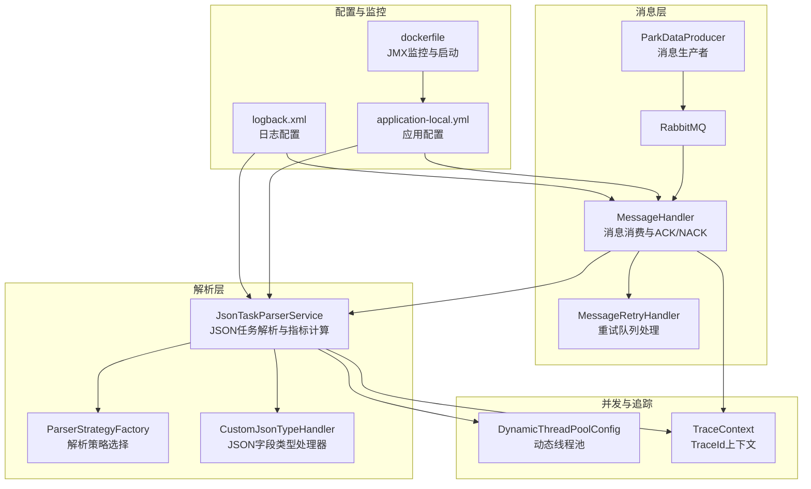
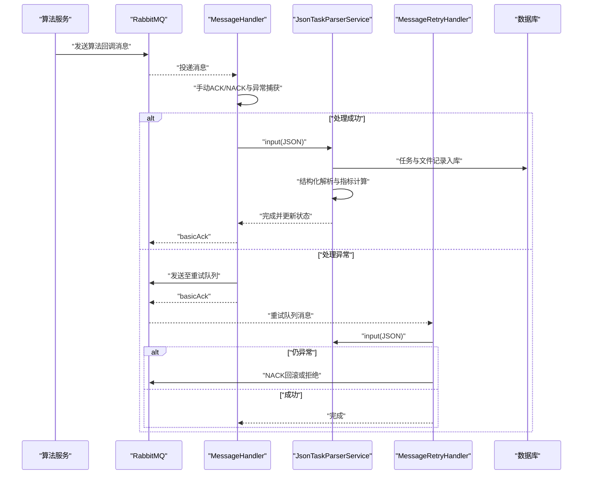
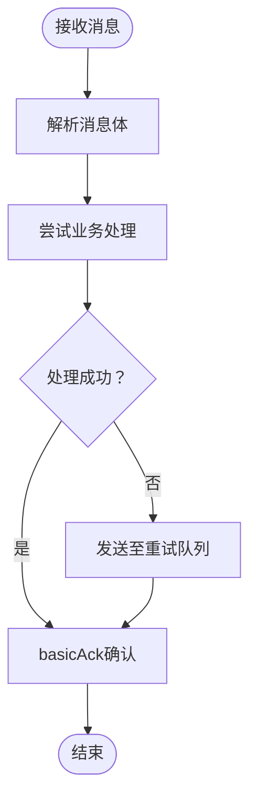
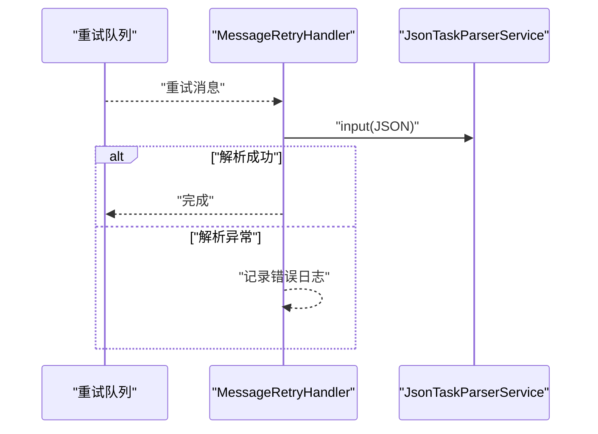
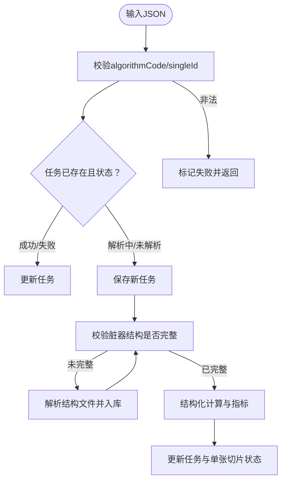
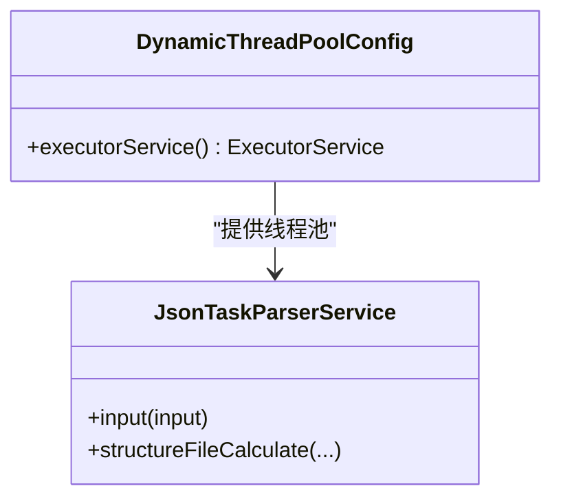
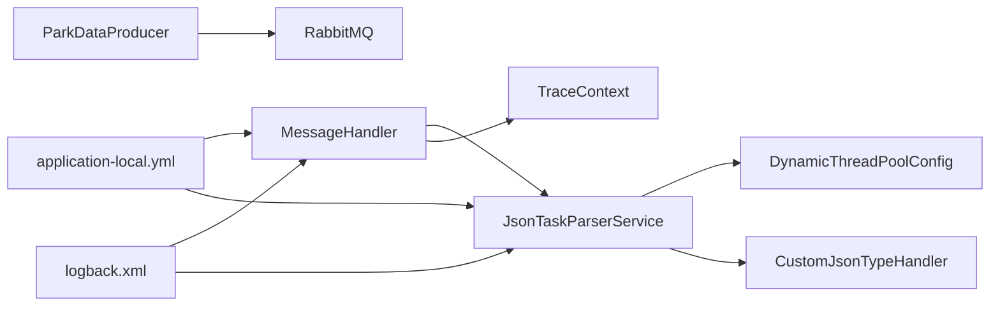

# 故障排除

<cite>
**本文档引用的文件**
- [MessageHandler.java](file://src/main/java/cn/staitech/fr/config/MessageHandler.java)
- [MessageRetryHandler.java](file://src/main/java/cn/staitech/fr/config/MessageRetryHandler.java)
- [DynamicThreadPoolConfig.java](file://src/main/java/cn/staitech/fr/config/DynamicThreadPoolConfig.java)
- [JsonTaskParserService.java](file://src/main/java/cn/staitech/fr/service/strategy/json/JsonTaskParserService.java)
- [JsonTaskParserException.java](file://src/main/java/cn/staitech/fr/service/strategy/json/JsonTaskParserException.java)
- [CustomJsonTypeHandler.java](file://src/main/java/cn/staitech/fr/mapper/handler/CustomJsonTypeHandler.java)
- [TraceContext.java](file://src/main/java/cn/staitech/fr/config/TraceContext.java)
- [ParkDataProducer.java](file://src/main/java/cn/staitech/fr/config/ParkDataProducer.java)
- [application-local.yml](file://src/main/resources/application-local.yml)
- [logback.xml](file://src/main/resources/logback.xml)
- [dockerfile](file://docker/staitech/modules/fr/dockerfile)
</cite>

## 目录
1. [简介](#简介)
2. [项目结构](#项目结构)
3. [核心组件](#核心组件)
4. [架构总览](#架构总览)
5. [详细组件分析](#详细组件分析)
6. [依赖关系分析](#依赖关系分析)
7. [性能考量](#性能考量)
8. [故障排除指南](#故障排除指南)
9. [结论](#结论)
10. [附录](#附录)

## 简介
本指南面向运维与技术支持人员，聚焦FR模块在消息队列、JSON解析、线程池与数据库连接方面的常见问题与系统性排查流程。内容涵盖：
- 常见问题与FAQ
- 错误码对照与定位
- 日志分析与系统监控
- 消息重试机制与延迟消息处理
- JSON解析异常处理策略
- 性能瓶颈识别与优化建议
- 数据库连接、消息队列与外部服务集成故障的处置方案

## 项目结构
FR模块围绕“消息消费-任务解析-指标计算-结果落库”的主链路构建，关键路径如下：
- 消息层：RabbitMQ消费者负责接收算法回调消息，失败时进入重试队列或NACK回滚
- 解析层：JSON任务解析服务负责校验、入库、结构化与指标计算
- 并发层：动态线程池监控与TTL线程上下文透传
- 配置层：应用配置、日志配置、容器与JMX监控

图表来源
- [MessageHandler.java:43-86](file://src/main/java/cn/staitech/fr/config/MessageHandler.java#L43-L86)
- [MessageRetryHandler.java:25-42](file://src/main/java/cn/staitech/fr/config/MessageRetryHandler.java#L25-L42)
- [JsonTaskParserService.java:174-263](file://src/main/java/cn/staitech/fr/service/strategy/json/JsonTaskParserService.java#L174-L263)
- [DynamicThreadPoolConfig.java:14-51](file://src/main/java/cn/staitech/fr/config/DynamicThreadPoolConfig.java#L14-L51)
- [TraceContext.java:47-80](file://src/main/java/cn/staitech/fr/config/TraceContext.java#L47-L80)
- [application-local.yml:57-74](file://src/main/resources/application-local.yml#L57-L74)
- [logback.xml:98-101](file://src/main/resources/logback.xml#L98-L101)
- [dockerfile:21-22](file://docker/staitech/modules/fr/dockerfile#L21-L22)

章节来源
- [application-local.yml:5-11](file://src/main/resources/application-local.yml#L5-L11)
- [logback.xml:1-102](file://src/main/resources/logback.xml#L1-L102)

## 核心组件
- 消息消费者与重试：负责消息ACK/NACK、异常转移至重试队列、延迟消息检查
- JSON任务解析：负责JSON校验、任务入库、结构化文件解析、指标计算与结果落库
- 动态线程池：可观察队列长度、活跃线程数、完成任务计数，便于性能诊断
- JSON类型处理器：统一JSON字段的序列化/反序列化异常处理
- 追踪上下文：跨线程传递TraceId，结合日志定位请求链路
- 应用与日志配置：RabbitMQ、数据源、线程池、日志级别与滚动策略
- 生产者：消息发送与延迟消息投递

章节来源
- [MessageHandler.java:43-86](file://src/main/java/cn/staitech/fr/config/MessageHandler.java#L43-L86)
- [MessageRetryHandler.java:25-42](file://src/main/java/cn/staitech/fr/config/MessageRetryHandler.java#L25-L42)
- [JsonTaskParserService.java:174-263](file://src/main/java/cn/staitech/fr/service/strategy/json/JsonTaskParserService.java#L174-L263)
- [DynamicThreadPoolConfig.java:14-51](file://src/main/java/cn/staitech/fr/config/DynamicThreadPoolConfig.java#L14-L51)
- [CustomJsonTypeHandler.java:37-53](file://src/main/java/cn/staitech/fr/mapper/handler/CustomJsonTypeHandler.java#L37-L53)
- [TraceContext.java:47-80](file://src/main/java/cn/staitech/fr/config/TraceContext.java#L47-L80)
- [application-local.yml:57-74](file://src/main/resources/application-local.yml#L57-L74)
- [logback.xml:98-101](file://src/main/resources/logback.xml#L98-L101)

## 架构总览
消息从算法服务进入RabbitMQ，消费者解析后交由JSON任务解析服务处理。解析过程中可能触发重试队列或延迟检查队列，最终将结果写入数据库。全链路通过TraceId串联，日志按模块与级别输出，容器内置JMX监控。

图表来源
- [MessageHandler.java:43-86](file://src/main/java/cn/staitech/fr/config/MessageHandler.java#L43-L86)
- [MessageRetryHandler.java:25-42](file://src/main/java/cn/staitech/fr/config/MessageRetryHandler.java#L25-L42)
- [JsonTaskParserService.java:174-263](file://src/main/java/cn/staitech/fr/service/strategy/json/JsonTaskParserService.java#L174-L263)

## 详细组件分析

### 组件A：消息消费与重试（MessageHandler）
- 关键行为
  - 监听算法消息队列，手动确认消息
  - 异常时将消息发送至重试队列并确认原消息
  - 若重试发送失败，则NACK原消息并要求重新入队
  - 提供延迟消息检查队列处理，用于定时轮询任务状态
- 重试策略
  - 通过RabbitMQ消费者重试配置与业务侧重试队列双重保障
  - 重试队列由独立处理器消费，降低主队列阻塞风险
- 延迟消息
  - 使用延迟交换机与路由键，设置x-delay头实现延迟投递
- 日志与追踪
  - 每步均记录TraceId，便于跨线程与跨服务串联

图表来源
- [MessageHandler.java:43-86](file://src/main/java/cn/staitech/fr/config/MessageHandler.java#L43-L86)

章节来源
- [MessageHandler.java:43-86](file://src/main/java/cn/staitech/fr/config/MessageHandler.java#L43-L86)
- [application-local.yml:65-74](file://src/main/resources/application-local.yml#L65-L74)

### 组件B：重试队列处理（MessageRetryHandler）
- 关键行为
  - 接收重试队列消息，转交JSON任务解析服务
  - 异常时仅记录错误日志，避免二次重试风暴
- 适用场景
  - 解析服务内部异常、文件缺失、策略不可用等

图表来源
- [MessageRetryHandler.java:25-42](file://src/main/java/cn/staitech/fr/config/MessageRetryHandler.java#L25-L42)
- [JsonTaskParserService.java:174-263](file://src/main/java/cn/staitech/fr/service/strategy/json/JsonTaskParserService.java#L174-L263)

章节来源
- [MessageRetryHandler.java:25-42](file://src/main/java/cn/staitech/fr/config/MessageRetryHandler.java#L25-L42)

### 组件C：JSON任务解析（JsonTaskParserService）
- 关键行为
  - 输入JSON解析任务元数据与文件列表
  - 校验algorithmCode与singleId，避免重复/无效任务
  - 任务状态机：未解析→解析中→解析成功/失败
  - 结构化解析与指标计算，失败时回滚状态
  - 特殊结构（轮廓）与常规结构分流处理
- 异常处理
  - 捕获未知异常并抛出专用异常类型，便于上层识别
  - JSON字段类型处理器统一处理序列化/反序列化异常
- 性能监控
  - 通过TTL线程池执行，记录线程池队列长度与活跃度
  - 记录各阶段耗时，便于定位慢点

图表来源
- [JsonTaskParserService.java:174-263](file://src/main/java/cn/staitech/fr/service/strategy/json/JsonTaskParserService.java#L174-L263)
- [JsonTaskParserService.java:265-286](file://src/main/java/cn/staitech/fr/service/strategy/json/JsonTaskParserService.java#L265-L286)
- [JsonTaskParserService.java:319-452](file://src/main/java/cn/staitech/fr/service/strategy/json/JsonTaskParserService.java#L319-L452)

章节来源
- [JsonTaskParserService.java:174-263](file://src/main/java/cn/staitech/fr/service/strategy/json/JsonTaskParserService.java#L174-L263)
- [JsonTaskParserService.java:265-286](file://src/main/java/cn/staitech/fr/service/strategy/json/JsonTaskParserService.java#L265-L286)
- [JsonTaskParserService.java:319-452](file://src/main/java/cn/staitech/fr/service/strategy/json/JsonTaskParserService.java#L319-L452)
- [JsonTaskParserException.java:9-14](file://src/main/java/cn/staitech/fr/service/strategy/json/JsonTaskParserException.java#L9-L14)

### 组件D：动态线程池（DynamicThreadPoolConfig）
- 关键行为
  - 自定义线程工厂与拒绝策略，记录提交/开始/完成日志
  - 暴露队列长度、线程数、活跃数，便于运行时观测
- 适用场景
  - 结构化解析与指标计算的并发控制与限流

图表来源
- [DynamicThreadPoolConfig.java:14-51](file://src/main/java/cn/staitech/fr/config/DynamicThreadPoolConfig.java#L14-L51)
- [JsonTaskParserService.java:94-107](file://src/main/java/cn/staitech/fr/service/strategy/json/JsonTaskParserService.java#L94-L107)

章节来源
- [DynamicThreadPoolConfig.java:14-51](file://src/main/java/cn/staitech/fr/config/DynamicThreadPoolConfig.java#L14-L51)

### 组件E：JSON类型处理器（CustomJsonTypeHandler）
- 关键行为
  - 统一JSON字段的序列化/反序列化
  - 异常时抛出运行时异常，便于上层捕获与记录
- 适用场景
  - MyBatis JSON字段映射，避免解析异常导致的静默失败

章节来源
- [CustomJsonTypeHandler.java:37-53](file://src/main/java/cn/staitech/fr/mapper/handler/CustomJsonTypeHandler.java#L37-L53)

### 组件F：追踪上下文（TraceContext）
- 关键行为
  - 生成并设置TraceId，跨线程透传
  - 在线程执行前后自动设置/清理MDC，配合日志输出
- 适用场景
  - 定位消息消费、任务解析、指标计算的完整链路

章节来源
- [TraceContext.java:47-80](file://src/main/java/cn/staitech/fr/config/TraceContext.java#L47-L80)
- [logback.xml](file://src/main/resources/logback.xml#L6)

### 组件G：消息生产者（ParkDataProducer）
- 关键行为
  - 发送普通消息与延迟消息（延迟交换机）
- 适用场景
  - 任务重试、延迟检查等异步调度

章节来源
- [ParkDataProducer.java:27-44](file://src/main/java/cn/staitech/fr/config/ParkDataProducer.java#L27-L44)

## 依赖关系分析
- 消息层依赖RabbitMQ与Spring AMQP
- 解析层依赖MyBatis Plus、FastJSON、Apache Commons等
- 并发层依赖TTL线程池与TransmittableThreadLocal
- 配置层依赖Spring Boot配置与日志框架

图表来源
- [MessageHandler.java:43-86](file://src/main/java/cn/staitech/fr/config/MessageHandler.java#L43-L86)
- [JsonTaskParserService.java:94-107](file://src/main/java/cn/staitech/fr/service/strategy/json/JsonTaskParserService.java#L94-L107)
- [CustomJsonTypeHandler.java:37-53](file://src/main/java/cn/staitech/fr/mapper/handler/CustomJsonTypeHandler.java#L37-L53)
- [TraceContext.java:47-80](file://src/main/java/cn/staitech/fr/config/TraceContext.java#L47-L80)
- [application-local.yml:57-74](file://src/main/resources/application-local.yml#L57-L74)
- [logback.xml:98-101](file://src/main/resources/logback.xml#L98-L101)

## 性能考量
- 线程池监控
  - 通过日志观察队列长度与活跃线程数，判断是否出现积压
  - 核对核心/最大线程数与阻塞队列容量是否匹配业务峰值
- 解析耗时
  - 关注结构化解析与指标计算阶段的日志耗时统计
  - 对超大文件或复杂结构优先级处理
- 数据库连接
  - Hikari连接池参数（最大池大小、空闲超时、最大生命周期）影响吞吐
  - 从库与主库分离，避免解析写入对读取造成压力
- 消息消费
  - 手动ACK/NACK策略减少重复消费
  - 合理设置消费者重试次数与间隔，避免雪崩

章节来源
- [DynamicThreadPoolConfig.java:29-45](file://src/main/java/cn/staitech/fr/config/DynamicThreadPoolConfig.java#L29-L45)
- [JsonTaskParserService.java:275-281](file://src/main/java/cn/staitech/fr/service/strategy/json/JsonTaskParserService.java#L275-L281)
- [application-local.yml:25-54](file://src/main/resources/application-local.yml#L25-L54)

## 故障排除指南

### 常见问题与FAQ
- 问：消息消费后未确认，导致重复处理？
  - 答：检查消费者是否正确ACK；若异常应发送重试队列并确认原消息
- 问：JSON任务解析失败但无明确错误？
  - 答：查看专用异常类型与日志；关注algorithmCode与singleId合法性
- 问：线程池积压严重，响应变慢？
  - 答：观察队列长度与活跃线程数；评估核心/最大线程数与任务耗时
- 问：数据库连接频繁超时或抖动？
  - 答：核对连接池参数与慢SQL；确认主从库负载均衡
- 问：延迟消息未按时触发？
  - 答：检查延迟交换机、路由键与x-delay头设置

章节来源
- [MessageHandler.java:54-71](file://src/main/java/cn/staitech/fr/config/MessageHandler.java#L54-L71)
- [JsonTaskParserService.java:184-197](file://src/main/java/cn/staitech/fr/service/strategy/json/JsonTaskParserService.java#L184-L197)
- [DynamicThreadPoolConfig.java:29-45](file://src/main/java/cn/staitech/fr/config/DynamicThreadPoolConfig.java#L29-L45)
- [application-local.yml:25-54](file://src/main/resources/application-local.yml#L25-L54)
- [ParkDataProducer.java:38-44](file://src/main/java/cn/staitech/fr/config/ParkDataProducer.java#L38-L44)

### 错误码对照与定位
- 任务状态码
  - 未解析：NO_PARSE
  - 解析中：PARSE_ING
  - 解析成功：PARSE_SUCCESS
  - 解析失败：PARSE_FAIL
- 预测状态码
  - 未预测：0
  - 预测成功：1
  - 预测失败：2
  - 预测中：3
- 结构JSON状态码
  - 未解析：0
  - 解析中：1
  - 解析成功：2
- AI状态码
  - 成功：0
  - 失败：500
- 定位要点
  - 通过日志中的任务ID与单切片ID关联状态变更
  - 使用TraceId串联消息、解析、指标计算全流程

章节来源
- [JsonTaskParserService.java:199-222](file://src/main/java/cn/staitech/fr/service/strategy/json/JsonTaskParserService.java#L199-L222)
- [JsonTaskParserService.java:265-286](file://src/main/java/cn/staitech/fr/service/strategy/json/JsonTaskParserService.java#L265-L286)
- [JsonTaskParserService.java:319-452](file://src/main/java/cn/staitech/fr/service/strategy/json/JsonTaskParserService.java#L319-L452)

### 日志分析与系统监控
- 日志输出
  - 控制台与按启动阶段分类的滚动文件输出
  - 日志模式包含TraceId，便于跨线程/跨服务串联
- 监控
  - 容器内置JMX代理，暴露JVM指标
  - 建议结合Prometheus/Grafana采集线程池、消息积压、数据库连接池等指标

章节来源
- [logback.xml](file://src/main/resources/logback.xml#L6)
- [logback.xml:98-101](file://src/main/resources/logback.xml#L98-L101)
- [dockerfile:17-22](file://docker/staitech/modules/fr/dockerfile#L17-L22)

### 消息重试机制与延迟消息
- 重试机制
  - 消费者异常→发送重试队列→独立处理器消费→仍异常→NACK回滚
- 延迟消息
  - 使用延迟交换机与x-delay头；检查路由键与队列绑定
- 建议
  - 限制重试次数与退避策略，避免无限重试
  - 对幂等性设计：任务去重、状态机保护

章节来源
- [MessageHandler.java:57-71](file://src/main/java/cn/staitech/fr/config/MessageHandler.java#L57-L71)
- [MessageRetryHandler.java:25-42](file://src/main/java/cn/staitech/fr/config/MessageRetryHandler.java#L25-L42)
- [ParkDataProducer.java:38-44](file://src/main/java/cn/staitech/fr/config/ParkDataProducer.java#L38-L44)

### JSON解析异常处理
- FastJSON解析
  - 校验JSON结构与关键字段；非法时直接返回并标记失败
- MyBatis JSON字段
  - 类型处理器统一捕获序列化/反序列化异常，避免静默失败
- 建议
  - 对外部输入进行白名单校验与长度限制
  - 记录原始JSON片段与异常堆栈，便于复现

章节来源
- [JsonTaskParserService.java:174-263](file://src/main/java/cn/staitech/fr/service/strategy/json/JsonTaskParserService.java#L174-L263)
- [CustomJsonTypeHandler.java:37-53](file://src/main/java/cn/staitech/fr/mapper/handler/CustomJsonTypeHandler.java#L37-L53)

### 性能瓶颈识别与优化
- 识别步骤
  - 查看线程池日志：队列长度、活跃线程数、完成任务计数
  - 查看解析耗时：结构化解析与指标计算阶段
  - 查看数据库连接池：活跃连接数、等待时间、超时次数
- 优化建议
  - 调整线程池参数与阻塞队列容量
  - 对大文件分批处理或并行化
  - 主从库分离写入，优化慢查询
  - 合理设置消息重试与延迟策略

章节来源
- [DynamicThreadPoolConfig.java:29-45](file://src/main/java/cn/staitech/fr/config/DynamicThreadPoolConfig.java#L29-L45)
- [JsonTaskParserService.java:275-281](file://src/main/java/cn/staitech/fr/service/strategy/json/JsonTaskParserService.java#L275-L281)
- [application-local.yml:25-54](file://src/main/resources/application-local.yml#L25-L54)

### 数据库连接问题
- 现象
  - 连接超时、连接池耗尽、事务失败
- 排查
  - 检查Hikari配置与健康状态
  - 关注慢SQL与锁等待
  - 核对主从库切换与只读路由
- 处置
  - 临时扩容连接池或优化SQL
  - 分离读写流量，启用只读副本

章节来源
- [application-local.yml:15-56](file://src/main/resources/application-local.yml#L15-L56)

### 消息队列异常
- 现象
  - 消息堆积、重复消费、NACK失败
- 排查
  - 检查消费者确认模式与重试配置
  - 核对队列、交换机与路由键绑定
- 处置
  - 调整消费者并发与重试策略
  - 清理死信队列或异常队列

章节来源
- [application-local.yml:65-74](file://src/main/resources/application-local.yml#L65-L74)
- [MessageHandler.java:54-71](file://src/main/java/cn/staitech/fr/config/MessageHandler.java#L54-L71)

### 外部服务集成故障
- 现象
  - 算法回调未达、延迟消息未触发、服务超时
- 排查
  - 核对算法服务消息生产端与路由键
  - 检查延迟交换机与x-delay头
- 处置
  - 修复路由键与交换机配置
  - 重发缺失消息或补偿任务

章节来源
- [ParkDataProducer.java:27-44](file://src/main/java/cn/staitech/fr/config/ParkDataProducer.java#L27-L44)

## 结论
本指南提供了从消息到解析、从并发到数据库的全链路故障排除方法。建议在日常运维中：
- 建立基于TraceId的日志检索与告警
- 监控线程池与消息队列积压
- 优化数据库连接池与慢SQL
- 规范消息重试与延迟策略
- 对外部服务变更进行回归验证

## 附录
- 关键配置项
  - RabbitMQ：主机、端口、虚拟主机、手动确认、重试次数
  - 数据源：主从库、连接池参数、连接测试语句
  - 日志：模块级别、输出位置、TraceId模式
- 建议工具
  - JMX监控：采集JVM与线程池指标
  - 日志分析：按TraceId聚合消息、解析、指标计算阶段
  - 压力测试：模拟高并发消息与大文件解析