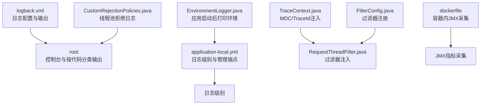
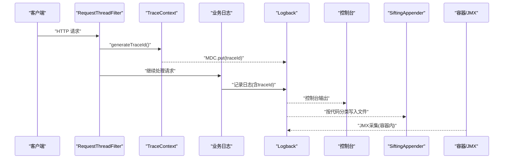
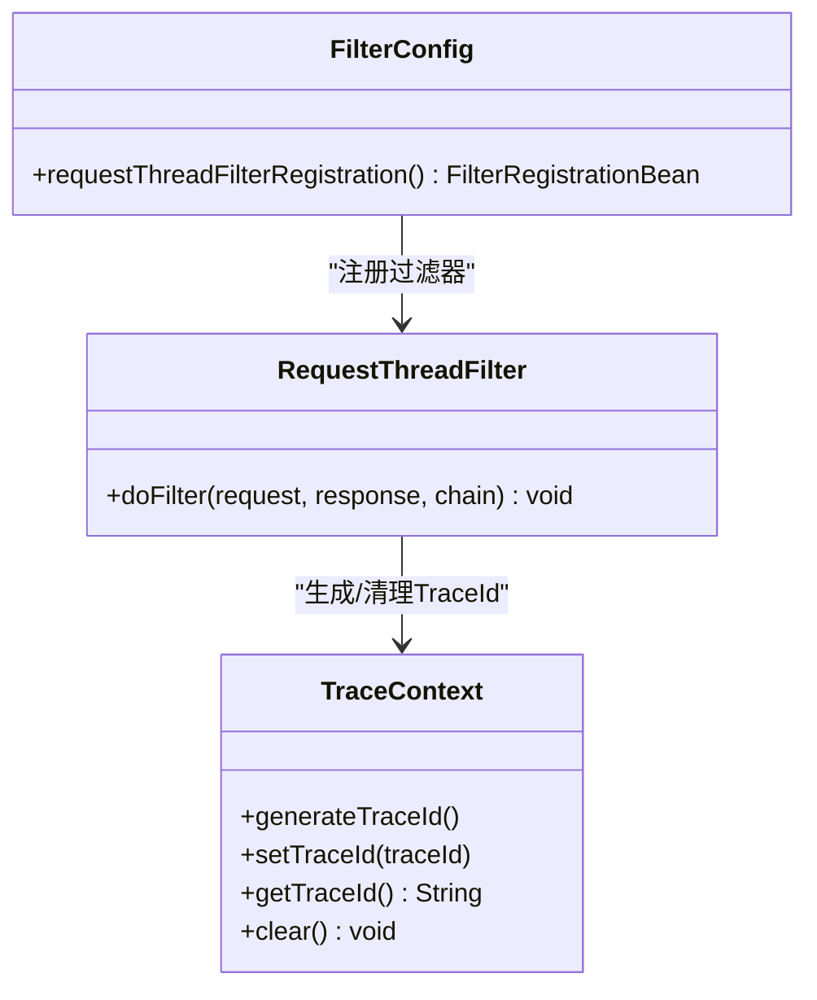
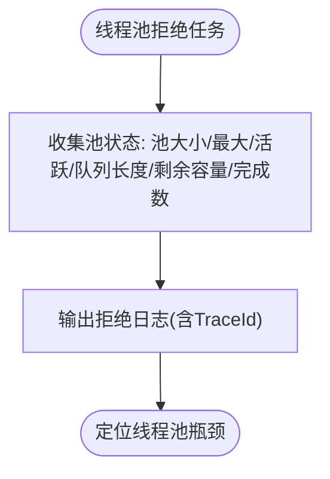
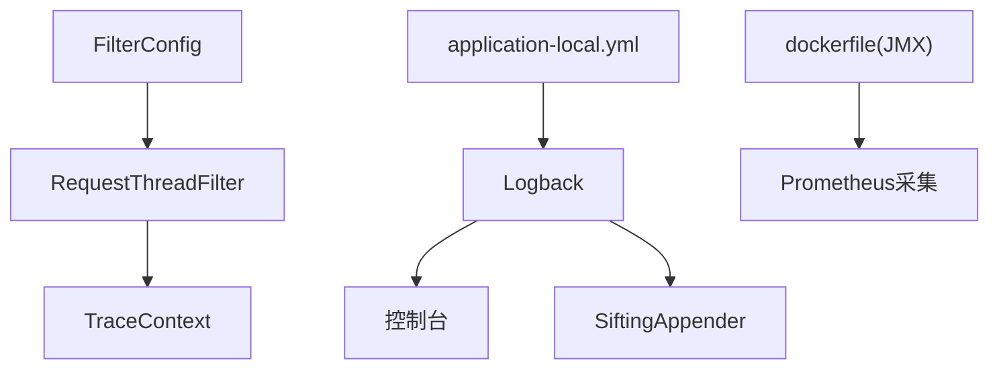

# 日志分析指南

<cite>
**本文引用的文件**
- [logback.xml](file://src/main/resources/logback.xml)
- [application-local.yml](file://src/main/resources/application-local.yml)
- [TraceContext.java](file://src/main/java/cn/staitech/fr/config/TraceContext.java)
- [RequestThreadFilter.java](file://src/main/java/cn/staitech/fr/config/RequestThreadFilter.java)
- [FilterConfig.java](file://src/main/java/cn/staitech/fr/config/FilterConfig.java)
- [EnvironmentLogger.java](file://src/main/java/cn/staitech/fr/config/EnvironmentLogger.java)
- [LogFieldConvertConstants.java](file://src/main/java/cn/staitech/fr/constant/LogFieldConvertConstants.java)
- [dockerfile](file://docker/staitech/modules/fr/dockerfile)
- [CustomRejectionPolicies.java](file://src/main/java/cn/staitech/fr/config/CustomRejectionPolicies.java)
</cite>

## 目录
1. [简介](#简介)
2. [项目结构](#项目结构)
3. [核心组件](#核心组件)
4. [架构总览](#架构总览)
5. [详细组件分析](#详细组件分析)
6. [依赖分析](#依赖分析)
7. [性能考虑](#性能考虑)
8. [故障排查指南](#故障排查指南)
9. [结论](#结论)
10. [附录](#附录)

## 简介
本指南面向运维与开发人员，围绕 FR 模块的日志体系，系统阐述日志配置、日志级别与日志格式；给出系统运行日志、业务操作日志、错误日志与调试日志的分析方法；总结日志收集、存储与查询的最佳实践；解释关键日志字段的含义与分析技巧；提供常见日志异常模式的识别与处理建议，并给出日志监控与告警的配置思路，帮助快速定位问题根因并进行故障诊断。

## 项目结构
FR 模块的日志相关配置与实现主要分布在以下位置：
- 日志框架与输出：logback.xml
- 应用配置与日志级别：application-local.yml
- 链路追踪上下文：TraceContext.java
- 请求过滤器与线程上下文注入：RequestThreadFilter.java、FilterConfig.java
- 环境属性打印：EnvironmentLogger.java
- 业务字段常量：LogFieldConvertConstants.java
- 容器与JMX采集：dockerfile
- 线程池拒绝策略日志：CustomRejectionPolicies.java

图表来源
- [logback.xml:1-102](file://src/main/resources/logback.xml#L1-L102)
- [application-local.yml:90-106](file://src/main/resources/application-local.yml#L90-L106)
- [TraceContext.java:1-82](file://src/main/java/cn/staitech/fr/config/TraceContext.java#L1-L82)
- [RequestThreadFilter.java:1-24](file://src/main/java/cn/staitech/fr/config/RequestThreadFilter.java#L1-L24)
- [FilterConfig.java:1-22](file://src/main/java/cn/staitech/fr/config/FilterConfig.java#L1-L22)
- [EnvironmentLogger.java:1-26](file://src/main/java/cn/staitech/fr/config/EnvironmentLogger.java#L1-L26)
- [dockerfile:1-22](file://docker/staitech/modules/fr/dockerfile#L1-L22)
- [CustomRejectionPolicies.java:28](file://src/main/java/cn/staitech/fr/config/CustomRejectionPolicies.java#L28)

章节来源
- [logback.xml:1-102](file://src/main/resources/logback.xml#L1-L102)
- [application-local.yml:90-106](file://src/main/resources/application-local.yml#L90-L106)

## 核心组件
- 日志配置与输出
  - 日志路径与格式：统一通过 logback.xml 配置日志路径与输出格式，包含时间戳、线程名、TraceId、日志级别、类名与行号、方法签名、消息正文等。
  - 输出目标：控制台输出与按“代码”分类的滚动文件输出（通过 SiftingAppender 按 logFileName 分流）。
  - 日志级别：根级别为 info，Spring 与业务包默认 info，可通过 application-local.yml 覆盖。
- 链路追踪上下文
  - TraceContext 提供基于 TransmittableThreadLocal 的 TraceId 生成与传播，结合 MDC 注入，使每个请求具备可追踪标识。
  - RequestThreadFilter 在请求进入时生成 TraceId 并注入 MDC，在请求结束时清理，避免线程复用导致的数据残留。
- 环境与配置
  - EnvironmentLogger 在应用启动完成后打印所有 PropertySource，便于核对配置来源与覆盖顺序。
  - application-local.yml 中定义了 logging.level、management 端点暴露、RabbitMQ、MyBatis 等与日志相关的开关项。

章节来源
- [logback.xml:6](file://src/main/resources/logback.xml#L6)
- [logback.xml:98-101](file://src/main/resources/logback.xml#L98-L101)
- [TraceContext.java:47-80](file://src/main/java/cn/staitech/fr/config/TraceContext.java#L47-L80)
- [RequestThreadFilter.java:14-22](file://src/main/java/cn/staitech/fr/config/RequestThreadFilter.java#L14-L22)
- [FilterConfig.java:14-21](file://src/main/java/cn/staitech/fr/config/FilterConfig.java#L14-L21)
- [EnvironmentLogger.java:17-24](file://src/main/java/cn/staitech/fr/config/EnvironmentLogger.java#L17-L24)
- [application-local.yml:90-106](file://src/main/resources/application-local.yml#L90-L106)

## 架构总览
下图展示日志从请求进入、TraceId 注入、日志输出到容器监控的整体流程。

图表来源
- [RequestThreadFilter.java:14-22](file://src/main/java/cn/staitech/fr/config/RequestThreadFilter.java#L14-L22)
- [TraceContext.java:47-64](file://src/main/java/cn/staitech/fr/config/TraceContext.java#L47-L64)
- [logback.xml:98-101](file://src/main/resources/logback.xml#L98-L101)
- [dockerfile:21-22](file://docker/staitech/modules/fr/dockerfile#L21-L22)

## 详细组件分析

### 日志配置与格式
- 日志路径与格式
  - 日志路径由 log.path 属性统一管理；输出格式包含时间、线程、TraceId、级别、类名与行号、方法签名、消息正文。
- 输出目标
  - 控制台输出：便于本地开发与调试。
  - 按代码分类输出：通过 SiftingAppender 按 logFileName 分流，支持按启动阶段或模块区分日志文件。
- 日志级别
  - 根级别 info，业务包与 Spring 默认 info；可通过 application-local.yml 的 logging.level 覆盖具体包级别。
- 关键字段说明
  - 时间戳：用于定位事件发生时刻。
  - 线程名：辅助判断并发场景下的请求归属。
  - TraceId：跨线程、跨组件的请求追踪标识，是日志关联与回溯的关键。
  - 方法签名与行号：快速定位日志产生位置。
  - 消息正文：业务语义与错误描述。

章节来源
- [logback.xml:4-6](file://src/main/resources/logback.xml#L4-L6)
- [logback.xml:98-101](file://src/main/resources/logback.xml#L98-L101)
- [application-local.yml:90-96](file://src/main/resources/application-local.yml#L90-L96)

### 链路追踪与上下文注入
- TraceContext
  - 生成并设置 TraceId，支持在线程池任务执行前后自动将 TraceId 写入/清理 MDC，避免线程复用导致的数据污染。
- RequestThreadFilter
  - 在请求进入时生成 TraceId 并注入 MDC；在请求结束时清理，防止内存泄漏。
- FilterConfig
  - 注册全局过滤器，拦截所有请求路径，保证上下文注入的完整性。

图表来源
- [TraceContext.java:47-80](file://src/main/java/cn/staitech/fr/config/TraceContext.java#L47-L80)
- [RequestThreadFilter.java:14-22](file://src/main/java/cn/staitech/fr/config/RequestThreadFilter.java#L14-L22)
- [FilterConfig.java:14-21](file://src/main/java/cn/staitech/fr/config/FilterConfig.java#L14-L21)

章节来源
- [TraceContext.java:13-80](file://src/main/java/cn/staitech/fr/config/TraceContext.java#L13-L80)
- [RequestThreadFilter.java:12-23](file://src/main/java/cn/staitech/fr/config/RequestThreadFilter.java#L12-L23)
- [FilterConfig.java:11-21](file://src/main/java/cn/staitech/fr/config/FilterConfig.java#L11-L21)

### 环境与配置核对
- EnvironmentLogger
  - 应用启动完成后打印所有 PropertySource 名称与内容，便于核对配置来源与覆盖顺序，辅助定位配置不生效或冲突问题。
- application-local.yml
  - 定义 logging.level、management 端点暴露、RabbitMQ、MyBatis 等与日志相关的开关项，便于在不同环境调整日志粒度与可观测性。

章节来源
- [EnvironmentLogger.java:17-24](file://src/main/java/cn/staitech/fr/config/EnvironmentLogger.java#L17-L24)
- [application-local.yml:90-106](file://src/main/resources/application-local.yml#L90-L106)

### 业务字段与日志语义
- LogFieldConvertConstants
  - 定义组织名、值、编码、主题名、名称、昵称等业务字段常量，便于在日志中统一表达业务实体信息，提升日志可读性与检索效率。

章节来源
- [LogFieldConvertConstants.java:12-18](file://src/main/java/cn/staitech/fr/constant/LogFieldConvertConstants.java#L12-L18)

### 线程池拒绝与异常日志
- CustomRejectionPolicies
  - 在线程池拒绝任务时输出包含池大小、活跃线程数、队列长度与剩余容量、已完成任务数等关键指标的日志，便于评估线程池配置与负载压力。

图表来源
- [CustomRejectionPolicies.java:28](file://src/main/java/cn/staitech/fr/config/CustomRejectionPolicies.java#L28)

章节来源
- [CustomRejectionPolicies.java:28](file://src/main/java/cn/staitech/fr/config/CustomRejectionPolicies.java#L28)

## 依赖分析
- 组件耦合
  - RequestThreadFilter 依赖 TraceContext；FilterConfig 注册全局过滤器；Logback 作为统一输出层；application-local.yml 与 logback.xml 共同决定日志行为。
- 外部集成
  - 容器内通过 JMX 采集指标，便于集中监控与告警。

图表来源
- [RequestThreadFilter.java:14-22](file://src/main/java/cn/staitech/fr/config/RequestThreadFilter.java#L14-L22)
- [TraceContext.java:47-80](file://src/main/java/cn/staitech/fr/config/TraceContext.java#L47-L80)
- [FilterConfig.java:14-21](file://src/main/java/cn/staitech/fr/config/FilterConfig.java#L14-L21)
- [logback.xml:98-101](file://src/main/resources/logback.xml#L98-L101)
- [application-local.yml:90-106](file://src/main/resources/application-local.yml#L90-L106)
- [dockerfile:21-22](file://docker/staitech/modules/fr/dockerfile#L21-L22)

## 性能考虑
- 日志级别
  - 生产环境建议保持根级别 info，必要时对热点包临时降级至 warn 或 debug，避免过多 debug 信息影响吞吐。
- 输出策略
  - 控制台输出适合开发调试；生产建议以文件输出为主，结合 SiftingAppender 按模块/阶段分流，降低单文件过大风险。
- TraceId 注入
  - MDC 写入/清理成本较低，但需确保在 finally 中清理，避免线程复用导致的内存泄漏。
- 线程池日志
  - 拒绝日志应包含关键指标，便于快速评估是否需要扩容或优化任务队列。

## 故障排查指南
- 快速定位请求链路
  - 使用 TraceId 关联同一请求在不同模块与线程中的日志，结合方法签名与行号快速定位调用路径。
- 配置不生效排查
  - 通过 EnvironmentLogger 打印的 PropertySource 列表核对配置来源与覆盖顺序，确认是否被更高优先级配置覆盖。
- 错误日志与异常模式
  - 关注 ERROR 级别日志与异常堆栈；结合线程池拒绝日志评估并发压力与资源瓶颈。
- 查询与检索建议
  - 按时间范围、TraceId、关键字（如“任务被线程池拒绝”）组合检索；对高频错误建立索引与告警规则。
- 监控与告警
  - 结合容器内 JMX 采集与 Prometheus/Grafana，对错误率、线程池拒绝次数、GC 与连接池指标设置阈值告警。

章节来源
- [EnvironmentLogger.java:19-23](file://src/main/java/cn/staitech/fr/config/EnvironmentLogger.java#L19-L23)
- [CustomRejectionPolicies.java:28](file://src/main/java/cn/staitech/fr/config/CustomRejectionPolicies.java#L28)
- [dockerfile:21-22](file://docker/staitech/modules/fr/dockerfile#L21-L22)

## 结论
通过规范的日志配置、明确的日志级别与格式、完善的链路追踪上下文注入以及对关键异常与性能指标的日志化，FR 模块能够在复杂业务场景下提供高效的问题定位能力。建议在生产环境中持续完善日志检索与监控告警体系，以实现“可观测即运维”。

## 附录
- 日志字段速查
  - 时间戳：事件发生时刻
  - 线程名：请求所属线程
  - TraceId：请求追踪标识
  - 级别：日志级别（如 INFO/WARN/ERROR）
  - 类名与行号：日志产生位置
  - 方法签名：调用的方法
  - 消息正文：业务语义与错误描述
- 最佳实践清单
  - 明确日志级别与输出目标，避免过度日志化
  - 统一业务字段命名（参考 LogFieldConvertConstants）
  - 使用 TraceId 关联跨线程/跨模块日志
  - 对关键异常与性能指标进行日志化与告警联动
  - 定期审查与优化日志配置与存储策略