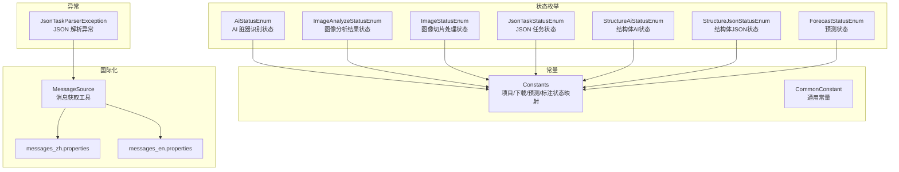
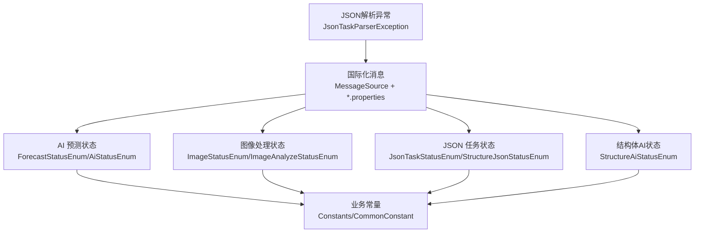
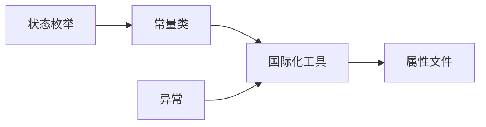

# 错误码对照表

<cite>
**本文引用的文件**
- [AiStatusEnum.java](file://src/main/java/cn/staitech/fr/enums/AiStatusEnum.java)
- [ImageAnalyzeStatusEnum.java](file://src/main/java/cn/staitech/fr/enums/ImageAnalyzeStatusEnum.java)
- [ImageStatusEnum.java](file://src/main/java/cn/staitech/fr/enums/ImageStatusEnum.java)
- [JsonTaskStatusEnum.java](file://src/main/java/cn/staitech/fr/enums/JsonTaskStatusEnum.java)
- [StructureAiStatusEnum.java](file://src/main/java/cn/staitech/fr/enums/StructureAiStatusEnum.java)
- [StructureJsonStatusEnum.java](file://src/main/java/cn/staitech/fr/enums/StructureJsonStatusEnum.java)
- [ForecastStatusEnum.java](file://src/main/java/cn/staitech/fr/enums/ForecastStatusEnum.java)
- [Constants.java](file://src/main/java/cn/staitech/fr/constant/Constants.java)
- [CommonConstant.java](file://src/main/java/cn/staitech/fr/constant/CommonConstant.java)
- [JsonTaskParserException.java](file://src/main/java/cn/staitech/fr/service/strategy/json/JsonTaskParserException.java)
- [MessageSource.java](file://src/main/java/cn/staitech/fr/utils/MessageSource.java)
- [messages_zh.properties](file://src/main/resources/i18n/messages_zh.properties)
- [messages_en.properties](file://src/main/resources/i18n/messages_en.properties)
</cite>

## 目录
1. [简介](#简介)
2. [项目结构](#项目结构)
3. [核心组件](#核心组件)
4. [架构总览](#架构总览)
5. [详细组件分析](#详细组件分析)
6. [依赖分析](#依赖分析)
7. [性能考虑](#性能考虑)
8. [故障排查指南](#故障排查指南)
9. [结论](#结论)
10. [附录](#附录)

## 简介
本对照表面向开发与运维人员，系统梳理 FR 模块中的错误码、状态码与异常类型，覆盖以下维度：
- AI 预测状态错误码（含预测流程状态）
- 图像处理状态错误码（含上传、解析、处理、可用等）
- JSON 任务状态错误码（含结构化 JSON 解析流程）
- 业务异常错误码（国际化消息键与典型业务约束）

文档提供每类错误码的含义、可能原因、影响范围与解决建议，并总结分类体系与编码规则，帮助快速定位与处理问题。

## 项目结构
FR 模块以“枚举 + 常量 + 国际化 + 异常”为核心组织方式：
- 枚举类集中定义状态码与含义，便于统一管理与查询
- 常量类集中定义业务常量与状态映射，便于跨层调用
- 国际化资源文件提供多语言提示
- 自定义异常用于 JSON 解析阶段的错误传播

图表来源
- [AiStatusEnum.java:1-25](file://src/main/java/cn/staitech/fr/enums/AiStatusEnum.java#L1-L25)
- [ImageAnalyzeStatusEnum.java:1-36](file://src/main/java/cn/staitech/fr/enums/ImageAnalyzeStatusEnum.java#L1-L36)
- [ImageStatusEnum.java:1-43](file://src/main/java/cn/staitech/fr/enums/ImageStatusEnum.java#L1-L43)
- [JsonTaskStatusEnum.java:1-16](file://src/main/java/cn/staitech/fr/enums/JsonTaskStatusEnum.java#L1-L16)
- [StructureAiStatusEnum.java:1-17](file://src/main/java/cn/staitech/fr/enums/StructureAiStatusEnum.java#L1-L17)
- [StructureJsonStatusEnum.java:1-16](file://src/main/java/cn/staitech/fr/enums/StructureJsonStatusEnum.java#L1-L16)
- [ForecastStatusEnum.java:1-16](file://src/main/java/cn/staitech/fr/enums/ForecastStatusEnum.java#L1-L16)
- [Constants.java:1-111](file://src/main/java/cn/staitech/fr/constant/Constants.java#L1-L111)
- [CommonConstant.java:1-44](file://src/main/java/cn/staitech/fr/constant/CommonConstant.java#L1-L44)
- [MessageSource.java:1-83](file://src/main/java/cn/staitech/fr/utils/MessageSource.java#L1-L83)
- [messages_zh.properties:1-42](file://src/main/resources/i18n/messages_zh.properties#L1-L42)
- [messages_en.properties:1-45](file://src/main/resources/i18n/messages_en.properties#L1-L45)

章节来源
- [AiStatusEnum.java:1-25](file://src/main/java/cn/staitech/fr/enums/AiStatusEnum.java#L1-L25)
- [ImageAnalyzeStatusEnum.java:1-36](file://src/main/java/cn/staitech/fr/enums/ImageAnalyzeStatusEnum.java#L1-L36)
- [ImageStatusEnum.java:1-43](file://src/main/java/cn/staitech/fr/enums/ImageStatusEnum.java#L1-L43)
- [JsonTaskStatusEnum.java:1-16](file://src/main/java/cn/staitech/fr/enums/JsonTaskStatusEnum.java#L1-L16)
- [StructureAiStatusEnum.java:1-17](file://src/main/java/cn/staitech/fr/enums/StructureAiStatusEnum.java#L1-L17)
- [StructureJsonStatusEnum.java:1-16](file://src/main/java/cn/staitech/fr/enums/StructureJsonStatusEnum.java#L1-L16)
- [ForecastStatusEnum.java:1-16](file://src/main/java/cn/staitech/fr/enums/ForecastStatusEnum.java#L1-L16)
- [Constants.java:1-111](file://src/main/java/cn/staitech/fr/constant/Constants.java#L1-L111)
- [CommonConstant.java:1-44](file://src/main/java/cn/staitech/fr/constant/CommonConstant.java#L1-L44)
- [MessageSource.java:1-83](file://src/main/java/cn/staitech/fr/utils/MessageSource.java#L1-L83)
- [messages_zh.properties:1-42](file://src/main/resources/i18n/messages_zh.properties#L1-L42)
- [messages_en.properties:1-45](file://src/main/resources/i18n/messages_en.properties#L1-L45)

## 核心组件
- 状态枚举：统一定义各子系统的状态码与描述，支持按 code 查询与按语言返回名称
- 常量类：提供业务状态映射、下载状态、预测状态等关键常量
- 国际化：通过消息源与属性文件提供中英文提示
- 异常：JSON 解析阶段抛出自定义异常，便于上层捕获与处理

章节来源
- [AiStatusEnum.java:1-25](file://src/main/java/cn/staitech/fr/enums/AiStatusEnum.java#L1-L25)
- [ImageAnalyzeStatusEnum.java:1-36](file://src/main/java/cn/staitech/fr/enums/ImageAnalyzeStatusEnum.java#L1-L36)
- [ImageStatusEnum.java:1-43](file://src/main/java/cn/staitech/fr/enums/ImageStatusEnum.java#L1-L43)
- [JsonTaskStatusEnum.java:1-16](file://src/main/java/cn/staitech/fr/enums/JsonTaskStatusEnum.java#L1-L16)
- [StructureAiStatusEnum.java:1-17](file://src/main/java/cn/staitech/fr/enums/StructureAiStatusEnum.java#L1-L17)
- [StructureJsonStatusEnum.java:1-16](file://src/main/java/cn/staitech/fr/enums/StructureJsonStatusEnum.java#L1-L16)
- [ForecastStatusEnum.java:1-16](file://src/main/java/cn/staitech/fr/enums/ForecastStatusEnum.java#L1-L16)
- [Constants.java:1-111](file://src/main/java/cn/staitech/fr/constant/Constants.java#L1-L111)
- [CommonConstant.java:1-44](file://src/main/java/cn/staitech/fr/constant/CommonConstant.java#L1-L44)
- [MessageSource.java:1-83](file://src/main/java/cn/staitech/fr/utils/MessageSource.java#L1-L83)
- [JsonTaskParserException.java:1-16](file://src/main/java/cn/staitech/fr/service/strategy/json/JsonTaskParserException.java#L1-L16)

## 架构总览
下图展示错误码在系统中的分布与使用关系：

图表来源
- [ForecastStatusEnum.java:1-16](file://src/main/java/cn/staitech/fr/enums/ForecastStatusEnum.java#L1-L16)
- [AiStatusEnum.java:1-25](file://src/main/java/cn/staitech/fr/enums/AiStatusEnum.java#L1-L25)
- [ImageStatusEnum.java:1-43](file://src/main/java/cn/staitech/fr/enums/ImageStatusEnum.java#L1-L43)
- [ImageAnalyzeStatusEnum.java:1-36](file://src/main/java/cn/staitech/fr/enums/ImageAnalyzeStatusEnum.java#L1-L36)
- [JsonTaskStatusEnum.java:1-16](file://src/main/java/cn/staitech/fr/enums/JsonTaskStatusEnum.java#L1-L16)
- [StructureJsonStatusEnum.java:1-16](file://src/main/java/cn/staitech/fr/enums/StructureJsonStatusEnum.java#L1-L16)
- [StructureAiStatusEnum.java:1-17](file://src/main/java/cn/staitech/fr/enums/StructureAiStatusEnum.java#L1-L17)
- [Constants.java:1-111](file://src/main/java/cn/staitech/fr/constant/Constants.java#L1-L111)
- [CommonConstant.java:1-44](file://src/main/java/cn/staitech/fr/constant/CommonConstant.java#L1-L44)
- [MessageSource.java:1-83](file://src/main/java/cn/staitech/fr/utils/MessageSource.java#L1-L83)
- [JsonTaskParserException.java:1-16](file://src/main/java/cn/staitech/fr/service/strategy/json/JsonTaskParserException.java#L1-L16)

## 详细组件分析

### AI 预测状态错误码
- 定义来源：预测状态枚举与 AI 识别状态枚举
- 关键状态：
  - 未分析、脏器识别中、脏器识别异常、脏器识别完成
  - 成功、失败
- 可能原因：
  - 模型推理失败、输入数据异常、算法回调未触发
- 影响范围：预测流程阻塞、标注与统计不可用
- 处理建议：
  - 检查算法回调服务、重试策略、日志链路
  - 对异常状态进行告警与人工干预

章节来源
- [ForecastStatusEnum.java:1-16](file://src/main/java/cn/staitech/fr/enums/ForecastStatusEnum.java#L1-L16)
- [AiStatusEnum.java:1-25](file://src/main/java/cn/staitech/fr/enums/AiStatusEnum.java#L1-L25)
- [StructureAiStatusEnum.java:1-17](file://src/main/java/cn/staitech/fr/enums/StructureAiStatusEnum.java#L1-L17)

### 图像处理状态错误码
- 定义来源：图像状态枚举与图像分析结果枚举
- 关键状态：
  - 上传中、上传失败、解析中、解析失败、信息解析中、信息解析失败、处理中、处理失败、可用
  - 分析成功、分析失败（英文名）
- 可能原因：
  - 文件传输中断、格式不支持、元数据缺失、后端处理异常
- 影响范围：切片不可用、后续标注与导出受限
- 处理建议：
  - 校验文件完整性与格式、检查存储与网络、重试解析或处理

章节来源
- [ImageStatusEnum.java:1-43](file://src/main/java/cn/staitech/fr/enums/ImageStatusEnum.java#L1-L43)
- [ImageAnalyzeStatusEnum.java:1-36](file://src/main/java/cn/staitech/fr/enums/ImageAnalyzeStatusEnum.java#L1-L36)

### JSON 任务状态错误码
- 定义来源：JSON 任务状态枚举与结构体 JSON 状态枚举
- 关键状态：
  - 未解析、解析中、解析成功、失败、待开始
- 可能原因：
  - JSON 结构不规范、字段缺失、解析器异常、并发冲突
- 影响范围：结构化标注与统计异常
- 处理建议：
  - 使用解析器工厂与策略模式，校验 JSON 合法性，必要时回滚或重试

章节来源
- [JsonTaskStatusEnum.java:1-16](file://src/main/java/cn/staitech/fr/enums/JsonTaskStatusEnum.java#L1-L16)
- [StructureJsonStatusEnum.java:1-16](file://src/main/java/cn/staitech/fr/enums/StructureJsonStatusEnum.java#L1-L16)

### 业务异常错误码
- 定义来源：国际化消息键与业务常量
- 关键场景：
  - 数据不存在、指标已存在、标签正在使用、项目状态限制、权限不足
- 可能原因：
  - 业务前置条件未满足、用户权限不足、项目生命周期限制
- 影响范围：接口返回业务错误、流程中断
- 处理建议：
  - 在前端展示国际化提示，引导用户修正或联系管理员

章节来源
- [Constants.java:1-111](file://src/main/java/cn/staitech/fr/constant/Constants.java#L1-L111)
- [CommonConstant.java:1-44](file://src/main/java/cn/staitech/fr/constant/CommonConstant.java#L1-L44)
- [MessageSource.java:1-83](file://src/main/java/cn/staitech/fr/utils/MessageSource.java#L1-L83)
- [messages_zh.properties:1-42](file://src/main/resources/i18n/messages_zh.properties#L1-L42)
- [messages_en.properties:1-45](file://src/main/resources/i18n/messages_en.properties#L1-L45)

### 异常类型与处理
- 自定义异常：JSON 解析异常，用于在解析失败时向上抛出
- 处理建议：
  - 捕获异常并记录上下文，结合国际化消息向用户反馈

章节来源
- [JsonTaskParserException.java:1-16](file://src/main/java/cn/staitech/fr/service/strategy/json/JsonTaskParserException.java#L1-L16)

## 依赖分析
- 状态枚举之间无直接依赖，均独立维护
- 常量类为全局共享，被各服务与控制器引用
- 国际化消息通过工具类统一获取，避免硬编码
- 异常与国际化配合，形成一致的错误输出风格

图表来源
- [Constants.java:1-111](file://src/main/java/cn/staitech/fr/constant/Constants.java#L1-L111)
- [MessageSource.java:1-83](file://src/main/java/cn/staitech/fr/utils/MessageSource.java#L1-L83)
- [messages_zh.properties:1-42](file://src/main/resources/i18n/messages_zh.properties#L1-L42)
- [messages_en.properties:1-45](file://src/main/resources/i18n/messages_en.properties#L1-L45)
- [JsonTaskParserException.java:1-16](file://src/main/java/cn/staitech/fr/service/strategy/json/JsonTaskParserException.java#L1-L16)

## 性能考虑
- 状态查询采用枚举遍历与静态映射，时间复杂度低
- 国际化消息获取基于线程本地 Locale，减少 IO 开销
- 建议在高频路径中缓存常用状态映射，降低重复计算

## 故障排查指南
- 快速定位步骤
  - 确认状态码来源（AI/图像/JSON/业务）
  - 查看对应枚举或常量定义，确认含义
  - 检查国际化消息键是否正确映射
  - 若为 JSON 解析异常，查看异常栈与上下文
- 常见问题与建议
  - 图像状态为“解析失败”：检查文件格式与元数据
  - JSON 状态为“失败”：校验 JSON 规范与字段
  - 业务错误：根据消息键提示修正操作或权限

章节来源
- [ImageStatusEnum.java:1-43](file://src/main/java/cn/staitech/fr/enums/ImageStatusEnum.java#L1-L43)
- [JsonTaskStatusEnum.java:1-16](file://src/main/java/cn/staitech/fr/enums/JsonTaskStatusEnum.java#L1-L16)
- [MessageSource.java:1-83](file://src/main/java/cn/staitech/fr/utils/MessageSource.java#L1-L83)
- [JsonTaskParserException.java:1-16](file://src/main/java/cn/staitech/fr/service/strategy/json/JsonTaskParserException.java#L1-L16)

## 结论
本对照表提供了 FR 模块错误码与异常的系统化梳理，建议在开发与运维实践中：
- 统一使用枚举与常量定义状态码
- 通过国际化工具输出一致的用户提示
- 对关键异常建立标准化的告警与回退机制
- 在流程图与日志中明确标注状态码来源，提升可追溯性

## 附录

### 分类体系与编码规则
- 分类维度
  - AI 预测状态：预测流程与结果
  - 图像处理状态：上传、解析、处理、可用
  - JSON 任务状态：解析全流程
  - 业务异常：国际化消息键与业务约束
- 编码规则
  - 状态码通常为整数或字符串标识
  - 名称同时提供中英文，便于国际化展示
  - 业务常量集中管理，避免分散定义

章节来源
- [AiStatusEnum.java:1-25](file://src/main/java/cn/staitech/fr/enums/AiStatusEnum.java#L1-L25)
- [ImageStatusEnum.java:1-43](file://src/main/java/cn/staitech/fr/enums/ImageStatusEnum.java#L1-L43)
- [JsonTaskStatusEnum.java:1-16](file://src/main/java/cn/staitech/fr/enums/JsonTaskStatusEnum.java#L1-L16)
- [ForecastStatusEnum.java:1-16](file://src/main/java/cn/staitech/fr/enums/ForecastStatusEnum.java#L1-L16)
- [Constants.java:1-111](file://src/main/java/cn/staitech/fr/constant/Constants.java#L1-L111)