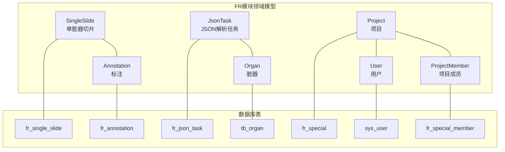
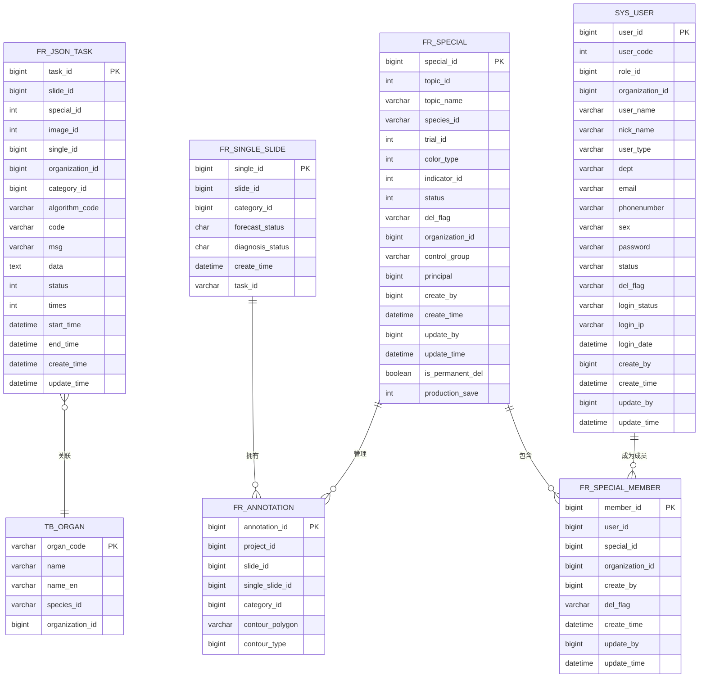
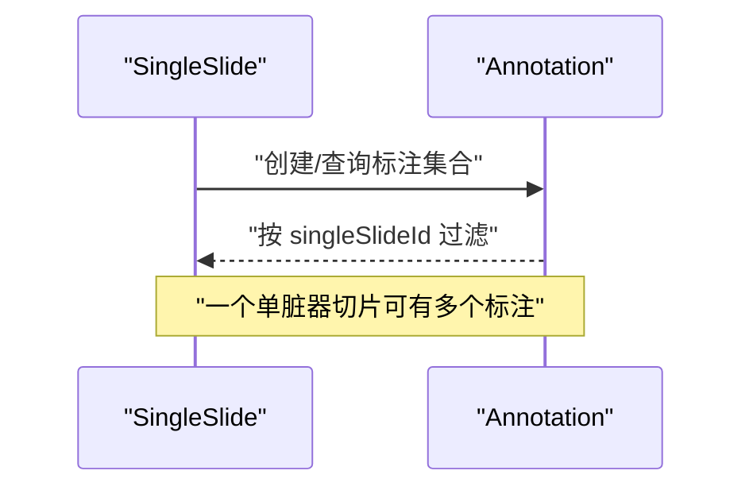
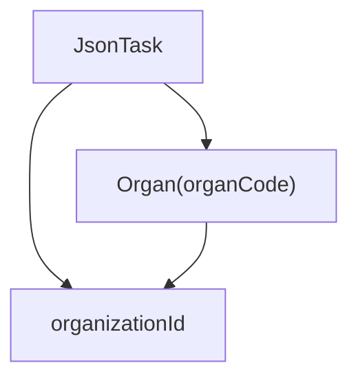
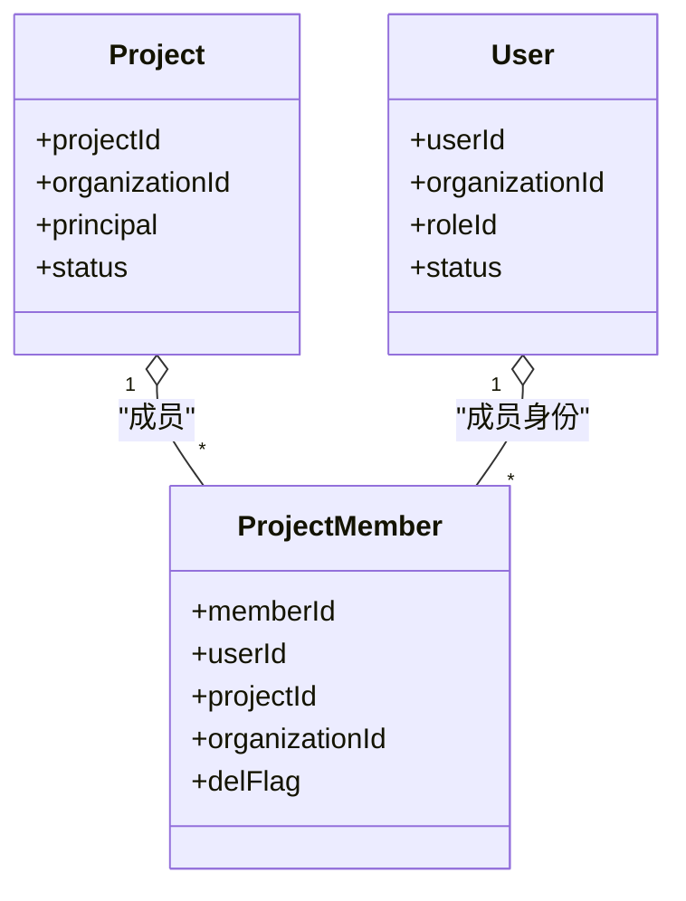
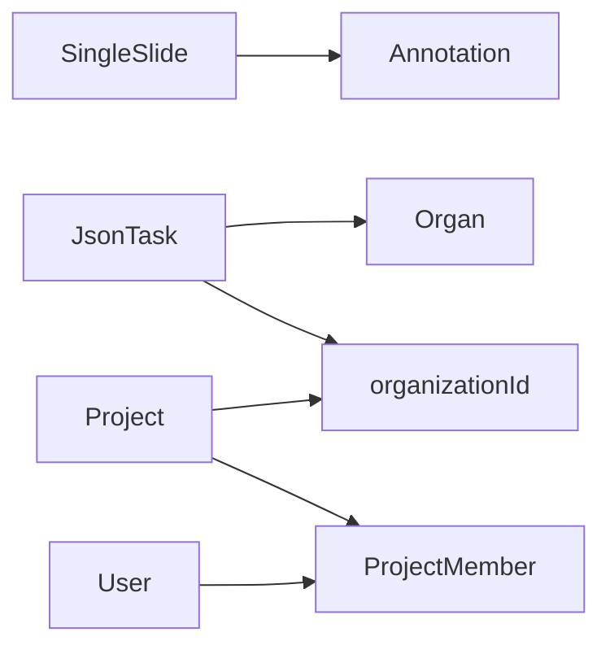

# 实体关系设计

<cite>
**本文引用的文件**
- [SingleSlide.java](file://src/main/java/cn/staitech/fr/domain/SingleSlide.java)
- [Annotation.java](file://src/main/java/cn/staitech/fr/domain/Annotation.java)
- [JsonTask.java](file://src/main/java/cn/staitech/fr/domain/JsonTask.java)
- [Organ.java](file://src/main/java/cn/staitech/fr/domain/Organ.java)
- [Project.java](file://src/main/java/cn/staitech/fr/domain/Project.java)
- [User.java](file://src/main/java/cn/staitech/fr/domain/User.java)
- [ProjectMember.java](file://src/main/java/cn/staitech/fr/domain/ProjectMember.java)
- [V2.6.1-Mysql.sql](file://sql/V2.6.1-Mysql.sql)
- [V2.6.3-Mysql.sql](file://sql/V2.6.3-Mysql.sql)
</cite>

## 目录
1. [引言](#引言)
2. [项目结构](#项目结构)
3. [核心实体](#核心实体)
4. [架构总览](#架构总览)
5. [详细组件分析](#详细组件分析)
6. [依赖分析](#依赖分析)
7. [性能考虑](#性能考虑)
8. [故障排查指南](#故障排查指南)
9. [结论](#结论)
10. [附录](#附录)

## 引言
本文件聚焦FR模块的实体关系设计，系统性梳理核心业务实体之间的关联关系（一对一、一对多、多对多），并结合数据库表结构与领域模型，给出外键约束与引用完整性的设计说明。重点覆盖以下主题：
- SingleSlide 与 Annotation 的关联
- JsonTask 与 Organ 的关系
- Project 与 User 的权限关系
- 外键约束与引用完整性保障
- 实体关系图与ER模型说明
- 关系维护最佳实践与级联操作策略

## 项目结构
FR模块采用典型的分层架构：domain（实体）、mapper（持久层）、service（服务层）、controller（控制层）。本文以domain层实体为依据，结合数据库脚本中的表结构，构建实体关系与ER模型。

图表来源
- [SingleSlide.java:18-76](file://src/main/java/cn/staitech/fr/domain/SingleSlide.java#L18-L76)
- [Annotation.java:19-351](file://src/main/java/cn/staitech/fr/domain/Annotation.java#L19-L351)
- [JsonTask.java:24-67](file://src/main/java/cn/staitech/fr/domain/JsonTask.java#L24-L67)
- [Organ.java:10-87](file://src/main/java/cn/staitech/fr/domain/Organ.java#L10-L87)
- [Project.java:30-116](file://src/main/java/cn/staitech/fr/domain/Project.java#L30-L116)
- [User.java:14-215](file://src/main/java/cn/staitech/fr/domain/User.java#L14-L215)
- [ProjectMember.java:27-64](file://src/main/java/cn/staitech/fr/domain/ProjectMember.java#L27-L64)
- [V2.6.1-Mysql.sql:47-143](file://sql/V2.6.1-Mysql.sql#L47-L143)

章节来源
- [V2.6.1-Mysql.sql:47-143](file://sql/V2.6.1-Mysql.sql#L47-L143)

## 核心实体
本节从数据库表结构与领域模型出发，总结关键实体及其字段要点，为后续ER建模与关系分析奠定基础。

- SingleSlide（单脏器切片）
  - 表名：fr_single_slide
  - 主键：single_id
  - 关键字段：slide_id（切片ID）、category_id（单脏器类型）、forecast_status（结构化状态）、diagnosis_status（诊断状态）、task_id（任务ID）
  - 索引：idx_slide_id(slide_id)

- Annotation（标注）
  - 表名：fr_annotation
  - 主键：annotation_id
  - 关键字段：projectId（项目ID）、slideId（切片ID）、singleSlideId（单脏器切片ID）、categoryId（轮廓标签ID）、contourPolygon（矩形轮廓）、contourType（轮廓类型）

- JsonTask（JSON解析任务）
  - 表名：fr_json_task
  - 主键：taskId
  - 关键字段：slideId（切片ID）、specialId（专题ID）、imageId（图像ID）、singleId（单脏器切片ID）、organizationId（机构ID）、categoryId（脏器标签ID）、algorithmCode（算法标识）、status（状态）、times（执行次数）、startTime/endTime（开始/结束时间）

- Organ（脏器）
  - 表名：tb_organ
  - 字段：organCode（脏器编码）、name（名称）、nameEn（英文名）、speciesId（种属编码）、organizationId（机构ID）

- Project（项目）
  - 表名：fr_special
  - 主键：special_id（projectId别名）
  - 关键字段：topicId（专题ID）、topicName（专题编号）、organizationId（机构ID）、principal（项目负责人）、createBy/updateBy（创建/更新者）、status（状态）

- User（用户）
  - 表名：sys_user
  - 主键：userId
  - 关键字段：organizationId（机构ID）、roleId（角色ID）、userName（账号）、nickName（姓名）、status（状态）、delFlag（删除标志）

- ProjectMember（项目成员）
  - 表名：fr_special_member
  - 主键：member_id
  - 关键字段：userId（用户ID）、special_id（项目ID）、organizationId（机构ID）、createBy/updateBy（创建/更新者）、delFlag（删除标志）

章节来源
- [SingleSlide.java:18-76](file://src/main/java/cn/staitech/fr/domain/SingleSlide.java#L18-L76)
- [Annotation.java:19-351](file://src/main/java/cn/staitech/fr/domain/Annotation.java#L19-L351)
- [JsonTask.java:24-67](file://src/main/java/cn/staitech/fr/domain/JsonTask.java#L24-L67)
- [Organ.java:10-87](file://src/main/java/cn/staitech/fr/domain/Organ.java#L10-L87)
- [Project.java:30-116](file://src/main/java/cn/staitech/fr/domain/Project.java#L30-L116)
- [User.java:14-215](file://src/main/java/cn/staitech/fr/domain/User.java#L14-L215)
- [ProjectMember.java:27-64](file://src/main/java/cn/staitech/fr/domain/ProjectMember.java#L27-L64)
- [V2.6.1-Mysql.sql:47-143](file://sql/V2.6.1-Mysql.sql#L47-L143)

## 架构总览
下图展示FR模块核心实体之间的关系与流向，强调实体间的一对一、一对多与多对多关系，并标注外键字段与索引位置。

图表来源
- [V2.6.1-Mysql.sql:47-143](file://sql/V2.6.1-Mysql.sql#L47-L143)
- [SingleSlide.java:18-76](file://src/main/java/cn/staitech/fr/domain/SingleSlide.java#L18-L76)
- [Annotation.java:19-351](file://src/main/java/cn/staitech/fr/domain/Annotation.java#L19-L351)
- [JsonTask.java:24-67](file://src/main/java/cn/staitech/fr/domain/JsonTask.java#L24-L67)
- [Organ.java:10-87](file://src/main/java/cn/staitech/fr/domain/Organ.java#L10-L87)
- [Project.java:30-116](file://src/main/java/cn/staitech/fr/domain/Project.java#L30-L116)
- [User.java:14-215](file://src/main/java/cn/staitech/fr/domain/User.java#L14-L215)
- [ProjectMember.java:27-64](file://src/main/java/cn/staitech/fr/domain/ProjectMember.java#L27-L64)

## 详细组件分析

### SingleSlide 与 Annotation 的关联
- 关系性质：一对多（一个单脏器切片可对应多个标注）
- 外键字段：
  - Annotation.singleSlideId → SingleSlide.single_id
  - Annotation.slideId → fr_slide（在数据库脚本中可见切片表，此处用于说明）
- 约束与索引：
  - SingleSlide表对slide_id建立索引，便于快速定位单脏器切片与其所属切片的映射
- 业务含义：
  - 单脏器切片是标注的承载单元；标注通过singleSlideId与单脏器切片绑定，形成“单切片多标注”的结构化存储

图表来源
- [SingleSlide.java:23-27](file://src/main/java/cn/staitech/fr/domain/SingleSlide.java#L23-L27)
- [Annotation.java:131-132](file://src/main/java/cn/staitech/fr/domain/Annotation.java#L131-L132)
- [V2.6.1-Mysql.sql](file://sql/V2.6.1-Mysql.sql#L70)

章节来源
- [SingleSlide.java:23-27](file://src/main/java/cn/staitech/fr/domain/SingleSlide.java#L23-L27)
- [Annotation.java:131-132](file://src/main/java/cn/staitech/fr/domain/Annotation.java#L131-L132)
- [V2.6.1-Mysql.sql](file://sql/V2.6.1-Mysql.sql#L70)

### JsonTask 与 Organ 的关系
- 关系性质：多对一（多个JSON解析任务指向同一脏器）
- 外键字段：
  - JsonTask.categoryId → Organ.organCode（脏器编码）
  - JsonTask.organizationId → 组织ID（跨模块通用）
- 业务含义：
  - JsonTask通过categoryId与Organ.organCode关联，实现“按脏器维度”组织算法解析任务；organizationId确保机构隔离

图表来源
- [JsonTask.java:42-42](file://src/main/java/cn/staitech/fr/domain/JsonTask.java#L42-L42)
- [Organ.java:17-17](file://src/main/java/cn/staitech/fr/domain/Organ.java#L17-L17)
- [V2.6.1-Mysql.sql:87-107](file://sql/V2.6.1-Mysql.sql#L87-L107)

章节来源
- [JsonTask.java:42-42](file://src/main/java/cn/staitech/fr/domain/JsonTask.java#L42-L42)
- [Organ.java:17-17](file://src/main/java/cn/staitech/fr/domain/Organ.java#L17-L17)
- [V2.6.1-Mysql.sql:87-107](file://sql/V2.6.1-Mysql.sql#L87-L107)

### Project 与 User 的权限关系
- 关系性质：多对多（通过ProjectMember中间表）
- 中间表：fr_special_member
  - 关键字段：userId、special_id（项目ID）、organizationId、createBy/updateBy、delFlag
- 权限边界：
  - organizationId用于跨机构隔离
  - delFlag支持软删除，避免物理删除影响历史审计
- 业务流程：
  - 用户加入项目成为成员，获得相应权限；离开或被移除则权限失效

图表来源
- [Project.java:38-70](file://src/main/java/cn/staitech/fr/domain/Project.java#L38-L70)
- [User.java:20-36](file://src/main/java/cn/staitech/fr/domain/User.java#L20-L36)
- [ProjectMember.java:35-43](file://src/main/java/cn/staitech/fr/domain/ProjectMember.java#L35-L43)
- [V2.6.1-Mysql.sql:155-162](file://sql/V2.6.1-Mysql.sql#L155-L162)

章节来源
- [Project.java:38-70](file://src/main/java/cn/staitech/fr/domain/Project.java#L38-L70)
- [User.java:20-36](file://src/main/java/cn/staitech/fr/domain/User.java#L20-L36)
- [ProjectMember.java:35-43](file://src/main/java/cn/staitech/fr/domain/ProjectMember.java#L35-L43)
- [V2.6.1-Mysql.sql:155-162](file://sql/V2.6.1-Mysql.sql#L155-L162)

## 依赖分析
- 实体耦合度：
  - SingleSlide 与 Annotation：低耦合，通过外键解耦；查询时可通过索引提升性能
  - JsonTask 与 Organ：弱耦合，通过organCode关联；建议在业务层做一致性校验
  - Project 与 User：通过ProjectMember强关联，权限控制清晰
- 外部依赖：
  - 数据库索引与唯一约束：如fr_json_task的uk_single_id唯一索引，确保单脏器切片仅对应一个任务
  - 机构隔离：organizationId贯穿多个实体，确保跨机构数据隔离

图表来源
- [V2.6.1-Mysql.sql:212-212](file://sql/V2.6.1-Mysql.sql#L212-L212)
- [ProjectMember.java:46-46](file://src/main/java/cn/staitech/fr/domain/ProjectMember.java#L46-L46)
- [JsonTask.java:40-40](file://src/main/java/cn/staitech/fr/domain/JsonTask.java#L40-L40)

章节来源
- [V2.6.1-Mysql.sql:212-212](file://sql/V2.6.1-Mysql.sql#L212-L212)
- [ProjectMember.java:46-46](file://src/main/java/cn/staitech/fr/domain/ProjectMember.java#L46-L46)
- [JsonTask.java:40-40](file://src/main/java/cn/staitech/fr/domain/JsonTask.java#L40-L40)

## 性能考虑
- 索引策略：
  - SingleSlide.idx_slide_id：加速“按切片查询单脏器切片”
  - fr_json_task.uk_single_id：确保单脏器切片任务唯一，避免重复解析
- 查询优化：
  - 按projectId/slideId/singleSlideId过滤标注时，优先使用对应字段索引
  - 脏器维度查询优先使用organCode作为连接键
- 写入策略：
  - 批量插入标注时，尽量按单脏器切片聚合，减少跨切片事务
  - 任务状态变更采用幂等更新（基于taskId/organCode），避免重复处理

## 故障排查指南
- 常见问题与定位
  - 标注缺失：检查SingleSlide与Annotation的singleSlideId关联是否正确
  - 任务重复：检查fr_json_task.uk_single_id唯一索引是否生效
  - 权限异常：核查ProjectMember.delFlag与organizationId是否符合预期
- 排查步骤
  - 核对实体字段映射：参考各实体类与数据库表结构
  - 校验外键与索引：确认外键是否存在、索引是否命中
  - 审计与日志：结合createBy/updateBy与时间戳字段定位问题

章节来源
- [V2.6.1-Mysql.sql:70-70](file://sql/V2.6.1-Mysql.sql#L70-L70)
- [V2.6.1-Mysql.sql:212-212](file://sql/V2.6.1-Mysql.sql#L212-L212)
- [ProjectMember.java:52-52](file://src/main/java/cn/staitech/fr/domain/ProjectMember.java#L52-L52)

## 结论
本设计以数据库表结构为基础，结合领域模型，明确了SingleSlide与Annotation、JsonTask与Organ、Project与User之间的关系。通过合理的外键与索引设计，实现了清晰的引用完整性与良好的查询性能。建议在业务层补充必要的校验与幂等逻辑，确保关系维护的稳定性与一致性。

## 附录
- 外键与索引清单
  - SingleSlide.idx_slide_id
  - fr_json_task.uk_single_id
- 关键字段映射
  - Annotation.singleSlideId → SingleSlide.single_id
  - JsonTask.categoryId → Organ.organCode
  - ProjectMember.special_id → Project.projectId
  - ProjectMember.userId → User.userId