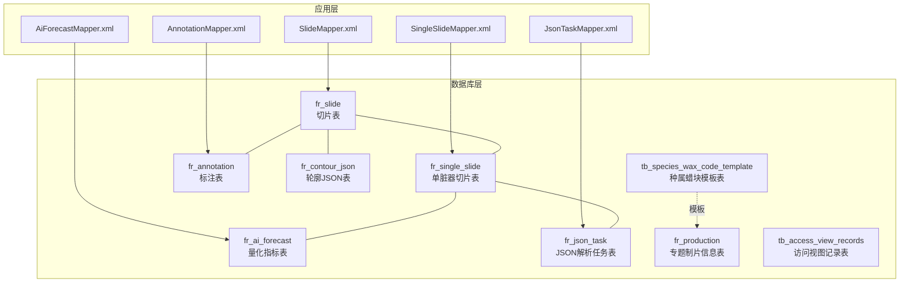
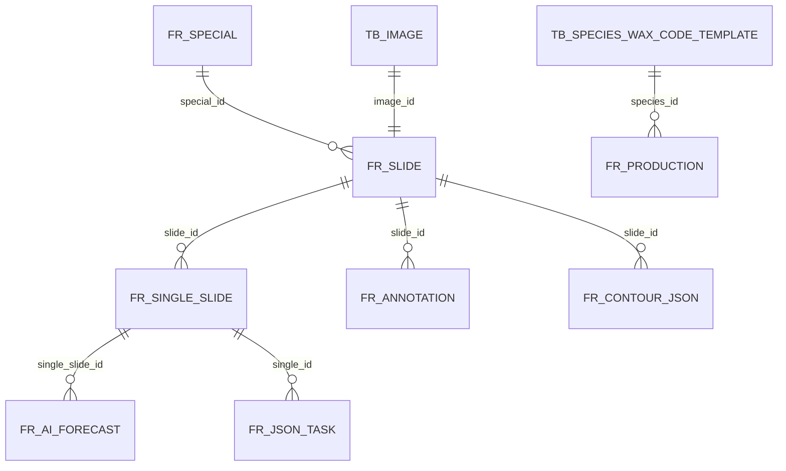
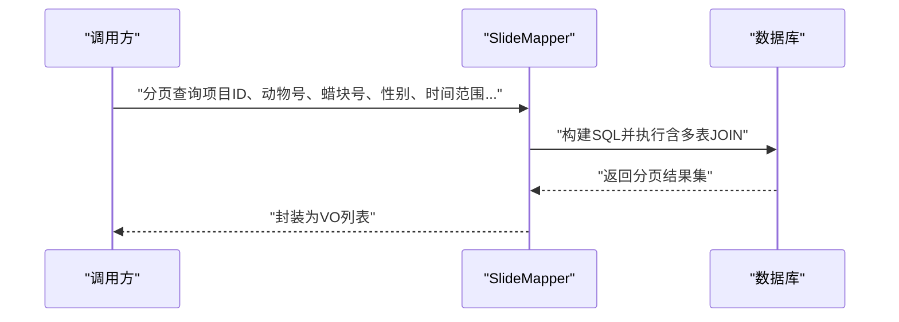
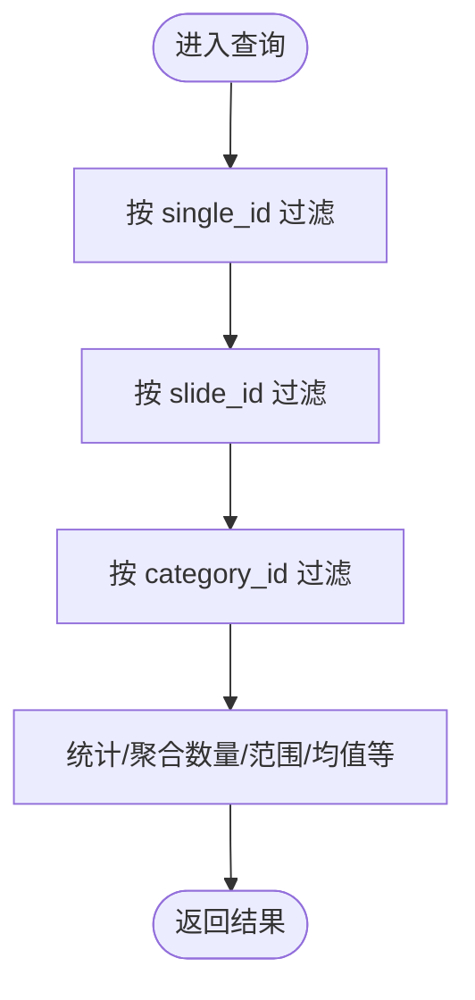
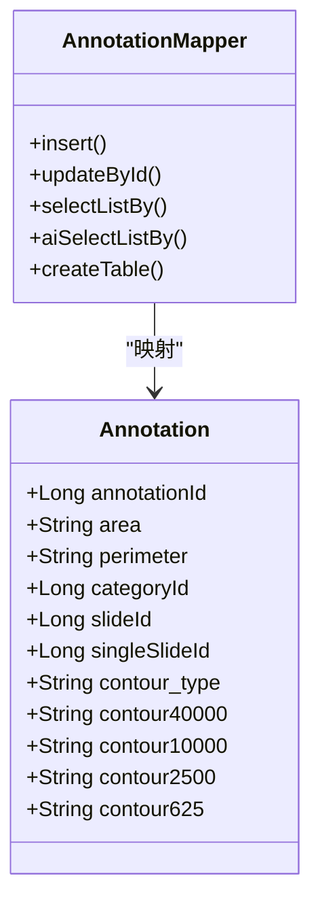
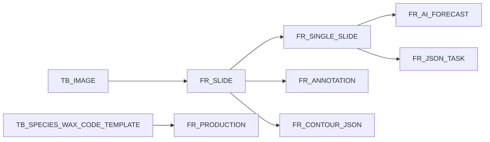

# 数据库模式设计

<cite>
**本文引用的文件**
- [V2.6.1-Mysql.sql](file://sql/V2.6.1-Mysql.sql)
- [V2.6.1-PostgreSQL.sql](file://sql/V2.6.1-PostgreSQL.sql)
- [SlideMapper.xml](file://src/main/resources/mapper/SlideMapper.xml)
- [SingleSlideMapper.xml](file://src/main/resources/mapper/SingleSlideMapper.xml)
- [AiForecastMapper.xml](file://src/main/resources/mapper/AiForecastMapper.xml)
- [AnnotationMapper.xml](file://src/main/resources/mapper/AnnotationMapper.xml)
- [JsonTaskMapper.xml](file://src/main/resources/mapper/JsonTaskMapper.xml)
- [Slide.java](file://src/main/java/cn/staitech/fr/domain/Slide.java)
- [SingleSlide.java](file://src/main/java/cn/staitech/fr/domain/SingleSlide.java)
- [AiForecast.java](file://src/main/java/cn/staitech/fr/domain/AiForecast.java)
- [Annotation.java](file://src/main/java/cn/staitech/fr/domain/Annotation.java)
</cite>

## 目录
1. [简介](#简介)
2. [项目结构](#项目结构)
3. [核心组件](#核心组件)
4. [架构总览](#架构总览)
5. [详细组件分析](#详细组件分析)
6. [依赖分析](#依赖分析)
7. [性能考虑](#性能考虑)
8. [故障排查指南](#故障排查指南)
9. [结论](#结论)
10. [附录](#附录)

## 简介
本文件面向FR模块的数据库模式设计，系统性梳理各表结构、索引与约束策略，解释主键与自增机制，给出复合索引与唯一约束的使用场景，并结合查询语句与实体映射，提供表关系图、查询优化建议、分区与存储引擎选择建议、备份恢复与性能监控方案。

## 项目结构
FR模块数据库相关的核心对象包括：
- 表定义与变更脚本：位于 sql/ 目录
- MyBatis 映射文件：位于 src/main/resources/mapper/
- 实体类：位于 src/main/java/cn/staitech/fr/domain/

图表来源
- [V2.6.1-Mysql.sql:20-107](file://sql/V2.6.1-Mysql.sql#L20-L107)
- [SlideMapper.xml:7-43](file://src/main/resources/mapper/SlideMapper.xml#L7-L43)
- [SingleSlideMapper.xml:5-276](file://src/main/resources/mapper/SingleSlideMapper.xml#L5-L276)
- [AiForecastMapper.xml:5-38](file://src/main/resources/mapper/AiForecastMapper.xml#L5-L38)
- [AnnotationMapper.xml:5-29](file://src/main/resources/mapper/AnnotationMapper.xml#L5-L29)

章节来源
- [V2.6.1-Mysql.sql:1-242](file://sql/V2.6.1-Mysql.sql#L1-L242)
- [SlideMapper.xml:1-641](file://src/main/resources/mapper/SlideMapper.xml#L1-L641)
- [SingleSlideMapper.xml:1-277](file://src/main/resources/mapper/SingleSlideMapper.xml#L1-L277)
- [AiForecastMapper.xml:1-39](file://src/main/resources/mapper/AiForecastMapper.xml#L1-L39)
- [AnnotationMapper.xml:1-1080](file://src/main/resources/mapper/AnnotationMapper.xml#L1-L1080)
- [JsonTaskMapper.xml:1-44](file://src/main/resources/mapper/JsonTaskMapper.xml#L1-L44)

## 核心组件
本节聚焦关键表的结构、主键/自增、索引与约束策略，并结合查询映射文件说明典型使用场景。

- fr_slide（切片表）
  - 主键：slide_id（自增）
  - 关键字段：special_id（项目/专题ID）、image_id（图像ID）、group_code（组别号）、wax_code（蜡块编号）、gender_flag（性别）、ai_status（AI分析状态）、viewers（JSON数组，已阅用户）
  - 索引：无显式复合索引，常用过滤条件在查询映射中体现（如按项目ID、动物号、蜡块号、性别、创建时间等）
  - 约束：非空与默认值在查询映射中体现（如viewers默认JSON数组）

- fr_single_slide（单脏器切片表）
  - 主键：single_id（自增）
  - 外键/关联：slide_id（关联fr_slide）
  - 关键字段：category_id（单脏器类型）、forecast_status（结构化状态）、diagnosis_status（人工诊断状态）、ai_status_fine（精轮廓状态）、area/perimeter（面积/周长）、task_id（任务ID）、screening_difference_status（筛差状态）
  - 索引：idx_slide_id（单脏器切片表常用按slide_id查询）

- fr_ai_forecast（量化指标表）
  - 主键：forecast_id（自增）
  - 关键字段：single_slide_id（外键）、quantitative_indicators/results/unit/struct_type/structure_ids等
  - 索引：无显式复合索引，按single_slide_id查询为主

- fr_annotation（标注表）
  - 主键：annotation_id（自增）
  - 关键字段：category_id、slide_id、contour*（多分辨率轮廓几何）、contour_type（标注类型）、single_slide_id（单切片ID）、annotation_type（AI/Draw）、id（GeoJSON数据ID）
  - 索引：MySQL脚本未见复合索引；PostgreSQL脚本动态创建了基于sequenceNumber的多表，包含单列索引与GIST空间索引

- fr_json_task（JSON解析任务表）
  - 主键：task_id（自增）
  - 关键字段：slide_id/special_id/image_id/single_id/organization_id/category_id/algorithm_code/code/msg/data/status/times/start_time/end_time/create_time/update_time
  - 索引：uk_single_id（唯一索引，限制single_id重复）

- fr_contour_json（轮廓JSON表）
  - 主键：contour_json_id（自增）
  - 关键字段：slide_id/tile_name/structure_size/create_by/create_time/single_slide_id/middle/small/middle_small/big
  - 索引：无显式复合索引

- tb_species_wax_code_template（种属蜡块模板表）
  - 主键：id（自增）
  - 关键字段：species_id/wax_code/organ_name/organ_en/block_count/sex_flag/organ_code/abbreviation
  - 索引：idx_species_id（按种属ID查询）

- fr_production（专题制片信息表）
  - 主键：id（自增）
  - 关键字段：special_id/organ_tag_id/species_id/wax_code/organ_name/organ_en/block_count/sex_flag/organ_code/abbreviation/organization_id
  - 索引：idx_special_id/idx_species_id（按专题与种属ID查询）

- tb_access_view_records（访问视图记录表）
  - 主键：view_record_id（自增）
  - 关键字段：user_id/slide_id/project_id/access_time
  - 索引：无显式复合索引

章节来源
- [V2.6.1-Mysql.sql:20-107](file://sql/V2.6.1-Mysql.sql#L20-L107)
- [V2.6.1-PostgreSQL.sql:9-48](file://sql/V2.6.1-PostgreSQL.sql#L9-L48)
- [SlideMapper.xml:7-43](file://src/main/resources/mapper/SlideMapper.xml#L7-L43)
- [SingleSlideMapper.xml:5-276](file://src/main/resources/mapper/SingleSlideMapper.xml#L5-L276)
- [AiForecastMapper.xml:5-38](file://src/main/resources/mapper/AiForecastMapper.xml#L5-L38)
- [AnnotationMapper.xml:5-29](file://src/main/resources/mapper/AnnotationMapper.xml#L5-L29)
- [JsonTaskMapper.xml:5-41](file://src/main/resources/mapper/JsonTaskMapper.xml#L5-L41)

## 架构总览
FR模块围绕“项目-切片-单脏器切片-标注/指标/任务”形成清晰的数据链路。下图展示核心表之间的关系与典型查询路径。

图表来源
- [V2.6.1-Mysql.sql:20-107](file://sql/V2.6.1-Mysql.sql#L20-L107)
- [SlideMapper.xml:78-377](file://src/main/resources/mapper/SlideMapper.xml#L78-L377)
- [SingleSlideMapper.xml:154-276](file://src/main/resources/mapper/SingleSlideMapper.xml#L154-L276)
- [AiForecastMapper.xml:24-37](file://src/main/resources/mapper/AiForecastMapper.xml#L24-L37)
- [AnnotationMapper.xml:392-442](file://src/main/resources/mapper/AnnotationMapper.xml#L392-L442)
- [JsonTaskMapper.xml:24-41](file://src/main/resources/mapper/JsonTaskMapper.xml#L24-L41)

## 详细组件分析

### 切片表（fr_slide）与单脏器切片表（fr_single_slide）
- 设计要点
  - 主键采用自增策略，确保全局唯一且顺序增长，有利于写入性能与热点分散。
  - 复合查询常以项目ID、动物号、蜡块号、性别、创建时间等维度组合，建议在这些列上建立合适的索引以提升扫描效率。
  - viewers字段为JSON数组，默认值为空数组，便于前端统一处理。
- 典型查询路径
  - 通过SlideMapper的分页与筛选逻辑，可定位到按项目ID、文件名、动物号、描述、性别、是否已阅、组别、蜡块号、创建时间等条件的组合查询。
- 索引建议
  - 建议在 (special_id, del_flag) 上建立复合索引，覆盖项目维度与软删过滤。
  - 在 (image_id, del_flag) 上建立复合索引，覆盖图像维度与软删过滤。
  - 在 (group_code, wax_code, sex_flag) 上建立复合索引，匹配排序与筛选规则。
- 复杂度与性能
  - 查询涉及多表连接（图像、用户），建议在连接键上保持索引命中率，避免全表扫描。

图表来源
- [SlideMapper.xml:85-171](file://src/main/resources/mapper/SlideMapper.xml#L85-L171)

章节来源
- [SlideMapper.xml:78-377](file://src/main/resources/mapper/SlideMapper.xml#L78-L377)
- [Slide.java:28-94](file://src/main/java/cn/staitech/fr/domain/Slide.java#L28-L94)

### 单脏器切片表（fr_single_slide）
- 设计要点
  - 主键自增，外键slide_id用于与fr_slide关联。
  - 指标状态字段（forecast_status、ai_status_fine、screening_difference_status）支持并行流程控制。
  - area/perimeter等统计字段便于快速展示与汇总。
- 索引建议
  - idx_slide_id（按切片ID查询单脏器切片）。
  - 可考虑在 (category_id, forecast_status) 或 (category_id, ai_status_fine) 上建立复合索引，支撑按脏器类型与状态的聚合统计。
- 复杂度与性能
  - 该表与标注、任务、指标表存在多维关联，建议在高频过滤字段上建立索引，减少连接成本。

图表来源
- [SingleSlideMapper.xml:154-276](file://src/main/resources/mapper/SingleSlideMapper.xml#L154-L276)

章节来源
- [SingleSlideMapper.xml:5-276](file://src/main/resources/mapper/SingleSlideMapper.xml#L5-L276)
- [SingleSlide.java:18-76](file://src/main/java/cn/staitech/fr/domain/SingleSlide.java#L18-L76)

### 量化指标表（fr_ai_forecast）
- 设计要点
  - 主键自增，单脏器切片维度的指标结果集中存储。
  - struct_type区分产品呈现与算法输出两类指标，便于后续统计口径管理。
  - structure_ids用于记录参与计算的结构编码集合。
- 索引建议
  - 建议在 (single_slide_id, quantitative_indicators) 上建立复合索引，支撑按单切片+指标维度的查询与去重。
- 复杂度与性能
  - 指标计算通常按单切片聚合，建议在单切片维度上建立高效索引，减少排序与分组成本。

章节来源
- [AiForecastMapper.xml:5-38](file://src/main/resources/mapper/AiForecastMapper.xml#L5-L38)
- [AiForecast.java:16-83](file://src/main/java/cn/staitech/fr/domain/AiForecast.java#L16-L83)

### 标注表（fr_annotation）与PostgreSQL动态表族
- 设计要点
  - MySQL脚本中，标注表包含多分辨率轮廓字段（contour40000/10000/2500/625）与几何类型字段。
  - PostgreSQL脚本通过序列号生成多张表（fr_ai_annotation_${sequenceNumber}），每表包含geometry字段与多类索引（单列与GIST空间索引）。
- 索引建议
  - 单列索引：按single_slide_id、category_id等常用过滤字段建立。
  - GIST空间索引：对contour*字段建立GIST索引，支撑空间相交、并集、差集等几何运算。
  - 复合索引：(category_id, single_slide_id) 适合按脏器类型+单切片的组合查询。
- 复杂度与性能
  - 几何运算成本较高，建议在业务层尽量减少复杂几何操作，或在离线任务中预计算。

图表来源
- [Annotation.java:21-139](file://src/main/java/cn/staitech/fr/domain/Annotation.java#L21-L139)
- [AnnotationMapper.xml:39-514](file://src/main/resources/mapper/AnnotationMapper.xml#L39-L514)

章节来源
- [AnnotationMapper.xml:1-1080](file://src/main/resources/mapper/AnnotationMapper.xml#L1-L1080)
- [Annotation.java:1-352](file://src/main/java/cn/staitech/fr/domain/Annotation.java#L1-L352)

### JSON解析任务表（fr_json_task）
- 设计要点
  - 主键自增，记录AI任务的生命周期与状态。
  - uk_single_id唯一索引保证每个单脏器切片仅对应一个任务。
- 索引建议
  - 除唯一索引外，可在 (status, create_time) 上建立复合索引，支撑任务调度与状态统计。
- 复杂度与性能
  - 任务表体量较大时，建议按组织维度或时间维度进行分区或归档，降低热数据压力。

章节来源
- [JsonTaskMapper.xml:5-41](file://src/main/resources/mapper/JsonTaskMapper.xml#L5-L41)
- [V2.6.1-Mysql.sql:212-212](file://sql/V2.6.1-Mysql.sql#L212-L212)

### 轮廓JSON表（fr_contour_json）
- 设计要点
  - 存储不同层级的轮廓JSON文件路径，便于按结构规模检索。
- 索引建议
  - 建议在 (slide_id, tile_name) 上建立复合索引，支撑按切片与瓦片名称的快速定位。
- 复杂度与性能
  - 文件路径查询为主，索引粒度适中即可满足需求。

章节来源
- [V2.6.1-Mysql.sql:129-143](file://sql/V2.6.1-Mysql.sql#L129-L143)

### 种属蜡块模板表（tb_species_wax_code_template）与专题制片信息表（fr_production）
- 设计要点
  - 模板表用于标准化蜡块编号与脏器信息，制片信息表用于记录实际项目中的制片参数。
  - 两者均以species_id作为关键过滤字段，建议建立索引提升匹配效率。
- 索引建议
  - idx_species_id（按种属ID查询）。
  - 可考虑在 (species_id, organ_code) 上建立复合索引，支撑按种属+脏器编码的筛选。

章节来源
- [V2.6.1-Mysql.sql:1-18](file://sql/V2.6.1-Mysql.sql#L1-L18)
- [V2.6.1-Mysql.sql:20-41](file://sql/V2.6.1-Mysql.sql#L20-L41)

### 访问视图记录表（tb_access_view_records）
- 设计要点
  - 记录用户访问切片/项目的次数与时点，可用于日活统计。
- 索引建议
  - 建议在 (user_id, access_time) 上建立复合索引，支撑按用户与时间的统计查询。

章节来源
- [V2.6.1-Mysql.sql:155-162](file://sql/V2.6.1-Mysql.sql#L155-L162)

## 依赖分析
- 表间依赖
  - fr_slide 依赖 tb_image（图像元数据）
  - fr_single_slide 依赖 fr_slide（切片）
  - fr_ai_forecast 依赖 fr_single_slide（单切片）
  - fr_annotation 依赖 fr_slide（切片）与PostgreSQL动态表族
  - fr_json_task 依赖 fr_single_slide（单切片）
  - fr_contour_json 依赖 fr_slide（切片）
  - fr_production 依赖 tb_species_wax_code_template（模板）
- 查询依赖
  - 多处查询通过MyBatis XML映射实现，涉及多表JOIN与条件拼接，需确保连接键与过滤条件具备索引支持。

图表来源
- [SlideMapper.xml:213-252](file://src/main/resources/mapper/SlideMapper.xml#L213-L252)
- [SingleSlideMapper.xml:196-231](file://src/main/resources/mapper/SingleSlideMapper.xml#L196-L231)
- [AiForecastMapper.xml:24-37](file://src/main/resources/mapper/AiForecastMapper.xml#L24-L37)
- [AnnotationMapper.xml:346-371](file://src/main/resources/mapper/AnnotationMapper.xml#L346-L371)
- [JsonTaskMapper.xml:24-41](file://src/main/resources/mapper/JsonTaskMapper.xml#L24-L41)
- [V2.6.1-Mysql.sql:20-41](file://sql/V2.6.1-Mysql.sql#L20-L41)

章节来源
- [SlideMapper.xml:1-641](file://src/main/resources/mapper/SlideMapper.xml#L1-L641)
- [SingleSlideMapper.xml:1-277](file://src/main/resources/mapper/SingleSlideMapper.xml#L1-L277)
- [AiForecastMapper.xml:1-39](file://src/main/resources/mapper/AiForecastMapper.xml#L1-L39)
- [AnnotationMapper.xml:1-1080](file://src/main/resources/mapper/AnnotationMapper.xml#L1-L1080)
- [JsonTaskMapper.xml:1-44](file://src/main/resources/mapper/JsonTaskMapper.xml#L1-L44)
- [V2.6.1-Mysql.sql:1-242](file://sql/V2.6.1-Mysql.sql#L1-L242)

## 性能考虑
- 索引策略
  - 针对高频过滤字段（如special_id、image_id、slide_id、single_id、category_id、wax_code、group_code、sex_flag、create_time）建立单列或复合索引。
  - PostGIS场景建议保留GIST空间索引，但避免在WHERE中频繁进行复杂几何运算。
- 分区策略
  - 按时间分区（如按月/季度）适用于任务表、访问记录表与标注表，便于冷热数据分离与归档清理。
  - 按组织ID或项目ID分区可提升跨组织/跨项目的查询隔离性。
- 存储引擎与字符集
  - MySQL：InnoDB为默认引擎，支持事务与行级锁；建议统一字符集为utf8mb4，COLLATE使用_general_ci或_ai_ci以兼容JSON与地理字段。
  - PostgreSQL：使用PostGIS扩展，几何字段与GIST索引性能更优；注意序列号表族的维护与统计信息更新。
- 查询优化
  - 使用EXPLAIN/EXPLAIN ANALYZE分析慢查询，优先保证连接键与过滤条件命中索引。
  - 对于复杂JOIN与子查询，考虑物化中间结果或引入汇总表。
- 缓存与异步
  - 对热点读取（如标注列表、指标范围）引入缓存层，降低数据库压力。
  - 将耗时的几何计算与统计任务下沉至后台任务队列。

## 故障排查指南
- 常见问题
  - 查询慢：检查是否存在全表扫描，确认过滤字段是否具备索引；关注JOIN顺序与基数估计。
  - 空间查询异常：确认几何字段是否有效，ST_IsValid与MakeValid的使用是否正确。
  - 并发冲突：唯一索引冲突（如uk_single_id）需在应用层做幂等处理。
- 排查步骤
  - 使用EXPLAIN/EXPLAIN ANALYZE获取执行计划，定位索引缺失或回表过多。
  - 对PostgreSQL，定期执行VACUUM/ANALYZE与REINDEX，保持统计信息准确。
  - 对高并发写入场景，评估自增步长与缓冲池配置，避免热点写入。

章节来源
- [AnnotationMapper.xml:105-110](file://src/main/resources/mapper/AnnotationMapper.xml#L105-L110)
- [JsonTaskMapper.xml:32-41](file://src/main/resources/mapper/JsonTaskMapper.xml#L32-L41)

## 结论
FR模块数据库模式围绕“项目-切片-单脏器切片-标注/指标/任务”形成闭环，主键自增策略与多表JOIN配合MyBatis映射实现高效查询。建议在高频过滤字段上完善索引，结合时间/组织维度进行分区，针对PostGIS场景保留GIST索引并优化几何运算。通过缓存与异步任务降低数据库压力，配合完善的备份恢复与监控体系保障生产稳定运行。

## 附录
- 备份恢复
  - MySQL：建议使用mysqldump或Percona XtraBackup进行全量+增量备份，定期验证恢复流程。
  - PostgreSQL：使用pg_dump/pg_restore或逻辑复制，结合WAL归档实现点-in-time恢复。
- 性能监控
  - MySQL：关注慢查询日志、Innodb_buffer_pool、索引使用率与锁等待。
  - PostgreSQL：关注shared_buffers、work_mem、wal_writer与top-N慢查询，定期执行ANALYZE与REINDEX。