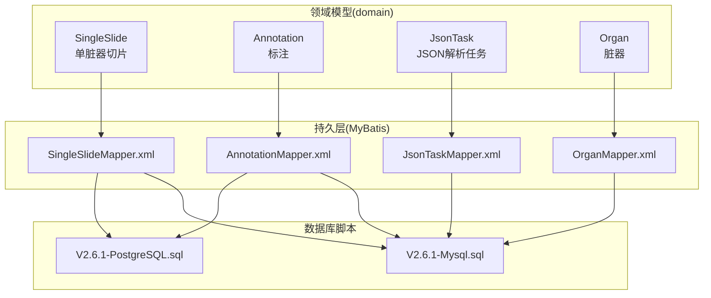
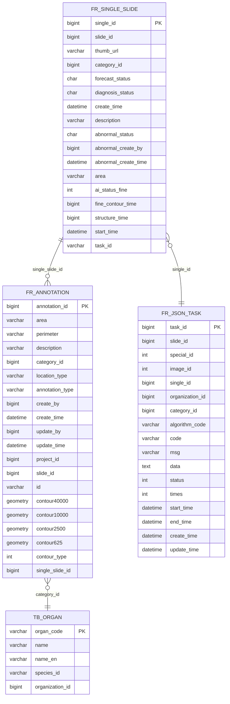
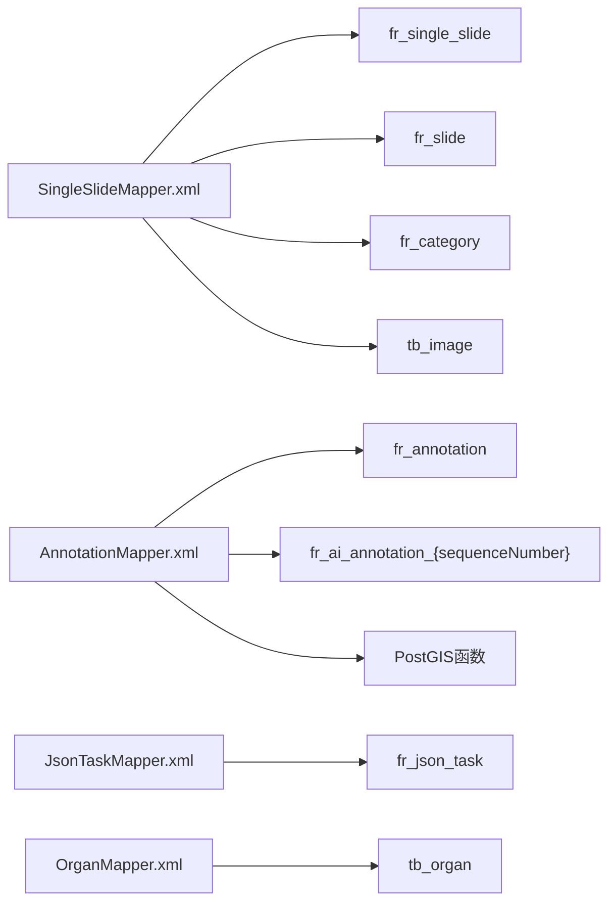
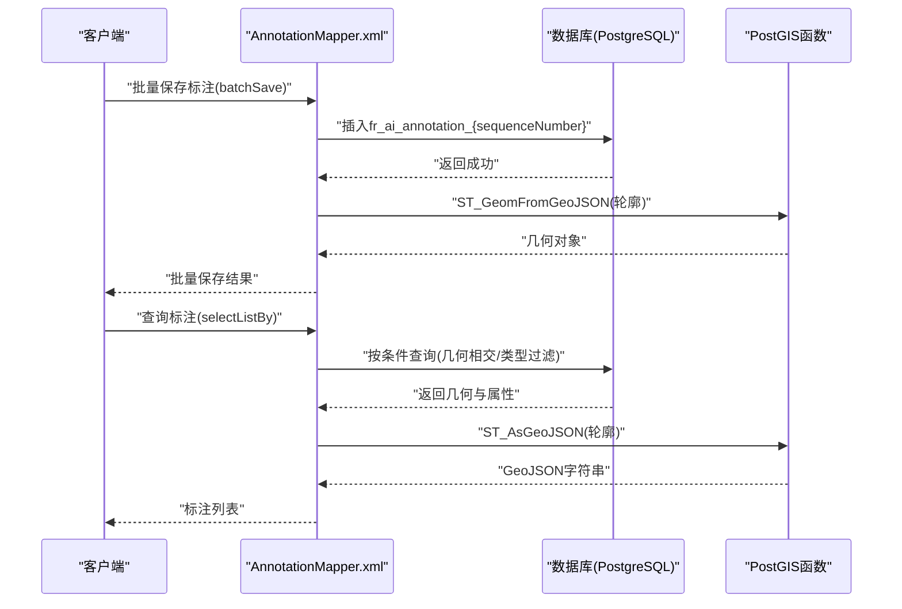

# 数据模型设计

<cite>
**本文引用的文件**
- [SingleSlide.java](file://src/main/java/cn/staitech/fr/domain/SingleSlide.java)
- [Annotation.java](file://src/main/java/cn/staitech/fr/domain/Annotation.java)
- [JsonTask.java](file://src/main/java/cn/staitech/fr/domain/JsonTask.java)
- [Organ.java](file://src/main/java/cn/staitech/fr/domain/Organ.java)
- [SingleSlideMapper.xml](file://src/main/resources/mapper/SingleSlideMapper.xml)
- [AnnotationMapper.xml](file://src/main/resources/mapper/AnnotationMapper.xml)
- [JsonTaskMapper.xml](file://src/main/resources/mapper/JsonTaskMapper.xml)
- [OrganMapper.xml](file://src/main/resources/mapper/OrganMapper.xml)
- [V2.6.1-Mysql.sql](file://sql/V2.6.1-Mysql.sql)
- [V2.6.1-PostgreSQL.sql](file://sql/V2.6.1-PostgreSQL.sql)
- [JsonTaskStatusEnum.java](file://src/main/java/cn/staitech/fr/enums/JsonTaskStatusEnum.java)
- [ImageStatusEnum.java](file://src/main/java/cn/staitech/fr/enums/ImageStatusEnum.java)
- [StructureTypeEnum.java](file://src/main/java/cn/staitech/fr/enums/StructureTypeEnum.java)
- [StructureJsonStatusEnum.java](file://src/main/java/cn/staitech/fr/enums/StructureJsonStatusEnum.java)
</cite>

## 目录
1. [简介](#简介)
2. [项目结构](#项目结构)
3. [核心组件](#核心组件)
4. [架构概览](#架构概览)
5. [详细组件分析](#详细组件分析)
6. [依赖分析](#依赖分析)
7. [性能考虑](#性能考虑)
8. [故障排除指南](#故障排除指南)
9. [结论](#结论)
10. [附录](#附录)

## 简介
本文件面向FR模块的数据模型设计，聚焦于SingleSlide、Annotation、JsonTask、Organ四大核心实体，系统阐述其业务含义、字段定义与数据类型、主键/外键关系、索引设计与约束、数据验证与业务规则，并给出数据库模式图、示例数据、数据访问模式、缓存策略、性能优化建议、数据生命周期与归档策略、数据迁移路径与版本管理，以及数据安全与隐私保护、访问控制要求。

## 项目结构
FR模块采用分层架构：领域模型(domain)、MyBatis映射(mapper)、枚举与常量、服务与控制器。数据模型以实体类与XML映射文件为核心，配合SQL脚本实现数据库版本演进与索引优化。

图表来源
- [SingleSlide.java:1-77](file://src/main/java/cn/staitech/fr/domain/SingleSlide.java#L1-L77)
- [Annotation.java:1-352](file://src/main/java/cn/staitech/fr/domain/Annotation.java#L1-L352)
- [JsonTask.java:1-69](file://src/main/java/cn/staitech/fr/domain/JsonTask.java#L1-L69)
- [Organ.java:1-88](file://src/main/java/cn/staitech/fr/domain/Organ.java#L1-L88)
- [SingleSlideMapper.xml:1-277](file://src/main/resources/mapper/SingleSlideMapper.xml#L1-L277)
- [AnnotationMapper.xml:1-1080](file://src/main/resources/mapper/AnnotationMapper.xml#L1-L1080)
- [JsonTaskMapper.xml:1-44](file://src/main/resources/mapper/JsonTaskMapper.xml#L1-L44)
- [OrganMapper.xml:1-20](file://src/main/resources/mapper/OrganMapper.xml#L1-L20)
- [V2.6.1-Mysql.sql:1-242](file://sql/V2.6.1-Mysql.sql#L1-L242)
- [V2.6.1-PostgreSQL.sql:1-48](file://sql/V2.6.1-PostgreSQL.sql#L1-L48)

章节来源
- [SingleSlide.java:1-77](file://src/main/java/cn/staitech/fr/domain/SingleSlide.java#L1-L77)
- [Annotation.java:1-352](file://src/main/java/cn/staitech/fr/domain/Annotation.java#L1-L352)
- [JsonTask.java:1-69](file://src/main/java/cn/staitech/fr/domain/JsonTask.java#L1-L69)
- [Organ.java:1-88](file://src/main/java/cn/staitech/fr/domain/Organ.java#L1-L88)

## 核心组件
本节对四大核心实体进行字段与业务语义说明，并明确主键、索引与约束。

- SingleSlide(单脏器切片)
  - 主键: single_id
  - 关键字段: slide_id(切片ID)、thumb_url(缩略图URL)、category_id(单脏器类型)、forecast_status(结构化状态)、diagnosis_status(人工诊断状态)、abnormal_status/abnormalCreateBy/abnormalCreateTime(未见异常相关)、area/perimeter(精细轮廓面积与周长)、ai_status_fine/fineContourTime/structureTime(精细轮廓与结构化时间)、startTime(算法开始时间)、screening_difference_status(筛差状态)
  - 索引: idx_slide_id
  - 约束: 非空字段包括slide_id、category_id、thumb_url；字符集utf8mb4；默认值与注释见脚本

- Annotation(标注)
  - 主键: annotation_id
  - 关键字段: area/perimeter、description、category_id、location_type、annotation_type、createBy/updateBy、create_time/update_time、project_id、slide_id、id(geojson数据ID)、contour_polygon(矩形轮廓)、contour_type(轮廓类型)、single_slide_id
  - 几何存储: contour40000/contour10000/contour2500/contour625(多分辨率几何)、contour(运行时字段)
  - AI动态表: fr_ai_annotation_{sequenceNumber}(PostgreSQL动态表，含geometry索引)
  - 约束: 多分辨率几何字段为geometry类型；AI表含单切片索引与多级GIST索引

- JsonTask(JSON解析任务)
  - 主键: task_id
  - 关键字段: slideId/specialId/imageId/singleId/organizationId/categoryId、algorithmCode、code/msg/data、status/times、startTime/endTime/createTime/updateTime、structureTime(运行时)
  - 约束: 唯一索引uk_single_id(single_id)，避免重复解析同一单切片

- Organ(脏器)
  - 主键: organCode(逻辑主键，非数据库自增)
  - 关键字段: name/nameEn、speciesId、organizationId
  - 约束: 字段长度与组织维度限定

章节来源
- [SingleSlide.java:18-76](file://src/main/java/cn/staitech/fr/domain/SingleSlide.java#L18-L76)
- [Annotation.java:19-351](file://src/main/java/cn/staitech/fr/domain/Annotation.java#L19-L351)
- [JsonTask.java:24-67](file://src/main/java/cn/staitech/fr/domain/JsonTask.java#L24-L67)
- [Organ.java:10-87](file://src/main/java/cn/staitech/fr/domain/Organ.java#L10-L87)
- [V2.6.1-Mysql.sql:47-107](file://sql/V2.6.1-Mysql.sql#L47-L107)
- [V2.6.1-PostgreSQL.sql:9-48](file://sql/V2.6.1-PostgreSQL.sql#L9-L48)

## 架构概览
FR模块数据模型围绕“切片-单脏器-标注-任务-脏器”展开，通过多分辨率几何存储与动态表实现高精度标注与高效检索。

图表来源
- [V2.6.1-Mysql.sql:47-107](file://sql/V2.6.1-Mysql.sql#L47-L107)
- [V2.6.1-PostgreSQL.sql:9-48](file://sql/V2.6.1-PostgreSQL.sql#L9-L48)
- [Annotation.java:19-351](file://src/main/java/cn/staitech/fr/domain/Annotation.java#L19-L351)
- [SingleSlide.java:18-76](file://src/main/java/cn/staitech/fr/domain/SingleSlide.java#L18-L76)
- [JsonTask.java:24-67](file://src/main/java/cn/staitech/fr/domain/JsonTask.java#L24-L67)
- [Organ.java:10-87](file://src/main/java/cn/staitech/fr/domain/Organ.java#L10-L87)

## 详细组件分析

### SingleSlide(单脏器切片)
- 业务含义: 记录单脏器级别的切片元数据与分析状态，支撑精细化结构化与AI分析。
- 关键字段与类型: 
  - 数值型: single_id、slide_id、category_id、ai_status_fine、fineContourTime、structureTime、screening_difference_status
  - 字符串: thumb_url、forecast_status、diagnosis_status、description、area、perimeter、task_id
  - 时间: create_time、abnormal_create_time、startTime
- 索引与约束:
  - 主键: single_id
  - 索引: idx_slide_id(slide_id)
  - 默认值与注释: 见MySQL脚本
- 数据访问模式:
  - 单切片查询: singleSlideBy
  - 导出与统计: getExportAiVO、getExportSingleSlideInfoById、getRangOut、getReferenceScope、getReferenceScopeCopy、getReferenceScopeCopyV2、getCategoryIdCountByGroupCode
  - 组装与筛选: selectSingleOrgan、selectNumber
- 性能要点:
  - 按slide_id过滤与聚合统计需利用idx_slide_id
  - 与fr_slide、tb_image、fr_category联接，注意字段选择与排序

章节来源
- [SingleSlide.java:18-76](file://src/main/java/cn/staitech/fr/domain/SingleSlide.java#L18-L76)
- [SingleSlideMapper.xml:154-275](file://src/main/resources/mapper/SingleSlideMapper.xml#L154-L275)
- [V2.6.1-Mysql.sql:47-70](file://sql/V2.6.1-Mysql.sql#L47-L70)

### Annotation(标注)
- 业务含义: 存储标注的几何、属性与多分辨率轮廓，支持粗轮廓、精细轮廓与AI生成标注。
- 关键字段与类型:
  - 属性: area、perimeter、description、category_id、location_type、annotation_type、createBy/updateBy、create_time/update_time、project_id、slide_id、id
  - 几何: contour40000/contour10000/contour2500/contour625(geometry)
  - 运行时: contour(字符串GeoJSON)、contourType、singleSlideId、contourPolygon
- PostgreSQL动态表:
  - 表名: fr_ai_annotation_{sequenceNumber}
  - 主键: annotation_id
  - 索引: 单切片索引、多级GIST几何索引
- 数据访问模式:
  - 插入/更新: insert、updateById
  - 查询: selectById/selectByIds、selectListBy、aiSelectListBy、aiSelectList
  - 几何运算: mergeContour、collectGeometry、unionGeometryArea、stUnionContourArea、intersectsGeometry、stIsValid、stIsValidAnnotation、getArea、getOrganArea、getStructureArea
  - 动态表: createTable、batchSave、getDelAnnotation、deleteAiAnnotation、batchDeleteBySsIds
- 性能要点:
  - GIST索引加速几何相交、并集、面积/周长计算
  - 多分辨率几何按倍率选择，减少传输与渲染开销

章节来源
- [Annotation.java:19-351](file://src/main/java/cn/staitech/fr/domain/Annotation.java#L19-L351)
- [AnnotationMapper.xml:39-800](file://src/main/resources/mapper/AnnotationMapper.xml#L39-L800)
- [V2.6.1-PostgreSQL.sql:9-48](file://sql/V2.6.1-PostgreSQL.sql#L9-L48)

### JsonTask(JSON解析任务)
- 业务含义: 记录AI JSON解析任务的状态、重试次数与时间戳，确保幂等与可追踪。
- 关键字段与类型:
  - 标识: task_id、single_id、slideId、specialId、imageId、organizationId、categoryId
  - 算法: algorithmCode、code、msg、data
  - 状态: status、times、startTime/endTime/createTime/updateTime
  - 运行时: structureTime
- 约束与索引:
  - 主键: task_id
  - 唯一索引: uk_single_id(single_id)
- 数据访问模式:
  - 批量插入/更新: insertBatch、insertOrUpdateBatch
- 性能要点:
  - 唯一索引保证单切片仅一条任务记录
  - 状态枚举控制解析流程

章节来源
- [JsonTask.java:24-67](file://src/main/java/cn/staitech/fr/domain/JsonTask.java#L24-L67)
- [JsonTaskMapper.xml:24-42](file://src/main/resources/mapper/JsonTaskMapper.xml#L24-L42)
- [JsonTaskStatusEnum.java:6-14](file://src/main/java/cn/staitech/fr/enums/JsonTaskStatusEnum.java#L6-L14)
- [V2.6.1-Mysql.sql:212-212](file://sql/V2.6.1-Mysql.sql#L212-L212)

### Organ(脏器)
- 业务含义: 定义脏器编码、名称与种属维度，用于标注分类与展示。
- 关键字段与类型:
  - organCode(主键)、name/nameEn、speciesId、organizationId
- 使用场景:
  - 与fr_category关联，作为category_id的语义补充
  - 与tb_organ_tag等标签体系配合

章节来源
- [Organ.java:10-87](file://src/main/java/cn/staitech/fr/domain/Organ.java#L10-L87)
- [OrganMapper.xml:7-18](file://src/main/resources/mapper/OrganMapper.xml#L7-L18)

### 数据验证与业务规则
- 字段校验:
  - 非空: slide_id、category_id、thumb_url等
  - 类型: 几何字段使用geometry；数值型字段使用bigint/int
  - 枚举: status字段使用枚举值(如JsonTaskStatusEnum、StructureJsonStatusEnum)
- 业务规则:
  - 单切片唯一任务: uk_single_id保证
  - 标注类型: contour_type区分粗轮廓/精细轮廓/AI生成/手绘
  - AI动态表: 按sequenceNumber动态创建，确保并发隔离
  - 几何有效性: 提供ST_IsValid校验与ST_MakeValid修复

章节来源
- [JsonTaskStatusEnum.java:6-14](file://src/main/java/cn/staitech/fr/enums/JsonTaskStatusEnum.java#L6-L14)
- [StructureJsonStatusEnum.java:6-14](file://src/main/java/cn/staitech/fr/enums/StructureJsonStatusEnum.java#L6-L14)
- [AnnotationMapper.xml:706-720](file://src/main/resources/mapper/AnnotationMapper.xml#L706-L720)

## 依赖分析
- 实体间依赖:
  - SingleSlide -> Annotation: 通过single_slide_id关联
  - SingleSlide -> JsonTask: 通过single_id关联
  - Annotation -> Organ: 通过category_id关联
- 映射文件依赖:
  - SingleSlideMapper.xml依赖fr_single_slide、fr_slide、fr_category、tb_image
  - AnnotationMapper.xml依赖fr_annotation、fr_ai_annotation_{sequenceNumber}、PostGIS函数
  - JsonTaskMapper.xml依赖fr_json_task
  - OrganMapper.xml依赖tb_organ

图表来源
- [SingleSlideMapper.xml:23-50](file://src/main/resources/mapper/SingleSlideMapper.xml#L23-L50)
- [AnnotationMapper.xml:128-244](file://src/main/resources/mapper/AnnotationMapper.xml#L128-L244)
- [JsonTaskMapper.xml:24-42](file://src/main/resources/mapper/JsonTaskMapper.xml#L24-L42)
- [OrganMapper.xml:7-18](file://src/main/resources/mapper/OrganMapper.xml#L7-L18)

章节来源
- [SingleSlideMapper.xml:1-277](file://src/main/resources/mapper/SingleSlideMapper.xml#L1-L277)
- [AnnotationMapper.xml:1-1080](file://src/main/resources/mapper/AnnotationMapper.xml#L1-L1080)
- [JsonTaskMapper.xml:1-44](file://src/main/resources/mapper/JsonTaskMapper.xml#L1-L44)
- [OrganMapper.xml:1-20](file://src/main/resources/mapper/OrganMapper.xml#L1-L20)

## 性能考虑
- 索引策略:
  - SingleSlide: idx_slide_id加速按切片聚合
  - Annotation: GIST索引加速几何相交、并集、面积/周长计算
  - JsonTask: uk_single_id保证单切片唯一任务
- 几何存储优化:
  - 多分辨率几何按倍率选择，降低传输与渲染成本
  - 使用ST_AsGeoJSON与ST_GeomFromGeoJSON在内存与数据库间转换
- 动态表隔离:
  - AI标注按sequenceNumber动态建表，避免热点竞争
- 批量操作:
  - Annotation批量插入batchSave，提升吞吐
- 缓存策略:
  - 推荐: 对高频查询结果(如导出清单、参考范围)进行应用层缓存
  - 注意: 几何字段不建议缓存，优先缓存聚合结果与元数据

## 故障排除指南
- 几何有效性问题:
  - 使用stIsValid/stIsValidAnnotation检查几何有效性
  - 使用ST_MakeValid修复无效几何后重算面积/周长
- 并发冲突:
  - JsonTask使用唯一索引uk_single_id避免重复任务
  - Annotation批量删除按条件精确匹配，防止误删
- 性能瓶颈:
  - 确认GIST索引是否生效
  - 检查查询是否包含不必要的字段与JOIN
  - 合理使用多分辨率几何字段

章节来源
- [AnnotationMapper.xml:706-720](file://src/main/resources/mapper/AnnotationMapper.xml#L706-L720)
- [AnnotationMapper.xml:731-740](file://src/main/resources/mapper/AnnotationMapper.xml#L731-L740)
- [V2.6.1-Mysql.sql:212-212](file://sql/V2.6.1-Mysql.sql#L212-L212)

## 结论
FR模块数据模型以清晰的实体边界与丰富的几何存储能力为核心，结合动态表与多级索引，在保证高精度标注的同时兼顾性能与扩展性。通过严格的字段约束、枚举状态与唯一索引，确保数据一致性与可追踪性。建议在应用层引入缓存与异步处理，进一步提升用户体验与系统吞吐。

## 附录

### 示例数据
- SingleSlide
  - single_id: 1
  - slide_id: 1001
  - category_id: 201
  - forecast_status: "1"
  - diagnosis_status: "0"
  - thumb_url: "/images/thumb_1.jpg"
  - abnormal_status: "1"
  - abnormal_create_by: 10001
  - abnormal_create_time: "2025-01-01 12:00:00"
  - area: "12345.67"
  - perimeter: "5678.90"
  - ai_status_fine: 1
  - fine_contour_time: 1000
  - structure_time: 2000
  - start_time: "2025-01-01 11:00:00"

- Annotation
  - annotation_id: 101
  - category_id: 201
  - slide_id: 1001
  - single_slide_id: 1
  - area: "12345.67"
  - perimeter: "5678.90"
  - annotation_type: "AI"
  - contour_type: 2
  - contour40000: "POINT(0 0)"
  - contour10000: "POINT(0 0)"
  - contour2500: "POINT(0 0)"
  - contour625: "POINT(0 0)"

- JsonTask
  - task_id: 10001
  - single_id: 1
  - slideId: 1001
  - specialId: 101
  - imageId: 201
  - organizationId: 301
  - categoryId: 201
  - algorithmCode: "alg_v1"
  - code: "SUCCESS"
  - msg: "解析完成"
  - data: "{}"
  - status: 2
  - times: 1
  - startTime: "2025-01-01 11:00:00"
  - endTime: "2025-01-01 12:00:00"
  - createTime: "2025-01-01 11:00:00"
  - updateTime: "2025-01-01 12:00:00"

- Organ
  - organCode: "LIVER"
  - name: "肝脏"
  - nameEn: "Liver"
  - speciesId: "MUS_MUSCULUS"
  - organizationId: 301

### 数据访问序列图

图表来源
- [AnnotationMapper.xml:247-289](file://src/main/resources/mapper/AnnotationMapper.xml#L247-L289)
- [AnnotationMapper.xml:373-442](file://src/main/resources/mapper/AnnotationMapper.xml#L373-L442)

### 数据生命周期与归档
- 生命周期:
  - 创建: 注册切片与单脏器信息
  - 解析: JsonTask驱动AI解析，生成Annotation
  - 审核: 人工诊断与质量控制
  - 归档: 历史数据迁移至只读库或冷存储
- 策略建议:
  - 按时间与状态定期清理临时中间表
  - 几何数据保留多分辨率版本，历史版本压缩存储
  - 定期校验几何有效性，自动修复无效数据

### 数据迁移路径与版本管理
- 版本脚本:
  - MySQL: V2.6.1-Mysql.sql创建/变更表结构与索引
  - PostgreSQL: V2.6.1-PostgreSQL.sql添加列、创建筛差表与索引
- 迁移步骤:
  - 先执行MySQL脚本，再执行PostgreSQL脚本
  - 校验唯一索引uk_single_id与GIST索引
  - 验证AnnotationMapper动态表创建流程

章节来源
- [V2.6.1-Mysql.sql:47-107](file://sql/V2.6.1-Mysql.sql#L47-L107)
- [V2.6.1-PostgreSQL.sql:9-48](file://sql/V2.6.1-PostgreSQL.sql#L9-L48)

### 数据安全与隐私
- 访问控制:
  - 通过organizationId与角色权限限制数据可见范围
  - 任务与标注均记录create_by/update_by，便于审计
- 隐私保护:
  - 不在返回体中暴露敏感字段
  - 几何数据按需裁剪，避免泄露原始坐标细节
- 合规建议:
  - 定期审计日志与访问记录
  - 对高敏感数据启用加密存储与传输