# 数据访问模式

<cite>
**本文档引用的文件**
- [AiForecastMapper.java](file://src/main/java/cn/staitech/fr/mapper/AiForecastMapper.java)
- [ImageMapper.java](file://src/main/java/cn/staitech/fr/mapper/ImageMapper.java)
- [ImageMapper.xml](file://src/main/resources/mapper/ImageMapper.xml)
- [application-local.yml](file://src/main/resources/application-local.yml)
- [RocksDBUtil.java](file://src/main/java/cn/staitech/fr/utils/RocksDBUtil.java)
- [DynamicDataPool.java](file://src/main/java/cn/staitech/fr/config/DynamicDataPool.java)
- [InitializinConfig.java](file://src/main/java/cn/staitech/fr/config/InitializinConfig.java)
- [FilterConfig.java](file://src/main/java/cn/staitech/fr/config/FilterConfig.java)
- [TraceContext.java](file://src/main/java/cn/staitech/fr/config/TraceContext.java)
- [StaTechFrApplication.java](file://src/main/java/cn/staitech/fr/StaTechFrApplication.java)
- [pom.xml](file://pom.xml)
</cite>

## 目录
1. [引言](#引言)
2. [项目结构](#项目结构)
3. [核心组件](#核心组件)
4. [架构概览](#架构概览)
5. [详细组件分析](#详细组件分析)
6. [依赖分析](#依赖分析)
7. [性能考虑](#性能考虑)
8. [故障排查指南](#故障排查指南)
9. [结论](#结论)
10. [附录](#附录)

## 引言
本文件聚焦于FR模块的数据访问模式，系统性阐述以下主题：
- MyBatis Plus的使用模式与分页插件配置
- Mapper接口的设计原则与通用CRUD操作
- 缓存策略与RocksDB的使用场景
- 数据访问层的性能优化与查询优化技巧
- 事务管理与连接池配置
- 数据一致性保证与并发控制机制

目标是帮助读者在不深入源码细节的前提下，理解并正确应用该模块的数据访问最佳实践。

## 项目结构
FR模块采用典型的分层架构：控制器层、服务层、数据访问层（Mapper/Xml）、工具与配置层。数据访问层以MyBatis Plus为核心，结合动态数据源、Redis缓存、RocksDB本地KV存储以及线程池等基础设施，支撑高并发与高性能的读写需求。

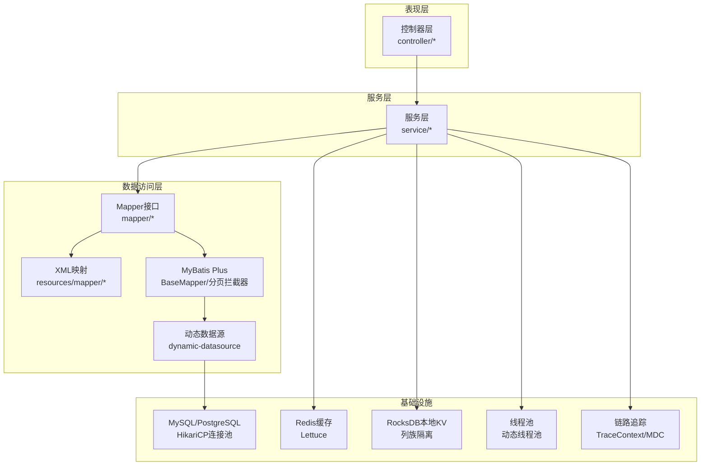

图表来源
- [ImageMapper.java:1-28](file://src/main/java/cn/staitech/fr/mapper/ImageMapper.java#L1-L28)
- [ImageMapper.xml:1-205](file://src/main/resources/mapper/ImageMapper.xml#L1-L205)
- [application-local.yml:15-56](file://src/main/resources/application-local.yml#L15-L56)
- [RocksDBUtil.java:1-321](file://src/main/java/cn/staitech/fr/utils/RocksDBUtil.java#L1-L321)
- [DynamicDataPool.java:1-231](file://src/main/java/cn/staitech/fr/config/DynamicDataPool.java#L1-L231)
- [TraceContext.java:1-82](file://src/main/java/cn/staitech/fr/config/TraceContext.java#L1-L82)

章节来源
- [application-local.yml:15-56](file://src/main/resources/application-local.yml#L15-L56)
- [pom.xml:97-99](file://pom.xml#L97-L99)

## 核心组件
- MyBatis Plus与分页插件：通过全局拦截器启用分页能力，简化分页查询与排序。
- 动态数据源：支持主从分离与多数据源路由，满足读写分离与灾备需求。
- Mapper接口：基于BaseMapper提供通用CRUD；按需扩展自定义方法与XML映射。
- 缓存策略：Redis作为热点数据缓存；RocksDB用于本地KV场景（如临时索引、批处理中间结果）。
- 线程池：为高并发IO与计算任务提供有界队列与快速失败策略。
- 链路追踪：TraceContext结合MDC贯穿请求生命周期，便于问题定位。

章节来源
- [StaTechFrApplication.java:54-55](file://src/main/java/cn/staitech/fr/StaTechFrApplication.java#L54-L55)
- [application-local.yml:75-83](file://src/main/resources/application-local.yml#L75-L83)
- [DynamicDataPool.java:29-64](file://src/main/java/cn/staitech/fr/config/DynamicDataPool.java#L29-L64)

## 架构概览
FR模块的数据访问链路如下：
- 控制器接收请求，组装参数
- 服务层调用Mapper执行数据库操作或缓存读取
- MyBatis Plus执行SQL映射与分页
- 动态数据源根据路由规则选择主库或从库
- Redis缓存命中则直接返回，未命中再走数据库
- RocksDB用于特定场景的本地KV存储
- 线程池异步处理IO密集型任务
- TraceContext贯穿请求，记录traceId便于排障

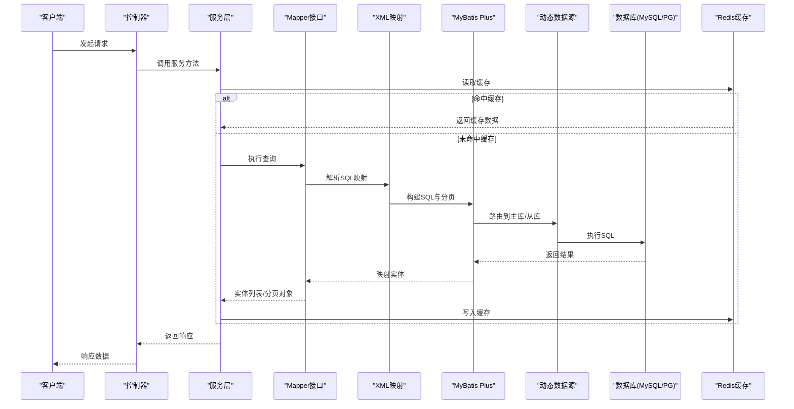

图表来源
- [ImageMapper.java:17-28](file://src/main/java/cn/staitech/fr/mapper/ImageMapper.java#L17-L28)
- [ImageMapper.xml:54-83](file://src/main/resources/mapper/ImageMapper.xml#L54-L83)
- [application-local.yml:15-56](file://src/main/resources/application-local.yml#L15-L56)

## 详细组件分析

### MyBatis Plus与分页插件配置
- 全局拦截器：在应用启动时注册MybatisPlusInterceptor，启用分页等能力。
- 配置项：typeAliasesPackage、mapperLocations、日志实现等在application配置中声明。
- 分页使用：服务层传入分页对象，Mapper方法签名中使用分页参数，XML中编写SQL即可自动分页。

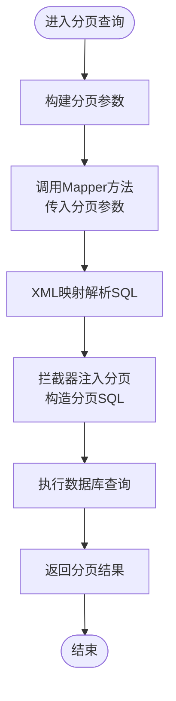

图表来源
- [StaTechFrApplication.java:54-55](file://src/main/java/cn/staitech/fr/StaTechFrApplication.java#L54-L55)
- [application-local.yml:75-83](file://src/main/resources/application-local.yml#L75-L83)

章节来源
- [StaTechFrApplication.java:54-55](file://src/main/java/cn/staitech/fr/StaTechFrApplication.java#L54-L55)
- [application-local.yml:75-83](file://src/main/resources/application-local.yml#L75-L83)

### Mapper接口设计原则与通用CRUD
- 设计原则
  - 接口继承BaseMapper，天然具备通用CRUD能力
  - 自定义方法遵循“按表命名”的规范，方法名清晰表达业务意图
  - 参数使用@Param标注，便于XML中引用
  - 返回类型明确，复杂查询可返回自定义分页包装类
- 通用CRUD
  - 插入/更新/删除/查询单条/条件查询均由BaseMapper提供
  - 自定义分页查询通过传入分页对象与条件参数实现
- 示例参考
  - ImageMapper提供分页查询与选择性查询方法
  - AiForecastMapper扩展自定义查询方法

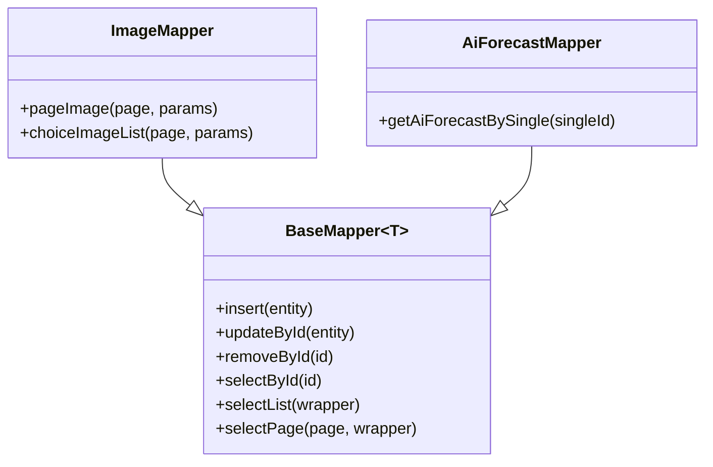

图表来源
- [ImageMapper.java:17-28](file://src/main/java/cn/staitech/fr/mapper/ImageMapper.java#L17-L28)
- [AiForecastMapper.java:13-17](file://src/main/java/cn/staitech/fr/mapper/AiForecastMapper.java#L13-L17)

章节来源
- [ImageMapper.java:17-28](file://src/main/java/cn/staitech/fr/mapper/ImageMapper.java#L17-L28)
- [AiForecastMapper.java:13-17](file://src/main/java/cn/staitech/fr/mapper/AiForecastMapper.java#L13-L17)

### XML映射与查询优化
- 映射规范
  - namespace与Mapper接口全限定名一致
  - resultType/resultMap定义字段映射
  - SQL中使用动态标签（如<where>/<if>）实现条件拼接
- 查询优化要点
  - 使用left join关联组织信息，避免N+1查询
  - 条件过滤优先使用索引列，避免函数包裹导致索引失效
  - 分页查询使用order by主键降序，减少排序成本
  - distinct与条件组合时注意索引覆盖

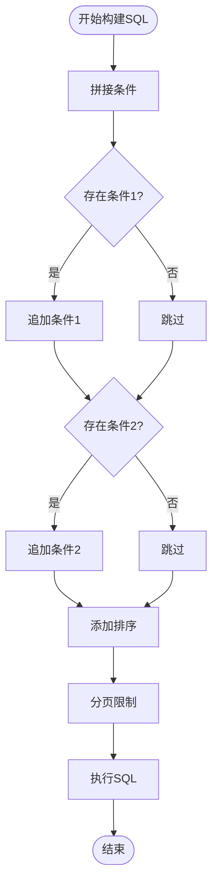

图表来源
- [ImageMapper.xml:54-83](file://src/main/resources/mapper/ImageMapper.xml#L54-L83)
- [ImageMapper.xml:85-153](file://src/main/resources/mapper/ImageMapper.xml#L85-L153)

章节来源
- [ImageMapper.xml:54-83](file://src/main/resources/mapper/ImageMapper.xml#L54-L83)
- [ImageMapper.xml:85-153](file://src/main/resources/mapper/ImageMapper.xml#L85-L153)

### 缓存策略与Redis配置
- Redis连接工厂校验：启动后确保Lettuce连接有效
- 应用场景：热点数据缓存、会话信息、临时标识等
- 配置要点：连接超时、序列化策略、集群/哨兵模式（视部署而定）

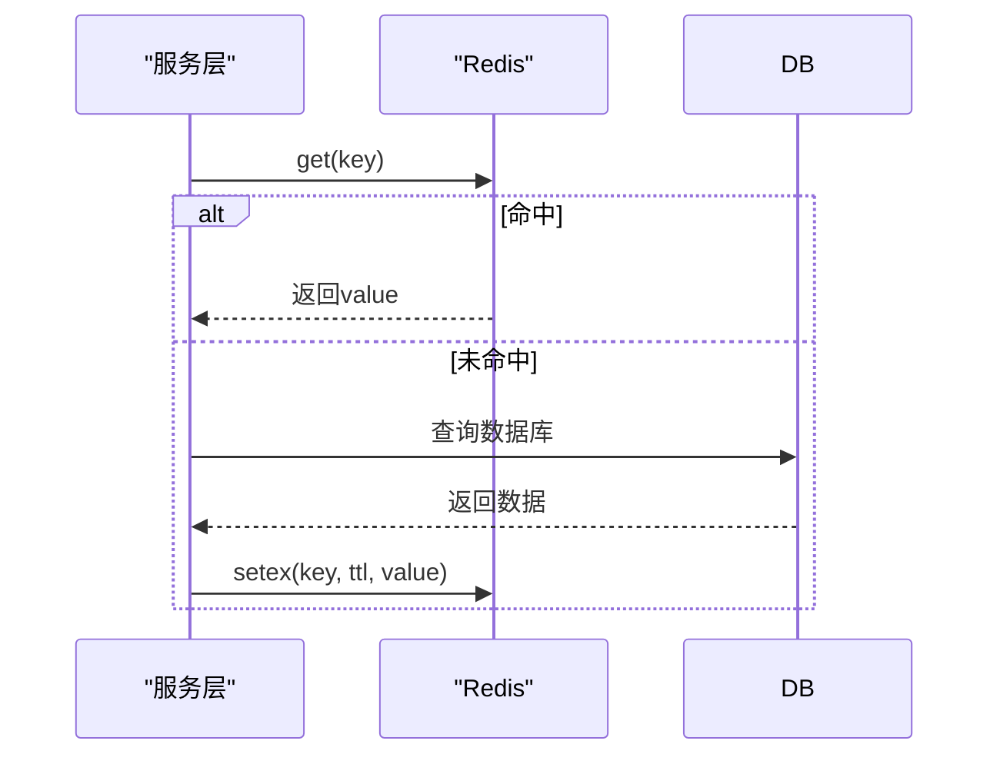

图表来源
- [InitializinConfig.java:18-24](file://src/main/java/cn/staitech/fr/config/InitializinConfig.java#L18-L24)
- [application-local.yml:11-15](file://src/main/resources/application-local.yml#L11-L15)

章节来源
- [InitializinConfig.java:18-24](file://src/main/java/cn/staitech/fr/config/InitializinConfig.java#L18-L24)
- [application-local.yml:11-15](file://src/main/resources/application-local.yml#L11-L15)

### RocksDB使用场景与封装
- 场景：本地KV存储、批处理中间结果、临时索引、离线统计
- 封装要点
  - 列族隔离：不同业务域使用独立列族，避免键空间冲突
  - 并发安全：内部维护列族句柄映射，提供线程安全的增删改查
  - 批量写入：WriteBatch提升写入吞吐
  - 分片迭代：支持分批获取键列表，避免一次性内存压力
- 注意事项
  - 路径区分Windows/Linux
  - 启动时可选择清空历史数据（开发环境）
  - RocksDB文件目录需具备读写权限

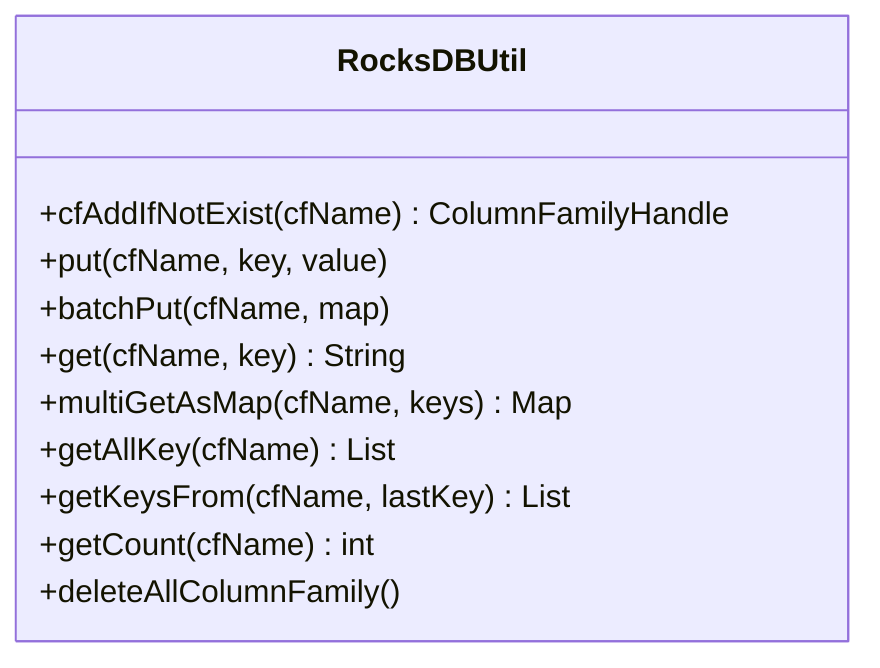

图表来源
- [RocksDBUtil.java:125-140](file://src/main/java/cn/staitech/fr/utils/RocksDBUtil.java#L125-L140)
- [RocksDBUtil.java:158-174](file://src/main/java/cn/staitech/fr/utils/RocksDBUtil.java#L158-L174)
- [RocksDBUtil.java:187-195](file://src/main/java/cn/staitech/fr/utils/RocksDBUtil.java#L187-L195)
- [RocksDBUtil.java:200-216](file://src/main/java/cn/staitech/fr/utils/RocksDBUtil.java#L200-L216)
- [RocksDBUtil.java:243-252](file://src/main/java/cn/staitech/fr/utils/RocksDBUtil.java#L243-L252)
- [RocksDBUtil.java:257-275](file://src/main/java/cn/staitech/fr/utils/RocksDBUtil.java#L257-L275)
- [RocksDBUtil.java:294-303](file://src/main/java/cn/staitech/fr/utils/RocksDBUtil.java#L294-L303)

章节来源
- [RocksDBUtil.java:1-321](file://src/main/java/cn/staitech/fr/utils/RocksDBUtil.java#L1-L321)

### 线程池与并发控制
- 动态数据线程池：面向IO密集型任务，有界队列，快速失败，防止OOM
- 切片文件线程池：针对大量文件处理，核心线程数与队列容量可调
- 识别任务线程池：自定义拒绝策略，记录详细日志并抛出异常，便于上层感知
- 线程命名：统一前缀，便于监控与排障
- 关闭策略：优雅关闭，超时强制关闭，避免资源泄漏

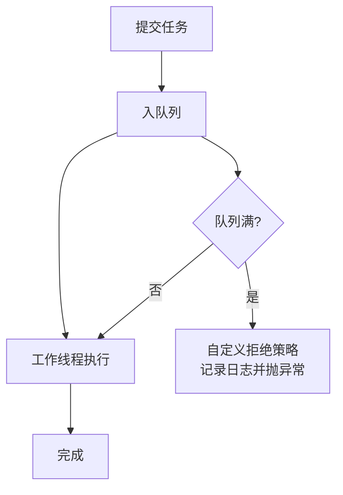

图表来源
- [DynamicDataPool.java:122-150](file://src/main/java/cn/staitech/fr/config/DynamicDataPool.java#L122-L150)
- [DynamicDataPool.java:178-229](file://src/main/java/cn/staitech/fr/config/DynamicDataPool.java#L178-L229)

章节来源
- [DynamicDataPool.java:29-64](file://src/main/java/cn/staitech/fr/config/DynamicDataPool.java#L29-L64)
- [DynamicDataPool.java:122-150](file://src/main/java/cn/staitech/fr/config/DynamicDataPool.java#L122-L150)
- [DynamicDataPool.java:178-229](file://src/main/java/cn/staitech/fr/config/DynamicDataPool.java#L178-L229)

### 事务管理与连接池配置
- 连接池：HikariCP，配置最小空闲、最大池大小、连接超时、验证超时等
- 动态数据源：支持主从库切换，指定默认数据源
- 事务：建议在服务层使用@Transactional，结合动态数据源路由主库
- 监控：开启JMX Bean与连接测试查询，便于运维观测

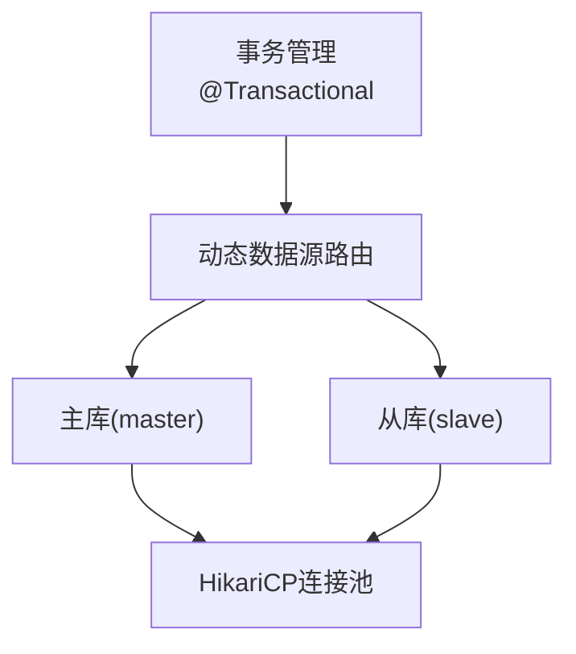

图表来源
- [application-local.yml:15-56](file://src/main/resources/application-local.yml#L15-L56)
- [pom.xml:97-99](file://pom.xml#L97-L99)

章节来源
- [application-local.yml:15-56](file://src/main/resources/application-local.yml#L15-L56)
- [pom.xml:97-99](file://pom.xml#L97-L99)

### 链路追踪与上下文传递
- TraceContext：基于TransmittableThreadLocal与MDC，自动在子线程中传递traceId
- 使用场景：异步任务、线程池执行、消息消费等跨线程场景
- 清理策略：任务完成后清理MDC，避免上下文泄漏

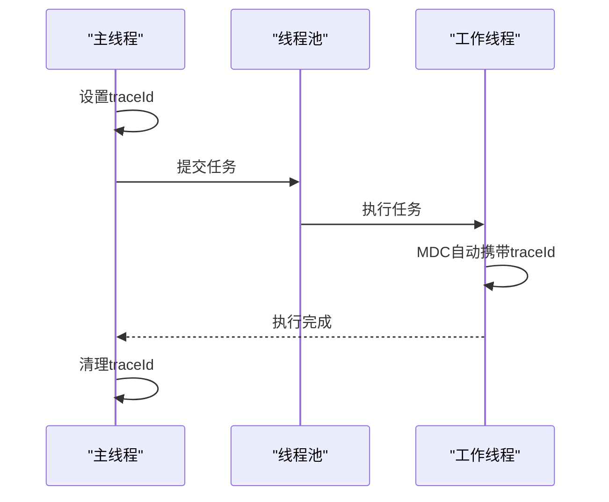

图表来源
- [TraceContext.java:47-80](file://src/main/java/cn/staitech/fr/config/TraceContext.java#L47-L80)

章节来源
- [TraceContext.java:1-82](file://src/main/java/cn/staitech/fr/config/TraceContext.java#L1-L82)

## 依赖分析
- MyBatis Plus与动态数据源：通过StaTechFrApplication注册拦截器，pom中引入dynamic-datasource依赖
- Redis：Lettuce连接工厂校验，application配置中声明Redis地址与端口
- RocksDB：本地KV存储，封装列族管理与批量写入
- 线程池：多种用途的线程池配置，拒绝策略与优雅关闭

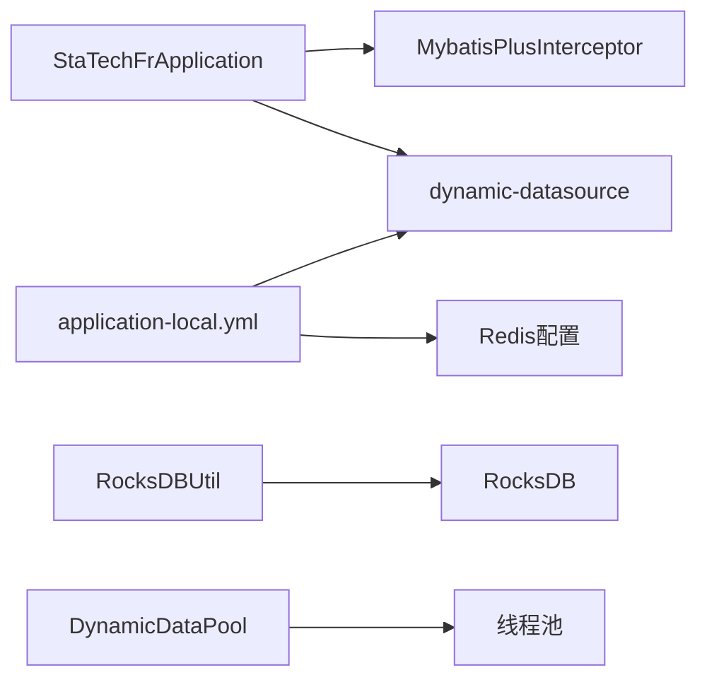

图表来源
- [StaTechFrApplication.java:54-55](file://src/main/java/cn/staitech/fr/StaTechFrApplication.java#L54-L55)
- [application-local.yml:15-56](file://src/main/resources/application-local.yml#L15-L56)
- [RocksDBUtil.java:1-321](file://src/main/java/cn/staitech/fr/utils/RocksDBUtil.java#L1-L321)
- [DynamicDataPool.java:29-64](file://src/main/java/cn/staitech/fr/config/DynamicDataPool.java#L29-L64)

章节来源
- [pom.xml:97-99](file://pom.xml#L97-L99)
- [application-local.yml:15-56](file://src/main/resources/application-local.yml#L15-L56)

## 性能考虑
- 分页优化
  - 使用主键降序分页，避免大偏移量
  - 条件过滤尽量使用索引列
  - 复杂联表查询时，先过滤再联结
- SQL优化
  - 避免SELECT *，明确字段列表
  - 使用EXPLAIN分析慢查询，关注索引使用情况
  - 合理使用LIMIT，避免全表扫描
- 缓存策略
  - 热点数据使用Redis缓存，设置合理TTL
  - 缓存穿透：使用布隆过滤器或空值缓存
  - 缓存雪崩：TTL随机化
- RocksDB优化
  - 批量写入使用WriteBatch
  - 列族按业务域划分，避免键冲突
  - 分片迭代时控制批次大小，避免内存峰值
- 线程池优化
  - IO密集型任务：核心线程数≈CPU核数×系数
  - 有界队列，拒绝策略快速失败，防止阻塞
  - 优雅关闭，避免任务丢失

## 故障排查指南
- 数据库连接问题
  - 检查HikariCP连接池配置与连接测试查询
  - 确认动态数据源主从库连通性
- 缓存不可用
  - 校验Redis连接工厂有效性
  - 检查网络与认证配置
- RocksDB异常
  - 确认数据目录权限与磁盘空间
  - 检查列族创建与句柄映射
- 线程池问题
  - 关注拒绝策略日志，评估队列容量与线程数
  - 观察线程池关闭流程，避免资源泄漏
- 链路追踪
  - 确保TraceContext在子线程中正确传递
  - 清理MDC，避免上下文污染

章节来源
- [application-local.yml:15-56](file://src/main/resources/application-local.yml#L15-L56)
- [InitializinConfig.java:18-24](file://src/main/java/cn/staitech/fr/config/InitializinConfig.java#L18-L24)
- [RocksDBUtil.java:35-82](file://src/main/java/cn/staitech/fr/utils/RocksDBUtil.java#L35-L82)
- [DynamicDataPool.java:69-95](file://src/main/java/cn/staitech/fr/config/DynamicDataPool.java#L69-L95)
- [TraceContext.java:47-80](file://src/main/java/cn/staitech/fr/config/TraceContext.java#L47-L80)

## 结论
FR模块的数据访问模式以MyBatis Plus为核心，结合动态数据源、Redis缓存与RocksDB本地KV，形成高可用、高性能的数据层架构。通过规范的Mapper设计、合理的SQL与分页策略、完善的线程池与链路追踪，能够有效支撑复杂的业务场景。建议在生产环境中持续监控连接池、缓存命中率与RocksDB写入延迟，并定期优化慢查询与索引策略。

## 附录
- 关键配置位置
  - MyBatis Plus与分页：StaTechFrApplication中注册拦截器
  - 数据源与连接池：application-local.yml中spring.datasource.dynamic与hikari配置
  - Redis：application-local.yml中spring.redis配置
  - 线程池：DynamicDataPool中多线程池Bean定义
- 建议的后续优化方向
  - 引入数据库慢查询日志与性能分析工具
  - 对热点表建立复合索引，优化分页查询
  - 在RocksDB写入高峰时段增加批量阈值与异步刷盘策略