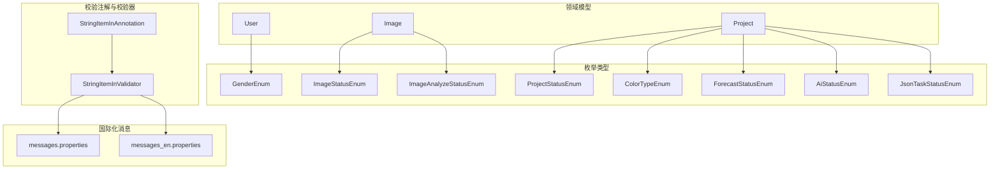
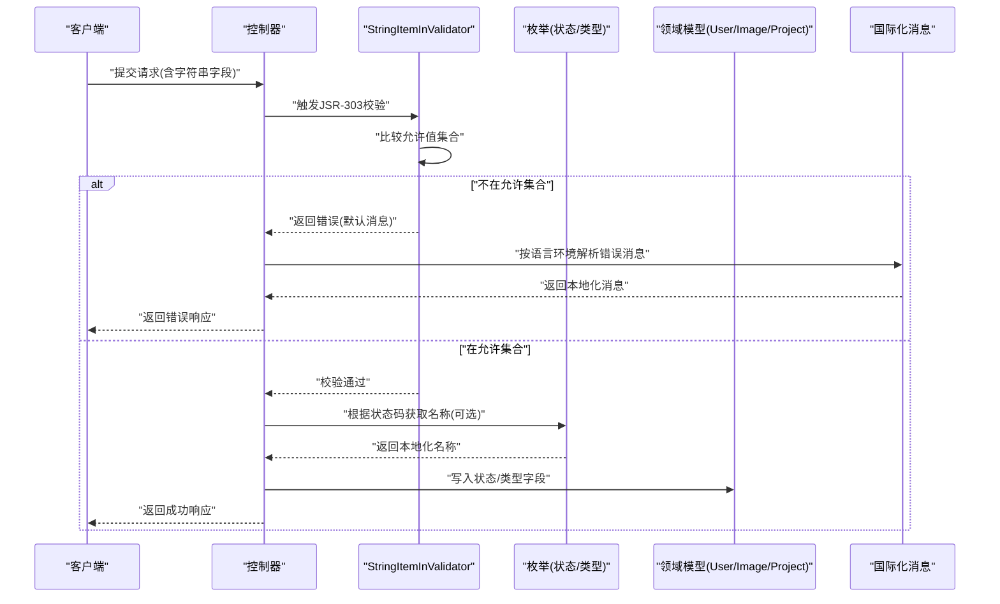
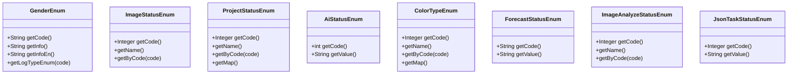
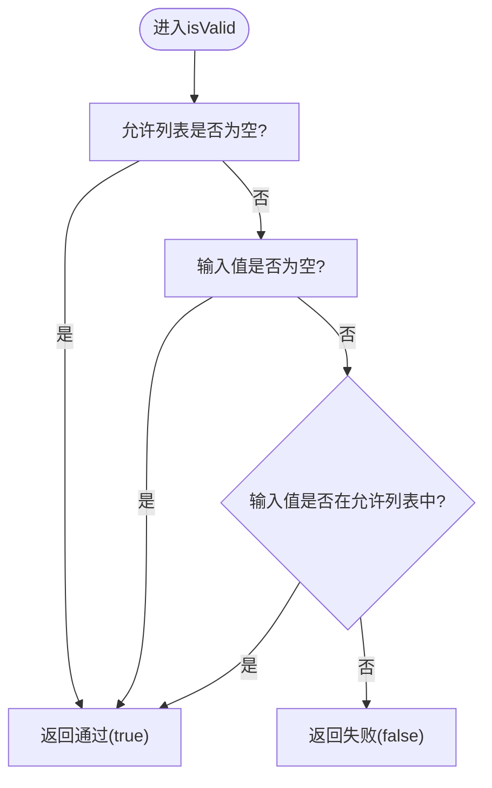
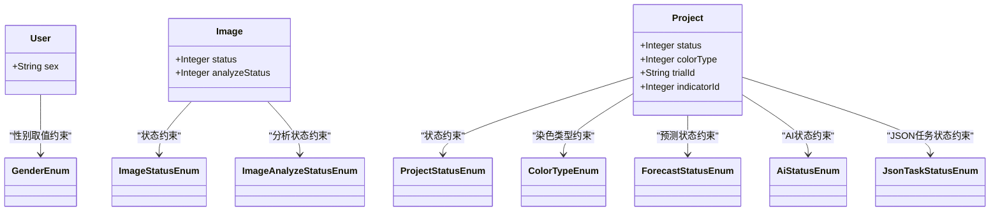
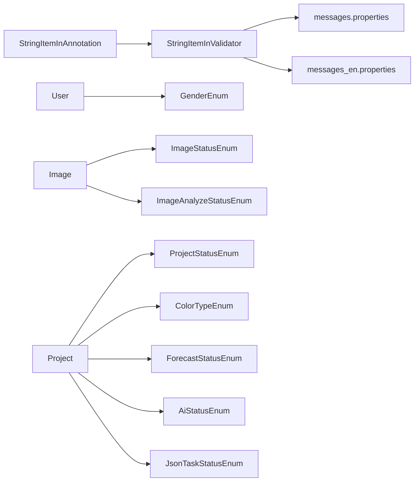

# 数据验证规则

<cite>
**本文引用的文件**
- [GenderEnum.java](file://src/main/java/cn/staitech/fr/enums/GenderEnum.java)
- [ImageStatusEnum.java](file://src/main/java/cn/staitech/fr/enums/ImageStatusEnum.java)
- [ProjectStatusEnum.java](file://src/main/java/cn/staitech/fr/enums/ProjectStatusEnum.java)
- [AiStatusEnum.java](file://src/main/java/cn/staitech/fr/enums/AiStatusEnum.java)
- [ColorTypeEnum.java](file://src/main/java/cn/staitech/fr/enums/ColorTypeEnum.java)
- [ForecastStatusEnum.java](file://src/main/java/cn/staitech/fr/enums/ForecastStatusEnum.java)
- [ImageAnalyzeStatusEnum.java](file://src/main/java/cn/staitech/fr/enums/ImageAnalyzeStatusEnum.java)
- [JsonTaskStatusEnum.java](file://src/main/java/cn/staitech/fr/enums/JsonTaskStatusEnum.java)
- [StringItemInAnnotation.java](file://src/main/java/cn/staitech/fr/utils/validator/StringItemInAnnotation.java)
- [StringItemInValidator.java](file://src/main/java/cn/staitech/fr/utils/validator/StringItemInValidator.java)
- [User.java](file://src/main/java/cn/staitech/fr/domain/User.java)
- [Image.java](file://src/main/java/cn/staitech/fr/domain/Image.java)
- [Project.java](file://src/main/java/cn/staitech/fr/domain/Project.java)
- [messages.properties](file://src/main/resources/i18n/messages.properties)
- [messages_en.properties](file://src/main/resources/i18n/messages_en.properties)
</cite>

## 目录
1. [简介](#简介)
2. [项目结构](#项目结构)
3. [核心组件](#核心组件)
4. [架构总览](#架构总览)
5. [详细组件分析](#详细组件分析)
6. [依赖分析](#依赖分析)
7. [性能考虑](#性能考虑)
8. [故障排查指南](#故障排查指南)
9. [结论](#结论)
10. [附录](#附录)

## 简介
本文件聚焦于FR模块的数据验证规则，系统性梳理并解释以下内容：
- 枚举类型定义与取值范围：GenderEnum、ImageStatusEnum、ProjectStatusEnum、AiStatusEnum、ColorTypeEnum、ForecastStatusEnum、ImageAnalyzeStatusEnum、JsonTaskStatusEnum 等。
- 字符串验证注解与自定义校验器：如何通过注解约束字段取值，并由校验器执行逻辑。
- 业务规则与数据完整性：结合领域模型（如用户、图像、项目）说明常见约束。
- 错误处理与用户反馈：基于国际化消息资源的错误提示策略。
- 国际化支持下的验证消息配置：中文与英文消息资源的维护要点。

## 项目结构
FR模块的验证相关代码主要分布在以下位置：
- 枚举类型：src/main/java/cn/staitech/fr/enums
- 自定义校验注解与校验器：src/main/java/cn/staitech/fr/utils/validator
- 领域模型：src/main/java/cn/staitech/fr/domain
- 国际化消息资源：src/main/resources/i18n

**图表来源**
- [GenderEnum.java:1-46](file://src/main/java/cn/staitech/fr/enums/GenderEnum.java#L1-L46)
- [ImageStatusEnum.java:1-43](file://src/main/java/cn/staitech/fr/enums/ImageStatusEnum.java#L1-L43)
- [ProjectStatusEnum.java:1-51](file://src/main/java/cn/staitech/fr/enums/ProjectStatusEnum.java#L1-L51)
- [AiStatusEnum.java:1-25](file://src/main/java/cn/staitech/fr/enums/AiStatusEnum.java#L1-L25)
- [ColorTypeEnum.java:1-66](file://src/main/java/cn/staitech/fr/enums/ColorTypeEnum.java#L1-L66)
- [ForecastStatusEnum.java:1-16](file://src/main/java/cn/staitech/fr/enums/ForecastStatusEnum.java#L1-L16)
- [ImageAnalyzeStatusEnum.java:1-36](file://src/main/java/cn/staitech/fr/enums/ImageAnalyzeStatusEnum.java#L1-L36)
- [JsonTaskStatusEnum.java:1-16](file://src/main/java/cn/staitech/fr/enums/JsonTaskStatusEnum.java#L1-L16)
- [StringItemInAnnotation.java:1-27](file://src/main/java/cn/staitech/fr/utils/validator/StringItemInAnnotation.java#L1-L27)
- [StringItemInValidator.java:1-39](file://src/main/java/cn/staitech/fr/utils/validator/StringItemInValidator.java#L1-L39)
- [User.java:1-216](file://src/main/java/cn/staitech/fr/domain/User.java#L1-L216)
- [Image.java:1-190](file://src/main/java/cn/staitech/fr/domain/Image.java#L1-L190)
- [Project.java:1-117](file://src/main/java/cn/staitech/fr/domain/Project.java#L1-L117)
- [messages.properties:1-51](file://src/main/resources/i18n/messages.properties#L1-L51)
- [messages_en.properties:1-45](file://src/main/resources/i18n/messages_en.properties#L1-L45)

**章节来源**
- [GenderEnum.java:1-46](file://src/main/java/cn/staitech/fr/enums/GenderEnum.java#L1-L46)
- [ImageStatusEnum.java:1-43](file://src/main/java/cn/staitech/fr/enums/ImageStatusEnum.java#L1-L43)
- [ProjectStatusEnum.java:1-51](file://src/main/java/cn/staitech/fr/enums/ProjectStatusEnum.java#L1-L51)
- [StringItemInAnnotation.java:1-27](file://src/main/java/cn/staitech/fr/utils/validator/StringItemInAnnotation.java#L1-L27)
- [StringItemInValidator.java:1-39](file://src/main/java/cn/staitech/fr/utils/validator/StringItemInValidator.java#L1-L39)
- [User.java:1-216](file://src/main/java/cn/staitech/fr/domain/User.java#L1-L216)
- [Image.java:1-190](file://src/main/java/cn/staitech/fr/domain/Image.java#L1-L190)
- [Project.java:1-117](file://src/main/java/cn/staitech/fr/domain/Project.java#L1-L117)
- [messages.properties:1-51](file://src/main/resources/i18n/messages.properties#L1-L51)
- [messages_en.properties:1-45](file://src/main/resources/i18n/messages_en.properties#L1-L45)

## 核心组件
本节对关键验证组件进行深入分析，涵盖枚举取值、注解与校验器实现、以及在领域模型中的应用。

- 性别枚举 GenderEnum
  - 取值范围：男性、女性（含中文与英文描述）
  - 提供根据整型代码查找对应枚举项的方法
  - 在用户模型中以字符串字段存储性别标识，建议配合字符串校验注解限制取值集合

- 图像状态枚举 ImageStatusEnum
  - 取值范围：上传中、上传失败、解析中、解析失败、信息解析中、信息解析失败、处理中、处理失败、可用
  - 支持按语言环境返回中文或英文名称
  - 在图像模型中以整型状态码存储，建议在接口层统一转换为可读名称

- 项目状态枚举 ProjectStatusEnum
  - 取值范围：待启动、进行中、暂停、已完成
  - 支持按语言环境返回中文或英文名称
  - 提供状态码到名称的标准映射，便于国际化展示

- AI状态枚举 AiStatusEnum
  - 取值范围：未分析、脏器识别中、脏器识别异常、脏器识别完成
  - 用于项目流程中AI识别阶段的状态管理

- 染色类型枚举 ColorTypeEnum
  - 取值范围：荧光标记染色、免疫组织化学染色、HE染色、Masson染色、Van Gieson染色、维多利亚蓝染色、苏丹III/IV染色、油红O染色、PAS糖原染色、AB-PAS染色、刚果红染色(甲醇)、甲苯胺蓝染色、普鲁氏蓝染色、尼氏染色、LFB髓鞘染色、Tunel染色、Ki67、其他、嗜银染色
  - 支持按语言环境返回中文或英文名称
  - 提供状态码到名称的标准映射，便于国际化展示

- 预测状态枚举 ForecastStatusEnum
  - 取值范围：未预测、预测成功、预测失败、预测中
  - 用于预测任务的生命周期管理

- 图像分析状态枚举 ImageAnalyzeStatusEnum
  - 取值范围：失败、成功
  - 支持按语言环境返回中文或英文名称
  - 在图像模型中用于记录文件名解析结果

- JSON任务状态枚举 JsonTaskStatusEnum
  - 取值范围：未解析、解析中、解析成功、失败、待开始
  - 用于JSON解析任务的生命周期管理

- 字符串取值校验注解 StringItemInAnnotation 与校验器 StringItemInValidator
  - 注解定义允许的取值数组与默认错误消息
  - 校验器在运行期将传入字符串与允许集合比对，支持空值跳过校验
  - 适用于对字符串字段进行白名单式取值约束

- 领域模型中的验证应用
  - 用户模型：性别字段建议使用字符串取值校验注解限定取值
  - 图像模型：状态与分析状态字段建议使用对应枚举进行约束与展示
  - 项目模型：状态、染色类型、预测状态、AI状态、JSON任务状态等字段建议使用对应枚举进行约束与国际化展示

**章节来源**
- [GenderEnum.java:1-46](file://src/main/java/cn/staitech/fr/enums/GenderEnum.java#L1-L46)
- [ImageStatusEnum.java:1-43](file://src/main/java/cn/staitech/fr/enums/ImageStatusEnum.java#L1-L43)
- [ProjectStatusEnum.java:1-51](file://src/main/java/cn/staitech/fr/enums/ProjectStatusEnum.java#L1-L51)
- [AiStatusEnum.java:1-25](file://src/main/java/cn/staitech/fr/enums/AiStatusEnum.java#L1-L25)
- [ColorTypeEnum.java:1-66](file://src/main/java/cn/staitech/fr/enums/ColorTypeEnum.java#L1-L66)
- [ForecastStatusEnum.java:1-16](file://src/main/java/cn/staitech/fr/enums/ForecastStatusEnum.java#L1-L16)
- [ImageAnalyzeStatusEnum.java:1-36](file://src/main/java/cn/staitech/fr/enums/ImageAnalyzeStatusEnum.java#L1-L36)
- [JsonTaskStatusEnum.java:1-16](file://src/main/java/cn/staitech/fr/enums/JsonTaskStatusEnum.java#L1-L16)
- [StringItemInAnnotation.java:1-27](file://src/main/java/cn/staitech/fr/utils/validator/StringItemInAnnotation.java#L1-L27)
- [StringItemInValidator.java:1-39](file://src/main/java/cn/staitech/fr/utils/validator/StringItemInValidator.java#L1-L39)
- [User.java:1-216](file://src/main/java/cn/staitech/fr/domain/User.java#L1-L216)
- [Image.java:1-190](file://src/main/java/cn/staitech/fr/domain/Image.java#L1-L190)
- [Project.java:1-117](file://src/main/java/cn/staitech/fr/domain/Project.java#L1-L117)

## 架构总览
下图展示了验证规则在系统中的交互关系：注解驱动校验器执行，枚举提供取值与国际化名称，领域模型承载业务状态，国际化资源提供错误消息。

**图表来源**
- [StringItemInAnnotation.java:1-27](file://src/main/java/cn/staitech/fr/utils/validator/StringItemInAnnotation.java#L1-L27)
- [StringItemInValidator.java:1-39](file://src/main/java/cn/staitech/fr/utils/validator/StringItemInValidator.java#L1-L39)
- [ImageStatusEnum.java:1-43](file://src/main/java/cn/staitech/fr/enums/ImageStatusEnum.java#L1-L43)
- [ProjectStatusEnum.java:1-51](file://src/main/java/cn/staitech/fr/enums/ProjectStatusEnum.java#L1-L51)
- [messages.properties:1-51](file://src/main/resources/i18n/messages.properties#L1-L51)
- [messages_en.properties:1-45](file://src/main/resources/i18n/messages_en.properties#L1-L45)

## 详细组件分析

### 枚举类型定义与取值范围
- GenderEnum：性别枚举，提供中文与英文描述，支持按代码查找
- ImageStatusEnum：图像状态枚举，支持按语言环境返回名称
- ProjectStatusEnum：项目状态枚举，支持按语言环境返回名称与状态映射
- AiStatusEnum：AI识别状态枚举
- ColorTypeEnum：染色类型枚举，支持按语言环境返回名称与状态映射
- ForecastStatusEnum：预测状态枚举
- ImageAnalyzeStatusEnum：图像分析状态枚举，支持按语言环境返回名称
- JsonTaskStatusEnum：JSON任务状态枚举

**图表来源**
- [GenderEnum.java:1-46](file://src/main/java/cn/staitech/fr/enums/GenderEnum.java#L1-L46)
- [ImageStatusEnum.java:1-43](file://src/main/java/cn/staitech/fr/enums/ImageStatusEnum.java#L1-L43)
- [ProjectStatusEnum.java:1-51](file://src/main/java/cn/staitech/fr/enums/ProjectStatusEnum.java#L1-L51)
- [AiStatusEnum.java:1-25](file://src/main/java/cn/staitech/fr/enums/AiStatusEnum.java#L1-L25)
- [ColorTypeEnum.java:1-66](file://src/main/java/cn/staitech/fr/enums/ColorTypeEnum.java#L1-L66)
- [ForecastStatusEnum.java:1-16](file://src/main/java/cn/staitech/fr/enums/ForecastStatusEnum.java#L1-L16)
- [ImageAnalyzeStatusEnum.java:1-36](file://src/main/java/cn/staitech/fr/enums/ImageAnalyzeStatusEnum.java#L1-L36)
- [JsonTaskStatusEnum.java:1-16](file://src/main/java/cn/staitech/fr/enums/JsonTaskStatusEnum.java#L1-L16)

**章节来源**
- [GenderEnum.java:1-46](file://src/main/java/cn/staitech/fr/enums/GenderEnum.java#L1-L46)
- [ImageStatusEnum.java:1-43](file://src/main/java/cn/staitech/fr/enums/ImageStatusEnum.java#L1-L43)
- [ProjectStatusEnum.java:1-51](file://src/main/java/cn/staitech/fr/enums/ProjectStatusEnum.java#L1-L51)
- [AiStatusEnum.java:1-25](file://src/main/java/cn/staitech/fr/enums/AiStatusEnum.java#L1-L25)
- [ColorTypeEnum.java:1-66](file://src/main/java/cn/staitech/fr/enums/ColorTypeEnum.java#L1-L66)
- [ForecastStatusEnum.java:1-16](file://src/main/java/cn/staitech/fr/enums/ForecastStatusEnum.java#L1-L16)
- [ImageAnalyzeStatusEnum.java:1-36](file://src/main/java/cn/staitech/fr/enums/ImageAnalyzeStatusEnum.java#L1-L36)
- [JsonTaskStatusEnum.java:1-16](file://src/main/java/cn/staitech/fr/enums/JsonTaskStatusEnum.java#L1-L16)

### 字符串验证注解与自定义校验器
- StringItemInAnnotation
  - 定义允许的取值数组、错误消息、分组与负载
  - 通过validatedBy指定StringItemInValidator
- StringItemInValidator
  - 初始化时将允许值加载为列表
  - 校验逻辑：若允许列表为空则跳过校验；若输入为空也跳过；否则判断是否包含在允许列表中

**图表来源**
- [StringItemInAnnotation.java:1-27](file://src/main/java/cn/staitech/fr/utils/validator/StringItemInAnnotation.java#L1-L27)
- [StringItemInValidator.java:1-39](file://src/main/java/cn/staitech/fr/utils/validator/StringItemInValidator.java#L1-L39)

**章节来源**
- [StringItemInAnnotation.java:1-27](file://src/main/java/cn/staitech/fr/utils/validator/StringItemInAnnotation.java#L1-L27)
- [StringItemInValidator.java:1-39](file://src/main/java/cn/staitech/fr/utils/validator/StringItemInValidator.java#L1-L39)

### 业务规则与数据完整性
- 用户模型（User）
  - 性别字段建议使用字符串取值校验注解限定为“男性/女性”等合法值
  - 其他状态字段（如账号状态、删除标志）建议采用对应的枚举或白名单校验
- 图像模型（Image）
  - 状态字段使用图像状态枚举约束取值范围
  - 分析状态字段使用图像分析状态枚举约束取值范围
  - 建议在接口层将状态码转换为本地化名称
- 项目模型（Project）
  - 状态字段使用项目状态枚举约束取值范围
  - 染色类型字段使用染色类型枚举约束取值范围
  - 预测状态、AI状态、JSON任务状态字段分别使用对应枚举约束取值范围

**图表来源**
- [User.java:1-216](file://src/main/java/cn/staitech/fr/domain/User.java#L1-L216)
- [Image.java:1-190](file://src/main/java/cn/staitech/fr/domain/Image.java#L1-L190)
- [Project.java:1-117](file://src/main/java/cn/staitech/fr/domain/Project.java#L1-L117)
- [GenderEnum.java:1-46](file://src/main/java/cn/staitech/fr/enums/GenderEnum.java#L1-L46)
- [ImageStatusEnum.java:1-43](file://src/main/java/cn/staitech/fr/enums/ImageStatusEnum.java#L1-L43)
- [ImageAnalyzeStatusEnum.java:1-36](file://src/main/java/cn/staitech/fr/enums/ImageAnalyzeStatusEnum.java#L1-L36)
- [ProjectStatusEnum.java:1-51](file://src/main/java/cn/staitech/fr/enums/ProjectStatusEnum.java#L1-L51)
- [ColorTypeEnum.java:1-66](file://src/main/java/cn/staitech/fr/enums/ColorTypeEnum.java#L1-L66)
- [ForecastStatusEnum.java:1-16](file://src/main/java/cn/staitech/fr/enums/ForecastStatusEnum.java#L1-L16)
- [AiStatusEnum.java:1-25](file://src/main/java/cn/staitech/fr/enums/AiStatusEnum.java#L1-L25)
- [JsonTaskStatusEnum.java:1-16](file://src/main/java/cn/staitech/fr/enums/JsonTaskStatusEnum.java#L1-L16)

**章节来源**
- [User.java:1-216](file://src/main/java/cn/staitech/fr/domain/User.java#L1-L216)
- [Image.java:1-190](file://src/main/java/cn/staitech/fr/domain/Image.java#L1-L190)
- [Project.java:1-117](file://src/main/java/cn/staitech/fr/domain/Project.java#L1-L117)

### 国际化支持下的验证消息配置
- 资源文件
  - 中文：messages.properties
  - 英文：messages_en.properties
- 使用建议
  - 对于字符串取值校验，默认错误消息可通过国际化资源覆盖
  - 枚举名称在不同语言环境下自动切换（例如图像状态、项目状态、染色类型等）
  - 控制器层应根据当前语言环境选择对应的消息资源

**章节来源**
- [messages.properties:1-51](file://src/main/resources/i18n/messages.properties#L1-L51)
- [messages_en.properties:1-45](file://src/main/resources/i18n/messages_en.properties#L1-L45)

## 依赖分析
- 注解与校验器
  - StringItemInAnnotation 依赖 StringItemInValidator 执行校验
  - 校验器不直接依赖业务枚举，但可在业务层结合枚举进行更严格的约束
- 枚举与模型
  - 领域模型字段与相应枚举一一对应，确保取值范围一致
  - 枚举提供国际化名称，便于前端展示
- 国际化资源
  - 校验器与业务层均依赖国际化消息资源进行错误提示

**图表来源**
- [StringItemInAnnotation.java:1-27](file://src/main/java/cn/staitech/fr/utils/validator/StringItemInAnnotation.java#L1-L27)
- [StringItemInValidator.java:1-39](file://src/main/java/cn/staitech/fr/utils/validator/StringItemInValidator.java#L1-L39)
- [messages.properties:1-51](file://src/main/resources/i18n/messages.properties#L1-L51)
- [messages_en.properties:1-45](file://src/main/resources/i18n/messages_en.properties#L1-L45)
- [User.java:1-216](file://src/main/java/cn/staitech/fr/domain/User.java#L1-L216)
- [Image.java:1-190](file://src/main/java/cn/staitech/fr/domain/Image.java#L1-L190)
- [Project.java:1-117](file://src/main/java/cn/staitech/fr/domain/Project.java#L1-L117)
- [GenderEnum.java:1-46](file://src/main/java/cn/staitech/fr/enums/GenderEnum.java#L1-L46)
- [ImageStatusEnum.java:1-43](file://src/main/java/cn/staitech/fr/enums/ImageStatusEnum.java#L1-L43)
- [ImageAnalyzeStatusEnum.java:1-36](file://src/main/java/cn/staitech/fr/enums/ImageAnalyzeStatusEnum.java#L1-L36)
- [ProjectStatusEnum.java:1-51](file://src/main/java/cn/staitech/fr/enums/ProjectStatusEnum.java#L1-L51)
- [ColorTypeEnum.java:1-66](file://src/main/java/cn/staitech/fr/enums/ColorTypeEnum.java#L1-L66)
- [ForecastStatusEnum.java:1-16](file://src/main/java/cn/staitech/fr/enums/ForecastStatusEnum.java#L1-L16)
- [AiStatusEnum.java:1-25](file://src/main/java/cn/staitech/fr/enums/AiStatusEnum.java#L1-L25)
- [JsonTaskStatusEnum.java:1-16](file://src/main/java/cn/staitech/fr/enums/JsonTaskStatusEnum.java#L1-L16)

**章节来源**
- [StringItemInAnnotation.java:1-27](file://src/main/java/cn/staitech/fr/utils/validator/StringItemInAnnotation.java#L1-L27)
- [StringItemInValidator.java:1-39](file://src/main/java/cn/staitech/fr/utils/validator/StringItemInValidator.java#L1-L39)
- [messages.properties:1-51](file://src/main/resources/i18n/messages.properties#L1-L51)
- [messages_en.properties:1-45](file://src/main/resources/i18n/messages_en.properties#L1-L45)
- [User.java:1-216](file://src/main/java/cn/staitech/fr/domain/User.java#L1-L216)
- [Image.java:1-190](file://src/main/java/cn/staitech/fr/domain/Image.java#L1-L190)
- [Project.java:1-117](file://src/main/java/cn/staitech/fr/domain/Project.java#L1-L117)

## 性能考虑
- 校验器初始化仅在注解生效时进行一次，随后复用允许值列表，开销极低
- 枚举查找通常为线性扫描，枚举数量较小，性能影响可忽略
- 建议在高频接口中避免对同一字段重复添加多个校验注解，减少不必要的校验链路

## 故障排查指南
- 字符串取值校验失败
  - 检查注解中允许值数组是否包含实际传入值
  - 确认输入值是否为null或空字符串（校验器会跳过空值）
  - 查看国际化消息资源是否正确覆盖默认错误消息
- 枚举取值不匹配
  - 确认数据库/接口传入的状态码与枚举定义一致
  - 检查是否正确调用按语言环境返回名称的方法
- 国际化消息未生效
  - 确认当前语言环境设置
  - 检查消息键是否与资源文件中的键一致

**章节来源**
- [StringItemInValidator.java:1-39](file://src/main/java/cn/staitech/fr/utils/validator/StringItemInValidator.java#L1-L39)
- [messages.properties:1-51](file://src/main/resources/i18n/messages.properties#L1-L51)
- [messages_en.properties:1-45](file://src/main/resources/i18n/messages_en.properties#L1-L45)

## 结论
FR模块的数据验证规则通过“注解 + 自定义校验器 + 枚举 + 国际化资源”的组合，实现了对字符串取值与业务状态的严格约束与友好反馈。建议在新增字段时遵循相同模式：定义枚举、添加注解、完善国际化消息，以确保系统的一致性与可维护性。

## 附录
- 常用校验注解与用途
  - StringItemInAnnotation：对字符串字段进行白名单取值约束
- 常用枚举与用途
  - GenderEnum：性别取值
  - ImageStatusEnum：图像状态
  - ProjectStatusEnum：项目状态
  - ColorTypeEnum：染色类型
  - ForecastStatusEnum：预测状态
  - ImageAnalyzeStatusEnum：图像分析状态
  - JsonTaskStatusEnum：JSON任务状态
  - AiStatusEnum：AI识别状态