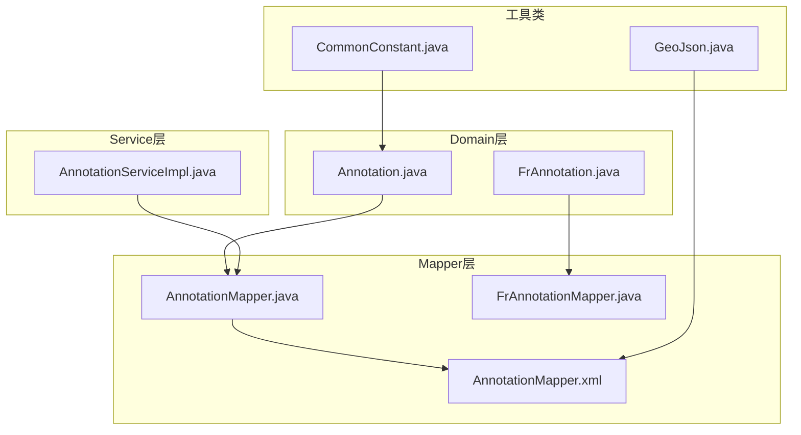
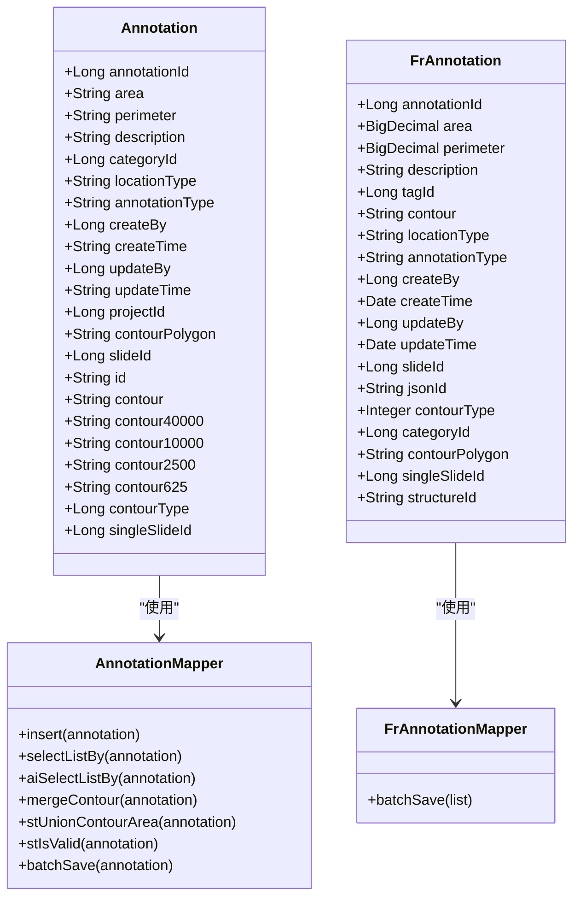
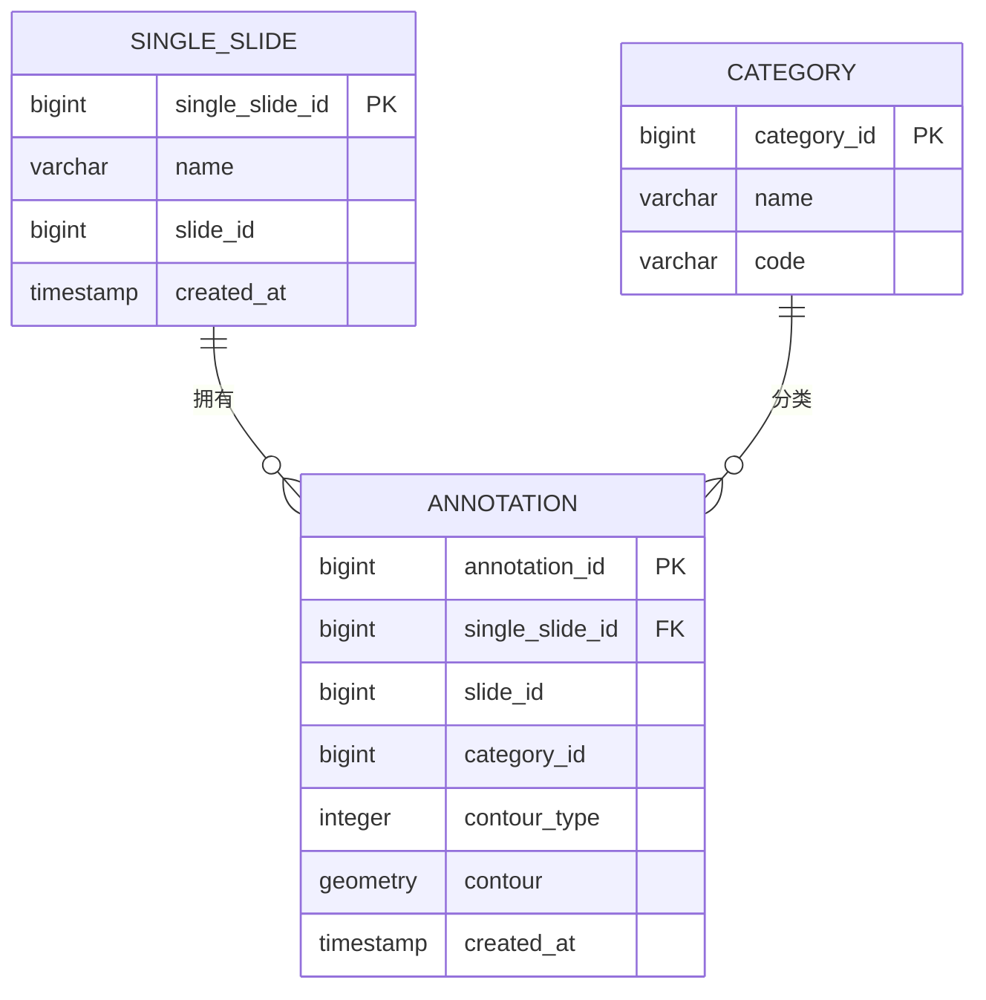
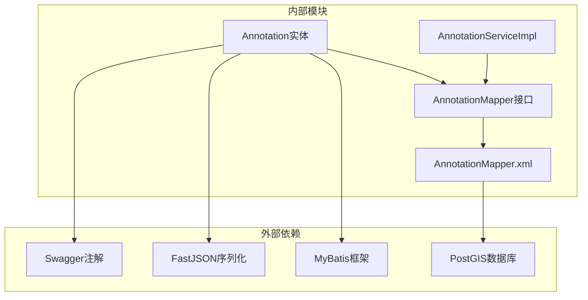

# Annotation实体设计

<cite>
**本文档引用的文件**
- [Annotation.java](file://src/main/java/cn/staitech/fr/domain/Annotation.java)
- [FrAnnotation.java](file://src/main/java/cn/staitech/fr/domain/FrAnnotation.java)
- [AnnotationMapper.java](file://src/main/java/cn/staitech/fr/mapper/AnnotationMapper.java)
- [FrAnnotationMapper.java](file://src/main/java/cn/staitech/fr/mapper/FrAnnotationMapper.java)
- [AnnotationMapper.xml](file://src/main/resources/mapper/AnnotationMapper.xml)
- [AnnotationServiceImpl.java](file://src/main/java/cn/staitech/fr/service/impl/AnnotationServiceImpl.java)
- [GeoJson.java](file://src/main/java/cn/staitech/fr/utils/geo/GeoJson.java)
- [CommonConstant.java](file://src/main/java/cn/staitech/fr/constant/CommonConstant.java)
</cite>

## 目录
1. [简介](#简介)
2. [项目结构](#项目结构)
3. [核心组件](#核心组件)
4. [架构概览](#架构概览)
5. [详细组件分析](#详细组件分析)
6. [依赖关系分析](#依赖关系分析)
7. [性能考虑](#性能考虑)
8. [故障排除指南](#故障排除指南)
9. [结论](#结论)

## 简介

Annotation实体是本项目中用于存储和管理标注数据的核心模型。该实体支持多种标注类型，包括AI生成的标注和用户手动绘制的标注，并提供了丰富的几何数据处理能力。本文档将详细说明Annotation实体的所有字段定义、几何表示方法、坐标系统、标注类型分类、验证规则、存储格式以及与单切片的关联关系。

## 项目结构

基于代码库分析，Annotation实体相关的文件分布如下：

**图表来源**
- [Annotation.java:1-352](file://src/main/java/cn/staitech/fr/domain/Annotation.java#L1-L352)
- [AnnotationMapper.java:1-137](file://src/main/java/cn/staitech/fr/mapper/AnnotationMapper.java#L1-L137)
- [AnnotationMapper.xml:1-1080](file://src/main/resources/mapper/AnnotationMapper.xml#L1-L1080)

**章节来源**
- [Annotation.java:1-352](file://src/main/java/cn/staitech/fr/domain/Annotation.java#L1-L352)
- [AnnotationMapper.java:1-137](file://src/main/java/cn/staitech/fr/mapper/AnnotationMapper.java#L1-L137)

## 核心组件

### Annotation实体（传统版本）

Annotation实体是传统的标注数据模型，支持以下核心功能：

- **几何数据存储**：支持多种分辨率级别的轮廓数据存储
- **标注类型管理**：区分AI标注和手动标注
- **多切片支持**：支持单切片和多切片标注
- **动态数据扩展**：支持动态数据字段

### FrAnnotation实体（新版本）

FrAnnotation实体是Annotation的现代化替代方案，具有更清晰的数据类型定义：

- **强类型字段**：使用BigDecimal存储面积和周长
- **标准化命名**：字段命名更加规范
- **简化结构**：移除了部分冗余字段

**章节来源**
- [Annotation.java:23-139](file://src/main/java/cn/staitech/fr/domain/Annotation.java#L23-L139)
- [FrAnnotation.java:30-123](file://src/main/java/cn/staitech/fr/domain/FrAnnotation.java#L30-L123)

## 架构概览

**图表来源**
- [Annotation.java:23-139](file://src/main/java/cn/staitech/fr/domain/Annotation.java#L23-L139)
- [FrAnnotation.java:30-123](file://src/main/java/cn/staitech/fr/domain/FrAnnotation.java#L30-L123)
- [AnnotationMapper.java:20-132](file://src/main/java/cn/staitech/fr/mapper/AnnotationMapper.java#L20-L132)

## 详细组件分析

### 字段定义详解

#### 基础标识字段
- **annotationId**：主键ID，自增生成
- **id**：GeoJSON中的数据ID
- **jsonId**：FrAnnotation版本的JSON ID字段

#### 几何数据字段
- **contour**：当前分辨率下的轮廓坐标（字符串格式）
- **contour40000/contour10000/contour2500/contour625**：不同分辨率级别的轮廓数据
- **contourPolygon**：矩形轮廓数据
- **contourType**：轮廓类型标识（1：矩形，2：标注轮廓）

#### 标注元数据字段
- **categoryId/tagId**：标注类别ID
- **locationType**：位置类型描述
- **annotationType**：标注类型（"AI"/"Draw"）
- **description**：标注描述信息

#### 关系字段
- **slideId**：切片ID
- **singleSlideId**：单切片ID
- **projectId**：项目ID

#### 时间戳字段
- **createTime/updateTime**：创建和更新时间
- **createBy/updateBy**：创建者和更新者ID

**章节来源**
- [Annotation.java:24-139](file://src/main/java/cn/staitech/fr/domain/Annotation.java#L24-L139)
- [FrAnnotation.java:34-118](file://src/main/java/cn/staitech/fr/domain/FrAnnotation.java#L34-L118)

### 几何表示方法和坐标系统

#### GeoJSON几何类型支持
系统支持标准的GeoJSON几何类型：
- Point：点坐标
- LineString：线段坐标
- Polygon：多边形坐标
- MultiPoint/MultiLineString/MultiPolygon：多重几何
- GeometryCollection：几何集合

#### 坐标系统
- **坐标格式**：采用GeoJSON标准的坐标数组格式
- **分辨率支持**：支持从625到40000的不同分辨率级别
- **空间参考**：使用PostGIS的geometry类型进行存储

#### 几何操作支持
系统提供了丰富的几何操作：
- **ST_AsGeoJSON**：几何数据与GeoJSON格式互转
- **ST_Union/Difference**：几何图形合并和差集运算
- **ST_Intersects**：几何图形相交检测
- **ST_IsValid**：几何图形有效性检查
- **ST_MakeValid**：几何图形修复

**章节来源**
- [GeoJson.java:4-20](file://src/main/java/cn/staitech/fr/utils/geo/GeoJson.java#L4-L20)
- [AnnotationMapper.xml:310-314](file://src/main/resources/mapper/AnnotationMapper.xml#L310-L314)
- [AnnotationMapper.xml:554-566](file://src/main/resources/mapper/AnnotationMapper.xml#L554-L566)

### 标注类型分类和编码规则

#### 标注类型编码
- **"AI"**：AI算法生成的标注数据
- **"Draw"**：用户手动绘制的标注数据
- **"Measure"**：测量工具产生的数据

#### 轮廓类型标识
- **contourType = 1**：矩形轮廓
- **contourType = 2**：精细轮廓
- **contourType = 3**：粗轮廓
- **默认值**：4（根据数据库表结构）

#### 类别ID规则
- **categoryId = 0**：特殊标记，通常表示无效或默认类别
- **非零值**：有效的标注类别ID

**章节来源**
- [CommonConstant.java:26](file://src/main/java/cn/staitech/fr/constant/CommonConstant.java#L26)
- [Annotation.java:56-58](file://src/main/java/cn/staitech/fr/domain/Annotation.java#L56-L58)
- [FrAnnotation.java:62-64](file://src/main/java/cn/staitech/fr/domain/FrAnnotation.java#L62-L64)
- [AnnotationMapper.xml:129-156](file://src/main/resources/mapper/AnnotationMapper.xml#L129-L156)

### 数据验证规则和约束条件

#### 基础验证规则
- **必填字段**：annotationId（自动生成），contour（几何数据）
- **长度限制**：字符串字段长度限制在500字符以内
- **数值范围**：面积和周长使用VARCHAR存储，实际为字符串数值

#### 几何数据验证
- **ST_IsValid**：自动验证几何数据的有效性
- **ST_MakeValid**：自动修复无效的几何数据
- **ST_AsGeoJSON**：确保GeoJSON格式的正确性

#### 业务逻辑约束
- **单切片唯一性**：singleSlideId + categoryId组合的唯一性
- **分辨率一致性**：不同分辨率级别的数据需要保持几何关系一致
- **类别有效性**：categoryId必须存在于系统中

**章节来源**
- [AnnotationMapper.xml:706-719](file://src/main/resources/mapper/AnnotationMapper.xml#L706-L719)
- [AnnotationMapper.xml:874-880](file://src/main/resources/mapper/AnnotationMapper.xml#L874-L880)

### 存储格式和序列化方式

#### 数据库存储格式
- **主要表**：fr_annotation（传统版本）
- **AI专用表**：fr_ai_annotation_{sequenceNumber}（新版本）
- **几何数据**：使用PostGIS的geometry类型存储

#### 序列化机制
- **Java对象**：使用MyBatis框架进行对象关系映射
- **GeoJSON转换**：通过ST_AsGeoJSON函数进行几何数据序列化
- **批量处理**：支持大容量数据的批量插入和更新

#### 缓存策略
- **多分辨率缓存**：不同分辨率级别的几何数据分别存储
- **内存优化**：使用byte[]类型存储二进制几何数据

**章节来源**
- [AnnotationMapper.xml:129-156](file://src/main/resources/mapper/AnnotationMapper.xml#L129-L156)
- [AnnotationMapper.xml:247-289](file://src/main/resources/mapper/AnnotationMapper.xml#L247-L289)

### 与单切片的关联关系和一对多映射

#### 关联关系设计

#### 一对多映射规则
- **单切片到标注**：一个单切片可以对应多个标注
- **标注到类别**：一个标注属于一个类别
- **分辨率层次**：同一标注在不同分辨率下有对应的几何数据

#### 查询优化
- **索引设计**：针对single_slide_id和category_id建立复合索引
- **分区策略**：按sequenceNumber对AI标注数据进行分区存储
- **查询优化**：使用ST_Intersects等空间函数进行高效查询

**图表来源**
- [AnnotationMapper.xml:162-184](file://src/main/resources/mapper/AnnotationMapper.xml#L162-L184)
- [AnnotationMapper.xml:129-156](file://src/main/resources/mapper/AnnotationMapper.xml#L129-L156)

**章节来源**
- [Annotation.java:131](file://src/main/java/cn/staitech/fr/domain/Annotation.java#L131)
- [AnnotationMapper.xml:392-442](file://src/main/resources/mapper/AnnotationMapper.xml#L392-L442)

## 依赖关系分析

**图表来源**
- [Annotation.java:3-11](file://src/main/java/cn/staitech/fr/domain/Annotation.java#L3-L11)
- [AnnotationMapper.java:3-6](file://src/main/java/cn/staitech/fr/mapper/AnnotationMapper.java#L3-L6)

### 外部依赖分析
- **MyBatis**：提供ORM映射和SQL执行能力
- **PostGIS**：提供空间数据类型和几何函数支持
- **FastJSON**：提供JSON序列化和反序列化功能
- **Swagger**：提供API文档生成能力

### 内部模块耦合
- **低耦合设计**：实体类与数据访问层分离
- **接口隔离**：通过Mapper接口实现数据访问抽象
- **服务层封装**：通过ServiceImpl封装业务逻辑

**章节来源**
- [AnnotationServiceImpl.java:22](file://src/main/java/cn/staitech/fr/service/impl/AnnotationServiceImpl.java#L22)
- [AnnotationMapper.java:18](file://src/main/java/cn/staitech/fr/mapper/AnnotationMapper.java#L18)

## 性能考虑

### 查询性能优化
- **索引策略**：为常用查询字段建立适当的索引
- **分区表**：按sequenceNumber对AI标注数据进行分区
- **批量处理**：支持大数据量的批量插入和更新

### 存储优化
- **多分辨率存储**：减少单一数据的存储大小
- **几何压缩**：利用PostGIS的几何类型进行高效存储
- **缓存机制**：支持多级缓存策略

### 计算优化
- **空间函数优化**：使用PostGIS内置的空间函数
- **并行处理**：支持多线程并发处理
- **内存管理**：合理控制内存使用量

## 故障排除指南

### 常见问题及解决方案

#### 几何数据无效
**问题现象**：ST_IsValid返回false
**解决方法**：使用ST_MakeValid修复几何数据

#### 批量导入失败
**问题现象**：批量插入抛出异常
**解决方法**：分批处理，逐条验证数据有效性

#### 查询性能问题
**问题现象**：复杂几何查询响应缓慢
**解决方法**：添加适当的索引，优化查询条件

#### 内存溢出
**问题现象**：处理大量几何数据时内存不足
**解决方法**：分批处理，及时释放内存

**章节来源**
- [AnnotationServiceImpl.java:49-71](file://src/main/java/cn/staitech/fr/service/impl/AnnotationServiceImpl.java#L49-L71)
- [AnnotationMapper.xml:706-719](file://src/main/resources/mapper/AnnotationMapper.xml#L706-L719)

## 结论

Annotation实体设计体现了现代标注系统的完整功能需求。通过支持多种标注类型、多分辨率几何数据、丰富的几何操作和高效的存储方案，该设计能够满足复杂的医学图像标注场景需求。

关键设计亮点包括：
- **灵活的几何数据模型**：支持多种分辨率和几何类型
- **完善的验证机制**：确保数据质量和几何有效性
- **高性能的存储方案**：利用PostGIS优化空间数据处理
- **清晰的业务逻辑**：通过单切片关联实现精确的数据管理

该设计为后续的功能扩展和性能优化奠定了良好的基础，能够适应不断增长的标注数据处理需求。