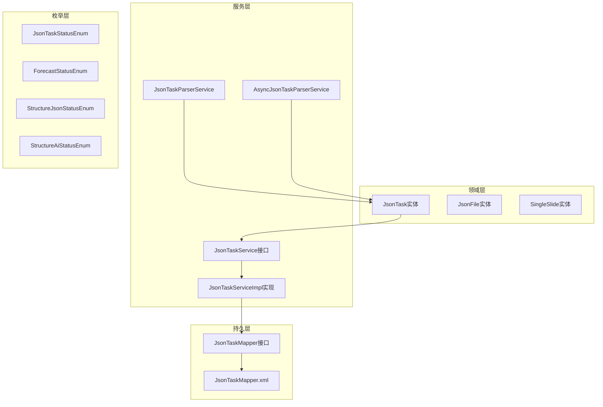
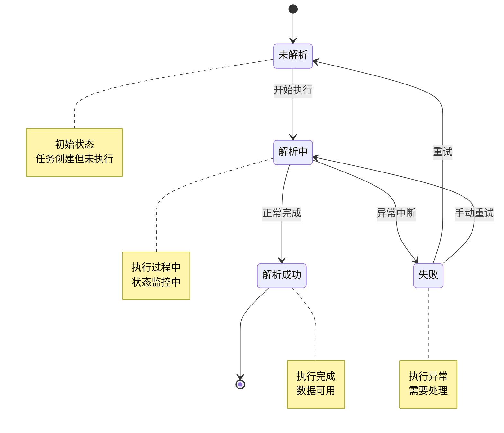
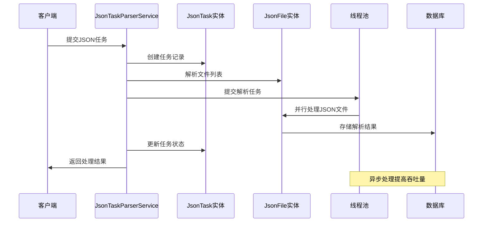
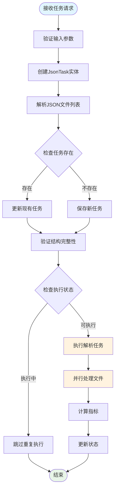
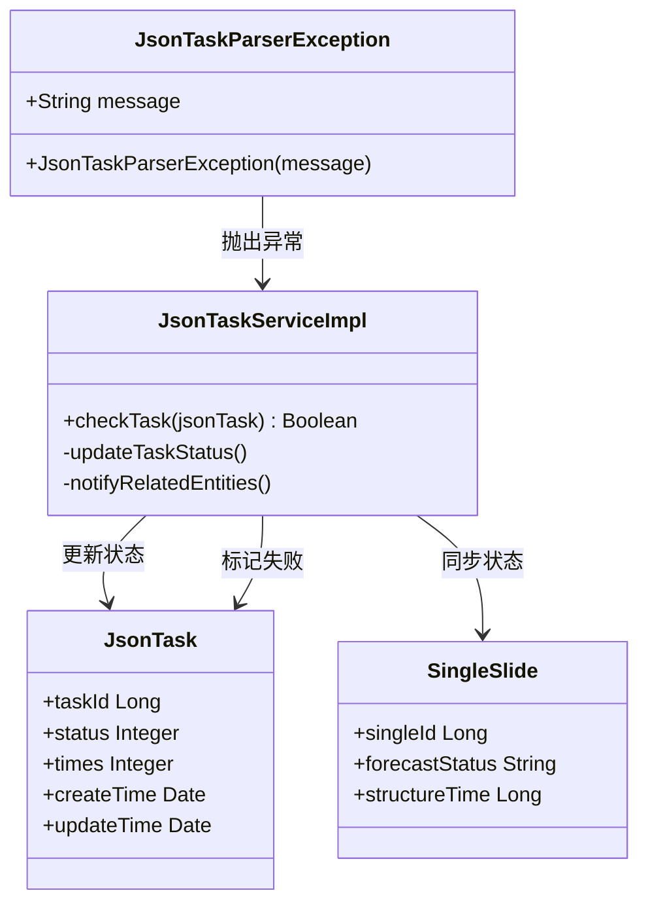
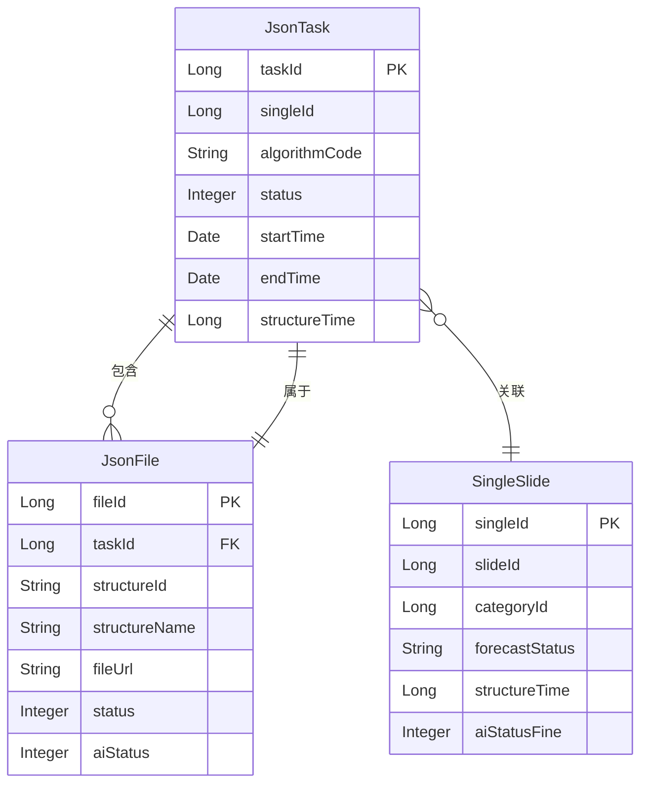
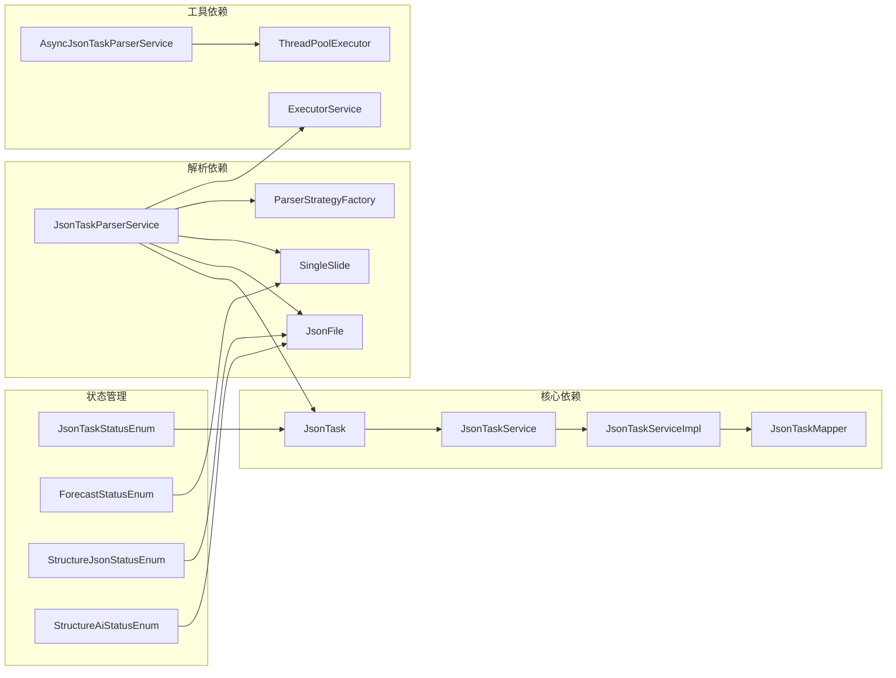

# JsonTask实体设计

<cite>
**本文档引用的文件**
- [JsonTask.java](file://src/main/java/cn/staitech/fr/domain/JsonTask.java)
- [JsonTaskStatusEnum.java](file://src/main/java/cn/staitech/fr/enums/JsonTaskStatusEnum.java)
- [JsonTaskService.java](file://src/main/java/cn/staitech/fr/service/JsonTaskService.java)
- [JsonTaskServiceImpl.java](file://src/main/java/cn/staitech/fr/service/impl/JsonTaskServiceImpl.java)
- [JsonTaskMapper.java](file://src/main/java/cn/staitech/fr/mapper/JsonTaskMapper.java)
- [JsonTaskMapper.xml](file://src/main/resources/mapper/JsonTaskMapper.xml)
- [JsonTaskParserService.java](file://src/main/java/cn/staitech/fr/service/strategy/json/JsonTaskParserService.java)
- [AsyncJsonTaskParserService.java](file://src/main/java/cn/staitech/fr/service/strategy/json/AsyncJsonTaskParserService.java)
- [JsonTaskParserException.java](file://src/main/java/cn/staitech/fr/service/strategy/json/JsonTaskParserException.java)
- [JsonFile.java](file://src/main/java/cn/staitech/fr/domain/JsonFile.java)
- [SingleSlide.java](file://src/main/java/cn/staitech/fr/domain/SingleSlide.java)
- [ForecastStatusEnum.java](file://src/main/java/cn/staitech/fr/enums/ForecastStatusEnum.java)
- [StructureJsonStatusEnum.java](file://src/main/java/cn/staitech/fr/enums/StructureJsonStatusEnum.java)
- [StructureAiStatusEnum.java](file://src/main/java/cn/staitech/fr/enums/StructureAiStatusEnum.java)
</cite>

## 目录
1. [简介](#简介)
2. [项目结构](#项目结构)
3. [核心组件](#核心组件)
4. [架构概览](#架构概览)
5. [详细组件分析](#详细组件分析)
6. [依赖分析](#依赖分析)
7. [性能考虑](#性能考虑)
8. [故障排除指南](#故障排除指南)
9. [结论](#结论)

## 简介

JsonTask实体是本系统中用于管理JSON任务的核心数据模型。该实体承载着AI预测任务的完整生命周期信息，包括任务状态跟踪、算法执行监控、错误处理机制等关键功能。本文档将深入分析JsonTask实体的设计理念、字段定义、状态管理以及与AI预测系统的集成关系。

## 项目结构

系统采用分层架构设计，JsonTask实体位于领域层，配合服务层、映射层和枚举层共同构成完整的任务管理系统：

**图表来源**
- [JsonTask.java:1-69](file://src/main/java/cn/staitech/fr/domain/JsonTask.java#L1-L69)
- [JsonTaskService.java:1-16](file://src/main/java/cn/staitech/fr/service/JsonTaskService.java#L1-L16)
- [JsonTaskMapper.java:1-16](file://src/main/java/cn/staitech/fr/mapper/JsonTaskMapper.java#L1-L16)

**章节来源**
- [JsonTask.java:1-69](file://src/main/java/cn/staitech/fr/domain/JsonTask.java#L1-L69)
- [JsonTaskService.java:1-16](file://src/main/java/cn/staitech/fr/service/JsonTaskService.java#L1-L16)
- [JsonTaskMapper.java:1-16](file://src/main/java/cn/staitech/fr/mapper/JsonTaskMapper.java#L1-L16)

## 核心组件

### JsonTask实体字段定义

JsonTask实体作为JSON任务的核心载体，包含以下关键字段：

| 字段名 | 类型 | 描述 | 约束条件 |
|--------|------|------|----------|
| taskId | Long | 任务ID | 主键，自增 |
| slideId | Long | 切片ID | 外键关联切片 |
| specialId | Long | 专题ID | 项目ID |
| imageId | Long | 图像ID | 关联图像文件 |
| singleId | Long | 单脏器切片ID | 唯一标识 |
| organizationId | Long | 机构ID | 组织关联 |
| categoryId | Long | 脏器标签ID | 脏器分类 |
| algorithmCode | String | 算法名称标识 | 唯一约束 |
| code | String | 状态码 | 业务状态 |
| msg | String | 消息内容 | 错误信息 |
| data | String | 数据内容 | JSON字符串 |
| status | Integer | 状态 | 0未解析、1解析中、2成功、3失败 |
| times | Integer | 执行次数 | 默认0 |
| startTime | Date | 开始时间 | 时间戳 |
| endTime | Date | 结束时间 | 时间戳 |
| createTime | Date | 创建时间 | 时间戳 |
| updateTime | Date | 更新时间 | 时间戳 |
| structureTime | Long | 结构化时间 | 非持久化字段 |

### 状态枚举体系

系统采用多层状态管理机制，确保任务执行的可追踪性和可恢复性：

**图表来源**
- [JsonTaskStatusEnum.java:1-16](file://src/main/java/cn/staitech/fr/enums/JsonTaskStatusEnum.java#L1-L16)

**章节来源**
- [JsonTask.java:26-66](file://src/main/java/cn/staitech/fr/domain/JsonTask.java#L26-L66)
- [JsonTaskStatusEnum.java:1-16](file://src/main/java/cn/staitech/fr/enums/JsonTaskStatusEnum.java#L1-L16)

## 架构概览

系统采用异步处理架构，通过线程池管理和任务队列实现高并发的JSON文件解析：

**图表来源**
- [JsonTaskParserService.java:174-263](file://src/main/java/cn/staitech/fr/service/strategy/json/JsonTaskParserService.java#L174-L263)
- [AsyncJsonTaskParserService.java:68-213](file://src/main/java/cn/staitech/fr/service/strategy/json/AsyncJsonTaskParserService.java#L68-L213)

**章节来源**
- [JsonTaskParserService.java:54-107](file://src/main/java/cn/staitech/fr/service/strategy/json/JsonTaskParserService.java#L54-L107)
- [AsyncJsonTaskParserService.java:28-42](file://src/main/java/cn/staitech/fr/service/strategy/json/AsyncJsonTaskParserService.java#L28-L42)

## 详细组件分析

### 任务调度与执行流程

JsonTaskParserService负责协调整个任务执行流程，包括任务创建、文件解析和状态管理：

**图表来源**
- [JsonTaskParserService.java:174-263](file://src/main/java/cn/staitech/fr/service/strategy/json/JsonTaskParserService.java#L174-L263)
- [JsonTaskParserService.java:265-452](file://src/main/java/cn/staitech/fr/service/strategy/json/JsonTaskParserService.java#L265-L452)

### 错误处理与重试机制

系统实现了多层次的错误处理和重试策略：

**图表来源**
- [JsonTaskParserException.java:1-16](file://src/main/java/cn/staitech/fr/service/strategy/json/JsonTaskParserException.java#L1-L16)
- [JsonTaskServiceImpl.java:31-52](file://src/main/java/cn/staitech/fr/service/impl/JsonTaskServiceImpl.java#L31-L52)

**章节来源**
- [JsonTaskParserException.java:1-16](file://src/main/java/cn/staitech/fr/service/strategy/json/JsonTaskParserException.java#L1-L16)
- [JsonTaskServiceImpl.java:19-52](file://src/main/java/cn/staitech/fr/service/impl/JsonTaskServiceImpl.java#L19-L52)

### AI预测结果关联关系

JsonTask实体与AI预测系统建立了紧密的关联关系：

**图表来源**
- [JsonTask.java:26-66](file://src/main/java/cn/staitech/fr/domain/JsonTask.java#L26-L66)
- [JsonFile.java:22-50](file://src/main/java/cn/staitech/fr/domain/JsonFile.java#L22-L50)
- [SingleSlide.java:20-76](file://src/main/java/cn/staitech/fr/domain/SingleSlide.java#L20-L76)

**章节来源**
- [JsonTask.java:26-66](file://src/main/java/cn/staitech/fr/domain/JsonTask.java#L26-L66)
- [JsonFile.java:22-50](file://src/main/java/cn/staitech/fr/domain/JsonFile.java#L22-L50)
- [SingleSlide.java:20-76](file://src/main/java/cn/staitech/fr/domain/SingleSlide.java#L20-L76)

## 依赖分析

系统各组件间的依赖关系清晰明确，遵循单一职责原则：

**图表来源**
- [JsonTaskParserService.java:54-107](file://src/main/java/cn/staitech/fr/service/strategy/json/JsonTaskParserService.java#L54-L107)
- [AsyncJsonTaskParserService.java:28-42](file://src/main/java/cn/staitech/fr/service/strategy/json/AsyncJsonTaskParserService.java#L28-L42)

**章节来源**
- [JsonTaskParserService.java:54-107](file://src/main/java/cn/staitech/fr/service/strategy/json/JsonTaskParserService.java#L54-L107)
- [AsyncJsonTaskParserService.java:28-42](file://src/main/java/cn/staitech/fr/service/strategy/json/AsyncJsonTaskParserService.java#L28-L42)

## 性能考虑

系统在设计时充分考虑了性能优化：

1. **异步处理**: 使用线程池并行处理多个JSON文件，提高整体吞吐量
2. **状态缓存**: 通过状态枚举减少数据库查询开销
3. **批量操作**: 支持批量插入和更新操作
4. **连接池**: 利用MyBatis Plus的连接池管理
5. **内存管理**: 非持久化字段避免数据库压力

## 故障排除指南

### 常见问题及解决方案

| 问题类型 | 症状 | 可能原因 | 解决方案 |
|----------|------|----------|----------|
| 任务状态异常 | 状态码不正确 | 数据库连接问题 | 检查数据库连接和事务配置 |
| 文件解析失败 | JSON解析异常 | 文件格式错误 | 验证JSON文件格式和编码 |
| 线程池阻塞 | 处理延迟增加 | 线程池配置不当 | 调整线程池大小和队列长度 |
| 内存溢出 | 系统崩溃 | 大文件处理 | 实施文件大小限制和流式处理 |

### 调试建议

1. **日志监控**: 启用详细的DEBUG级别日志
2. **状态检查**: 定期检查任务状态一致性
3. **性能监控**: 监控线程池使用率和数据库响应时间
4. **错误报告**: 建立完善的错误报告和重试机制

**章节来源**
- [JsonTaskParserException.java:1-16](file://src/main/java/cn/staitech/fr/service/strategy/json/JsonTaskParserException.java#L1-L16)
- [JsonTaskServiceImpl.java:31-52](file://src/main/java/cn/staitech/fr/service/impl/JsonTaskServiceImpl.java#L31-L52)

## 结论

JsonTask实体设计体现了现代企业级应用的最佳实践，通过清晰的领域建模、完善的枚举体系和健壮的错误处理机制，为AI预测任务提供了可靠的数据支撑。系统采用异步处理架构，在保证数据一致性的同时实现了高效的并发处理能力。

该设计的主要优势包括：
- **模块化设计**: 清晰的职责分离和依赖管理
- **可扩展性**: 支持多种算法和解析策略
- **可靠性**: 完善的错误处理和重试机制
- **性能优化**: 异步处理和批量操作支持
- **可观测性**: 详细的状态跟踪和日志记录

通过持续的监控和优化，JsonTask实体将继续为系统的稳定运行提供坚实的基础。