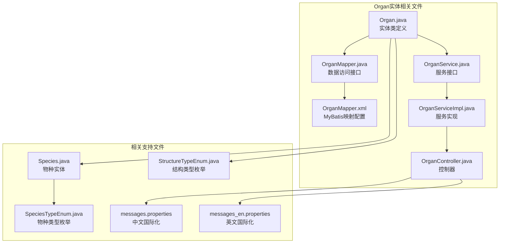
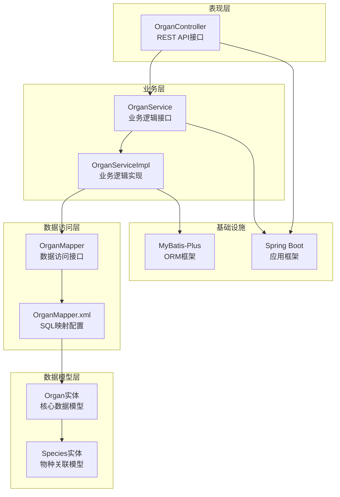
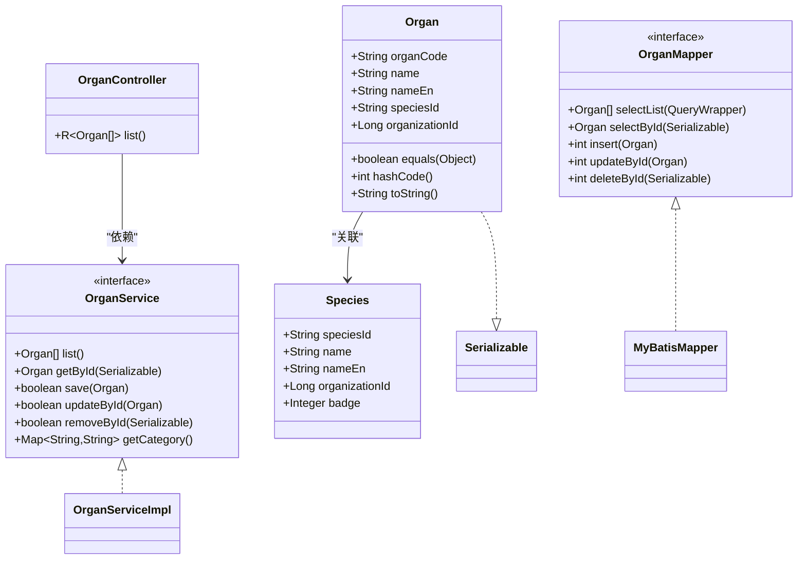
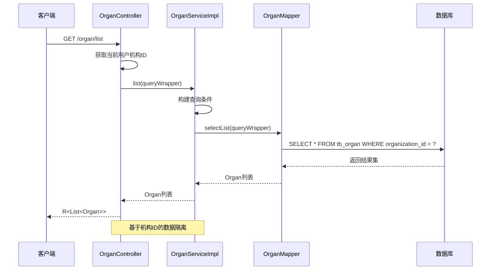
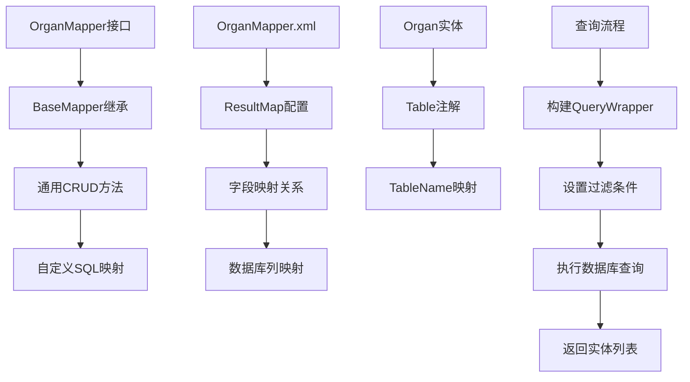
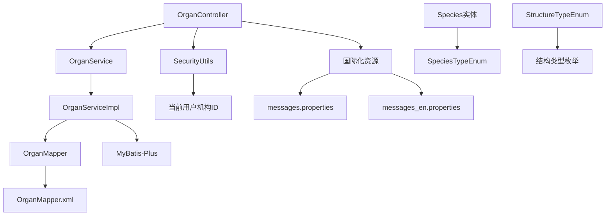

# Organ实体设计

<cite>
**本文档引用的文件**
- [Organ.java](file://src/main/java/cn/staitech/fr/domain/Organ.java)
- [OrganMapper.java](file://src/main/java/cn/staitech/fr/mapper/OrganMapper.java)
- [OrganMapper.xml](file://src/main/resources/mapper/OrganMapper.xml)
- [OrganService.java](file://src/main/java/cn/staitech/fr/service/OrganService.java)
- [OrganServiceImpl.java](file://src/main/java/cn/staitech/fr/service/impl/OrganServiceImpl.java)
- [OrganController.java](file://src/main/java/cn/staitech/fr/controller/OrganController.java)
- [Species.java](file://src/main/java/cn/staitech/fr/domain/Species.java)
- [SpeciesTypeEnum.java](file://src/main/java/cn/staitech/fr/enmu/SpeciesTypeEnum.java)
- [StructureTypeEnum.java](file://src/main/java/cn/staitech/fr/enums/StructureTypeEnum.java)
- [messages.properties](file://src/main/resources/i18n/messages.properties)
- [messages_en.properties](file://src/main/resources/i18n/messages_en.properties)
</cite>

## 目录
1. [简介](#简介)
2. [项目结构](#项目结构)
3. [核心组件](#核心组件)
4. [架构概览](#架构概览)
5. [详细组件分析](#详细组件分析)
6. [依赖关系分析](#依赖关系分析)
7. [性能考虑](#性能考虑)
8. [故障排除指南](#故障排除指南)
9. [结论](#结论)

## 简介

Organ实体是本系统中的核心数据模型，用于表示解剖学上的脏器实体。该实体承载了脏器的基本信息，包括脏器编码、名称、类型、物种分类等关键属性。通过Organ实体，系统能够实现跨物种的脏器标准化管理，支持多语言显示，并为后续的组织结构关联提供基础数据支撑。

本设计文档将深入分析Organ实体的字段定义、数据结构、业务逻辑以及与其他组件的交互关系，为开发者提供全面的技术参考。

## 项目结构

基于当前代码库的组织结构，Organ实体相关的核心文件分布如下：



**图表来源**
- [Organ.java:1-88](file://src/main/java/cn/staitech/fr/domain/Organ.java#L1-L88)
- [OrganMapper.java:1-19](file://src/main/java/cn/staitech/fr/mapper/OrganMapper.java#L1-L19)
- [OrganMapper.xml:1-20](file://src/main/resources/mapper/OrganMapper.xml#L1-L20)

**章节来源**
- [Organ.java:1-88](file://src/main/java/cn/staitech/fr/domain/Organ.java#L1-L88)
- [OrganMapper.java:1-19](file://src/main/java/cn/staitech/fr/mapper/OrganMapper.java#L1-L19)
- [OrganMapper.xml:1-20](file://src/main/resources/mapper/OrganMapper.xml#L1-L20)

## 核心组件

### 数据模型设计

Organ实体采用标准的Java Bean模式，通过MyBatis-Plus框架进行ORM映射。实体类设计遵循以下原则：

- **序列化支持**：实现Serializable接口，支持对象序列化传输
- **JSON映射**：使用@JsonProperty注解，确保JSON序列化时的字段名转换
- **数据库映射**：通过@Table注解指定对应的数据库表名
- **相等性比较**：重写equals和hashCode方法，基于所有字段进行比较

### 字段定义详解

| 字段名称 | Java属性 | 数据库列名 | 类型 | 长度 | 是否可空 | 描述 |
|---------|----------|------------|------|------|----------|------|
| 脏器编码 | organCode | organ_code | VARCHAR | 50 | 否 | 脏器的唯一标识符，JSON序列化时使用organId键名 |
| 脏器名称 | name | name | VARCHAR | 100 | 否 | 脏器的中文名称 |
| 脏器名称EN | nameEn | name_en | VARCHAR | 100 | 是 | 脏器的英文名称，支持国际化显示 |
| 种属编码 | speciesId | species_id | VARCHAR | 20 | 否 | 关联到物种表的外键标识 |
| 机构ID | organizationId | organization_id | BIGINT | - | 是 | 所属机构的标识，用于多租户隔离 |

### 关键特性

1. **多语言支持**：通过name和nameEn字段实现中英文双语显示
2. **机构隔离**：organizationId字段确保数据按机构进行隔离
3. **外键关联**：speciesId字段与Species实体建立一对多关系
4. **序列化兼容**：支持Spring MVC的JSON序列化和反序列化

**章节来源**
- [Organ.java:13-40](file://src/main/java/cn/staitech/fr/domain/Organ.java#L13-L40)

## 架构概览

Organ实体在整个系统架构中扮演着核心数据模型的角色，其架构设计体现了分层架构的最佳实践：



**图表来源**
- [OrganController.java:1-43](file://src/main/java/cn/staitech/fr/controller/OrganController.java#L1-L43)
- [OrganService.java:1-16](file://src/main/java/cn/staitech/fr/service/OrganService.java#L1-L16)
- [OrganServiceImpl.java:1-38](file://src/main/java/cn/staitech/fr/service/impl/OrganServiceImpl.java#L1-L38)
- [OrganMapper.java:1-19](file://src/main/java/cn/staitech/fr/mapper/OrganMapper.java#L1-L19)

## 详细组件分析

### 实体类设计分析



**图表来源**
- [Organ.java:10-88](file://src/main/java/cn/staitech/fr/domain/Organ.java#L10-L88)
- [OrganMapper.java:12-14](file://src/main/java/cn/staitech/fr/mapper/OrganMapper.java#L12-L14)
- [OrganService.java:13-15](file://src/main/java/cn/staitech/fr/service/OrganService.java#L13-L15)
- [OrganController.java:29-42](file://src/main/java/cn/staitech/fr/controller/OrganController.java#L29-L42)

### 服务层实现分析

OrganServiceImpl提供了完整的CRUD操作和特殊业务逻辑：



**图表来源**
- [OrganController.java:33-40](file://src/main/java/cn/staitech/fr/controller/OrganController.java#L33-L40)
- [OrganServiceImpl.java:24-32](file://src/main/java/cn/staitech/fr/service/impl/OrganServiceImpl.java#L24-L32)

### 数据访问层设计

MyBatis-Plus提供了强大的ORM功能，简化了数据库操作：



**图表来源**
- [OrganMapper.java:12-14](file://src/main/java/cn/staitech/fr/mapper/OrganMapper.java#L12-L14)
- [OrganMapper.xml:7-18](file://src/main/resources/mapper/OrganMapper.xml#L7-L18)

**章节来源**
- [OrganServiceImpl.java:16-38](file://src/main/java/cn/staitech/fr/service/impl/OrganServiceImpl.java#L16-L38)
- [OrganMapper.xml:15-18](file://src/main/resources/mapper/OrganMapper.xml#L15-L18)

### 国际化支持机制

系统通过多语言资源文件实现国际化支持：

| 国际化文件 | 语言 | 主要用途 |
|-----------|------|----------|
| messages.properties | 中文 | 中文界面显示和错误提示 |
| messages_en.properties | 英文 | 英文界面显示和错误提示 |
| messages_zh.properties | 中文简体 | 可选的中文简体资源文件 |

国际化支持体现在多个层面：
1. **脏器名称显示**：通过nameEn字段支持英文显示
2. **错误消息国际化**：通过资源文件管理多语言错误信息
3. **API响应本地化**：结合前端语言设置动态切换显示语言

**章节来源**
- [Organ.java:25-27](file://src/main/java/cn/staitech/fr/domain/Organ.java#L25-L27)
- [messages.properties:1-51](file://src/main/resources/i18n/messages.properties#L1-L51)
- [messages_en.properties:1-45](file://src/main/resources/i18n/messages_en.properties#L1-L45)

## 依赖关系分析

### 外部依赖关系

```mermaid
graph LR
subgraph "核心依赖"
A[MyBatis-Plus]
B[Lombok]
C[Jackson]
D[Spring Boot]
end
subgraph "Organ实体依赖"
E[Serializable接口]
F@Table注解
G@JsonProperty注解
H[EqualsAndHashCode注解]
end
A --> E
B --> F
B --> G
B --> H
C --> G
D --> A
```

**图表来源**
- [Organ.java:3-8](file://src/main/java/cn/staitech/fr/domain/Organ.java#L3-L8)
- [OrganMapper.java:4-4](file://src/main/java/cn/staitech/fr/mapper/OrganMapper.java#L4-L4)

### 内部组件依赖



**图表来源**
- [OrganController.java:30-31](file://src/main/java/cn/staitech/fr/controller/OrganController.java#L30-L31)
- [OrganServiceImpl.java:22-23](file://src/main/java/cn/staitech/fr/service/impl/OrganServiceImpl.java#L22-L23)

**章节来源**
- [OrganController.java:1-43](file://src/main/java/cn/staitech/fr/controller/OrganController.java#L1-L43)
- [OrganService.java:1-16](file://src/main/java/cn/staitech/fr/service/OrganService.java#L1-L16)

## 性能考虑

### 查询优化策略

1. **索引设计建议**：
   - 在organization_id列上建立索引，支持按机构快速过滤
   - 在organ_code列上建立唯一索引，确保脏器编码的唯一性
   - 在species_id列上建立索引，支持物种维度的快速查询

2. **缓存策略**：
   - 利用MyBatis二级缓存减少重复查询
   - 对常用的脏器列表查询结果进行内存缓存
   - 结合Redis实现分布式缓存

3. **分页查询**：
   - 对于大量脏器数据的查询，建议使用分页机制
   - 结合条件过滤，避免全表扫描

### 内存使用优化

1. **对象池化**：对于频繁创建销毁的Organ对象，考虑使用对象池
2. **延迟加载**：对于不常用的大字段，考虑使用延迟加载机制
3. **批量操作**：对于大批量的脏器数据操作，使用批量处理方式

## 故障排除指南

### 常见问题及解决方案

1. **脏器编码冲突**
   - 症状：保存脏器时提示编码已存在
   - 解决方案：检查organ_code字段的唯一性约束，确保编码的唯一性

2. **机构权限问题**
   - 症状：无法查询到其他机构的脏器数据
   - 解决方案：确认当前用户的organizationId是否正确设置

3. **国际化显示异常**
   - 症状：脏器名称显示为英文或乱码
   - 解决方案：检查messages.properties和messages_en.properties文件的编码设置

4. **数据库连接问题**
   - 症状：查询脏器列表时报数据库连接异常
   - 解决方案：检查数据库连接配置和网络连通性

### 调试技巧

1. **日志分析**：通过Controller层的日志输出分析请求处理流程
2. **数据库监控**：监控SQL执行时间和执行计划
3. **性能分析**：使用Profiler工具分析方法调用耗时

**章节来源**
- [messages.properties:1-51](file://src/main/resources/i18n/messages.properties#L1-L51)
- [messages_en.properties:1-45](file://src/main/resources/i18n/messages_en.properties#L1-L45)

## 结论

Organ实体作为系统的核心数据模型，通过精心设计的字段结构、完善的业务逻辑和良好的扩展性，为脏器管理功能提供了坚实的基础。该设计充分考虑了多语言支持、机构隔离、性能优化等多个方面的需求。

主要特点包括：
- **标准化的数据模型**：清晰的字段定义和合理的数据类型选择
- **完善的国际化支持**：双语显示能力和资源文件管理机制
- **良好的扩展性**：基于接口的分层架构便于功能扩展
- **性能优化考虑**：缓存策略和查询优化建议

未来可以考虑的改进方向：
- 添加脏器层级关系的支持
- 增加脏器状态管理和版本控制
- 扩展脏器与组织结构的关联关系
- 增强脏器数据的验证和校验机制