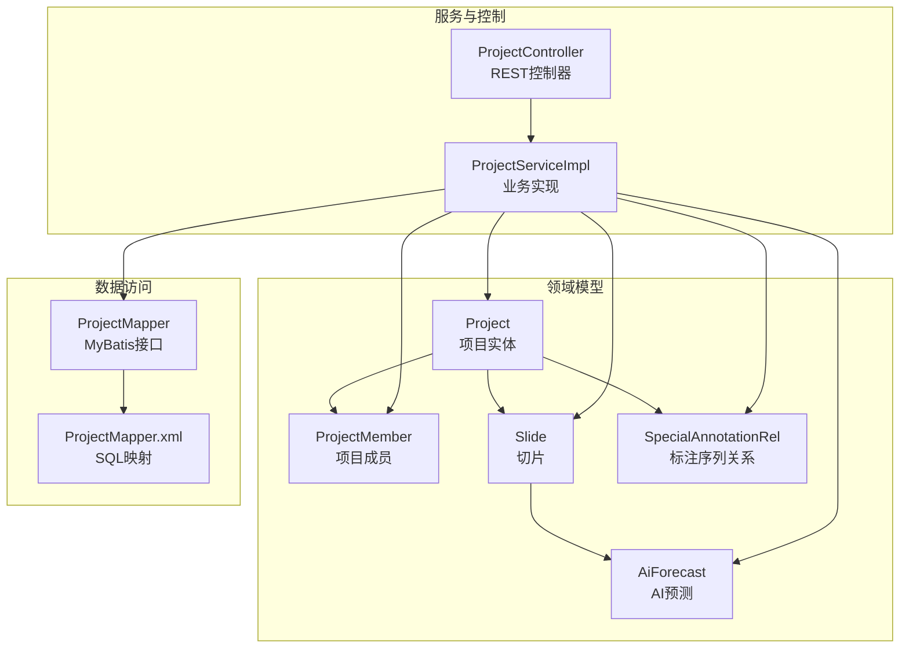
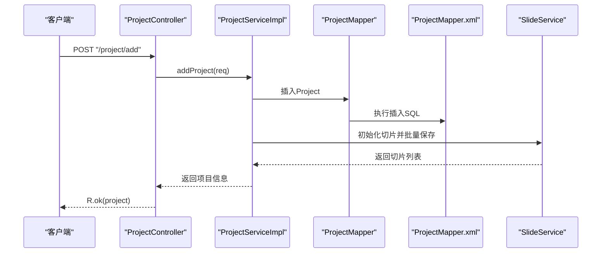
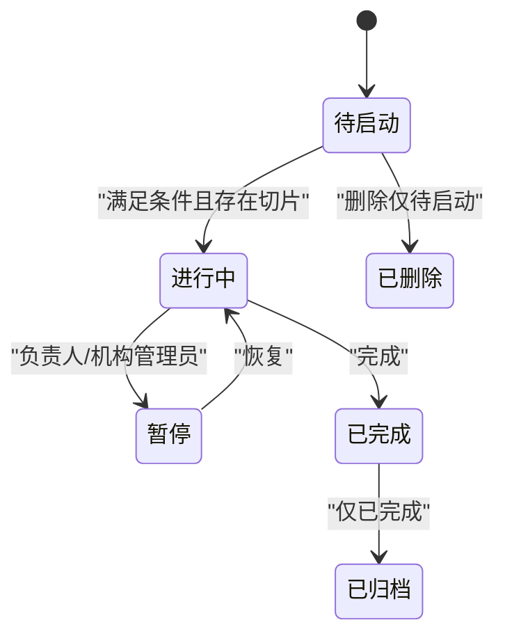
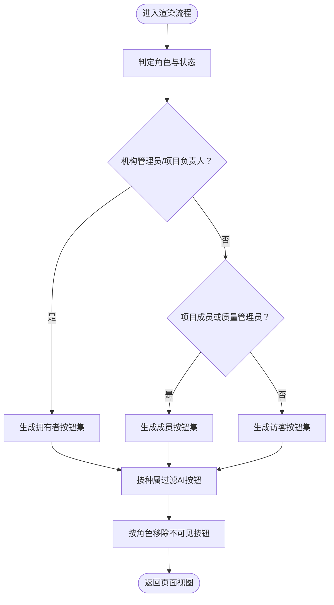
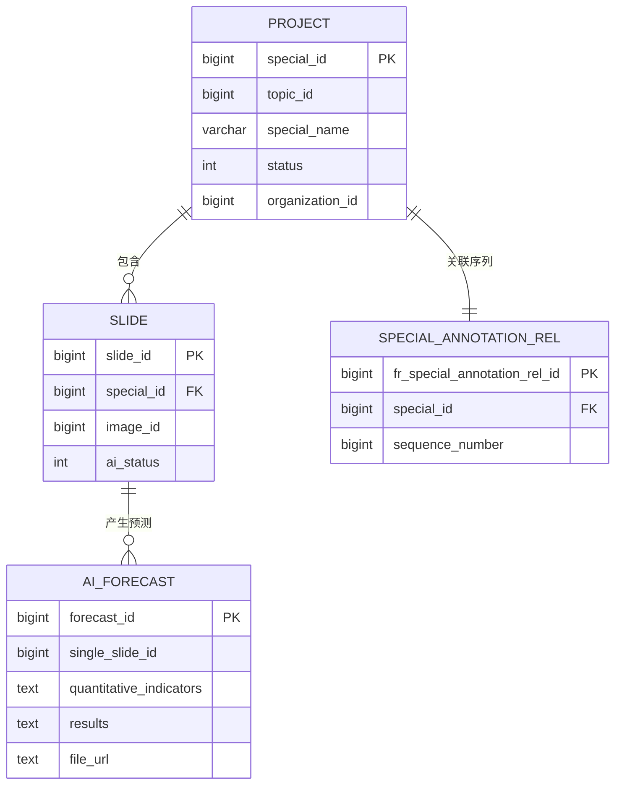
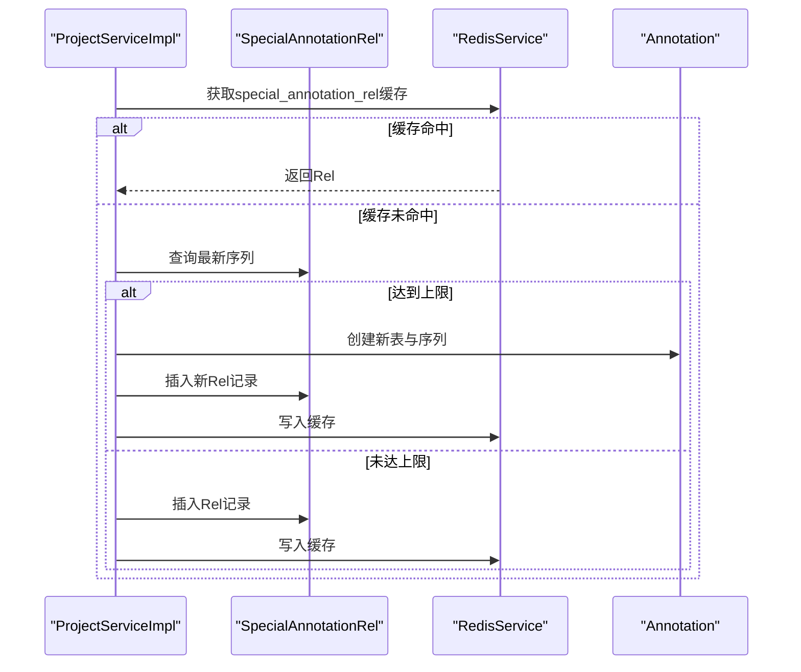
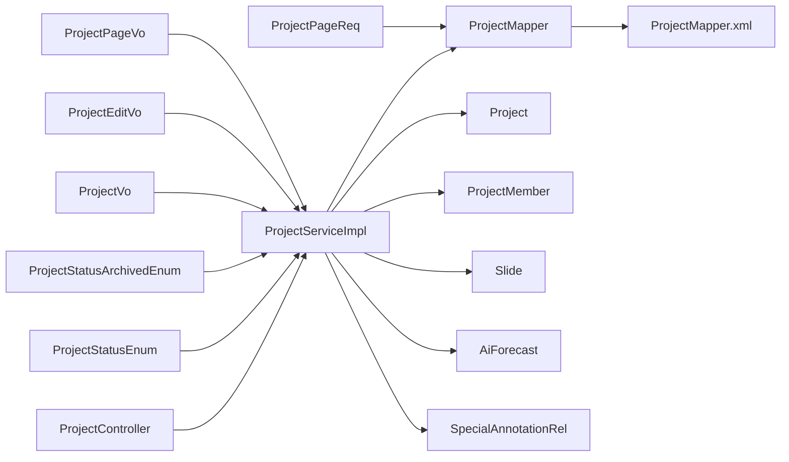

# Project实体设计

<cite>
**本文引用的文件**
- [Project.java](file://src/main/java/cn/staitech/fr/domain/Project.java)
- [ProjectMember.java](file://src/main/java/cn/staitech/fr/domain/ProjectMember.java)
- [ProjectStatusEnum.java](file://src/main/java/cn/staitech/fr/enums/ProjectStatusEnum.java)
- [ProjectStatusArchivedEnum.java](file://src/main/java/cn/staitech/fr/enums/ProjectStatusArchivedEnum.java)
- [ProjectServiceImpl.java](file://src/main/java/cn/staitech/fr/service/impl/ProjectServiceImpl.java)
- [ProjectController.java](file://src/main/java/cn/staitech/fr/controller/ProjectController.java)
- [ProjectMapper.java](file://src/main/java/cn/staitech/fr/mapper/ProjectMapper.java)
- [ProjectMapper.xml](file://src/main/resources/mapper/ProjectMapper.xml)
- [ProjectVo.java](file://src/main/java/cn/staitech/fr/vo/project/ProjectVo.java)
- [ProjectEditVo.java](file://src/main/java/cn/staitech/fr/vo/project/ProjectEditVo.java)
- [ProjectPageReq.java](file://src/main/java/cn/staitech/fr/vo/project/ProjectPageReq.java)
- [ProjectPageVo.java](file://src/main/java/cn/staitech/fr/vo/project/ProjectPageVo.java)
- [Slide.java](file://src/main/java/cn/staitech/fr/domain/Slide.java)
- [AiForecast.java](file://src/main/java/cn/staitech/fr/domain/AiForecast.java)
- [SpecialAnnotationRel.java](file://src/main/java/cn/staitech/fr/domain/SpecialAnnotationRel.java)
</cite>

## 目录
1. [简介](#简介)
2. [项目结构](#项目结构)
3. [核心组件](#核心组件)
4. [架构总览](#架构总览)
5. [详细组件分析](#详细组件分析)
6. [依赖分析](#依赖分析)
7. [性能考虑](#性能考虑)
8. [故障排查指南](#故障排查指南)
9. [结论](#结论)
10. [附录](#附录)

## 简介
本设计文档围绕“Project实体”展开，系统性阐述项目实体的字段定义、状态生命周期与转换规则、权限控制与成员角色分配、与切片（Slide）、标注（Annotation）及AI预测（AiForecast）的关系，以及版本管理与历史记录机制，并说明项目模板与预设配置的使用方式。文档同时提供面向开发与非技术读者的可视化图示与流程说明。

## 项目结构
- 实体层：Project、ProjectMember、Slide、AiForecast、SpecialAnnotationRel
- 枚举层：ProjectStatusEnum、ProjectStatusArchivedEnum
- 控制层：ProjectController
- 服务层：ProjectServiceImpl
- 数据访问层：ProjectMapper、ProjectMapper.xml
- 视图对象：ProjectVo、ProjectEditVo、ProjectPageReq、ProjectPageVo

图表来源
- [Project.java:32-116](file://src/main/java/cn/staitech/fr/domain/Project.java#L32-L116)
- [ProjectMember.java:29-64](file://src/main/java/cn/staitech/fr/domain/ProjectMember.java#L29-L64)
- [Slide.java:28-94](file://src/main/java/cn/staitech/fr/domain/Slide.java#L28-L94)
- [AiForecast.java:18-83](file://src/main/java/cn/staitech/fr/domain/AiForecast.java#L18-L83)
- [SpecialAnnotationRel.java:16-54](file://src/main/java/cn/staitech/fr/domain/SpecialAnnotationRel.java#L16-L54)
- [ProjectController.java:52-284](file://src/main/java/cn/staitech/fr/controller/ProjectController.java#L52-L284)
- [ProjectServiceImpl.java:56-557](file://src/main/java/cn/staitech/fr/service/impl/ProjectServiceImpl.java#L56-L557)
- [ProjectMapper.java:16-19](file://src/main/java/cn/staitech/fr/mapper/ProjectMapper.java#L16-L19)
- [ProjectMapper.xml:3-96](file://src/main/resources/mapper/ProjectMapper.xml#L3-L96)

章节来源
- [Project.java:32-116](file://src/main/java/cn/staitech/fr/domain/Project.java#L32-L116)
- [ProjectMapper.xml:3-96](file://src/main/resources/mapper/ProjectMapper.xml#L3-L96)

## 核心组件
- 项目实体（Project）
  - 主键：projectId（special_id）
  - 关联专题：topicId、topicName
  - 基本信息：projectName、speciesId、trialId、colorType、indicatorId、controlGroup、principal
  - 状态：status（0-待启动，1-进行中，2-暂停，3-已完成，6-归档）
  - 组织与删除：organizationId、delFlag、isPermanentDel
  - 时间与审计：createTime、createBy、updateTime、updateBy
  - 扩展字段：buttons（操作按钮）、speciesName/speciesNameEn（种属名称）、isAiTrained（是否启动过AI分析）、sop、productionSave
- 项目成员（ProjectMember）
  - 成员标识：memberId、userId、projectId、organizationId
  - 审计：createBy、createTime、updateBy、updateTime、delFlag
- 状态枚举
  - ProjectStatusEnum：待启动、进行中、暂停、已完成
  - ProjectStatusArchivedEnum：在上述基础上增加“已归档”

章节来源
- [Project.java:36-116](file://src/main/java/cn/staitech/fr/domain/Project.java#L36-L116)
- [ProjectMember.java:34-61](file://src/main/java/cn/staitech/fr/domain/ProjectMember.java#L34-L61)
- [ProjectStatusEnum.java:11-50](file://src/main/java/cn/staitech/fr/enums/ProjectStatusEnum.java#L11-L50)
- [ProjectStatusArchivedEnum.java:11-61](file://src/main/java/cn/staitech/fr/enums/ProjectStatusArchivedEnum.java#L11-L61)

## 架构总览
- 控制层负责接收请求、鉴权与参数校验，调用服务层处理业务逻辑
- 服务层协调数据访问层与外部服务，完成项目创建、编辑、状态变更、成员管理、切片初始化、标注表选择与创建等
- 数据访问层通过MyBatis映射SQL，支持分页查询与多维筛选
- 实体间关系：Project包含多个Slide；Project与ProjectMember为一对多；Project通过SpecialAnnotationRel关联标注序列；Slide与AiForecast存在一对多关系

图表来源
- [ProjectController.java:139-144](file://src/main/java/cn/staitech/fr/controller/ProjectController.java#L139-L144)
- [ProjectServiceImpl.java:150-240](file://src/main/java/cn/staitech/fr/service/impl/ProjectServiceImpl.java#L150-L240)
- [ProjectMapper.java:16-19](file://src/main/java/cn/staitech/fr/mapper/ProjectMapper.java#L16-L19)
- [ProjectMapper.xml:5-94](file://src/main/resources/mapper/ProjectMapper.xml#L5-L94)

## 详细组件分析

### 字段定义与职责
- 标识与关联
  - projectId：项目唯一标识，对应数据库列special_id
  - topicId/topicName：关联专题，用于项目编号与展示
  - organizationId：所属机构，用于权限隔离
- 基础信息
  - projectName：项目名称，长度限制与重复校验
  - speciesId/trialId/colorType：种属、试验类型、染色类型，用于分类与统计
  - indicatorId：病理指标ID
  - controlGroup：对照组
  - principal：项目负责人
- 状态与删除
  - status：项目状态（0-待启动，1-进行中，2-暂停，3-已完成，6-归档）
  - delFlag/isPermanentDel：软删与永久删除标记
- 时间与审计
  - createTime/createBy/updateTime/updateBy：审计字段
  - expireTime：基于updateTime推导的到期时间
- 扩展字段
  - buttons：根据角色与状态动态生成的操作按钮
  - speciesName/speciesNameEn：种属中英文名
  - isAiTrained：是否启动过AI分析
  - sop/productionSave：SOP与制片信息保存状态

章节来源
- [Project.java:36-116](file://src/main/java/cn/staitech/fr/domain/Project.java#L36-L116)
- [ProjectPageVo.java:18-85](file://src/main/java/cn/staitech/fr/vo/project/ProjectPageVo.java#L18-L85)

### 状态生命周期与转换规则
- 标准状态（不含归档）
  - 待启动 → 进行中：需满足存在切片且状态为待启动
  - 进行中 → 暂停：可由负责人或机构管理员触发
  - 暂停 → 进行中：恢复继续
  - 进行中 → 已完成：完成后置状态
  - 已完成 → 已归档：仅已完成项目可归档
- 归档状态（含归档）
  - 新增时可直接选择“已归档”，但查询默认包含该状态
- 状态转换约束
  - 已完成/进行中状态下禁止修改部分基础信息
  - 暂停状态下仅允许项目负责人或机构管理员修改项目名称与负责人
  - 删除仅限“待启动”状态
  - 启动前必须存在切片

图表来源
- [ProjectStatusEnum.java:12-15](file://src/main/java/cn/staitech/fr/enums/ProjectStatusEnum.java#L12-L15)
- [ProjectStatusArchivedEnum.java:20-24](file://src/main/java/cn/staitech/fr/enums/ProjectStatusArchivedEnum.java#L20-L24)
- [ProjectServiceImpl.java:433-462](file://src/main/java/cn/staitech/fr/service/impl/ProjectServiceImpl.java#L433-L462)
- [ProjectServiceImpl.java:344-392](file://src/main/java/cn/staitech/fr/service/impl/ProjectServiceImpl.java#L344-L392)
- [ProjectServiceImpl.java:400-424](file://src/main/java/cn/staitech/fr/service/impl/ProjectServiceImpl.java#L400-L424)

章节来源
- [ProjectServiceImpl.java:433-462](file://src/main/java/cn/staitech/fr/service/impl/ProjectServiceImpl.java#L433-L462)
- [ProjectServiceImpl.java:344-392](file://src/main/java/cn/staitech/fr/service/impl/ProjectServiceImpl.java#L344-L392)
- [ProjectServiceImpl.java:400-424](file://src/main/java/cn/staitech/fr/service/impl/ProjectServiceImpl.java#L400-L424)

### 权限控制与成员角色分配
- 角色判定
  - 机构管理员、项目负责人（匹配特定管理员角色）、项目成员（参与项目且具备管理员角色）、其他用户
- 按角色生成按钮
  - 不同角色与状态组合生成不同操作按钮集
  - 特定种属（大鼠、小鼠、犬、猴）才显示AI相关按钮
- 成员管理
  - 新增项目时自动将负责人加入项目成员
  - 编辑项目时如负责人不在成员表则自动补录
- 机构隔离
  - 查询与分页默认按当前用户所在机构过滤

图表来源
- [ProjectServiceImpl.java:114-139](file://src/main/java/cn/staitech/fr/service/impl/ProjectServiceImpl.java#L114-L139)
- [ProjectServiceImpl.java:464-506](file://src/main/java/cn/staitech/fr/service/impl/ProjectServiceImpl.java#L464-L506)

章节来源
- [ProjectServiceImpl.java:114-139](file://src/main/java/cn/staitech/fr/service/impl/ProjectServiceImpl.java#L114-L139)
- [ProjectServiceImpl.java:464-506](file://src/main/java/cn/staitech/fr/service/impl/ProjectServiceImpl.java#L464-L506)

### 项目与切片、标注、AI预测的关联关系
- 项目与切片（Slide）
  - 一对多：一个项目包含多个切片
  - 新增项目时根据专题下的可用图像批量初始化切片
- 项目与标注（Annotation）
  - 通过SpecialAnnotationRel建立项目与标注表序列的关系
  - 当达到项目数量或记录条数上限时，自动切换到下一个序列表
  - 使用Redis缓存标注表关系，降低频繁建表开销
- 项目与AI预测（AiForecast）
  - 切片与AI预测结果为一对多关系
  - 项目详情中可判断是否已执行AI分析（isAiTrained）

图表来源
- [Project.java:38-48](file://src/main/java/cn/staitech/fr/domain/Project.java#L38-L48)
- [Slide.java:32-46](file://src/main/java/cn/staitech/fr/domain/Slide.java#L32-L46)
- [AiForecast.java:22-29](file://src/main/java/cn/staitech/fr/domain/AiForecast.java#L22-L29)
- [SpecialAnnotationRel.java:20-31](file://src/main/java/cn/staitech/fr/domain/SpecialAnnotationRel.java#L20-L31)

章节来源
- [ProjectServiceImpl.java:188-220](file://src/main/java/cn/staitech/fr/service/impl/ProjectServiceImpl.java#L188-L220)
- [ProjectServiceImpl.java:252-336](file://src/main/java/cn/staitech/fr/service/impl/ProjectServiceImpl.java#L252-L336)

### 版本管理与历史记录机制
- 版本管理
  - 通过“标注序列关系表”（SpecialAnnotationRel）与“序列号”（sequenceNumber）实现多表轮转，避免单表过大
  - 当项目数或记录数超过阈值时，自动创建新表并切换序列号
- 历史记录
  - 项目详情接口记录访问行为（AccessProjectRecords），用于统计访问情况
  - 项目状态变更与关键操作通过日志审计注解记录字段映射
- 回收站
  - 支持回收站分页查询与恢复/永久删除操作
  - 恢复时进行重名校验（专题编号与项目名称）

图表来源
- [ProjectServiceImpl.java:252-336](file://src/main/java/cn/staitech/fr/service/impl/ProjectServiceImpl.java#L252-L336)
- [SpecialAnnotationRel.java:16-54](file://src/main/java/cn/staitech/fr/domain/SpecialAnnotationRel.java#L16-L54)

章节来源
- [ProjectServiceImpl.java:252-336](file://src/main/java/cn/staitech/fr/service/impl/ProjectServiceImpl.java#L252-L336)
- [ProjectController.java:85-95](file://src/main/java/cn/staitech/fr/controller/ProjectController.java#L85-L95)

### 项目模板与预设配置
- 项目模板
  - 通过“专题”（topicId）与“图像”（Image）关联，新增项目时自动拉取专题下可用图像并初始化切片
- 预设配置
  - 默认SOP（sop）与制片信息保存状态（productionSave）作为项目默认属性
  - 染色类型与试验类型通过枚举映射提供下拉选项

章节来源
- [ProjectVo.java:36-78](file://src/main/java/cn/staitech/fr/vo/project/ProjectVo.java#L36-L78)
- [Project.java:110-114](file://src/main/java/cn/staitech/fr/domain/Project.java#L110-L114)
- [ProjectController.java:198-210](file://src/main/java/cn/staitech/fr/controller/ProjectController.java#L198-L210)

## 依赖分析
- 控制层依赖服务层，服务层依赖数据访问层与外部服务
- 实体间依赖：Project依赖Slide、ProjectMember、SpecialAnnotationRel；Slide依赖AiForecast
- 枚举用于状态与类型映射，视图对象用于参数传递与响应封装

图表来源
- [ProjectController.java:52-284](file://src/main/java/cn/staitech/fr/controller/ProjectController.java#L52-L284)
- [ProjectServiceImpl.java:56-557](file://src/main/java/cn/staitech/fr/service/impl/ProjectServiceImpl.java#L56-L557)
- [ProjectMapper.java:16-19](file://src/main/java/cn/staitech/fr/mapper/ProjectMapper.java#L16-L19)
- [ProjectMapper.xml:3-96](file://src/main/resources/mapper/ProjectMapper.xml#L3-L96)
- [ProjectVo.java:29-80](file://src/main/java/cn/staitech/fr/vo/project/ProjectVo.java#L29-L80)
- [ProjectEditVo.java:24-58](file://src/main/java/cn/staitech/fr/vo/project/ProjectEditVo.java#L24-L58)
- [ProjectPageReq.java:18-63](file://src/main/java/cn/staitech/fr/vo/project/ProjectPageReq.java#L18-63)
- [ProjectPageVo.java:18-85](file://src/main/java/cn/staitech/fr/vo/project/ProjectPageVo.java#L18-85)

章节来源
- [ProjectController.java:52-284](file://src/main/java/cn/staitech/fr/controller/ProjectController.java#L52-L284)
- [ProjectServiceImpl.java:56-557](file://src/main/java/cn/staitech/fr/service/impl/ProjectServiceImpl.java#L56-L557)
- [ProjectMapper.java:16-19](file://src/main/java/cn/staitech/fr/mapper/ProjectMapper.java#L16-L19)
- [ProjectMapper.xml:3-96](file://src/main/resources/mapper/ProjectMapper.xml#L3-L96)

## 性能考虑
- 分页查询优化
  - SQL中对组织ID、状态集合、时间范围等进行索引友好过滤
  - 使用distinct避免重复数据
- 缓存策略
  - 标注表关系通过Redis缓存，减少频繁建表与查询
- 批量操作
  - 新增项目时批量初始化切片，减少多次往返
- 状态与权限快速判定
  - 通过按钮生成器与角色工具类减少重复判断逻辑

## 故障排查指南
- 新增项目失败
  - 专题编号重复或项目名称重复：检查唯一性校验
  - 已归档项目无法再次创建：确认状态与唯一性
- 编辑项目失败
  - 已完成/进行中状态禁止修改：调整状态或联系管理员
  - 暂停状态下仅负责人可修改：确认操作人角色
- 启动项目失败
  - 无切片数据：先完成图像导入与解析
- 删除项目失败
  - 非“待启动”状态：先暂停或完成后再删除
- 回收站恢复失败
  - 专题编号或项目名称冲突：修改后重试

章节来源
- [ProjectServiceImpl.java:150-165](file://src/main/java/cn/staitech/fr/service/impl/ProjectServiceImpl.java#L150-L165)
- [ProjectServiceImpl.java:344-392](file://src/main/java/cn/staitech/fr/service/impl/ProjectServiceImpl.java#L344-L392)
- [ProjectServiceImpl.java:433-462](file://src/main/java/cn/staitech/fr/service/impl/ProjectServiceImpl.java#L433-L462)
- [ProjectServiceImpl.java:400-424](file://src/main/java/cn/staitech/fr/service/impl/ProjectServiceImpl.java#L400-L424)
- [ProjectServiceImpl.java:527-543](file://src/main/java/cn/staitech/fr/service/impl/ProjectServiceImpl.java#L527-L543)

## 结论
Project实体以清晰的状态机与严格的权限控制为核心，结合切片初始化、标注序列化与AI预测链路，构建了完整的项目生命周期管理体系。通过回收站、日志审计与版本化标注表，系统实现了可追溯与可扩展的数据治理能力。建议在后续迭代中进一步细化状态转换的前置校验与回滚策略，并完善模板化配置的标准化流程。

## 附录
- API一览（节选）
  - GET /project/detail/{projectId}：获取项目详情
  - POST /project/page：项目列表分页
  - POST /project/add：新增项目
  - POST /project/edit：编辑项目
  - POST /project/editStatus：编辑项目状态
  - POST /project/remove：删除项目
  - GET /project/projectStatus?flag=true/false：获取项目状态列表（含/不含归档）
  - POST /project/recycleProjectRecover/{projectId}：回收站恢复
  - POST /project/recycleProjectDel/{projectId}：回收站永久删除

章节来源
- [ProjectController.java:97-282](file://src/main/java/cn/staitech/fr/controller/ProjectController.java#L97-L282)