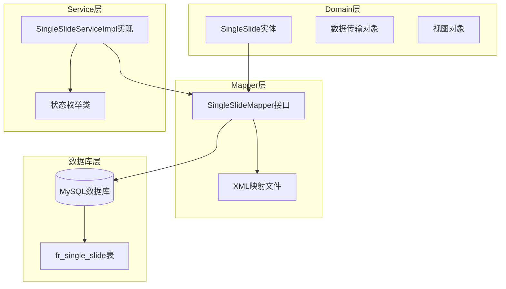
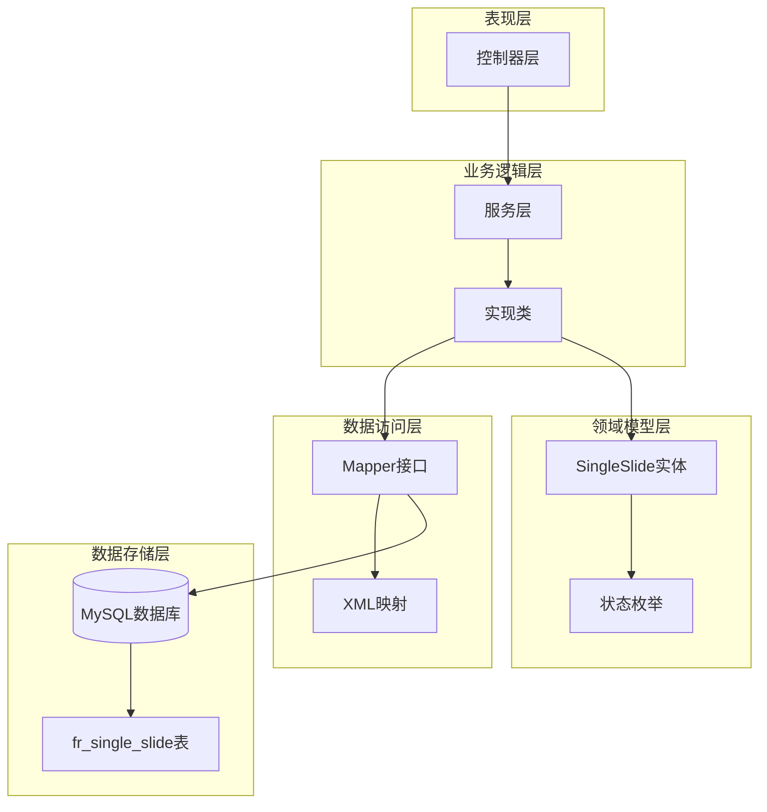
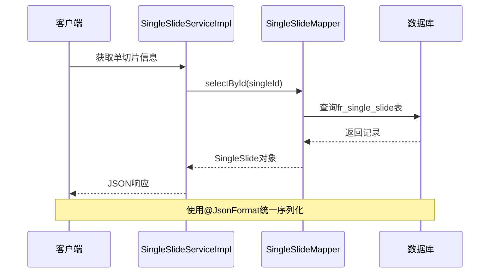
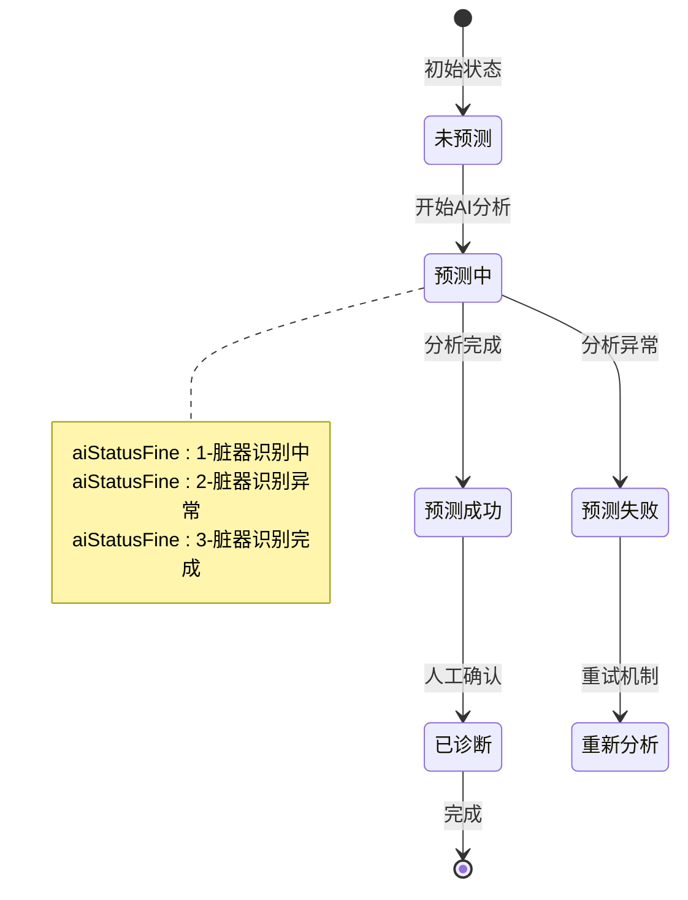
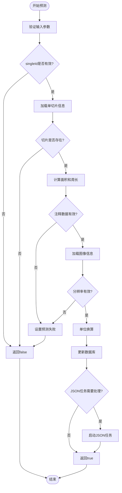
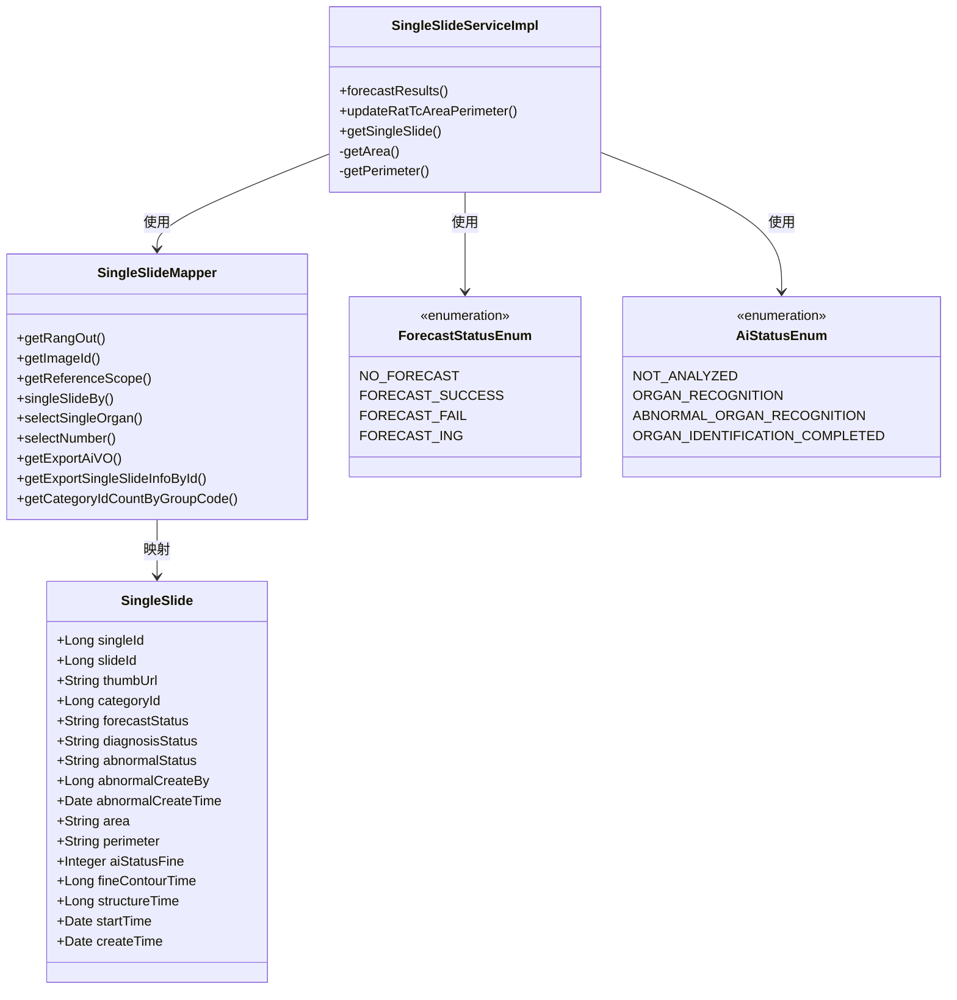

# SingleSlide实体设计

<cite>
**本文档引用的文件**
- [SingleSlide.java](file://src/main/java/cn/staitech/fr/domain/SingleSlide.java)
- [SingleSlideMapper.java](file://src/main/java/cn/staitech/fr/mapper/SingleSlideMapper.java)
- [SingleSlideMapper.xml](file://src/main/resources/mapper/SingleSlideMapper.xml)
- [SingleSlideServiceImpl.java](file://src/main/java/cn/staitech/fr/service/impl/SingleSlideServiceImpl.java)
- [ForecastStatusEnum.java](file://src/main/java/cn/staitech/fr/enums/ForecastStatusEnum.java)
- [AiStatusEnum.java](file://src/main/java/cn/staitech/fr/enums/AiStatusEnum.java)
- [StructureAiStatusEnum.java](file://src/main/java/cn/staitech/fr/enums/StructureAiStatusEnum.java)
- [StructureJsonStatusEnum.java](file://src/main/java/cn/staitech/fr/enums/StructureJsonStatusEnum.java)
- [ImageStatusEnum.java](file://src/main/java/cn/staitech/fr/enums/ImageStatusEnum.java)
</cite>

## 目录
1. [简介](#简介)
2. [项目结构](#项目结构)
3. [核心组件](#核心组件)
4. [架构概览](#架构概览)
5. [详细组件分析](#详细组件分析)
6. [依赖分析](#依赖分析)
7. [性能考虑](#性能考虑)
8. [故障排除指南](#故障排除指南)
9. [结论](#结论)

## 简介

SingleSlide实体是 PACMVS 系统中单切片管理的核心数据模型，用于存储和管理单个脏器切片的完整信息。该实体不仅包含基础的标识信息，还涵盖了AI预测状态、人工诊断状态、异常状态等多个维度的状态管理，为整个病理切片分析系统提供了完整的数据支撑。

本设计文档将详细阐述SingleSlide实体的所有字段定义、业务含义、数据类型规范以及相关的状态转换逻辑，帮助开发者深入理解该实体的设计理念和使用方式。

## 项目结构

SingleSlide实体在项目中的组织结构如下：



**图表来源**
- [SingleSlide.java:18-76](file://src/main/java/cn/staitech/fr/domain/SingleSlide.java#L18-L76)
- [SingleSlideMapper.java:19-61](file://src/main/java/cn/staitech/fr/mapper/SingleSlideMapper.java#L19-L61)
- [SingleSlideServiceImpl.java:38-223](file://src/main/java/cn/staitech/fr/service/impl/SingleSlideServiceImpl.java#L38-L223)

**章节来源**
- [SingleSlide.java:18-76](file://src/main/java/cn/staitech/fr/domain/SingleSlide.java#L18-L76)
- [SingleSlideMapper.java:19-61](file://src/main/java/cn/staitech/fr/mapper/SingleSlideMapper.java#L19-L61)
- [SingleSlideServiceImpl.java:38-223](file://src/main/java/cn/staitech/fr/service/impl/SingleSlideServiceImpl.java#L38-L223)

## 核心组件

### 实体字段定义

SingleSlide实体包含以下核心字段：

#### 基础标识字段
- **singleId**: 单切片唯一标识符，类型为Long，主键自增
- **slideId**: 关联的切片标识符，类型为Long，外键关联fr_slide表
- **thumbUrl**: 切片缩略图URL地址，类型为String

#### 分类与描述字段
- **categoryId**: 单脏器类型标识，类型为Long，关联fr_category表
- **description**: 单切片描述信息，类型为String

#### AI预测状态字段
- **forecastStatus**: 结构化状态，类型为String，取值范围："0"、"1"、"2"、"3"
- **area**: 精细轮廓总面积，类型为String（数值字符串）
- **perimeter**: 精细轮廓总周长，类型为String（数值字符串）
- **aiStatusFine**: 精轮廓分析状态，类型为Integer，取值范围：0、1、2、3
- **fineContourTime**: 精轮廓总时间，类型为Long（毫秒）

#### 人工诊断字段
- **diagnosisStatus**: 人工诊断状态，类型为String，取值范围："0"、"1"

#### 异常状态字段
- **abnormalStatus**: 异常状态，类型为String，取值范围："0"、"1"
- **abnormalCreateBy**: 未见异常创建人，类型为Long
- **abnormalCreateTime**: 未见异常创建时间，类型为Date

#### 时间戳字段
- **createTime**: 创建时间，类型为Date
- **startTime**: AI算法开始时间，类型为Date

#### 性能统计字段
- **structureTime**: 结构化总时间，类型为Long（毫秒）
- **screeningDifferenceStatus**: 筛选差异状态，类型为Long

**章节来源**
- [SingleSlide.java:22-76](file://src/main/java/cn/staitech/fr/domain/SingleSlide.java#L22-L76)

### 状态枚举体系

系统采用统一的状态枚举管理机制：

#### 预测状态枚举 (ForecastStatusEnum)
| 枚举值 | 代码 | 描述 | 用途 |
|--------|------|------|------|
| NO_FORECAST | "0" | 未预测 | 初始状态 |
| FORECAST_SUCCESS | "1" | 预测成功 | 成功完成AI分析 |
| FORECAST_FAIL | "2" | 预测失败 | AI分析失败 |
| FORECAST_ING | "3" | 预测中 | 正在进行AI分析 |

#### AI状态枚举 (AiStatusEnum)
| 枚举值 | 代码 | 描述 | 用途 |
|--------|------|------|------|
| NOT_ANALYZED | 0 | 未分析 | 初始状态 |
| ORGAN_RECOGNITION | 1 | 脏器识别中 | 正在识别脏器 |
| ABNORMAL_ORGAN_RECOGNITION | 2 | 脏器识别异常 | 识别过程异常 |
| ORGAN_IDENTIFICATION_COMPLETED | 3 | 脏器识别完成 | 识别完成 |

#### 结构化状态枚举
- **StructureAiStatusEnum**: 结构化AI状态（SUCCESS=0, FAIL=1）
- **StructureJsonStatusEnum**: 结构化JSON状态（NO_PARSE=0, PARSE_ING=1, PARSE_SUCCESS=2, PARSE_FAIL=3）
- **ImageStatusEnum**: 图像状态枚举（UPLOADING=0, UPLOAD_FAILED=1, PARSING=2, PROCESSING=7, AVAILABLE=4）

**章节来源**
- [ForecastStatusEnum.java:6-15](file://src/main/java/cn/staitech/fr/enums/ForecastStatusEnum.java#L6-L15)
- [AiStatusEnum.java:5-8](file://src/main/java/cn/staitech/fr/enums/AiStatusEnum.java#L5-L8)
- [StructureAiStatusEnum.java:6-16](file://src/main/java/cn/staitech/fr/enums/StructureAiStatusEnum.java#L6-L16)
- [StructureJsonStatusEnum.java:6-15](file://src/main/java/cn/staitech/fr/enums/StructureJsonStatusEnum.java#L6-L15)
- [ImageStatusEnum.java:7-16](file://src/main/java/cn/staitech/fr/enums/ImageStatusEnum.java#L7-L16)

## 架构概览

SingleSlide实体在整个系统架构中的位置和交互关系：



**图表来源**
- [SingleSlideServiceImpl.java:38](file://src/main/java/cn/staitech/fr/service/impl/SingleSlideServiceImpl.java#L38)
- [SingleSlideMapper.java:19](file://src/main/java/cn/staitech/fr/mapper/SingleSlideMapper.java#L19)
- [SingleSlide.java:20](file://src/main/java/cn/staitech/fr/domain/SingleSlide.java#L20)

## 详细组件分析

### 数据模型设计

#### 字段类型与约束

| 字段名 | 类型 | 非空 | 默认值 | 约束条件 | 业务含义 |
|--------|------|------|--------|----------|----------|
| singleId | Long | 是 | 自增 | 主键 | 单切片唯一标识 |
| slideId | Long | 否 | NULL | 外键 | 关联切片标识 |
| thumbUrl | String | 否 | NULL | 最大长度255 | 缩略图URL |
| categoryId | Long | 否 | NULL | 外键 | 脏器类型标识 |
| forecastStatus | String | 否 | NULL | 枚举值: 0/1/2/3 | 结构化状态 |
| diagnosisStatus | String | 否 | NULL | 枚举值: 0/1 | 诊断状态 |
| area | String | 否 | NULL | 数值字符串 | 总面积 |
| perimeter | String |否 | NULL | 数值字符串 | 总周长 |
| aiStatusFine | Integer | 否 | NULL | 枚举值: 0/1/2/3 | 精细轮廓状态 |
| abnormalStatus | String | 否 | NULL | 枚举值: 0/1 | 异常状态 |
| abnormalCreateBy | Long | 否 | NULL | 外键 | 创建人标识 |
| abnormalCreateTime | Date | 否 | NULL | 时间戳 | 创建时间 |
| structureTime | Long | 否 | NULL | 毫秒数 | 结构化耗时 |
| fineContourTime | Long | 否 | NULL | 毫秒数 | 精细轮廓耗时 |
| startTime | Date | 否 | NULL | 时间戳 | AI开始时间 |
| createTime | Date | 否 | NULL | 时间戳 | 创建时间 |

#### 序列化处理

实体支持标准的JSON序列化处理，所有日期字段使用统一的时间格式化模式：



**图表来源**
- [SingleSlideServiceImpl.java:64-138](file://src/main/java/cn/staitech/fr/service/impl/SingleSlideServiceImpl.java#L64-L138)
- [SingleSlideMapper.xml:154-194](file://src/main/resources/mapper/SingleSlideMapper.xml#L154-L194)

**章节来源**
- [SingleSlide.java:22-76](file://src/main/java/cn/staitech/fr/domain/SingleSlide.java#L22-L76)
- [SingleSlideMapper.xml:109-110](file://src/main/resources/mapper/SingleSlideMapper.xml#L109-L110)

### 状态转换逻辑

#### 预测状态转换流程



**图表来源**
- [ForecastStatusEnum.java:6-15](file://src/main/java/cn/staitech/fr/enums/ForecastStatusEnum.java#L6-L15)
- [AiStatusEnum.java:5-8](file://src/main/java/cn/staitech/fr/enums/AiStatusEnum.java#L5-L8)

#### 异常状态管理

异常状态字段设计用于特殊场景的标记和追踪：

| 异常状态 | 代码 | 业务含义 | 使用场景 |
|----------|------|----------|----------|
| 默认值 | "0" | 未设置异常状态 | 初始化状态 |
| 未见异常 | "1" | 经过人工确认无异常 | 诊断完成标记 |

异常状态的使用遵循以下原则：
1. **自动设置**: 当AI分析成功且无异常发现时自动标记
2. **人工确认**: 需要病理医生人工确认后才能正式生效
3. **追踪记录**: 记录异常状态的创建人和时间

**章节来源**
- [SingleSlide.java:47-54](file://src/main/java/cn/staitech/fr/domain/SingleSlide.java#L47-L54)
- [SingleSlideServiceImpl.java:139-145](file://src/main/java/cn/staitech/fr/service/impl/SingleSlideServiceImpl.java#L139-L145)

### 业务流程处理

#### 预测结果计算流程



**图表来源**
- [SingleSlideServiceImpl.java:65-138](file://src/main/java/cn/staitech/fr/service/impl/SingleSlideServiceImpl.java#L65-L138)

#### 数据计算算法

面积和周长的计算采用以下公式：

**面积计算**:
```
面积(平方毫米) = 注释面积 × 分辨率X² × 0.000001
```

**周长计算**:
```
周长(毫米) = 注释周长 × 分辨率X × 0.001
```

其中：
- 分辨率X以像素/毫米为单位
- 计算结果保留9位小数精度
- 使用四舍五入模式进行数值处理

**章节来源**
- [SingleSlideServiceImpl.java:102-115](file://src/main/java/cn/staitech/fr/service/impl/SingleSlideServiceImpl.java#L102-L115)
- [SingleSlideServiceImpl.java:208-222](file://src/main/java/cn/staitech/fr/service/impl/SingleSlideServiceImpl.java#L208-L222)

## 依赖分析

### 组件间依赖关系



**图表来源**
- [SingleSlide.java:20-76](file://src/main/java/cn/staitech/fr/domain/SingleSlide.java#L20-L76)
- [SingleSlideMapper.java:19-61](file://src/main/java/cn/staitech/fr/mapper/SingleSlideMapper.java#L19-L61)
- [SingleSlideServiceImpl.java:38-223](file://src/main/java/cn/staitech/fr/service/impl/SingleSlideServiceImpl.java#L38-L223)

### 外部依赖

系统对外部组件的依赖主要包括：

1. **MyBatis框架**: 提供ORM映射和数据库操作
2. **MySQL数据库**: 存储实体数据
3. **Hutool工具库**: 提供日期处理和数值计算
4. **Jackson序列化**: 处理JSON序列化和反序列化

**章节来源**
- [SingleSlideMapper.java:19](file://src/main/java/cn/staitech/fr/mapper/SingleSlideMapper.java#L19)
- [SingleSlideServiceImpl.java:3](file://src/main/java/cn/staitech/fr/service/impl/SingleSlideServiceImpl.java#L3)

## 性能考虑

### 查询优化策略

1. **索引设计**: 建议在以下字段上建立索引
   - `single_id`: 主键索引
   - `slide_id`: 外键索引
   - `category_id`: 分类查询索引
   - `forecast_status`: 状态过滤索引

2. **批量操作**: 支持批量查询和更新操作，提高大数据量处理效率

3. **缓存策略**: 对于频繁查询的单切片信息可以考虑添加缓存层

### 内存使用优化

1. **数值精度控制**: 面积和周长计算结果保留9位小数，避免内存浪费
2. **字符串处理**: 所有数值以字符串形式存储，便于JSON序列化
3. **时间戳优化**: 使用Long类型存储毫秒级时间戳，减少存储空间

## 故障排除指南

### 常见问题及解决方案

#### 预测失败处理

当AI预测失败时，系统会自动设置相应的状态标志：

1. **状态设置**: 将`forecastStatus`设置为"2"（预测失败）
2. **日志记录**: 记录详细的错误信息和堆栈跟踪
3. **异常恢复**: 提供重试机制和手动干预选项

#### 数据计算异常

当面积或周长计算出现异常时：

1. **输入验证**: 检查注释数据的有效性和完整性
2. **分辨率检查**: 确保图像分辨率数据的准确性
3. **数值转换**: 验证数值转换过程的正确性

#### 线程安全问题

由于系统使用多线程处理JSON任务：

1. **线程池配置**: 合理配置线程池大小和队列容量
2. **上下文传递**: 使用TTL（Transitive Thread Local）确保上下文信息正确传递
3. **异常处理**: 捕获并处理线程执行过程中的异常

**章节来源**
- [SingleSlideServiceImpl.java:132-137](file://src/main/java/cn/staitech/fr/service/impl/SingleSlideServiceImpl.java#L132-L137)
- [SingleSlideServiceImpl.java:157-162](file://src/main/java/cn/staitech/fr/service/impl/SingleSlideServiceImpl.java#L157-L162)

## 结论

SingleSlide实体作为PACMVS系统的核心数据模型，通过精心设计的字段结构和状态管理体系，为整个病理切片分析流程提供了坚实的数据基础。该实体不仅满足了当前业务需求，还具备良好的扩展性和维护性。

### 设计亮点

1. **完整的状态管理**: 从AI预测到人工诊断的全生命周期状态跟踪
2. **精确的数值计算**: 基于物理单位的准确测量和换算
3. **灵活的异常处理**: 支持多种异常状态和处理策略
4. **高效的性能设计**: 优化的查询和计算算法

### 未来改进方向

1. **数据验证增强**: 添加更严格的数据验证规则
2. **监控指标完善**: 增加更多的性能和质量监控指标
3. **扩展性设计**: 为新的业务需求预留扩展空间
4. **文档完善**: 持续更新和维护技术文档

通过本设计文档，开发者可以全面理解SingleSlide实体的设计理念、使用方法和最佳实践，为系统的稳定运行和持续发展奠定坚实基础。