# Species与Structure实体设计

<cite>
**本文档引用的文件**
- [Species.java](file://src/main/java/cn/staitech/fr/domain/Species.java)
- [Structure.java](file://src/main/java/cn/staitech/fr/domain/Structure.java)
- [Organ.java](file://src/main/java/cn/staitech/fr/domain/Organ.java)
- [SpeciesTypeEnum.java](file://src/main/java/cn/staitech/fr/enmu/SpeciesTypeEnum.java)
- [StructureTypeEnum.java](file://src/main/java/cn/staitech/fr/enums/StructureTypeEnum.java)
- [SpeciesController.java](file://src/main/java/cn/staitech/fr/controller/SpeciesController.java)
- [StructureController.java](file://src/main/java/cn/staitech/fr/controller/StructureController.java)
- [SpeciesServiceImpl.java](file://src/main/java/cn/staitech/fr/service/impl/SpeciesServiceImpl.java)
- [StructureServiceImpl.java](file://src/main/java/cn/staitech/fr/service/impl/StructureServiceImpl.java)
- [SpeciesMapper.xml](file://src/main/resources/mapper/SpeciesMapper.xml)
- [StructureMapper.xml](file://src/main/resources/mapper/StructureMapper.xml)
</cite>

## 目录
1. [引言](#引言)
2. [项目结构](#项目结构)
3. [核心组件](#核心组件)
4. [架构概览](#架构概览)
5. [详细组件分析](#详细组件分析)
6. [依赖关系分析](#依赖关系分析)
7. [性能考虑](#性能考虑)
8. [故障排除指南](#故障排除指南)
9. [结论](#结论)

## 引言

本设计文档详细阐述了Species（物种）和Structure（结构）实体的设计与实现，涵盖字段定义、数据模型、业务逻辑以及多物种支持机制。通过分析代码库中的领域模型、控制器、服务层和持久化映射，本文档提供了完整的实体设计说明，包括：

- 物种实体的字段定义与用途
- 结构实体的字段定义与层级关系
- 物种与结构之间的映射规则
- 多物种支持的实现机制与扩展方式
- 解剖学结构的标准分类体系与命名规范
- 不同物种间结构差异的处理方式

## 项目结构

该系统采用标准的分层架构，主要包含以下层次：
- 控制器层：负责HTTP请求处理与响应封装
- 服务层：实现业务逻辑与数据处理
- 持久化层：MyBatis映射器负责数据库交互
- 领域模型：实体类定义数据结构与行为

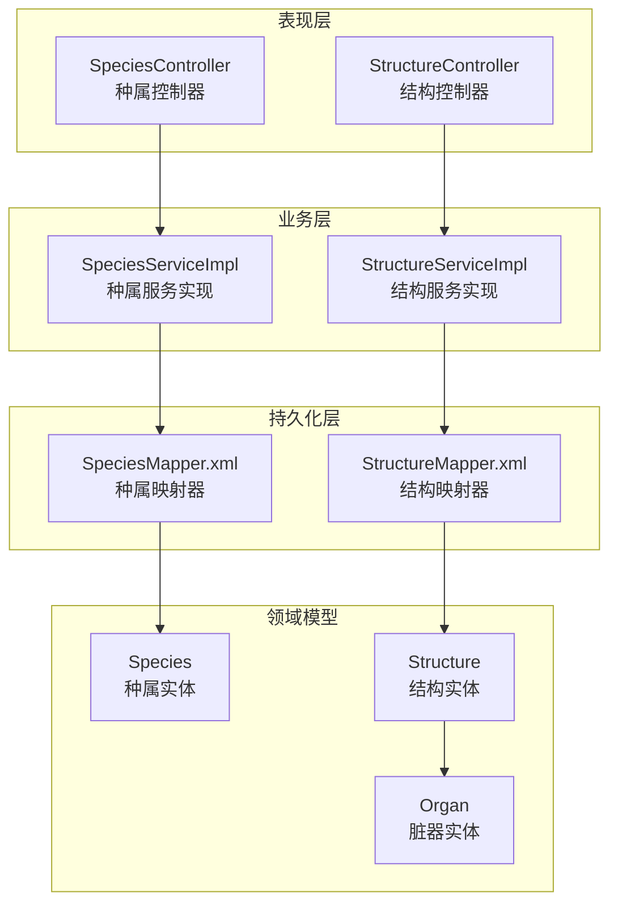

**图表来源**
- [SpeciesController.java:1-38](file://src/main/java/cn/staitech/fr/controller/SpeciesController.java#L1-L38)
- [StructureController.java:1-68](file://src/main/java/cn/staitech/fr/controller/StructureController.java#L1-L68)
- [SpeciesServiceImpl.java:1-28](file://src/main/java/cn/staitech/fr/service/impl/SpeciesServiceImpl.java#L1-L28)
- [StructureServiceImpl.java:1-38](file://src/main/java/cn/staitech/fr/service/impl/StructureServiceImpl.java#L1-L38)
- [SpeciesMapper.xml:1-20](file://src/main/resources/mapper/SpeciesMapper.xml#L1-L20)
- [StructureMapper.xml:1-47](file://src/main/resources/mapper/StructureMapper.xml#L1-L47)

**章节来源**
- [SpeciesController.java:1-38](file://src/main/java/cn/staitech/fr/controller/SpeciesController.java#L1-L38)
- [StructureController.java:1-68](file://src/main/java/cn/staitech/fr/controller/StructureController.java#L1-L68)
- [SpeciesServiceImpl.java:1-28](file://src/main/java/cn/staitech/fr/service/impl/SpeciesServiceImpl.java#L1-L28)
- [StructureServiceImpl.java:1-38](file://src/main/java/cn/staitech/fr/service/impl/StructureServiceImpl.java#L1-L38)

## 核心组件

### 物种实体（Species）

Species实体代表实验动物的物种信息，用于支持多物种的解剖学结构标注与分析。

**核心字段定义：**
- `speciesId`：种属ID，主键标识符
- `name`：种属名称（中文）
- `nameEn`：种属名称（英文）
- `organizationId`：机构ID，用于多租户隔离
- `badge`：标记字段，用于医学评审标识

**数据模型关系：**
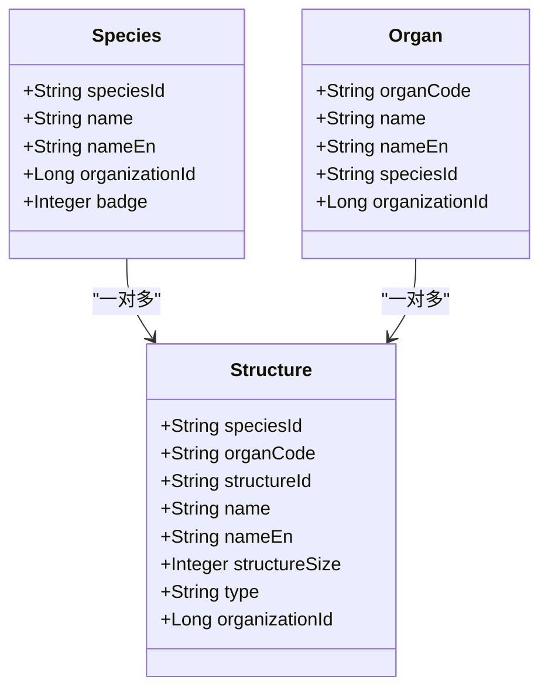

**图表来源**
- [Species.java:27-48](file://src/main/java/cn/staitech/fr/domain/Species.java#L27-L48)
- [Structure.java:16-112](file://src/main/java/cn/staitech/fr/domain/Structure.java#L16-L112)
- [Organ.java:12-88](file://src/main/java/cn/staitech/fr/domain/Organ.java#L12-L88)

**章节来源**
- [Species.java:14-48](file://src/main/java/cn/staitech/fr/domain/Species.java#L14-L48)
- [SpeciesMapper.xml:6-17](file://src/main/resources/mapper/SpeciesMapper.xml#L6-L17)

### 结构实体（Structure）

Structure实体表示解剖学结构信息，包含结构的标识、属性和分类信息。

**核心字段定义：**
- `speciesId`：种属ID，关联到Species实体
- `organCode`：脏器编码，关联到Organ实体
- `structureId`：结构ID，唯一标识符
- `name`：结构名称（中文）
- `nameEn`：结构名称（英文）
- `structureSize`：结构标签大小（1：大 2：中 3：小）
- `type`：结构类型（RO/ROA/ROE）
- `organizationId`：机构ID，用于多租户隔离

**类型枚举体系：**
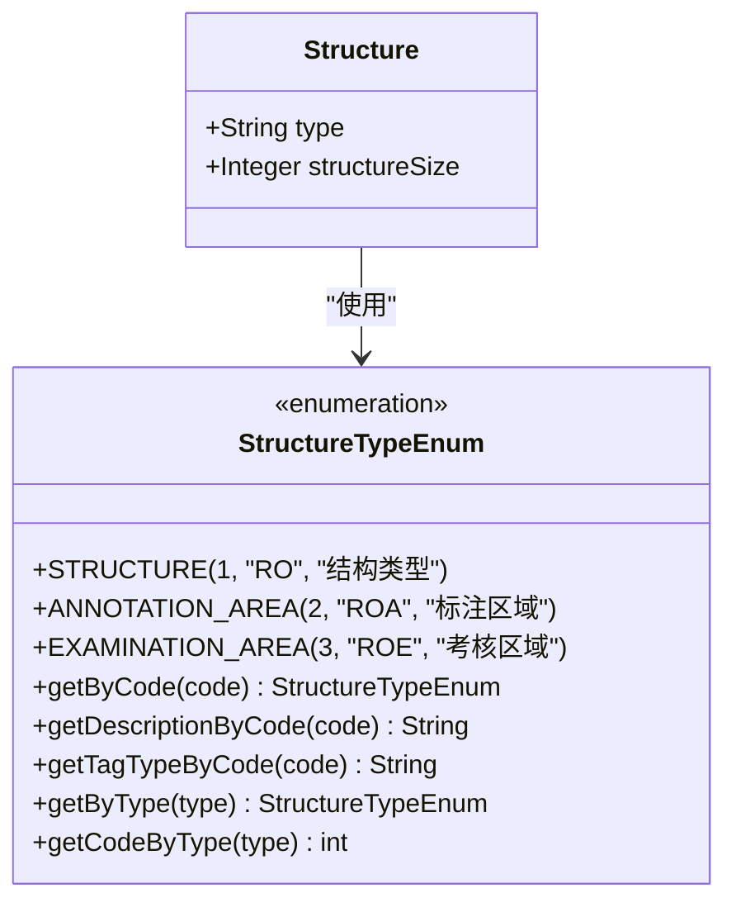

**图表来源**
- [StructureTypeEnum.java:6-65](file://src/main/java/cn/staitech/fr/enums/StructureTypeEnum.java#L6-L65)
- [Structure.java:16-112](file://src/main/java/cn/staitech/fr/domain/Structure.java#L16-L112)

**章节来源**
- [Structure.java:11-112](file://src/main/java/cn/staitech/fr/domain/Structure.java#L11-L112)
- [StructureMapper.xml:7-16](file://src/main/resources/mapper/StructureMapper.xml#L7-L16)
- [StructureTypeEnum.java:1-65](file://src/main/java/cn/staitech/fr/enums/StructureTypeEnum.java#L1-L65)

### 脏器实体（Organ）

Organ实体表示解剖学脏器信息，为结构提供层级上下文。

**核心字段定义：**
- `organCode`：脏器编码（主键）
- `name`：脏器名称（中文）
- `nameEn`：脏器名称（英文）
- `speciesId`：种属ID，关联到Species实体
- `organizationId`：机构ID，用于多租户隔离

**章节来源**
- [Organ.java:10-88](file://src/main/java/cn/staitech/fr/domain/Organ.java#L10-L88)

## 架构概览

系统采用分层架构设计，通过控制器-服务-持久化的清晰分离实现功能模块化。

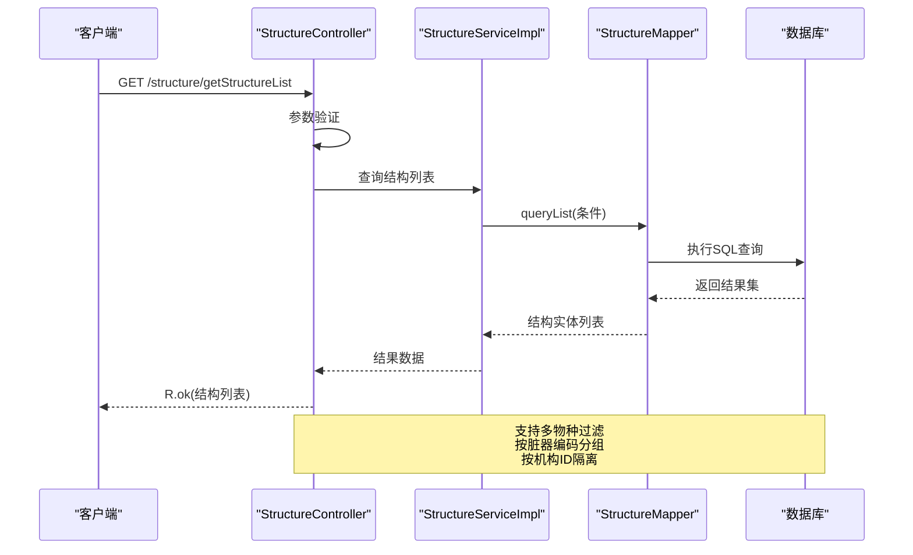

**图表来源**
- [StructureController.java:46-56](file://src/main/java/cn/staitech/fr/controller/StructureController.java#L46-L56)
- [StructureServiceImpl.java:29-32](file://src/main/java/cn/staitech/fr/service/impl/StructureServiceImpl.java#L29-L32)
- [StructureMapper.xml:24-45](file://src/main/resources/mapper/StructureMapper.xml#L24-L45)

**章节来源**
- [StructureController.java:1-68](file://src/main/java/cn/staitech/fr/controller/StructureController.java#L1-L68)
- [StructureServiceImpl.java:1-38](file://src/main/java/cn/staitech/fr/service/impl/StructureServiceImpl.java#L1-L38)

## 详细组件分析

### 物种管理组件

#### 物种枚举体系
系统定义了标准化的物种枚举，支持RAT、MOUSE、DOG、MONKEY四种常见实验动物。

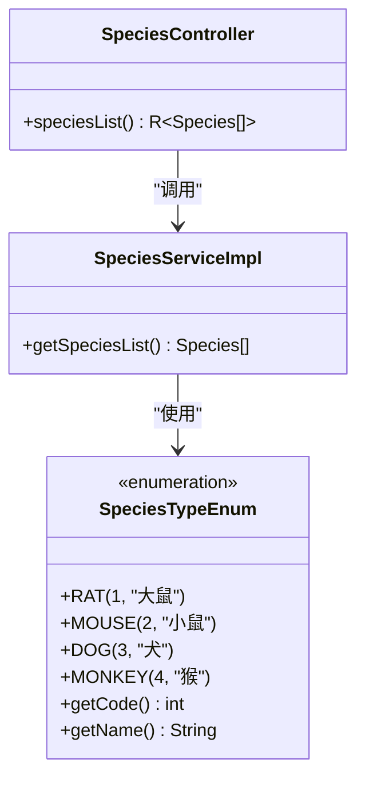

**图表来源**
- [SpeciesTypeEnum.java:3-25](file://src/main/java/cn/staitech/fr/enmu/SpeciesTypeEnum.java#L3-L25)
- [SpeciesController.java:30-35](file://src/main/java/cn/staitech/fr/controller/SpeciesController.java#L30-L35)
- [SpeciesServiceImpl.java:19-26](file://src/main/java/cn/staitech/fr/service/impl/SpeciesServiceImpl.java#L19-L26)

**章节来源**
- [SpeciesTypeEnum.java:1-25](file://src/main/java/cn/staitech/fr/enmu/SpeciesTypeEnum.java#L1-L25)
- [SpeciesController.java:14-37](file://src/main/java/cn/staitech/fr/controller/SpeciesController.java#L14-L37)
- [SpeciesServiceImpl.java:15-27](file://src/main/java/cn/staitech/fr/service/impl/SpeciesServiceImpl.java#L15-L27)

#### 物种数据访问模式
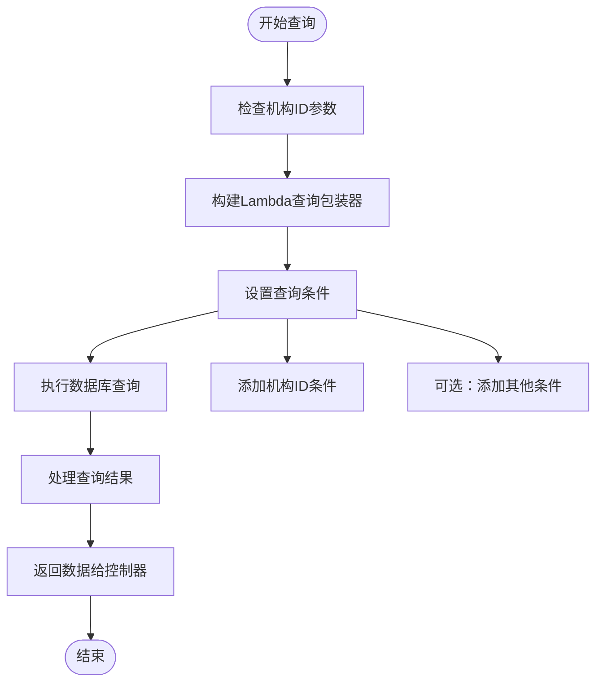

**图表来源**
- [SpeciesServiceImpl.java:20-26](file://src/main/java/cn/staitech/fr/service/impl/SpeciesServiceImpl.java#L20-L26)
- [SpeciesMapper.xml:6-17](file://src/main/resources/mapper/SpeciesMapper.xml#L6-L17)

**章节来源**
- [SpeciesServiceImpl.java:17-27](file://src/main/java/cn/staitech/fr/service/impl/SpeciesServiceImpl.java#L17-L27)
- [SpeciesMapper.xml:1-20](file://src/main/resources/mapper/SpeciesMapper.xml#L1-L20)

### 结构管理组件

#### 结构查询流程
系统实现了灵活的结构查询机制，支持多维度过滤和组合查询。

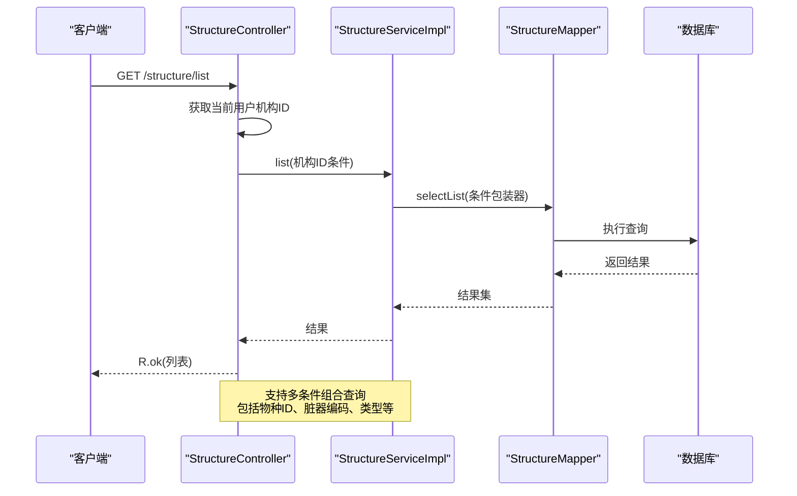

**图表来源**
- [StructureController.java:41-44](file://src/main/java/cn/staitech/fr/controller/StructureController.java#L41-L44)
- [StructureServiceImpl.java:20-32](file://src/main/java/cn/staitech/fr/service/impl/StructureServiceImpl.java#L20-L32)
- [StructureMapper.xml:24-45](file://src/main/resources/mapper/StructureMapper.xml#L24-L45)

**章节来源**
- [StructureController.java:39-67](file://src/main/java/cn/staitech/fr/controller/StructureController.java#L39-L67)
- [StructureServiceImpl.java:19-38](file://src/main/java/cn/staitech/fr/service/impl/StructureServiceImpl.java#L19-L38)

#### 结构尺寸映射机制
系统提供了结构尺寸的动态映射功能，支持运行时查询和缓存。

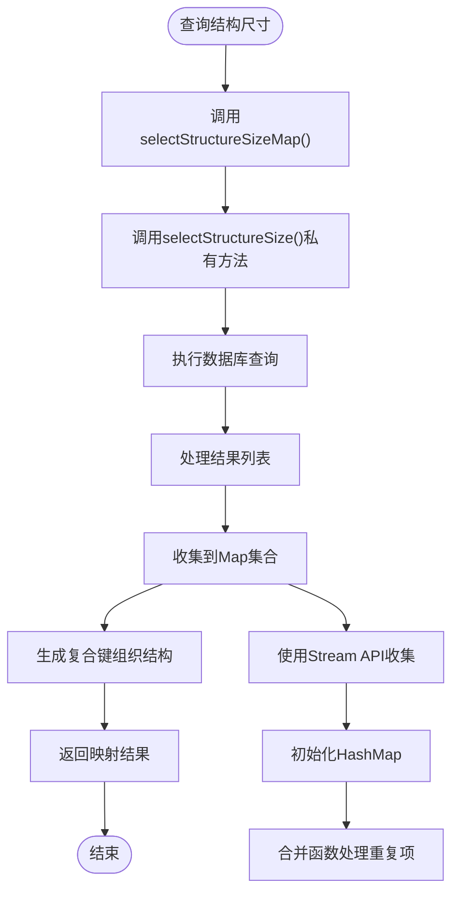

**图表来源**
- [StructureServiceImpl.java:24-32](file://src/main/java/cn/staitech/fr/service/impl/StructureServiceImpl.java#L24-L32)
- [StructureMapper.xml:24-45](file://src/main/resources/mapper/StructureMapper.xml#L24-L45)

**章节来源**
- [StructureServiceImpl.java:20-38](file://src/main/java/cn/staitech/fr/service/impl/StructureServiceImpl.java#L20-L38)

### 多物种支持机制

#### 物种-结构映射规则
系统通过外键关联实现多物种支持，确保数据隔离和一致性。

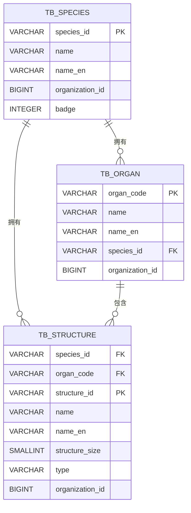

**图表来源**
- [Species.java:31-33](file://src/main/java/cn/staitech/fr/domain/Species.java#L31-L33)
- [Organ.java:16-17](file://src/main/java/cn/staitech/fr/domain/Organ.java#L16-L17)
- [Structure.java:20-25](file://src/main/java/cn/staitech/fr/domain/Structure.java#L20-L25)

**章节来源**
- [Species.java:14-48](file://src/main/java/cn/staitech/fr/domain/Species.java#L14-L48)
- [Organ.java:10-88](file://src/main/java/cn/staitech/fr/domain/Organ.java#L10-L88)
- [Structure.java:11-112](file://src/main/java/cn/staitech/fr/domain/Structure.java#L11-L112)

#### 扩展机制
系统设计支持新物种的无缝扩展：

1. **枚举扩展**：在SpeciesTypeEnum中添加新的物种枚举值
2. **数据扩展**：在tb_species表中添加新的物种记录
3. **结构扩展**：在tb_structure表中添加对应物种的结构定义
4. **映射扩展**：在XML映射器中配置相应的字段映射

**章节来源**
- [SpeciesTypeEnum.java:3-25](file://src/main/java/cn/staitech/fr/enmu/SpeciesTypeEnum.java#L3-L25)

### 解剖学结构分类体系

#### 标准分类体系
系统采用国际通用的解剖学结构分类标准，支持三种基本类型：

1. **结构类型（RO）**：基础解剖学结构
2. **标注区域（ROA）**：用于人工标注的区域
3. **考核区域（ROE）**：用于质量评估的区域

**命名规范：**
- 字段命名采用驼峰命名法
- 中英文字段成对出现
- 编码字段统一使用VARCHAR类型
- 数值字段根据取值范围选择合适的数据类型

**章节来源**
- [StructureTypeEnum.java:6-65](file://src/main/java/cn/staitech/fr/enums/StructureTypeEnum.java#L6-L65)

### 物种间结构差异处理

#### 差异识别与处理
系统通过以下机制处理不同物种间的结构差异：

1. **物种隔离**：每个物种拥有独立的结构定义
2. **脏器映射**：通过organCode关联到对应的脏器
3. **类型区分**：通过type字段区分不同用途的结构
4. **尺寸管理**：通过structureSize字段管理标注精度

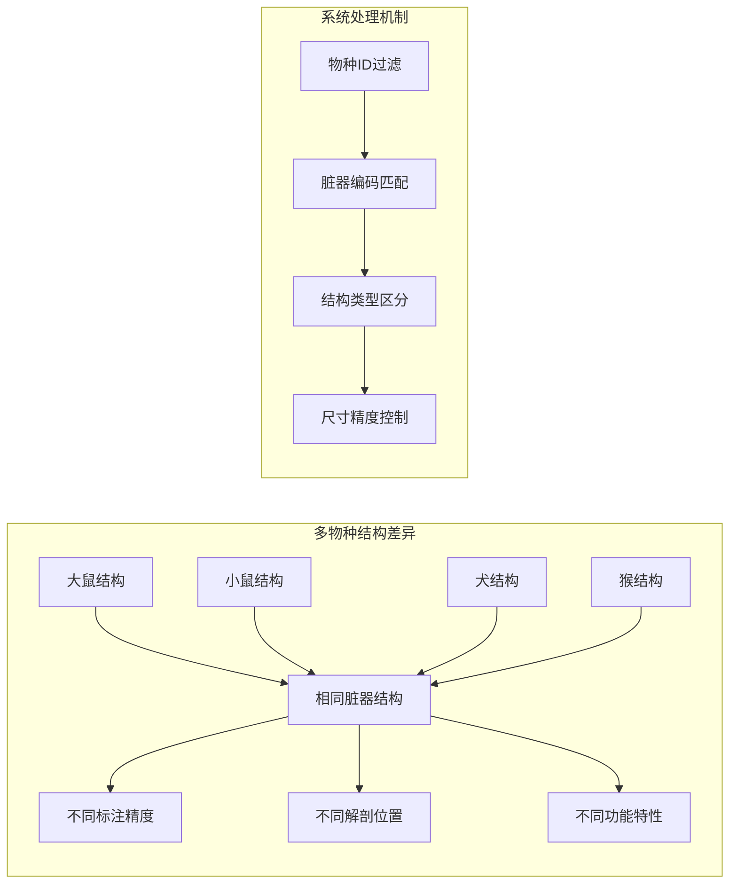

**图表来源**
- [StructureController.java:48-55](file://src/main/java/cn/staitech/fr/controller/StructureController.java#L48-L55)
- [StructureServiceImpl.java:29-32](file://src/main/java/cn/staitech/fr/service/impl/StructureServiceImpl.java#L29-L32)

**章节来源**
- [StructureController.java:46-65](file://src/main/java/cn/staitech/fr/controller/StructureController.java#L46-L65)
- [Structure.java:44-50](file://src/main/java/cn/staitech/fr/domain/Structure.java#L44-L50)

## 依赖关系分析

系统各组件间的依赖关系清晰明确，遵循单一职责原则和依赖倒置原则。

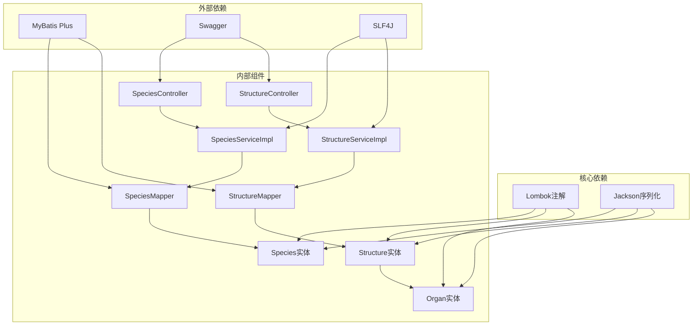

**图表来源**
- [Species.java:3-10](file://src/main/java/cn/staitech/fr/domain/Species.java#L3-L10)
- [Structure.java:3-10](file://src/main/java/cn/staitech/fr/domain/Structure.java#L3-L10)
- [Organ.java:3-8](file://src/main/java/cn/staitech/fr/domain/Organ.java#L3-L8)

**章节来源**
- [Species.java:1-49](file://src/main/java/cn/staitech/fr/domain/Species.java#L1-L49)
- [Structure.java:1-112](file://src/main/java/cn/staitech/fr/domain/Structure.java#L1-L112)
- [Organ.java:1-88](file://src/main/java/cn/staitech/fr/domain/Organ.java#L1-L88)

## 性能考虑

### 查询优化策略
1. **索引设计**：建议在species_id、organ_code、type、organization_id等常用查询字段上建立索引
2. **分页查询**：对于大量数据的查询，应实现分页机制避免内存溢出
3. **缓存策略**：对频繁访问的枚举数据和静态配置进行缓存
4. **批量操作**：支持批量插入和更新操作以提高效率

### 内存管理
1. **流式处理**：大数据量处理时使用Stream API进行流式处理
2. **对象复用**：合理使用对象池减少GC压力
3. **及时释放**：确保数据库连接和资源的及时释放

## 故障排除指南

### 常见问题及解决方案

#### 数据查询异常
**问题现象**：查询结果为空或不完整
**可能原因**：
- 机构ID参数传递错误
- 物种ID或脏器编码不匹配
- 数据库连接异常

**解决步骤**：
1. 验证SecurityUtils.getOrganizationId()返回值
2. 检查speciesId和organId参数格式
3. 确认数据库连接状态
4. 查看MyBatis日志输出

#### 实体映射错误
**问题现象**：字段映射失败或数据类型转换异常
**可能原因**：
- XML映射器字段配置错误
- 实体类字段类型不匹配
- 数据库字段类型不一致

**解决步骤**：
1. 对比实体类与XML映射器的字段定义
2. 检查数据库表结构与实体映射
3. 验证字段类型和长度配置
4. 更新不匹配的配置

**章节来源**
- [StructureController.java:41-44](file://src/main/java/cn/staitech/fr/controller/StructureController.java#L41-L44)
- [SpeciesServiceImpl.java:20-26](file://src/main/java/cn/staitech/fr/service/impl/SpeciesServiceImpl.java#L20-L26)

## 结论

本设计文档全面阐述了Species和Structure实体的设计理念与实现细节。系统通过清晰的分层架构、标准化的实体设计和灵活的多物种支持机制，为解剖学结构标注与分析提供了可靠的技术基础。

**核心优势：**
1. **模块化设计**：各层职责明确，便于维护和扩展
2. **多物种支持**：通过外键关联实现天然的多物种隔离
3. **标准化规范**：统一的命名规范和数据类型定义
4. **灵活查询**：支持多维度组合查询和动态映射

**扩展建议：**
1. 增加数据验证和约束机制
2. 实现更完善的缓存策略
3. 添加审计日志功能
4. 优化大数据量处理性能

该设计为后续的功能扩展和技术演进奠定了坚实的基础，能够有效支撑复杂的解剖学研究和临床应用需求。