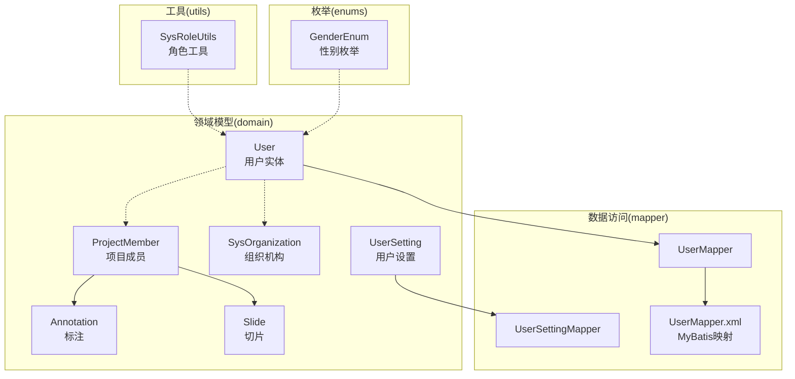
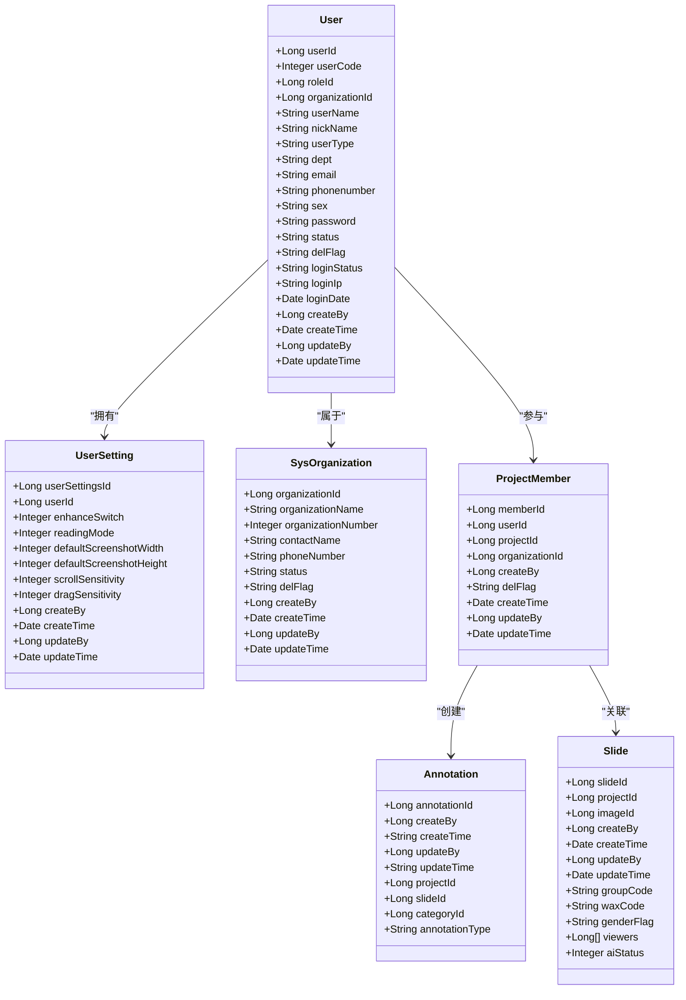
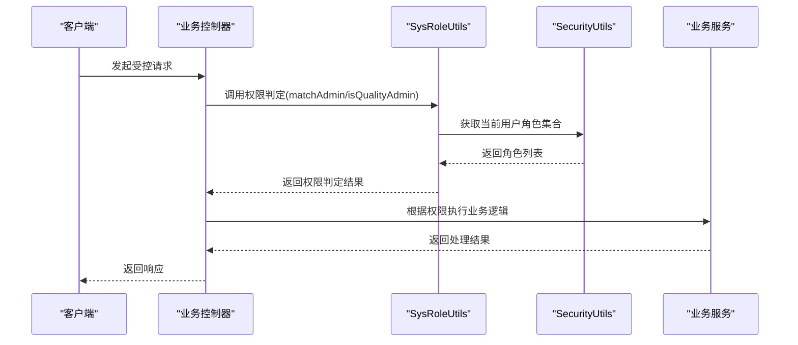
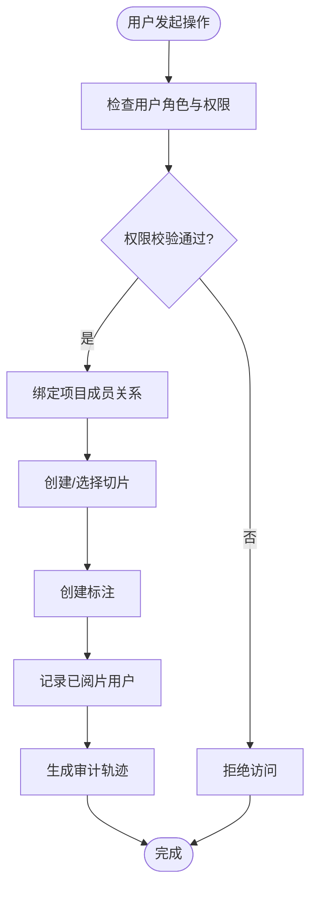
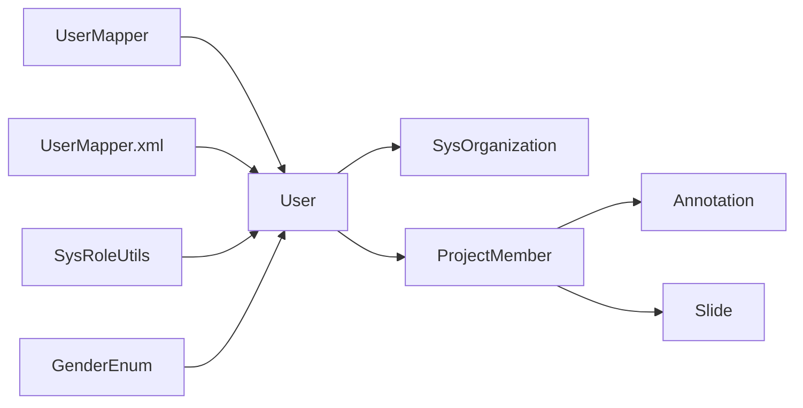

# 用户实体设计

<cite>
**本文档引用的文件**
- [User.java](file://src/main/java/cn/staitech/fr/domain/User.java)
- [UserSetting.java](file://src/main/java/cn/staitech/fr/domain/UserSetting.java)
- [UserMapper.java](file://src/main/java/cn/staitech/fr/mapper/UserMapper.java)
- [UserSettingMapper.java](file://src/main/java/cn/staitech/fr/mapper/UserSettingMapper.java)
- [UserMapper.xml](file://src/main/resources/mapper/UserMapper.xml)
- [SysOrganization.java](file://src/main/java/cn/staitech/fr/domain/SysOrganization.java)
- [ProjectMember.java](file://src/main/java/cn/staitech/fr/domain/ProjectMember.java)
- [Annotation.java](file://src/main/java/cn/staitech/fr/domain/Annotation.java)
- [Slide.java](file://src/main/java/cn/staitech/fr/domain/Slide.java)
- [SysRoleUtils.java](file://src/main/java/cn/staitech/fr/utils/SysRoleUtils.java)
- [GenderEnum.java](file://src/main/java/cn/staitech/fr/enums/GenderEnum.java)
</cite>

## 目录
1. [简介](#简介)
2. [项目结构](#项目结构)
3. [核心组件](#核心组件)
4. [架构概览](#架构概览)
5. [详细组件分析](#详细组件分析)
6. [依赖关系分析](#依赖关系分析)
7. [性能考虑](#性能考虑)
8. [故障排除指南](#故障排除指南)
9. [结论](#结论)

## 简介

本文件详细阐述了 PACMVS 系统中 User 实体的设计规范。User 实体作为系统的核心用户模型，承载着用户身份标识、认证凭据、组织归属、权限角色以及行为轨迹等关键信息。本文将从字段定义、角色权限体系、关联关系、认证授权机制、安全保护与隐私控制、设置偏好管理等多个维度进行全面解析，并提供相应的架构图示和最佳实践建议。

## 项目结构

围绕 User 实体的相关文件分布于 domain、mapper、resources 等包中，形成清晰的分层架构：

- domain 层：定义 User、UserSetting、SysOrganization、ProjectMember、Annotation、Slide 等领域模型
- mapper 层：提供 MyBatis-Plus 接口及 XML 映射文件，负责数据库访问
- utils 层：提供 SysRoleUtils 等工具类，支撑角色权限判断逻辑
- enums 层：提供 GenderEnum 等枚举类型，统一业务语义

**图表来源**
- [User.java:1-216](file://src/main/java/cn/staitech/fr/domain/User.java#L1-L216)
- [UserSetting.java:1-150](file://src/main/java/cn/staitech/fr/domain/UserSetting.java#L1-L150)
- [SysOrganization.java:1-241](file://src/main/java/cn/staitech/fr/domain/SysOrganization.java#L1-L241)
- [ProjectMember.java:1-65](file://src/main/java/cn/staitech/fr/domain/ProjectMember.java#L1-L65)
- [Annotation.java:1-352](file://src/main/java/cn/staitech/fr/domain/Annotation.java#L1-L352)
- [Slide.java:1-143](file://src/main/java/cn/staitech/fr/domain/Slide.java#L1-L143)
- [UserMapper.java:1-19](file://src/main/java/cn/staitech/fr/mapper/UserMapper.java#L1-L19)
- [UserSettingMapper.java:1-20](file://src/main/java/cn/staitech/fr/mapper/UserSettingMapper.java#L1-L20)
- [UserMapper.xml:1-38](file://src/main/resources/mapper/UserMapper.xml#L1-L38)
- [SysRoleUtils.java:1-60](file://src/main/java/cn/staitech/fr/utils/SysRoleUtils.java#L1-L60)
- [GenderEnum.java:1-46](file://src/main/java/cn/staitech/fr/enums/GenderEnum.java#L1-L46)

**章节来源**
- [User.java:1-216](file://src/main/java/cn/staitech/fr/domain/User.java#L1-L216)
- [UserSetting.java:1-150](file://src/main/java/cn/staitech/fr/domain/UserSetting.java#L1-L150)
- [SysOrganization.java:1-241](file://src/main/java/cn/staitech/fr/domain/SysOrganization.java#L1-L241)
- [ProjectMember.java:1-65](file://src/main/java/cn/staitech/fr/domain/ProjectMember.java#L1-L65)
- [Annotation.java:1-352](file://src/main/java/cn/staitech/fr/domain/Annotation.java#L1-L352)
- [Slide.java:1-143](file://src/main/java/cn/staitech/fr/domain/Slide.java#L1-L143)
- [UserMapper.java:1-19](file://src/main/java/cn/staitech/fr/mapper/UserMapper.java#L1-L19)
- [UserSettingMapper.java:1-20](file://src/main/java/cn/staitech/fr/mapper/UserSettingMapper.java#L1-L20)
- [UserMapper.xml:1-38](file://src/main/resources/mapper/UserMapper.xml#L1-L38)
- [SysRoleUtils.java:1-60](file://src/main/java/cn/staitech/fr/utils/SysRoleUtils.java#L1-L60)
- [GenderEnum.java:1-46](file://src/main/java/cn/staitech/fr/enums/GenderEnum.java#L1-L46)

## 核心组件

### 用户实体(User)字段定义

User 实体采用 MyBatis-Plus 注解映射到数据库表 sys_user，包含以下核心字段：

- 标识字段
  - userId: 主键，自增
  - userCode: 用户编码
  - roleId: 角色ID
  - organizationId: 机构ID

- 基本信息
  - userName: 用户账号
  - nickName: 用户昵称
  - userType: 用户类型（如系统用户）
  - dept: 部门
  - email: 邮箱
  - phonenumber: 手机号码
  - sex: 性别（枚举值映射）

- 安全与状态
  - password: 密码（应进行加密存储）
  - status: 帐号状态（正常/停用）
  - delFlag: 删除标志（存在/删除）
  - loginStatus: 登录状态（首次/非首次）
  - loginIp: 最后登录IP
  - loginDate: 最后登录时间

- 元数据
  - createBy: 创建者ID
  - createTime: 创建时间
  - updateBy: 更新者ID
  - updateTime: 更新时间

上述字段通过 equals/hashCode/toString 方法确保对象比较与日志输出的一致性。

**章节来源**
- [User.java:14-216](file://src/main/java/cn/staitech/fr/domain/User.java#L14-L216)
- [UserMapper.xml:7-29](file://src/main/resources/mapper/UserMapper.xml#L7-L29)

### 用户设置(UserSetting)字段定义

UserSetting 实体用于管理用户的个性化偏好，映射到表 tb_user_setting：

- 主键与关联
  - userSettingsId: 主键，自增
  - userId: 关联用户ID

- 功能开关与模式
  - enhanceSwitch: 图像增强开关（0-关闭, 1-开启）
  - readingMode: 阅片模式（1-列表模式, 2-矩阵模式）

- 截图与交互
  - defaultScreenshotWidth/Height: 默认截图尺寸
  - scrollSensitivity: 滚轮灵敏度
  - dragSensitivity: 拖拽灵敏度

- 元数据
  - createBy/createTime/updateBy/updateTime: 记录创建与更新信息

**章节来源**
- [UserSetting.java:16-150](file://src/main/java/cn/staitech/fr/domain/UserSetting.java#L16-L150)

### 组织机构(SysOrganization)字段定义

SysOrganization 提供机构级元数据，支持用户按组织进行分组与权限隔离：

- 基本属性
  - organizationId: 机构ID
  - organizationName: 机构名称
  - organizationNumber: 机构编号
  - contactName/phoneNumber: 联系信息
  - status/delFlag: 状态与删除标志

- 时间与归属
  - createBy/createTime/updateBy/updateTime: 创建与更新记录

**章节来源**
- [SysOrganization.java:18-241](file://src/main/java/cn/staitech/fr/domain/SysOrganization.java#L18-L241)

## 架构概览

用户实体在系统中的作用域与交互关系如下：

- 用户与组织：通过 organizationId 建立一对多关系，实现组织内用户管理与权限边界
- 用户与项目：通过项目成员表 ProjectMember 建立关联，限定用户在特定项目中的参与范围
- 用户与切片/标注：通过 Annotation 的 createBy 字段与 Slide 的 viewers 字段间接体现用户对资源的操作与浏览行为
- 角色与权限：通过 SysRoleUtils 工具类结合 SecurityUtils 获取当前用户角色集合，进行权限判定

**图表来源**
- [User.java:16-216](file://src/main/java/cn/staitech/fr/domain/User.java#L16-L216)
- [UserSetting.java:18-150](file://src/main/java/cn/staitech/fr/domain/UserSetting.java#L18-L150)
- [SysOrganization.java:18-241](file://src/main/java/cn/staitech/fr/domain/SysOrganization.java#L18-L241)
- [ProjectMember.java:29-65](file://src/main/java/cn/staitech/fr/domain/ProjectMember.java#L29-L65)
- [Annotation.java:21-352](file://src/main/java/cn/staitech/fr/domain/Annotation.java#L21-L352)
- [Slide.java:23-143](file://src/main/java/cn/staitech/fr/domain/Slide.java#L23-L143)

## 详细组件分析

### 用户字段与约束分析

- 标识与关联
  - userId 为主键，确保全局唯一性
  - roleId 与 organizationId 作为外键，分别指向角色与组织，决定用户权限边界与所属组织
- 安全字段
  - password 必须进行加密存储与传输，不建议明文保存
  - loginIp/loginDate 记录登录行为，便于审计与风控
- 状态与生命周期
  - status 控制账户启用/停用
  - delFlag 支持软删除，避免物理删除造成的数据不可追溯
  - createTime/updateTime 记录数据变更历史

**章节来源**
- [User.java:16-216](file://src/main/java/cn/staitech/fr/domain/User.java#L16-L216)
- [UserMapper.xml:7-29](file://src/main/resources/mapper/UserMapper.xml#L7-L29)

### 用户设置与偏好管理

- 设置项覆盖范围
  - 界面与交互：enhanceSwitch、readingMode、scrollSensitivity、dragSensitivity
  - 输出配置：defaultScreenshotWidth/Height
- 数据一致性
  - 通过 userId 与 User 建立一对一关系，确保每个用户仅有一套偏好配置
  - createBy/updateBy 字段记录设置变更的来源与责任人

**章节来源**
- [UserSetting.java:18-150](file://src/main/java/cn/staitech/fr/domain/UserSetting.java#L18-L150)

### 角色与权限体系

- 角色常量
  - QA（质量保证人员）、PathoDiagn（数字阅片）、FacMgmt（机构管理员）、PathoDiagnMgr（智能阅片）
- 权限判定流程
  - 通过 SysRoleUtils.matchAdmin 或 isQualityAdmin 等方法，结合 SecurityUtils 获取当前用户的角色集合，进行权限匹配
  - 在服务层或控制器层根据返回结果执行相应授权逻辑

**图表来源**
- [SysRoleUtils.java:8-60](file://src/main/java/cn/staitech/fr/utils/SysRoleUtils.java#L8-L60)

**章节来源**
- [SysRoleUtils.java:8-60](file://src/main/java/cn/staitech/fr/utils/SysRoleUtils.java#L8-L60)

### 用户与项目、切片、标注的关联关系

- 项目成员(ProjectMember)
  - 用户通过 ProjectMember 参与项目，其中 projectId 关联到具体项目，organizationId 保持与用户组织一致
- 切片(Slide)
  - Slide 的 createBy 标识创建者，viewers 字段记录已阅片用户列表，体现用户对切片的浏览与协作行为
- 标注(Annotation)
  - Annotation 的 createBy 标识标注创建者，projectId/slideId 与项目/切片建立关联，形成完整的标注生命周期

**图表来源**
- [ProjectMember.java:29-65](file://src/main/java/cn/staitech/fr/domain/ProjectMember.java#L29-L65)
- [Slide.java:23-143](file://src/main/java/cn/staitech/fr/domain/Slide.java#L23-L143)
- [Annotation.java:21-352](file://src/main/java/cn/staitech/fr/domain/Annotation.java#L21-L352)

**章节来源**
- [ProjectMember.java:29-65](file://src/main/java/cn/staitech/fr/domain/ProjectMember.java#L29-L65)
- [Slide.java:23-143](file://src/main/java/cn/staitech/fr/domain/Slide.java#L23-L143)
- [Annotation.java:21-352](file://src/main/java/cn/staitech/fr/domain/Annotation.java#L21-L352)

### 用户认证与授权实现机制

- 认证流程
  - 用户提交凭证（用户名/密码），系统验证通过后生成会话令牌（如 JWT），并记录 loginIp/loginDate
- 授权策略
  - 基于角色的访问控制（RBAC）：通过 SysRoleUtils 判断用户是否具备执行某操作所需的最低角色
  - 组织边界：结合 organizationId 限制跨组织访问
  - 项目边界：通过 ProjectMember 约束用户在项目内的操作范围
- 审计与追踪
  - 所有关键操作均记录 createBy/updateBy 与时间戳，便于问题定位与合规审计

**章节来源**
- [User.java:74-121](file://src/main/java/cn/staitech/fr/domain/User.java#L74-L121)
- [SysRoleUtils.java:25-58](file://src/main/java/cn/staitech/fr/utils/SysRoleUtils.java#L25-L58)
- [ProjectMember.java:38-46](file://src/main/java/cn/staitech/fr/domain/ProjectMember.java#L38-L46)

### 用户数据的安全保护与隐私控制

- 密码安全
  - password 字段必须使用强哈希算法（如 bcrypt）进行加密存储，传输过程中使用 HTTPS
- 敏感字段保护
  - email、phonenumber 等敏感信息应遵循最小化原则，仅在必要时展示与导出
- 访问控制
  - 通过角色与组织双重维度限制数据可见性，防止越权访问
- 日志与审计
  - loginIp/loginDate、createBy/updateBy 等字段用于审计追踪，发现异常行为及时阻断

**章节来源**
- [User.java:74-121](file://src/main/java/cn/staitech/fr/domain/User.java#L74-L121)

### 性别枚举与国际化支持

- 性别枚举
  - GenderEnum 提供标准化的性别取值（男/女），并与国际化信息（info/infoEn）配合使用
- 业务应用
  - 在用户注册/编辑时，通过枚举值映射到数据库字段（sex），并在界面层提供本地化显示

**章节来源**
- [GenderEnum.java:8-46](file://src/main/java/cn/staitech/fr/enums/GenderEnum.java#L8-L46)

## 依赖关系分析

User 实体与其他组件的依赖关系如下：

- 数据访问层
  - UserMapper 继承 BaseMapper，提供通用 CRUD 能力
  - UserMapper.xml 定义字段映射与列清单，确保 ORM 正确映射
- 领域模型
  - User 与 SysOrganization 通过 organizationId 建立关联
  - User 与 ProjectMember 通过 userId 建立一对多关系
  - ProjectMember 与 Annotation/Slide 建立业务关联
- 工具与枚举
  - SysRoleUtils 提供角色权限判断能力
  - GenderEnum 提供性别枚举支持

**图表来源**
- [UserMapper.java:12-14](file://src/main/java/cn/staitech/fr/mapper/UserMapper.java#L12-L14)
- [UserMapper.xml:5-37](file://src/main/resources/mapper/UserMapper.xml#L5-L37)
- [User.java:16-216](file://src/main/java/cn/staitech/fr/domain/User.java#L16-L216)
- [SysOrganization.java:18-241](file://src/main/java/cn/staitech/fr/domain/SysOrganization.java#L18-L241)
- [ProjectMember.java:29-65](file://src/main/java/cn/staitech/fr/domain/ProjectMember.java#L29-L65)
- [Annotation.java:21-352](file://src/main/java/cn/staitech/fr/domain/Annotation.java#L21-L352)
- [Slide.java:23-143](file://src/main/java/cn/staitech/fr/domain/Slide.java#L23-L143)
- [SysRoleUtils.java:8-60](file://src/main/java/cn/staitech/fr/utils/SysRoleUtils.java#L8-L60)
- [GenderEnum.java:8-46](file://src/main/java/cn/staitech/fr/enums/GenderEnum.java#L8-L46)

**章节来源**
- [UserMapper.java:12-14](file://src/main/java/cn/staitech/fr/mapper/UserMapper.java#L12-L14)
- [UserMapper.xml:5-37](file://src/main/resources/mapper/UserMapper.xml#L5-L37)
- [User.java:16-216](file://src/main/java/cn/staitech/fr/domain/User.java#L16-L216)
- [SysOrganization.java:18-241](file://src/main/java/cn/staitech/fr/domain/SysOrganization.java#L18-L241)
- [ProjectMember.java:29-65](file://src/main/java/cn/staitech/fr/domain/ProjectMember.java#L29-L65)
- [Annotation.java:21-352](file://src/main/java/cn/staitech/fr/domain/Annotation.java#L21-L352)
- [Slide.java:23-143](file://src/main/java/cn/staitech/fr/domain/Slide.java#L23-L143)
- [SysRoleUtils.java:8-60](file://src/main/java/cn/staitech/fr/utils/SysRoleUtils.java#L8-L60)
- [GenderEnum.java:8-46](file://src/main/java/cn/staitech/fr/enums/GenderEnum.java#L8-L46)

## 性能考虑

- 查询优化
  - 对常用查询条件（userId、organizationId、roleId）建立索引，提升过滤效率
  - 使用分页查询与投影查询，避免一次性加载大量字段
- 缓存策略
  - 将用户基本信息与角色信息缓存至 Redis，减少重复查询
- 写入优化
  - 批量插入/更新用户设置，降低数据库压力
- 审计开销
  - 审计字段（createBy/updateBy）应尽量复用，避免冗余写入

## 故障排除指南

- 登录失败
  - 检查 password 是否正确加密存储，确认登录 IP 与时间记录是否更新
- 权限不足
  - 使用 SysRoleUtils.matchAdmin 核对当前用户角色集合，确认是否具备所需角色
- 数据不一致
  - 核对 User 与 ProjectMember 的关联字段（userId/organizationId），确保数据一致性
- 性别显示异常
  - 检查 GenderEnum 的映射关系与本地化配置

**章节来源**
- [User.java:74-121](file://src/main/java/cn/staitech/fr/domain/User.java#L74-L121)
- [SysRoleUtils.java:43-58](file://src/main/java/cn/staitech/fr/utils/SysRoleUtils.java#L43-L58)
- [ProjectMember.java:38-46](file://src/main/java/cn/staitech/fr/domain/ProjectMember.java#L38-L46)
- [GenderEnum.java:34-43](file://src/main/java/cn/staitech/fr/enums/GenderEnum.java#L34-L43)

## 结论

User 实体作为 PACMVS 系统的身份与权限核心，通过严谨的字段设计、完善的关联关系与可扩展的角色权限体系，实现了用户管理、组织隔离、项目协作与数据安全的统一。配合 UserSetting 的个性化配置与 SysRoleUtils 的权限判定机制，系统能够在保证安全性的同时，提供灵活的用户体验。建议在实际部署中强化密码加密、访问审计与缓存策略，持续优化查询性能与数据一致性。