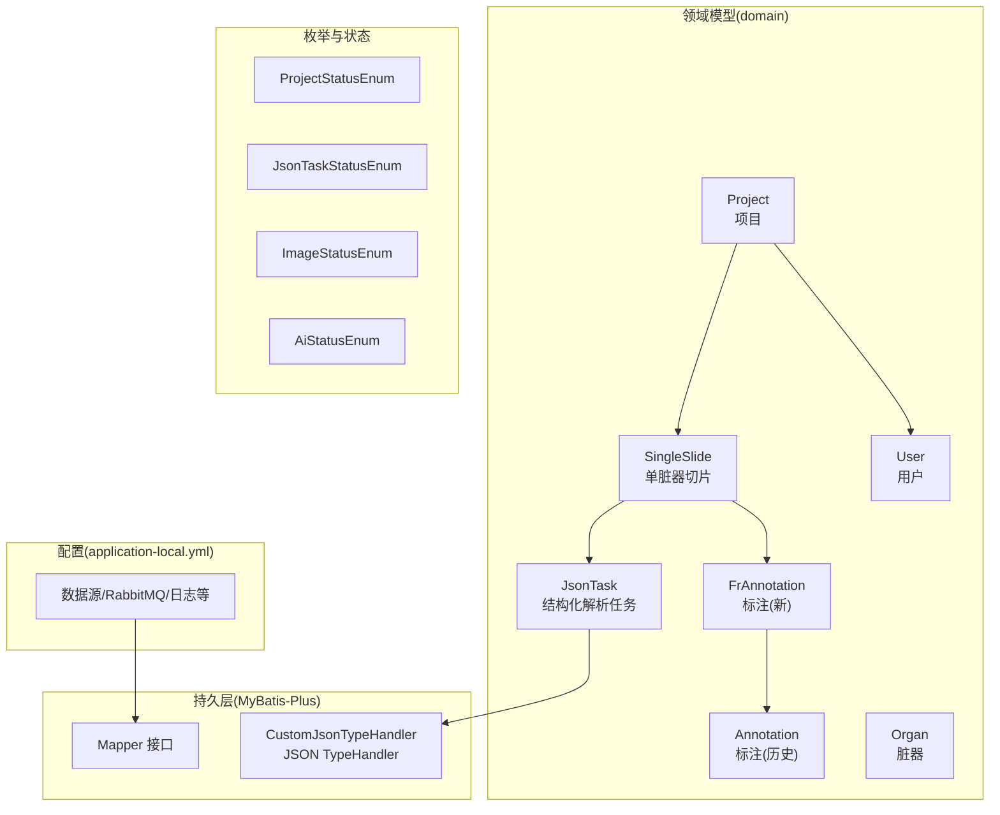
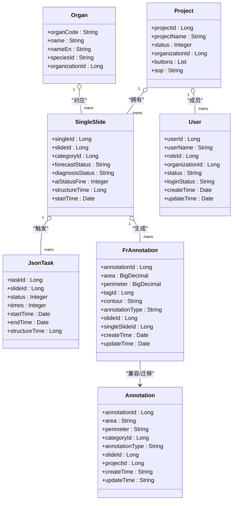
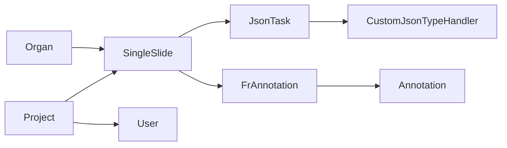

# 核心实体设计

<cite>
**本文引用的文件**
- [SingleSlide.java](file://src/main/java/cn/staitech/fr/domain/SingleSlide.java)
- [Annotation.java](file://src/main/java/cn/staitech/fr/domain/Annotation.java)
- [FrAnnotation.java](file://src/main/java/cn/staitech/fr/domain/FrAnnotation.java)
- [JsonTask.java](file://src/main/java/cn/staitech/fr/domain/JsonTask.java)
- [Organ.java](file://src/main/java/cn/staitech/fr/domain/Organ.java)
- [Project.java](file://src/main/java/cn/staitech/fr/domain/Project.java)
- [User.java](file://src/main/java/cn/staitech/fr/domain/User.java)
- [ProjectStatusEnum.java](file://src/main/java/cn/staitech/fr/enums/ProjectStatusEnum.java)
- [JsonTaskStatusEnum.java](file://src/main/java/cn/staitech/fr/enums/JsonTaskStatusEnum.java)
- [ImageStatusEnum.java](file://src/main/java/cn/staitech/fr/enums/ImageStatusEnum.java)
- [AiStatusEnum.java](file://src/main/java/cn/staitech/fr/enums/AiStatusEnum.java)
- [CustomJsonTypeHandler.java](file://src/main/java/cn/staitech/fr/mapper/handler/CustomJsonTypeHandler.java)
- [application-local.yml](file://src/main/resources/application-local.yml)
</cite>

## 目录
1. [简介](#简介)
2. [项目结构](#项目结构)
3. [核心组件](#核心组件)
4. [架构概览](#架构概览)
5. [详细组件分析](#详细组件分析)
6. [依赖分析](#依赖分析)
7. [性能考虑](#性能考虑)
8. [故障排查指南](#故障排查指南)
9. [结论](#结论)
10. [附录](#附录)

## 简介
本设计文档聚焦于FR模块的核心实体，包括SingleSlide、Annotation、FrAnnotation、JsonTask、Organ、Project、User等，系统性阐述各实体的字段定义、数据类型、业务含义、状态转换与生命周期管理、字段验证规则与默认值、以及序列化与反序列化处理方式。旨在帮助开发者与产品人员快速理解并正确使用这些核心模型。

## 项目结构
FR模块采用分层架构，核心实体位于domain包，枚举与状态常量位于enums包，数据库映射通过MyBatis-Plus注解映射到数据库表，JSON字段通过自定义TypeHandler进行序列化/反序列化处理。配置文件application-local.yml提供数据源、MQ、日志等运行时参数。

**图表来源**
- [SingleSlide.java:1-77](file://src/main/java/cn/staitech/fr/domain/SingleSlide.java#L1-L77)
- [Annotation.java:1-352](file://src/main/java/cn/staitech/fr/domain/Annotation.java#L1-L352)
- [FrAnnotation.java:1-123](file://src/main/java/cn/staitech/fr/domain/FrAnnotation.java#L1-L123)
- [JsonTask.java:1-69](file://src/main/java/cn/staitech/fr/domain/JsonTask.java#L1-L69)
- [Organ.java:1-88](file://src/main/java/cn/staitech/fr/domain/Organ.java#L1-L88)
- [Project.java:1-117](file://src/main/java/cn/staitech/fr/domain/Project.java#L1-L117)
- [User.java:1-216](file://src/main/java/cn/staitech/fr/domain/User.java#L1-L216)
- [ProjectStatusEnum.java:1-51](file://src/main/java/cn/staitech/fr/enums/ProjectStatusEnum.java#L1-L51)
- [JsonTaskStatusEnum.java:1-16](file://src/main/java/cn/staitech/fr/enums/JsonTaskStatusEnum.java#L1-L16)
- [ImageStatusEnum.java:1-43](file://src/main/java/cn/staitech/fr/enums/ImageStatusEnum.java#L1-L43)
- [AiStatusEnum.java:1-25](file://src/main/java/cn/staitech/fr/enums/AiStatusEnum.java#L1-L25)
- [CustomJsonTypeHandler.java:1-102](file://src/main/java/cn/staitech/fr/mapper/handler/CustomJsonTypeHandler.java#L1-L102)
- [application-local.yml:1-311](file://src/main/resources/application-local.yml#L1-L311)

**章节来源**
- [application-local.yml:1-311](file://src/main/resources/application-local.yml#L1-L311)

## 核心组件
本节概述各核心实体的职责与关键字段，后续章节将逐项展开。

- SingleSlide：单脏器切片实体，承载单脏器级别的结构化状态、诊断状态、AI分析状态、时间统计等。
- Annotation：历史标注实体，包含面积、周长、轮廓描述、类别、标注类型、创建/更新信息、切片关联等。
- FrAnnotation：新标注实体，采用BigDecimal存储面积/周长，支持填充策略，字段更贴近新架构。
- JsonTask：结构化解析任务实体，承载任务状态、执行次数、起止时间、数据载荷等。
- Organ：脏器元数据实体，包含脏器编码、名称、种属、机构等。
- Project：项目实体，承载项目基本信息、状态、对照组、负责人、机构、SOP等。
- User：用户实体，包含用户基础信息、角色、机构、登录状态、创建/更新信息等。

**章节来源**
- [SingleSlide.java:1-77](file://src/main/java/cn/staitech/fr/domain/SingleSlide.java#L1-L77)
- [Annotation.java:1-352](file://src/main/java/cn/staitech/fr/domain/Annotation.java#L1-L352)
- [FrAnnotation.java:1-123](file://src/main/java/cn/staitech/fr/domain/FrAnnotation.java#L1-L123)
- [JsonTask.java:1-69](file://src/main/java/cn/staitech/fr/domain/JsonTask.java#L1-L69)
- [Organ.java:1-88](file://src/main/java/cn/staitech/fr/domain/Organ.java#L1-L88)
- [Project.java:1-117](file://src/main/java/cn/staitech/fr/domain/Project.java#L1-L117)
- [User.java:1-216](file://src/main/java/cn/staitech/fr/domain/User.java#L1-L216)

## 架构概览
下图展示核心实体之间的关系与交互，以及状态枚举在流程中的作用。

**图表来源**
- [Project.java:1-117](file://src/main/java/cn/staitech/fr/domain/Project.java#L1-L117)
- [SingleSlide.java:1-77](file://src/main/java/cn/staitech/fr/domain/SingleSlide.java#L1-L77)
- [JsonTask.java:1-69](file://src/main/java/cn/staitech/fr/domain/JsonTask.java#L1-L69)
- [FrAnnotation.java:1-123](file://src/main/java/cn/staitech/fr/domain/FrAnnotation.java#L1-L123)
- [Annotation.java:1-352](file://src/main/java/cn/staitech/fr/domain/Annotation.java#L1-L352)
- [Organ.java:1-88](file://src/main/java/cn/staitech/fr/domain/Organ.java#L1-L88)
- [User.java:1-216](file://src/main/java/cn/staitech/fr/domain/User.java#L1-L216)

## 详细组件分析

### SingleSlide 单脏器切片
- 字段与类型
  - singleId: Long（主键）
  - slideId: Long（切片ID）
  - thumbUrl: String（单脏器图片缩略图地址）
  - categoryId: Long（单脏器类型/脏器分类）
  - forecastStatus: String（结构化状态：0未预测、1预测成功、2预测失败、3预测中）
  - diagnosisStatus: String（人工诊断状态：0未诊断、1已诊断）
  - createTime: Date（创建时间）
  - description: String（单切片描述）
  - abnormalStatus: String（异常状态：0默认值、1未见异常）
  - abnormalCreateBy: Long（未见异常创建人）
  - abnormalCreateTime: Date（未见异常创建时间）
  - area: String（精细轮廓总面积）
  - perimeter: String（精细轮廓总周长）
  - aiStatusFine: Integer（精细轮廓分析状态：0未预测、1预测成功、2预测失败、3预测中）
  - fineContourTime: Long（精细轮廓总时间）
  - structureTime: Long（结构化总时间）
  - startTime: Date（AI算法开始时间）
  - screeningDifferenceStatus: Long（筛选差异状态）
- 业务含义
  - 记录单脏器切片的结构化与诊断状态、AI分析过程与结果统计，支撑项目层面的组织学评估与报告生成。
- 状态转换与生命周期
  - 结构化状态：未预测 → 预测中 → 成功/失败
  - 诊断状态：未诊断 → 已诊断
  - 生命周期：创建 → 结构化中 → 结构化完成/失败 → 诊断完成
- 字段验证规则与默认值
  - 无显式校验注解，建议在服务层对forecastStatus/diagnosisStatus进行取值范围校验。
  - 默认值：aiStatusFine默认可按业务约定初始化为0（未预测），abnormalStatus默认0。
- 序列化与反序列化
  - 作为MyBatis-Plus实体，默认由框架处理字段映射；复杂字段（如面积/周长）在新标注实体中采用BigDecimal，此处为字符串，注意前后端统一解析。

**章节来源**
- [SingleSlide.java:1-77](file://src/main/java/cn/staitech/fr/domain/SingleSlide.java#L1-L77)

### Annotation 历史标注
- 字段与类型
  - annotationId: Long（主键）
  - area/perimeter: String（面积/周长）
  - description: String（轮廓描述）
  - categoryId: Long（轮廓标签/类别）
  - locationType: String（轮廓类型）
  - annotationType: String（标注类型：AI/Draw）
  - createBy/updateBy: Long（创建/更新者）
  - createTime/updateTime: String（创建/更新时间，格式化为字符串）
  - projectId: Long（项目ID）
  - contourPolygon: String（矩形轮廓）
  - slideId: Long（切片ID）
  - id: String（GeoJSON中数据ID）
  - contour: String（轮廓坐标，非持久字段）
  - contour40000/contour10000/contour5000/contour2500/contour625: String/byte[]（多分辨率轮廓）
  - contourType: Long（轮廓类型：1矩形、2标注轮廓）
  - singleSlideId: Long（单脏器切片ID）
  - 其他临时字段：operation、sequenceNumber、filigreeContour、structureSizeList、magnification/magnifications、collectContour、results、intersectsResults、structureSize、structureAreaNum、structurePerimeterNum、insideOrOutside、singleSlideIdList、categoryIdList、categoryIdLists、contourList、cellType、contourOne、contourTwo、meanDistance/minDistance、results40000/results10000/results2500/results625、count、dynamicData、dynamicDataList、areaName/perimeterName/countName、areaUnit/perimeterUnit/areaValue/perimeterValue、countUnit、idList、effectiveArea、tagId、structureId等
- 业务含义
  - 历史标注记录，包含多分辨率轮廓、动态数据、统计结果等，用于兼容旧版本或特定分析场景。
- 状态转换与生命周期
  - 作为只读或历史数据，不直接参与状态机；与FrAnnotation存在兼容关系。
- 字段验证规则与默认值
  - createTime/updateTime格式化为字符串，需确保前后端一致。
  - count默认0，countUnit默认“个”。
- 序列化与反序列化
  - 动态数据dynamicData通过JSON.parseObject解析为dynamicDataList，注意异常处理与空值判断。

**章节来源**
- [Annotation.java:1-352](file://src/main/java/cn/staitech/fr/domain/Annotation.java#L1-L352)

### FrAnnotation 新标注
- 字段与类型
  - annotationId: Long（主键）
  - area: BigDecimal（面积）
  - perimeter: BigDecimal（周长）
  - description: String（轮廓描述）
  - tagId: Long（标签ID）
  - contour: String（轮廓坐标625）
  - locationType: String（轮廓类型）
  - annotationType: String（标注类型：AI/Draw）
  - createBy/createTime: Long/Date（创建者与时间，自动填充）
  - updateBy/updateTime: Long/Date（更新者与时间，自动填充）
  - slideId: Long（切片ID）
  - jsonId: String（GeoJSON中数据ID）
  - contourType: Integer（标注类型：默认0；1粗轮廓；2精细轮廓）
  - categoryId: Long（类别ID）
  - contourPolygon: String（多边形轮廓）
  - singleSlideId: Long（单脏器切片ID）
  - structureId: String（组织轮廓ID）
  - list: List<FrAnnotation>（子级标注集合）
- 业务含义
  - 新标注实体，采用BigDecimal存储面积/周长，支持MyBatis-Plus字段填充策略，字段更清晰、类型更严谨。
- 状态转换与生命周期
  - 与SingleSlide关联，随切片结构化流程产生；与Annotation存在兼容关系。
- 字段验证规则与默认值
  - BigDecimal字段建议在服务层进行非负数校验。
  - contourType默认0，表示通用标注。
- 序列化与反序列化
  - 由MyBatis-Plus与Jackson处理，默认日期格式化遵循@JsonFormat。

**章节来源**
- [FrAnnotation.java:1-123](file://src/main/java/cn/staitech/fr/domain/FrAnnotation.java#L1-L123)

### JsonTask 结构化解析任务
- 字段与类型
  - taskId: Long（主键）
  - slideId: Long（切片ID）
  - specialId: Long（专题ID）
  - imageId: Long（图像ID）
  - singleId: Long（单脏器切片ID）
  - organizationId: Long（机构ID）
  - categoryId: Long（脏器标签ID）
  - algorithmCode: String（算法名称标识）
  - code/msg: String（状态码与消息）
  - data: String（data内容，JSON字符串）
  - status: Integer（状态：0未解析、1解析中、2解析成功、3解析失败、4待开始）
  - times: Integer（执行次数）
  - startTime/endTime/createTime/updateTime: Date（时间戳）
  - structureTime: Long（结构化时间，非持久字段）
- 业务含义
  - 描述结构化解析任务的生命周期与执行状态，承载算法返回的数据载荷。
- 状态转换与生命周期
  - 待开始 → 解析中 → 成功/失败
  - 支持重试机制（times递增）
- 字段验证规则与默认值
  - status取值范围：0~4；times默认0；data为空字符串表示无数据。
- 序列化与反序列化
  - data为JSON字符串，建议在服务层进行严格校验与异常捕获。

**章节来源**
- [JsonTask.java:1-69](file://src/main/java/cn/staitech/fr/domain/JsonTask.java#L1-L69)
- [JsonTaskStatusEnum.java:1-16](file://src/main/java/cn/staitech/fr/enums/JsonTaskStatusEnum.java#L1-L16)

### Organ 脏器
- 字段与类型
  - organCode: String（脏器编码，映射为organId）
  - name/nameEn: String（脏器名称与英文名）
  - speciesId: String（种属编码）
  - organizationId: Long（机构ID）
- 业务含义
  - 脏器元数据，用于项目与切片的脏器维度关联。
- 状态转换与生命周期
  - 作为静态元数据，无状态转换。
- 字段验证规则与默认值
  - organCode唯一性约束（数据库层面），建议在服务层进行重复校验。
- 序列化与反序列化
  - 通过@JsonProperty映射字段名，遵循Jackson默认行为。

**章节来源**
- [Organ.java:1-88](file://src/main/java/cn/staitech/fr/domain/Organ.java#L1-L88)

### Project 项目
- 字段与类型
  - projectId: Long（主键）
  - topicId/topicName: Long/String（专题ID与名称）
  - projectName: String（项目名称）
  - speciesId: String（种属ID）
  - trialId/colorType/indicatorId: Integer（试验类型/染色类型/病理指标ID）
  - status: Integer（状态：0待启动、1进行中、2暂停、3已完成、6归档）
  - delFlag: String（删除标志：0正常、1删除）
  - organizationId: Long（机构ID）
  - controlGroup: String（对照组）
  - principal/createBy/updateBy: Long（项目负责人/创建者/更新者）
  - createTime/updateTime: Date（创建/更新时间）
  - isPermanentDel: Boolean（是否永久删除）
  - buttons: List<String>（操作按钮，非持久字段）
  - speciesName/speciesNameEn: String（种属名称，非持久字段）
  - isAiTrained: Boolean（是否启动过AI分析，非持久字段）
  - sop: String（SOP，默认PATH001）
  - productionSave: Integer（制片信息是否保存过：0未保存、1已保存）
- 业务含义
  - 项目实体，承载项目全生命周期信息与元数据。
- 状态转换与生命周期
  - 待启动 → 进行中 → 暂停/完成/归档
  - 归档后仍可查询，但不可编辑。
- 字段验证规则与默认值
  - status取值范围：0,1,2,3,6；sop默认PATH001；productionSave默认0。
- 序列化与反序列化
  - 通过MyBatis-Plus注解映射字段，遵循默认序列化策略。

**章节来源**
- [Project.java:1-117](file://src/main/java/cn/staitech/fr/domain/Project.java#L1-L117)
- [ProjectStatusEnum.java:1-51](file://src/main/java/cn/staitech/fr/enums/ProjectStatusEnum.java#L1-L51)

### User 用户
- 字段与类型
  - userId: Long（主键）
  - userCode: Integer（用户编码）
  - roleId: Long（角色ID）
  - organizationId: Long（机构ID）
  - userName/nickName: String（用户账号/昵称）
  - userType: String（用户类型：0系统用户）
  - dept: String（部门）
  - email/phonenumber: String（邮箱/手机号）
  - sex: String（性别：0男、1女）
  - password: String（密码）
  - status: String（帐号状态：0正常、1停用）
  - delFlag: String（删除标志：0存在、1删除）
  - loginStatus: String（登录状态：0首次登录、1非首次登录）
  - loginIp/loginDate: String/Date（最后登录IP/时间）
  - createBy/updateBy: Long（创建者/更新者）
  - createTime/updateTime: Date（创建/更新时间）
- 业务含义
  - 用户信息实体，支撑项目成员管理与权限控制。
- 状态转换与生命周期
  - 账号状态：正常/停用；删除标志：存在/删除；登录状态：首次/非首次。
- 字段验证规则与默认值
  - 性别取值：0/1；状态取值：0/1；delFlag取值：0/1；默认登录状态0。
- 序列化与反序列化
  - 通过MyBatis-Plus注解映射字段，遵循默认序列化策略。

**章节来源**
- [User.java:1-216](file://src/main/java/cn/staitech/fr/domain/User.java#L1-L216)

## 依赖分析
- 实体间依赖
  - Project → SingleSlide：一个项目包含多个单脏器切片。
  - SingleSlide → JsonTask：单切片触发结构化解析任务。
  - SingleSlide → FrAnnotation：单切片生成标注。
  - FrAnnotation → Annotation：新旧标注兼容。
  - Project → User：项目成员关系。
  - Organ → SingleSlide：脏器与切片关联。
- 状态枚举依赖
  - Project.status ↔ ProjectStatusEnum
  - JsonTask.status ↔ JsonTaskStatusEnum
  - SingleSlide.forecastStatus/diagnosisStatus ↔ 业务状态（字符串）
  - Slide.aiStatus ↔ AiStatusEnum
- JSON处理依赖
  - Annotation.dynamicData ↔ CustomJsonTypeHandler（自定义JSON TypeHandler）

**图表来源**
- [Project.java:1-117](file://src/main/java/cn/staitech/fr/domain/Project.java#L1-L117)
- [SingleSlide.java:1-77](file://src/main/java/cn/staitech/fr/domain/SingleSlide.java#L1-L77)
- [JsonTask.java:1-69](file://src/main/java/cn/staitech/fr/domain/JsonTask.java#L1-L69)
- [FrAnnotation.java:1-123](file://src/main/java/cn/staitech/fr/domain/FrAnnotation.java#L1-L123)
- [Annotation.java:1-352](file://src/main/java/cn/staitech/fr/domain/Annotation.java#L1-L352)
- [Organ.java:1-88](file://src/main/java/cn/staitech/fr/domain/Organ.java#L1-L88)
- [User.java:1-216](file://src/main/java/cn/staitech/fr/domain/User.java#L1-L216)
- [CustomJsonTypeHandler.java:1-102](file://src/main/java/cn/staitech/fr/mapper/handler/CustomJsonTypeHandler.java#L1-L102)

**章节来源**
- [ProjectStatusEnum.java:1-51](file://src/main/java/cn/staitech/fr/enums/ProjectStatusEnum.java#L1-L51)
- [JsonTaskStatusEnum.java:1-16](file://src/main/java/cn/staitech/fr/enums/JsonTaskStatusEnum.java#L1-L16)
- [AiStatusEnum.java:1-25](file://src/main/java/cn/staitech/fr/enums/AiStatusEnum.java#L1-L25)
- [ImageStatusEnum.java:1-43](file://src/main/java/cn/staitech/fr/enums/ImageStatusEnum.java#L1-L43)

## 性能考虑
- JSON字段处理
  - 自定义JSON TypeHandler提供泛型支持，避免频繁装箱拆箱，提升序列化/反序列化性能。
- 多分辨率轮廓
  - Annotation提供多分辨率轮廓字段，建议仅在需要时加载，减少网络传输与内存占用。
- 状态字段
  - 状态枚举与字符串状态并存，建议统一使用枚举以减少比较开销与错误风险。
- 数据库连接池
  - application-local.yml配置了HikariCP参数，建议根据并发与QPS调优最大连接数与空闲超时。

[本节为通用指导，无需具体文件引用]

## 故障排查指南
- JSON反序列化失败
  - 现象：CustomJsonTypeHandler抛出运行时异常。
  - 排查：检查JSON字符串格式、字段类型匹配、ObjectMapper配置。
  - 参考：[CustomJsonTypeHandler.java:38-53](file://src/main/java/cn/staitech/fr/mapper/handler/CustomJsonTypeHandler.java#L38-L53)
- 状态值越界
  - 现象：项目/任务状态值不在枚举范围内。
  - 排查：核对ProjectStatusEnum/JsonTaskStatusEnum取值范围。
  - 参考：[ProjectStatusEnum.java:11-25](file://src/main/java/cn/staitech/fr/enums/ProjectStatusEnum.java#L11-L25)、[JsonTaskStatusEnum.java:6-14](file://src/main/java/cn/staitech/fr/enums/JsonTaskStatusEnum.java#L6-L14)
- 时间格式不一致
  - 现象：Annotation.createTime/updateTime为字符串格式化，前端解析异常。
  - 排查：统一前后端时间格式，建议使用ISO-8601。
  - 参考：[Annotation.java:68-80](file://src/main/java/cn/staitech/fr/domain/Annotation.java#L68-L80)
- 数据库连接问题
  - 现象：连接超时/拒绝。
  - 排查：检查application-local.yml中数据源配置与HikariCP参数。
  - 参考：[application-local.yml:15-56](file://src/main/resources/application-local.yml#L15-L56)

**章节来源**
- [CustomJsonTypeHandler.java:38-53](file://src/main/java/cn/staitech/fr/mapper/handler/CustomJsonTypeHandler.java#L38-L53)
- [ProjectStatusEnum.java:11-25](file://src/main/java/cn/staitech/fr/enums/ProjectStatusEnum.java#L11-L25)
- [JsonTaskStatusEnum.java:6-14](file://src/main/java/cn/staitech/fr/enums/JsonTaskStatusEnum.java#L6-L14)
- [Annotation.java:68-80](file://src/main/java/cn/staitech/fr/domain/Annotation.java#L68-L80)
- [application-local.yml:15-56](file://src/main/resources/application-local.yml#L15-L56)

## 结论
本文系统梳理了FR模块核心实体的字段定义、业务含义、状态与生命周期、验证与默认值、以及序列化/反序列化处理方式。建议在实际开发中：
- 统一使用枚举管理状态，避免魔法字符串；
- 对JSON字段进行严格的格式与类型校验；
- 合理利用多分辨率轮廓与字段填充策略，优化性能与用户体验；
- 在服务层补充必要的字段校验与默认值处理，确保数据一致性。

[本节为总结性内容，无需具体文件引用]

## 附录
- 状态枚举一览
  - 项目状态：待启动、进行中、暂停、完成
  - 任务状态：未解析、解析中、解析成功、解析失败、待开始
  - 图像状态：上传中、上传失败、解析中、解析失败、信息解析中、信息解析失败、处理中、处理失败、可用
  - AI状态：未分析、脏器识别中、脏器识别异常、脏器识别完成
- 关键配置参考
  - 数据源与连接池参数
  - RabbitMQ队列与重试策略
  - 日志级别与MyBatis配置

**章节来源**
- [ProjectStatusEnum.java:11-49](file://src/main/java/cn/staitech/fr/enums/ProjectStatusEnum.java#L11-L49)
- [JsonTaskStatusEnum.java:6-14](file://src/main/java/cn/staitech/fr/enums/JsonTaskStatusEnum.java#L6-L14)
- [ImageStatusEnum.java:7-41](file://src/main/java/cn/staitech/fr/enums/ImageStatusEnum.java#L7-L41)
- [AiStatusEnum.java:3-23](file://src/main/java/cn/staitech/fr/enums/AiStatusEnum.java#L3-L23)
- [application-local.yml:55-106](file://src/main/resources/application-local.yml#L55-L106)