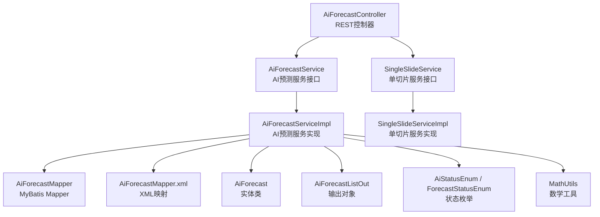
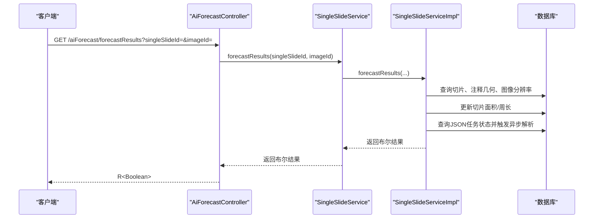
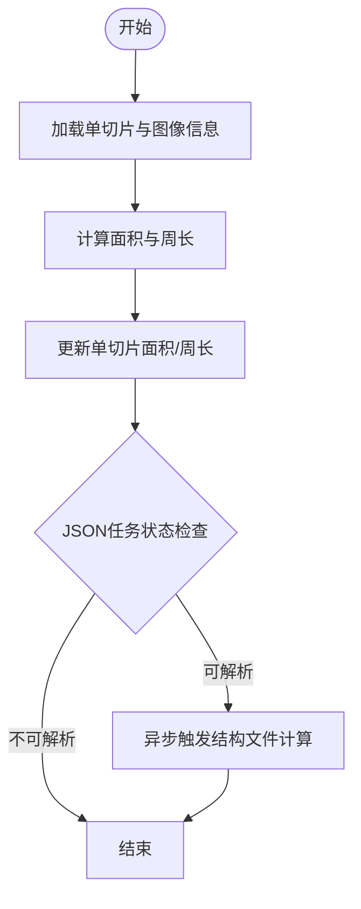
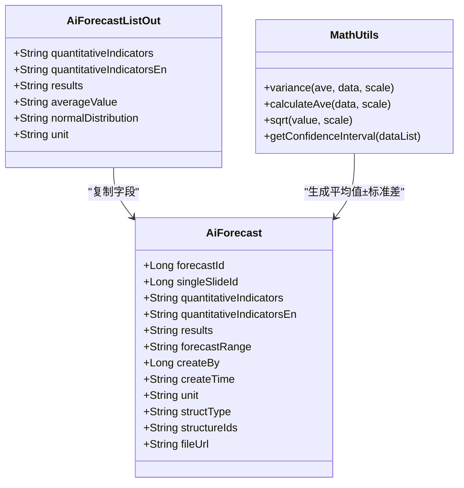
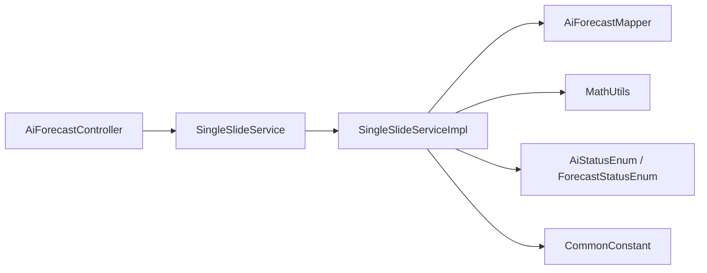

# AI预测模块

<cite>
**本文引用的文件**
- [AiForecastController.java](file://src/main/java/cn/staitech/fr/controller/AiForecastController.java)
- [AiForecastService.java](file://src/main/java/cn/staitech/fr/service/AiForecastService.java)
- [AiForecastServiceImpl.java](file://src/main/java/cn/staitech/fr/service/impl/AiForecastServiceImpl.java)
- [AiForecastMapper.java](file://src/main/java/cn/staitech/fr/mapper/AiForecastMapper.java)
- [AiForecastMapper.xml](file://src/main/resources/mapper/AiForecastMapper.xml)
- [AiForecast.java](file://src/main/java/cn/staitech/fr/domain/AiForecast.java)
- [AiForecastListOut.java](file://src/main/java/cn/staitech/fr/domain/out/AiForecastListOut.java)
- [SingleSlideService.java](file://src/main/java/cn/staitech/fr/service/SingleSlideService.java)
- [SingleSlideServiceImpl.java](file://src/main/java/cn/staitech/fr/service/impl/SingleSlideServiceImpl.java)
- [AiStatusEnum.java](file://src/main/java/cn/staitech/fr/enums/AiStatusEnum.java)
- [ForecastStatusEnum.java](file://src/main/java/cn/staitech/fr/enums/ForecastStatusEnum.java)
- [OrganStructureConfig.java](file://src/main/java/cn/staitech/fr/config/OrganStructureConfig.java)
- [CommonConstant.java](file://src/main/java/cn/staitech/fr/constant/CommonConstant.java)
- [MathUtils.java](file://src/main/java/cn/staitech/fr/utils/MathUtils.java)
</cite>

## 目录
1. [简介](#简介)
2. [项目结构](#项目结构)
3. [核心组件](#核心组件)
4. [架构总览](#架构总览)
5. [详细组件分析](#详细组件分析)
6. [依赖分析](#依赖分析)
7. [性能考虑](#性能考虑)
8. [故障排查指南](#故障排查指南)
9. [结论](#结论)
10. [附录](#附录)

## 简介
本文件面向AI预测模块，系统性阐述其REST API接口设计、预测结果查询与状态管理、错误处理机制，以及服务层核心算法逻辑（含数据结构、状态枚举、业务流程）。同时文档化映射器的数据访问模式（数据库操作、查询优化、事务管理），并提供API调用示例、请求/响应格式与错误码说明，解释该模块在系统中的作用及与其它模块的交互关系，并给出性能优化建议与最佳实践。

## 项目结构
AI预测模块主要由以下层次构成：
- 控制层：对外暴露REST接口，接收参数并返回统一响应包装。
- 服务层：封装预测结果计算、批量插入、范围设置等核心业务逻辑。
- 映射层：MyBatis Mapper负责数据库访问，包含基础查询与扩展查询。
- 领域模型：实体类描述数据库表结构与序列化字段。
- 枚举与常量：状态枚举、通用常量用于规范业务语义与单位。
- 工具类：数学运算工具，支持均值、方差、标准差与置信区间的计算。

图表来源
- [AiForecastController.java:1-31](file://src/main/java/cn/staitech/fr/controller/AiForecastController.java#L1-L31)
- [AiForecastService.java:1-29](file://src/main/java/cn/staitech/fr/service/AiForecastService.java#L1-L29)
- [AiForecastServiceImpl.java:1-372](file://src/main/java/cn/staitech/fr/service/impl/AiForecastServiceImpl.java#L1-L372)
- [AiForecastMapper.java:1-22](file://src/main/java/cn/staitech/fr/mapper/AiForecastMapper.java#L1-L22)
- [AiForecastMapper.xml:1-39](file://src/main/resources/mapper/AiForecastMapper.xml#L1-L39)
- [AiForecast.java:1-84](file://src/main/java/cn/staitech/fr/domain/AiForecast.java#L1-L84)
- [AiForecastListOut.java:1-43](file://src/main/java/cn/staitech/fr/domain/out/AiForecastListOut.java#L1-L43)
- [AiStatusEnum.java:1-25](file://src/main/java/cn/staitech/fr/enums/AiStatusEnum.java#L1-L25)
- [ForecastStatusEnum.java:1-16](file://src/main/java/cn/staitech/fr/enums/ForecastStatusEnum.java#L1-L16)
- [MathUtils.java:1-360](file://src/main/java/cn/staitech/fr/utils/MathUtils.java#L1-L360)

章节来源
- [AiForecastController.java:1-31](file://src/main/java/cn/staitech/fr/controller/AiForecastController.java#L1-L31)
- [AiForecastService.java:1-29](file://src/main/java/cn/staitech/fr/service/AiForecastService.java#L1-L29)
- [AiForecastServiceImpl.java:1-372](file://src/main/java/cn/staitech/fr/service/impl/AiForecastServiceImpl.java#L1-L372)
- [AiForecastMapper.java:1-22](file://src/main/java/cn/staitech/fr/mapper/AiForecastMapper.java#L1-L22)
- [AiForecastMapper.xml:1-39](file://src/main/resources/mapper/AiForecastMapper.xml#L1-L39)
- [AiForecast.java:1-84](file://src/main/java/cn/staitech/fr/domain/AiForecast.java#L1-L84)
- [AiForecastListOut.java:1-43](file://src/main/java/cn/staitech/fr/domain/out/AiForecastListOut.java#L1-L43)
- [AiStatusEnum.java:1-25](file://src/main/java/cn/staitech/fr/enums/AiStatusEnum.java#L1-L25)
- [ForecastStatusEnum.java:1-16](file://src/main/java/cn/staitech/fr/enums/ForecastStatusEnum.java#L1-L16)
- [MathUtils.java:1-360](file://src/main/java/cn/staitech/fr/utils/MathUtils.java#L1-L360)

## 核心组件
- REST控制器：提供“预测结果”接口，接收单切片ID与图片ID，返回布尔型结果。
- 服务接口与实现：负责面积/周长换算、状态更新、异步指标计算触发、批量插入预测结果、按结构类型筛选与范围设置。
- 映射器与XML：提供基础CRUD与扩展查询（如按单切片查询算法信息）。
- 领域模型与输出对象：描述预测结果表结构与输出字段（含平均值±标准差、正态分布区间）。
- 枚举与常量：定义AI状态、预测状态、单位与通用字符串常量。
- 数学工具：提供均值、方差、标准差与置信区间计算，并将原始数据落盘以便溯源。

章节来源
- [AiForecastController.java:26-30](file://src/main/java/cn/staitech/fr/controller/AiForecastController.java#L26-L30)
- [AiForecastService.java:16-28](file://src/main/java/cn/staitech/fr/service/AiForecastService.java#L16-L28)
- [AiForecastServiceImpl.java:85-157](file://src/main/java/cn/staitech/fr/service/impl/AiForecastServiceImpl.java#L85-L157)
- [AiForecastMapper.xml:24-37](file://src/main/resources/mapper/AiForecastMapper.xml#L24-L37)
- [AiForecast.java:18-84](file://src/main/java/cn/staitech/fr/domain/AiForecast.java#L18-L84)
- [AiForecastListOut.java:12-42](file://src/main/java/cn/staitech/fr/domain/out/AiForecastListOut.java#L12-L42)
- [AiStatusEnum.java:3-24](file://src/main/java/cn/staitech/fr/enums/AiStatusEnum.java#L3-L24)
- [ForecastStatusEnum.java:6-15](file://src/main/java/cn/staitech/fr/enums/ForecastStatusEnum.java#L6-L15)
- [CommonConstant.java:8-43](file://src/main/java/cn/staitech/fr/constant/CommonConstant.java#L8-L43)
- [MathUtils.java:78-212](file://src/main/java/cn/staitech/fr/utils/MathUtils.java#L78-L212)

## 架构总览
AI预测模块采用经典的分层架构：
- 控制层：接收HTTP请求，校验参数，调用服务层方法，返回统一响应包装。
- 服务层：执行业务规则（面积/周长换算、脏器特例处理、状态更新、异步任务调度）、聚合数据、计算参考范围。
- 映射层：通过MyBatis访问数据库，提供基础与扩展查询。
- 工具层：数学计算与文件落盘，确保统计结果可追溯。

图表来源
- [AiForecastController.java:27-30](file://src/main/java/cn/staitech/fr/controller/AiForecastController.java#L27-L30)
- [SingleSlideServiceImpl.java:64-138](file://src/main/java/cn/staitech/fr/service/impl/SingleSlideServiceImpl.java#L64-L138)

章节来源
- [AiForecastController.java:26-30](file://src/main/java/cn/staitech/fr/controller/AiForecastController.java#L26-L30)
- [SingleSlideServiceImpl.java:64-138](file://src/main/java/cn/staitech/fr/service/impl/SingleSlideServiceImpl.java#L64-L138)

## 详细组件分析

### REST API 接口设计
- 接口路径：GET /aiForecast/forecastResults
- 请求参数：
  - singleSlideId：单切片ID（必填）
  - imageId：图片ID（必填）
- 返回值：R<Boolean>，成功时返回true，否则false。
- 错误处理：
  - 参数缺失或无效：返回false。
  - 切片不存在或注释几何为空：返回false。
  - 图像分辨率缺失或查询异常：返回false，并记录日志。

章节来源
- [AiForecastController.java:26-30](file://src/main/java/cn/staitech/fr/controller/AiForecastController.java#L26-L30)
- [SingleSlideServiceImpl.java:64-138](file://src/main/java/cn/staitech/fr/service/impl/SingleSlideServiceImpl.java#L64-L138)

### 预测结果查询与状态管理
- 预测结果查询：服务层提供按单切片ID查询预测结果列表的方法，并支持按结构类型过滤。
- 参考范围设置：当项目存在对照组时，按指标、类别、项目、对照组、性别与结构类型计算平均值±标准差与正态分布95%区间。
- 状态管理：
  - 预测状态枚举：未预测、预测成功、预测失败、预测中。
  - AI状态枚举：未分析、脏器识别中、脏器识别异常、脏器识别完成。
  - 在预测失败或异常时，会更新单切片预测状态为失败。

图表来源
- [AiForecastServiceImpl.java:85-157](file://src/main/java/cn/staitech/fr/service/impl/AiForecastServiceImpl.java#L85-L157)
- [SingleSlideServiceImpl.java:117-126](file://src/main/java/cn/staitech/fr/service/impl/SingleSlideServiceImpl.java#L117-L126)

章节来源
- [AiForecastServiceImpl.java:242-306](file://src/main/java/cn/staitech/fr/service/impl/AiForecastServiceImpl.java#L242-L306)
- [AiForecastServiceImpl.java:318-356](file://src/main/java/cn/staitech/fr/service/impl/AiForecastServiceImpl.java#L318-L356)
- [ForecastStatusEnum.java:6-15](file://src/main/java/cn/staitech/fr/enums/ForecastStatusEnum.java#L6-L15)

### 服务实现核心算法逻辑
- 面积/周长换算：基于注释几何面积与图像分辨率，换算为实际物理面积与周长，保留高精度小数。
- 脏器特例处理：针对特定器官（如甲状旁腺、甲状腺）采用不同的几何计算策略。
- 异步任务触发：当JSON任务处于未开始状态且存在有效文件时，使用线程池异步执行结构文件计算。
- 批量插入预测结果：支持两种插入方式：
  - addAiForecast：从结果中解析“均值±标准差@文件路径”，并将文件路径存储到fileUrl字段。
  - addOutIndicators：直接存储输出指标，过滤掉特定条件下的无效结果。
- 结果列表与范围计算：
  - selectList：返回预测结果列表，若存在对照组则附加范围。
  - calculateList：按结构类型过滤，计算平均值±标准差与正态分布区间，并对负值替换为占位符。

图表来源
- [AiForecast.java:18-84](file://src/main/java/cn/staitech/fr/domain/AiForecast.java#L18-L84)
- [AiForecastListOut.java:12-42](file://src/main/java/cn/staitech/fr/domain/out/AiForecastListOut.java#L12-L42)
- [MathUtils.java:78-212](file://src/main/java/cn/staitech/fr/utils/MathUtils.java#L78-L212)

章节来源
- [AiForecastServiceImpl.java:162-239](file://src/main/java/cn/staitech/fr/service/impl/AiForecastServiceImpl.java#L162-L239)
- [AiForecastServiceImpl.java:242-306](file://src/main/java/cn/staitech/fr/service/impl/AiForecastServiceImpl.java#L242-L306)
- [MathUtils.java:78-212](file://src/main/java/cn/staitech/fr/utils/MathUtils.java#L78-L212)

### 数据访问模式与事务管理
- Mapper接口：继承MyBatis基础接口，提供基础CRUD与扩展查询方法。
- XML映射：定义结果映射与SQL查询，如按单切片查询算法信息。
- 事务特性：服务层方法内部未显式声明事务注解，默认遵循Spring事务传播行为；批量插入使用MyBatis-Plus的批量保存。
- 查询优化建议：
  - 为单切片ID建立索引，提升查询效率。
  - 对频繁过滤字段（如structType、singleSlideId）建立复合索引。
  - 控制一次性批量插入的数据规模，避免内存压力。

章节来源
- [AiForecastMapper.java:13-17](file://src/main/java/cn/staitech/fr/mapper/AiForecastMapper.java#L13-L17)
- [AiForecastMapper.xml:24-37](file://src/main/resources/mapper/AiForecastMapper.xml#L24-L37)
- [AiForecastServiceImpl.java:198-200](file://src/main/java/cn/staitech/fr/service/impl/AiForecastServiceImpl.java#L198-L200)

### API 调用示例与响应格式
- 示例请求
  - GET /aiForecast/forecastResults?singleSlideId=1001&imageId=2001
- 成功响应
  - { "code": 200, "message": "操作成功", "data": true }
- 失败响应
  - { "code": 200, "message": "操作成功", "data": false }
- 错误码说明
  - 200：操作成功（统一响应包装）
  - 业务侧错误：返回false（表示预测失败或参数无效）

章节来源
- [AiForecastController.java:26-30](file://src/main/java/cn/staitech/fr/controller/AiForecastController.java#L26-L30)
- [SingleSlideServiceImpl.java:132-137](file://src/main/java/cn/staitech/fr/service/impl/SingleSlideServiceImpl.java#L132-L137)

### 模块交互关系
- 与单切片服务：控制器通过单切片服务执行预测流程，服务层负责面积/周长换算与状态更新。
- 与JSON任务：当任务状态满足条件时，触发异步结构文件计算。
- 与数学工具：计算平均值±标准差与正态分布区间，并将原始数据落盘。
- 与配置：器官结构配置用于结构映射与启用控制。

章节来源
- [AiForecastController.java:23-30](file://src/main/java/cn/staitech/fr/controller/AiForecastController.java#L23-L30)
- [SingleSlideServiceImpl.java:117-126](file://src/main/java/cn/staitech/fr/service/impl/SingleSlideServiceImpl.java#L117-L126)
- [MathUtils.java:180-212](file://src/main/java/cn/staitech/fr/utils/MathUtils.java#L180-L212)
- [OrganStructureConfig.java:14-44](file://src/main/java/cn/staitech/fr/config/OrganStructureConfig.java#L14-L44)

## 依赖分析
- 控制器依赖单切片服务接口，实现松耦合。
- 服务实现依赖多个Mapper与工具类，承担核心业务逻辑。
- 枚举与常量提供统一的状态与单位定义，降低重复与歧义。
- MyBatis映射器提供数据库访问能力，配合批量插入提升性能。

图表来源
- [AiForecastController.java:23-30](file://src/main/java/cn/staitech/fr/controller/AiForecastController.java#L23-L30)
- [SingleSlideServiceImpl.java:40-61](file://src/main/java/cn/staitech/fr/service/impl/SingleSlideServiceImpl.java#L40-L61)
- [AiForecastServiceImpl.java:55-83](file://src/main/java/cn/staitech/fr/service/impl/AiForecastServiceImpl.java#L55-L83)
- [AiStatusEnum.java:3-24](file://src/main/java/cn/staitech/fr/enums/AiStatusEnum.java#L3-L24)
- [ForecastStatusEnum.java:6-15](file://src/main/java/cn/staitech/fr/enums/ForecastStatusEnum.java#L6-L15)
- [CommonConstant.java:8-43](file://src/main/java/cn/staitech/fr/constant/CommonConstant.java#L8-L43)

章节来源
- [AiForecastController.java:23-30](file://src/main/java/cn/staitech/fr/controller/AiForecastController.java#L23-L30)
- [SingleSlideServiceImpl.java:40-61](file://src/main/java/cn/staitech/fr/service/impl/SingleSlideServiceImpl.java#L40-L61)
- [AiForecastServiceImpl.java:55-83](file://src/main/java/cn/staitech/fr/service/impl/AiForecastServiceImpl.java#L55-L83)

## 性能考虑
- 线程池与异步：使用有界阻塞队列与丢弃最老任务策略的线程池，避免内存溢出；通过TTL包装线程池保证上下文传递。
- 批量插入：使用MyBatis-Plus批量保存，减少数据库往返。
- 数学计算：使用高精度BigDecimal，避免浮点误差；对大量数据进行分批处理与落盘，降低内存峰值。
- 数据库索引：为高频查询字段建立索引，减少全表扫描。
- 缓存与配置：通过配置类集中管理结构映射，便于维护与扩展。

章节来源
- [AiForecastServiceImpl.java:55-57](file://src/main/java/cn/staitech/fr/service/impl/AiForecastServiceImpl.java#L55-L57)
- [SingleSlideServiceImpl.java:40-43](file://src/main/java/cn/staitech/fr/service/impl/SingleSlideServiceImpl.java#L40-L43)
- [MathUtils.java:180-212](file://src/main/java/cn/staitech/fr/utils/MathUtils.java#L180-L212)

## 故障排查指南
- 接口返回false
  - 检查singleSlideId与imageId是否传入且有效。
  - 确认切片是否存在、注释几何是否计算成功。
  - 检查图像分辨率字段是否缺失。
- 预测失败状态
  - 观察日志中异常堆栈，定位具体异常位置。
  - 确认JSON任务状态与文件状态是否满足异步触发条件。
- 参考范围不显示
  - 确认项目对照组配置是否正确。
  - 检查指标、类别、性别与结构类型是否匹配。
- 数学计算异常
  - 检查输入数据是否为空或负值，必要时过滤无效数据。
  - 查看落盘文件是否存在且可读。

章节来源
- [SingleSlideServiceImpl.java:132-137](file://src/main/java/cn/staitech/fr/service/impl/SingleSlideServiceImpl.java#L132-L137)
- [AiForecastServiceImpl.java:318-356](file://src/main/java/cn/staitech/fr/service/impl/AiForecastServiceImpl.java#L318-L356)
- [MathUtils.java:257-294](file://src/main/java/cn/staitech/fr/utils/MathUtils.java#L257-L294)

## 结论
AI预测模块通过清晰的分层设计与稳健的业务逻辑，实现了从几何测量到预测结果计算、范围设置与异步任务调度的完整闭环。借助枚举与常量统一语义，利用数学工具保障统计准确性，并通过映射层与批量插入提升性能。建议在生产环境中完善索引、监控异步任务与落盘文件，持续优化性能与稳定性。

## 附录
- 关键数据结构
  - AiForecast：预测结果实体，包含指标、结果、单位、结构类型、文件URL等。
  - AiForecastListOut：输出对象，包含平均值±标准差与正态分布区间。
- 状态枚举
  - AiStatusEnum：AI状态枚举。
  - ForecastStatusEnum：预测状态枚举。
- 常量
  - CommonConstant：单位、通用字符串与文件路径模板等。

章节来源
- [AiForecast.java:18-84](file://src/main/java/cn/staitech/fr/domain/AiForecast.java#L18-L84)
- [AiForecastListOut.java:12-42](file://src/main/java/cn/staitech/fr/domain/out/AiForecastListOut.java#L12-L42)
- [AiStatusEnum.java:3-24](file://src/main/java/cn/staitech/fr/enums/AiStatusEnum.java#L3-L24)
- [ForecastStatusEnum.java:6-15](file://src/main/java/cn/staitech/fr/enums/ForecastStatusEnum.java#L6-L15)
- [CommonConstant.java:8-43](file://src/main/java/cn/staitech/fr/constant/CommonConstant.java#L8-L43)