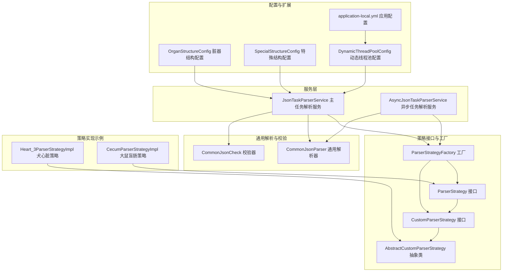
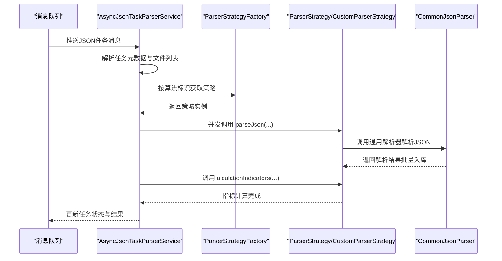
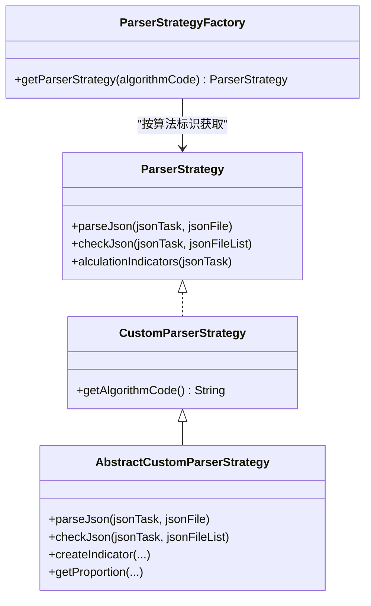
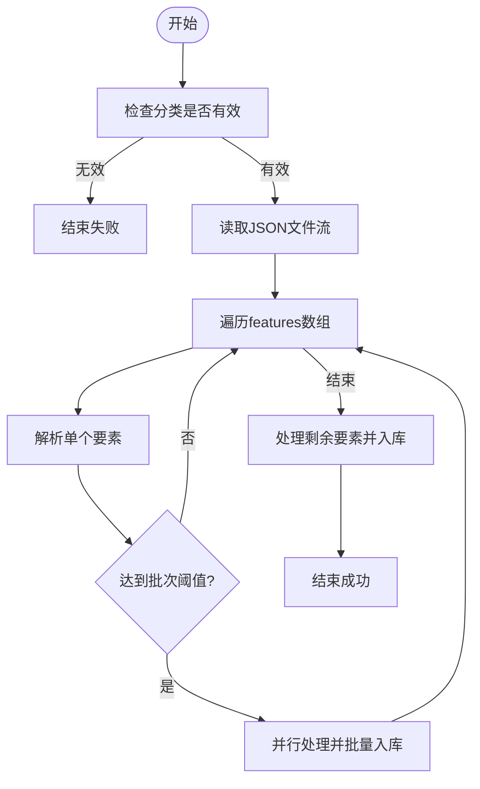
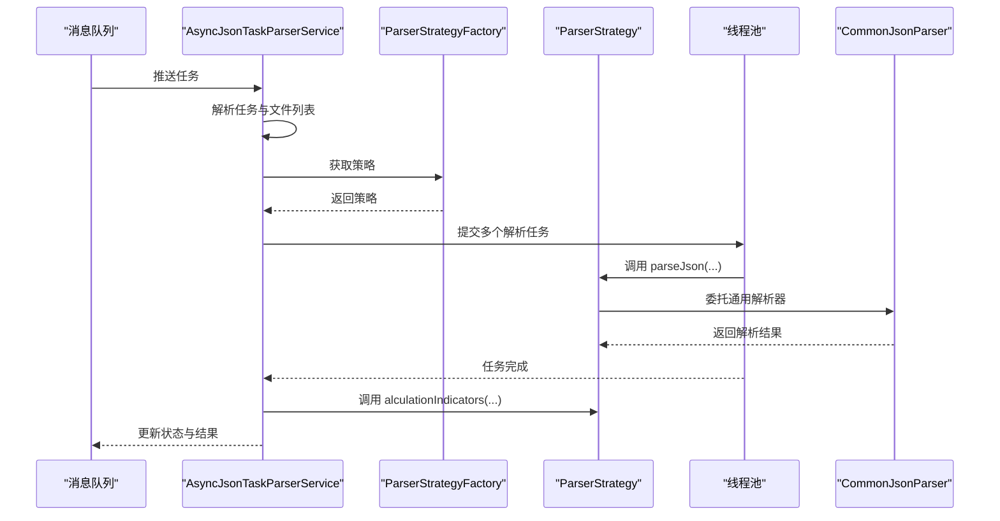
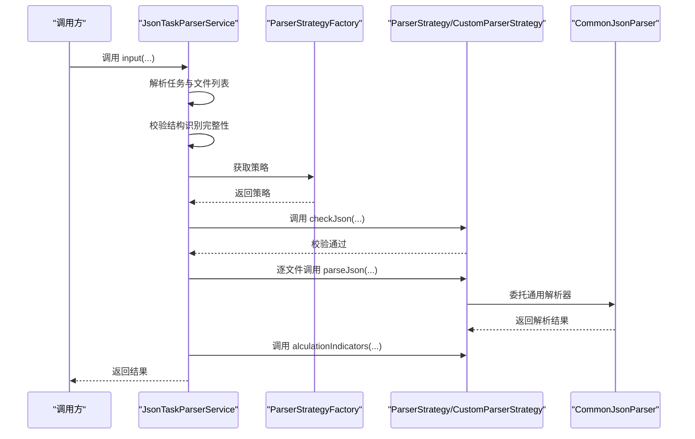
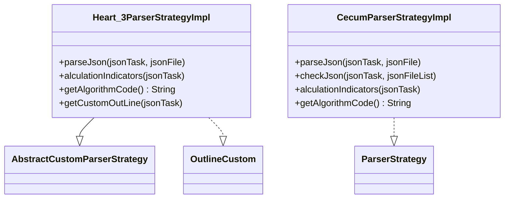
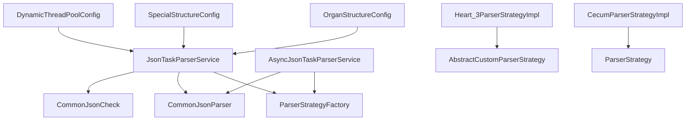

# JSON解析引擎

<cite>
**本文引用的文件**
- [ParserStrategyFactory.java](file://src/main/java/cn/staitech/fr/service/strategy/json/ParserStrategyFactory.java)
- [AbstractCustomParserStrategy.java](file://src/main/java/cn/staitech/fr/service/strategy/json/AbstractCustomParserStrategy.java)
- [CommonJsonParser.java](file://src/main/java/cn/staitech/fr/service/strategy/json/CommonJsonParser.java)
- [AsyncJsonTaskParserService.java](file://src/main/java/cn/staitech/fr/service/strategy/json/AsyncJsonTaskParserService.java)
- [JsonTaskParserService.java](file://src/main/java/cn/staitech/fr/service/strategy/json/JsonTaskParserService.java)
- [ParserStrategy.java](file://src/main/java/cn/staitech/fr/service/strategy/json/ParserStrategy.java)
- [CustomParserStrategy.java](file://src/main/java/cn/staitech/fr/service/strategy/json/CustomParserStrategy.java)
- [OrganStructureConfig.java](file://src/main/java/cn/staitech/fr/config/OrganStructureConfig.java)
- [SpecialStructureConfig.java](file://src/main/java/cn/staitech/fr/config/SpecialStructureConfig.java)
- [Heart_3ParserStrategyImpl.java](file://src/main/java/cn/staitech/fr/service/strategy/json/impl/dog/circulatory/Heart_3ParserStrategyImpl.java)
- [CecumParserStrategyImpl.java](file://src/main/java/cn/staitech/fr/service/strategy/json/impl/rat/intestines/CecumParserStrategyImpl.java)
- [CommonJsonCheck.java](file://src/main/java/cn/staitech/fr/service/strategy/json/CommonJsonCheck.java)
- [OutlineCustom.java](file://src/main/java/cn/staitech/fr/service/strategy/json/OutlineCustom.java)
- [DynamicThreadPoolConfig.java](file://src/main/java/cn/staitech/fr/config/DynamicThreadPoolConfig.java)
- [application-local.yml](file://src/main/resources/application-local.yml)
</cite>

## 目录
1. [引言](#引言)
2. [项目结构](#项目结构)
3. [核心组件](#核心组件)
4. [架构总览](#架构总览)
5. [详细组件分析](#详细组件分析)
6. [依赖分析](#依赖分析)
7. [性能考虑](#性能考虑)
8. [故障排查指南](#故障排查指南)
9. [结论](#结论)
10. [附录](#附录)

## 引言
本技术文档围绕“JSON解析引擎”展开，系统性阐述策略模式在JSON解析中的应用，包括解析策略工厂的设计原理、动态策略选择机制、抽象自定义解析策略的继承体系、通用解析器与异步任务解析服务的工作流程、多算法支持的架构设计（涵盖不同物种、器官、结构的解析策略）、解析流程示例、策略注册机制与扩展开发指南，以及与消息队列的集成模式与异步处理架构。同时提供性能优化策略、错误处理机制与调试技巧，帮助读者快速理解并高效扩展该引擎。

## 项目结构
JSON解析引擎位于服务层的策略包中，采用“接口 + 抽象基类 + 具体策略实现 + 工厂 + 通用解析器”的分层设计，配合配置类与线程池配置，形成可扩展、可维护、可异步化的解析体系。

图示来源
- [ParserStrategyFactory.java:1-44](file://src/main/java/cn/staitech/fr/service/strategy/json/ParserStrategyFactory.java#L1-L44)
- [AbstractCustomParserStrategy.java:1-211](file://src/main/java/cn/staitech/fr/service/strategy/json/AbstractCustomParserStrategy.java#L1-L211)
- [CommonJsonParser.java:1-800](file://src/main/java/cn/staitech/fr/service/strategy/json/CommonJsonParser.java#L1-L800)
- [JsonTaskParserService.java:1-760](file://src/main/java/cn/staitech/fr/service/strategy/json/JsonTaskParserService.java#L1-L760)
- [AsyncJsonTaskParserService.java:1-306](file://src/main/java/cn/staitech/fr/service/strategy/json/AsyncJsonTaskParserService.java#L1-L306)
- [OrganStructureConfig.java:1-45](file://src/main/java/cn/staitech/fr/config/OrganStructureConfig.java#L1-L45)
- [SpecialStructureConfig.java:1-75](file://src/main/java/cn/staitech/fr/config/SpecialStructureConfig.java#L1-L75)
- [DynamicThreadPoolConfig.java:1-53](file://src/main/java/cn/staitech/fr/config/DynamicThreadPoolConfig.java#L1-L53)
- [application-local.yml:1-311](file://src/main/resources/application-local.yml#L1-L311)

章节来源
- [ParserStrategyFactory.java:1-44](file://src/main/java/cn/staitech/fr/service/strategy/json/ParserStrategyFactory.java#L1-L44)
- [JsonTaskParserService.java:1-760](file://src/main/java/cn/staitech/fr/service/strategy/json/JsonTaskParserService.java#L1-L760)
- [application-local.yml:1-311](file://src/main/resources/application-local.yml#L1-L311)

## 核心组件
- 策略接口与工厂
  - ParserStrategy：定义解析与指标计算的统一入口，包含解析、校验与指标计算三类能力。
  - CustomParserStrategy：扩展策略接口，增加算法标识（algorithmCode）以便工厂按标识选择策略。
  - ParserStrategyFactory：基于Spring容器注入的策略Map，提供按算法标识获取策略实例的能力。
- 抽象与通用
  - AbstractCustomParserStrategy：提供通用指标构建、面积/周长计算、比例/除法等工具方法，供具体策略复用。
  - CommonJsonParser：负责JSON文件的流式解析、要素提取、几何转换、批量入库与动态数据并行处理。
  - CommonJsonCheck：负责JSON结构与字段的快速校验，确保后续解析与指标计算的输入质量。
- 服务层
  - JsonTaskParserService：面向主流程的任务解析服务，负责任务元数据解析、文件列表解析、策略选择、指标计算与结果落库。
  - AsyncJsonTaskParserService：面向异步场景的任务解析服务，结合线程池并发解析多个JSON文件，最后统一触发指标计算。
- 配置与扩展
  - OrganStructureConfig：脏器-结构映射配置，用于判断某脏器下结构识别是否完成。
  - SpecialStructureConfig：特殊结构ID集合，用于跳过常规校验或走特殊处理路径。
  - DynamicThreadPoolConfig：动态线程池配置，为任务解析提供可伸缩的并发执行能力。
  - application-local.yml：应用配置，包含脏器结构映射、消息队列、线程池参数等。

章节来源
- [ParserStrategy.java:1-33](file://src/main/java/cn/staitech/fr/service/strategy/json/ParserStrategy.java#L1-L33)
- [CustomParserStrategy.java:1-13](file://src/main/java/cn/staitech/fr/service/strategy/json/CustomParserStrategy.java#L1-L13)
- [ParserStrategyFactory.java:1-44](file://src/main/java/cn/staitech/fr/service/strategy/json/ParserStrategyFactory.java#L1-L44)
- [AbstractCustomParserStrategy.java:1-211](file://src/main/java/cn/staitech/fr/service/strategy/json/AbstractCustomParserStrategy.java#L1-L211)
- [CommonJsonParser.java:1-800](file://src/main/java/cn/staitech/fr/service/strategy/json/CommonJsonParser.java#L1-L800)
- [CommonJsonCheck.java:1-353](file://src/main/java/cn/staitech/fr/service/strategy/json/CommonJsonCheck.java#L1-L353)
- [JsonTaskParserService.java:1-760](file://src/main/java/cn/staitech/fr/service/strategy/json/JsonTaskParserService.java#L1-L760)
- [AsyncJsonTaskParserService.java:1-306](file://src/main/java/cn/staitech/fr/service/strategy/json/AsyncJsonTaskParserService.java#L1-L306)
- [OrganStructureConfig.java:1-45](file://src/main/java/cn/staitech/fr/config/OrganStructureConfig.java#L1-L45)
- [SpecialStructureConfig.java:1-75](file://src/main/java/cn/staitech/fr/config/SpecialStructureConfig.java#L1-L75)
- [DynamicThreadPoolConfig.java:1-53](file://src/main/java/cn/staitech/fr/config/DynamicThreadPoolConfig.java#L1-L53)
- [application-local.yml:1-311](file://src/main/resources/application-local.yml#L1-L311)

## 架构总览
JSON解析引擎采用“策略模式 + 工厂 + 通用解析器 + 服务编排”的架构，通过算法标识动态选择解析策略，结合通用解析器完成JSON要素解析与入库，再由策略实现指标计算与结果落库。服务层负责任务生命周期管理、并发控制与异常处理，配置层提供脏器结构映射与特殊结构处理，线程池配置保障高并发场景下的稳定性。

图示来源
- [AsyncJsonTaskParserService.java:68-213](file://src/main/java/cn/staitech/fr/service/strategy/json/AsyncJsonTaskParserService.java#L68-L213)
- [ParserStrategyFactory.java:39-41](file://src/main/java/cn/staitech/fr/service/strategy/json/ParserStrategyFactory.java#L39-L41)
- [CommonJsonParser.java:209-297](file://src/main/java/cn/staitech/fr/service/strategy/json/CommonJsonParser.java#L209-L297)

## 详细组件分析

### 策略模式与工厂
- 设计要点
  - 策略接口统一了解析、校验与指标计算三类能力，便于替换与扩展。
  - 工厂通过Spring注入的策略Map，按算法标识快速定位具体策略，支持“内置策略 + 自定义策略”的双重选择。
- 关键流程
  - 服务层先从工厂获取策略，若未命中则遍历自定义策略集合匹配算法标识。
  - 策略实现可直接委托通用解析器完成JSON解析，或在特定场景下走特殊处理路径（如组织轮廓）。

图示来源
- [ParserStrategy.java:14-32](file://src/main/java/cn/staitech/fr/service/strategy/json/ParserStrategy.java#L14-L32)
- [CustomParserStrategy.java:9-12](file://src/main/java/cn/staitech/fr/service/strategy/json/CustomParserStrategy.java#L9-L12)
- [AbstractCustomParserStrategy.java:23-54](file://src/main/java/cn/staitech/fr/service/strategy/json/AbstractCustomParserStrategy.java#L23-L54)
- [ParserStrategyFactory.java:30-41](file://src/main/java/cn/staitech/fr/service/strategy/json/ParserStrategyFactory.java#L30-L41)

章节来源
- [ParserStrategyFactory.java:1-44](file://src/main/java/cn/staitech/fr/service/strategy/json/ParserStrategyFactory.java#L1-L44)
- [ParserStrategy.java:1-33](file://src/main/java/cn/staitech/fr/service/strategy/json/ParserStrategy.java#L1-L33)
- [CustomParserStrategy.java:1-13](file://src/main/java/cn/staitech/fr/service/strategy/json/CustomParserStrategy.java#L1-L13)
- [AbstractCustomParserStrategy.java:1-211](file://src/main/java/cn/staitech/fr/service/strategy/json/AbstractCustomParserStrategy.java#L1-L211)

### 通用JSON解析器（CommonJsonParser）
- 能力概述
  - 流式解析GeoJSON，提取features数组中的要素，逐条转换为注解对象并批量入库。
  - 提供面积/周长换算、有效性校验与修复、轮廓内外部计算、动态数据并行处理等能力。
  - 支持组织轮廓与特殊结构的特殊处理路径。
- 关键流程
  - 读取JSON文件流，逐要素解析并并行处理，达到批次阈值后批量入库。
  - 对于组织轮廓与特殊结构，走专用解析路径并更新单切片面积/周长等指标。

图示来源
- [CommonJsonParser.java:209-297](file://src/main/java/cn/staitech/fr/service/strategy/json/CommonJsonParser.java#L209-L297)

章节来源
- [CommonJsonParser.java:1-800](file://src/main/java/cn/staitech/fr/service/strategy/json/CommonJsonParser.java#L1-L800)

### 异步任务解析服务（AsyncJsonTaskParserService）
- 能力概述
  - 接收消息队列推送的任务，解析任务元数据与文件列表，按算法标识选择策略。
  - 使用线程池并发解析多个JSON文件，完成后统一触发指标计算与状态更新。
- 关键流程
  - 解析任务元数据与文件列表，设置任务状态为“解析中”。
  - 并发提交解析任务至线程池，等待所有任务完成。
  - 统一删除历史指标、计算新指标、更新任务状态与单切片状态。

图示来源
- [AsyncJsonTaskParserService.java:68-213](file://src/main/java/cn/staitech/fr/service/strategy/json/AsyncJsonTaskParserService.java#L68-L213)
- [ParserStrategyFactory.java:39-41](file://src/main/java/cn/staitech/fr/service/strategy/json/ParserStrategyFactory.java#L39-L41)
- [CommonJsonParser.java:209-297](file://src/main/java/cn/staitech/fr/service/strategy/json/CommonJsonParser.java#L209-L297)

章节来源
- [AsyncJsonTaskParserService.java:1-306](file://src/main/java/cn/staitech/fr/service/strategy/json/AsyncJsonTaskParserService.java#L1-L306)

### 主任务解析服务（JsonTaskParserService）
- 能力概述
  - 负责任务生命周期管理、文件解析、策略选择、指标计算与结果落库。
  - 通过OrganStructureConfig与SpecialStructureConfig控制结构识别完整性与特殊结构处理。
  - 使用TTL线程池包装器保证上下文传递，提升异步执行的可靠性。
- 关键流程
  - 解析任务元数据与文件列表，检查脏器结构识别完整性。
  - 选择策略并执行解析，对组织轮廓与特殊结构走专用路径。
  - 删除历史指标、计算新指标、更新任务与单切片状态。

图示来源
- [JsonTaskParserService.java:174-452](file://src/main/java/cn/staitech/fr/service/strategy/json/JsonTaskParserService.java#L174-L452)
- [ParserStrategyFactory.java:39-41](file://src/main/java/cn/staitech/fr/service/strategy/json/ParserStrategyFactory.java#L39-L41)
- [CommonJsonParser.java:209-297](file://src/main/java/cn/staitech/fr/service/strategy/json/CommonJsonParser.java#L209-L297)

章节来源
- [JsonTaskParserService.java:1-760](file://src/main/java/cn/staitech/fr/service/strategy/json/JsonTaskParserService.java#L1-L760)

### 多算法支持与策略实现
- 犬（dog）- 心脏（circulatory/Heart_3ParserStrategyImpl）
  - 实现OutlineCustom接口，支持自定义轮廓指标计算。
  - 基于AbstractCustomParserStrategy，利用通用解析器获取结构面积与组织轮廓面积，计算血管面积占比与心脏面积等指标。
- 大鼠（rat）- 盲肠（intestines/CecumParserStrategyImpl）
  - 直接实现ParserStrategy接口，通过CommonJsonParser与CommonJsonCheck完成解析与校验。
  - 计算肠腔、黏膜层、黏膜下层、肌层、淋巴小结面积与占比，以及盲肠面积等指标。

图示来源
- [Heart_3ParserStrategyImpl.java:30-111](file://src/main/java/cn/staitech/fr/service/strategy/json/impl/dog/circulatory/Heart_3ParserStrategyImpl.java#L30-L111)
- [CecumParserStrategyImpl.java:38-166](file://src/main/java/cn/staitech/fr/service/strategy/json/impl/rat/intestines/CecumParserStrategyImpl.java#L38-L166)
- [AbstractCustomParserStrategy.java:23-54](file://src/main/java/cn/staitech/fr/service/strategy/json/AbstractCustomParserStrategy.java#L23-L54)
- [OutlineCustom.java:5-7](file://src/main/java/cn/staitech/fr/service/strategy/json/OutlineCustom.java#L5-L7)
- [ParserStrategy.java:14-32](file://src/main/java/cn/staitech/fr/service/strategy/json/ParserStrategy.java#L14-L32)

章节来源
- [Heart_3ParserStrategyImpl.java:1-111](file://src/main/java/cn/staitech/fr/service/strategy/json/impl/dog/circulatory/Heart_3ParserStrategyImpl.java#L1-L111)
- [CecumParserStrategyImpl.java:1-166](file://src/main/java/cn/staitech/fr/service/strategy/json/impl/rat/intestines/CecumParserStrategyImpl.java#L1-L166)

### 策略注册机制与扩展开发指南
- 策略注册
  - 工厂通过构造函数接收Map<String, ParserStrategy>，将所有策略Bean注册到内存Map中，key为bean名称，value为策略实例。
  - 自定义策略需实现CustomParserStrategy并提供算法标识，服务层在工厂未命中时会回退到自定义策略集合匹配算法标识。
- 扩展开发步骤
  - 新建策略类，实现ParserStrategy或继承AbstractCustomParserStrategy，并标注@Component与唯一bean名称。
  - 在策略中实现parseJson、checkJson与alculationIndicators方法，必要时委托CommonJsonParser与CommonJsonCheck。
  - 在配置文件中完善脏器-结构映射与特殊结构列表，确保任务解析与指标计算正确。
  - 如需异步解析，可在AsyncJsonTaskParserService中按算法标识路由到对应策略。

章节来源
- [ParserStrategyFactory.java:30-41](file://src/main/java/cn/staitech/fr/service/strategy/json/ParserStrategyFactory.java#L30-L41)
- [CustomParserStrategy.java:9-12](file://src/main/java/cn/staitech/fr/service/strategy/json/CustomParserStrategy.java#L9-L12)
- [JsonTaskParserService.java:319-336](file://src/main/java/cn/staitech/fr/service/strategy/json/JsonTaskParserService.java#L319-L336)
- [AsyncJsonTaskParserService.java:105-114](file://src/main/java/cn/staitech/fr/service/strategy/json/AsyncJsonTaskParserService.java#L105-L114)

### 与消息队列的集成模式与异步处理架构
- 集成模式
  - 应用配置中包含RabbitMQ相关参数与队列名称，服务层通过消息监听消费任务消息。
  - 异步解析服务接收消息后，解析任务元数据与文件列表，按算法标识选择策略并并发解析。
- 异步处理
  - 使用线程池并发提交多个解析任务，CountDownLatch等待所有任务完成。
  - 完成后统一删除历史指标、计算新指标、更新任务与单切片状态，确保幂等与一致性。

章节来源
- [application-local.yml:57-74](file://src/main/resources/application-local.yml#L57-L74)
- [AsyncJsonTaskParserService.java:68-213](file://src/main/java/cn/staitech/fr/service/strategy/json/AsyncJsonTaskParserService.java#L68-L213)

## 依赖分析
- 组件耦合
  - 服务层依赖工厂与策略接口，通过算法标识解耦具体策略实现。
  - 通用解析器与校验器作为公共能力被策略与服务层复用，降低重复实现。
  - 配置类与线程池配置为引擎提供运行时支撑，脏器结构映射与特殊结构配置决定解析与指标计算的分支逻辑。
- 外部依赖
  - RabbitMQ用于消息队列集成，线程池用于异步并发控制。
  - 数据访问层通过MyBatis与数据库交互，支撑注解、图像、单切片等实体的持久化。

图示来源
- [JsonTaskParserService.java:54-107](file://src/main/java/cn/staitech/fr/service/strategy/json/JsonTaskParserService.java#L54-L107)
- [AsyncJsonTaskParserService.java:26-67](file://src/main/java/cn/staitech/fr/service/strategy/json/AsyncJsonTaskParserService.java#L26-L67)
- [Heart_3ParserStrategyImpl.java:30-58](file://src/main/java/cn/staitech/fr/service/strategy/json/impl/dog/circulatory/Heart_3ParserStrategyImpl.java#L30-L58)
- [CecumParserStrategyImpl.java:38-55](file://src/main/java/cn/staitech/fr/service/strategy/json/impl/rat/intestines/CecumParserStrategyImpl.java#L38-L55)
- [OrganStructureConfig.java:14-44](file://src/main/java/cn/staitech/fr/config/OrganStructureConfig.java#L14-L44)
- [SpecialStructureConfig.java:22-75](file://src/main/java/cn/staitech/fr/config/SpecialStructureConfig.java#L22-L75)
- [DynamicThreadPoolConfig.java:10-53](file://src/main/java/cn/staitech/fr/config/DynamicThreadPoolConfig.java#L10-L53)

章节来源
- [JsonTaskParserService.java:1-760](file://src/main/java/cn/staitech/fr/service/strategy/json/JsonTaskParserService.java#L1-L760)
- [AsyncJsonTaskParserService.java:1-306](file://src/main/java/cn/staitech/fr/service/strategy/json/AsyncJsonTaskParserService.java#L1-L306)

## 性能考虑
- 流式解析与批处理
  - 通用解析器采用Jackson流式解析与批处理入库，减少内存占用与IO次数。
- 并行处理
  - 通用解析器对要素解析采用并行流，异步服务对多个文件解析采用线程池并发，显著提升吞吐。
- 线程池配置
  - 动态线程池根据CPU核心数与队列容量调整并发度，避免过载与饥饿。
- 缓存与预热
  - 通用解析器对机构映射与序列号等数据进行缓存，减少重复查询。
- I/O与网络
  - 建议将JSON文件存储在高性能磁盘，避免跨网络频繁传输；消息队列建议部署在同一可用区内以降低延迟。

## 故障排查指南
- 常见问题
  - 策略未命中：检查算法标识是否与策略bean名称一致，确认工厂是否正确注入策略Map。
  - JSON校验失败：检查features字段、geometry与properties字段是否完整，确认tb_structure_tag中是否存在对应标签。
  - 并发异常：检查线程池队列是否溢出，适当增大队列容量或核心线程数。
  - 指标计算异常：确认单切片面积/周长是否正确更新，检查脏器结构识别完整性。
- 调试技巧
  - 启用DEBUG日志级别，关注“解析开始/结束”、“批量入库耗时”、“指标计算耗时”等关键节点。
  - 使用MDC记录任务标识，便于追踪任务全链路执行情况。
  - 对异常路径增加重试与告警，结合消息队列的死信队列与重试策略，提升容错能力。

章节来源
- [CommonJsonCheck.java:169-224](file://src/main/java/cn/staitech/fr/service/strategy/json/CommonJsonCheck.java#L169-L224)
- [JsonTaskParserService.java:259-262](file://src/main/java/cn/staitech/fr/service/strategy/json/JsonTaskParserService.java#L259-L262)
- [AsyncJsonTaskParserService.java:194-202](file://src/main/java/cn/staitech/fr/service/strategy/json/AsyncJsonTaskParserService.java#L194-L202)

## 结论
JSON解析引擎通过策略模式实现了算法的可插拔与可扩展，配合通用解析器与服务编排，形成了从任务解析到指标计算的完整闭环。工厂与配置层提供了灵活的动态选择与分支控制，异步处理与线程池配置保障了高并发场景下的稳定性与性能。遵循本文的扩展指南与最佳实践，可快速新增多物种、多器官、多结构的解析策略，并与消息队列无缝集成。

## 附录
- 算法标识与策略映射
  - 犬心脏：Heart_3
  - 大鼠盲肠：Cecum
- 脏器结构配置
  - organ-structures.structures：定义脏器与结构ID映射
  - organ-structures.outline：定义脏器轮廓结构ID
- 特殊结构配置
  - special-structures.structureIds：定义无需常规校验的特殊结构ID集合
- 线程池与消息队列
  - dynamic.*：动态线程池参数
  - queues.*：消息队列名称与重试配置

章节来源
- [application-local.yml:108-308](file://src/main/resources/application-local.yml#L108-L308)
- [OrganStructureConfig.java:18-43](file://src/main/java/cn/staitech/fr/config/OrganStructureConfig.java#L18-L43)
- [SpecialStructureConfig.java:26-75](file://src/main/java/cn/staitech/fr/config/SpecialStructureConfig.java#L26-L75)
- [DynamicThreadPoolConfig.java:12-53](file://src/main/java/cn/staitech/fr/config/DynamicThreadPoolConfig.java#L12-L53)