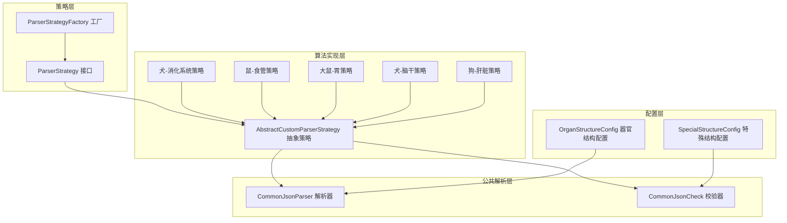
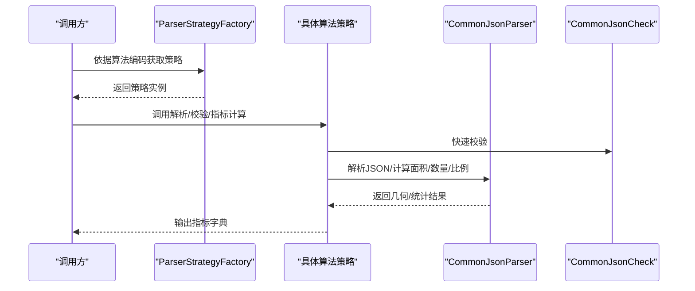
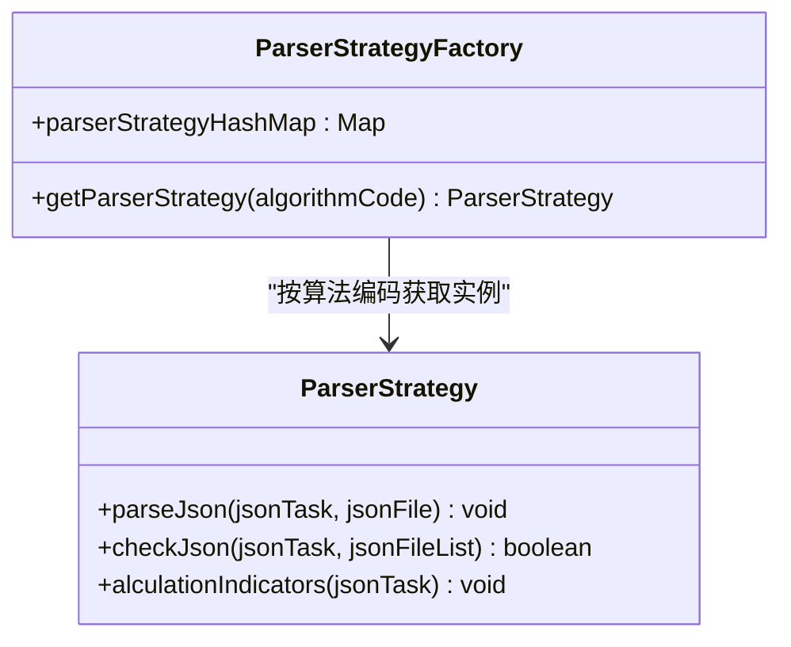
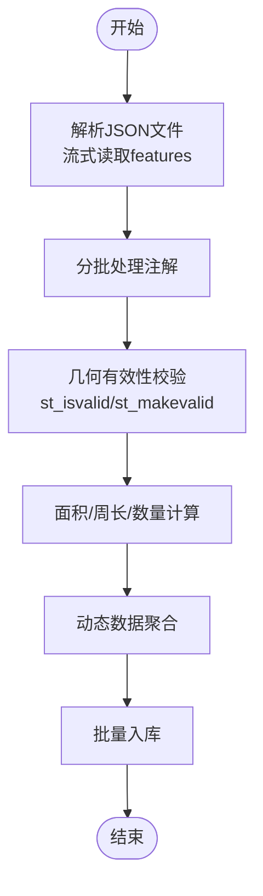
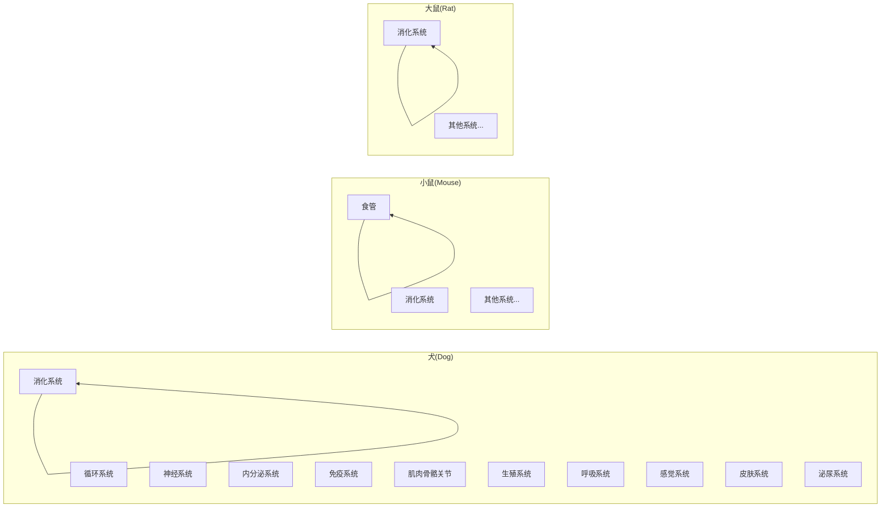
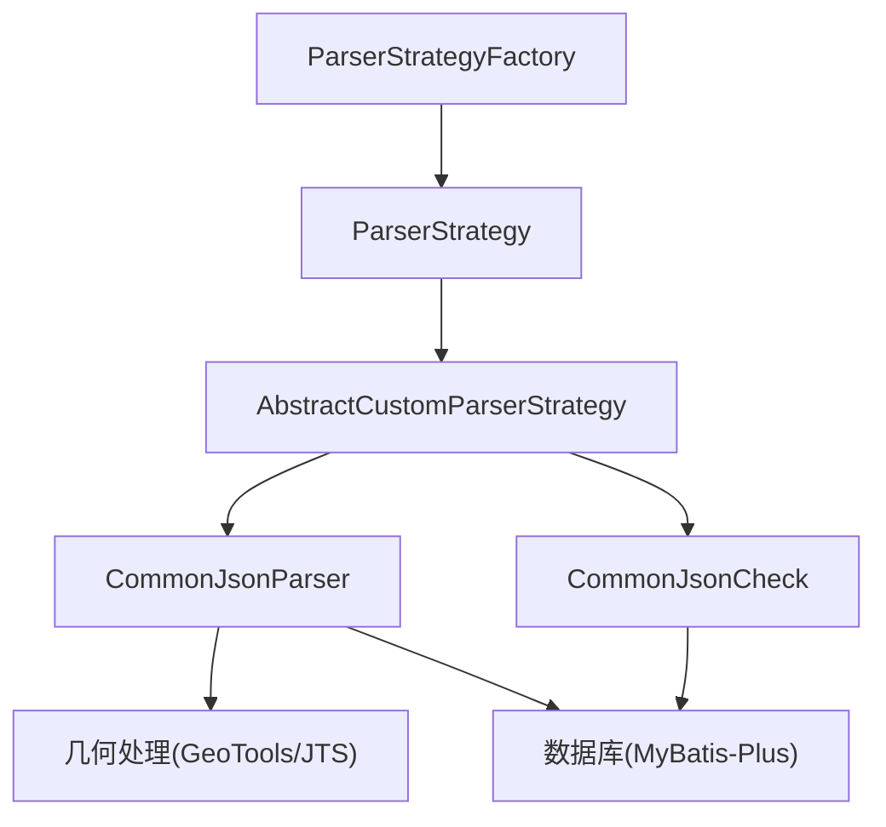

# 多算法支持架构

<cite>
**本文引用的文件**
- [ParserStrategy.java](file://src/main/java/cn/staitech/fr/service/strategy/json/ParserStrategy.java)
- [ParserStrategyFactory.java](file://src/main/java/cn/staitech/fr/service/strategy/json/ParserStrategyFactory.java)
- [AbstractCustomParserStrategy.java](file://src/main/java/cn/staitech/fr/service/strategy/json/AbstractCustomParserStrategy.java)
- [CommonJsonParser.java](file://src/main/java/cn/staitech/fr/service/strategy/json/CommonJsonParser.java)
- [CommonJsonCheck.java](file://src/main/java/cn/staitech/fr/service/strategy/json/CommonJsonCheck.java)
- [SpeciesTypeEnum.java](file://src/main/java/cn/staitech/fr/enmu/SpeciesTypeEnum.java)
- [OrganStructureConfig.java](file://src/main/java/cn/staitech/fr/config/OrganStructureConfig.java)
- [SpecialStructureConfig.java](file://src/main/java/cn/staitech/fr/config/SpecialStructureConfig.java)
- [Stomach_3ParserStrategyImpl.java](file://src/main/java/cn/staitech/fr/service/strategy/json/impl/dog/digestive/Stomach_3ParserStrategyImpl.java)
- [Esophagus_2ParserStrategyImpl.java](file://src/main/java/cn/staitech/fr/service/strategy/json/impl/mouse/Esophagus_2ParserStrategyImpl.java)
- [StomachParserStrategyImpl.java](file://src/main/java/cn/staitech/fr/service/strategy/json/impl/rat/digestive/StomachParserStrategyImpl.java)
- [CanidaeBrainStemParserStrategyImpl.java](file://src/main/java/cn/staitech/fr/service/strategy/json/impl/dog/neural/CanidaeBrainStemParserStrategyImpl.java)
- [Liver_3ParserStrategyImpl.java](file://src/main/java/cn/staitech/fr/service/strategy/json/impl/rat/gou/Liver_3ParserStrategyImpl.java)
</cite>

## 目录
1. [引言](#引言)
2. [项目结构](#项目结构)
3. [核心组件](#核心组件)
4. [架构总览](#架构总览)
5. [详细组件分析](#详细组件分析)
6. [依赖分析](#依赖分析)
7. [性能考虑](#性能考虑)
8. [故障排查指南](#故障排查指南)
9. [结论](#结论)
10. [附录](#附录)

## 引言
本文件面向“多算法支持架构”，系统性阐述针对不同物种（犬、鼠、猴、大鼠等）的算法实现差异与适配机制，梳理消化系统、循环系统、神经系统、内分泌系统、免疫系统、肌肉骨骼关节、神经、生殖、呼吸、感觉、皮肤系统、泌尿系统等各系统的解析策略组织方式，给出命名规范、结构组织与扩展开发指南，并总结算法间共享机制、差异化处理策略、性能对比与维护策略。

## 项目结构
多算法支持架构采用“策略模式 + 工厂 + 公共解析器”的分层设计：
- 策略接口与工厂：定义统一算法接口，按算法编码注册与获取具体策略实现。
- 公共解析器：负责JSON标注文件的解析、几何校验、面积/周长/数量计算、动态数据聚合与落库。
- 特定算法实现：按物种与系统细分目录，实现差异化指标计算与产物输出。
- 配置中心：器官结构映射与特殊结构白名单，支撑跨物种适配与校验。

图表来源
- [ParserStrategy.java](file://src/main/java/cn/staitech/fr/service/strategy/json/ParserStrategy.java)
- [ParserStrategyFactory.java](file://src/main/java/cn/staitech/fr/service/strategy/json/ParserStrategyFactory.java)
- [AbstractCustomParserStrategy.java](file://src/main/java/cn/staitech/fr/service/strategy/json/AbstractCustomParserStrategy.java)
- [CommonJsonParser.java](file://src/main/java/cn/staitech/fr/service/strategy/json/CommonJsonParser.java)
- [CommonJsonCheck.java](file://src/main/java/cn/staitech/fr/service/strategy/json/CommonJsonCheck.java)
- [OrganStructureConfig.java](file://src/main/java/cn/staitech/fr/config/OrganStructureConfig.java)
- [SpecialStructureConfig.java](file://src/main/java/cn/staitech/fr/config/SpecialStructureConfig.java)

章节来源
- [ParserStrategy.java](file://src/main/java/cn/staitech/fr/service/strategy/json/ParserStrategy.java)
- [ParserStrategyFactory.java](file://src/main/java/cn/staitech/fr/service/strategy/json/ParserStrategyFactory.java)
- [AbstractCustomParserStrategy.java](file://src/main/java/cn/staitech/fr/service/strategy/json/AbstractCustomParserStrategy.java)
- [CommonJsonParser.java](file://src/main/java/cn/staitech/fr/service/strategy/json/CommonJsonParser.java)
- [CommonJsonCheck.java](file://src/main/java/cn/staitech/fr/service/strategy/json/CommonJsonCheck.java)
- [OrganStructureConfig.java](file://src/main/java/cn/staitech/fr/config/OrganStructureConfig.java)
- [SpecialStructureConfig.java](file://src/main/java/cn/staitech/fr/config/SpecialStructureConfig.java)

## 核心组件
- 策略接口与工厂
  - ParserStrategy：定义统一的解析、校验、指标计算入口。
  - ParserStrategyFactory：基于Spring容器扫描策略实现，按算法编码注册与获取策略实例。
- 抽象策略
  - AbstractCustomParserStrategy：封装通用指标构建、单位换算、比例计算、面积/数量获取等公共能力，子类聚焦具体系统与物种的差异化指标。
- 公共解析器
  - CommonJsonParser：负责JSON标注文件流式解析、几何转换、面积/周长/数量计算、动态数据聚合、批量入库。
  - CommonJsonCheck：负责标注合法性快速校验（结构ID映射、几何字段存在性、轮廓有效性等）。
- 配置中心
  - OrganStructureConfig：按器官维度配置结构ID集合与轮廓集合，支撑跨物种适配。
  - SpecialStructureConfig：特殊结构ID白名单（如组织轮廓），用于跳过严格校验或特殊处理。

章节来源
- [ParserStrategy.java](file://src/main/java/cn/staitech/fr/service/strategy/json/ParserStrategy.java)
- [ParserStrategyFactory.java](file://src/main/java/cn/staitech/fr/service/strategy/json/ParserStrategyFactory.java)
- [AbstractCustomParserStrategy.java](file://src/main/java/cn/staitech/fr/service/strategy/json/AbstractCustomParserStrategy.java)
- [CommonJsonParser.java](file://src/main/java/cn/staitech/fr/service/strategy/json/CommonJsonParser.java)
- [CommonJsonCheck.java](file://src/main/java/cn/staitech/fr/service/strategy/json/CommonJsonCheck.java)
- [OrganStructureConfig.java](file://src/main/java/cn/staitech/fr/config/OrganStructureConfig.java)
- [SpecialStructureConfig.java](file://src/main/java/cn/staitech/fr/config/SpecialStructureConfig.java)

## 架构总览
多算法支持架构通过“策略 + 工厂 + 公共解析器”实现高内聚、低耦合的可扩展体系。算法实现按物种与系统分层组织，公共解析器屏蔽底层几何与数据处理细节，抽象策略统一指标产出格式，工厂负责运行期路由选择。

图表来源
- [ParserStrategyFactory.java](file://src/main/java/cn/staitech/fr/service/strategy/json/ParserStrategyFactory.java)
- [ParserStrategy.java](file://src/main/java/cn/staitech/fr/service/strategy/json/ParserStrategy.java)
- [CommonJsonParser.java](file://src/main/java/cn/staitech/fr/service/strategy/json/CommonJsonParser.java)
- [CommonJsonCheck.java](file://src/main/java/cn/staitech/fr/service/strategy/json/CommonJsonCheck.java)

## 详细组件分析

### 策略接口与工厂
- ParserStrategy定义三类职责：单文件解析与存储、批量校验、指标计算。
- ParserStrategyFactory通过Spring注入策略Map，按算法编码获取对应策略，实现运行期路由。

图表来源
- [ParserStrategy.java](file://src/main/java/cn/staitech/fr/service/strategy/json/ParserStrategy.java)
- [ParserStrategyFactory.java](file://src/main/java/cn/staitech/fr/service/strategy/json/ParserStrategyFactory.java)

章节来源
- [ParserStrategy.java](file://src/main/java/cn/staitech/fr/service/strategy/json/ParserStrategy.java)
- [ParserStrategyFactory.java](file://src/main/java/cn/staitech/fr/service/strategy/json/ParserStrategyFactory.java)

### 抽象策略与公共解析器
- AbstractCustomParserStrategy封装：
  - 指标单位常量与统一格式化。
  - 面积/数量/比例/单位换算等通用工具。
  - 通过CommonJsonParser/Check访问几何与统计能力。
- CommonJsonParser：
  - 流式解析features数组，分批处理并批量入库。
  - 几何校验与有效性修复（st_isvalid/st_makevalid）。
  - 面积/周长/数量查询与动态数据聚合。
- CommonJsonCheck：
  - 快速校验结构ID映射、几何字段完整性与轮廓有效性。
  - 特殊结构ID白名单跳过严格校验。

图表来源
- [CommonJsonParser.java](file://src/main/java/cn/staitech/fr/service/strategy/json/CommonJsonParser.java)
- [CommonJsonCheck.java](file://src/main/java/cn/staitech/fr/service/strategy/json/CommonJsonCheck.java)

章节来源
- [AbstractCustomParserStrategy.java](file://src/main/java/cn/staitech/fr/service/strategy/json/AbstractCustomParserStrategy.java)
- [CommonJsonParser.java](file://src/main/java/cn/staitech/fr/service/strategy/json/CommonJsonParser.java)
- [CommonJsonCheck.java](file://src/main/java/cn/staitech/fr/service/strategy/json/CommonJsonCheck.java)

### 物种与系统适配机制
- 物种枚举：SpeciesTypeEnum提供RAT/MOUSE/DOG/MONKEY等枚举，作为算法代码前缀或结构ID前缀的一部分，用于区分不同物种的标注体系。
- 系统目录组织：算法实现按“species/system/subsystem/organ”层级组织，例如：
  - 犬-消化系统：digestive/Stomach_3ParserStrategyImpl.java
  - 小鼠-食管：Esophagus_2ParserStrategyImpl.java
  - 大鼠-消化系统：rat/digestive/StomachParserStrategyImpl.java
  - 犬-神经系统：neural/CanidaeBrainStemParserStrategyImpl.java
  - 狗-肝脏：gou/Liver_3ParserStrategyImpl.java

图表来源
- [SpeciesTypeEnum.java](file://src/main/java/cn/staitech/fr/enmu/SpeciesTypeEnum.java)
- [Stomach_3ParserStrategyImpl.java](file://src/main/java/cn/staitech/fr/service/strategy/json/impl/dog/digestive/Stomach_3ParserStrategyImpl.java)
- [Esophagus_2ParserStrategyImpl.java](file://src/main/java/cn/staitech/fr/service/strategy/json/impl/mouse/Esophagus_2ParserStrategyImpl.java)
- [StomachParserStrategyImpl.java](file://src/main/java/cn/staitech/fr/service/strategy/json/impl/rat/digestive/StomachParserStrategyImpl.java)
- [CanidaeBrainStemParserStrategyImpl.java](file://src/main/java/cn/staitech/fr/service/strategy/json/impl/dog/neural/CanidaeBrainStemParserStrategyImpl.java)
- [Liver_3ParserStrategyImpl.java](file://src/main/java/cn/staitech/fr/service/strategy/json/impl/rat/gou/Liver_3ParserStrategyImpl.java)

章节来源
- [SpeciesTypeEnum.java](file://src/main/java/cn/staitech/fr/enmu/SpeciesTypeEnum.java)
- [Stomach_3ParserStrategyImpl.java](file://src/main/java/cn/staitech/fr/service/strategy/json/impl/dog/digestive/Stomach_3ParserStrategyImpl.java)
- [Esophagus_2ParserStrategyImpl.java](file://src/main/java/cn/staitech/fr/service/strategy/json/impl/mouse/Esophagus_2ParserStrategyImpl.java)
- [StomachParserStrategyImpl.java](file://src/main/java/cn/staitech/fr/service/strategy/json/impl/rat/digestive/StomachParserStrategyImpl.java)
- [CanidaeBrainStemParserStrategyImpl.java](file://src/main/java/cn/staitech/fr/service/strategy/json/impl/dog/neural/CanidaeBrainStemParserStrategyImpl.java)
- [Liver_3ParserStrategyImpl.java](file://src/main/java/cn/staitech/fr/service/strategy/json/impl/rat/gou/Liver_3ParserStrategyImpl.java)

### 算法命名规范与结构组织
- 算法命名规范
  - 采用“器官_版本号”命名，如Stomach_3、Esophagus_2、Brain_stem_3、Liver_3等；版本号用于区分不同算法迭代。
  - 物种前缀：在算法代码中通过结构ID前缀或枚举区分（如犬使用“3”前缀，大鼠使用“1”前缀等）。
- 结构组织
  - 按species/system/subsystem/organ层级划分，便于扩展与维护。
  - 每个算法实现类通过@Component("算法编码")注册到Spring容器，工厂按算法编码获取实例。

章节来源
- [Stomach_3ParserStrategyImpl.java](file://src/main/java/cn/staitech/fr/service/strategy/json/impl/dog/digestive/Stomach_3ParserStrategyImpl.java)
- [Esophagus_2ParserStrategyImpl.java](file://src/main/java/cn/staitech/fr/service/strategy/json/impl/mouse/Esophagus_2ParserStrategyImpl.java)
- [StomachParserStrategyImpl.java](file://src/main/java/cn/staitech/fr/service/strategy/json/impl/rat/digestive/StomachParserStrategyImpl.java)
- [CanidaeBrainStemParserStrategyImpl.java](file://src/main/java/cn/staitech/fr/service/strategy/json/impl/dog/neural/CanidaeBrainStemParserStrategyImpl.java)
- [Liver_3ParserStrategyImpl.java](file://src/main/java/cn/staitech/fr/service/strategy/json/impl/rat/gou/Liver_3ParserStrategyImpl.java)

### 算法扩展开发指南
- 新增算法步骤
  - 在对应species/system路径下新增实现类，继承AbstractCustomParserStrategy，实现alculationIndicators与getAlgorithmCode。
  - 在类上使用@Component("算法编码")注册Bean，确保工厂能按算法编码获取实例。
  - 如需差异化校验，可在checkJson中调用CommonJsonCheck；如需差异化解析，可在parseJson中调用CommonJsonParser。
- 配置管理
  - 器官结构配置：OrganStructureConfig支持按器官维度配置结构ID集合与轮廓集合，便于跨物种适配。
  - 特殊结构配置：SpecialStructureConfig提供特殊结构ID白名单，用于跳过严格校验或特殊处理。
- 测试验证
  - 单元测试：对alculationIndicators中的关键指标计算逻辑进行断言。
  - 集成测试：模拟CommonJsonParser/CommonJsonCheck行为，验证解析与校验链路。
  - 性能测试：对CommonJsonParser的流式解析与批量入库进行压测，评估批处理大小与线程池配置。

章节来源
- [AbstractCustomParserStrategy.java](file://src/main/java/cn/staitech/fr/service/strategy/json/AbstractCustomParserStrategy.java)
- [ParserStrategyFactory.java](file://src/main/java/cn/staitech/fr/service/strategy/json/ParserStrategyFactory.java)
- [OrganStructureConfig.java](file://src/main/java/cn/staitech/fr/config/OrganStructureConfig.java)
- [SpecialStructureConfig.java](file://src/main/java/cn/staitech/fr/config/SpecialStructureConfig.java)

### 算法间共享机制与复用策略
- 公共逻辑提取
  - AbstractCustomParserStrategy统一提供单位常量、比例/除法计算、面积/数量获取等通用能力。
  - CommonJsonParser/CommonJsonCheck提供几何校验、面积/周长/数量查询、动态数据聚合等跨算法能力。
- 差异化处理
  - 不同物种通过结构ID前缀与枚举区分；不同系统通过目录层级区分；不同算法通过算法编码区分。
  - 对于跨物种相似系统（如消化系统），可通过OrganStructureConfig统一配置结构ID集合，减少重复实现。

章节来源
- [AbstractCustomParserStrategy.java](file://src/main/java/cn/staitech/fr/service/strategy/json/AbstractCustomParserStrategy.java)
- [CommonJsonParser.java](file://src/main/java/cn/staitech/fr/service/strategy/json/CommonJsonParser.java)
- [CommonJsonCheck.java](file://src/main/java/cn/staitech/fr/service/strategy/json/CommonJsonCheck.java)
- [OrganStructureConfig.java](file://src/main/java/cn/staitech/fr/config/OrganStructureConfig.java)
- [SpecialStructureConfig.java](file://src/main/java/cn/staitech/fr/config/SpecialStructureConfig.java)

### 算法性能对比与适用场景
- 性能特性
  - CommonJsonParser采用流式解析与分批处理，结合并行流与线程池，提升大批量标注文件的处理吞吐。
  - 动态数据聚合与批量入库降低数据库交互次数，提高整体效率。
- 适用场景
  - 犬：消化系统（如胃）、神经系统（如脑干）等复杂结构，指标计算较为复杂，适合使用Liver_3等综合算法。
  - 小鼠：食管等薄壁结构，强调比例与面积占比计算，适合使用Esophagus_2等算法。
  - 大鼠：消化系统（如胃）等结构，适合使用StomachParserStrategyImpl等算法。
- 优化建议
  - 合理设置批处理大小与线程池容量，平衡内存占用与吞吐。
  - 对于超大规模数据，可考虑分片与分区策略，结合SpecialStructureConfig的白名单优化校验路径。

章节来源
- [CommonJsonParser.java](file://src/main/java/cn/staitech/fr/service/strategy/json/CommonJsonParser.java)
- [Stomach_3ParserStrategyImpl.java](file://src/main/java/cn/staitech/fr/service/strategy/json/impl/dog/digestive/Stomach_3ParserStrategyImpl.java)
- [Esophagus_2ParserStrategyImpl.java](file://src/main/java/cn/staitech/fr/service/strategy/json/impl/mouse/Esophagus_2ParserStrategyImpl.java)
- [StomachParserStrategyImpl.java](file://src/main/java/cn/staitech/fr/service/strategy/json/impl/rat/digestive/StomachParserStrategyImpl.java)
- [CanidaeBrainStemParserStrategyImpl.java](file://src/main/java/cn/staitech/fr/service/strategy/json/impl/dog/neural/CanidaeBrainStemParserStrategyImpl.java)
- [Liver_3ParserStrategyImpl.java](file://src/main/java/cn/staitech/fr/service/strategy/json/impl/rat/gou/Liver_3ParserStrategyImpl.java)

## 依赖分析
- 组件耦合
  - 策略实现依赖抽象策略与公共解析器，耦合度低，便于替换与扩展。
  - 工厂通过Spring注入策略Map，按算法编码获取实例，实现运行期路由。
- 外部依赖
  - 几何处理依赖GeoTools/JTS与PostGIS几何类型转换。
  - JSON解析依赖Jackson与Fastjson。
  - 数据库访问依赖MyBatis-Plus与数据库驱动。

图表来源
- [ParserStrategyFactory.java](file://src/main/java/cn/staitech/fr/service/strategy/json/ParserStrategyFactory.java)
- [ParserStrategy.java](file://src/main/java/cn/staitech/fr/service/strategy/json/ParserStrategy.java)
- [AbstractCustomParserStrategy.java](file://src/main/java/cn/staitech/fr/service/strategy/json/AbstractCustomParserStrategy.java)
- [CommonJsonParser.java](file://src/main/java/cn/staitech/fr/service/strategy/json/CommonJsonParser.java)
- [CommonJsonCheck.java](file://src/main/java/cn/staitech/fr/service/strategy/json/CommonJsonCheck.java)

章节来源
- [ParserStrategyFactory.java](file://src/main/java/cn/staitech/fr/service/strategy/json/ParserStrategyFactory.java)
- [ParserStrategy.java](file://src/main/java/cn/staitech/fr/service/strategy/json/ParserStrategy.java)
- [AbstractCustomParserStrategy.java](file://src/main/java/cn/staitech/fr/service/strategy/json/AbstractCustomParserStrategy.java)
- [CommonJsonParser.java](file://src/main/java/cn/staitech/fr/service/strategy/json/CommonJsonParser.java)
- [CommonJsonCheck.java](file://src/main/java/cn/staitech/fr/service/strategy/json/CommonJsonCheck.java)

## 性能考虑
- 流式解析与分批处理：减少内存峰值，提升吞吐。
- 并行处理与线程池：利用多核CPU加速几何与统计计算。
- 批量入库：降低数据库往返开销。
- 几何有效性校验：st_isvalid/st_makevalid保证几何质量，避免无效数据影响后续计算。

## 故障排查指南
- 常见问题
  - 结构ID映射失败：检查OrganTag/StructureTag映射是否正确，确认OrganStructureConfig配置。
  - 几何字段缺失：CommonJsonCheck会记录缺失字段，需补齐标注。
  - 轮廓无效：CommonJsonParser会尝试st_makevalid修复，若仍无效，需人工干预。
- 排查步骤
  - 查看日志：定位解析阶段与校验阶段错误。
  - 校验配置：确认算法编码与策略Bean注册一致。
  - 性能压测：评估批处理大小与线程池配置是否合理。

章节来源
- [CommonJsonCheck.java](file://src/main/java/cn/staitech/fr/service/strategy/json/CommonJsonCheck.java)
- [CommonJsonParser.java](file://src/main/java/cn/staitech/fr/service/strategy/json/CommonJsonParser.java)

## 结论
多算法支持架构通过策略模式与工厂实现算法路由，通过公共解析器屏蔽底层细节，通过配置中心支撑跨物种适配。算法实现按物种与系统分层组织，具备良好的扩展性与可维护性。建议在新增算法时遵循命名规范与目录组织，充分利用公共解析器与配置中心能力，确保性能与稳定性。

## 附录
- 关键算法示例
  - 犬胃：Stomach_3ParserStrategyImpl，关注黏膜层、肌层与组织轮廓面积及占比。
  - 小鼠食管：Esophagus_2ParserStrategyImpl，关注角质层、有核层与肌层面积及占比。
  - 大鼠胃：StomachParserStrategyImpl，关注前后胃区域面积与占比。
  - 犬脑干：CanidaeBrainStemParserStrategyImpl，关注血管内外红细胞面积与占比。
  - 狗肝脏：Liver_3ParserStrategyImpl，关注门管区密度、胆管面积占比、静脉面积占比等综合指标。

章节来源
- [Stomach_3ParserStrategyImpl.java](file://src/main/java/cn/staitech/fr/service/strategy/json/impl/dog/digestive/Stomach_3ParserStrategyImpl.java)
- [Esophagus_2ParserStrategyImpl.java](file://src/main/java/cn/staitech/fr/service/strategy/json/impl/mouse/Esophagus_2ParserStrategyImpl.java)
- [StomachParserStrategyImpl.java](file://src/main/java/cn/staitech/fr/service/strategy/json/impl/rat/digestive/StomachParserStrategyImpl.java)
- [CanidaeBrainStemParserStrategyImpl.java](file://src/main/java/cn/staitech/fr/service/strategy/json/impl/dog/neural/CanidaeBrainStemParserStrategyImpl.java)
- [Liver_3ParserStrategyImpl.java](file://src/main/java/cn/staitech/fr/service/strategy/json/impl/rat/gou/Liver_3ParserStrategyImpl.java)