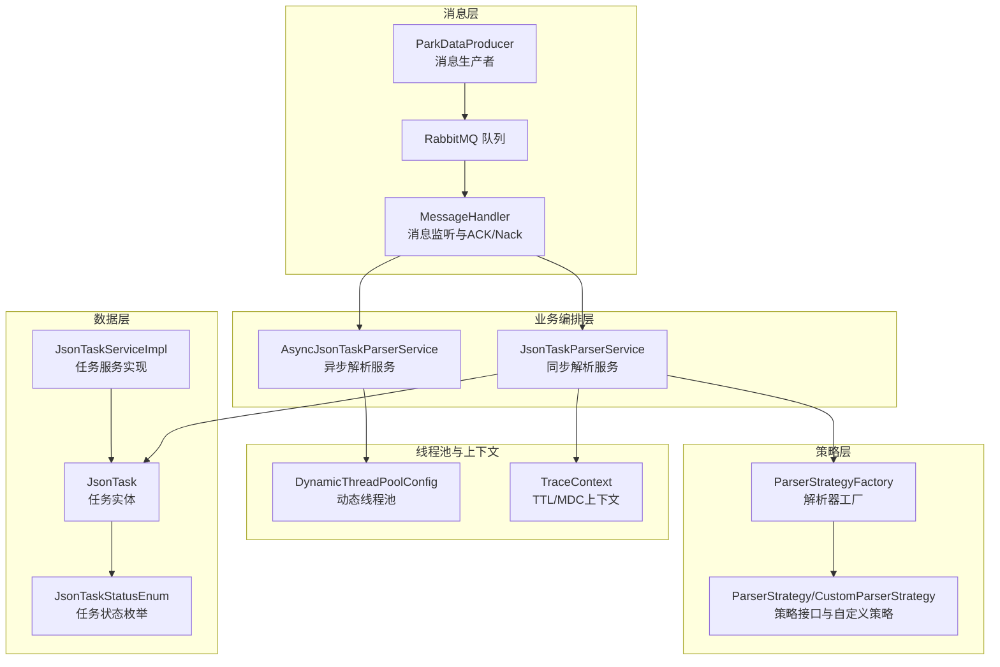
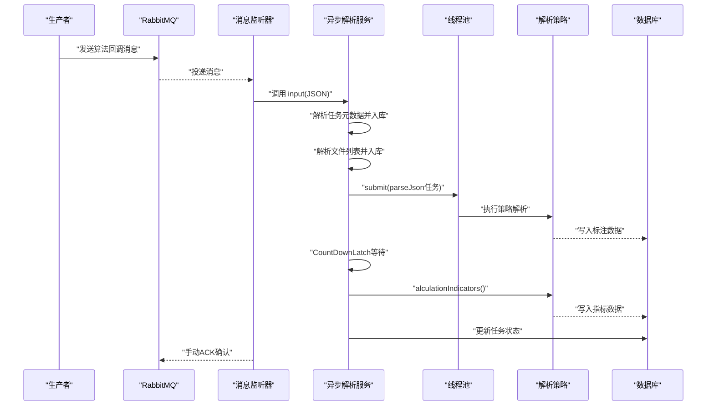
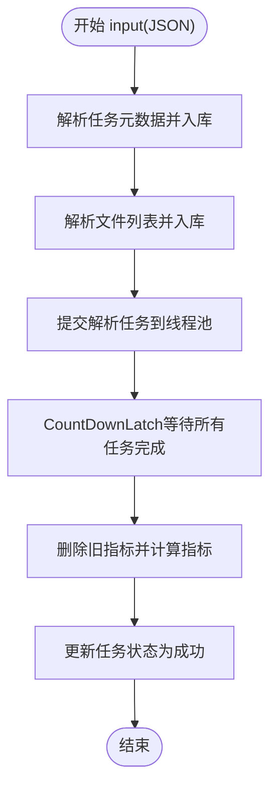
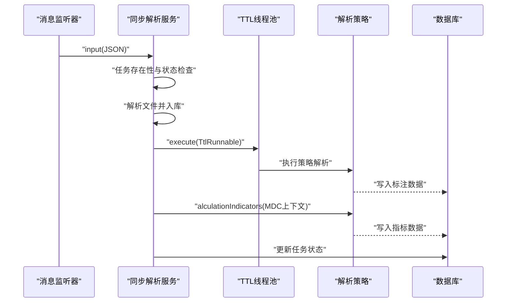
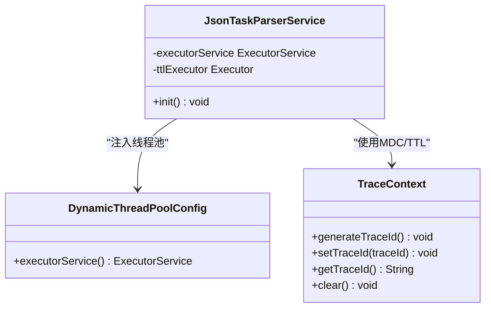
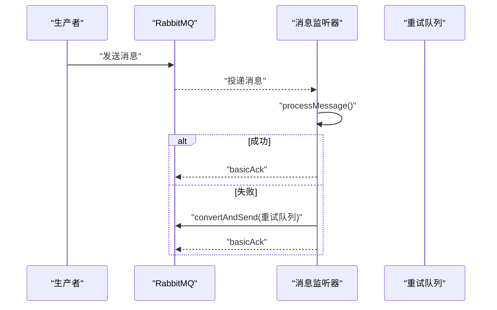
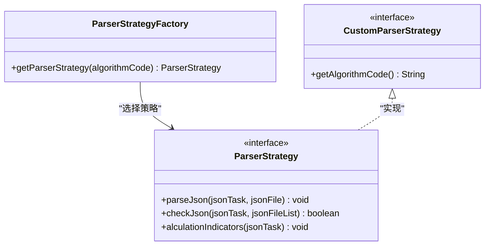
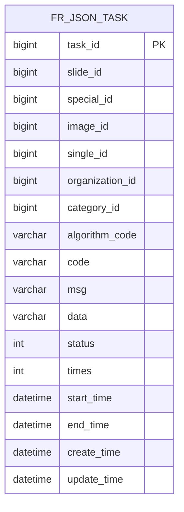
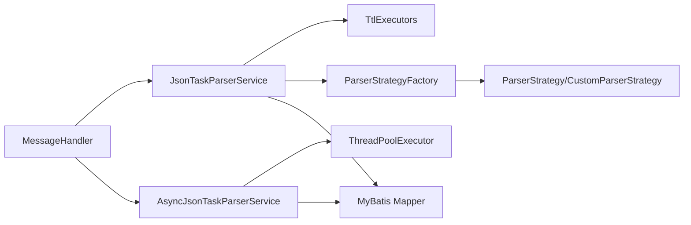

# 异步JSON任务解析服务

<cite>
**本文档引用的文件**
- [AsyncJsonTaskParserService.java](file://src/main/java/cn/staitech/fr/service/strategy/json/AsyncJsonTaskParserService.java)
- [JsonTaskParserService.java](file://src/main/java/cn/staitech/fr/service/strategy/json/JsonTaskParserService.java)
- [DynamicThreadPoolConfig.java](file://src/main/java/cn/staitech/fr/config/DynamicThreadPoolConfig.java)
- [TraceContext.java](file://src/main/java/cn/staitech/fr/config/TraceContext.java)
- [MessageHandler.java](file://src/main/java/cn/staitech/fr/config/MessageHandler.java)
- [ParkDataProducer.java](file://src/main/java/cn/staitech/fr/config/ParkDataProducer.java)
- [ParserStrategyFactory.java](file://src/main/java/cn/staitech/fr/service/strategy/json/ParserStrategyFactory.java)
- [ParserStrategy.java](file://src/main/java/cn/staitech/fr/service/strategy/json/ParserStrategy.java)
- [CustomParserStrategy.java](file://src/main/java/cn/staitech/fr/service/strategy/json/CustomParserStrategy.java)
- [CommonJsonParser.java](file://src/main/java/cn/staitech/fr/service/strategy/json/CommonJsonParser.java)
- [JsonTask.java](file://src/main/java/cn/staitech/fr/domain/JsonTask.java)
- [JsonTaskStatusEnum.java](file://src/main/java/cn/staitech/fr/enums/JsonTaskStatusEnum.java)
- [JsonTaskServiceImpl.java](file://src/main/java/cn/staitech/fr/service/impl/JsonTaskServiceImpl.java)
- [application-local.yml](file://src/main/resources/application-local.yml)
</cite>

## 目录
1. [简介](#简介)
2. [项目结构](#项目结构)
3. [核心组件](#核心组件)
4. [架构总览](#架构总览)
5. [详细组件分析](#详细组件分析)
6. [依赖关系分析](#依赖关系分析)
7. [性能考量](#性能考量)
8. [故障排查指南](#故障排查指南)
9. [结论](#结论)
10. [附录](#附录)

## 简介
本技术文档围绕异步JSON任务解析服务展开，系统性阐述异步处理架构的设计原理、线程池管理、任务调度与并发控制机制，以及异步任务的生命周期管理（创建、状态跟踪、错误恢复与资源清理）。文档重点覆盖TTL线程池的使用方式与上下文传递机制（MDC日志上下文与线程安全保证），并提供异步处理最佳实践（任务队列管理、超时控制与重试机制）。最后，对比同步解析服务的差异与适用场景，并给出监控指标、故障排查与性能调优建议。

## 项目结构
本服务位于“策略-JSON解析”子模块，采用分层与职责分离设计：
- 控制入口：消息监听与生产者负责接收外部算法回调消息
- 业务编排：同步与异步解析服务分别承担不同并发模型
- 策略模式：解析器工厂与多种解析策略实现，支持扩展
- 线程池与上下文：动态线程池配置与TTL/MDC上下文传递
- 数据模型：JSON任务与文件实体，状态枚举与服务实现

图表来源
- [MessageHandler.java:43-75](file://src/main/java/cn/staitech/fr/config/MessageHandler.java#L43-L75)
- [JsonTaskParserService.java:174-263](file://src/main/java/cn/staitech/fr/service/strategy/json/JsonTaskParserService.java#L174-L263)
- [AsyncJsonTaskParserService.java:68-213](file://src/main/java/cn/staitech/fr/service/strategy/json/AsyncJsonTaskParserService.java#L68-L213)
- [DynamicThreadPoolConfig.java:14-51](file://src/main/java/cn/staitech/fr/config/DynamicThreadPoolConfig.java#L14-L51)
- [TraceContext.java:14-81](file://src/main/java/cn/staitech/fr/config/TraceContext.java#L14-L81)
- [ParserStrategyFactory.java:39-41](file://src/main/java/cn/staitech/fr/service/strategy/json/ParserStrategyFactory.java#L39-L41)
- [ParserStrategy.java:14-32](file://src/main/java/cn/staitech/fr/service/strategy/json/ParserStrategy.java#L14-L32)
- [JsonTask.java:26-66](file://src/main/java/cn/staitech/fr/domain/JsonTask.java#L26-L66)
- [JsonTaskStatusEnum.java:6-14](file://src/main/java/cn/staitech/fr/enums/JsonTaskStatusEnum.java#L6-L14)
- [JsonTaskServiceImpl.java:31-52](file://src/main/java/cn/staitech/fr/service/impl/JsonTaskServiceImpl.java#L31-L52)

章节来源
- [application-local.yml:57-75](file://src/main/resources/application-local.yml#L57-L75)
- [application-local.yml:305-311](file://src/main/resources/application-local.yml#L305-L311)

## 核心组件
- 异步解析服务：基于固定大小线程池与有界阻塞队列，提交多个JSON文件解析任务，使用CountDownLatch协调完成，最终统一进行指标计算与状态更新。
- 同步解析服务：通过TTL包装的线程池执行任务，结合MDC写入日志上下文，确保跨线程日志可追踪。
- 动态线程池配置：提供可观察的线程池监控钩子，便于调试与容量规划。
- 消息编排：消息监听器负责手动确认与异常重试，支持延迟消息与重试队列。
- 策略模式：解析器工厂按算法标识选择解析策略，支持自定义策略扩展。
- 数据模型与状态：任务实体与状态枚举支撑任务生命周期管理与幂等处理。

章节来源
- [AsyncJsonTaskParserService.java:30-42](file://src/main/java/cn/staitech/fr/service/strategy/json/AsyncJsonTaskParserService.java#L30-L42)
- [JsonTaskParserService.java:94-107](file://src/main/java/cn/staitech/fr/service/strategy/json/JsonTaskParserService.java#L94-L107)
- [DynamicThreadPoolConfig.java:14-51](file://src/main/java/cn/staitech/fr/config/DynamicThreadPoolConfig.java#L14-L51)
- [MessageHandler.java:43-75](file://src/main/java/cn/staitech/fr/config/MessageHandler.java#L43-L75)
- [ParserStrategyFactory.java:39-41](file://src/main/java/cn/staitech/fr/service/strategy/json/ParserStrategyFactory.java#L39-L41)
- [JsonTask.java:26-66](file://src/main/java/cn/staitech/fr/domain/JsonTask.java#L26-L66)
- [JsonTaskStatusEnum.java:6-14](file://src/main/java/cn/staitech/fr/enums/JsonTaskStatusEnum.java#L6-L14)

## 架构总览
异步解析服务采用“消息驱动 + 线程池并发 + 策略分发”的架构：
- 消息层：生产者将算法回调消息投递至RabbitMQ；消费者监听队列，手动确认消息，异常时进入重试队列。
- 编排层：异步解析服务对任务元数据与文件列表进行解析与入库，随后按文件数量并行提交解析任务。
- 并发层：固定大小线程池与有界队列保障背压与资源占用；CountDownLatch确保所有子任务完成后统一进行指标计算与状态更新。
- 上下文层：TTL与MDC配合，确保日志上下文在跨线程场景下正确传递。

图表来源
- [MessageHandler.java:43-75](file://src/main/java/cn/staitech/fr/config/MessageHandler.java#L43-L75)
- [AsyncJsonTaskParserService.java:68-213](file://src/main/java/cn/staitech/fr/service/strategy/json/AsyncJsonTaskParserService.java#L68-L213)
- [ParserStrategyFactory.java:39-41](file://src/main/java/cn/staitech/fr/service/strategy/json/ParserStrategyFactory.java#L39-L41)
- [ParserStrategy.java:14-32](file://src/main/java/cn/staitech/fr/service/strategy/json/ParserStrategy.java#L14-L32)

## 详细组件分析

### 异步解析服务（AsyncJsonTaskParserService）
- 线程池配置：基于CPU核数动态确定核心与最大线程数，空闲线程等待时间为秒级，阻塞队列容量为4096，采用丢弃最老任务策略，确保系统在高负载下稳定。
- 任务生命周期：
  - 输入解析：从JSON字符串提取算法标识与任务元数据，入库并记录开始时间。
  - 文件解析：解析文件列表，逐个提交到线程池执行策略解析。
  - 并发控制：使用CountDownLatch等待所有子任务完成，避免主线程过早退出。
  - 统一收尾：删除旧指标、执行指标计算、更新任务状态与单脏器预测状态。
- 错误处理：捕获线程池提交异常与解析异常，记录日志并保证关键状态更新。
- 资源清理：确保每个文件解析结束后更新结束时间与状态，避免悬挂状态。

图表来源
- [AsyncJsonTaskParserService.java:68-213](file://src/main/java/cn/staitech/fr/service/strategy/json/AsyncJsonTaskParserService.java#L68-L213)

章节来源
- [AsyncJsonTaskParserService.java:30-42](file://src/main/java/cn/staitech/fr/service/strategy/json/AsyncJsonTaskParserService.java#L30-L42)
- [AsyncJsonTaskParserService.java:68-213](file://src/main/java/cn/staitech/fr/service/strategy/json/AsyncJsonTaskParserService.java#L68-L213)

### 同步解析服务（JsonTaskParserService）
- 线程池与TTL：通过@PostConstruct注入线程池，使用TtlExecutors包装为TTL线程池，确保跨线程传递MDC上下文。
- MDC上下文：在指标计算阶段设置MDC键值，计算完成后移除，保证日志可追踪且无泄漏。
- 生命周期与幂等：
  - 任务存在性检查与状态判断，避免重复执行。
  - 文件解析与校验，脏器结构完整性校验，必要时延迟执行。
  - 统一的异常处理与状态回滚，确保数据库一致性。
- 资源清理：删除临时指标、清理MDC、关闭线程池优雅退出。

图表来源
- [JsonTaskParserService.java:94-107](file://src/main/java/cn/staitech/fr/service/strategy/json/JsonTaskParserService.java#L94-L107)
- [JsonTaskParserService.java:251-254](file://src/main/java/cn/staitech/fr/service/strategy/json/JsonTaskParserService.java#L251-L254)
- [JsonTaskParserService.java:408-410](file://src/main/java/cn/staitech/fr/service/strategy/json/JsonTaskParserService.java#L408-L410)

章节来源
- [JsonTaskParserService.java:94-107](file://src/main/java/cn/staitech/fr/service/strategy/json/JsonTaskParserService.java#L94-L107)
- [JsonTaskParserService.java:251-254](file://src/main/java/cn/staitech/fr/service/strategy/json/JsonTaskParserService.java#L251-L254)
- [JsonTaskParserService.java:408-410](file://src/main/java/cn/staitech/fr/service/strategy/json/JsonTaskParserService.java#L408-L410)
- [JsonTaskParserService.java:741-758](file://src/main/java/cn/staitech/fr/service/strategy/json/JsonTaskParserService.java#L741-L758)

### 线程池与上下文（DynamicThreadPoolConfig 与 TraceContext）
- 动态线程池：提供可观察的监控钩子（提交、开始、完成），便于定位线程池压力与队列堆积问题。
- TTL与MDC：TraceContext在任务执行前后自动将上下文写入/清理MDC，确保日志链路一致；TTL保证跨线程传递。

图表来源
- [DynamicThreadPoolConfig.java:14-51](file://src/main/java/cn/staitech/fr/config/DynamicThreadPoolConfig.java#L14-L51)
- [TraceContext.java:14-81](file://src/main/java/cn/staitech/fr/config/TraceContext.java#L14-L81)
- [JsonTaskParserService.java:94-107](file://src/main/java/cn/staitech/fr/service/strategy/json/JsonTaskParserService.java#L94-L107)

章节来源
- [DynamicThreadPoolConfig.java:14-51](file://src/main/java/cn/staitech/fr/config/DynamicThreadPoolConfig.java#L14-L51)
- [TraceContext.java:14-81](file://src/main/java/cn/staitech/fr/config/TraceContext.java#L14-L81)

### 消息编排（MessageHandler 与 ParkDataProducer）
- 消费者：监听主队列，手动确认消息；异常时发送至重试队列，支持Nack回队。
- 生产者：向主队列或延迟交换机发送消息，支持延迟消息头。
- 延迟检查：监听延迟队列，触发任务检查逻辑，防止长时间挂起。

图表来源
- [MessageHandler.java:43-75](file://src/main/java/cn/staitech/fr/config/MessageHandler.java#L43-L75)
- [ParkDataProducer.java:27-44](file://src/main/java/cn/staitech/fr/config/ParkDataProducer.java#L27-L44)

章节来源
- [MessageHandler.java:43-75](file://src/main/java/cn/staitech/fr/config/MessageHandler.java#L43-L75)
- [MessageHandler.java:102-127](file://src/main/java/cn/staitech/fr/config/MessageHandler.java#L102-L127)
- [ParkDataProducer.java:27-44](file://src/main/java/cn/staitech/fr/config/ParkDataProducer.java#L27-L44)

### 策略模式（ParserStrategyFactory 与 ParserStrategy）
- 工厂：根据算法标识从Spring容器中获取对应解析策略，支持自定义策略扩展。
- 接口：定义解析、校验与指标计算三类能力，便于替换与组合。

图表来源
- [ParserStrategyFactory.java:39-41](file://src/main/java/cn/staitech/fr/service/strategy/json/ParserStrategyFactory.java#L39-L41)
- [ParserStrategy.java:14-32](file://src/main/java/cn/staitech/fr/service/strategy/json/ParserStrategy.java#L14-L32)
- [CustomParserStrategy.java:9-12](file://src/main/java/cn/staitech/fr/service/strategy/json/CustomParserStrategy.java#L9-L12)

章节来源
- [ParserStrategyFactory.java:39-41](file://src/main/java/cn/staitech/fr/service/strategy/json/ParserStrategyFactory.java#L39-L41)
- [ParserStrategy.java:14-32](file://src/main/java/cn/staitech/fr/service/strategy/json/ParserStrategy.java#L14-L32)
- [CustomParserStrategy.java:9-12](file://src/main/java/cn/staitech/fr/service/strategy/json/CustomParserStrategy.java#L9-L12)

### 数据模型与状态（JsonTask 与 JsonTaskStatusEnum）
- 实体：包含任务ID、切片ID、专题ID、图像ID、单脏器切片ID、机构ID、脏器标签ID、算法标识、状态码、消息、数据、状态、执行次数、时间戳等字段。
- 状态：提供未解析、解析中、解析成功、失败、待开始五种状态，支撑幂等与重试控制。

图表来源
- [JsonTask.java:26-66](file://src/main/java/cn/staitech/fr/domain/JsonTask.java#L26-L66)

章节来源
- [JsonTask.java:26-66](file://src/main/java/cn/staitech/fr/domain/JsonTask.java#L26-L66)
- [JsonTaskStatusEnum.java:6-14](file://src/main/java/cn/staitech/fr/enums/JsonTaskStatusEnum.java#L6-L14)
- [JsonTaskServiceImpl.java:31-52](file://src/main/java/cn/staitech/fr/service/impl/JsonTaskServiceImpl.java#L31-L52)

## 依赖关系分析
- 组件耦合：
  - 异步解析服务直接依赖线程池与解析策略工厂；与数据库交互通过服务层与Mapper。
  - 同步解析服务依赖TTL线程池与MDC上下文，策略工厂与数据库交互同上。
  - 消息层与业务层通过接口解耦，支持独立演进。
- 外部依赖：
  - RabbitMQ：消息队列与延迟消息支持。
  - 数据库：MySQL与PostgreSQL双数据源配置，Hikari连接池参数优化。
  - TTL：TransmittableThreadLocal与TtlExecutors确保上下文传递。

图表来源
- [MessageHandler.java:43-75](file://src/main/java/cn/staitech/fr/config/MessageHandler.java#L43-L75)
- [JsonTaskParserService.java:94-107](file://src/main/java/cn/staitech/fr/service/strategy/json/JsonTaskParserService.java#L94-L107)
- [AsyncJsonTaskParserService.java:30-42](file://src/main/java/cn/staitech/fr/service/strategy/json/AsyncJsonTaskParserService.java#L30-L42)
- [ParserStrategyFactory.java:39-41](file://src/main/java/cn/staitech/fr/service/strategy/json/ParserStrategyFactory.java#L39-L41)

章节来源
- [application-local.yml:15-56](file://src/main/resources/application-local.yml#L15-L56)
- [application-local.yml:57-75](file://src/main/resources/application-local.yml#L57-L75)

## 性能考量
- 线程池参数：
  - 异步服务：核心线程数≈CPU核数-1，最大线程数≈CPU核数×2，队列容量4096，空闲回收10秒，丢弃最老任务策略，适合高并发短任务。
  - 动态线程池：核心与最大均为固定值，队列长度5，拒绝策略CallerRunsPolicy，便于观察与限流。
- I/O与批处理：
  - JSON解析采用流式读取与批处理写入，减少内存占用与数据库往返。
  - 指标计算与标注写入分离，降低单点瓶颈。
- 监控与可观测性：
  - 动态线程池提供提交/开始/完成钩子，便于定位峰值与排队时间。
  - MDC上下文贯穿指标计算阶段，便于日志关联与问题定位。
- 资源消耗：
  - 异步服务通过线程池复用与队列背压，避免频繁创建销毁线程带来的开销。
  - 同步服务通过TTL线程池与MDC，确保上下文传递成本可控。

章节来源
- [AsyncJsonTaskParserService.java:30-42](file://src/main/java/cn/staitech/fr/service/strategy/json/AsyncJsonTaskParserService.java#L30-L42)
- [DynamicThreadPoolConfig.java:14-51](file://src/main/java/cn/staitech/fr/config/DynamicThreadPoolConfig.java#L14-L51)
- [JsonTaskParserService.java:408-410](file://src/main/java/cn/staitech/fr/service/strategy/json/JsonTaskParserService.java#L408-L410)

## 故障排查指南
- 消息处理失败：
  - 检查消费者是否正确ACK/Nack；异常时是否进入重试队列。
  - 查看延迟队列是否触发任务检查，避免长时间挂起。
- 线程池问题：
  - 关注动态线程池监控日志，定位队列堆积与线程饱和。
  - 检查拒绝策略与队列容量是否合理。
- 解析异常：
  - 核对文件路径与JSON格式，确保校验通过后再写入数据库。
  - 关注指标计算阶段的MDC上下文，确保日志可追踪。
- 数据库连接：
  - 检查双数据源连接池参数，避免连接泄漏与超时。

章节来源
- [MessageHandler.java:43-75](file://src/main/java/cn/staitech/fr/config/MessageHandler.java#L43-L75)
- [MessageHandler.java:102-127](file://src/main/java/cn/staitech/fr/config/MessageHandler.java#L102-L127)
- [DynamicThreadPoolConfig.java:29-45](file://src/main/java/cn/staitech/fr/config/DynamicThreadPoolConfig.java#L29-L45)
- [JsonTaskParserService.java:408-410](file://src/main/java/cn/staitech/fr/service/strategy/json/JsonTaskParserService.java#L408-L410)

## 结论
异步JSON任务解析服务通过消息驱动与线程池并发实现了高吞吐与低延迟的解析流程，结合策略模式与TTL/MDC上下文，提供了良好的扩展性与可观测性。异步服务适用于大批量、短任务场景，同步服务适用于需要严格上下文传递与细粒度控制的场景。通过合理的线程池参数、队列背压与监控告警，可有效提升系统稳定性与性能。

## 附录
- 适用场景对比：
  - 异步服务：高并发、批量处理、容错性强。
  - 同步服务：强一致性、上下文严格传递、复杂业务编排。
- 最佳实践：
  - 任务队列管理：合理设置队列容量与死信策略，避免消息堆积。
  - 超时控制：为解析与指标计算设置超时阈值，防止长时间占用线程。
  - 重试机制：区分幂等与非幂等操作，采用指数退避与最大重试次数。
- 监控指标：
  - 线程池：活跃线程数、队列长度、完成任务数、拒绝次数。
  - 消息：消费速率、重试次数、延迟队列长度。
  - 解析：单文件解析耗时、批处理写入耗时、指标计算耗时。