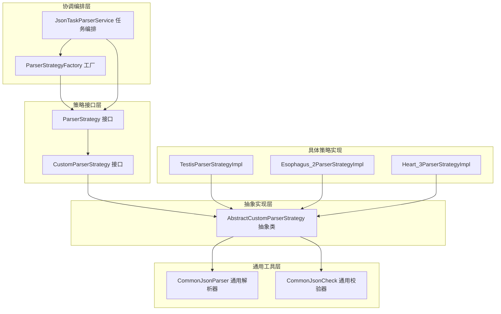
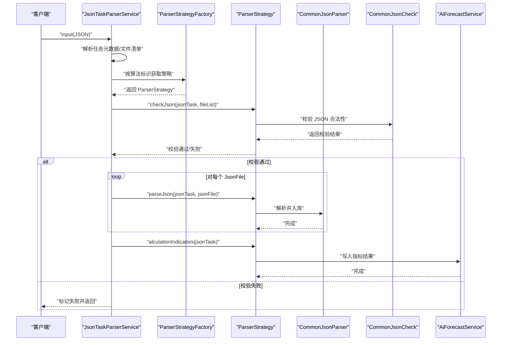
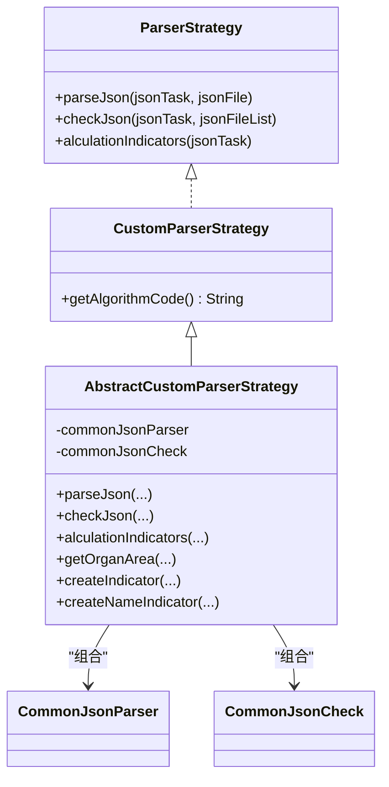
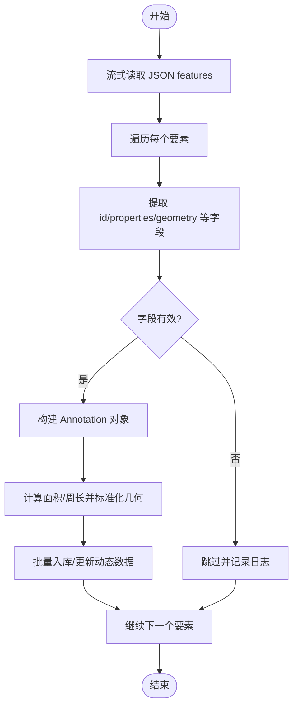
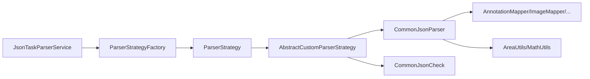

# 抽象自定义解析策略

<cite>
**本文引用的文件**
- [AbstractCustomParserStrategy.java](file://src/main/java/cn/staitech/fr/service/strategy/json/AbstractCustomParserStrategy.java)
- [CommonJsonParser.java](file://src/main/java/cn/staitech/fr/service/strategy/json/CommonJsonParser.java)
- [CommonJsonCheck.java](file://src/main/java/cn/staitech/fr/service/strategy/json/CommonJsonCheck.java)
- [ParserStrategy.java](file://src/main/java/cn/staitech/fr/service/strategy/json/ParserStrategy.java)
- [CustomParserStrategy.java](file://src/main/java/cn/staitech/fr/service/strategy/json/CustomParserStrategy.java)
- [ParserStrategyFactory.java](file://src/main/java/cn/staitech/fr/service/strategy/json/ParserStrategyFactory.java)
- [JsonTaskParserService.java](file://src/main/java/cn/staitech/fr/service/strategy/json/JsonTaskParserService.java)
- [JsonTaskParserException.java](file://src/main/java/cn/staitech/fr/service/strategy/json/JsonTaskParserException.java)
- [TestisParserStrategyImpl.java](file://src/main/java/cn/staitech/fr/service/strategy/json/impl/rat/TestisParserStrategyImpl.java)
- [Esophagus_2ParserStrategyImpl.java](file://src/main/java/cn/staitech/fr/service/strategy/json/impl/mouse/Esophagus_2ParserStrategyImpl.java)
- [Heart_3ParserStrategyImpl.java](file://src/main/java/cn/staitech/fr/service/strategy/json/impl/dog/circulatory/Heart_3ParserStrategyImpl.java)
</cite>

## 目录
1. [简介](#简介)
2. [项目结构](#项目结构)
3. [核心组件](#核心组件)
4. [架构总览](#架构总览)
5. [详细组件分析](#详细组件分析)
6. [依赖关系分析](#依赖关系分析)
7. [性能考量](#性能考量)
8. [故障排查指南](#故障排查指南)
9. [结论](#结论)
10. [附录](#附录)

## 简介
本文件围绕“抽象自定义解析策略”主题，系统性梳理并文档化以下内容：
- AbstractCustomParserStrategy 抽象类的设计理念、职责边界与模板方法模式应用
- CommonJsonParser 通用解析器的实现原理，包括 JSON 数据预处理、格式标准化与异常处理
- 抽象策略的核心方法定义与实现规范：checkJson、parseJson、alculationIndicators
- 具体继承实现示例与策略扩展指南
- 与具体算法实现的协作关系与数据流转过程
- 错误处理策略、性能优化技巧与调试方法

## 项目结构
该模块位于服务层的 JSON 解析与指标计算子系统，采用“策略 + 工厂 + 通用解析器”的分层设计：
- 接口层：ParserStrategy、CustomParserStrategy 定义统一契约
- 抽象层：AbstractCustomParserStrategy 封装通用解析与指标构建能力
- 实现层：多种动物/系统/器官的具体策略实现
- 通用工具层：CommonJsonParser、CommonJsonCheck 提供 JSON 解析与校验
- 协调层：ParserStrategyFactory、JsonTaskParserService 负责策略选择与任务编排

图表来源
- [ParserStrategy.java:14-32](file://src/main/java/cn/staitech/fr/service/strategy/json/ParserStrategy.java#L14-L32)
- [CustomParserStrategy.java:9-12](file://src/main/java/cn/staitech/fr/service/strategy/json/CustomParserStrategy.java#L9-L12)
- [AbstractCustomParserStrategy.java:23-54](file://src/main/java/cn/staitech/fr/service/strategy/json/AbstractCustomParserStrategy.java#L23-L54)
- [CommonJsonParser.java:48-66](file://src/main/java/cn/staitech/fr/service/strategy/json/CommonJsonParser.java#L48-L66)
- [CommonJsonCheck.java:41-53](file://src/main/java/cn/staitech/fr/service/strategy/json/CommonJsonCheck.java#L41-L53)
- [ParserStrategyFactory.java:14-43](file://src/main/java/cn/staitech/fr/service/strategy/json/ParserStrategyFactory.java#L14-L43)
- [JsonTaskParserService.java:54-107](file://src/main/java/cn/staitech/fr/service/strategy/json/JsonTaskParserService.java#L54-L107)
- [TestisParserStrategyImpl.java:34-49](file://src/main/java/cn/staitech/fr/service/strategy/json/impl/rat/TestisParserStrategyImpl.java#L34-L49)
- [Esophagus_2ParserStrategyImpl.java:31-65](file://src/main/java/cn/staitech/fr/service/strategy/json/impl/mouse/Esophagus_2ParserStrategyImpl.java#L31-L65)
- [Heart_3ParserStrategyImpl.java:32-58](file://src/main/java/cn/staitech/fr/service/strategy/json/impl/dog/circulatory/Heart_3ParserStrategyImpl.java#L32-L58)

章节来源
- [ParserStrategy.java:14-32](file://src/main/java/cn/staitech/fr/service/strategy/json/ParserStrategy.java#L14-L32)
- [CustomParserStrategy.java:9-12](file://src/main/java/cn/staitech/fr/service/strategy/json/CustomParserStrategy.java#L9-L12)
- [AbstractCustomParserStrategy.java:23-54](file://src/main/java/cn/staitech/fr/service/strategy/json/AbstractCustomParserStrategy.java#L23-L54)
- [CommonJsonParser.java:48-66](file://src/main/java/cn/staitech/fr/service/strategy/json/CommonJsonParser.java#L48-L66)
- [CommonJsonCheck.java:41-53](file://src/main/java/cn/staitech/fr/service/strategy/json/CommonJsonCheck.java#L41-L53)
- [ParserStrategyFactory.java:14-43](file://src/main/java/cn/staitech/fr/service/strategy/json/ParserStrategyFactory.java#L14-L43)
- [JsonTaskParserService.java:54-107](file://src/main/java/cn/staitech/fr/service/strategy/json/JsonTaskParserService.java#L54-L107)

## 核心组件
- ParserStrategy：定义统一的解析与指标计算接口，包括 parseJson、checkJson、alculationIndicators
- CustomParserStrategy：在 ParserStrategy 基础上增加算法标识 getAlgorithmCode
- AbstractCustomParserStrategy：实现模板方法，委托 CommonJsonParser 与 CommonJsonCheck 完成通用解析与校验，并提供指标构建工具方法
- CommonJsonParser：负责 JSON 流式解析、要素提取、几何转换、批量入库与动态数据聚合
- CommonJsonCheck：负责 JSON 校验（字段完整性、几何有效性、映射关系）
- ParserStrategyFactory：基于 Spring Bean 注册表按算法标识获取具体策略
- JsonTaskParserService：任务编排入口，负责任务解析、策略选择、流程控制与异常兜底

章节来源
- [ParserStrategy.java:14-32](file://src/main/java/cn/staitech/fr/service/strategy/json/ParserStrategy.java#L14-L32)
- [CustomParserStrategy.java:9-12](file://src/main/java/cn/staitech/fr/service/strategy/json/CustomParserStrategy.java#L9-L12)
- [AbstractCustomParserStrategy.java:23-54](file://src/main/java/cn/staitech/fr/service/strategy/json/AbstractCustomParserStrategy.java#L23-L54)
- [CommonJsonParser.java:209-297](file://src/main/java/cn/staitech/fr/service/strategy/json/CommonJsonParser.java#L209-L297)
- [CommonJsonCheck.java:169-224](file://src/main/java/cn/staitech/fr/service/strategy/json/CommonJsonCheck.java#L169-L224)
- [ParserStrategyFactory.java:14-43](file://src/main/java/cn/staitech/fr/service/strategy/json/ParserStrategyFactory.java#L14-L43)
- [JsonTaskParserService.java:174-263](file://src/main/java/cn/staitech/fr/service/strategy/json/JsonTaskParserService.java#L174-L263)

## 架构总览
整体流程：JsonTaskParserService 接收任务输入，解析任务元数据与文件清单，选择策略（工厂），先校验 JSON，再逐文件解析并入库，最后进行指标计算与结果落库。

图表来源
- [JsonTaskParserService.java:174-263](file://src/main/java/cn/staitech/fr/service/strategy/json/JsonTaskParserService.java#L174-L263)
- [ParserStrategyFactory.java:39-41](file://src/main/java/cn/staitech/fr/service/strategy/json/ParserStrategyFactory.java#L39-L41)
- [ParserStrategy.java:22-31](file://src/main/java/cn/staitech/fr/service/strategy/json/ParserStrategy.java#L22-L31)
- [CommonJsonParser.java:209-297](file://src/main/java/cn/staitech/fr/service/strategy/json/CommonJsonParser.java#L209-L297)
- [CommonJsonCheck.java:169-224](file://src/main/java/cn/staitech/fr/service/strategy/json/CommonJsonCheck.java#L169-L224)

## 详细组件分析

### AbstractCustomParserStrategy 抽象类
- 设计理念
  - 采用模板方法模式：将“通用解析流程”下沉至抽象类，子类仅关注“指标计算”细节
  - 通过组合注入 CommonJsonParser 与 CommonJsonCheck，复用 JSON 解析与校验能力
  - 提供指标构建工具方法，统一单位、精度与结构 ID 关联
- 关键职责
  - parseJson/checkJson 委托给通用解析器
  - 提供 getOrganArea/getOrganAreaMicron/getStructureContourList 等常用几何查询
  - 提供 createIndicator/createNameIndicator 等指标对象构建工具
  - 提供比例/除法/乘百分比等数学工具方法
- 继承体系
  - Rat/Mouse/Dog 等不同动物、不同系统/器官均有对应实现类，遵循同一模板

图表来源
- [ParserStrategy.java:14-32](file://src/main/java/cn/staitech/fr/service/strategy/json/ParserStrategy.java#L14-L32)
- [CustomParserStrategy.java:9-12](file://src/main/java/cn/staitech/fr/service/strategy/json/CustomParserStrategy.java#L9-L12)
- [AbstractCustomParserStrategy.java:23-54](file://src/main/java/cn/staitech/fr/service/strategy/json/AbstractCustomParserStrategy.java#L23-L54)
- [CommonJsonParser.java:48-66](file://src/main/java/cn/staitech/fr/service/strategy/json/CommonJsonParser.java#L48-L66)
- [CommonJsonCheck.java:41-53](file://src/main/java/cn/staitech/fr/service/strategy/json/CommonJsonCheck.java#L41-L53)

章节来源
- [AbstractCustomParserStrategy.java:23-210](file://src/main/java/cn/staitech/fr/service/strategy/json/AbstractCustomParserStrategy.java#L23-L210)

### CommonJsonParser 通用解析器
- JSON 预处理与格式标准化
  - 使用 Jackson 流式解析 features 数组，边读边处理，降低内存占用
  - 将 geometry 及多分辨率几何（geometry10000/2500/625/0）标准化为字符串，便于后续入库与查询
  - 通过 MapConstant/结构映射获取结构尺寸与类别 ID，确保标注一致性
- 几何与面积计算
  - 通过 annotationMapper 查询面积/周长，结合图像分辨率进行单位换算
  - 提供 getOrganArea/getStructureContourList/getContourInsideOrOutside 等几何查询工具
- 动态数据聚合
  - 支持对单个注解的动态数据（面积/周长/数量）进行聚合与更新
  - 并发处理多个注解，使用线程池异步处理并批量更新
- 异常处理
  - 对 JSON 字段缺失、几何解析失败、PG 几何转换异常等情况进行日志记录与容错

图表来源
- [CommonJsonParser.java:209-297](file://src/main/java/cn/staitech/fr/service/strategy/json/CommonJsonParser.java#L209-L297)
- [CommonJsonParser.java:319-335](file://src/main/java/cn/staitech/fr/service/strategy/json/CommonJsonParser.java#L319-L335)
- [CommonJsonParser.java:604-634](file://src/main/java/cn/staitech/fr/service/strategy/json/CommonJsonParser.java#L604-L634)

章节来源
- [CommonJsonParser.java:209-297](file://src/main/java/cn/staitech/fr/service/strategy/json/CommonJsonParser.java#L209-L297)
- [CommonJsonParser.java:319-335](file://src/main/java/cn/staitech/fr/service/strategy/json/CommonJsonParser.java#L319-L335)
- [CommonJsonParser.java:604-634](file://src/main/java/cn/staitech/fr/service/strategy/json/CommonJsonParser.java#L604-L634)

### 抽象策略核心方法定义与实现规范
- checkJson
  - 输入：JsonTask、JsonFile 列表
  - 输出：布尔值，指示 JSON 格式与字段是否满足要求
  - 实现要点：使用 CommonJsonCheck 校验 features 中每个要素的 id/properties/geometry 等字段，以及结构映射关系
- parseJson
  - 输入：JsonTask、JsonFile
  - 输出：无（副作用：入库/更新动态数据）
  - 实现要点：委托 CommonJsonParser 进行流式解析与入库；特殊结构（如组织轮廓）走专用解析路径
- alculationIndicators
  - 输入：JsonTask
  - 输出：无（副作用：写入指标结果）
  - 实现要点：基于几何查询与数学运算构建指标，使用 createIndicator/createNameIndicator 统一格式化

章节来源
- [ParserStrategy.java:16-31](file://src/main/java/cn/staitech/fr/service/strategy/json/ParserStrategy.java#L16-L31)
- [CommonJsonCheck.java:169-224](file://src/main/java/cn/staitech/fr/service/strategy/json/CommonJsonCheck.java#L169-L224)
- [CommonJsonParser.java:209-297](file://src/main/java/cn/staitech/fr/service/strategy/json/CommonJsonParser.java#L209-L297)

### 具体继承实现示例与扩展指南

#### 示例一：睾丸（Rat）策略
- 继承关系：TestisParserStrategyImpl -> AbstractCustomParserStrategy
- 关键点：
  - 初始化阶段注入 CommonJsonParser/Check 与业务服务
  - 在 alculationIndicators 中调用 getOrganArea/getOrganAreaCount 等工具方法
  - 使用 putAnnotationDynamicData/putSingleAnnotationDynamicData 聚合单个注解的动态数据
  - 使用 createIndicator/createNameIndicator 构建算法输出与产品呈现指标

章节来源
- [TestisParserStrategyImpl.java:34-196](file://src/main/java/cn/staitech/fr/service/strategy/json/impl/rat/TestisParserStrategyImpl.java#L34-L196)

#### 示例二：小鼠食管（Mouse）策略
- 继承关系：Esophagus_2ParserStrategyImpl -> AbstractCustomParserStrategy
- 关键点：
  - 重写 parseJson 以直接委托通用解析器
  - 在 alculationIndicators 中按结构 ID 查询面积，计算占比与面积
  - 使用 getAreaOrZero 处理空 JSON 场景

章节来源
- [Esophagus_2ParserStrategyImpl.java:31-134](file://src/main/java/cn/staitech/fr/service/strategy/json/impl/mouse/Esophagus_2ParserStrategyImpl.java#L31-L134)

#### 示例三：犬心脏（Dog）策略
- 继承关系：Heart_3ParserImpl -> AbstractCustomParserStrategy & OutlineCustom
- 关键点：
  - 实现 OutlineCustom 接口，提供自定义轮廓计算入口
  - 在 alculationIndicators 中计算血管面积占比与心脏面积
  - 使用 getOrganArea 与单切片轮廓面积

章节来源
- [Heart_3ParserStrategyImpl.java:32-110](file://src/main/java/cn/staitech/fr/service/strategy/json/impl/dog/circulatory/Heart_3ParserStrategyImpl.java#L32-L110)

#### 策略扩展指南
- 新增策略步骤
  - 新建实现类，继承 AbstractCustomParserStrategy 或实现 CustomParserStrategy
  - 在 @PostConstruct 中注入 CommonJsonParser/Check 与业务服务
  - 实现 getAlgorithmCode 返回唯一算法标识
  - 实现 alculationIndicators，使用工具方法构建指标
  - 如需自定义解析流程，可重写 parseJson
- 单元测试建议
  - 使用 Mock CommonJsonParser/Check，验证 alculationIndicators 的指标计算逻辑
  - 验证边界条件（空 JSON、无效几何、单位换算）

## 依赖关系分析
- 组件耦合
  - AbstractCustomParserStrategy 与 CommonJsonParser/Check 存在组合依赖，体现“模板方法 + 通用工具”的低耦合高内聚
  - JsonTaskParserService 通过 ParserStrategyFactory 解耦策略选择，避免硬编码
- 外部依赖
  - Jackson 用于流式 JSON 解析
  - GeoTools/JTS 用于 GeoJSON/几何转换
  - MyBatis Plus 用于数据库访问
  - Guava Maps 用于策略注册表

图表来源
- [JsonTaskParserService.java:62-84](file://src/main/java/cn/staitech/fr/service/strategy/json/JsonTaskParserService.java#L62-L84)
- [ParserStrategyFactory.java:30-41](file://src/main/java/cn/staitech/fr/service/strategy/json/ParserStrategyFactory.java#L30-L41)
- [AbstractCustomParserStrategy.java:25-26](file://src/main/java/cn/staitech/fr/service/strategy/json/AbstractCustomParserStrategy.java#L25-L26)
- [CommonJsonParser.java:48-66](file://src/main/java/cn/staitech/fr/service/strategy/json/CommonJsonParser.java#L48-L66)

章节来源
- [JsonTaskParserService.java:62-84](file://src/main/java/cn/staitech/fr/service/strategy/json/JsonTaskParserService.java#L62-L84)
- [ParserStrategyFactory.java:30-41](file://src/main/java/cn/staitech/fr/service/strategy/json/ParserStrategyFactory.java#L30-L41)
- [AbstractCustomParserStrategy.java:25-26](file://src/main/java/cn/staitech/fr/service/strategy/json/AbstractCustomParserStrategy.java#L25-L26)
- [CommonJsonParser.java:48-66](file://src/main/java/cn/staitech/fr/service/strategy/json/CommonJsonParser.java#L48-L66)

## 性能考量
- 流式解析与批处理
  - CommonJsonParser 使用 Jackson 流式解析 features，配合批量入库，显著降低内存峰值
  - 并行处理注解动态数据聚合，利用线程池提升吞吐
- 缓存与映射
  - 结构映射与定位表缓存（Map 缓存）减少重复查询
- 单位换算与精度
  - 统一使用 BigDecimal 与固定精度（保留三位小数），避免浮点误差累积
- I/O 与网络
  - 建议将 JSON 文件放置本地磁盘，避免频繁远程读取
  - 控制批大小（默认 5000）以平衡内存与吞吐

章节来源
- [CommonJsonParser.java:234-297](file://src/main/java/cn/staitech/fr/service/strategy/json/CommonJsonParser.java#L234-L297)
- [CommonJsonParser.java:604-634](file://src/main/java/cn/staitech/fr/service/strategy/json/CommonJsonParser.java#L604-L634)

## 故障排查指南
- 常见问题与定位
  - JSON 类型错误：检查 features 字段是否存在、数组元素是否为对象
  - 字段缺失：id/properties/geometry 等字段为空或格式不正确
  - 几何无效：stIsValid 校验失败，需 stMakeValid 修复
  - 映射缺失：tb_structure_tag 中缺少结构 ID 映射
- 日志与监控
  - 关注 parseJson/checkJson 的日志级别，定位失败节点
  - 统计批处理耗时与文件大小，评估批大小与线程池配置
- 异常兜底
  - JsonTaskParserService 捕获异常并抛出 JsonTaskParserException，统一标记任务失败状态

章节来源
- [CommonJsonCheck.java:169-224](file://src/main/java/cn/staitech/fr/service/strategy/json/CommonJsonCheck.java#L169-L224)
- [CommonJsonParser.java:493-502](file://src/main/java/cn/staitech/fr/service/strategy/json/CommonJsonParser.java#L493-L502)
- [JsonTaskParserService.java:259-262](file://src/main/java/cn/staitech/fr/service/strategy/json/JsonTaskParserService.java#L259-L262)
- [JsonTaskParserException.java:9-14](file://src/main/java/cn/staitech/fr/service/strategy/json/JsonTaskParserException.java#L9-L14)

## 结论
AbstractCustomParserStrategy 通过模板方法模式将通用解析与校验下沉，使各动物/系统/器官策略专注于指标计算，实现了高内聚、低耦合的可扩展架构。CommonJsonParser 以流式解析与批处理为核心，兼顾性能与稳定性；JsonTaskParserService 以工厂与策略模式实现灵活的任务编排。整体方案具备良好的可维护性与可扩展性，适合持续演进与多物种/多指标场景。

## 附录
- 最佳实践
  - 统一使用 createIndicator/createNameIndicator 构建指标，保证单位与精度一致
  - 对空 JSON 场景进行显式处理，避免除零与空指针
  - 合理设置批大小与线程池参数，结合监控数据持续优化
- 调试建议
  - 逐步缩小 JSON 片段，定位首个失败要素
  - 使用单元测试覆盖边界条件与异常分支
  - 关注批处理耗时与内存占用，必要时调整批大小与并发度