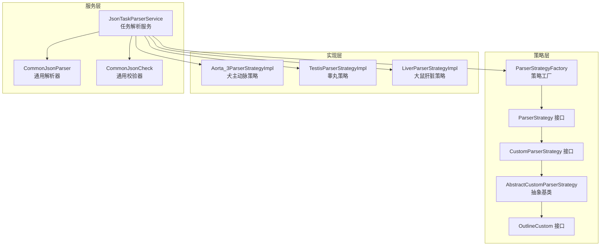
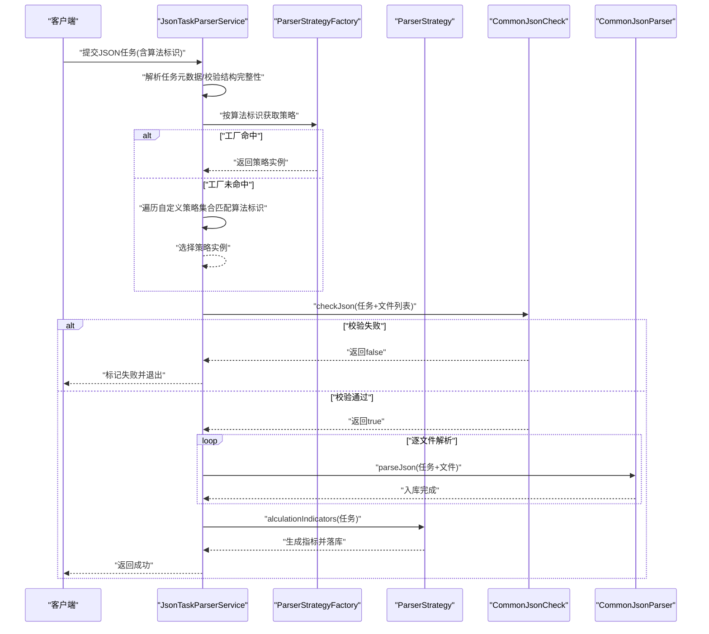
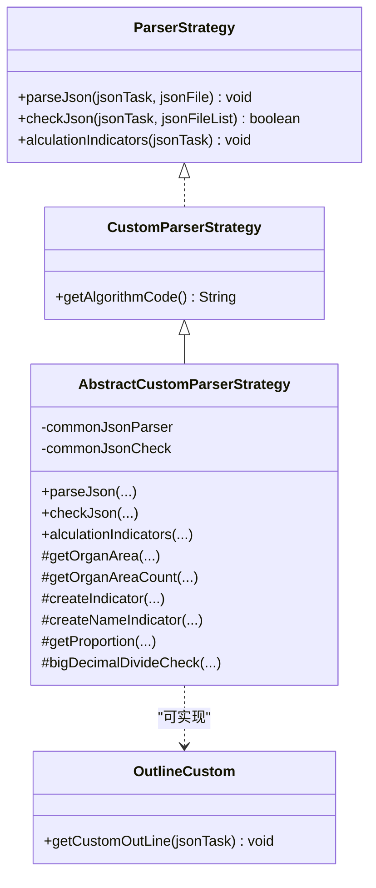
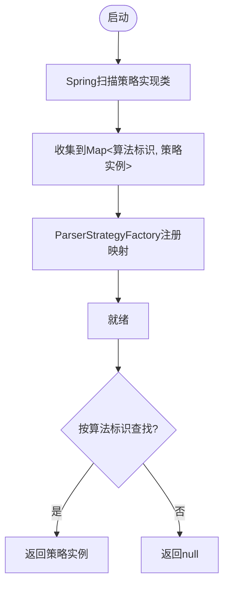
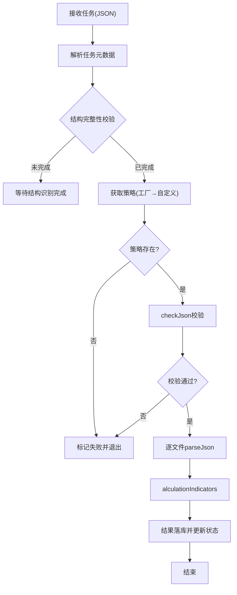
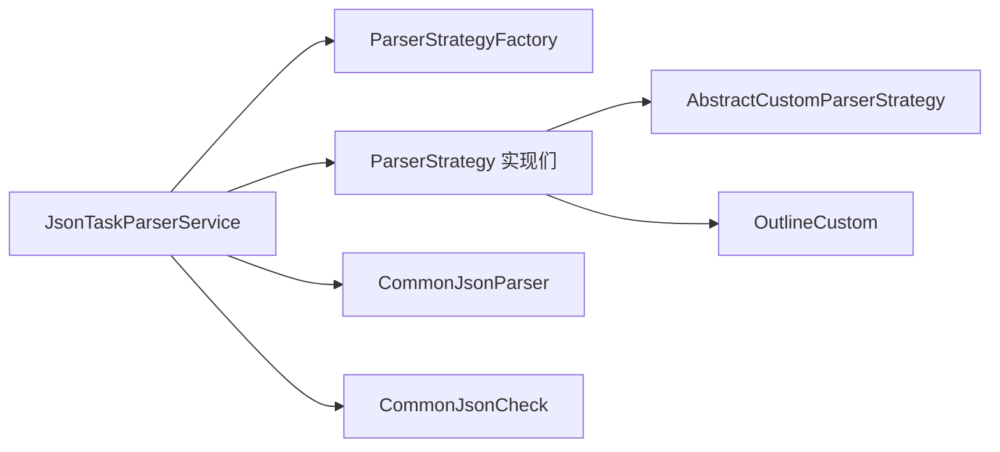

# 解析策略工厂

<cite>
**本文引用的文件**
- [ParserStrategyFactory.java](file://src/main/java/cn/staitech/fr/service/strategy/json/ParserStrategyFactory.java)
- [ParserStrategy.java](file://src/main/java/cn/staitech/fr/service/strategy/json/ParserStrategy.java)
- [CustomParserStrategy.java](file://src/main/java/cn/staitech/fr/service/strategy/json/CustomParserStrategy.java)
- [AbstractCustomParserStrategy.java](file://src/main/java/cn/staitech/fr/service/strategy/json/AbstractCustomParserStrategy.java)
- [JsonTaskParserService.java](file://src/main/java/cn/staitech/fr/service/strategy/json/JsonTaskParserService.java)
- [CommonJsonParser.java](file://src/main/java/cn/staitech/fr/service/strategy/json/CommonJsonParser.java)
- [CommonJsonCheck.java](file://src/main/java/cn/staitech/fr/service/strategy/json/CommonJsonCheck.java)
- [OutlineCustom.java](file://src/main/java/cn/staitech/fr/service/strategy/json/OutlineCustom.java)
- [Aorta_3ParserStrategyImpl.java](file://src/main/java/cn/staitech/fr/service/strategy/json/impl/dog/circulatory/Aorta_3ParserStrategyImpl.java)
- [TestisParserStrategyImpl.java](file://src/main/java/cn/staitech/fr/service/strategy/json/impl/rat/TestisParserStrategyImpl.java)
- [LiverParserStrategyImpl.java](file://src/main/java/cn/staitech/fr/service/strategy/json/impl/rat/LiverParserStrategyImpl.java)
</cite>

## 目录
1. [引言](#引言)
2. [项目结构](#项目结构)
3. [核心组件](#核心组件)
4. [架构总览](#架构总览)
5. [详细组件分析](#详细组件分析)
6. [依赖分析](#依赖分析)
7. [性能考虑](#性能考虑)
8. [故障排查指南](#故障排查指南)
9. [结论](#结论)
10. [附录](#附录)

## 引言
本技术文档围绕“解析策略工厂”展开，系统性阐述策略模式在JSON解析场景中的应用与落地。重点包括：
- ParserStrategyFactory的设计架构与动态策略选择机制
- ParserStrategy接口定义与实现规范
- CustomParserStrategy自定义策略扩展机制
- 策略注册、查找与实例化的完整流程（含算法代码匹配、策略优先级与错误处理）
- 具体策略实现示例、工厂配置方法与扩展开发指南
- 与Spring容器的集成方式与依赖注入机制
- 性能优化建议、调试技巧与常见问题解决方案

## 项目结构
本项目采用按功能域划分的分层结构，JSON解析策略位于service层的strategy子包中，配合通用解析器与校验器共同完成任务编排与指标计算。

图表来源
- [ParserStrategyFactory.java:1-44](file://src/main/java/cn/staitech/fr/service/strategy/json/ParserStrategyFactory.java#L1-L44)
- [ParserStrategy.java:1-33](file://src/main/java/cn/staitech/fr/service/strategy/json/ParserStrategy.java#L1-L33)
- [CustomParserStrategy.java:1-13](file://src/main/java/cn/staitech/fr/service/strategy/json/CustomParserStrategy.java#L1-L13)
- [AbstractCustomParserStrategy.java:1-211](file://src/main/java/cn/staitech/fr/service/strategy/json/AbstractCustomParserStrategy.java#L1-L211)
- [JsonTaskParserService.java:1-760](file://src/main/java/cn/staitech/fr/service/strategy/json/JsonTaskParserService.java#L1-L760)
- [CommonJsonParser.java:1-800](file://src/main/java/cn/staitech/fr/service/strategy/json/CommonJsonParser.java#L1-L800)
- [CommonJsonCheck.java:1-353](file://src/main/java/cn/staitech/fr/service/strategy/json/CommonJsonCheck.java#L1-L353)
- [OutlineCustom.java:1-8](file://src/main/java/cn/staitech/fr/service/strategy/json/OutlineCustom.java#L1-L8)
- [Aorta_3ParserStrategyImpl.java:1-146](file://src/main/java/cn/staitech/fr/service/strategy/json/impl/dog/circulatory/Aorta_3ParserStrategyImpl.java#L1-L146)
- [TestisParserStrategyImpl.java:1-197](file://src/main/java/cn/staitech/fr/service/strategy/json/impl/rat/TestisParserStrategyImpl.java#L1-L197)
- [LiverParserStrategyImpl.java:1-227](file://src/main/java/cn/staitech/fr/service/strategy/json/impl/rat/LiverParserStrategyImpl.java#L1-L227)

章节来源
- [ParserStrategyFactory.java:1-44](file://src/main/java/cn/staitech/fr/service/strategy/json/ParserStrategyFactory.java#L1-L44)
- [JsonTaskParserService.java:1-760](file://src/main/java/cn/staitech/fr/service/strategy/json/JsonTaskParserService.java#L1-L760)

## 核心组件
- 策略接口与抽象基类
  - ParserStrategy：定义解析、校验、指标计算三类能力
  - CustomParserStrategy：扩展策略，要求提供算法标识
  - AbstractCustomParserStrategy：提供通用指标构建、单位转换、比例/除法工具方法
  - OutlineCustom：可选的轮廓定制接口
- 通用解析与校验
  - CommonJsonParser：负责JSON要素解析、几何转换、批量入库、动态数据写入
  - CommonJsonCheck：负责JSON结构合法性快速校验
- 策略工厂
  - ParserStrategyFactory：基于Spring容器收集的策略映射，按算法标识快速检索
- 任务编排服务
  - JsonTaskParserService：接收外部输入，驱动策略执行、指标计算与结果落库

章节来源
- [ParserStrategy.java:1-33](file://src/main/java/cn/staitech/fr/service/strategy/json/ParserStrategy.java#L1-L33)
- [CustomParserStrategy.java:1-13](file://src/main/java/cn/staitech/fr/service/strategy/json/CustomParserStrategy.java#L1-L13)
- [AbstractCustomParserStrategy.java:1-211](file://src/main/java/cn/staitech/fr/service/strategy/json/AbstractCustomParserStrategy.java#L1-L211)
- [OutlineCustom.java:1-8](file://src/main/java/cn/staitech/fr/service/strategy/json/OutlineCustom.java#L1-L8)
- [CommonJsonParser.java:1-800](file://src/main/java/cn/staitech/fr/service/strategy/json/CommonJsonParser.java#L1-L800)
- [CommonJsonCheck.java:1-353](file://src/main/java/cn/staitech/fr/service/strategy/json/CommonJsonCheck.java#L1-L353)
- [ParserStrategyFactory.java:1-44](file://src/main/java/cn/staitech/fr/service/strategy/json/ParserStrategyFactory.java#L1-L44)
- [JsonTaskParserService.java:1-760](file://src/main/java/cn/staitech/fr/service/strategy/json/JsonTaskParserService.java#L1-L760)

## 架构总览
策略工厂通过Spring容器自动装配收集所有实现ParserStrategy的Bean，形成“算法标识 → 策略实例”的映射。任务服务在运行期根据JsonTask中的算法标识优先从工厂获取策略；若未命中，则回退到自定义策略集合进行二次匹配。匹配成功后，依次执行校验、解析、指标计算与结果落库。

图表来源
- [JsonTaskParserService.java:319-452](file://src/main/java/cn/staitech/fr/service/strategy/json/JsonTaskParserService.java#L319-L452)
- [ParserStrategyFactory.java:39-41](file://src/main/java/cn/staitech/fr/service/strategy/json/ParserStrategyFactory.java#L39-L41)
- [CommonJsonCheck.java:169-224](file://src/main/java/cn/staitech/fr/service/strategy/json/CommonJsonCheck.java#L169-L224)
- [CommonJsonParser.java:209-297](file://src/main/java/cn/staitech/fr/service/strategy/json/CommonJsonParser.java#L209-L297)

## 详细组件分析

### 策略接口与抽象基类
- ParserStrategy
  - 能力：parseJson、checkJson、alculationIndicators
  - 设计要点：职责单一，便于替换与扩展
- CustomParserStrategy
  - 能力：继承ParserStrategy并提供算法标识
  - 设计要点：算法标识作为策略选择的关键键值
- AbstractCustomParserStrategy
  - 能力：封装常用指标构建、单位换算、比例/除法、轮廓查询等工具
  - 设计要点：减少重复代码，统一精度与单位处理
- OutlineCustom
  - 能力：可选的轮廓定制计算入口
  - 设计要点：与策略实现解耦，按需扩展

图表来源
- [ParserStrategy.java:14-32](file://src/main/java/cn/staitech/fr/service/strategy/json/ParserStrategy.java#L14-L32)
- [CustomParserStrategy.java:9-12](file://src/main/java/cn/staitech/fr/service/strategy/json/CustomParserStrategy.java#L9-L12)
- [AbstractCustomParserStrategy.java:23-211](file://src/main/java/cn/staitech/fr/service/strategy/json/AbstractCustomParserStrategy.java#L23-L211)
- [OutlineCustom.java:5-7](file://src/main/java/cn/staitech/fr/service/strategy/json/OutlineCustom.java#L5-L7)

章节来源
- [ParserStrategy.java:1-33](file://src/main/java/cn/staitech/fr/service/strategy/json/ParserStrategy.java#L1-L33)
- [CustomParserStrategy.java:1-13](file://src/main/java/cn/staitech/fr/service/strategy/json/CustomParserStrategy.java#L1-L13)
- [AbstractCustomParserStrategy.java:1-211](file://src/main/java/cn/staitech/fr/service/strategy/json/AbstractCustomParserStrategy.java#L1-L211)
- [OutlineCustom.java:1-8](file://src/main/java/cn/staitech/fr/service/strategy/json/OutlineCustom.java#L1-L8)

### 策略工厂与Spring集成
- ParserStrategyFactory
  - 通过构造函数注入Map<String, ParserStrategy>，将策略Bean注册到内存映射
  - 提供getParserStrategy方法，按算法标识快速获取策略
  - 采用Guava Maps创建容量预估的HashMap，提升查找效率
- Spring集成要点
  - 工厂本身标注为@Component，参与组件扫描
  - 构造函数注入策略Map，利用容器自动装配收集所有实现
  - 策略实现类通过@Component/@Service并指定beanName作为算法标识

图表来源
- [ParserStrategyFactory.java:30-41](file://src/main/java/cn/staitech/fr/service/strategy/json/ParserStrategyFactory.java#L30-L41)

章节来源
- [ParserStrategyFactory.java:1-44](file://src/main/java/cn/staitech/fr/service/strategy/json/ParserStrategyFactory.java#L1-L44)

### 任务编排与策略选择流程
- JsonTaskParserService
  - 输入解析：从JSON中提取算法标识、切片ID、结构文件列表等
  - 策略选择：优先从工厂按算法标识获取；未命中则遍历自定义策略集合匹配
  - 校验：调用策略的checkJson或通用校验器
  - 解析：调用策略的parseJson或通用解析器
  - 指标计算：调用策略的alculationIndicators
  - 结果落库：将指标写入预测表，更新任务与切片状态

图表来源
- [JsonTaskParserService.java:174-452](file://src/main/java/cn/staitech/fr/service/strategy/json/JsonTaskParserService.java#L174-L452)

章节来源
- [JsonTaskParserService.java:1-760](file://src/main/java/cn/staitech/fr/service/strategy/json/JsonTaskParserService.java#L1-L760)

### 通用解析器与校验器
- CommonJsonParser
  - 负责解析GeoJSON要素、几何转换、批量入库、动态数据写入
  - 提供面积/周长单位换算、比例/除法、轮廓有效性校验与修复等工具
- CommonJsonCheck
  - 快速校验JSON结构合法性，避免无效数据进入后续流程
  - 对组织结构ID与标签映射进行一致性校验

章节来源
- [CommonJsonParser.java:1-800](file://src/main/java/cn/staitech/fr/service/strategy/json/CommonJsonParser.java#L1-L800)
- [CommonJsonCheck.java:1-353](file://src/main/java/cn/staitech/fr/service/strategy/json/CommonJsonCheck.java#L1-L353)

### 典型策略实现示例
- Aorta_3ParserStrategyImpl（犬主动脉）
  - 实现CustomParserStrategy，算法标识为“Aorta_3”
  - 通过AbstractCustomParserStrategy复用通用指标构建与单位换算
  - 指标计算包含主动脉壁面积与平均厚度等
- TestisParserStrategyImpl（睾丸）
  - 继承AbstractCustomParserStrategy，算法标识为“Testis”
  - 使用通用解析器写入动态数据，计算生精小管密度、厚度、核密度等指标
- LiverParserStrategyImpl（大鼠肝脏）
  - 直接实现ParserStrategy，算法标识为“Liver”
  - 完整实现解析、校验与指标计算，覆盖多种产品呈现指标

章节来源
- [Aorta_3ParserStrategyImpl.java:1-146](file://src/main/java/cn/staitech/fr/service/strategy/json/impl/dog/circulatory/Aorta_3ParserStrategyImpl.java#L1-L146)
- [TestisParserStrategyImpl.java:1-197](file://src/main/java/cn/staitech/fr/service/strategy/json/impl/rat/TestisParserStrategyImpl.java#L1-L197)
- [LiverParserStrategyImpl.java:1-227](file://src/main/java/cn/staitech/fr/service/strategy/json/impl/rat/LiverParserStrategyImpl.java#L1-L227)

## 依赖分析
- 组件耦合
  - JsonTaskParserService对ParserStrategyFactory、ParserStrategy、CommonJsonParser、CommonJsonCheck存在直接依赖
  - 策略实现类依赖通用解析器与校验器，降低重复逻辑
- 依赖方向
  - 上层服务依赖下层策略与工具
  - 策略实现依赖通用工具，保持低耦合高内聚
- Spring管理
  - 策略实现类通过@Component/@Service命名，算法标识即Bean名称
  - 工厂通过Map注入收集策略，实现自动装配与零配置

图表来源
- [JsonTaskParserService.java:62-87](file://src/main/java/cn/staitech/fr/service/strategy/json/JsonTaskParserService.java#L62-L87)
- [ParserStrategyFactory.java:30-33](file://src/main/java/cn/staitech/fr/service/strategy/json/ParserStrategyFactory.java#L30-L33)
- [AbstractCustomParserStrategy.java:23-26](file://src/main/java/cn/staitech/fr/service/strategy/json/AbstractCustomParserStrategy.java#L23-L26)

章节来源
- [JsonTaskParserService.java:1-760](file://src/main/java/cn/staitech/fr/service/strategy/json/JsonTaskParserService.java#L1-L760)
- [ParserStrategyFactory.java:1-44](file://src/main/java/cn/staitech/fr/service/strategy/json/ParserStrategyFactory.java#L1-L44)

## 性能考虑
- 并行解析与批量入库
  - 通用解析器对JSON要素采用并行流处理与批量入库，显著降低I/O与CPU开销
- 线程池与异步执行
  - 任务服务通过TTL包装的线程池异步执行指标计算，避免阻塞主线程
- 缓存与预计算
  - 通用解析器对结构映射与定位表后缀进行缓存，减少重复查询
- 精度与单位换算
  - 统一使用BigDecimal并固定保留三位小数，保证计算稳定性与一致性

章节来源
- [CommonJsonParser.java:254-290](file://src/main/java/cn/staitech/fr/service/strategy/json/CommonJsonParser.java#L254-L290)
- [JsonTaskParserService.java:94-107](file://src/main/java/cn/staitech/fr/service/strategy/json/JsonTaskParserService.java#L94-L107)

## 故障排查指南
- 策略未匹配
  - 现象：任务状态标记失败
  - 排查：确认策略实现类的@Component/@Service名称与算法标识一致；检查工厂是否正确收集
- JSON校验失败
  - 现象：parseJson阶段提前终止
  - 排查：检查标签映射、几何字段与结构ID；必要时开启调试日志
- 指标计算异常
  - 现象：指标缺失或数值异常
  - 排查：核对单位换算、比例/除法边界条件；检查轮廓有效性与修复逻辑
- 线程池问题
  - 现象：任务长时间卡住或超时
  - 排查：确认线程池配置与TTL包装；监控队列长度与拒绝策略

章节来源
- [JsonTaskParserService.java:319-452](file://src/main/java/cn/staitech/fr/service/strategy/json/JsonTaskParserService.java#L319-L452)
- [CommonJsonCheck.java:169-224](file://src/main/java/cn/staitech/fr/service/strategy/json/CommonJsonCheck.java#L169-L224)
- [CommonJsonParser.java:445-472](file://src/main/java/cn/staitech/fr/service/strategy/json/CommonJsonParser.java#L445-L472)

## 结论
解析策略工厂通过策略模式将不同算法的JSON解析逻辑解耦，结合Spring容器的自动装配与工厂映射，实现了灵活、可扩展且高性能的解析体系。配合通用解析器与校验器，任务服务能够稳定地完成从数据校验到指标计算的全流程处理。通过抽象基类与工具方法，进一步降低了策略实现的复杂度与维护成本。

## 附录

### 策略注册与查找流程（算法代码匹配）
- 注册
  - 策略实现类通过@Component/@Service并设置名称为算法标识
  - Spring启动时收集至Map，工厂构造函数注入并注册到内部映射
- 查找
  - 任务服务优先使用工厂按算法标识获取策略
  - 若未命中，遍历自定义策略集合再次匹配算法标识
- 优先级
  - 工厂优先级高于自定义集合，确保显式注册策略优先

章节来源
- [ParserStrategyFactory.java:30-41](file://src/main/java/cn/staitech/fr/service/strategy/json/ParserStrategyFactory.java#L30-L41)
- [JsonTaskParserService.java:319-336](file://src/main/java/cn/staitech/fr/service/strategy/json/JsonTaskParserService.java#L319-L336)

### 自定义策略扩展指南
- 实现步骤
  - 实现CustomParserStrategy并提供算法标识
  - 继承AbstractCustomParserStrategy以复用通用工具
  - 在parseJson中调用通用解析器完成入库
  - 在alculationIndicators中构建指标并写入预测表
- 命名规范
  - 策略实现类的Bean名称应与算法标识一致
- 示例参考
  - Aorta_3ParserStrategyImpl、TestisParserStrategyImpl、LiverParserStrategyImpl

章节来源
- [CustomParserStrategy.java:9-12](file://src/main/java/cn/staitech/fr/service/strategy/json/CustomParserStrategy.java#L9-L12)
- [AbstractCustomParserStrategy.java:23-211](file://src/main/java/cn/staitech/fr/service/strategy/json/AbstractCustomParserStrategy.java#L23-L211)
- [Aorta_3ParserStrategyImpl.java:32-71](file://src/main/java/cn/staitech/fr/service/strategy/json/impl/dog/circulatory/Aorta_3ParserStrategyImpl.java#L32-L71)
- [TestisParserStrategyImpl.java:34-49](file://src/main/java/cn/staitech/fr/service/strategy/json/impl/rat/TestisParserStrategyImpl.java#L34-L49)
- [LiverParserStrategyImpl.java:39-50](file://src/main/java/cn/staitech/fr/service/strategy/json/impl/rat/LiverParserStrategyImpl.java#L39-L50)