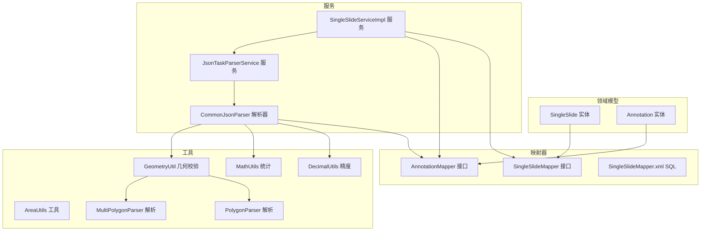
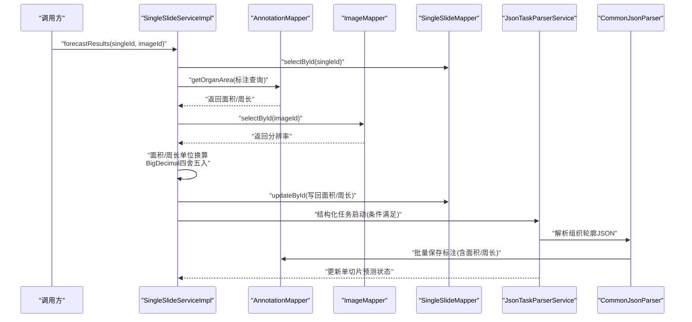
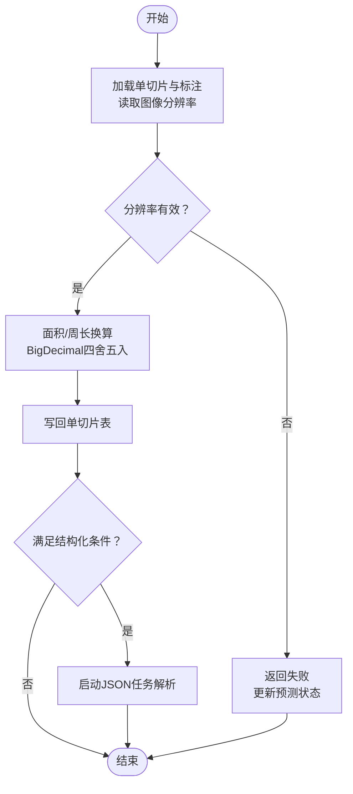
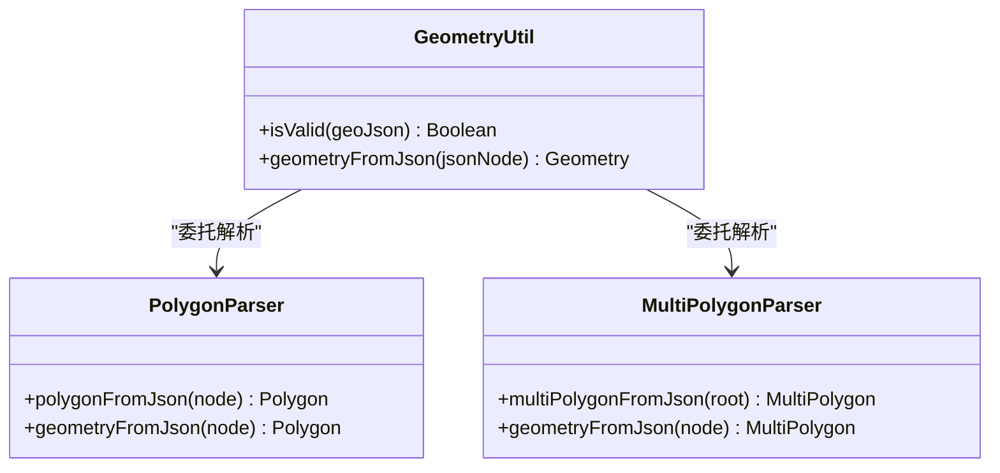
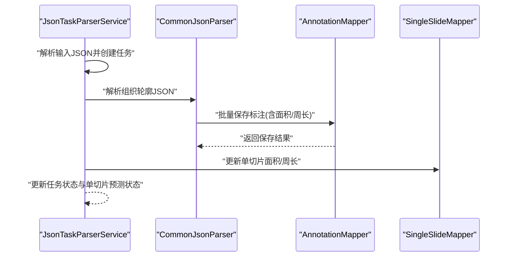
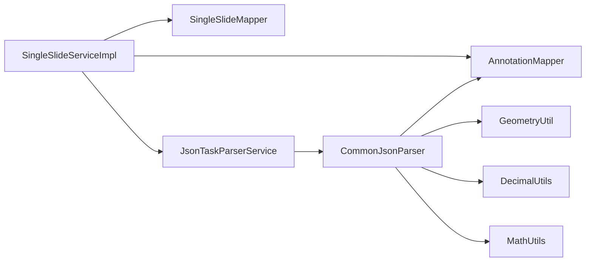

# 单切片处理模块

<cite>
**本文引用的文件**
- [SingleSlide.java](file://src/main/java/cn/staitech/fr/domain/SingleSlide.java)
- [SingleSlideMapper.java](file://src/main/java/cn/staitech/fr/mapper/SingleSlideMapper.java)
- [SingleSlideMapper.xml](file://src/main/resources/mapper/SingleSlideMapper.xml)
- [SingleSlideServiceImpl.java](file://src/main/java/cn/staitech/fr/service/impl/SingleSlideServiceImpl.java)
- [Annotation.java](file://src/main/java/cn/staitech/fr/domain/Annotation.java)
- [AnnotationMapper.java](file://src/main/java/cn/staitech/fr/mapper/AnnotationMapper.java)
- [JsonTaskParserService.java](file://src/main/java/cn/staitech/fr/service/strategy/json/JsonTaskParserService.java)
- [CommonJsonParser.java](file://src/main/java/cn/staitech/fr/service/strategy/json/CommonJsonParser.java)
- [AreaUtils.java](file://src/main/java/cn/staitech/fr/utils/AreaUtils.java)
- [GeometryUtil.java](file://src/main/java/cn/staitech/fr/utils/GeometryUtil.java)
- [PolygonParser.java](file://src/main/java/cn/staitech/fr/utils/geo/PolygonParser.java)
- [MultiPolygonParser.java](file://src/main/java/cn/staitech/fr/utils/geo/MultiPolygonParser.java)
- [DecimalUtils.java](file://src/main/java/cn/staitech/fr/utils/DecimalUtils.java)
- [MathUtils.java](file://src/main/java/cn/staitech/fr/utils/MathUtils.java)
</cite>

## 目录
1. [简介](#简介)
2. [项目结构](#项目结构)
3. [核心组件](#核心组件)
4. [架构总览](#架构总览)
5. [详细组件分析](#详细组件分析)
6. [依赖关系分析](#依赖关系分析)
7. [性能考量](#性能考量)
8. [故障排查指南](#故障排查指南)
9. [结论](#结论)
10. [附录](#附录)

## 简介
本文件面向“单切片处理模块”，系统性阐述单切片服务实现的核心算法与数据模型，覆盖面积与周长计算的数学原理、几何算法、精度控制机制，以及与JSON解析引擎的协作流程。文档同时给出数据模型字段定义、验证规则、业务约束、映射器的数据访问模式（CRUD、复杂查询与性能优化）、计算示例、边界条件处理、数值精度与异常处理策略，以及性能调优建议。

## 项目结构
单切片处理模块围绕以下层次展开：
- 领域模型层：单切片实体、标注实体
- 映射器层：MyBatis接口与XML映射，提供复杂查询与聚合统计
- 服务层：单切片服务与JSON任务解析服务，负责业务编排与算法调度
- 工具层：几何解析、面积换算、数值精度控制、统计分析

图表来源
- [SingleSlide.java:1-77](file://src/main/java/cn/staitech/fr/domain/SingleSlide.java#L1-L77)
- [Annotation.java:1-352](file://src/main/java/cn/staitech/fr/domain/Annotation.java#L1-L352)
- [SingleSlideMapper.java:1-66](file://src/main/java/cn/staitech/fr/mapper/SingleSlideMapper.java#L1-L66)
- [AnnotationMapper.java:1-137](file://src/main/java/cn/staitech/fr/mapper/AnnotationMapper.java#L1-L137)
- [SingleSlideMapper.xml:1-277](file://src/main/resources/mapper/SingleSlideMapper.xml#L1-L277)
- [SingleSlideServiceImpl.java:1-223](file://src/main/java/cn/staitech/fr/service/impl/SingleSlideServiceImpl.java#L1-L223)
- [JsonTaskParserService.java:1-760](file://src/main/java/cn/staitech/fr/service/strategy/json/JsonTaskParserService.java#L1-L760)
- [CommonJsonParser.java:1-800](file://src/main/java/cn/staitech/fr/service/strategy/json/CommonJsonParser.java#L1-L800)
- [AreaUtils.java:1-208](file://src/main/java/cn/staitech/fr/utils/AreaUtils.java#L1-L208)
- [GeometryUtil.java:1-76](file://src/main/java/cn/staitech/fr/utils/GeometryUtil.java#L1-L76)
- [PolygonParser.java:1-43](file://src/main/java/cn/staitech/fr/utils/geo/PolygonParser.java#L1-L43)
- [MultiPolygonParser.java:1-36](file://src/main/java/cn/staitech/fr/utils/geo/MultiPolygonParser.java#L1-L36)
- [DecimalUtils.java:1-28](file://src/main/java/cn/staitech/fr/utils/DecimalUtils.java#L1-L28)
- [MathUtils.java:1-360](file://src/main/java/cn/staitech/fr/utils/MathUtils.java#L1-L360)

章节来源
- [SingleSlide.java:1-77](file://src/main/java/cn/staitech/fr/domain/SingleSlide.java#L1-L77)
- [SingleSlideMapper.java:1-66](file://src/main/java/cn/staitech/fr/mapper/SingleSlideMapper.java#L1-L66)
- [SingleSlideMapper.xml:1-277](file://src/main/resources/mapper/SingleSlideMapper.xml#L1-L277)
- [SingleSlideServiceImpl.java:1-223](file://src/main/java/cn/staitech/fr/service/impl/SingleSlideServiceImpl.java#L1-L223)
- [Annotation.java:1-352](file://src/main/java/cn/staitech/fr/domain/Annotation.java#L1-L352)
- [AnnotationMapper.java:1-137](file://src/main/java/cn/staitech/fr/mapper/AnnotationMapper.java#L1-L137)
- [JsonTaskParserService.java:1-760](file://src/main/java/cn/staitech/fr/service/strategy/json/JsonTaskParserService.java#L1-L760)
- [CommonJsonParser.java:1-800](file://src/main/java/cn/staitech/fr/service/strategy/json/CommonJsonParser.java#L1-L800)
- [AreaUtils.java:1-208](file://src/main/java/cn/staitech/fr/utils/AreaUtils.java#L1-L208)
- [GeometryUtil.java:1-76](file://src/main/java/cn/staitech/fr/utils/GeometryUtil.java#L1-L76)
- [PolygonParser.java:1-43](file://src/main/java/cn/staitech/fr/utils/geo/PolygonParser.java#L1-L43)
- [MultiPolygonParser.java:1-36](file://src/main/java/cn/staitech/fr/utils/geo/MultiPolygonParser.java#L1-L36)
- [DecimalUtils.java:1-28](file://src/main/java/cn/staitech/fr/utils/DecimalUtils.java#L1-L28)
- [MathUtils.java:1-360](file://src/main/java/cn/staitech/fr/utils/MathUtils.java#L1-L360)

## 核心组件
- 单切片实体：承载单切片的面积、周长、预测状态、异常状态等字段，提供与数据库表的映射。
- 单切片映射器：提供复杂查询（如范围输出、参考范围、导出信息等）与统计聚合。
- 单切片服务：负责面积与周长的物理单位换算、状态更新、与JSON任务解析的联动。
- 标注映射器：提供面积与周长的几何计算入口，支持合并几何、有效性校验与面积/周长提取。
- JSON解析服务：接收JSON任务，驱动解析器进行几何解析、指标计算与结果落库。
- 几何工具：基于JTS/GeoJSON解析几何对象，提供有效性校验与几何构造。
- 数值工具：统一精度控制（四舍五入、保留小数位、百分比转换）与统计分析（均值、方差、标准差、置信区间）。

章节来源
- [SingleSlide.java:1-77](file://src/main/java/cn/staitech/fr/domain/SingleSlide.java#L1-L77)
- [SingleSlideMapper.java:1-66](file://src/main/java/cn/staitech/fr/mapper/SingleSlideMapper.java#L1-L66)
- [SingleSlideServiceImpl.java:1-223](file://src/main/java/cn/staitech/fr/service/impl/SingleSlideServiceImpl.java#L1-L223)
- [AnnotationMapper.java:1-137](file://src/main/java/cn/staitech/fr/mapper/AnnotationMapper.java#L1-L137)
- [JsonTaskParserService.java:1-760](file://src/main/java/cn/staitech/fr/service/strategy/json/JsonTaskParserService.java#L1-L760)
- [GeometryUtil.java:1-76](file://src/main/java/cn/staitech/fr/utils/GeometryUtil.java#L1-L76)
- [DecimalUtils.java:1-28](file://src/main/java/cn/staitech/fr/utils/DecimalUtils.java#L1-L28)
- [MathUtils.java:1-360](file://src/main/java/cn/staitech/fr/utils/MathUtils.java#L1-L360)

## 架构总览
单切片处理模块的关键流程：
- 单切片服务触发面积与周长计算，读取标注几何与图像分辨率，进行单位换算并回写单切片表。
- 当满足条件时，异步启动JSON任务解析，解析组织轮廓几何，计算面积与周长并写入标注表。
- 解析完成后，进行指标计算与结果落库，最终更新单切片预测状态。

图表来源
- [SingleSlideServiceImpl.java:64-138](file://src/main/java/cn/staitech/fr/service/impl/SingleSlideServiceImpl.java#L64-L138)
- [JsonTaskParserService.java:265-452](file://src/main/java/cn/staitech/fr/service/strategy/json/JsonTaskParserService.java#L265-L452)
- [CommonJsonParser.java:209-297](file://src/main/java/cn/staitech/fr/service/strategy/json/CommonJsonParser.java#L209-L297)

## 详细组件分析

### 数据模型与字段定义
- 单切片实体字段要点
  - 标识与关联：单切片ID、切片ID、缩略图URL、类别ID
  - 预测与诊断：预测状态、人工诊断状态、异常状态及创建人、创建时间
  - 几何结果：精细轮廓总面积、总周长、精细轮廓分析状态、结构化总时间、AI开始时间
  - 辅助字段：筛查差异状态
- 字段验证与业务约束
  - 分辨率缺失时，面积/周长计算流程短路返回
  - 面积/周长为空或无效时，流程返回失败并更新预测状态
  - 特定脏器（如甲状旁腺、甲状腺）采用特殊聚合策略

章节来源
- [SingleSlide.java:18-76](file://src/main/java/cn/staitech/fr/domain/SingleSlide.java#L18-L76)
- [SingleSlideServiceImpl.java:64-138](file://src/main/java/cn/staitech/fr/service/impl/SingleSlideServiceImpl.java#L64-L138)

### 面积与周长计算算法
- 数学原理
  - 面积换算：像素面积 × (分辨率X)^2 × 1e-6 → mm²
  - 周长换算：像素周长 × 分辨率X × 1e-3 → mm
- 精度控制
  - 使用高精度十进制（BigDecimal）进行换算
  - 四舍五入至9位小数，确保一致性与可比较性
- 边界条件
  - 分辨率为null或缺失时，直接返回失败
  - 面积/周长为空或无效时，返回失败并更新预测状态
  - 甲状旁腺与甲状腺采用不同聚合策略（合并几何或特定聚合）

图表来源
- [SingleSlideServiceImpl.java:64-138](file://src/main/java/cn/staitech/fr/service/impl/SingleSlideServiceImpl.java#L64-L138)
- [SingleSlideServiceImpl.java:147-223](file://src/main/java/cn/staitech/fr/service/impl/SingleSlideServiceImpl.java#L147-L223)

章节来源
- [SingleSlideServiceImpl.java:64-138](file://src/main/java/cn/staitech/fr/service/impl/SingleSlideServiceImpl.java#L64-L138)
- [SingleSlideServiceImpl.java:147-223](file://src/main/java/cn/staitech/fr/service/impl/SingleSlideServiceImpl.java#L147-L223)

### 几何算法与有效性校验
- 几何解析
  - 基于GeoJSON解析Polygon与MultiPolygon，生成JTS几何对象
  - 提供有效性校验（isValid）与修复（makeValid）流程
- 标注几何聚合
  - 合并几何、有效性校验、面积/周长提取
  - 支持内外轮廓组合与动态数据附加

图表来源
- [GeometryUtil.java:22-72](file://src/main/java/cn/staitech/fr/utils/GeometryUtil.java#L22-L72)
- [PolygonParser.java:19-41](file://src/main/java/cn/staitech/fr/utils/geo/PolygonParser.java#L19-L41)
- [MultiPolygonParser.java:19-34](file://src/main/java/cn/staitech/fr/utils/geo/MultiPolygonParser.java#L19-L34)

章节来源
- [GeometryUtil.java:1-76](file://src/main/java/cn/staitech/fr/utils/GeometryUtil.java#L1-L76)
- [PolygonParser.java:1-43](file://src/main/java/cn/staitech/fr/utils/geo/PolygonParser.java#L1-L43)
- [MultiPolygonParser.java:1-36](file://src/main/java/cn/staitech/fr/utils/geo/MultiPolygonParser.java#L1-L36)

### 单切片映射器的数据访问模式
- 复杂查询
  - 范围输出、参考范围查询、性别标识查询、导出信息查询、分类计数等
- 统计聚合
  - 组织数量统计、单切片明细查询、结构化状态统计
- 性能优化
  - 读写分离（@DS注解）与参数化SQL，避免全表扫描
  - 条件拼接与索引友好（如按special_id/group_code/category_id过滤）

章节来源
- [SingleSlideMapper.java:19-61](file://src/main/java/cn/staitech/fr/mapper/SingleSlideMapper.java#L19-L61)
- [SingleSlideMapper.xml:7-51](file://src/main/resources/mapper/SingleSlideMapper.xml#L7-L51)
- [SingleSlideMapper.xml:113-147](file://src/main/resources/mapper/SingleSlideMapper.xml#L113-L147)
- [SingleSlideMapper.xml:196-231](file://src/main/resources/mapper/SingleSlideMapper.xml#L196-L231)
- [SingleSlideMapper.xml:232-275](file://src/main/resources/mapper/SingleSlideMapper.xml#L232-L275)

### 与JSON解析引擎的协作
- 任务输入与状态管理
  - 解析输入JSON，构建JsonTask并维护状态（未解析/解析中/成功/失败）
- 组织轮廓解析
  - 特殊结构（如组织轮廓）直接解析并写入标注表，随后更新单切片面积/周长
- 指标计算与落库
  - 删除旧指标、计算新指标、批量写入标注数据

图表来源
- [JsonTaskParserService.java:174-263](file://src/main/java/cn/staitech/fr/service/strategy/json/JsonTaskParserService.java#L174-L263)
- [JsonTaskParserService.java:265-452](file://src/main/java/cn/staitech/fr/service/strategy/json/JsonTaskParserService.java#L265-L452)
- [CommonJsonParser.java:209-297](file://src/main/java/cn/staitech/fr/service/strategy/json/CommonJsonParser.java#L209-L297)

章节来源
- [JsonTaskParserService.java:1-760](file://src/main/java/cn/staitech/fr/service/strategy/json/JsonTaskParserService.java#L1-L760)
- [CommonJsonParser.java:1-800](file://src/main/java/cn/staitech/fr/service/strategy/json/CommonJsonParser.java#L1-L800)

### 数值精度与异常处理
- 精度控制
  - BigDecimal统一四舍五入至9位小数，保证跨模块一致性
  - 提供百分比转换与单位换算工具（平方毫米↔平方微米等）
- 异常处理
  - 分辨率缺失、面积/周长为空、几何无效等情况均返回失败并更新预测状态
  - 任务解析异常捕获并记录，避免影响整体流程

章节来源
- [SingleSlideServiceImpl.java:102-110](file://src/main/java/cn/staitech/fr/service/impl/SingleSlideServiceImpl.java#L102-L110)
- [DecimalUtils.java:13-25](file://src/main/java/cn/staitech/fr/utils/DecimalUtils.java#L13-L25)
- [AreaUtils.java:59-114](file://src/main/java/cn/staitech/fr/utils/AreaUtils.java#L59-L114)
- [MathUtils.java:113-157](file://src/main/java/cn/staitech/fr/utils/MathUtils.java#L113-L157)

## 依赖关系分析
- 单切片服务依赖映射器与JSON解析服务，形成“计算—解析—落库”的闭环
- JSON解析服务依赖解析器与标注映射器，负责几何解析与指标计算
- 几何工具与数值工具贯穿解析与计算阶段，提供基础能力支撑

图表来源
- [SingleSlideServiceImpl.java:1-223](file://src/main/java/cn/staitech/fr/service/impl/SingleSlideServiceImpl.java#L1-L223)
- [JsonTaskParserService.java:1-760](file://src/main/java/cn/staitech/fr/service/strategy/json/JsonTaskParserService.java#L1-L760)
- [CommonJsonParser.java:1-800](file://src/main/java/cn/staitech/fr/service/strategy/json/CommonJsonParser.java#L1-L800)
- [GeometryUtil.java:1-76](file://src/main/java/cn/staitech/fr/utils/GeometryUtil.java#L1-L76)
- [DecimalUtils.java:1-28](file://src/main/java/cn/staitech/fr/utils/DecimalUtils.java#L1-L28)
- [MathUtils.java:1-360](file://src/main/java/cn/staitech/fr/utils/MathUtils.java#L1-L360)

章节来源
- [SingleSlideServiceImpl.java:1-223](file://src/main/java/cn/staitech/fr/service/impl/SingleSlideServiceImpl.java#L1-L223)
- [JsonTaskParserService.java:1-760](file://src/main/java/cn/staitech/fr/service/strategy/json/JsonTaskParserService.java#L1-L760)
- [CommonJsonParser.java:1-800](file://src/main/java/cn/staitech/fr/service/strategy/json/CommonJsonParser.java#L1-L800)

## 性能考量
- 线程池与异步
  - 单切片服务使用有界阻塞队列与丢弃策略的线程池，限制并发风险
  - JSON解析服务通过TTL包装线程池传递上下文，保障分布式追踪
- 批量处理
  - JSON解析采用分批读取与并行处理，减少内存压力与IO开销
- 数据库优化
  - 使用读写分离与参数化SQL，避免全表扫描
  - 条件查询尽量使用索引字段（special_id、group_code、category_id等）

章节来源
- [SingleSlideServiceImpl.java:40-43](file://src/main/java/cn/staitech/fr/service/impl/SingleSlideServiceImpl.java#L40-L43)
- [JsonTaskParserService.java:94-107](file://src/main/java/cn/staitech/fr/service/strategy/json/JsonTaskParserService.java#L94-L107)
- [CommonJsonParser.java:234-297](file://src/main/java/cn/staitech/fr/service/strategy/json/CommonJsonParser.java#L234-L297)
- [SingleSlideMapper.xml:7-51](file://src/main/resources/mapper/SingleSlideMapper.xml#L7-L51)

## 故障排查指南
- 常见问题
  - 分辨率缺失：检查图像表分辨率字段是否正确导入
  - 面积/周长为空：检查标注几何是否有效，必要时进行有效性修复
  - 任务状态异常：查看JsonTask状态机，定位解析失败节点
- 日志与追踪
  - 关注单切片服务与JSON解析服务的日志，定位异常点
  - 使用MDC记录指标元数据文件路径，便于溯源

章节来源
- [SingleSlideServiceImpl.java:132-137](file://src/main/java/cn/staitech/fr/service/impl/SingleSlideServiceImpl.java#L132-L137)
- [JsonTaskParserService.java:259-262](file://src/main/java/cn/staitech/fr/service/strategy/json/JsonTaskParserService.java#L259-L262)
- [MathUtils.java:257-294](file://src/main/java/cn/staitech/fr/utils/MathUtils.java#L257-L294)

## 结论
单切片处理模块通过严谨的几何解析、高精度数值计算与完善的异常处理机制，实现了从原始几何到结构化指标的可靠转化。模块采用异步与批量策略提升吞吐，结合读写分离与参数化SQL保障性能。建议在生产环境中持续监控任务状态与指标稳定性，定期评估分辨率与几何有效性，确保结果的准确性与一致性。

## 附录
- 计算示例（示意）
  - 面积：像素面积 × (分辨率X)^2 × 1e-6 → mm²（保留9位小数）
  - 周长：像素周长 × 分辨率X × 1e-3 → mm（保留9位小数）
- 边界条件
  - 分辨率为null或缺失：直接返回失败
  - 面积/周长为空或无效：返回失败并更新预测状态
  - 特定脏器（甲状旁腺/甲状腺）采用专用聚合策略

章节来源
- [SingleSlideServiceImpl.java:102-110](file://src/main/java/cn/staitech/fr/service/impl/SingleSlideServiceImpl.java#L102-L110)
- [CommonJsonParser.java:319-335](file://src/main/java/cn/staitech/fr/service/strategy/json/CommonJsonParser.java#L319-L335)
- [AreaUtils.java:59-114](file://src/main/java/cn/staitech/fr/utils/AreaUtils.java#L59-L114)