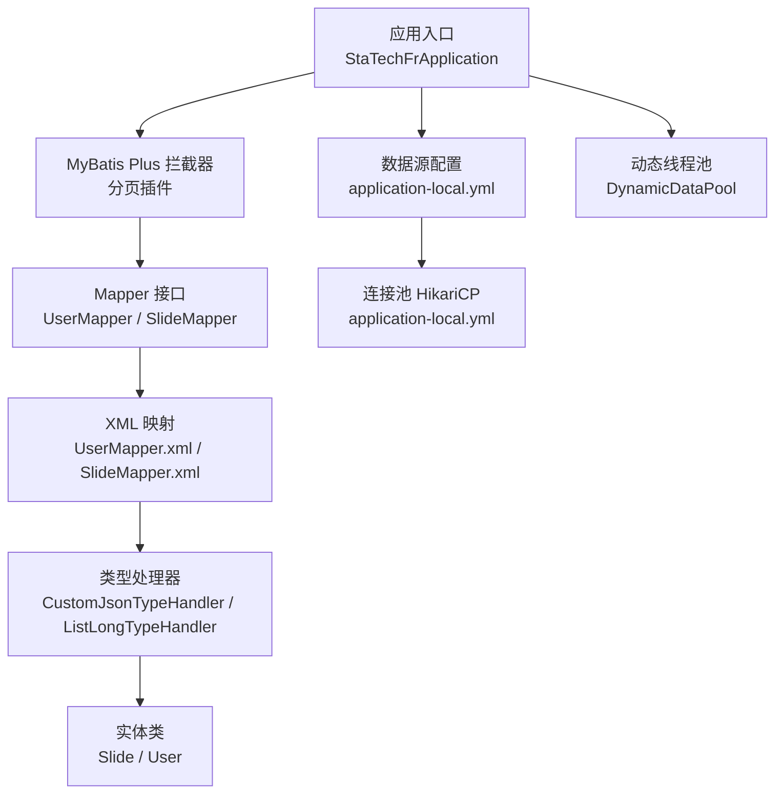
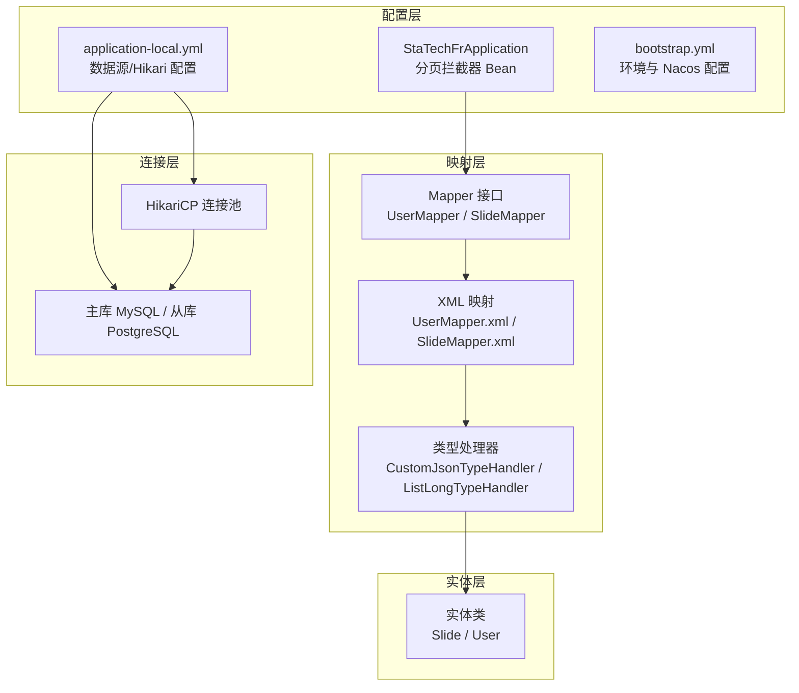
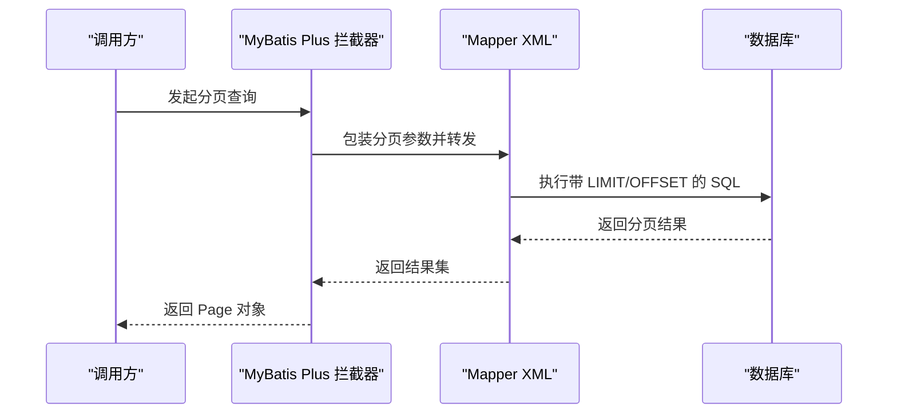
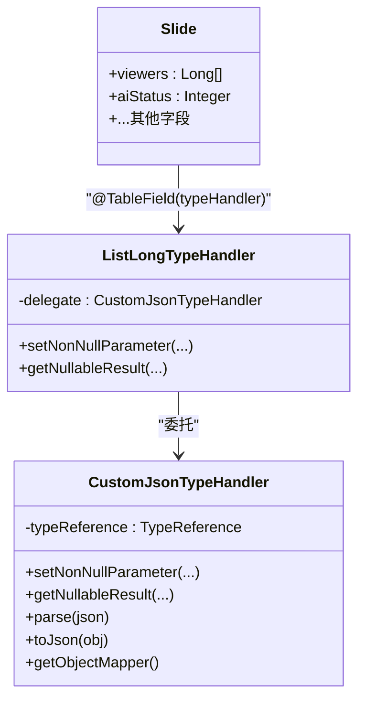
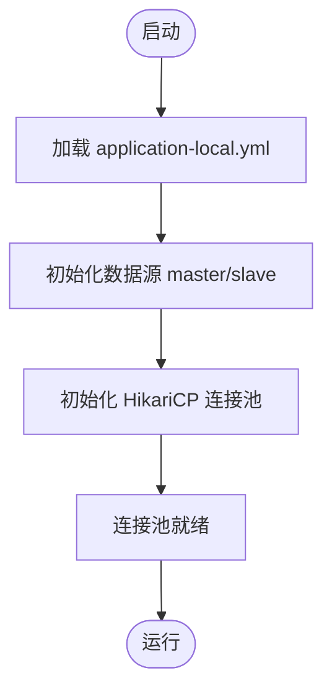
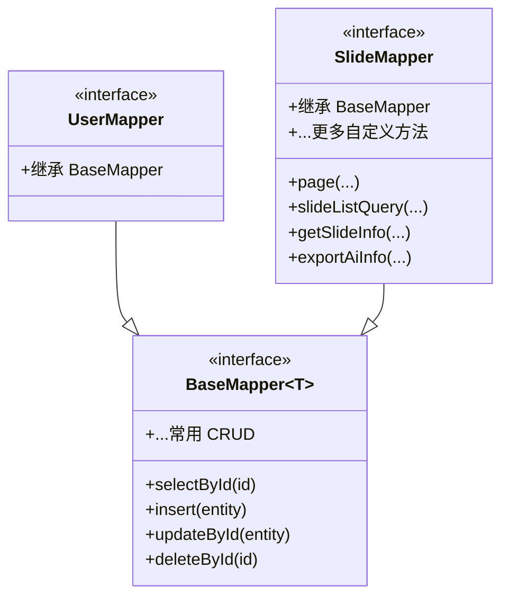
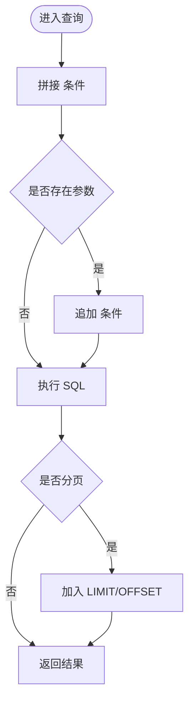
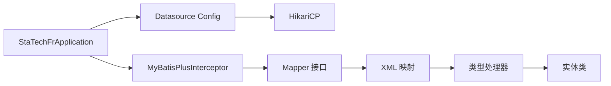

# 数据库管理模块

<cite>
**本文引用的文件**
- [StaTechFrApplication.java](file://src/main/java/cn/staitech/fr/StaTechFrApplication.java)
- [application-local.yml](file://src/main/resources/application-local.yml)
- [bootstrap.yml](file://src/main/resources/bootstrap.yml)
- [CustomJsonTypeHandler.java](file://src/main/java/cn/staitech/fr/mapper/handler/CustomJsonTypeHandler.java)
- [ListLongTypeHandler.java](file://src/main/java/cn/staitech/fr/mapper/handler/ListLongTypeHandler.java)
- [UserMapper.java](file://src/main/java/cn/staitech/fr/mapper/UserMapper.java)
- [SlideMapper.java](file://src/main/java/cn/staitech/fr/mapper/SlideMapper.java)
- [UserMapper.xml](file://src/main/resources/mapper/UserMapper.xml)
- [SlideMapper.xml](file://src/main/resources/mapper/SlideMapper.xml)
- [Slide.java](file://src/main/java/cn/staitech/fr/domain/Slide.java)
- [User.java](file://src/main/java/cn/staitech/fr/domain/User.java)
- [DynamicDataPool.java](file://src/main/java/cn/staitech/fr/config/DynamicDataPool.java)
</cite>

## 目录
1. [简介](#简介)
2. [项目结构](#项目结构)
3. [核心组件](#核心组件)
4. [架构总览](#架构总览)
5. [详细组件分析](#详细组件分析)
6. [依赖分析](#依赖分析)
7. [性能考虑](#性能考虑)
8. [故障排查指南](#故障排查指南)
9. [结论](#结论)
10. [附录](#附录)

## 简介
本技术文档聚焦于数据库管理模块，围绕 MyBatis Plus 的配置与使用模式展开，涵盖分页插件、类型处理器、数据源配置与多数据源/读写分离实践；系统性梳理 Mapper 接口设计原则（CRUD、复杂查询、批量处理）、SQL 映射示例与查询优化技巧，并给出事务管理策略、连接池配置、最佳实践、性能监控与故障排查建议。

## 项目结构
数据库管理模块位于 Java 工程的 data access 层，主要由以下部分组成：
- 应用入口与 MyBatis Plus 分页拦截器配置
- 数据源与连接池配置（本地环境）
- 类型处理器（JSON、列表类型）
- Mapper 接口与 XML 映射
- 实体类与字段映射
- 动态线程池（与数据访问相关的异步处理）

图表来源
- [StaTechFrApplication.java:54-60](file://src/main/java/cn/staitech/fr/StaTechFrApplication.java#L54-L60)
- [application-local.yml:15-56](file://src/main/resources/application-local.yml#L15-L56)
- [UserMapper.java:1-19](file://src/main/java/cn/staitech/fr/mapper/UserMapper.java#L1-L19)
- [SlideMapper.java:1-56](file://src/main/java/cn/staitech/fr/mapper/SlideMapper.java#L1-L56)
- [UserMapper.xml:1-38](file://src/main/resources/mapper/UserMapper.xml#L1-L38)
- [SlideMapper.xml:1-641](file://src/main/resources/mapper/SlideMapper.xml#L1-L641)
- [CustomJsonTypeHandler.java:1-102](file://src/main/java/cn/staitech/fr/mapper/handler/CustomJsonTypeHandler.java#L1-L102)
- [ListLongTypeHandler.java:1-45](file://src/main/java/cn/staitech/fr/mapper/handler/ListLongTypeHandler.java#L1-L45)
- [Slide.java:84](file://src/main/java/cn/staitech/fr/domain/Slide.java#L84)
- [DynamicDataPool.java:1-231](file://src/main/java/cn/staitech/fr/config/DynamicDataPool.java#L1-L231)

章节来源
- [StaTechFrApplication.java:37-60](file://src/main/java/cn/staitech/fr/StaTechFrApplication.java#L37-L60)
- [application-local.yml:15-83](file://src/main/resources/application-local.yml#L15-L83)
- [bootstrap.yml:1-48](file://src/main/resources/bootstrap.yml#L1-L48)

## 核心组件
- MyBatis Plus 分页插件：在应用入口通过拦截器 Bean 注册分页能力，统一支持物理分页。
- 类型处理器：提供通用 JSON 类型处理器与列表 Long 类型处理器，用于 JSON 字段与集合字段的序列化/反序列化。
- 数据源与连接池：本地配置了主库 MySQL 与从库 PostgreSQL，采用 HikariCP 连接池，开启连接测试与 JMX 指标暴露。
- Mapper 接口与 XML：基于 BaseMapper 提供 CRUD，结合 XML 定义复杂查询、条件拼装与结果映射。
- 实体类：通过注解映射表字段与类型处理器，确保 JSON/集合字段正确持久化与读取。
- 动态线程池：为高并发场景提供可配置的线程池，辅助数据访问层的异步处理。

章节来源
- [StaTechFrApplication.java:54-60](file://src/main/java/cn/staitech/fr/StaTechFrApplication.java#L54-L60)
- [CustomJsonTypeHandler.java:25-101](file://src/main/java/cn/staitech/fr/mapper/handler/CustomJsonTypeHandler.java#L25-L101)
- [ListLongTypeHandler.java:21-44](file://src/main/java/cn/staitech/fr/mapper/handler/ListLongTypeHandler.java#L21-L44)
- [application-local.yml:15-56](file://src/main/resources/application-local.yml#L15-L56)
- [UserMapper.java:12-14](file://src/main/java/cn/staitech/fr/mapper/UserMapper.java#L12-L14)
- [SlideMapper.java:17-51](file://src/main/java/cn/staitech/fr/mapper/SlideMapper.java#L17-L51)
- [Slide.java:84](file://src/main/java/cn/staitech/fr/domain/Slide.java#L84)

## 架构总览
数据库管理模块遵循“配置—拦截—映射—实体—连接池”的分层架构，MyBatis Plus 在 DAO 层之上提供分页、批量等增强能力；类型处理器负责复杂字段的序列化；数据源配置支持主从切换与读写分离；Mapper 与 XML 负责 SQL 映射与复杂查询；实体类承载字段映射与类型处理器绑定。

图表来源
- [StaTechFrApplication.java:54-60](file://src/main/java/cn/staitech/fr/StaTechFrApplication.java#L54-L60)
- [application-local.yml:15-56](file://src/main/resources/application-local.yml#L15-L56)
- [bootstrap.yml:23-46](file://src/main/resources/bootstrap.yml#L23-L46)
- [UserMapper.java:12-14](file://src/main/java/cn/staitech/fr/mapper/UserMapper.java#L12-L14)
- [SlideMapper.java:17-51](file://src/main/java/cn/staitech/fr/mapper/SlideMapper.java#L17-L51)
- [UserMapper.xml:5-38](file://src/main/resources/mapper/UserMapper.xml#L5-L38)
- [SlideMapper.xml:5-76](file://src/main/resources/mapper/SlideMapper.xml#L5-L76)
- [CustomJsonTypeHandler.java:25-101](file://src/main/java/cn/staitech/fr/mapper/handler/CustomJsonTypeHandler.java#L25-L101)
- [ListLongTypeHandler.java:21-44](file://src/main/java/cn/staitech/fr/mapper/handler/ListLongTypeHandler.java#L21-L44)
- [Slide.java:84](file://src/main/java/cn/staitech/fr/domain/Slide.java#L84)

## 详细组件分析

### MyBatis Plus 分页插件
- 配置方式：在应用入口注册 MybatisPlusInterceptor 并添加 PaginationInnerInterceptor。
- 作用范围：全局生效，所有分页查询自动走物理分页。
- 使用建议：与 Page 对象配合，避免全量加载；结合 XML 的 SQL 片段与条件标签进行高效分页查询。

图表来源
- [StaTechFrApplication.java:54-60](file://src/main/java/cn/staitech/fr/StaTechFrApplication.java#L54-L60)
- [SlideMapper.xml:178-181](file://src/main/resources/mapper/SlideMapper.xml#L178-L181)

章节来源
- [StaTechFrApplication.java:54-60](file://src/main/java/cn/staitech/fr/StaTechFrApplication.java#L54-L60)

### 类型处理器：JSON 与列表类型
- CustomJsonTypeHandler：基于 MyBatis 的抽象 JSON 处理器，支持泛型类型引用，提供序列化/反序列化与 JDBC 参数设置。
- ListLongTypeHandler：委托 CustomJsonTypeHandler，专门处理 List<Long> JSON 字段。
- 实体绑定：通过 @TableField(typeHandler = ...) 将实体字段与类型处理器关联，确保 JSON 字段正确持久化与读取。

图表来源
- [CustomJsonTypeHandler.java:25-101](file://src/main/java/cn/staitech/fr/mapper/handler/CustomJsonTypeHandler.java#L25-L101)
- [ListLongTypeHandler.java:21-44](file://src/main/java/cn/staitech/fr/mapper/handler/ListLongTypeHandler.java#L21-L44)
- [Slide.java:84](file://src/main/java/cn/staitech/fr/domain/Slide.java#L84)

章节来源
- [CustomJsonTypeHandler.java:25-101](file://src/main/java/cn/staitech/fr/mapper/handler/CustomJsonTypeHandler.java#L25-L101)
- [ListLongTypeHandler.java:21-44](file://src/main/java/cn/staitech/fr/mapper/handler/ListLongTypeHandler.java#L21-L44)
- [SlideMapper.xml:41-42](file://src/main/resources/mapper/SlideMapper.xml#L41-L42)
- [Slide.java:84](file://src/main/java/cn/staitech/fr/domain/Slide.java#L84)

### 数据源与连接池配置
- 多数据源：配置了 master（MySQL）与 slave（PostgreSQL），并指定 primary 为主库。
- 连接池：HikariCP，启用连接测试查询、JMX 指标、最小空闲、最大生命周期、连接超时等参数。
- 日志：MyBatis 输出 SQL 日志，便于调试与性能分析。

图表来源
- [application-local.yml:15-56](file://src/main/resources/application-local.yml#L15-L56)
- [application-local.yml:75-83](file://src/main/resources/application-local.yml#L75-L83)

章节来源
- [application-local.yml:15-56](file://src/main/resources/application-local.yml#L15-L56)
- [application-local.yml:75-83](file://src/main/resources/application-local.yml#L75-L83)

### Mapper 接口设计原则
- 继承 BaseMapper：获得标准 CRUD 能力，减少重复 SQL。
- 自定义方法：针对复杂查询与分页，定义带 @Param 的方法并在 XML 中实现。
- 复杂查询：利用 XML 条件标签（如 <where>/<if>/<trim>/<foreach>）构建动态 SQL。
- 批量处理：通过 XML 的 <insert>/<update> 批量语句或 MyBatis Plus 的批量方法提升效率。

图表来源
- [UserMapper.java:12-14](file://src/main/java/cn/staitech/fr/mapper/UserMapper.java#L12-L14)
- [SlideMapper.java:17-51](file://src/main/java/cn/staitech/fr/mapper/SlideMapper.java#L17-L51)

章节来源
- [UserMapper.java:12-14](file://src/main/java/cn/staitech/fr/mapper/UserMapper.java#L12-L14)
- [SlideMapper.java:17-51](file://src/main/java/cn/staitech/fr/mapper/SlideMapper.java#L17-L51)

### SQL 映射示例与查询优化
- UserMapper.xml：定义用户表字段映射与基础列清单，便于复用。
- SlideMapper.xml：包含复杂查询（分页、条件过滤、动态排序、IN 查询、JSON 字段映射等），并使用 typeHandler 指定 List<Long> 的解析。
- 查询优化要点：
  - 使用 <where>/<if> 动态拼接条件，避免硬编码。
  - 对高频过滤字段建立索引（如特殊项目 ID、蜡块编号、动物编号）。
  - 分页查询使用物理分页，避免一次性加载大量数据。
  - 使用 <foreach> 时注意参数集合大小，必要时拆分批次。
  - JSON 字段尽量只在必要时读取，避免大字段频繁传输。

图表来源
- [SlideMapper.xml:112-171](file://src/main/resources/mapper/SlideMapper.xml#L112-L171)
- [SlideMapper.xml:178-181](file://src/main/resources/mapper/SlideMapper.xml#L178-L181)

章节来源
- [UserMapper.xml:5-38](file://src/main/resources/mapper/UserMapper.xml#L5-L38)
- [SlideMapper.xml:5-76](file://src/main/resources/mapper/SlideMapper.xml#L5-L76)
- [SlideMapper.xml:112-171](file://src/main/resources/mapper/SlideMapper.xml#L112-L171)
- [SlideMapper.xml:178-181](file://src/main/resources/mapper/SlideMapper.xml#L178-L181)

### 事务管理策略
- 启用事务：应用入口启用 @EnableTransactionManagement，确保声明式事务可用。
- 建议：
  - 对跨表写入、批量更新等操作使用 @Transactional。
  - 控制事务边界，避免长事务占用连接资源。
  - 对只读查询可设置只读事务以降低锁竞争。

章节来源
- [StaTechFrApplication.java:20](file://src/main/java/cn/staitech/fr/StaTechFrApplication.java#L20)

### 多数据源与读写分离
- 当前配置：master（MySQL）与 slave（PostgreSQL）双数据源，primary 指向 master。
- 实践建议：
  - 使用注解或路由策略区分读写库（例如基于方法名或注解）。
  - 读库采用只读连接，写库承担写入与变更。
  - 注意数据一致性窗口与延迟问题，必要时在关键流程中强制走主库。

章节来源
- [application-local.yml:15-56](file://src/main/resources/application-local.yml#L15-L56)

### 动态线程池与数据访问协同
- DynamicDataPool：提供多个线程池 Bean，用于异步任务、切片文件处理与识别任务，具备拒绝策略与优雅关闭。
- 与数据访问协同：在高并发场景下，将耗时的 IO 或计算任务放入线程池，避免阻塞数据库连接池。

章节来源
- [DynamicDataPool.java:29-64](file://src/main/java/cn/staitech/fr/config/DynamicDataPool.java#L29-L64)
- [DynamicDataPool.java:121-150](file://src/main/java/cn/staitech/fr/config/DynamicDataPool.java#L121-L150)
- [DynamicDataPool.java:177-230](file://src/main/java/cn/staitech/fr/config/DynamicDataPool.java#L177-L230)

## 依赖分析
- 组件耦合：
  - Mapper 依赖 XML 映射与类型处理器。
  - 实体类通过注解绑定类型处理器，影响序列化/反序列化行为。
  - 应用入口提供分页拦截器，影响所有分页查询。
  - 数据源配置决定连接池与主从库选择。
- 外部依赖：
  - MyBatis Plus、HikariCP、Jackson（类型处理器内部使用）。

图表来源
- [StaTechFrApplication.java:54-60](file://src/main/java/cn/staitech/fr/StaTechFrApplication.java#L54-L60)
- [application-local.yml:15-56](file://src/main/resources/application-local.yml#L15-L56)
- [SlideMapper.xml:5-76](file://src/main/resources/mapper/SlideMapper.xml#L5-L76)
- [CustomJsonTypeHandler.java:25-101](file://src/main/java/cn/staitech/fr/mapper/handler/CustomJsonTypeHandler.java#L25-L101)
- [Slide.java:84](file://src/main/java/cn/staitech/fr/domain/Slide.java#L84)

章节来源
- [StaTechFrApplication.java:54-60](file://src/main/java/cn/staitech/fr/StaTechFrApplication.java#L54-L60)
- [application-local.yml:15-56](file://src/main/resources/application-local.yml#L15-L56)
- [SlideMapper.xml:5-76](file://src/main/resources/mapper/SlideMapper.xml#L5-L76)
- [CustomJsonTypeHandler.java:25-101](file://src/main/java/cn/staitech/fr/mapper/handler/CustomJsonTypeHandler.java#L25-L101)
- [Slide.java:84](file://src/main/java/cn/staitech/fr/domain/Slide.java#L84)

## 性能考虑
- 连接池参数：
  - 合理设置最大池大小、最小空闲、空闲超时与生命周期，避免连接抖动。
  - 启用连接测试查询与 JMX 指标，监控连接池健康度。
- SQL 优化：
  - 使用索引覆盖常见过滤字段（项目 ID、蜡块编号、动物编号、性别、创建时间）。
  - 分页查询避免排序字段过大或不可索引。
  - 减少不必要的 JSON 字段读取与传输。
- 类型处理器：
  - ObjectMapper 单例化可减少开销；避免在热路径频繁创建实例。
- 线程池：
  - IO 密集型任务使用有界队列与快速失败策略，防止 OOM。
  - 低并发策略避免过度占用 CPU。

[本节为通用指导，不直接分析具体文件]

## 故障排查指南
- SQL 日志：
  - MyBatis 配置了日志实现，可通过日志查看实际执行 SQL，定位参数与慢查询。
- 连接池问题：
  - 关注连接池指标（活跃连接、等待队列长度、拒绝次数），结合拒绝策略日志定位瓶颈。
- JSON/集合字段异常：
  - 检查类型处理器是否正确绑定至实体字段；确认 JSON 内容格式与类型引用匹配。
- 多数据源：
  - 确认当前请求使用的数据源是否为主库或从库；关注读写延迟与一致性问题。

章节来源
- [application-local.yml:75-83](file://src/main/resources/application-local.yml#L75-L83)
- [DynamicDataPool.java:101-115](file://src/main/java/cn/staitech/fr/config/DynamicDataPool.java#L101-L115)
- [SlideMapper.xml:41-42](file://src/main/resources/mapper/SlideMapper.xml#L41-L42)
- [Slide.java:84](file://src/main/java/cn/staitech/fr/domain/Slide.java#L84)

## 结论
本模块通过 MyBatis Plus 分页拦截器、类型处理器与多数据源配置，构建了稳定高效的数据库访问层。结合 XML 动态 SQL 与合理的连接池参数，可在保证功能完整性的同时兼顾性能与可维护性。建议持续完善索引策略、事务边界控制与监控告警，以支撑高并发与复杂业务场景。

[本节为总结性内容，不直接分析具体文件]

## 附录
- 关键配置项参考：
  - 数据源：主库/从库 URL、用户名、密码、驱动类名、连接池类型。
  - HikariCP：最大池大小、最小空闲、空闲超时、最大生命周期、连接超时、验证超时、连接测试查询、JMX 指标。
  - MyBatis：类型别名包、Mapper 扫描路径、日志实现。
- 环境配置：bootstrap.yml 中的 Nacos 服务发现与配置中心参数。

章节来源
- [application-local.yml:15-56](file://src/main/resources/application-local.yml#L15-L56)
- [application-local.yml:75-83](file://src/main/resources/application-local.yml#L75-L83)
- [bootstrap.yml:23-46](file://src/main/resources/bootstrap.yml#L23-L46)