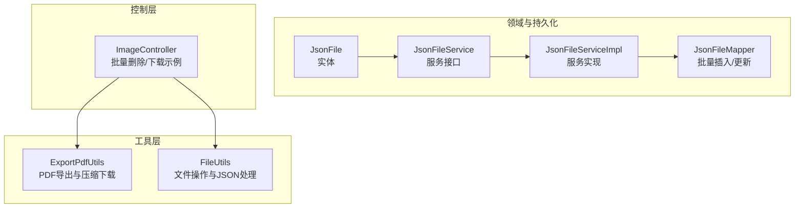
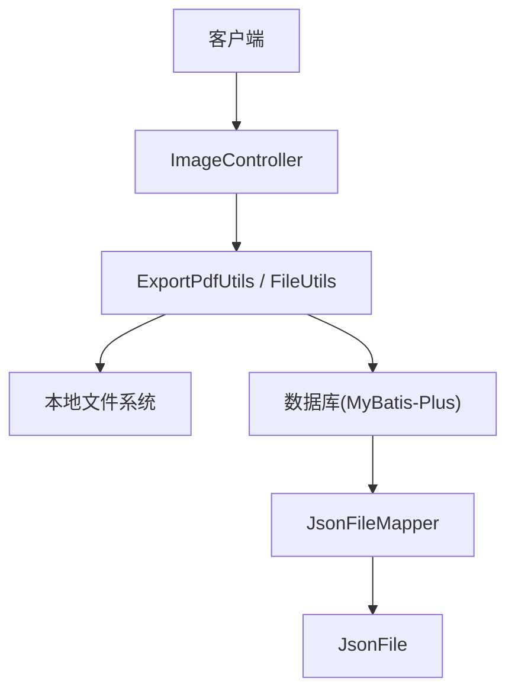
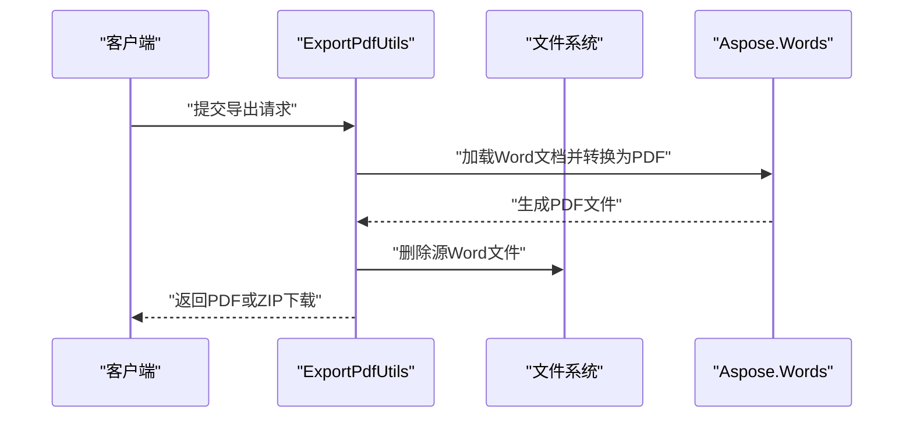
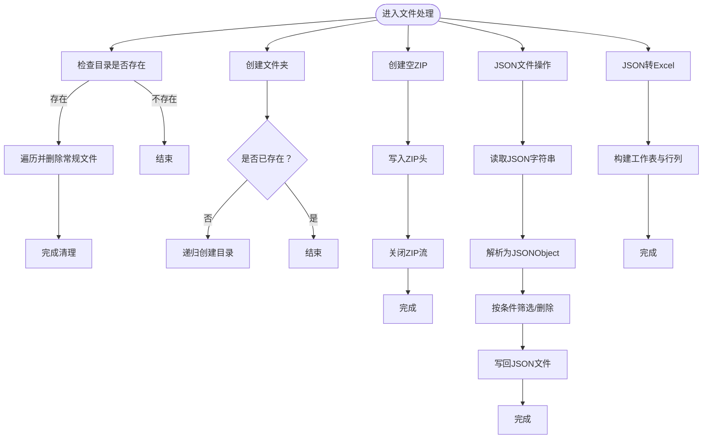
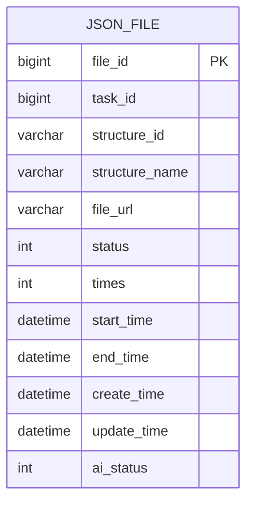
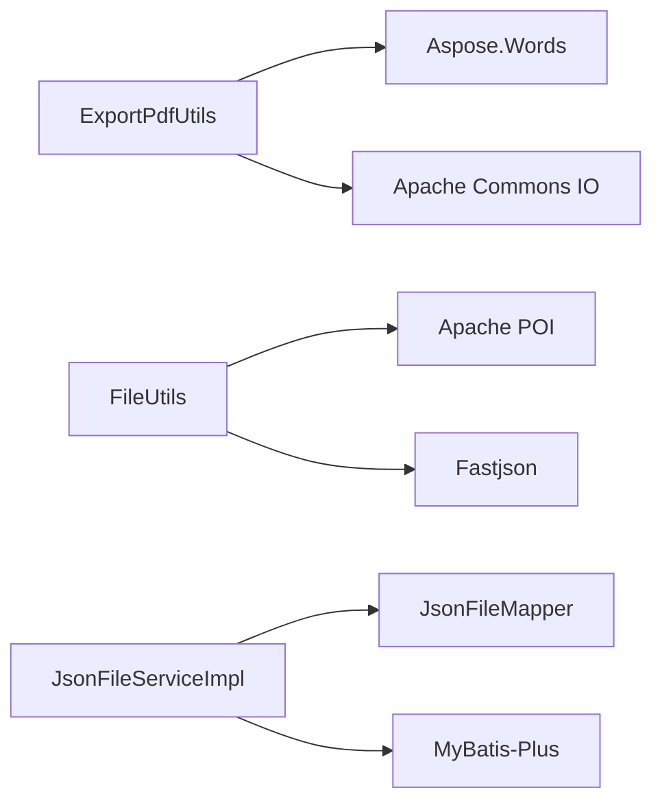

# 文件处理模块

<cite>
**本文档引用的文件**
- [ExportPdfUtils.java](file://src/main/java/cn/staitech/fr/utils/ExportPdfUtils.java)
- [FileUtils.java](file://src/main/java/cn/staitech/fr/utils/FileUtils.java)
- [JsonFile.java](file://src/main/java/cn/staitech/fr/domain/JsonFile.java)
- [JsonFileService.java](file://src/main/java/cn/staitech/fr/service/JsonFileService.java)
- [JsonFileServiceImpl.java](file://src/main/java/cn/staitech/fr/service/impl/JsonFileServiceImpl.java)
- [JsonFileMapper.java](file://src/main/java/cn/staitech/fr/mapper/JsonFileMapper.java)
- [ImageController.java](file://src/main/java/cn/staitech/fr/controller/ImageController.java)
</cite>

## 目录
1. [简介](#简介)
2. [项目结构](#项目结构)
3. [核心组件](#核心组件)
4. [架构总览](#架构总览)
5. [详细组件分析](#详细组件分析)
6. [依赖分析](#依赖分析)
7. [性能考量](#性能考量)
8. [故障排查指南](#故障排查指南)
9. [结论](#结论)
10. [附录](#附录)

## 简介
本文件处理模块围绕“PDF导出工具类”“文件工具类”“文件存储策略”“文件处理示例”“安全与性能最佳实践”展开，结合代码库中的实际实现，系统性地梳理了文档生成、模板处理、格式化选项、文件操作、路径管理、临时文件处理、本地存储与生命周期管理、批量导出、格式转换与压缩处理等能力，并给出可落地的实践建议。

## 项目结构
文件处理相关的核心代码集中在以下位置：
- 工具类：utils/ExportPdfUtils.java、utils/FileUtils.java
- 数据模型与持久化：domain/JsonFile.java、mapper/JsonFileMapper.java、service/JsonFileService.java、service/impl/JsonFileServiceImpl.java
- 控制器：controller/ImageController.java（用于展示文件下载与批量处理场景）

图表来源
- [ExportPdfUtils.java:1-214](file://src/main/java/cn/staitech/fr/utils/ExportPdfUtils.java#L1-L214)
- [FileUtils.java:1-367](file://src/main/java/cn/staitech/fr/utils/FileUtils.java#L1-L367)
- [JsonFile.java:1-52](file://src/main/java/cn/staitech/fr/domain/JsonFile.java#L1-L52)
- [JsonFileMapper.java:1-36](file://src/main/java/cn/staitech/fr/mapper/JsonFileMapper.java#L1-L36)
- [JsonFileService.java:1-16](file://src/main/java/cn/staitech/fr/service/JsonFileService.java#L1-L16)
- [JsonFileServiceImpl.java:1-20](file://src/main/java/cn/staitech/fr/service/impl/JsonFileServiceImpl.java#L1-L20)
- [ImageController.java:1-155](file://src/main/java/cn/staitech/fr/controller/ImageController.java#L1-L155)

章节来源
- [ExportPdfUtils.java:1-214](file://src/main/java/cn/staitech/fr/utils/ExportPdfUtils.java#L1-L214)
- [FileUtils.java:1-367](file://src/main/java/cn/staitech/fr/utils/FileUtils.java#L1-L367)
- [JsonFile.java:1-52](file://src/main/java/cn/staitech/fr/domain/JsonFile.java#L1-L52)
- [JsonFileMapper.java:1-36](file://src/main/java/cn/staitech/fr/mapper/JsonFileMapper.java#L1-L36)
- [JsonFileService.java:1-16](file://src/main/java/cn/staitech/fr/service/JsonFileService.java#L1-L16)
- [JsonFileServiceImpl.java:1-20](file://src/main/java/cn/staitech/fr/service/impl/JsonFileServiceImpl.java#L1-L20)
- [ImageController.java:1-155](file://src/main/java/cn/staitech/fr/controller/ImageController.java#L1-L155)

## 核心组件
- PDF导出工具类（ExportPdfUtils）
  - 提供将Word文档转换为PDF的能力（基于Aspose.Words），并支持将多个PDF打包为ZIP进行下载。
  - 支持向HTTP响应输出单个文件或ZIP压缩包，便于浏览器端下载。
- 文件工具类（FileUtils）
  - 提供目录清理、文件夹创建、空ZIP创建、JSON文件读写、GeoJSON解析与筛选、JSON转Excel（HSSF）等能力。
  - 包含对归档文件（ZIP）的头部校验，用于识别压缩文件类型。
- 文件域模型与持久化（JsonFile/JsonFileMapper/JsonFileService/JsonFileServiceImpl）
  - 定义文件元数据、状态、任务关联等字段，提供批量插入与插入或更新的批量操作接口，支撑文件生命周期管理与异步任务追踪。

章节来源
- [ExportPdfUtils.java:25-214](file://src/main/java/cn/staitech/fr/utils/ExportPdfUtils.java#L25-L214)
- [FileUtils.java:24-367](file://src/main/java/cn/staitech/fr/utils/FileUtils.java#L24-L367)
- [JsonFile.java:22-50](file://src/main/java/cn/staitech/fr/domain/JsonFile.java#L22-L50)
- [JsonFileMapper.java:15-34](file://src/main/java/cn/staitech/fr/mapper/JsonFileMapper.java#L15-L34)
- [JsonFileService.java:12-14](file://src/main/java/cn/staitech/fr/service/JsonFileService.java#L12-L14)
- [JsonFileServiceImpl.java:15-18](file://src/main/java/cn/staitech/fr/service/impl/JsonFileServiceImpl.java#L15-L18)

## 架构总览
文件处理模块采用“工具层-领域层-持久化层-控制层”的分层设计：
- 工具层负责具体文件与文档操作（PDF转换、压缩下载、JSON/Excel处理、文件系统操作）。
- 领域层以JsonFile为核心实体，承载文件元数据与状态。
- 持久化层通过MyBatis-Plus提供批量写入与插入/更新能力。
- 控制层通过HTTP接口触发文件下载、批量删除等操作，作为典型业务入口。

图表来源
- [ImageController.java:32-155](file://src/main/java/cn/staitech/fr/controller/ImageController.java#L32-L155)
- [ExportPdfUtils.java:25-214](file://src/main/java/cn/staitech/fr/utils/ExportPdfUtils.java#L25-L214)
- [FileUtils.java:24-367](file://src/main/java/cn/staitech/fr/utils/FileUtils.java#L24-L367)
- [JsonFileMapper.java:15-34](file://src/main/java/cn/staitech/fr/mapper/JsonFileMapper.java#L15-L34)
- [JsonFile.java:22-50](file://src/main/java/cn/staitech/fr/domain/JsonFile.java#L22-L50)

## 详细组件分析

### PDF导出工具类（ExportPdfUtils）
- 文档生成与模板处理
  - 通过Aspose.Words加载Word文档并保存为PDF，支持PDF保存选项配置（如质量、加密等）。
  - 可根据业务数据动态生成导出内容（示例中包含文本、表格、图片等字段的占位与渲染思路）。
- 格式化选项
  - 使用PdfSaveOptions进行PDF导出参数控制；支持Linux环境下的字体设置（注释中提供字体映射示例）。
- 压缩与下载
  - 将多个PDF文件打包为ZIP并通过HttpServletResponse输出，支持中文文件名的编码处理。
  - 单文件下载支持通过流式传输，避免一次性加载至内存造成OOM。
- 临时文件处理
  - 在PDF转换完成后删除源Word文件，确保磁盘空间回收。

图表来源
- [ExportPdfUtils.java:175-214](file://src/main/java/cn/staitech/fr/utils/ExportPdfUtils.java#L175-L214)

章节来源
- [ExportPdfUtils.java:27-44](file://src/main/java/cn/staitech/fr/utils/ExportPdfUtils.java#L27-L44)
- [ExportPdfUtils.java:123-148](file://src/main/java/cn/staitech/fr/utils/ExportPdfUtils.java#L123-L148)
- [ExportPdfUtils.java:157-173](file://src/main/java/cn/staitech/fr/utils/ExportPdfUtils.java#L157-L173)
- [ExportPdfUtils.java:175-214](file://src/main/java/cn/staitech/fr/utils/ExportPdfUtils.java#L175-L214)

### 文件工具类（FileUtils）
- 文件操作
  - 清理目录：遍历目录并删除其中的常规文件。
  - 创建文件夹：确保目标路径存在，不存在则递归创建。
  - 创建空ZIP：新建ZIP文件，便于后续追加条目。
- 路径管理
  - 获取文件扩展名与无扩展名文件名，便于文件类型判断与命名规范。
- 临时文件处理
  - 通过ZIP头部校验识别归档文件，辅助安全扫描与过滤。
- JSON与Excel处理
  - 将对象序列化为美化后的JSON并写入文件。
  - 读取JSON文件内容为字符串，解析为JSONObject；支持对GeoJSON的features进行筛选与删除。
  - 将JSONArray转换为HSSF工作簿（Excel 2003），便于导出为.xls文件。

图表来源
- [FileUtils.java:34-48](file://src/main/java/cn/staitech/fr/utils/FileUtils.java#L34-L48)
- [FileUtils.java:129-135](file://src/main/java/cn/staitech/fr/utils/FileUtils.java#L129-L135)
- [FileUtils.java:143-159](file://src/main/java/cn/staitech/fr/utils/FileUtils.java#L143-L159)
- [FileUtils.java:172-189](file://src/main/java/cn/staitech/fr/utils/FileUtils.java#L172-L189)
- [FileUtils.java:198-216](file://src/main/java/cn/staitech/fr/utils/FileUtils.java#L198-L216)
- [FileUtils.java:224-235](file://src/main/java/cn/staitech/fr/utils/FileUtils.java#L224-L235)
- [FileUtils.java:238-266](file://src/main/java/cn/staitech/fr/utils/FileUtils.java#L238-L266)
- [FileUtils.java:269-314](file://src/main/java/cn/staitech/fr/utils/FileUtils.java#L269-L314)
- [FileUtils.java:330-362](file://src/main/java/cn/staitech/fr/utils/FileUtils.java#L330-L362)

章节来源
- [FileUtils.java:34-48](file://src/main/java/cn/staitech/fr/utils/FileUtils.java#L34-L48)
- [FileUtils.java:129-135](file://src/main/java/cn/staitech/fr/utils/FileUtils.java#L129-L135)
- [FileUtils.java:143-159](file://src/main/java/cn/staitech/fr/utils/FileUtils.java#L143-L159)
- [FileUtils.java:172-189](file://src/main/java/cn/staitech/fr/utils/FileUtils.java#L172-L189)
- [FileUtils.java:198-216](file://src/main/java/cn/staitech/fr/utils/FileUtils.java#L198-L216)
- [FileUtils.java:224-235](file://src/main/java/cn/staitech/fr/utils/FileUtils.java#L224-L235)
- [FileUtils.java:238-266](file://src/main/java/cn/staitech/fr/utils/FileUtils.java#L238-L266)
- [FileUtils.java:269-314](file://src/main/java/cn/staitech/fr/utils/FileUtils.java#L269-L314)
- [FileUtils.java:330-362](file://src/main/java/cn/staitech/fr/utils/FileUtils.java#L330-L362)

### 文件存储策略与生命周期管理
- 本地存储
  - PDF与中间产物（如Word）默认写入本地文件系统；导出完成后及时清理源文件，降低磁盘占用。
- 云存储集成
  - 当前实现未直接体现云存储SDK调用；可在工具层扩展为统一的文件存储抽象（如FileStorage接口），在不同环境下注入本地或云实现。
- 文件生命周期
  - JsonFile实体记录文件状态（未进行/解析中/成功/失败）、AI识别状态、任务ID、结构信息、时间戳等，配合批量插入/更新接口实现异步任务的生命周期跟踪。

图表来源
- [JsonFile.java:22-50](file://src/main/java/cn/staitech/fr/domain/JsonFile.java#L22-L50)

章节来源
- [JsonFile.java:22-50](file://src/main/java/cn/staitech/fr/domain/JsonFile.java#L22-L50)
- [JsonFileMapper.java:15-34](file://src/main/java/cn/staitech/fr/mapper/JsonFileMapper.java#L15-L34)
- [JsonFileService.java:12-14](file://src/main/java/cn/staitech/fr/service/JsonFileService.java#L12-L14)
- [JsonFileServiceImpl.java:15-18](file://src/main/java/cn/staitech/fr/service/impl/JsonFileServiceImpl.java#L15-L18)

### 文件处理示例
- 批量导出
  - 通过ExportPdfUtils将多个PDF文件打包为ZIP并下载，适合批量报表导出场景。
- 格式转换
  - Word转PDF：利用Aspose.Words完成转换；Linux环境可按需配置字体映射。
- 压缩处理
  - 使用ZipOutputStream将多个文件压缩为单个ZIP包，便于网络传输与存储。

章节来源
- [ExportPdfUtils.java:123-148](file://src/main/java/cn/staitech/fr/utils/ExportPdfUtils.java#L123-L148)
- [ExportPdfUtils.java:175-214](file://src/main/java/cn/staitech/fr/utils/ExportPdfUtils.java#L175-L214)

### 安全考虑
- 文件验证
  - 使用ZIP头部校验识别归档文件，辅助安全扫描与过滤，防止恶意压缩包注入。
- 权限控制
  - 控制器层对批量删除等高风险操作进行审计与参数校验，避免越权与误操作。
- 恶意文件防护
  - 对下载文件名进行ISO-8859-1编码处理，规避路径穿越与文件名注入风险。
  - 建议在生产环境增加白名单校验、大小限制、类型检查与病毒扫描。

章节来源
- [FileUtils.java:50-78](file://src/main/java/cn/staitech/fr/utils/FileUtils.java#L50-L78)
- [ExportPdfUtils.java:123-127](file://src/main/java/cn/staitech/fr/utils/ExportPdfUtils.java#L123-L127)
- [ImageController.java:81-86](file://src/main/java/cn/staitech/fr/controller/ImageController.java#L81-L86)

## 依赖分析
- 组件耦合
  - ExportPdfUtils与FileUtils分别承担文档与文件系统的职责，边界清晰。
  - JsonFileService/JsonFileMapper提供文件元数据的持久化能力，与工具层解耦。
- 外部依赖
  - Aspose.Words用于Word到PDF转换。
  - Apache POI用于Excel（.xls）生成。
  - MyBatis-Plus用于数据库访问与批量操作。
- 循环依赖
  - 当前模块未发现循环依赖迹象。

图表来源
- [ExportPdfUtils.java:5-8](file://src/main/java/cn/staitech/fr/utils/ExportPdfUtils.java#L5-L8)
- [FileUtils.java:9-11](file://src/main/java/cn/staitech/fr/utils/FileUtils.java#L9-L11)
- [JsonFileServiceImpl.java:6-7](file://src/main/java/cn/staitech/fr/service/impl/JsonFileServiceImpl.java#L6-L7)

章节来源
- [ExportPdfUtils.java:5-8](file://src/main/java/cn/staitech/fr/utils/ExportPdfUtils.java#L5-L8)
- [FileUtils.java:9-11](file://src/main/java/cn/staitech/fr/utils/FileUtils.java#L9-L11)
- [JsonFileServiceImpl.java:6-7](file://src/main/java/cn/staitech/fr/service/impl/JsonFileServiceImpl.java#L6-L7)

## 性能考量
- 流式处理
  - PDF下载与ZIP打包采用流式写入，避免大文件一次性加载至内存。
- 批量写入
  - JsonFileMapper提供insertBatch与insertOrUpdateBatch，减少数据库往返开销。
- 字符集与编码
  - 统一使用UTF-8写入JSON文件，避免跨平台字符集问题。
- 资源释放
  - 明确关闭输入输出流与ZIP流，防止资源泄露。

章节来源
- [ExportPdfUtils.java:157-173](file://src/main/java/cn/staitech/fr/utils/ExportPdfUtils.java#L157-L173)
- [ExportPdfUtils.java:123-148](file://src/main/java/cn/staitech/fr/utils/ExportPdfUtils.java#L123-L148)
- [JsonFileMapper.java:23-32](file://src/main/java/cn/staitech/fr/mapper/JsonFileMapper.java#L23-L32)
- [FileUtils.java:172-189](file://src/main/java/cn/staitech/fr/utils/FileUtils.java#L172-L189)

## 故障排查指南
- PDF转换失败
  - 检查Word文档是否损坏或被占用；确认Aspose.Words许可证与版本兼容性。
  - 查看转换后源文件是否被成功删除，避免残留文件影响下次转换。
- ZIP下载异常
  - 确认响应头设置正确（Content-Type与Content-Disposition），并对文件名进行ISO-8859-1编码。
  - 检查ZipOutputStream的flush与close调用顺序。
- JSON读写错误
  - 确保文件存在且可读；使用UTF-8编码读取与写入；注意并发修改导致的迭代器异常。
- 批量删除无效
  - 核对控制器层的参数校验与审计注解，确保请求合法且被正确路由。

章节来源
- [ExportPdfUtils.java:175-214](file://src/main/java/cn/staitech/fr/utils/ExportPdfUtils.java#L175-L214)
- [ExportPdfUtils.java:123-148](file://src/main/java/cn/staitech/fr/utils/ExportPdfUtils.java#L123-L148)
- [FileUtils.java:198-216](file://src/main/java/cn/staitech/fr/utils/FileUtils.java#L198-L216)
- [ImageController.java:81-86](file://src/main/java/cn/staitech/fr/controller/ImageController.java#L81-L86)

## 结论
该文件处理模块以工具类为核心，覆盖PDF导出、压缩下载、JSON/Excel处理与文件系统操作，同时通过JsonFile实体与MyBatis-Plus实现文件生命周期管理。建议在生产环境中进一步完善云存储抽象、安全扫描与类型校验、以及更细粒度的错误恢复与重试机制，以提升稳定性与可维护性。

## 附录
- 最佳实践清单
  - 使用流式I/O处理大文件，避免内存溢出。
  - 对外部输入进行白名单与大小限制，防止恶意文件注入。
  - 统一异常处理与日志记录，便于问题定位。
  - 为关键流程增加幂等性与重试策略，保障一致性。