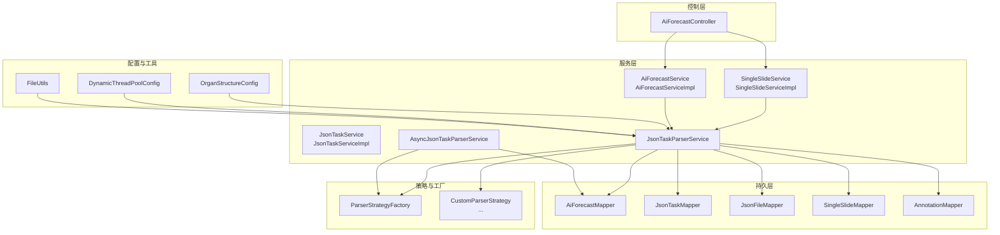
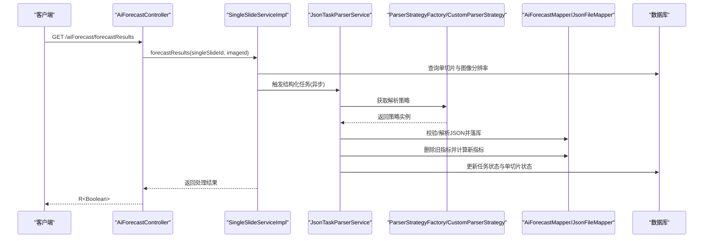
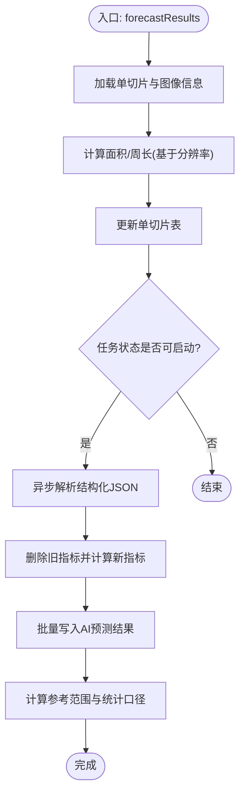
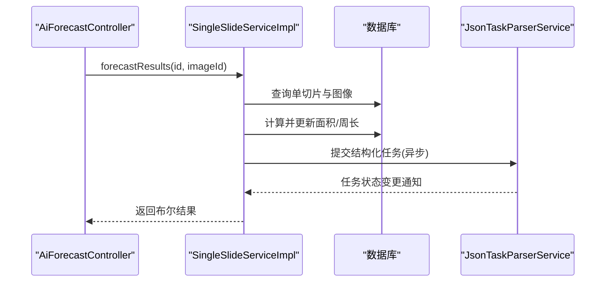
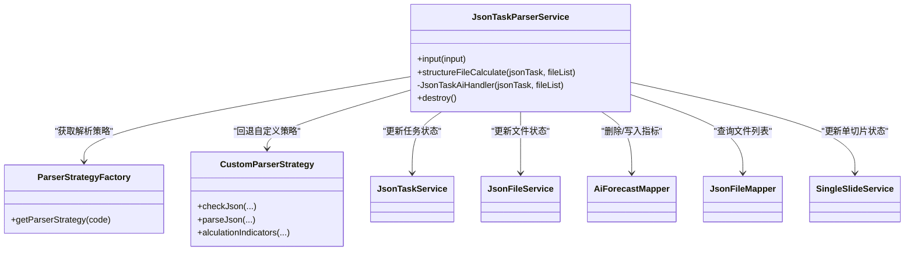
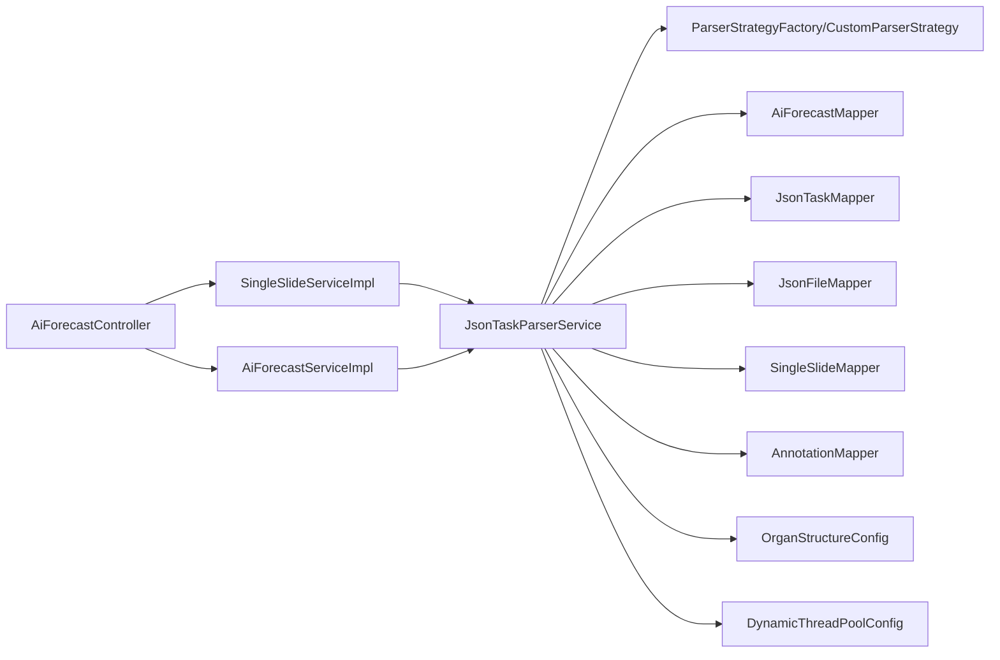

# 核心功能模块

<cite>
**本文档引用的文件**
- [AiForecastService.java](file://src/main/java/cn/staitech/fr/service/AiForecastService.java)
- [AiForecastServiceImpl.java](file://src/main/java/cn/staitech/fr/service/impl/AiForecastServiceImpl.java)
- [SingleSlideService.java](file://src/main/java/cn/staitech/fr/service/SingleSlideService.java)
- [SingleSlideServiceImpl.java](file://src/main/java/cn/staitech/fr/service/impl/SingleSlideServiceImpl.java)
- [JsonTaskService.java](file://src/main/java/cn/staitech/fr/service/JsonTaskService.java)
- [JsonTaskServiceImpl.java](file://src/main/java/cn/staitech/fr/service/impl/JsonTaskServiceImpl.java)
- [JsonTaskParserService.java](file://src/main/java/cn/staitech/fr/service/strategy/json/JsonTaskParserService.java)
- [AsyncJsonTaskParserService.java](file://src/main/java/cn/staitech/fr/service/strategy/json/AsyncJsonTaskParserService.java)
- [AiForecastMapper.java](file://src/main/java/cn/staitech/fr/mapper/AiForecastMapper.java)
- [OrganStructureConfig.java](file://src/main/java/cn/staitech/fr/config/OrganStructureConfig.java)
- [DynamicThreadPoolConfig.java](file://src/main/java/cn/staitech/fr/config/DynamicThreadPoolConfig.java)
- [FileUtils.java](file://src/main/java/cn/staitech/fr/utils/FileUtils.java)
- [AiForecastController.java](file://src/main/java/cn/staitech/fr/controller/AiForecastController.java)
- [AiForecast.java](file://src/main/java/cn/staitech/fr/domain/AiForecast.java)
- [JsonTaskStatusEnum.java](file://src/main/java/cn/staitech/fr/enums/JsonTaskStatusEnum.java)
</cite>

## 目录
1. [简介](#简介)
2. [项目结构](#项目结构)
3. [核心组件](#核心组件)
4. [架构总览](#架构总览)
5. [详细组件分析](#详细组件分析)
6. [依赖分析](#依赖分析)
7. [性能考虑](#性能考虑)
8. [故障排查指南](#故障排查指南)
9. [结论](#结论)
10. [附录](#附录)

## 简介
本文件面向FR模块的核心功能，围绕六大模块展开：AI预测模块、单切片处理模块、JSON解析引擎、数据库管理模块、配置管理模块与文件处理模块。文档旨在帮助初学者快速理解整体设计与流程，同时为有经验的开发者提供深入的技术细节、接口定义、协作关系、性能优化与排障建议。

## 项目结构
FR模块采用典型的分层架构：控制层负责对外接口，服务层封装业务逻辑，策略与工厂负责可插拔的解析策略，持久层通过MyBatis-Plus访问数据库，工具类提供通用能力，配置类提供运行时参数与线程池等基础设施。

图表来源
- [AiForecastController.java:1-31](file://src/main/java/cn/staitech/fr/controller/AiForecastController.java#L1-31)
- [SingleSlideServiceImpl.java:1-223](file://src/main/java/cn/staitech/fr/service/impl/SingleSlideServiceImpl.java#L1-223)
- [AiForecastServiceImpl.java:1-372](file://src/main/java/cn/staitech/fr/service/impl/AiForecastServiceImpl.java#L1-372)
- [JsonTaskServiceImpl.java:1-55](file://src/main/java/cn/staitech/fr/service/impl/JsonTaskServiceImpl.java#L1-55)
- [JsonTaskParserService.java:1-760](file://src/main/java/cn/staitech/fr/service/strategy/json/JsonTaskParserService.java#L1-760)
- [AsyncJsonTaskParserService.java:1-306](file://src/main/java/cn/staitech/fr/service/strategy/json/AsyncJsonTaskParserService.java#L1-306)
- [AiForecastMapper.java:1-22](file://src/main/java/cn/staitech/fr/mapper/AiForecastMapper.java#L1-22)
- [OrganStructureConfig.java:1-45](file://src/main/java/cn/staitech/fr/config/OrganStructureConfig.java#L1-45)
- [DynamicThreadPoolConfig.java:1-53](file://src/main/java/cn/staitech/fr/config/DynamicThreadPoolConfig.java#L1-53)
- [FileUtils.java:1-367](file://src/main/java/cn/staitech/fr/utils/FileUtils.java#L1-367)

章节来源
- [AiForecastController.java:1-31](file://src/main/java/cn/staitech/fr/controller/AiForecastController.java#L1-31)
- [SingleSlideServiceImpl.java:1-223](file://src/main/java/cn/staitech/fr/service/impl/SingleSlideServiceImpl.java#L1-223)
- [AiForecastServiceImpl.java:1-372](file://src/main/java/cn/staitech/fr/service/impl/AiForecastServiceImpl.java#L1-372)
- [JsonTaskServiceImpl.java:1-55](file://src/main/java/cn/staitech/fr/service/impl/JsonTaskServiceImpl.java#L1-55)
- [JsonTaskParserService.java:1-760](file://src/main/java/cn/staitech/fr/service/strategy/json/JsonTaskParserService.java#L1-760)
- [AsyncJsonTaskParserService.java:1-306](file://src/main/java/cn/staitech/fr/service/strategy/json/AsyncJsonTaskParserService.java#L1-306)
- [AiForecastMapper.java:1-22](file://src/main/java/cn/staitech/fr/mapper/AiForecastMapper.java#L1-22)
- [OrganStructureConfig.java:1-45](file://src/main/java/cn/staitech/fr/config/OrganStructureConfig.java#L1-45)
- [DynamicThreadPoolConfig.java:1-53](file://src/main/java/cn/staitech/fr/config/DynamicThreadPoolConfig.java#L1-53)
- [FileUtils.java:1-367](file://src/main/java/cn/staitech/fr/utils/FileUtils.java#L1-367)

## 核心组件
- AI预测模块：负责单切片面积/周长计算、指标批量入库、参考范围与统计口径计算。
- 单切片处理模块：统一入口触发预测流程，协调解析任务与指标计算。
- JSON解析引擎：接收算法回调JSON，校验结构完整性，按策略解析并落库，最后计算指标与生成标注数据。
- 数据库管理模块：基于MyBatis-Plus的Mapper接口，提供AI预测结果、任务、文件等实体的CRUD。
- 配置管理模块：器官-结构映射配置与动态线程池配置。
- 文件处理模块：提供JSON/GeoJSON读写、压缩包检测、导出等功能。

章节来源
- [AiForecastService.java:1-29](file://src/main/java/cn/staitech/fr/service/AiForecastService.java#L1-29)
- [SingleSlideService.java:1-15](file://src/main/java/cn/staitech/fr/service/SingleSlideService.java#L1-15)
- [JsonTaskParserService.java:1-760](file://src/main/java/cn/staitech/fr/service/strategy/json/JsonTaskParserService.java#L1-760)
- [AiForecastMapper.java:1-22](file://src/main/java/cn/staitech/fr/mapper/AiForecastMapper.java#L1-22)
- [OrganStructureConfig.java:1-45](file://src/main/java/cn/staitech/fr/config/OrganStructureConfig.java#L1-45)
- [FileUtils.java:1-367](file://src/main/java/cn/staitech/fr/utils/FileUtils.java#L1-367)

## 架构总览
AI预测从控制器入口触发，调用单切片服务进行面积/周长换算与解析任务调度；解析引擎负责结构化JSON的校验、解析、落库与指标计算；最终由AI预测服务汇总并计算参考范围与统计口径，写入数据库。

图表来源
- [AiForecastController.java:1-31](file://src/main/java/cn/staitech/fr/controller/AiForecastController.java#L1-31)
- [SingleSlideServiceImpl.java:64-138](file://src/main/java/cn/staitech/fr/service/impl/SingleSlideServiceImpl.java#L64-138)
- [JsonTaskParserService.java:265-452](file://src/main/java/cn/staitech/fr/service/strategy/json/JsonTaskParserService.java#L265-452)
- [AiForecastMapper.java:1-22](file://src/main/java/cn/staitech/fr/mapper/AiForecastMapper.java#L1-22)

## 详细组件分析

### AI预测模块
- 职责
  - 接收单切片与图像ID，计算面积/周长并回写单切片表。
  - 触发结构化任务解析与指标计算。
  - 批量写入AI预测结果，支持输出指标与统计口径。
  - 计算参考范围与正态区间，支持性别与结构类型过滤。
- 关键接口
  - forecastResults：触发预测流程。
  - addAiForecast/addOutIndicators：批量写入预测结果。
  - selectList/calculateList：查询与计算展示用指标。
- 处理逻辑要点
  - 面积/周长换算：依据图像分辨率进行单位换算。
  - 参考范围：按项目控制组、性别、结构类型聚合历史数据，计算均值±标准差与95%置信区间。
  - 异常处理：捕获异常并记录日志，保证流程可恢复。

图表来源
- [AiForecastServiceImpl.java:85-157](file://src/main/java/cn/staitech/fr/service/impl/AiForecastServiceImpl.java#L85-157)
- [AiForecastServiceImpl.java:162-239](file://src/main/java/cn/staitech/fr/service/impl/AiForecastServiceImpl.java#L162-239)
- [AiForecastServiceImpl.java:272-306](file://src/main/java/cn/staitech/fr/service/impl/AiForecastServiceImpl.java#L272-306)

章节来源
- [AiForecastService.java:16-28](file://src/main/java/cn/staitech/fr/service/AiForecastService.java#L16-28)
- [AiForecastServiceImpl.java:85-306](file://src/main/java/cn/staitech/fr/service/impl/AiForecastServiceImpl.java#L85-306)
- [AiForecast.java:18-84](file://src/main/java/cn/staitech/fr/domain/AiForecast.java#L18-84)

### 单切片处理模块
- 职责
  - 统一入口：接收单切片与图像ID，触发预测流程。
  - 面积/周长计算：根据解析度换算真实物理尺寸。
  - 任务状态管理：预测中/成功/失败状态更新。
- 关键接口
  - forecastResults：主流程入口。
  - updateRatTcAreaPerimeter/getSingleSlide：特定结构的面积/周长更新。

图表来源
- [AiForecastController.java:26-30](file://src/main/java/cn/staitech/fr/controller/AiForecastController.java#L26-30)
- [SingleSlideServiceImpl.java:64-138](file://src/main/java/cn/staitech/fr/service/impl/SingleSlideServiceImpl.java#L64-138)
- [JsonTaskParserService.java:265-286](file://src/main/java/cn/staitech/fr/service/strategy/json/JsonTaskParserService.java#L265-286)

章节来源
- [SingleSlideService.java:7-14](file://src/main/java/cn/staitech/fr/service/SingleSlideService.java#L7-14)
- [SingleSlideServiceImpl.java:64-223](file://src/main/java/cn/staitech/fr/service/impl/SingleSlideServiceImpl.java#L64-223)

### JSON解析引擎
- 职责
  - 接收算法回调JSON，解析任务元数据与文件列表。
  - 校验脏器结构完整性，按策略解析JSON并落库。
  - 删除旧指标，计算新指标，生成标注数据，更新任务与单切片状态。
- 关键流程
  - input：解析输入JSON，创建/更新任务，必要时触发结构化计算。
  - structureFileCalculate：遍历文件，逐个解析并更新状态。
  - JsonTaskAiHandler：策略校验、解析、指标计算、标注落库。
- 并发与线程池
  - 使用TTL包装的线程池，避免跨线程上下文丢失。
  - 动态线程池配置，支持监控与弹性伸缩。

图表来源
- [JsonTaskParserService.java:54-107](file://src/main/java/cn/staitech/fr/service/strategy/json/JsonTaskParserService.java#L54-107)
- [JsonTaskParserService.java:319-452](file://src/main/java/cn/staitech/fr/service/strategy/json/JsonTaskParserService.java#L319-452)
- [DynamicThreadPoolConfig.java:14-51](file://src/main/java/cn/staitech/fr/config/DynamicThreadPoolConfig.java#L14-51)

章节来源
- [JsonTaskParserService.java:174-452](file://src/main/java/cn/staitech/fr/service/strategy/json/JsonTaskParserService.java#L174-452)
- [AsyncJsonTaskParserService.java:68-213](file://src/main/java/cn/staitech/fr/service/strategy/json/AsyncJsonTaskParserService.java#L68-213)
- [DynamicThreadPoolConfig.java:14-51](file://src/main/java/cn/staitech/fr/config/DynamicThreadPoolConfig.java#L14-51)

### 数据库管理模块
- 职责
  - 提供AI预测结果、任务、文件等实体的持久化接口。
  - 支持批量写入、条件查询与删除。
- 关键Mapper
  - AiForecastMapper：按单切片查询预测结果。
  - JsonTaskMapper/JsonFileMapper：任务与文件状态管理。
  - SingleSlideMapper/AnnotationMapper：单切片与几何数据。

章节来源
- [AiForecastMapper.java:13-17](file://src/main/java/cn/staitech/fr/mapper/AiForecastMapper.java#L13-17)
- [AiForecastServiceImpl.java:198-200](file://src/main/java/cn/staitech/fr/service/impl/AiForecastServiceImpl.java#L198-200)

### 配置管理模块
- 职责
  - 器官-结构映射配置：定义每种脏器启用的结构集合。
  - 动态线程池配置：提供可监控、可调优的线程池。
- 使用场景
  - 解析引擎根据配置判断结构识别完整性。
  - 控制解析并发度与队列容量。

章节来源
- [OrganStructureConfig.java:14-44](file://src/main/java/cn/staitech/fr/config/OrganStructureConfig.java#L14-44)
- [DynamicThreadPoolConfig.java:14-51](file://src/main/java/cn/staitech/fr/config/DynamicThreadPoolConfig.java#L14-51)

### 文件处理模块
- 职责
  - JSON/GeoJSON读写、导出、压缩包检测、文件夹清理。
  - Excel导出辅助工具。
- 使用场景
  - 解析引擎落盘临时文件与中间结果。
  - 导出标注数据与测量数据。

章节来源
- [FileUtils.java:172-216](file://src/main/java/cn/staitech/fr/utils/FileUtils.java#L172-216)
- [FileUtils.java:269-314](file://src/main/java/cn/staitech/fr/utils/FileUtils.java#L269-314)

## 依赖分析
- 控制器依赖服务层；服务层依赖策略与工厂、Mapper与配置。
- 解析引擎依赖策略工厂与自定义策略，以及任务/文件/单切片服务。
- 数据库层通过Mapper暴露能力，避免直接耦合业务。
- 线程池配置独立于业务，便于统一治理。

图表来源
- [AiForecastController.java:23-30](file://src/main/java/cn/staitech/fr/controller/AiForecastController.java#L23-30)
- [SingleSlideServiceImpl.java:64-138](file://src/main/java/cn/staitech/fr/service/impl/SingleSlideServiceImpl.java#L64-138)
- [AiForecastServiceImpl.java:85-157](file://src/main/java/cn/staitech/fr/service/impl/AiForecastServiceImpl.java#L85-157)
- [JsonTaskParserService.java:54-107](file://src/main/java/cn/staitech/fr/service/strategy/json/JsonTaskParserService.java#L54-107)
- [OrganStructureConfig.java:14-44](file://src/main/java/cn/staitech/fr/config/OrganStructureConfig.java#L14-44)
- [DynamicThreadPoolConfig.java:14-51](file://src/main/java/cn/staitech/fr/config/DynamicThreadPoolConfig.java#L14-51)

章节来源
- [AiForecastController.java:1-31](file://src/main/java/cn/staitech/fr/controller/AiForecastController.java#L1-31)
- [JsonTaskParserService.java:1-760](file://src/main/java/cn/staitech/fr/service/strategy/json/JsonTaskParserService.java#L1-760)

## 性能考虑
- 线程池与并发
  - 使用TTL包装线程池，避免跨线程上下文丢失。
  - 动态线程池具备监控钩子，便于观察队列长度与活跃线程数。
- I/O与文件
  - JSON/GeoJSON读写采用UTF-8编码与缓冲流，减少频繁I/O。
  - 大文件解析前先检测文件大小，便于资源评估。
- 数据库
  - 批量写入AI预测结果，降低事务开销。
  - 条件查询与删除，避免全表扫描。
- 算法与指标
  - 指标计算采用高精度BigDecimal，避免浮点误差。
  - 参考范围计算使用方差与标准差，支持95%置信区间。

章节来源
- [DynamicThreadPoolConfig.java:29-46](file://src/main/java/cn/staitech/fr/config/DynamicThreadPoolConfig.java#L29-46)
- [JsonTaskParserService.java:460-486](file://src/main/java/cn/staitech/fr/service/strategy/json/JsonTaskParserService.java#L460-486)
- [AiForecastServiceImpl.java:198-200](file://src/main/java/cn/staitech/fr/service/impl/AiForecastServiceImpl.java#L198-200)
- [AiForecastServiceImpl.java:330-354](file://src/main/java/cn/staitech/fr/service/impl/AiForecastServiceImpl.java#L330-354)

## 故障排查指南
- 任务状态异常
  - 检查JsonTaskStatusEnum状态流转，定位失败节点。
  - 核对任务创建与更新逻辑，确保唯一约束冲突处理正确。
- 解析失败
  - 查看策略校验与文件存在性检查日志。
  - 确认算法代码匹配与解析器注册。
- 指标缺失
  - 确认参考范围数据是否为空或负值，必要时过滤无效样本。
  - 检查结构类型与性别字段是否一致。
- 线程池问题
  - 关注动态线程池监控日志，调整核心/最大线程与队列容量。
  - 注意丢弃策略与超时设置，避免任务堆积。

章节来源
- [JsonTaskStatusEnum.java:6-15](file://src/main/java/cn/staitech/fr/enums/JsonTaskStatusEnum.java#L6-15)
- [JsonTaskServiceImpl.java:32-52](file://src/main/java/cn/staitech/fr/service/impl/JsonTaskServiceImpl.java#L32-52)
- [JsonTaskParserService.java:319-336](file://src/main/java/cn/staitech/fr/service/strategy/json/JsonTaskParserService.java#L319-336)
- [DynamicThreadPoolConfig.java:29-46](file://src/main/java/cn/staitech/fr/config/DynamicThreadPoolConfig.java#L29-46)

## 结论
FR模块通过清晰的分层与策略化设计，实现了从JSON解析到指标计算的完整闭环。模块间职责明确、依赖解耦、具备可观测性与可扩展性。建议在生产环境中结合监控与压测持续优化线程池与I/O策略，确保高并发下的稳定性与吞吐。

## 附录
- 使用模式与最佳实践
  - 控制器仅做参数校验与调用转发，复杂逻辑下沉至服务层。
  - 解析引擎优先使用工厂策略，自定义策略作为兜底。
  - 批量写入与条件查询配合使用，减少数据库往返。
  - 日志分级与MDC结合，便于追踪单次任务链路。
- 关键接口路径参考
  - [AI预测接口:16-28](file://src/main/java/cn/staitech/fr/service/AiForecastService.java#L16-28)
  - [单切片入口:7-14](file://src/main/java/cn/staitech/fr/service/SingleSlideService.java#L7-14)
  - [任务检查:12-14](file://src/main/java/cn/staitech/fr/service/JsonTaskService.java#L12-14)
  - [解析引擎入口:174-263](file://src/main/java/cn/staitech/fr/service/strategy/json/JsonTaskParserService.java#L174-263)
  - [AI预测结果模型:18-84](file://src/main/java/cn/staitech/fr/domain/AiForecast.java#L18-84)