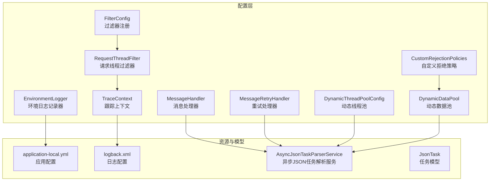
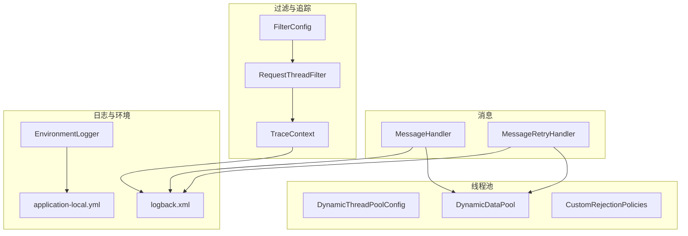
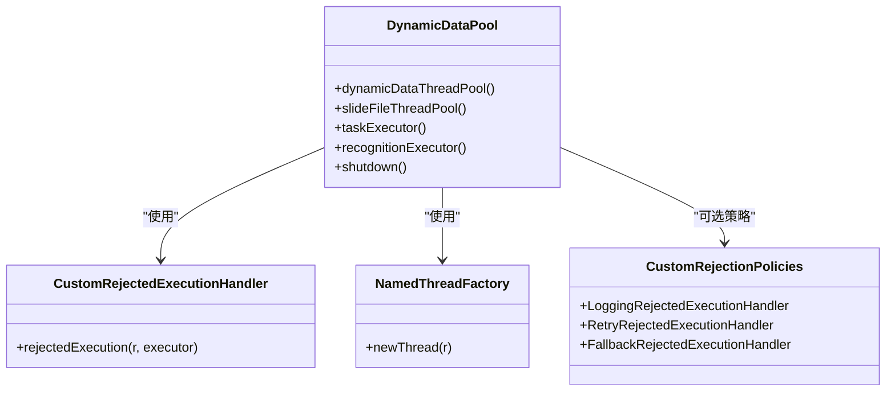
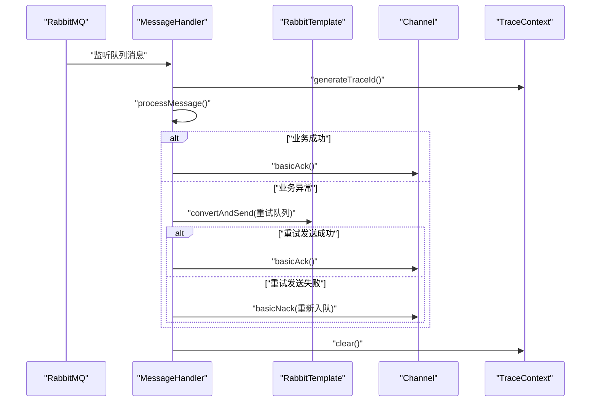
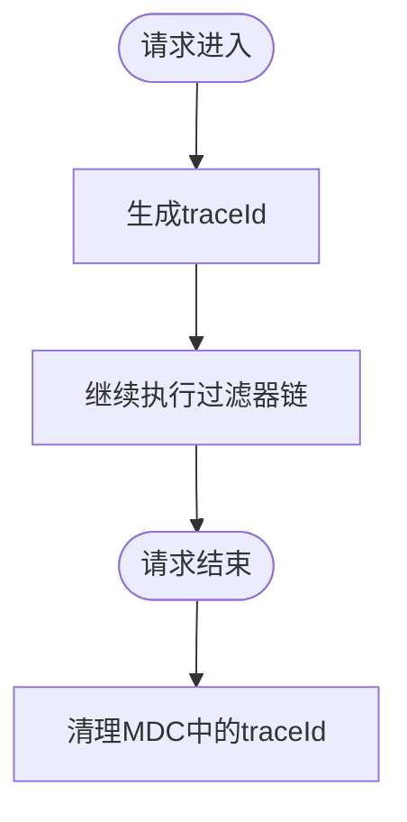
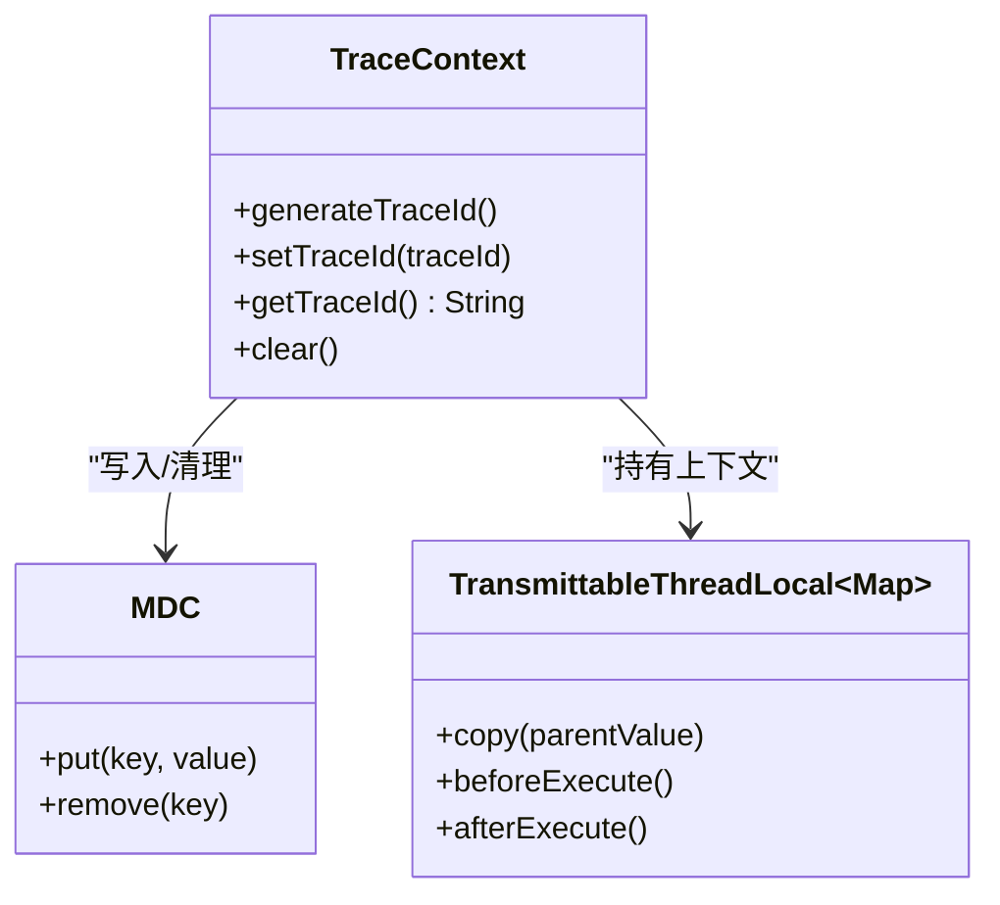
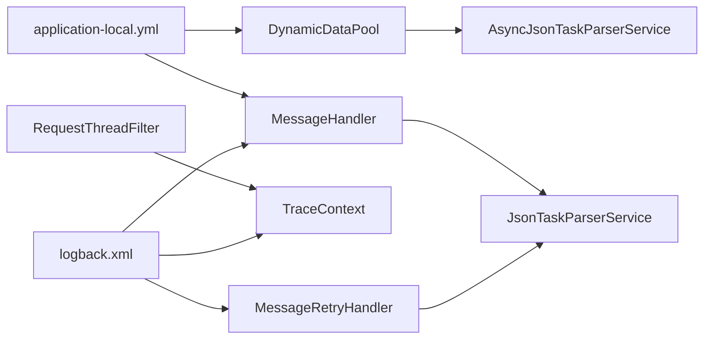

# 配置管理模块

<cite>
**本文引用的文件**
- [DynamicThreadPoolConfig.java](file://src/main/java/cn/staitech/fr/config/DynamicThreadPoolConfig.java)
- [DynamicDataPool.java](file://src/main/java/cn/staitech/fr/config/DynamicDataPool.java)
- [CustomRejectionPolicies.java](file://src/main/java/cn/staitech/fr/config/CustomRejectionPolicies.java)
- [MessageHandler.java](file://src/main/java/cn/staitech/fr/config/MessageHandler.java)
- [MessageRetryHandler.java](file://src/main/java/cn/staitech/fr/config/MessageRetryHandler.java)
- [RequestThreadFilter.java](file://src/main/java/cn/staitech/fr/config/RequestThreadFilter.java)
- [FilterConfig.java](file://src/main/java/cn/staitech/fr/config/FilterConfig.java)
- [TraceContext.java](file://src/main/java/cn/staitech/fr/config/TraceContext.java)
- [EnvironmentLogger.java](file://src/main/java/cn/staitech/fr/config/EnvironmentLogger.java)
- [application-local.yml](file://src/main/resources/application-local.yml)
- [logback.xml](file://src/main/resources/logback.xml)
- [AsyncJsonTaskParserService.java](file://src/main/java/cn/staitech/fr/service/strategy/json/AsyncJsonTaskParserService.java)
- [JsonTask.java](file://src/main/java/cn/staitech/fr/domain/JsonTask.java)
</cite>

## 目录
1. [简介](#简介)
2. [项目结构](#项目结构)
3. [核心组件](#核心组件)
4. [架构总览](#架构总览)
5. [详细组件分析](#详细组件分析)
6. [依赖分析](#依赖分析)
7. [性能考量](#性能考量)
8. [故障排查指南](#故障排查指南)
9. [结论](#结论)
10. [附录](#附录)

## 简介
本技术文档聚焦于配置管理模块，围绕以下主题展开：
- 动态线程池配置：线程池参数调优、任务队列管理、拒绝策略配置
- 消息处理器：消息路由、重试机制、错误处理策略
- 环境日志记录器：日志级别、输出格式与性能影响
- 过滤器配置：请求拦截、安全控制与性能监控
- 跟踪上下文：分布式追踪、链路监控与性能分析
- 最佳实践、性能调优与故障排查

## 项目结构
配置管理模块位于 cn.staitech.fr.config 包下，配合服务层与资源文件共同实现线程池、消息、过滤器与日志的统一配置与运行时行为控制。

图表来源
- [DynamicThreadPoolConfig.java:10-51](file://src/main/java/cn/staitech/fr/config/DynamicThreadPoolConfig.java#L10-L51)
- [DynamicDataPool.java:12-229](file://src/main/java/cn/staitech/fr/config/DynamicDataPool.java#L12-L229)
- [CustomRejectionPolicies.java:16-101](file://src/main/java/cn/staitech/fr/config/CustomRejectionPolicies.java#L16-L101)
- [MessageHandler.java:30-127](file://src/main/java/cn/staitech/fr/config/MessageHandler.java#L30-L127)
- [MessageRetryHandler.java:18-43](file://src/main/java/cn/staitech/fr/config/MessageRetryHandler.java#L18-L43)
- [RequestThreadFilter.java:11-23](file://src/main/java/cn/staitech/fr/config/RequestThreadFilter.java#L11-L23)
- [FilterConfig.java:10-21](file://src/main/java/cn/staitech/fr/config/FilterConfig.java#L10-L21)
- [TraceContext.java:13-81](file://src/main/java/cn/staitech/fr/config/TraceContext.java#L13-L81)
- [EnvironmentLogger.java:8-25](file://src/main/java/cn/staitech/fr/config/EnvironmentLogger.java#L8-L25)
- [application-local.yml:5-311](file://src/main/resources/application-local.yml#L5-L311)
- [logback.xml:1-102](file://src/main/resources/logback.xml#L1-L102)
- [AsyncJsonTaskParserService.java:26-306](file://src/main/java/cn/staitech/fr/service/strategy/json/AsyncJsonTaskParserService.java#L26-L306)
- [JsonTask.java:22-67](file://src/main/java/cn/staitech/fr/domain/JsonTask.java#L22-L67)

章节来源
- [application-local.yml:5-311](file://src/main/resources/application-local.yml#L5-L311)
- [logback.xml:1-102](file://src/main/resources/logback.xml#L1-L102)

## 核心组件
- 动态线程池配置：提供可观察的线程池监控与基础参数配置，适用于轻量任务场景。
- 动态数据池：支持多线程池、动态参数注入、自定义拒绝策略与优雅关闭。
- 自定义拒绝策略：提供日志记录、等待重试、降级处理等策略组合。
- 消息处理器：基于RabbitMQ的消息监听、手动确认、重试队列与延迟消息处理。
- 请求线程过滤器与过滤器注册：在请求生命周期内生成与清理traceId，便于日志关联。
- 跟踪上下文：基于TransmittableThreadLocal与MDC实现跨线程传递与清理。
- 环境日志记录器：应用启动后打印PropertySource，辅助诊断配置来源。
- 日志配置：统一输出格式与按模块/级别控制，结合traceId实现链路追踪。

章节来源
- [DynamicThreadPoolConfig.java:10-51](file://src/main/java/cn/staitech/fr/config/DynamicThreadPoolConfig.java#L10-L51)
- [DynamicDataPool.java:12-229](file://src/main/java/cn/staitech/fr/config/DynamicDataPool.java#L12-L229)
- [CustomRejectionPolicies.java:16-101](file://src/main/java/cn/staitech/fr/config/CustomRejectionPolicies.java#L16-L101)
- [MessageHandler.java:30-127](file://src/main/java/cn/staitech/fr/config/MessageHandler.java#L30-L127)
- [RequestThreadFilter.java:11-23](file://src/main/java/cn/staitech/fr/config/RequestThreadFilter.java#L11-L23)
- [FilterConfig.java:10-21](file://src/main/java/cn/staitech/fr/config/FilterConfig.java#L10-L21)
- [TraceContext.java:13-81](file://src/main/java/cn/staitech/fr/config/TraceContext.java#L13-L81)
- [EnvironmentLogger.java:8-25](file://src/main/java/cn/staitech/fr/config/EnvironmentLogger.java#L8-L25)
- [logback.xml:1-102](file://src/main/resources/logback.xml#L1-L102)

## 架构总览
配置管理模块通过Spring配置类与资源文件协同工作，形成“线程池—消息—过滤器—日志—追踪”的闭环，支撑高并发与可观测性需求。

图表来源
- [DynamicThreadPoolConfig.java:10-51](file://src/main/java/cn/staitech/fr/config/DynamicThreadPoolConfig.java#L10-L51)
- [DynamicDataPool.java:12-229](file://src/main/java/cn/staitech/fr/config/DynamicDataPool.java#L12-L229)
- [CustomRejectionPolicies.java:16-101](file://src/main/java/cn/staitech/fr/config/CustomRejectionPolicies.java#L16-L101)
- [MessageHandler.java:30-127](file://src/main/java/cn/staitech/fr/config/MessageHandler.java#L30-L127)
- [MessageRetryHandler.java:18-43](file://src/main/java/cn/staitech/fr/config/MessageRetryHandler.java#L18-L43)
- [RequestThreadFilter.java:11-23](file://src/main/java/cn/staitech/fr/config/RequestThreadFilter.java#L11-L23)
- [FilterConfig.java:10-21](file://src/main/java/cn/staitech/fr/config/FilterConfig.java#L10-L21)
- [TraceContext.java:13-81](file://src/main/java/cn/staitech/fr/config/TraceContext.java#L13-L81)
- [EnvironmentLogger.java:8-25](file://src/main/java/cn/staitech/fr/config/EnvironmentLogger.java#L8-L25)
- [logback.xml:1-102](file://src/main/resources/logback.xml#L1-L102)
- [application-local.yml:5-311](file://src/main/resources/application-local.yml#L5-L311)

## 详细组件分析

### 动态线程池配置（DynamicThreadPoolConfig）
- 设计要点
  - 固定核心与最大线程、固定超时、有界阻塞队列、自定义线程命名与守护线程设置。
  - 通过覆写execute/beforeExecute/afterExecute实现线程池运行时监控日志。
  - CallerRunsPolicy用于在饱和时由调用线程执行，降低丢任务风险。
- 参数调优建议
  - 核心线程数与最大线程数应与CPU核数成比例，避免过度并发导致上下文切换开销。
  - 队列容量应与峰值QPS和任务执行时长匹配，防止OOM与延迟放大。
  - 超时时间根据任务特性设置，平衡资源占用与响应时间。
- 性能与可观测性
  - 监控队列长度、线程数、活跃线程数与完成任务数，辅助容量规划。
  - 结合日志与MDC traceId，定位慢任务与热点线程。

章节来源
- [DynamicThreadPoolConfig.java:10-51](file://src/main/java/cn/staitech/fr/config/DynamicThreadPoolConfig.java#L10-L51)

### 动态数据池（DynamicDataPool）
- 设计要点
  - 提供多个线程池：动态数据线程池、切片文件线程池、任务线程池、识别任务线程池。
  - 支持从配置注入核心/最大线程数与倍数，自动校验并修正不合理配置。
  - 自定义拒绝策略：记录详细日志并抛出异常，便于上层感知与补偿。
  - 优雅关闭：预销毁阶段有序关闭线程池，避免资源泄露。
- 参数调优建议
  - 识别任务线程池面向IO密集型，建议队列容量较大且拒绝策略快速失败，防止主线程阻塞。
  - 任务线程池面向低并发场景，核心/最大线程数按CPU核数比例缩小，避免子进程耗尽CPU。
  - 动态参数校验：当配置小于CPU核数或小于默认值的一定比例时，自动回退至默认值。
- 拒绝策略
  - 自定义拒绝策略：记录当前活跃线程、最大线程、队列大小与剩余容量，抛出异常以便上层处理。
  - 内置策略：等待重试与降级策略，支持超时后的降级执行。

图表来源
- [DynamicDataPool.java:12-229](file://src/main/java/cn/staitech/fr/config/DynamicDataPool.java#L12-L229)
- [CustomRejectionPolicies.java:16-101](file://src/main/java/cn/staitech/fr/config/CustomRejectionPolicies.java#L16-L101)

章节来源
- [DynamicDataPool.java:12-229](file://src/main/java/cn/staitech/fr/config/DynamicDataPool.java#L12-L229)
- [CustomRejectionPolicies.java:16-101](file://src/main/java/cn/staitech/fr/config/CustomRejectionPolicies.java#L16-L101)

### 自定义拒绝策略（CustomRejectionPolicies）
- 日志记录策略：记录线程池状态与队列情况，抛出异常以便上层感知。
- 等待重试策略：在限定时间内轮询尝试入队，超时后执行降级。
- 降级策略处理器：对实现特定接口的任务执行降级逻辑，否则委派给其他处理器。

章节来源
- [CustomRejectionPolicies.java:16-101](file://src/main/java/cn/staitech/fr/config/CustomRejectionPolicies.java#L16-L101)

### 消息处理器（MessageHandler）
- 消息路由
  - 监听主队列与延迟检查队列，分别处理普通消息与延迟消息。
  - 使用traceId贯穿消息生命周期，确保日志可追踪。
- 重试机制
  - 业务异常时发送至重试队列；若重试发送失败则拒绝原消息并重新入队。
  - Spring AMQP层面也配置了消费者重试次数与间隔，作为第二道防线。
- 错误处理
  - 手动确认消息，保证幂等与一致性。
  - 对异常进行分类记录，区分业务异常与传输异常。

图表来源
- [MessageHandler.java:30-127](file://src/main/java/cn/staitech/fr/config/MessageHandler.java#L30-L127)

章节来源
- [MessageHandler.java:30-127](file://src/main/java/cn/staitech/fr/config/MessageHandler.java#L30-L127)
- [application-local.yml:57-75](file://src/main/resources/application-local.yml#L57-L75)

### 重试处理器（MessageRetryHandler）
- 作用：专门处理重试队列消息，复用业务解析流程，减少重复代码。
- 适用场景：与MessageHandler配合，实现“业务异常→重试队列→再次消费”的闭环。

章节来源
- [MessageRetryHandler.java:18-43](file://src/main/java/cn/staitech/fr/config/MessageRetryHandler.java#L18-L43)

### 请求线程过滤器与过滤器注册（RequestThreadFilter / FilterConfig）
- RequestThreadFilter
  - 在请求进入时生成traceId，在请求结束时清理，避免MDC残留。
- FilterConfig
  - 注册过滤器，设置URL模式与优先级，确保在链路早期注入上下文。

图表来源
- [RequestThreadFilter.java:11-23](file://src/main/java/cn/staitech/fr/config/RequestThreadFilter.java#L11-L23)
- [FilterConfig.java:10-21](file://src/main/java/cn/staitech/fr/config/FilterConfig.java#L10-L21)

章节来源
- [RequestThreadFilter.java:11-23](file://src/main/java/cn/staitech/fr/config/RequestThreadFilter.java#L11-L23)
- [FilterConfig.java:10-21](file://src/main/java/cn/staitech/fr/config/FilterConfig.java#L10-L21)

### 跟踪上下文（TraceContext）
- 实现原理
  - 基于TransmittableThreadLocal保存traceId，复制父值避免共享引用污染。
  - 在beforeExecute/afterExecute阶段将traceId写入/清理MDC，确保日志可追踪。
- 使用方式
  - 在HTTP请求与消息消费入口调用generateTraceId/setTraceId，退出时调用clear。

图表来源
- [TraceContext.java:13-81](file://src/main/java/cn/staitech/fr/config/TraceContext.java#L13-L81)

章节来源
- [TraceContext.java:13-81](file://src/main/java/cn/staitech/fr/config/TraceContext.java#L13-L81)

### 环境日志记录器（EnvironmentLogger）
- 作用：应用启动后打印所有PropertySource，帮助定位配置来源与覆盖关系。
- 使用场景：本地调试、CI环境对比、问题排查。

章节来源
- [EnvironmentLogger.java:8-25](file://src/main/java/cn/staitech/fr/config/EnvironmentLogger.java#L8-L25)

### 日志配置（logback.xml）
- 输出格式：包含时间戳、线程名、traceId、级别、类名与方法行号、消息。
- 文件分发：按模块/级别输出，支持按启动类型分文件夹输出。
- 性能影响：合理设置滚动策略与过滤器，避免高频写入造成I/O瓶颈。

章节来源
- [logback.xml:1-102](file://src/main/resources/logback.xml#L1-L102)

## 依赖分析
- 组件耦合
  - MessageHandler与MessageRetryHandler依赖JsonTaskParserService，形成消息处理与业务解析的解耦。
  - RequestThreadFilter与TraceContext强绑定，确保请求生命周期内的上下文一致。
  - DynamicDataPool与AsyncJsonTaskParserService协作，前者提供线程池，后者使用线程池执行具体任务。
- 外部依赖
  - RabbitMQ：消息路由、手动确认、重试与延迟消息。
  - Spring AMQP：消费者重试配置与确认模式。
  - Logback：统一日志格式与输出。

图表来源
- [MessageHandler.java:30-127](file://src/main/java/cn/staitech/fr/config/MessageHandler.java#L30-L127)
- [MessageRetryHandler.java:18-43](file://src/main/java/cn/staitech/fr/config/MessageRetryHandler.java#L18-L43)
- [RequestThreadFilter.java:11-23](file://src/main/java/cn/staitech/fr/config/RequestThreadFilter.java#L11-L23)
- [TraceContext.java:13-81](file://src/main/java/cn/staitech/fr/config/TraceContext.java#L13-L81)
- [DynamicDataPool.java:12-229](file://src/main/java/cn/staitech/fr/config/DynamicDataPool.java#L12-L229)
- [AsyncJsonTaskParserService.java:26-306](file://src/main/java/cn/staitech/fr/service/strategy/json/AsyncJsonTaskParserService.java#L26-L306)
- [application-local.yml:57-75](file://src/main/resources/application-local.yml#L57-L75)
- [logback.xml:1-102](file://src/main/resources/logback.xml#L1-L102)

章节来源
- [application-local.yml:57-75](file://src/main/resources/application-local.yml#L57-L75)
- [logback.xml:1-102](file://src/main/resources/logback.xml#L1-L102)

## 性能考量
- 线程池调优
  - CPU密集型：核心线程数≈CPU核数，队列容量适中，拒绝策略快速失败。
  - IO密集型：核心线程数≈CPU核数×系数，队列容量较大，拒绝策略快速失败。
  - 混合型：区分不同线程池职责，避免互相干扰。
- 队列管理
  - 有界队列防止OOM；无界队列需谨慎，配合拒绝策略与限流。
  - 监控队列长度与任务积压，及时扩容或降载。
- 消息处理
  - 手动确认与重试队列结合，提高可靠性；注意幂等设计。
  - 延迟消息用于削峰填谷，避免瞬时高峰冲击。
- 日志性能
  - 合理设置滚动策略与过滤器，避免高频写盘。
  - traceId仅在必要时写入，减少字符串拼接成本。

## 故障排查指南
- 线程池相关
  - 现象：任务长时间排队、线程数持续增长。
  - 排查：查看线程池监控日志与队列长度，评估核心/最大线程与队列容量是否合理。
  - 处理：适当增大线程数或队列容量，或优化任务执行时长。
- 拒绝策略触发
  - 现象：频繁出现拒绝日志。
  - 排查：检查拒绝策略配置与业务异常路径，确认是否需要降级或限流。
  - 处理：启用等待重试策略或降级策略，必要时增加线程池容量。
- 消息处理异常
  - 现象：消息重复入队或丢失。
  - 排查：确认手动确认与重试队列逻辑，检查RabbitMQ消费者重试配置。
  - 处理：确保幂等设计，完善异常分支与日志记录。
- 日志不可见或traceId缺失
  - 现象：日志中缺少traceId或无法关联请求。
  - 排查：确认FilterConfig与RequestThreadFilter是否生效，TraceContext是否正确清理。
  - 处理：检查过滤器顺序与生命周期，确保finally块清理MDC。
- 配置来源不明
  - 现象：本地与生产配置差异导致行为异常。
  - 排查：使用EnvironmentLogger打印PropertySource，比对配置覆盖关系。
  - 处理：统一配置管理，明确profile与覆盖规则。

章节来源
- [DynamicThreadPoolConfig.java:10-51](file://src/main/java/cn/staitech/fr/config/DynamicThreadPoolConfig.java#L10-L51)
- [DynamicDataPool.java:12-229](file://src/main/java/cn/staitech/fr/config/DynamicDataPool.java#L12-L229)
- [MessageHandler.java:30-127](file://src/main/java/cn/staitech/fr/config/MessageHandler.java#L30-L127)
- [RequestThreadFilter.java:11-23](file://src/main/java/cn/staitech/fr/config/RequestThreadFilter.java#L11-L23)
- [EnvironmentLogger.java:8-25](file://src/main/java/cn/staitech/fr/config/EnvironmentLogger.java#L8-L25)
- [logback.xml:1-102](file://src/main/resources/logback.xml#L1-L102)

## 结论
配置管理模块通过“线程池—消息—过滤器—日志—追踪”一体化设计，实现了高并发下的稳定性与可观测性。建议在生产环境中：
- 明确各线程池职责与参数边界，结合监控数据持续调优。
- 完善消息处理的重试与降级策略，确保幂等与一致性。
- 统一日志格式与输出策略，利用traceId构建端到端链路追踪。
- 建立配置来源可见性与变更审计机制，降低运维风险。

## 附录
- 配置项参考
  - RabbitMQ消费者重试与确认模式
  - 动态线程池核心/最大线程与队列容量
  - 日志级别与输出格式
  - 过滤器URL模式与优先级

章节来源
- [application-local.yml:57-75](file://src/main/resources/application-local.yml#L57-L75)
- [DynamicDataPool.java:12-229](file://src/main/java/cn/staitech/fr/config/DynamicDataPool.java#L12-L229)
- [logback.xml:1-102](file://src/main/resources/logback.xml#L1-L102)
- [FilterConfig.java:10-21](file://src/main/java/cn/staitech/fr/config/FilterConfig.java#L10-L21)