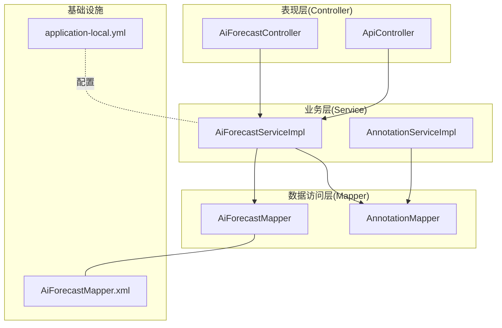
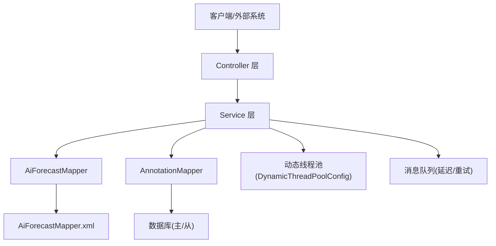
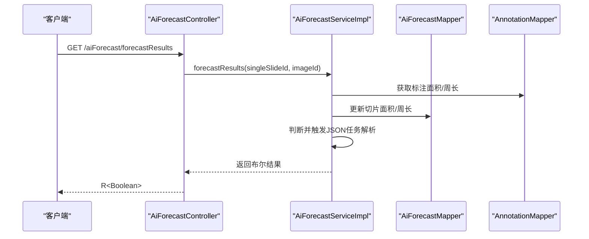
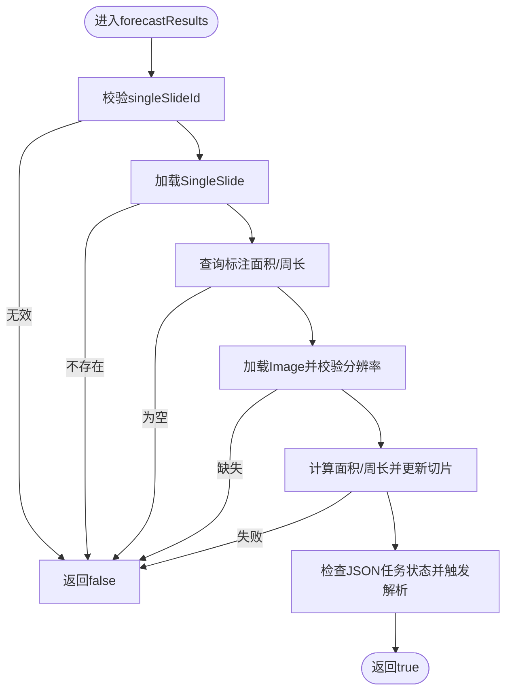
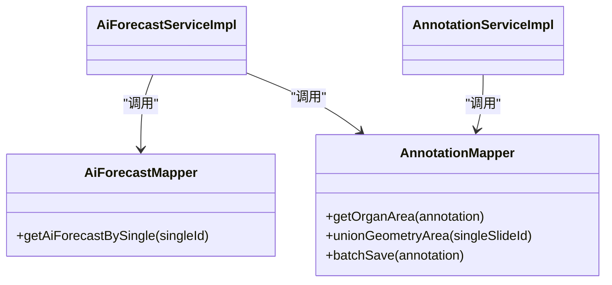
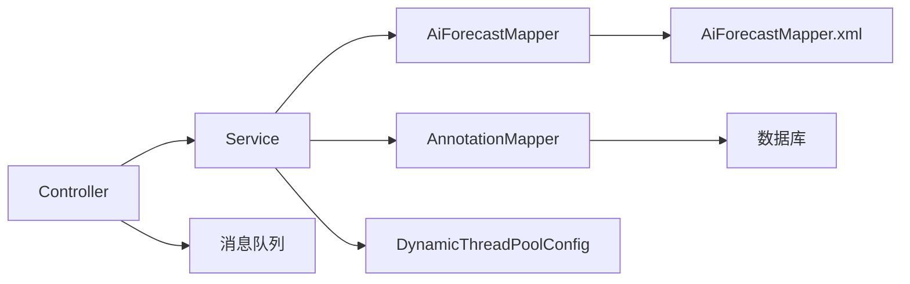

# 分层架构设计

<cite>
**本文引用的文件**
- [StaTechFrApplication.java](file://src/main/java/cn/staitech/fr/StaTechFrApplication.java)
- [AiForecastController.java](file://src/main/java/cn/staitech/fr/controller/AiForecastController.java)
- [ApiController.java](file://src/main/java/cn/staitech/fr/controller/ApiController.java)
- [AiForecastService.java](file://src/main/java/cn/staitech/fr/service/AiForecastService.java)
- [AiForecastServiceImpl.java](file://src/main/java/cn/staitech/fr/service/impl/AiForecastServiceImpl.java)
- [AiForecastMapper.java](file://src/main/java/cn/staitech/fr/mapper/AiForecastMapper.java)
- [AiForecastMapper.xml](file://src/main/resources/mapper/AiForecastMapper.xml)
- [AnnotationMapper.java](file://src/main/java/cn/staitech/fr/mapper/AnnotationMapper.java)
- [AnnotationServiceImpl.java](file://src/main/java/cn/staitech/fr/service/impl/AnnotationServiceImpl.java)
- [DynamicThreadPoolConfig.java](file://src/main/java/cn/staitech/fr/config/DynamicThreadPoolConfig.java)
- [application-local.yml](file://src/main/resources/application-local.yml)
- [AiForecast.java](file://src/main/java/cn/staitech/fr/domain/AiForecast.java)
- [IndicatorAddIn.java](file://src/main/java/cn/staitech/fr/domain/in/IndicatorAddIn.java)
- [AiForecastListOut.java](file://src/main/java/cn/staitech/fr/domain/out/AiForecastListOut.java)
</cite>

## 目录
1. [引言](#引言)
2. [项目结构](#项目结构)
3. [核心组件](#核心组件)
4. [架构总览](#架构总览)
5. [详细组件分析](#详细组件分析)
6. [依赖分析](#依赖分析)
7. [性能考虑](#性能考虑)
8. [故障排查指南](#故障排查指南)
9. [结论](#结论)

## 引言
本设计文档聚焦于FR模块的分层架构设计，围绕Controller-Service-Mapper三层结构展开，系统性阐述每层职责、接口定义、调用关系与数据流转。通过典型业务流程（如AI预测结果计算与指标持久化）展示各层协作方式，并提供架构图与调用链路图，帮助开发者快速理解与维护该模块。

## 项目结构
FR模块采用典型的分层架构组织，按功能域划分目录：
- controller：对外HTTP接口入口，负责请求接收、参数校验与响应封装
- service：业务逻辑层，包含服务接口与实现类，承担事务管理与复杂业务编排
- mapper：数据访问层，MyBatis映射接口与XML，负责SQL执行与结果映射
- domain：领域模型与输入/输出对象，承载实体与传输对象
- config：配置类，如动态线程池、数据源、拦截器等
- resources：MyBatis XML映射文件、应用配置与国际化资源

图表来源
- [AiForecastController.java:1-31](file://src/main/java/cn/staitech/fr/controller/AiForecastController.java#L1-L31)
- [ApiController.java:1-61](file://src/main/java/cn/staitech/fr/controller/ApiController.java#L1-L61)
- [AiForecastServiceImpl.java:1-372](file://src/main/java/cn/staitech/fr/service/impl/AiForecastServiceImpl.java#L1-L372)
- [AnnotationServiceImpl.java:1-79](file://src/main/java/cn/staitech/fr/service/impl/AnnotationServiceImpl.java#L1-L79)
- [AiForecastMapper.java:1-22](file://src/main/java/cn/staitech/fr/mapper/AiForecastMapper.java#L1-L22)
- [AnnotationMapper.java:1-137](file://src/main/java/cn/staitech/fr/mapper/AnnotationMapper.java#L1-L137)
- [AiForecastMapper.xml:1-39](file://src/main/resources/mapper/AiForecastMapper.xml#L1-L39)
- [application-local.yml:1-311](file://src/main/resources/application-local.yml#L1-L311)

章节来源
- [StaTechFrApplication.java:1-63](file://src/main/java/cn/staitech/fr/StaTechFrApplication.java#L1-L63)
- [application-local.yml:1-311](file://src/main/resources/application-local.yml#L1-L311)

## 核心组件
- 应用入口与配置
  - 应用入口类启用事务、异步、发现客户端、MyBatis分页插件与Mapper扫描，统一初始化消息源与时区设置。
  - 数据源配置支持主从分离，MyBatis配置扫描mapper XML与类型别名，便于跨库读写分离与SQL映射。
- 控制器层
  - AiForecastController：提供预测结果查询接口，注入SingleSlideService，返回统一响应包装。
  - ApiController：对外API接口，负责接收外部回调与延迟消息发送，封装响应。
- 业务层
  - AiForecastService接口：定义预测结果计算、指标批量新增、查询列表等能力。
  - AiForecastServiceImpl：实现预测结果计算、指标持久化、参考范围计算与统计分析，使用线程池异步解析JSON任务。
  - AnnotationServiceImpl：实现标注数据的批量处理与异常降级重试。
- 数据访问层
  - AiForecastMapper：继承MyBatis-Plus基础接口，扩展自定义查询方法。
  - AnnotationMapper：定义标注相关几何计算、合并、聚合与批量操作等方法，使用从库注解以实现读写分离。
- 领域模型与传输对象
  - AiForecast：预测结果实体，包含指标、单位、结构类型、文件路径等字段。
  - IndicatorAddIn：指标输入对象，封装英文名、结果、单位、结构类型与结构编码。
  - AiForecastListOut：指标输出对象，包含平均值±标准差、正态分布区间等。

章节来源
- [StaTechFrApplication.java:1-63](file://src/main/java/cn/staitech/fr/StaTechFrApplication.java#L1-L63)
- [AiForecastController.java:1-31](file://src/main/java/cn/staitech/fr/controller/AiForecastController.java#L1-L31)
- [ApiController.java:1-61](file://src/main/java/cn/staitech/fr/controller/ApiController.java#L1-L61)
- [AiForecastService.java:1-29](file://src/main/java/cn/staitech/fr/service/AiForecastService.java#L1-L29)
- [AiForecastServiceImpl.java:1-372](file://src/main/java/cn/staitech/fr/service/impl/AiForecastServiceImpl.java#L1-L372)
- [AnnotationServiceImpl.java:1-79](file://src/main/java/cn/staitech/fr/service/impl/AnnotationServiceImpl.java#L1-L79)
- [AiForecastMapper.java:1-22](file://src/main/java/cn/staitech/fr/mapper/AiForecastMapper.java#L1-L22)
- [AnnotationMapper.java:1-137](file://src/main/java/cn/staitech/fr/mapper/AnnotationMapper.java#L1-L137)
- [AiForecast.java:1-84](file://src/main/java/cn/staitech/fr/domain/AiForecast.java#L1-L84)
- [IndicatorAddIn.java:1-55](file://src/main/java/cn/staitech/fr/domain/in/IndicatorAddIn.java#L1-L55)
- [AiForecastListOut.java:1-43](file://src/main/java/cn/staitech/fr/domain/out/AiForecastListOut.java#L1-L43)

## 架构总览
FR模块遵循经典的三层架构：
- Controller层：面向HTTP请求，负责参数绑定、简单校验与响应封装，不直接处理复杂业务。
- Service层：承载核心业务规则，协调多个Mapper与第三方组件，保证事务一致性与异常处理策略。
- Mapper层：基于MyBatis-Plus，提供基础CRUD与复杂SQL查询，支持读写分离与分页。

图表来源
- [AiForecastController.java:1-31](file://src/main/java/cn/staitech/fr/controller/AiForecastController.java#L1-L31)
- [AiForecastServiceImpl.java:1-372](file://src/main/java/cn/staitech/fr/service/impl/AiForecastServiceImpl.java#L1-L372)
- [AiForecastMapper.java:1-22](file://src/main/java/cn/staitech/fr/mapper/AiForecastMapper.java#L1-L22)
- [AiForecastMapper.xml:1-39](file://src/main/resources/mapper/AiForecastMapper.xml#L1-L39)
- [AnnotationMapper.java:1-137](file://src/main/java/cn/staitech/fr/mapper/AnnotationMapper.java#L1-L137)
- [DynamicThreadPoolConfig.java:1-53](file://src/main/java/cn/staitech/fr/config/DynamicThreadPoolConfig.java#L1-L53)
- [application-local.yml:1-311](file://src/main/resources/application-local.yml#L1-L311)

## 详细组件分析

### Controller层职责与实现
- 请求处理
  - AiForecastController：接收单切片与图片ID参数，调用Service层计算预测结果，统一返回R<T>响应包装。
  - ApiController：接收外部回调与任务推送，封装消息后投递至消息中间件，返回统一响应。
- 参数校验与响应封装
  - 使用Swagger注解声明接口与参数，结合R<T>统一响应结构，简化前端消费与错误处理。
- 典型调用链
  - HTTP请求 → Controller → Service → Mapper → 数据库
  - 异步场景：Controller → Service → 动态线程池 → 解析器 → 结果落库

图表来源
- [AiForecastController.java:1-31](file://src/main/java/cn/staitech/fr/controller/AiForecastController.java#L1-L31)
- [AiForecastServiceImpl.java:85-157](file://src/main/java/cn/staitech/fr/service/impl/AiForecastServiceImpl.java#L85-L157)
- [AiForecastMapper.java:1-22](file://src/main/java/cn/staitech/fr/mapper/AiForecastMapper.java#L1-L22)
- [AnnotationMapper.java:1-137](file://src/main/java/cn/staitech/fr/mapper/AnnotationMapper.java#L1-L137)

章节来源
- [AiForecastController.java:1-31](file://src/main/java/cn/staitech/fr/controller/AiForecastController.java#L1-L31)
- [ApiController.java:1-61](file://src/main/java/cn/staitech/fr/controller/ApiController.java#L1-L61)

### Service层职责与实现
- 业务逻辑
  - 预测结果计算：根据切片与图像信息计算面积/周长，更新切片指标，触发异步JSON任务解析。
  - 指标持久化：支持产品呈现指标与算法输出指标两类，批量写入预测结果表。
  - 统计分析：在存在对照组时，计算平均值±标准差与正态分布区间，用于报告输出。
- 事务与异常处理
  - 使用MyBatis-Plus基础实现类，结合Spring事务管理，确保业务原子性。
  - 对异常进行捕获与日志记录，避免影响接口可用性。
- 线程池与异步
  - 使用动态线程池与TTL线程池包装，保障跨线程上下文传递与任务监控。

图表来源
- [AiForecastServiceImpl.java:85-157](file://src/main/java/cn/staitech/fr/service/impl/AiForecastServiceImpl.java#L85-L157)

章节来源
- [AiForecastService.java:1-29](file://src/main/java/cn/staitech/fr/service/AiForecastService.java#L1-L29)
- [AiForecastServiceImpl.java:1-372](file://src/main/java/cn/staitech/fr/service/impl/AiForecastServiceImpl.java#L1-L372)
- [AnnotationServiceImpl.java:1-79](file://src/main/java/cn/staitech/fr/service/impl/AnnotationServiceImpl.java#L1-L79)
- [DynamicThreadPoolConfig.java:1-53](file://src/main/java/cn/staitech/fr/config/DynamicThreadPoolConfig.java#L1-L53)

### Mapper层职责与实现
- 基础CRUD与自定义查询
  - AiForecastMapper：继承MyBatis-Plus基础接口，扩展按单切片查询统计信息的方法。
  - AnnotationMapper：提供几何计算、合并、聚合、批量操作等方法，使用从库注解实现读写分离。
- SQL映射与结果映射
  - AiForecastMapper.xml：定义结果映射与自定义查询，如按单切片统计算法耗时与模型版本。
- 数据源与分页
  - application-local.yml配置主从数据源、连接池参数与MyBatis扫描路径，支持分页插件与日志输出。

图表来源
- [AiForecastMapper.java:1-22](file://src/main/java/cn/staitech/fr/mapper/AiForecastMapper.java#L1-L22)
- [AiForecastMapper.xml:1-39](file://src/main/resources/mapper/AiForecastMapper.xml#L1-L39)
- [AnnotationMapper.java:1-137](file://src/main/java/cn/staitech/fr/mapper/AnnotationMapper.java#L1-L137)
- [AiForecastServiceImpl.java:1-372](file://src/main/java/cn/staitech/fr/service/impl/AiForecastServiceImpl.java#L1-L372)
- [AnnotationServiceImpl.java:1-79](file://src/main/java/cn/staitech/fr/service/impl/AnnotationServiceImpl.java#L1-L79)

章节来源
- [AiForecastMapper.java:1-22](file://src/main/java/cn/staitech/fr/mapper/AiForecastMapper.java#L1-L22)
- [AiForecastMapper.xml:1-39](file://src/main/resources/mapper/AiForecastMapper.xml#L1-L39)
- [AnnotationMapper.java:1-137](file://src/main/java/cn/staitech/fr/mapper/AnnotationMapper.java#L1-L137)
- [application-local.yml:1-311](file://src/main/resources/application-local.yml#L1-L311)

## 依赖分析
- 组件耦合
  - Controller仅依赖Service接口，降低对实现细节的耦合。
  - Service依赖多个Mapper与工具类，形成业务聚合点。
  - Mapper依赖MyBatis-Plus与数据库，通过XML实现SQL定制。
- 外部依赖
  - 动态线程池与消息队列用于异步任务与延迟消息处理。
  - 数据源配置支持主从分离，提升读取性能与数据一致性。

图表来源
- [AiForecastController.java:1-31](file://src/main/java/cn/staitech/fr/controller/AiForecastController.java#L1-L31)
- [AiForecastServiceImpl.java:1-372](file://src/main/java/cn/staitech/fr/service/impl/AiForecastServiceImpl.java#L1-L372)
- [AiForecastMapper.java:1-22](file://src/main/java/cn/staitech/fr/mapper/AiForecastMapper.java#L1-L22)
- [AiForecastMapper.xml:1-39](file://src/main/resources/mapper/AiForecastMapper.xml#L1-L39)
- [AnnotationMapper.java:1-137](file://src/main/java/cn/staitech/fr/mapper/AnnotationMapper.java#L1-L137)
- [DynamicThreadPoolConfig.java:1-53](file://src/main/java/cn/staitech/fr/config/DynamicThreadPoolConfig.java#L1-L53)
- [application-local.yml:1-311](file://src/main/resources/application-local.yml#L1-L311)

章节来源
- [StaTechFrApplication.java:1-63](file://src/main/java/cn/staitech/fr/StaTechFrApplication.java#L1-L63)
- [application-local.yml:1-311](file://src/main/resources/application-local.yml#L1-L311)

## 性能考虑
- 线程池与异步
  - 使用动态线程池与TTL包装，保障跨线程上下文传递与任务监控，避免主线程阻塞。
- 读写分离
  - 标注相关查询使用从库注解，减轻主库压力，提升查询吞吐。
- 分页与缓存
  - MyBatis分页插件减少一次性加载数据量，结合业务缓存策略可进一步优化。
- 数据源与连接池
  - 合理配置连接池大小、空闲超时与最大生命周期，避免连接泄漏与抖动。

## 故障排查指南
- 接口返回失败
  - 检查Controller层参数绑定与R<T>封装是否正确，定位Service层异常日志。
- 业务计算异常
  - 关注Service层try-catch块与日志输出，确认切片与图像数据是否存在、分辨率是否缺失。
- 数据库读写问题
  - 核对application-local.yml中数据源配置与从库注解使用，确认SQL映射文件与结果映射是否匹配。
- 异步任务未执行
  - 检查动态线程池配置与任务提交日志，确认消息队列配置与延迟时间设置。

章节来源
- [AiForecastController.java:1-31](file://src/main/java/cn/staitech/fr/controller/AiForecastController.java#L1-L31)
- [AiForecastServiceImpl.java:152-156](file://src/main/java/cn/staitech/fr/service/impl/AiForecastServiceImpl.java#L152-L156)
- [application-local.yml:1-311](file://src/main/resources/application-local.yml#L1-L311)

## 结论
FR模块通过清晰的分层架构实现了职责分离与高内聚低耦合的设计目标。Controller层专注接口与响应，Service层承载业务与事务，Mapper层负责数据访问与SQL映射。配合动态线程池、读写分离与统一响应封装，系统具备良好的扩展性与可维护性。建议在后续迭代中持续完善异常监控与性能观测，确保在高并发场景下的稳定性与可观测性。