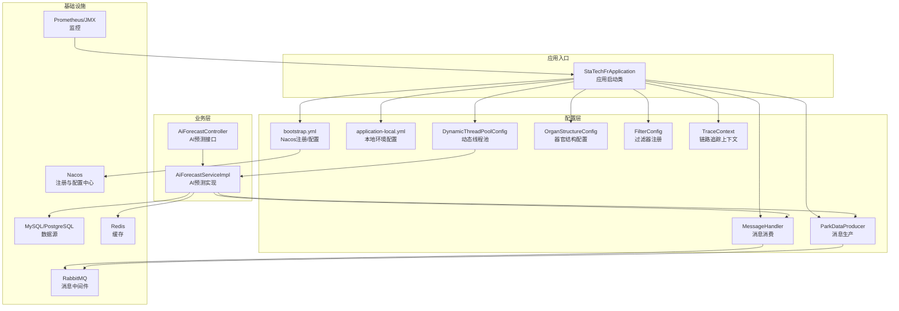
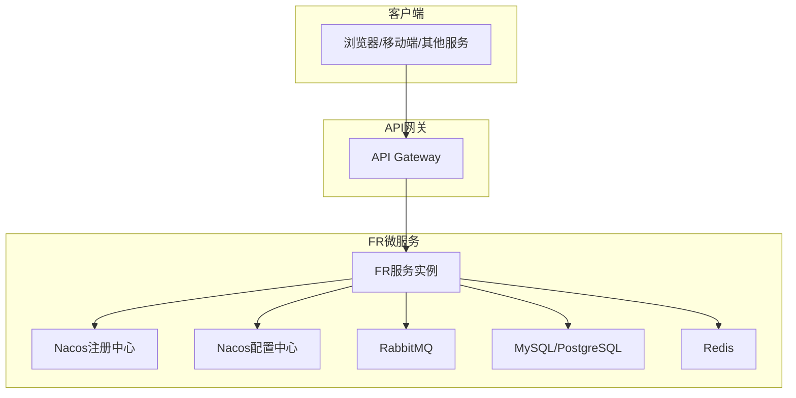
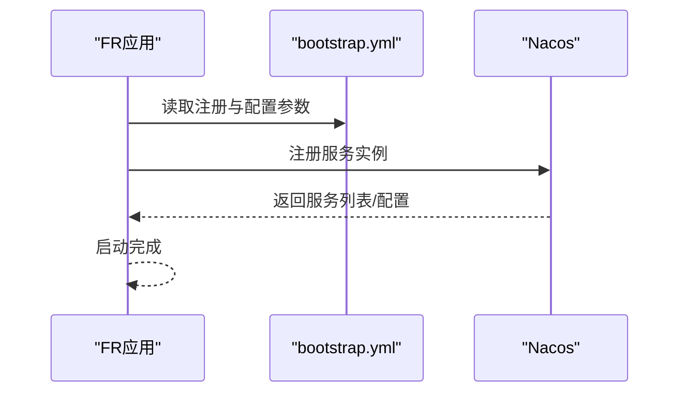
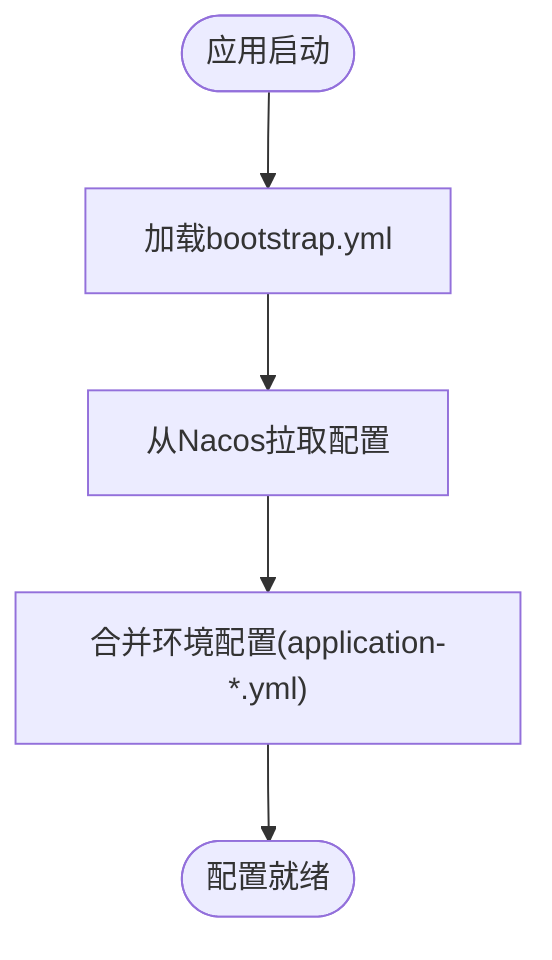
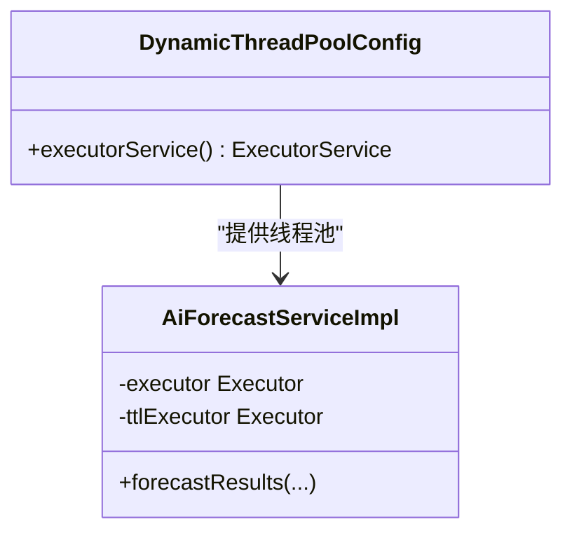
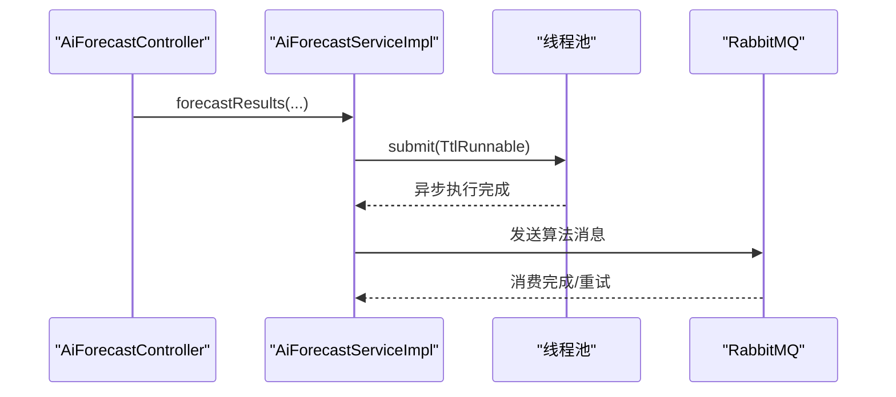
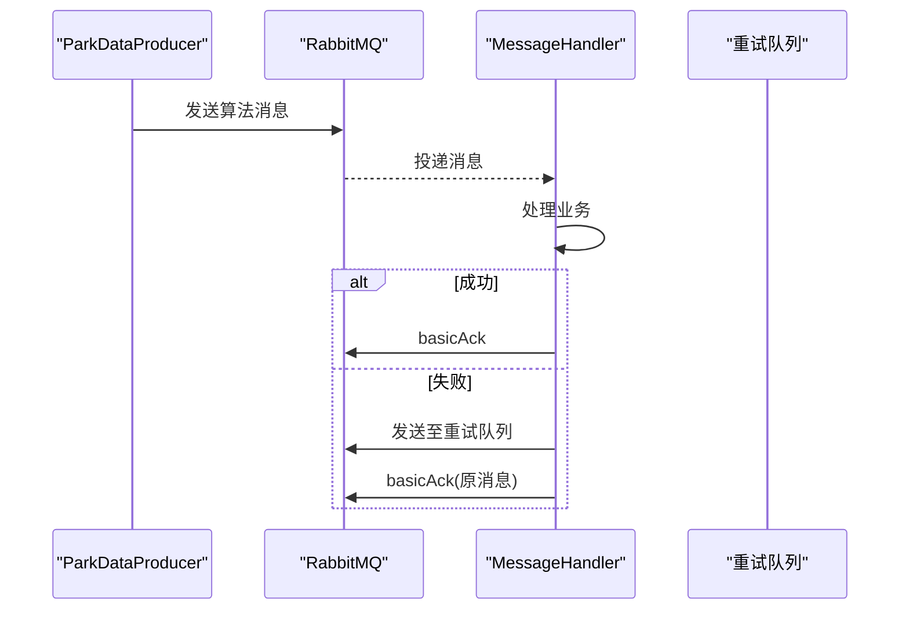
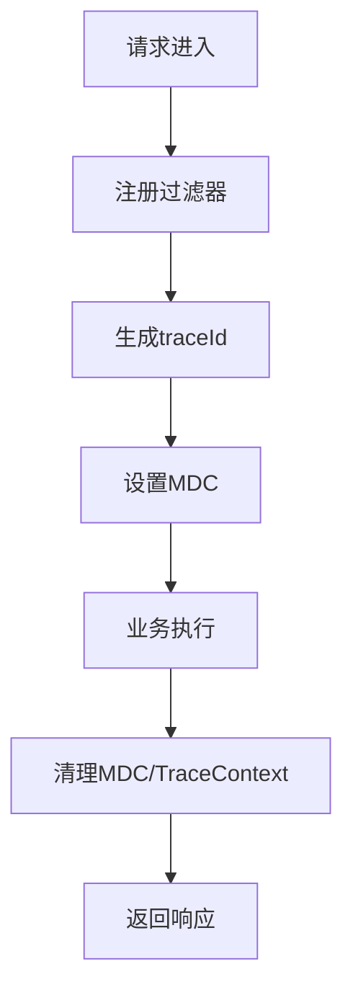
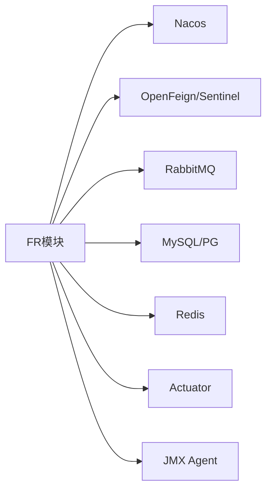
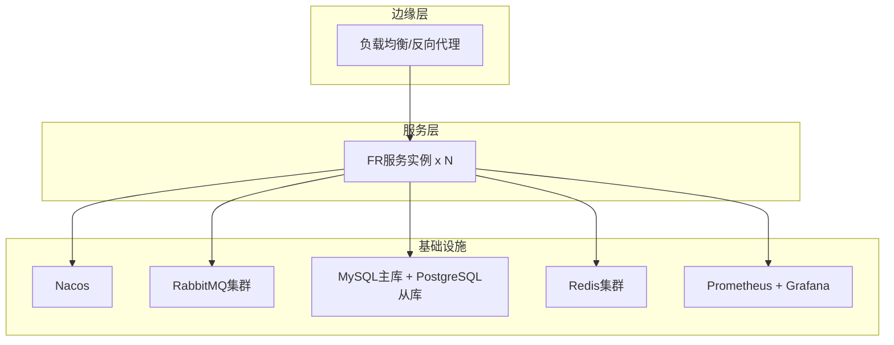

# 微服务架构设计

<cite>
**本文引用的文件**
- [StaTechFrApplication.java](file://src/main/java/cn/staitech/fr/StaTechFrApplication.java)
- [pom.xml](file://pom.xml)
- [bootstrap.yml](file://src/main/resources/bootstrap.yml)
- [application-local.yml](file://src/main/resources/application-local.yml)
- [DynamicThreadPoolConfig.java](file://src/main/java/cn/staitech/fr/config/DynamicThreadPoolConfig.java)
- [MessageHandler.java](file://src/main/java/cn/staitech/fr/config/MessageHandler.java)
- [ParkDataProducer.java](file://src/main/java/cn/staitech/fr/config/ParkDataProducer.java)
- [OrganStructureConfig.java](file://src/main/java/cn/staitech/fr/config/OrganStructureConfig.java)
- [dockerfile](file://docker/staitech/modules/fr/dockerfile)
- [AiForecastController.java](file://src/main/java/cn/staitech/fr/controller/AiForecastController.java)
- [AiForecastServiceImpl.java](file://src/main/java/cn/staitech/fr/service/impl/AiForecastServiceImpl.java)
- [FilterConfig.java](file://src/main/java/cn/staitech/fr/config/FilterConfig.java)
- [TraceContext.java](file://src/main/java/cn/staitech/fr/config/TraceContext.java)
</cite>

## 目录
1. [引言](#引言)
2. [项目结构](#项目结构)
3. [核心组件](#核心组件)
4. [架构总览](#架构总览)
5. [详细组件分析](#详细组件分析)
6. [依赖分析](#依赖分析)
7. [性能考虑](#性能考虑)
8. [故障排查指南](#故障排查指南)
9. [结论](#结论)
10. [附录](#附录)

## 引言
本文件面向FR模块的微服务架构设计，基于Spring Cloud Alibaba技术栈，围绕服务注册与发现、配置中心、负载均衡与熔断降级、动态线程池与异步处理、消息队列集成、服务间通信、API网关与安全认证等方面进行系统性说明。文档同时提供架构图与部署图，帮助读者快速理解服务拆分原则、治理策略与监控告警机制。

## 项目结构
FR模块采用标准Spring Boot工程结构，核心入口类位于应用主包内，资源文件包含引导配置与环境配置；配置层涵盖线程池、消息、过滤器、追踪上下文等；控制层提供REST接口；服务层实现业务逻辑与异步处理；资源目录包含MyBatis Mapper XML与多环境配置文件。

图表来源
- [StaTechFrApplication.java:1-63](file://src/main/java/cn/staitech/fr/StaTechFrApplication.java#L1-L63)
- [bootstrap.yml:1-48](file://src/main/resources/bootstrap.yml#L1-L48)
- [application-local.yml:1-311](file://src/main/resources/application-local.yml#L1-L311)
- [DynamicThreadPoolConfig.java:1-53](file://src/main/java/cn/staitech/fr/config/DynamicThreadPoolConfig.java#L1-L53)
- [MessageHandler.java:1-128](file://src/main/java/cn/staitech/fr/config/MessageHandler.java#L1-L128)
- [ParkDataProducer.java:1-48](file://src/main/java/cn/staitech/fr/config/ParkDataProducer.java#L1-L48)
- [OrganStructureConfig.java:1-45](file://src/main/java/cn/staitech/fr/config/OrganStructureConfig.java#L1-L45)
- [FilterConfig.java:1-22](file://src/main/java/cn/staitech/fr/config/FilterConfig.java#L1-L22)
- [TraceContext.java:1-82](file://src/main/java/cn/staitech/fr/config/TraceContext.java#L1-L82)
- [AiForecastController.java:1-31](file://src/main/java/cn/staitech/fr/controller/AiForecastController.java#L1-L31)
- [AiForecastServiceImpl.java:1-372](file://src/main/java/cn/staitech/fr/service/impl/AiForecastServiceImpl.java#L1-L372)

章节来源
- [StaTechFrApplication.java:1-63](file://src/main/java/cn/staitech/fr/StaTechFrApplication.java#L1-L63)
- [pom.xml:1-366](file://pom.xml#L1-L366)
- [bootstrap.yml:1-48](file://src/main/resources/bootstrap.yml#L1-L48)
- [application-local.yml:1-311](file://src/main/resources/application-local.yml#L1-L311)

## 核心组件
- 应用启动与装配
  - 启用服务注册、异步、事务、MyBatis分页、Swagger、自定义安全与Feign客户端等能力。
- 配置中心与注册中心
  - 通过Nacos实现服务注册与配置拉取，支持多环境profile切换。
- 动态线程池
  - 提供可观察的线程池监控与拒绝策略，结合TTL线程池包装以跨线程传递上下文。
- 消息队列
  - 基于RabbitMQ实现算法消息的生产与消费、重试队列与延迟消息。
- 过滤器与链路追踪
  - 注册全局请求过滤器，结合MDC与TransmittableThreadLocal实现跨线程链路追踪。
- 数据访问与多数据源
  - MyBatis Plus分页插件、动态数据源（MySQL主库、PostgreSQL从库）。
- 控制器与服务
  - 提供AI预测结果查询接口，服务层实现指标计算与异步任务调度。

章节来源
- [StaTechFrApplication.java:15-39](file://src/main/java/cn/staitech/fr/StaTechFrApplication.java#L15-L39)
- [bootstrap.yml:23-46](file://src/main/resources/bootstrap.yml#L23-L46)
- [application-local.yml:5-110](file://src/main/resources/application-local.yml#L5-L110)
- [DynamicThreadPoolConfig.java:13-51](file://src/main/java/cn/staitech/fr/config/DynamicThreadPoolConfig.java#L13-L51)
- [MessageHandler.java:32-75](file://src/main/java/cn/staitech/fr/config/MessageHandler.java#L32-L75)
- [ParkDataProducer.java:21-44](file://src/main/java/cn/staitech/fr/config/ParkDataProducer.java#L21-L44)
- [FilterConfig.java:14-21](file://src/main/java/cn/staitech/fr/config/FilterConfig.java#L14-L21)
- [TraceContext.java:47-80](file://src/main/java/cn/staitech/fr/config/TraceContext.java#L47-L80)
- [AiForecastController.java:23-30](file://src/main/java/cn/staitech/fr/controller/AiForecastController.java#L23-L30)
- [AiForecastServiceImpl.java:55-84](file://src/main/java/cn/staitech/fr/service/impl/AiForecastServiceImpl.java#L55-L84)

## 架构总览
FR模块基于Spring Cloud Alibaba构建，核心组件包括：
- 服务注册与发现：Nacos Discovery
- 配置中心：Nacos Config
- 安全与认证：自定义安全注解与统一鉴权（启用注解）
- 负载均衡：Ribbon（由OpenFeign默认使用）
- 熔断降级：Sentinel
- 异步处理：@Async + 自定义线程池 + TTL线程池包装
- 消息队列：RabbitMQ（队列、交换机、延迟队列、重试队列）
- API网关：未在本模块直接体现，通常由独立网关组件接入

图表来源
- [pom.xml:25-41](file://pom.xml#L25-L41)
- [bootstrap.yml:23-46](file://src/main/resources/bootstrap.yml#L23-L46)
- [application-local.yml:57-75](file://src/main/resources/application-local.yml#L57-L75)

## 详细组件分析

### 服务注册与发现机制
- 启用服务注册：应用启动类启用@EnableDiscoveryClient。
- Nacos配置：bootstrap.yml中配置server-addr、namespace、group、超时等。
- 环境切换：通过Maven profile注入Nacos地址、命名空间与组，支持local、dev、test、prod等环境。

图表来源
- [StaTechFrApplication.java:34](file://src/main/java/cn/staitech/fr/StaTechFrApplication.java#L34)
- [bootstrap.yml:23-46](file://src/main/resources/bootstrap.yml#L23-L46)

章节来源
- [StaTechFrApplication.java:34](file://src/main/java/cn/staitech/fr/StaTechFrApplication.java#L34)
- [bootstrap.yml:23-46](file://src/main/resources/bootstrap.yml#L23-L46)
- [pom.xml:303-363](file://pom.xml#L303-L363)

### 配置中心集成
- 配置文件格式：yml
- 命名空间与组：支持按环境隔离
- 共享配置：通过shared-configs加载当前profile的配置
- 动态刷新：结合Nacos Config实现配置热更新（需配合refresh注解或端点）

图表来源
- [bootstrap.yml:34-46](file://src/main/resources/bootstrap.yml#L34-L46)
- [application-local.yml:1-311](file://src/main/resources/application-local.yml#L1-L311)

章节来源
- [bootstrap.yml:34-46](file://src/main/resources/bootstrap.yml#L34-L46)
- [application-local.yml:1-311](file://src/main/resources/application-local.yml#L1-L311)

### 负载均衡策略
- Ribbon默认提供轮询策略，结合Nacos服务发现自动感知实例变化。
- Feign客户端已启用，可直接通过@FeignClient调用其他服务，自动具备负载均衡能力。

章节来源
- [StaTechFrApplication.java:32](file://src/main/java/cn/staitech/fr/StaTechFrApplication.java#L32)
- [pom.xml:25-41](file://pom.xml#L25-L41)

### 熔断降级机制
- Sentinel依赖已引入，可对HTTP与RPC调用进行限流、熔断与降级。
- 建议在Feign接口与关键业务方法上配置Sentinel规则，结合@SentinelResource实现自定义fallback。

章节来源
- [pom.xml:37-41](file://pom.xml#L37-L41)

### 动态线程池配置
- 线程池参数：核心池大小、最大池大小、存活时间、阻塞队列容量、拒绝策略。
- 监控埋点：在execute/beforeExecute/afterExecute阶段记录队列长度、活跃线程数等指标。
- TTL包装：使用TtlExecutors包装线程池，保证跨线程传递TraceContext。

图表来源
- [DynamicThreadPoolConfig.java:13-51](file://src/main/java/cn/staitech/fr/config/DynamicThreadPoolConfig.java#L13-L51)
- [AiForecastServiceImpl.java:55-57](file://src/main/java/cn/staitech/fr/service/impl/AiForecastServiceImpl.java#L55-L57)

章节来源
- [DynamicThreadPoolConfig.java:13-51](file://src/main/java/cn/staitech/fr/config/DynamicThreadPoolConfig.java#L13-L51)
- [AiForecastServiceImpl.java:55-57](file://src/main/java/cn/staitech/fr/service/impl/AiForecastServiceImpl.java#L55-L57)

### 异步处理机制
- @Async：开启异步执行，结合自定义线程池提升吞吐。
- TTLRunnable：跨线程传递TraceContext，确保日志与链路一致。
- 业务场景：在AI预测流程中，将复杂计算放入线程池异步执行。

图表来源
- [AiForecastController.java:27-30](file://src/main/java/cn/staitech/fr/controller/AiForecastController.java#L27-L30)
- [AiForecastServiceImpl.java:143-145](file://src/main/java/cn/staitech/fr/service/impl/AiForecastServiceImpl.java#L143-L145)
- [MessageHandler.java:44-75](file://src/main/java/cn/staitech/fr/config/MessageHandler.java#L44-L75)

章节来源
- [AiForecastController.java:27-30](file://src/main/java/cn/staitech/fr/controller/AiForecastController.java#L27-L30)
- [AiForecastServiceImpl.java:143-145](file://src/main/java/cn/staitech/fr/service/impl/AiForecastServiceImpl.java#L143-L145)

### 消息队列集成
- 生产者：ParkDataProducer封装convertAndSend，支持普通消息与延迟消息。
- 消费者：MessageHandler监听算法队列，手动ACK；异常时发送至重试队列；支持延迟检查队列。
- 配置项：队列名、重试队列名、延迟时间等来自application-local.yml。
- 交换机与路由键：通过配置的exchange/routingKey绑定队列。

图表来源
- [ParkDataProducer.java:27-44](file://src/main/java/cn/staitech/fr/config/ParkDataProducer.java#L27-L44)
- [MessageHandler.java:44-75](file://src/main/java/cn/staitech/fr/config/MessageHandler.java#L44-L75)
- [application-local.yml:305-311](file://src/main/resources/application-local.yml#L305-L311)

章节来源
- [ParkDataProducer.java:27-44](file://src/main/java/cn/staitech/fr/config/ParkDataProducer.java#L27-L44)
- [MessageHandler.java:44-75](file://src/main/java/cn/staitech/fr/config/MessageHandler.java#L44-L75)
- [application-local.yml:305-311](file://src/main/resources/application-local.yml#L305-L311)

### 服务间通信方式
- 内部服务：通过Feign声明式HTTP调用，自动集成Ribbon负载均衡与Sentinel熔断。
- 外部服务：通过HTTP客户端或SDK访问，建议统一在common模块封装。

章节来源
- [StaTechFrApplication.java:32](file://src/main/java/cn/staitech/fr/StaTechFrApplication.java#L32)
- [pom.xml:25-41](file://pom.xml#L25-L41)

### API网关使用与安全认证
- API网关：本模块未直接包含网关实现，通常由独立网关组件统一接入鉴权与路由。
- 认证：启用自定义安全注解与统一鉴权，建议在网关层集中处理JWT/Token校验与权限控制。

章节来源
- [StaTechFrApplication.java:30-32](file://src/main/java/cn/staitech/fr/StaTechFrApplication.java#L30-L32)

### 数据访问与多数据源
- 分页插件：MyBatis Plus分页拦截器。
- 多数据源：基于dynamic-datasource，配置master/slave，指定primary。
- Redis：用于缓存与会话存储。
- RabbitMQ：消息生产与消费。

章节来源
- [StaTechFrApplication.java:54-60](file://src/main/java/cn/staitech/fr/StaTechFrApplication.java#L54-L60)
- [application-local.yml:15-56](file://src/main/resources/application-local.yml#L15-L56)
- [application-local.yml:57-75](file://src/main/resources/application-local.yml#L57-L75)

### 过滤器与链路追踪
- 过滤器：FilterConfig注册全局请求过滤器，拦截所有请求。
- 追踪上下文：TraceContext使用TransmittableThreadLocal与MDC，生成并传递traceId，支持跨线程传播。

图表来源
- [FilterConfig.java:14-21](file://src/main/java/cn/staitech/fr/config/FilterConfig.java#L14-L21)
- [TraceContext.java:47-80](file://src/main/java/cn/staitech/fr/config/TraceContext.java#L47-L80)

章节来源
- [FilterConfig.java:14-21](file://src/main/java/cn/staitech/fr/config/FilterConfig.java#L14-L21)
- [TraceContext.java:47-80](file://src/main/java/cn/staitech/fr/config/TraceContext.java#L47-L80)

## 依赖分析
- Spring Cloud Alibaba生态：Nacos Discovery/Config、Sentinel、OpenFeign。
- 消息中间件：RabbitMQ Starter。
- 数据访问：MyBatis Plus、动态数据源、MySQL/PG驱动。
- 监控：Actuator、JMX Agent（Prometheus）。
- 工具库：Hutool、EasyExcel、Geo工具集等。

图表来源
- [pom.xml:25-98](file://pom.xml#L25-L98)

章节来源
- [pom.xml:25-98](file://pom.xml#L25-L98)

## 性能考虑
- 线程池调优：根据CPU核数与任务特征调整核心/最大池大小、队列容量与拒绝策略；结合监控指标持续优化。
- 消息消费：合理设置消费者并发、手动ACK与重试次数，避免重复消费与堆积。
- 数据库：读写分离、连接池参数、慢查询与索引优化。
- 缓存：热点数据缓存、过期策略与缓存穿透防护。
- 熔断与限流：针对下游依赖设置合理的阈值与fallback策略，避免级联故障。

## 故障排查指南
- 链路追踪：通过TraceContext生成的traceId串联请求生命周期，结合日志定位问题。
- 消息问题：检查队列、交换机、路由键配置；确认ACK/NACK行为与重试队列是否生效。
- 线程池问题：关注队列长度、活跃线程数、拒绝次数与任务耗时，必要时扩容或降载。
- 配置问题：确认bootstrap.yml中的Nacos地址、命名空间与组是否正确，以及共享配置是否加载成功。

章节来源
- [TraceContext.java:47-80](file://src/main/java/cn/staitech/fr/config/TraceContext.java#L47-L80)
- [MessageHandler.java:44-75](file://src/main/java/cn/staitech/fr/config/MessageHandler.java#L44-L75)
- [DynamicThreadPoolConfig.java:28-46](file://src/main/java/cn/staitech/fr/config/DynamicThreadPoolConfig.java#L28-L46)
- [bootstrap.yml:23-46](file://src/main/resources/bootstrap.yml#L23-L46)

## 结论
FR模块基于Spring Cloud Alibaba实现了高可用、可扩展的微服务体系。通过Nacos实现服务治理，结合Sentinel保障稳定性，利用RabbitMQ实现异步解耦，配合动态线程池与TTL上下文实现高性能与可观测性。建议在网关层统一接入安全认证与路由策略，并完善监控告警体系以支撑生产环境的稳定运行。

## 附录

### 部署架构图

图表来源
- [dockerfile:16-22](file://docker/staitech/modules/fr/dockerfile#L16-L22)
- [application-local.yml:57-75](file://src/main/resources/application-local.yml#L57-L75)

### 服务拆分原则与治理策略
- 原则：按业务域与职责划分服务边界，单一职责、高内聚低耦合。
- 治理：统一注册与配置、限流熔断、灰度发布、蓝绿/金丝雀发布、自动扩缩容。
- 监控：指标采集、日志聚合、链路追踪、告警联动。

### 关键配置清单
- Nacos注册与配置
  - server-addr、namespace、group、file-extension、shared-configs
- 数据源
  - dynamic-datasource（master/slave）、连接池参数
- RabbitMQ
  - 主机、端口、虚拟主机、用户名/密码、队列名、重试与延迟配置
- 线程池
  - 核心/最大池大小、队列容量、拒绝策略、监控日志

章节来源
- [bootstrap.yml:23-46](file://src/main/resources/bootstrap.yml#L23-L46)
- [application-local.yml:15-75](file://src/main/resources/application-local.yml#L15-L75)
- [application-local.yml:305-311](file://src/main/resources/application-local.yml#L305-L311)