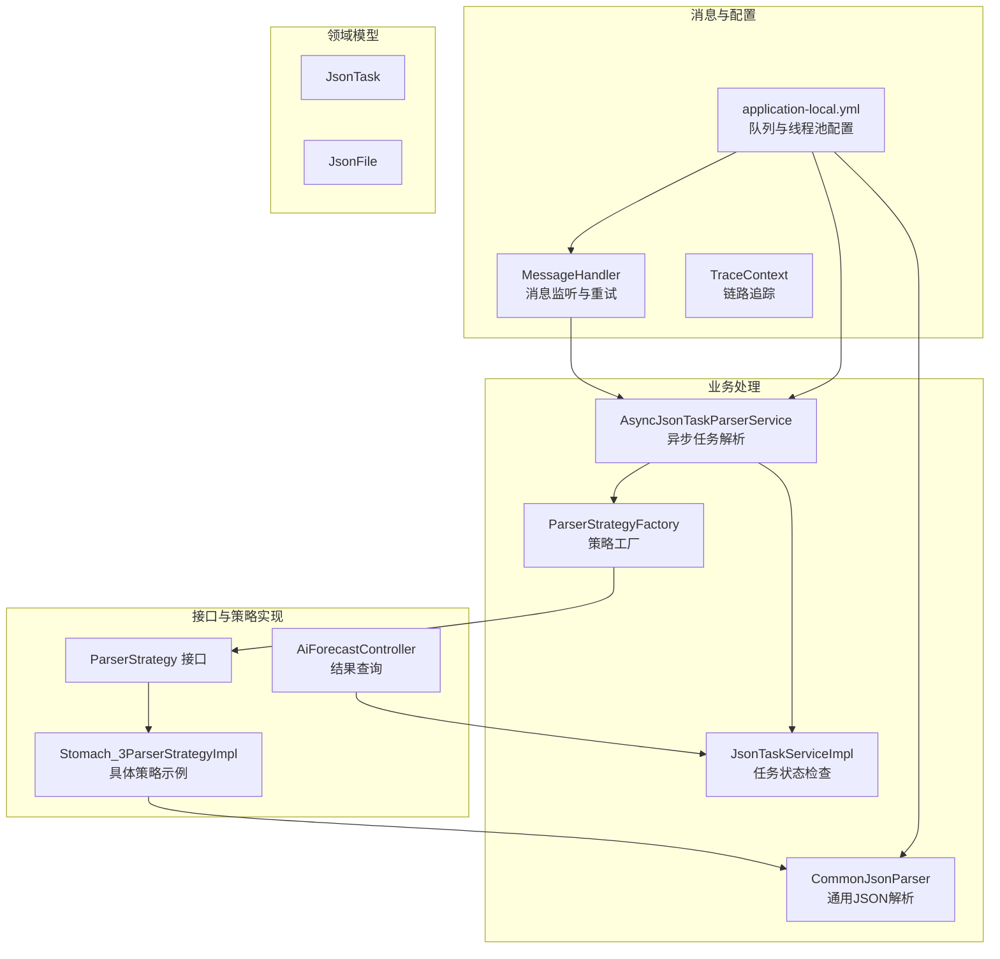
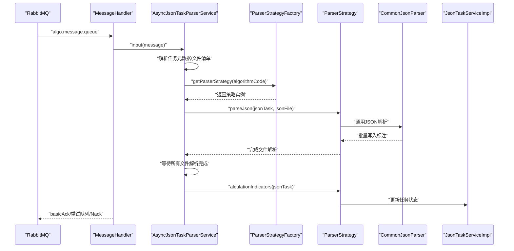
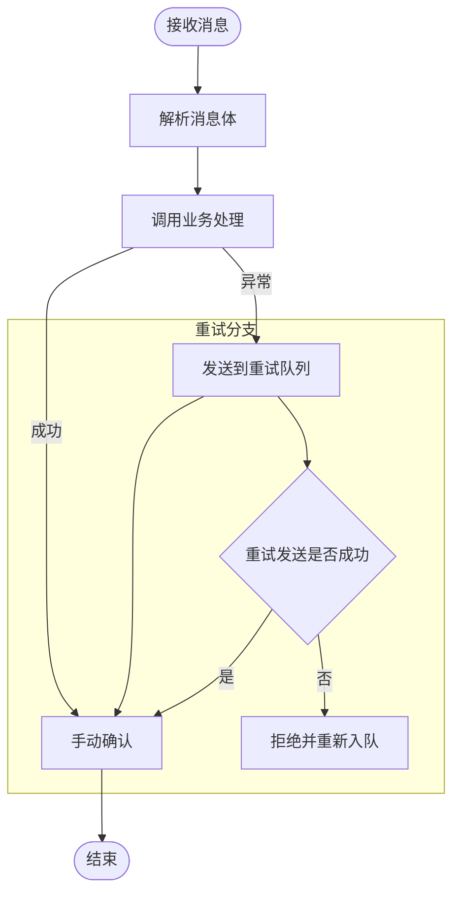
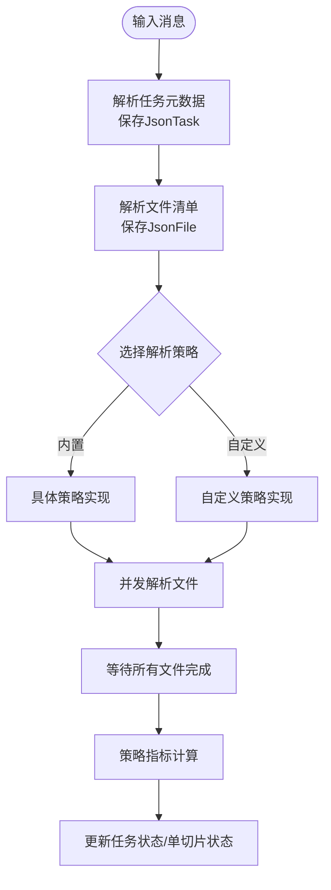
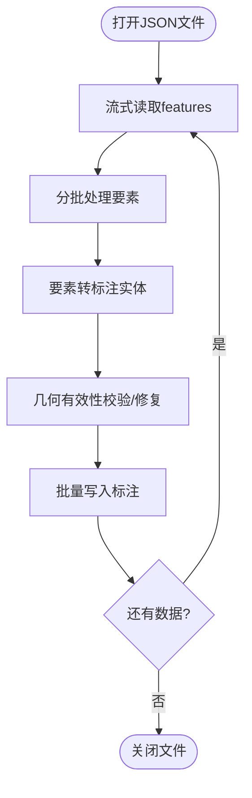
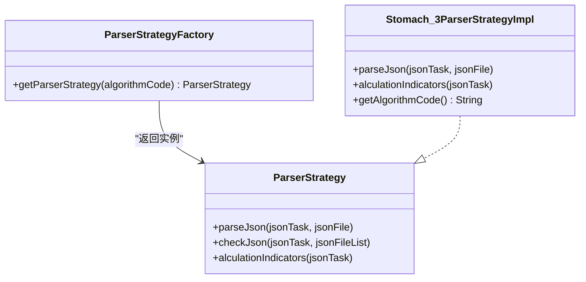
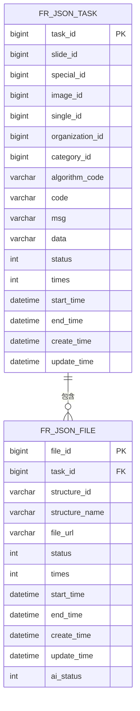
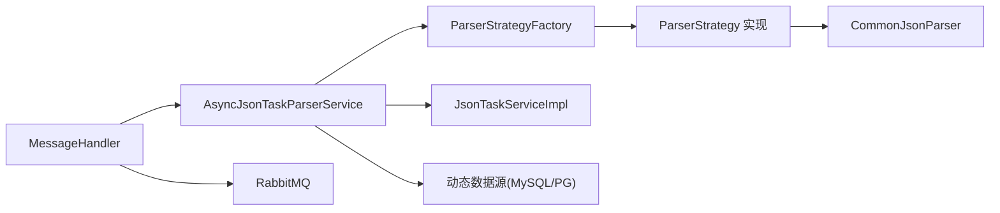

# 数据流设计

<cite>
**本文档引用的文件**
- [StaTechFrApplication.java](file://src/main/java/cn/staitech/fr/StaTechFrApplication.java)
- [MessageHandler.java](file://src/main/java/cn/staitech/fr/config/MessageHandler.java)
- [AsyncJsonTaskParserService.java](file://src/main/java/cn/staitech/fr/service/strategy/json/AsyncJsonTaskParserService.java)
- [JsonTaskServiceImpl.java](file://src/main/java/cn/staitech/fr/service/impl/JsonTaskServiceImpl.java)
- [ParserStrategyFactory.java](file://src/main/java/cn/staitech/fr/service/strategy/json/ParserStrategyFactory.java)
- [CommonJsonParser.java](file://src/main/java/cn/staitech/fr/service/strategy/json/CommonJsonParser.java)
- [JsonTask.java](file://src/main/java/cn/staitech/fr/domain/JsonTask.java)
- [JsonFile.java](file://src/main/java/cn/staitech/fr/domain/JsonFile.java)
- [JsonTaskStatusEnum.java](file://src/main/java/cn/staitech/fr/enums/JsonTaskStatusEnum.java)
- [AiForecastController.java](file://src/main/java/cn/staitech/fr/controller/AiForecastController.java)
- [ParserStrategy.java](file://src/main/java/cn/staitech/fr/service/strategy/json/ParserStrategy.java)
- [Stomach_3ParserStrategyImpl.java](file://src/main/java/cn/staitech/fr/service/strategy/json/impl/dog/digestive/Stomach_3ParserStrategyImpl.java)
- [application-local.yml](file://src/main/resources/application-local.yml)
- [TraceContext.java](file://src/main/java/cn/staitech/fr/config/TraceContext.java)
</cite>

## 目录
1. [引言](#引言)
2. [项目结构](#项目结构)
3. [核心组件](#核心组件)
4. [架构总览](#架构总览)
5. [详细组件分析](#详细组件分析)
6. [依赖分析](#依赖分析)
7. [性能考虑](#性能考虑)
8. [故障排查指南](#故障排查指南)
9. [结论](#结论)
10. [附录](#附录)

## 引言
本文件面向FR模块的数据流设计，系统性阐述从原始JSON消息到最终AI预测结果的完整数据流转过程。重点覆盖以下方面：
- JSON文件解析流程：消息接收、任务元数据解析、文件清单解析、策略选择与分发。
- AI算法处理流程：基于算法标识选择解析策略，逐文件解析GeoJSON要素，批量写入标注数据，指标计算与落库。
- 数据验证与转换流程：结构映射校验、坐标分辨率换算、几何有效性校验与修复、动态指标聚合。
- 异步消息处理机制：RabbitMQ消费者、手动确认、重试队列、延迟消息。
- 缓存策略与数据同步：结构映射缓存、定位表序列号缓存、批量写入与事务控制。
- 数据流向图与时序图：明确各组件职责与交互顺序。

## 项目结构
FR模块采用分层架构与策略模式结合，核心目录与职责如下：
- config：消息监听与追踪上下文
- service.strategy.json：解析策略工厂与通用解析器
- service.impl：任务状态检查与持久化
- domain：数据模型（任务、文件、单切片等）
- controller：对外接口（如AI预测结果查询）
- resources：应用配置（RabbitMQ、队列、动态线程池）

图表来源
- [MessageHandler.java:43-76](file://src/main/java/cn/staitech/fr/config/MessageHandler.java#L43-L76)
- [AsyncJsonTaskParserService.java:68-213](file://src/main/java/cn/staitech/fr/service/strategy/json/AsyncJsonTaskParserService.java#L68-L213)
- [ParserStrategyFactory.java:39-41](file://src/main/java/cn/staitech/fr/service/strategy/json/ParserStrategyFactory.java#L39-L41)
- [CommonJsonParser.java:209-297](file://src/main/java/cn/staitech/fr/service/strategy/json/CommonJsonParser.java#L209-L297)
- [JsonTaskServiceImpl.java:32-52](file://src/main/java/cn/staitech/fr/service/impl/JsonTaskServiceImpl.java#L32-L52)
- [AiForecastController.java:27-30](file://src/main/java/cn/staitech/fr/controller/AiForecastController.java#L27-L30)
- [application-local.yml:57-75](file://src/main/resources/application-local.yml#L57-L75)

章节来源
- [StaTechFrApplication.java:39-62](file://src/main/java/cn/staitech/fr/StaTechFrApplication.java#L39-L62)
- [application-local.yml:57-75](file://src/main/resources/application-local.yml#L57-L75)

## 核心组件
- 消息监听与处理：负责接收算法回调消息，手动确认，异常时进入重试队列；支持延迟消息检查。
- 异步任务解析器：解析任务元数据与文件清单，按算法标识选择解析策略，多文件并发解析，最后统一指标计算。
- 策略工厂：集中管理解析策略，按算法标识快速获取对应策略实例。
- 通用JSON解析器：流式解析GeoJSON要素，批量写入标注，计算面积/周长并进行几何有效性校验与修复。
- 任务状态服务：根据延迟检查结果更新任务状态与单切片预测状态。
- 控制器：对外提供AI预测结果查询接口。

章节来源
- [MessageHandler.java:44-86](file://src/main/java/cn/staitech/fr/config/MessageHandler.java#L44-L86)
- [AsyncJsonTaskParserService.java:68-213](file://src/main/java/cn/staitech/fr/service/strategy/json/AsyncJsonTaskParserService.java#L68-L213)
- [ParserStrategyFactory.java:39-41](file://src/main/java/cn/staitech/fr/service/strategy/json/ParserStrategyFactory.java#L39-L41)
- [CommonJsonParser.java:209-297](file://src/main/java/cn/staitech/fr/service/strategy/json/CommonJsonParser.java#L209-L297)
- [JsonTaskServiceImpl.java:32-52](file://src/main/java/cn/staitech/fr/service/impl/JsonTaskServiceImpl.java#L32-L52)
- [AiForecastController.java:27-30](file://src/main/java/cn/staitech/fr/controller/AiForecastController.java#L27-L30)

## 架构总览
FR模块数据流自下而上分为三层：
- 消息层：RabbitMQ队列接收算法回调，消费者手动确认，异常重试与延迟检查。
- 业务层：异步任务解析器协调策略工厂与通用解析器，完成标注入库与指标计算。
- 接口层：控制器提供查询接口，配合任务状态服务保障一致性。

图表来源
- [MessageHandler.java:44-86](file://src/main/java/cn/staitech/fr/config/MessageHandler.java#L44-L86)
- [AsyncJsonTaskParserService.java:68-213](file://src/main/java/cn/staitech/fr/service/strategy/json/AsyncJsonTaskParserService.java#L68-L213)
- [ParserStrategyFactory.java:39-41](file://src/main/java/cn/staitech/fr/service/strategy/json/ParserStrategyFactory.java#L39-L41)
- [CommonJsonParser.java:209-297](file://src/main/java/cn/staitech/fr/service/strategy/json/CommonJsonParser.java#L209-L297)
- [JsonTaskServiceImpl.java:32-52](file://src/main/java/cn/staitech/fr/service/impl/JsonTaskServiceImpl.java#L32-L52)

## 详细组件分析

### 消息处理与重试机制
- 消费者监听主队列，手动确认消息；业务异常时发送至重试队列并确认原消息；若重试发送失败则拒绝并重新入队。
- 支持延迟消息检查队列，定时轮询检查任务状态，失败则标记为解析失败并更新单切片预测状态。

图表来源
- [MessageHandler.java:44-86](file://src/main/java/cn/staitech/fr/config/MessageHandler.java#L44-L86)
- [MessageHandler.java:102-127](file://src/main/java/cn/staitech/fr/config/MessageHandler.java#L102-L127)

章节来源
- [MessageHandler.java:44-86](file://src/main/java/cn/staitech/fr/config/MessageHandler.java#L44-L86)
- [JsonTaskServiceImpl.java:32-52](file://src/main/java/cn/staitech/fr/service/impl/JsonTaskServiceImpl.java#L32-L52)

### 异步任务解析流程
- 输入消息解析为任务元数据与文件清单，持久化任务与文件记录。
- 依据算法标识选择解析策略，多文件并发提交至线程池执行，使用CountDownLatch等待全部完成。
- 全部文件解析完成后，调用策略指标计算，更新任务状态与单切片预测状态。

图表来源
- [AsyncJsonTaskParserService.java:68-213](file://src/main/java/cn/staitech/fr/service/strategy/json/AsyncJsonTaskParserService.java#L68-L213)
- [ParserStrategyFactory.java:39-41](file://src/main/java/cn/staitech/fr/service/strategy/json/ParserStrategyFactory.java#L39-L41)
- [Stomach_3ParserStrategyImpl.java:52-69](file://src/main/java/cn/staitech/fr/service/strategy/json/impl/dog/digestive/Stomach_3ParserStrategyImpl.java#L52-L69)

章节来源
- [AsyncJsonTaskParserService.java:68-213](file://src/main/java/cn/staitech/fr/service/strategy/json/AsyncJsonTaskParserService.java#L68-L213)

### 通用JSON解析与数据转换
- 流式解析GeoJSON features，按批次处理要素，转换为标注实体并批量写入。
- 计算面积与周长，依据图像分辨率进行单位换算；对几何有效性进行校验与修复。
- 提供脏器轮廓面积、内外部区域计算、动态指标聚合等能力。

图表来源
- [CommonJsonParser.java:209-297](file://src/main/java/cn/staitech/fr/service/strategy/json/CommonJsonParser.java#L209-L297)

章节来源
- [CommonJsonParser.java:209-297](file://src/main/java/cn/staitech/fr/service/strategy/json/CommonJsonParser.java#L209-L297)

### 策略接口与实现
- ParserStrategy定义解析与指标计算接口，具体策略实现按算法标识注册到工厂。
- 示例策略实现继承抽象基类，复用通用解析与校验工具，完成特定指标计算。

图表来源
- [ParserStrategy.java:14-32](file://src/main/java/cn/staitech/fr/service/strategy/json/ParserStrategy.java#L14-L32)
- [ParserStrategyFactory.java:39-41](file://src/main/java/cn/staitech/fr/service/strategy/json/ParserStrategyFactory.java#L39-L41)
- [Stomach_3ParserStrategyImpl.java:51-74](file://src/main/java/cn/staitech/fr/service/strategy/json/impl/dog/digestive/Stomach_3ParserStrategyImpl.java#L51-L74)

章节来源
- [ParserStrategy.java:14-32](file://src/main/java/cn/staitech/fr/service/strategy/json/ParserStrategy.java#L14-L32)
- [ParserStrategyFactory.java:39-41](file://src/main/java/cn/staitech/fr/service/strategy/json/ParserStrategyFactory.java#L39-L41)
- [Stomach_3ParserStrategyImpl.java:51-74](file://src/main/java/cn/staitech/fr/service/strategy/json/impl/dog/digestive/Stomach_3ParserStrategyImpl.java#L51-L74)

### 数据模型与状态
- JsonTask：承载任务元数据、状态与时间戳；用于跟踪解析进度与结果。
- JsonFile：承载单个JSON文件的解析状态与时间戳；用于并发解析与回溯。
- JsonTaskStatusEnum：定义任务状态枚举，便于状态机管理。

图表来源
- [JsonTask.java:26-67](file://src/main/java/cn/staitech/fr/domain/JsonTask.java#L26-L67)
- [JsonFile.java:22-50](file://src/main/java/cn/staitech/fr/domain/JsonFile.java#L22-L50)

章节来源
- [JsonTask.java:26-67](file://src/main/java/cn/staitech/fr/domain/JsonTask.java#L26-L67)
- [JsonFile.java:22-50](file://src/main/java/cn/staitech/fr/domain/JsonFile.java#L22-L50)
- [JsonTaskStatusEnum.java:6-15](file://src/main/java/cn/staitech/fr/enums/JsonTaskStatusEnum.java#L6-L15)

### 接口与查询
- AiForecastController提供预测结果查询接口，内部委托单切片服务判断是否可查询。

章节来源
- [AiForecastController.java:27-30](file://src/main/java/cn/staitech/fr/controller/AiForecastController.java#L27-L30)

## 依赖分析
- 组件耦合
  - MessageHandler依赖RabbitTemplate与JsonTaskParserService，负责消息路由与重试。
  - AsyncJsonTaskParserService依赖策略工厂、通用解析器、单切片与任务服务，承担编排职责。
  - ParserStrategyFactory集中注册策略，降低调用方耦合。
  - CommonJsonParser依赖标注与图像映射，提供通用解析能力。
- 外部依赖
  - RabbitMQ：消息队列与手动确认。
  - MySQL/PostgreSQL：动态数据源，支持读写分离。
  - Redis：本地配置示例中存在，可用于缓存（需结合实际使用）。

图表来源
- [MessageHandler.java:44-86](file://src/main/java/cn/staitech/fr/config/MessageHandler.java#L44-L86)
- [AsyncJsonTaskParserService.java:68-213](file://src/main/java/cn/staitech/fr/service/strategy/json/AsyncJsonTaskParserService.java#L68-L213)
- [ParserStrategyFactory.java:39-41](file://src/main/java/cn/staitech/fr/service/strategy/json/ParserStrategyFactory.java#L39-L41)
- [CommonJsonParser.java:209-297](file://src/main/java/cn/staitech/fr/service/strategy/json/CommonJsonParser.java#L209-L297)
- [JsonTaskServiceImpl.java:32-52](file://src/main/java/cn/staitech/fr/service/impl/JsonTaskServiceImpl.java#L32-L52)

章节来源
- [application-local.yml:15-56](file://src/main/resources/application-local.yml#L15-L56)

## 性能考虑
- 并发解析：使用线程池并发解析多个JSON文件，队列容量与拒绝策略保证稳定性。
- 流式解析：采用Jackson流式解析，减少内存占用，提升大文件处理效率。
- 批量写入：按批次处理要素并批量写入，降低数据库压力。
- 缓存策略：结构映射与定位表序列号缓存，避免重复查询。
- 动态指标：使用线程池并行处理动态数据，提升指标聚合效率。

章节来源
- [AsyncJsonTaskParserService.java:30-42](file://src/main/java/cn/staitech/fr/service/strategy/json/AsyncJsonTaskParserService.java#L30-L42)
- [CommonJsonParser.java:224-297](file://src/main/java/cn/staitech/fr/service/strategy/json/CommonJsonParser.java#L224-L297)
- [application-local.yml:309-311](file://src/main/resources/application-local.yml#L309-L311)

## 故障排查指南
- 消息处理失败
  - 检查重试队列是否启用与路由配置；确认手动确认与Nack逻辑。
  - 查看TraceContext生成的traceId，结合日志定位问题。
- 任务状态异常
  - 检查JsonTaskStatusEnum状态流转；确认延迟检查队列是否正确更新状态。
- 解析异常
  - 核对算法标识是否匹配策略；检查文件URL与后缀；查看几何有效性校验与修复日志。
- 数据库连接
  - 核对动态数据源配置与连接池参数；关注只读库连接情况。

章节来源
- [MessageHandler.java:44-86](file://src/main/java/cn/staitech/fr/config/MessageHandler.java#L44-L86)
- [JsonTaskServiceImpl.java:32-52](file://src/main/java/cn/staitech/fr/service/impl/JsonTaskServiceImpl.java#L32-L52)
- [TraceContext.java:47-80](file://src/main/java/cn/staitech/fr/config/TraceContext.java#L47-L80)
- [application-local.yml:15-56](file://src/main/resources/application-local.yml#L15-L56)

## 结论
FR模块通过“消息驱动 + 策略编排 + 流式解析 + 批量写入”的组合，实现了从算法回调到AI预测结果的高效闭环。异步与并发设计提升了吞吐，缓存与校验保障了准确性与稳定性。建议持续优化策略注册与监控告警，确保大规模场景下的可靠性与可观测性。

## 附录
- 关键配置项
  - RabbitMQ队列与确认模式、重试次数与间隔
  - 动态数据源主从配置
  - 动态线程池核心/最大线程数
- 常见问题
  - 策略未注册：检查算法标识与@Component命名一致性
  - 文件解析失败：检查文件路径、后缀与权限
  - 指标为空：检查结构映射与几何有效性

章节来源
- [application-local.yml:57-75](file://src/main/resources/application-local.yml#L57-L75)
- [application-local.yml:15-56](file://src/main/resources/application-local.yml#L15-L56)
- [application-local.yml:309-311](file://src/main/resources/application-local.yml#L309-L311)