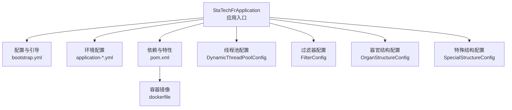
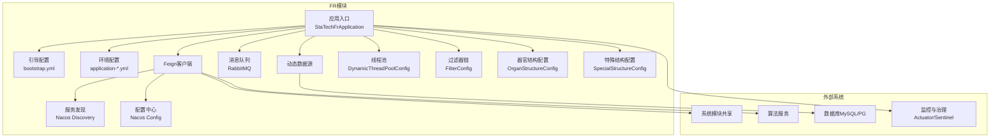
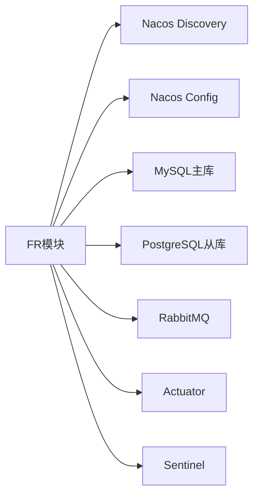
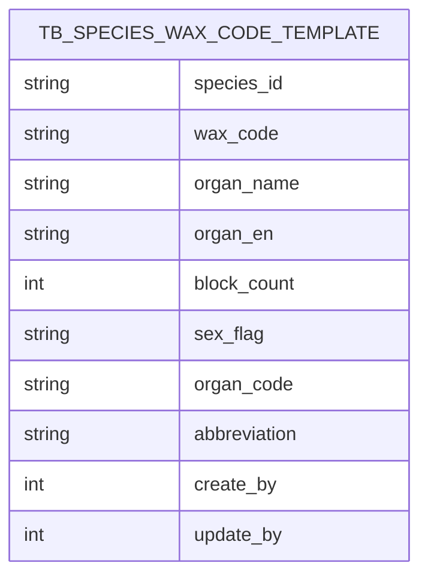

# 整体架构概览

<cite>
**本文引用的文件**
- [StaTechFrApplication.java](file://src/main/java/cn/staitech/fr/StaTechFrApplication.java)
- [pom.xml](file://pom.xml)
- [bootstrap.yml](file://src/main/resources/bootstrap.yml)
- [application-local.yml](file://src/main/resources/application-local.yml)
- [dockerfile](file://docker/staitech/modules/fr/dockerfile)
- [DynamicThreadPoolConfig.java](file://src/main/java/cn/staitech/fr/config/DynamicThreadPoolConfig.java)
- [FilterConfig.java](file://src/main/java/cn/staitech/fr/config/FilterConfig.java)
- [OrganStructureConfig.java](file://src/main/java/cn/staitech/fr/config/OrganStructureConfig.java)
- [SpecialStructureConfig.java](file://src/main/java/cn/staitech/fr/config/SpecialStructureConfig.java)
- [V2.6.1_production-Mysql.sql](file://sql/V2.6.1_production-Mysql.sql)
</cite>

## 目录
1. [引言](#引言)
2. [项目结构](#项目结构)
3. [核心组件](#核心组件)
4. [架构总览](#架构总览)
5. [详细组件分析](#详细组件分析)
6. [依赖分析](#依赖分析)
7. [性能考虑](#性能考虑)
8. [故障排查指南](#故障排查指南)
9. [结论](#结论)
10. [附录](#附录)

## 引言
本文件面向数字阅片平台（PACMVS）中的FR模块，提供基于Spring Boot的微服务架构概览文档。重点阐述FR模块在系统中的定位、职责边界、与PACMVS其他模块的交互关系，以及围绕服务发现、配置管理、负载均衡、线程池治理、过滤链路、动态数据源与消息队列等核心能力的设计理念与实现要点。文档同时给出系统架构图与部署拓扑图，帮助读者快速把握FR模块的整体设计与运行机制。

## 项目结构
FR模块采用标准Spring Boot工程结构，按功能域划分了配置、常量、控制器、领域模型、枚举、持久层、服务层、工具与资源文件等层次。核心入口类启用服务注册、配置中心、安全与Swagger等能力；构建脚本通过Maven Profile支持多环境配置与资源打包；Dockerfile定义容器化运行方式。

**图表来源**
- [StaTechFrApplication.java:39-62](file://src/main/java/cn/staitech/fr/StaTechFrApplication.java#L39-L62)
- [bootstrap.yml:1-48](file://src/main/resources/bootstrap.yml#L1-L48)
- [application-local.yml:1-311](file://src/main/resources/application-local.yml#L1-L311)
- [pom.xml:1-366](file://pom.xml#L1-L366)
- [dockerfile:1-22](file://docker/staitech/modules/fr/dockerfile#L1-L22)
- [DynamicThreadPoolConfig.java:12-51](file://src/main/java/cn/staitech/fr/config/DynamicThreadPoolConfig.java#L12-L51)
- [FilterConfig.java:11-21](file://src/main/java/cn/staitech/fr/config/FilterConfig.java#L11-L21)
- [OrganStructureConfig.java:11-44](file://src/main/java/cn/staitech/fr/config/OrganStructureConfig.java#L11-L44)
- [SpecialStructureConfig.java:22-75](file://src/main/java/cn/staitech/fr/config/SpecialStructureConfig.java#L22-L75)

**章节来源**
- [StaTechFrApplication.java:39-62](file://src/main/java/cn/staitech/fr/StaTechFrApplication.java#L39-L62)
- [bootstrap.yml:1-48](file://src/main/resources/bootstrap.yml#L1-L48)
- [application-local.yml:1-311](file://src/main/resources/application-local.yml#L1-L311)
- [pom.xml:1-366](file://pom.xml#L1-L366)
- [dockerfile:1-22](file://docker/staitech/modules/fr/dockerfile#L1-L22)

## 核心组件
- 应用入口与特性开关
  - 启用服务发现、Feign客户端、Swagger、异步、事务管理、MyBatis Plus分页拦截器等。
- 配置与引导
  - 通过bootstrap.yml接入Nacos配置中心与服务注册中心，并按Profile加载不同环境配置。
- 数据访问与多数据源
  - MyBatis Plus分页拦截器；动态数据源支持MySQL主库与PostgreSQL从库。
- 消息与异步
  - RabbitMQ配置与监听策略；自定义线程池用于JSON解析等异步任务。
- 过滤与链路治理
  - 请求线程绑定过滤器；全局异常与线程上下文传递。
- 结构化配置
  - 器官-结构映射与轮廓配置；特殊结构ID集合以HashSet提供O(1)判定。
- 容器化与可观测性
  - Dockerfile定义JRE基础镜像、挂载卷、JMX Agent与Arthas调试工具。

**章节来源**
- [StaTechFrApplication.java:29-62](file://src/main/java/cn/staitech/fr/StaTechFrApplication.java#L29-L62)
- [bootstrap.yml:23-46](file://src/main/resources/bootstrap.yml#L23-L46)
- [application-local.yml:5-110](file://src/main/resources/application-local.yml#L5-L110)
- [DynamicThreadPoolConfig.java:12-51](file://src/main/java/cn/staitech/fr/config/DynamicThreadPoolConfig.java#L12-L51)
- [FilterConfig.java:11-21](file://src/main/java/cn/staitech/fr/config/FilterConfig.java#L11-L21)
- [OrganStructureConfig.java:11-44](file://src/main/java/cn/staitech/fr/config/OrganStructureConfig.java#L11-L44)
- [SpecialStructureConfig.java:22-75](file://src/main/java/cn/staitech/fr/config/SpecialStructureConfig.java#L22-L75)
- [dockerfile:1-22](file://docker/staitech/modules/fr/dockerfile#L1-L22)

## 架构总览
FR模块在PACMVS中承担“数字阅片”业务的核心处理单元，负责组织结构、标注、图像、项目与算法回调等领域的数据编排与服务调用。其架构遵循分层与微服务拆分原则，结合Spring Cloud Alibaba生态实现服务发现与配置管理，配合Sentinel进行流量治理，利用RabbitMQ实现异步解耦，通过动态数据源满足读写分离需求。

**图表来源**
- [StaTechFrApplication.java:33-38](file://src/main/java/cn/staitech/fr/StaTechFrApplication.java#L33-L38)
- [bootstrap.yml:23-46](file://src/main/resources/bootstrap.yml#L23-L46)
- [application-local.yml:57-75](file://src/main/resources/application-local.yml#L57-L75)
- [pom.xml:25-47](file://pom.xml#L25-L47)
- [DynamicThreadPoolConfig.java:12-51](file://src/main/java/cn/staitech/fr/config/DynamicThreadPoolConfig.java#L12-L51)
- [FilterConfig.java:11-21](file://src/main/java/cn/staitech/fr/config/FilterConfig.java#L11-L21)
- [OrganStructureConfig.java:11-44](file://src/main/java/cn/staitech/fr/config/OrganStructureConfig.java#L11-L44)
- [SpecialStructureConfig.java:22-75](file://src/main/java/cn/staitech/fr/config/SpecialStructureConfig.java#L22-L75)

## 详细组件分析

### 应用入口与特性开关
- 启用点
  - 服务发现、Feign客户端、Swagger、异步、事务管理、MyBatis Plus分页拦截器。
- 设计要点
  - 统一入口便于集中开启/关闭特性，降低模块间耦合。
  - 分页拦截器提升查询性能与可维护性。

**章节来源**
- [StaTechFrApplication.java:29-62](file://src/main/java/cn/staitech/fr/StaTechFrApplication.java#L29-L62)

### 配置与引导（Nacos）
- 引导配置
  - 指定Nacos服务注册与配置中心地址、命名空间、分组、超时与共享配置。
- 环境配置
  - 按Profile加载不同环境的配置（本地、开发、测试、生产），支持动态切换。
- 设计要点
  - 通过Profile与Maven Profiles解耦环境差异，便于CI/CD与多环境部署。

**章节来源**
- [bootstrap.yml:23-46](file://src/main/resources/bootstrap.yml#L23-L46)
- [application-local.yml:1-311](file://src/main/resources/application-local.yml#L1-L311)
- [pom.xml:302-363](file://pom.xml#L302-L363)

### 动态数据源与数据库访问
- 动态数据源
  - 支持MySQL主库与PostgreSQL从库，配置连接池参数与默认数据源。
- MyBatis Plus
  - 分页拦截器统一处理分页逻辑，减少重复代码。
- 设计要点
  - 读写分离提升吞吐；连接池参数调优保障稳定性。

**章节来源**
- [application-local.yml:15-56](file://src/main/resources/application-local.yml#L15-L56)
- [StaTechFrApplication.java:54-60](file://src/main/java/cn/staitech/fr/StaTechFrApplication.java#L54-L60)

### 消息与异步处理
- RabbitMQ
  - 配置连接参数、虚拟主机、发布确认与监听策略（手动ACK、重试次数与间隔）。
- 自定义线程池
  - 针对JSON任务解析场景，提供线程池监控与拒绝策略日志。
- 设计要点
  - 异步解耦提高响应速度；线程池监控保障任务可控。

**章节来源**
- [application-local.yml:57-75](file://src/main/resources/application-local.yml#L57-L75)
- [DynamicThreadPoolConfig.java:12-51](file://src/main/java/cn/staitech/fr/config/DynamicThreadPoolConfig.java#L12-L51)

### 过滤器与请求链路治理
- 过滤器注册
  - 注册请求线程过滤器，统一拦截所有请求路径。
- 设计要点
  - 通过过滤器实现线程上下文绑定与统一处理，降低横切关注点侵入。

**章节来源**
- [FilterConfig.java:11-21](file://src/main/java/cn/staitech/fr/config/FilterConfig.java#L11-L21)

### 结构化配置（器官-结构映射）
- 器官结构配置
  - 通过前缀映射加载器官到结构的映射表与轮廓配置。
- 特殊结构配置
  - 将结构ID列表转为HashSet，提供O(1)包含判断，日志记录更新信息。
- 设计要点
  - 配置驱动的结构化能力，便于扩展与维护。

**章节来源**
- [OrganStructureConfig.java:11-44](file://src/main/java/cn/staitech/fr/config/OrganStructureConfig.java#L11-L44)
- [SpecialStructureConfig.java:22-75](file://src/main/java/cn/staitech/fr/config/SpecialStructureConfig.java#L22-L75)
- [application-local.yml:107-303](file://src/main/resources/application-local.yml#L107-L303)

### 容器化与可观测性
- Dockerfile
  - 基于JRE镜像，挂载/home/staitech，复制JAR与JMX Agent配置，启用Arthas调试。
- 设计要点
  - 标准化容器运行，便于Kubernetes编排与远程诊断。

**章节来源**
- [dockerfile:1-22](file://docker/staitech/modules/fr/dockerfile#L1-L22)

## 依赖分析
FR模块对外部系统的依赖主要体现在服务发现与配置中心（Nacos）、数据库（MySQL/PG）、消息中间件（RabbitMQ）与治理组件（Actuator/Sentinel）。模块内部通过动态数据源与线程池实现高可用与高性能。

**图表来源**
- [pom.xml:25-47](file://pom.xml#L25-L47)
- [application-local.yml:15-75](file://src/main/resources/application-local.yml#L15-L75)

**章节来源**
- [pom.xml:19-211](file://pom.xml#L19-L211)
- [application-local.yml:1-311](file://src/main/resources/application-local.yml#L1-L311)

## 性能考虑
- 线程池治理
  - 自定义线程池监控日志，便于观察队列长度、活跃线程数与完成任务数，及时发现积压。
- 数据库连接池
  - 合理设置最大池大小、最小空闲、空闲超时与连接超时，避免资源争用。
- 分页与查询
  - MyBatis Plus分页拦截器统一处理分页，减少重复SQL与内存压力。
- 消息可靠性
  - 发布确认与手动ACK结合重试策略，平衡吞吐与一致性。

**章节来源**
- [DynamicThreadPoolConfig.java:12-51](file://src/main/java/cn/staitech/fr/config/DynamicThreadPoolConfig.java#L12-L51)
- [application-local.yml:25-54](file://src/main/resources/application-local.yml#L25-L54)
- [StaTechFrApplication.java:54-60](file://src/main/java/cn/staitech/fr/StaTechFrApplication.java#L54-L60)

## 故障排查指南
- 启动与端口
  - 应用启动后输出文档地址与端口，若无法访问，检查端口占用与防火墙。
- 配置中心连通性
  - 核对bootstrap.yml中的Nacos地址、命名空间与分组，确保Profile正确。
- 数据库连通性
  - 检查主从库URL、账号密码与驱动类名，确认连接测试查询有效。
- 消息队列
  - 关注发布确认与重试配置，排查消费者手动ACK失败导致的消息堆积。
- 线程池
  - 查看线程池监控日志，定位任务积压与拒绝策略触发原因。
- 结构配置
  - 若结构匹配异常，检查器官-结构映射与特殊结构ID集合是否正确加载。

**章节来源**
- [StaTechFrApplication.java:45-51](file://src/main/java/cn/staitech/fr/StaTechFrApplication.java#L45-L51)
- [bootstrap.yml:23-46](file://src/main/resources/bootstrap.yml#L23-L46)
- [application-local.yml:15-75](file://src/main/resources/application-local.yml#L15-L75)
- [DynamicThreadPoolConfig.java:27-45](file://src/main/java/cn/staitech/fr/config/DynamicThreadPoolConfig.java#L27-L45)
- [OrganStructureConfig.java:11-44](file://src/main/java/cn/staitech/fr/config/OrganStructureConfig.java#L11-L44)
- [SpecialStructureConfig.java:50-75](file://src/main/java/cn/staitech/fr/config/SpecialStructureConfig.java#L50-L75)

## 结论
FR模块以Spring Boot为基础，结合Spring Cloud Alibaba生态实现服务发现与配置管理，通过动态数据源与消息中间件支撑高并发与高可用，辅以线程池监控与过滤器链路治理，形成清晰的分层架构与稳定的运行体系。该设计既满足当前业务需求，也为后续扩展与演进提供了良好基础。

## 附录
- 数据模型（示例：物种石蜡编码模板）
  - 该表用于定义不同物种的器官编码、缩写与块数等元数据，支撑阅片与报告生成流程。

**图表来源**
- [V2.6.1_production-Mysql.sql:1-67](file://sql/V2.6.1_production-Mysql.sql#L1-L67)