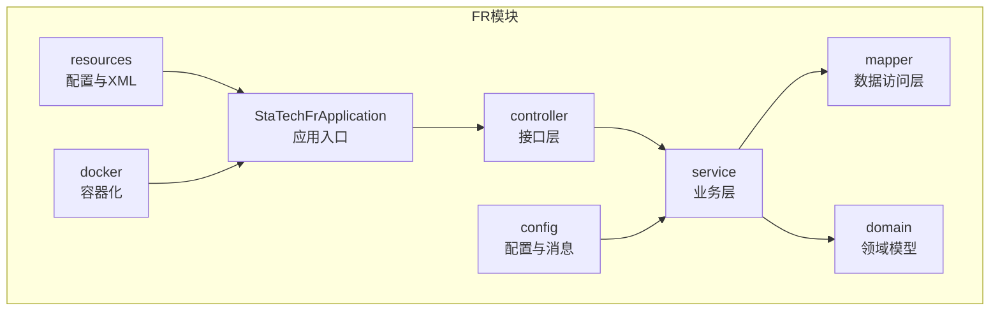
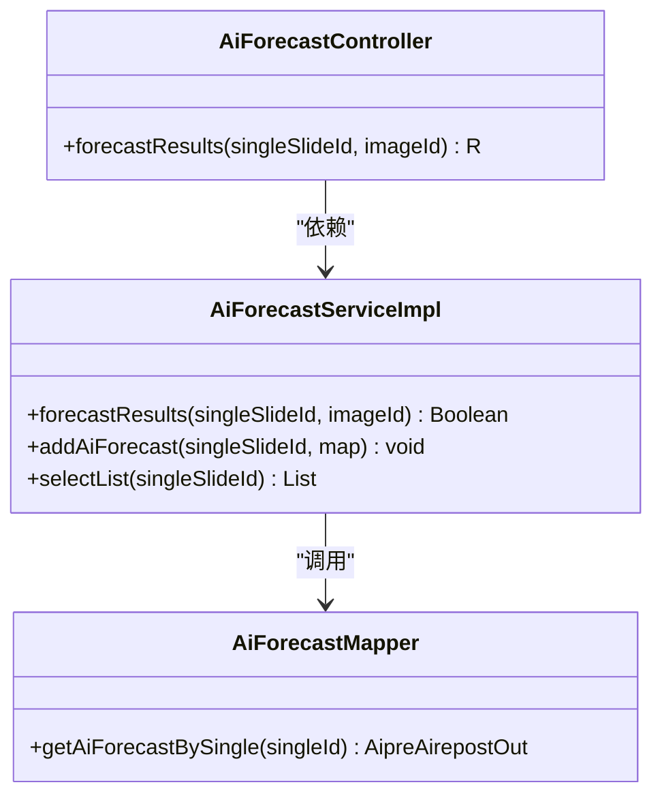
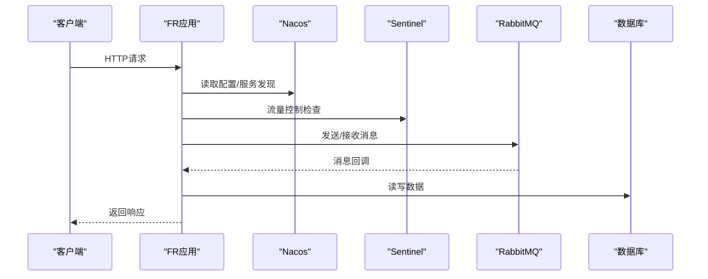
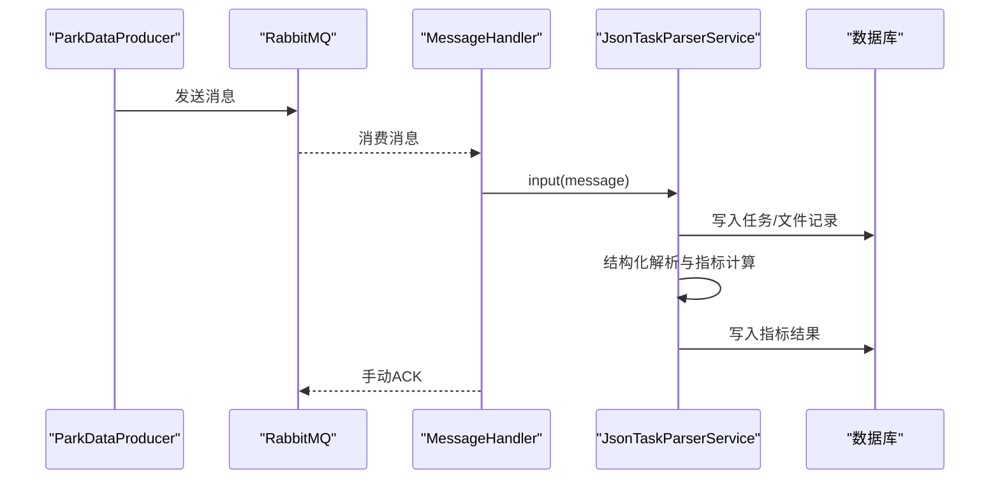
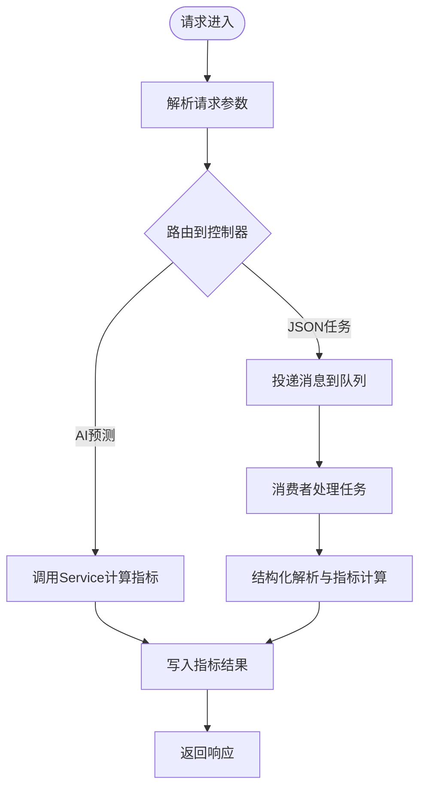
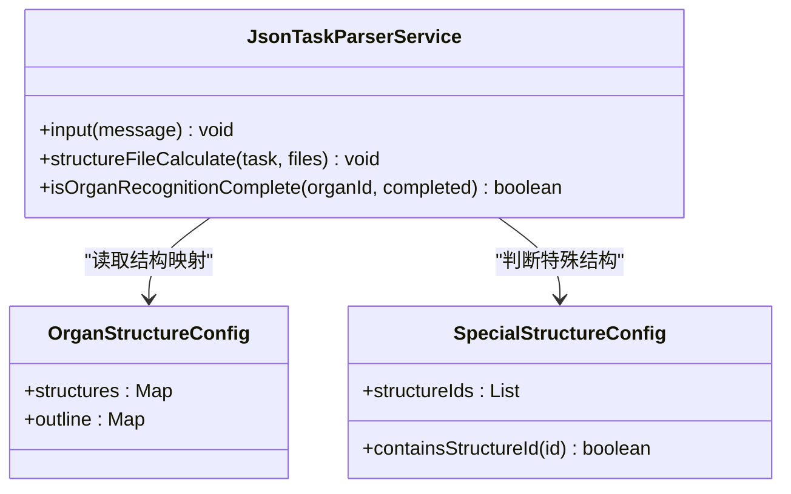
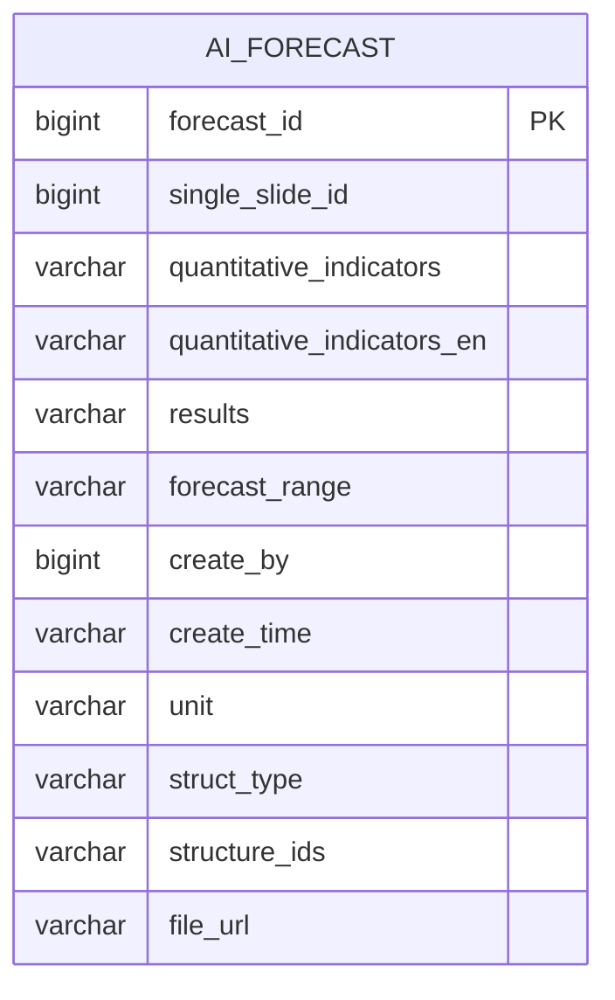
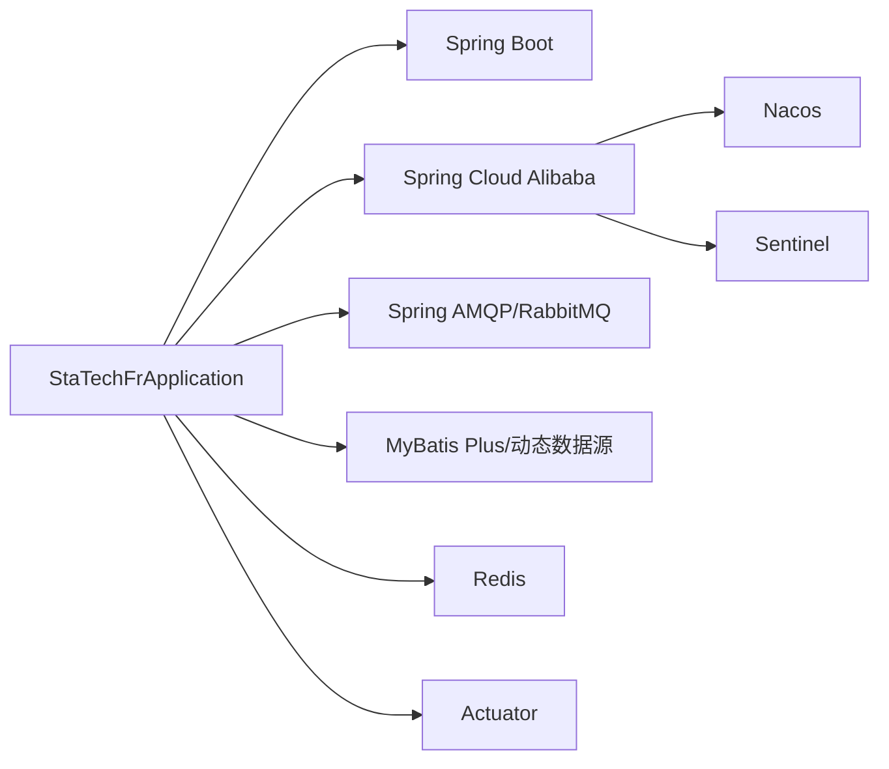

# 系统架构设计

<cite>
**本文引用的文件**   
- [StaTechFrApplication.java](file://src/main/java/cn/staitech/fr/StaTechFrApplication.java)
- [pom.xml](file://pom.xml)
- [bootstrap.yml](file://src/main/resources/bootstrap.yml)
- [application-local.yml](file://src/main/resources/application-local.yml)
- [AiForecastController.java](file://src/main/java/cn/staitech/fr/controller/AiForecastController.java)
- [AiForecastServiceImpl.java](file://src/main/java/cn/staitech/fr/service/impl/AiForecastServiceImpl.java)
- [AiForecastMapper.java](file://src/main/java/cn/staitech/fr/mapper/AiForecastMapper.java)
- [DynamicThreadPoolConfig.java](file://src/main/java/cn/staitech/fr/config/DynamicThreadPoolConfig.java)
- [ParkDataProducer.java](file://src/main/java/cn/staitech/fr/config/ParkDataProducer.java)
- [MessageHandler.java](file://src/main/java/cn/staitech/fr/config/MessageHandler.java)
- [JsonTaskParserService.java](file://src/main/java/cn/staitech/fr/service/strategy/json/JsonTaskParserService.java)
- [OrganStructureConfig.java](file://src/main/java/cn/staitech/fr/config/OrganStructureConfig.java)
- [SpecialStructureConfig.java](file://src/main/java/cn/staitech/fr/config/SpecialStructureConfig.java)
- [AiForecast.java](file://src/main/java/cn/staitech/fr/domain/AiForecast.java)
- [dockerfile](file://docker/staitech/modules/fr/dockerfile)
</cite>

## 目录
1. [引言](#引言)
2. [项目结构](#项目结构)
3. [核心组件](#核心组件)
4. [架构总览](#架构总览)
5. [详细组件分析](#详细组件分析)
6. [依赖关系分析](#依赖关系分析)
7. [性能考量](#性能考量)
8. [故障排查指南](#故障排查指南)
9. [结论](#结论)
10. [附录](#附录)

## 引言
本设计文档面向FR模块（数字阅片与AI预测指标模块），系统采用分层架构（Controller-Service-Mapper）与微服务架构（Spring Cloud Alibaba，Nacos注册发现与配置、Sentinel限流熔断）相结合的方式，围绕“异步处理 + 消息队列 + 动态线程池 + 多数据源”的技术主线，实现AI结构化结果的异步解析、指标计算与落库。文档重点阐述：
- 分层架构与职责边界
- 微服务与云原生集成（Nacos、Sentinel、Actuator）
- 异步处理与消息队列（RabbitMQ）设计决策
- 数据流与组件交互
- 安全、监控与灾备相关横切关注点
- 技术栈、第三方依赖与版本兼容性

## 项目结构
FR模块遵循典型的Spring Boot工程布局，主要目录与职责如下：
- config：应用配置、线程池、消息生产与消费、结构配置等
- controller：对外HTTP接口入口
- service：业务服务与策略工厂
- mapper：MyBatis Mapper接口
- domain：实体模型
- resources：配置文件、Mapper XML、国际化资源
- docker：容器化与JMX监控代理



**图表来源**
- [StaTechFrApplication.java:39-62](file://src/main/java/cn/staitech/fr/StaTechFrApplication.java#L39-L62)
- [AiForecastController.java:21-31](file://src/main/java/cn/staitech/fr/controller/AiForecastController.java#L21-L31)

**章节来源**
- [StaTechFrApplication.java:39-62](file://src/main/java/cn/staitech/fr/StaTechFrApplication.java#L39-L62)
- [bootstrap.yml:1-48](file://src/main/resources/bootstrap.yml#L1-L48)
- [application-local.yml:1-311](file://src/main/resources/application-local.yml#L1-L311)

## 核心组件
- 应用入口与装配
  - 启用注册发现、异步、事务、MyBatis Plus分页插件、安全与Swagger注解开关
- 控制器层
  - 提供AI预测结果查询接口，委派至Service
- 业务层
  - AI预测结果计算、批量指标写入、参考范围与统计口径处理
  - JSON任务解析与指标计算的异步调度
- 数据访问层
  - MyBatis Plus Mapper接口，配合动态数据源与多数据库支持
- 配置与消息
  - 动态线程池、RabbitMQ生产与消费、结构配置映射

**章节来源**
- [AiForecastController.java:21-31](file://src/main/java/cn/staitech/fr/controller/AiForecastController.java#L21-L31)
- [AiForecastServiceImpl.java:53-157](file://src/main/java/cn/staitech/fr/service/impl/AiForecastServiceImpl.java#L53-L157)
- [AiForecastMapper.java:13-17](file://src/main/java/cn/staitech/fr/mapper/AiForecastMapper.java#L13-L17)
- [DynamicThreadPoolConfig.java:12-51](file://src/main/java/cn/staitech/fr/config/DynamicThreadPoolConfig.java#L12-L51)
- [MessageHandler.java:30-76](file://src/main/java/cn/staitech/fr/config/MessageHandler.java#L30-L76)
- [JsonTaskParserService.java:52-107](file://src/main/java/cn/staitech/fr/service/strategy/json/JsonTaskParserService.java#L52-L107)

## 架构总览
FR模块采用“分层 + 微服务 + 异步”的混合架构：
- 分层架构：Controller → Service → Mapper
- 微服务：基于Spring Cloud Alibaba（Nacos注册发现与配置、Sentinel限流熔断）
- 异步处理：RabbitMQ消息驱动，动态线程池并发执行指标计算
- 多数据源：MySQL主库、PostgreSQL从库，结合动态数据源与Hikari连接池
- 监控与可观测性：Actuator、JMX Prometheus Agent、Arthas

```mermaid
graph TB
subgraph "客户端"
U["浏览器/前端/外部系统"]
end
subgraph "FR服务"
Ctl["Controller 层"]
Svc["Service 层"]
MQ["RabbitMQ"]
TP["动态线程池"]
DBM["MyBatis Plus Mapper"]
DS["动态数据源(Hikari)"]
CFG["Nacos配置/Nacos注册"]
SEN["Sentinel限流"]
ACT["Actuator"]
end
subgraph "外部系统"
RMQ["RabbitMQ Broker"]
NAC["Nacos"]
DB["MySQL/PostgreSQL"]
end
U --> Ctl --> Svc
Svc --> MQ
MQ --> TP --> Svc
Svc --> DBM --> DS --> DB
CFG <- --> Ctl
SEN <- --> Ctl
ACT <- --> Ctl
MQ --> RMQ
CFG --> NAC
```

**图表来源**
- [StaTechFrApplication.java:39-62](file://src/main/java/cn/staitech/fr/StaTechFrApplication.java#L39-L62)
- [bootstrap.yml:23-46](file://src/main/resources/bootstrap.yml#L23-L46)
- [application-local.yml:57-75](file://src/main/resources/application-local.yml#L57-L75)
- [DynamicThreadPoolConfig.java:12-51](file://src/main/java/cn/staitech/fr/config/DynamicThreadPoolConfig.java#L12-L51)
- [MessageHandler.java:30-76](file://src/main/java/cn/staitech/fr/config/MessageHandler.java#L30-L76)

**章节来源**
- [pom.xml:25-47](file://pom.xml#L25-L47)
- [bootstrap.yml:23-46](file://src/main/resources/bootstrap.yml#L23-L46)
- [application-local.yml:57-75](file://src/main/resources/application-local.yml#L57-L75)

## 详细组件分析

### 分层架构（Controller-Service-Mapper）
- 控制器层
  - 接收请求，调用Service，返回统一响应包装
- 服务层
  - 负责业务编排、指标计算、状态更新、与消息队列交互
- 数据访问层
  - 通过MyBatis Plus接口访问数据库，支持分页与批量写入



**图表来源**
- [AiForecastController.java:21-31](file://src/main/java/cn/staitech/fr/controller/AiForecastController.java#L21-L31)
- [AiForecastServiceImpl.java:53-157](file://src/main/java/cn/staitech/fr/service/impl/AiForecastServiceImpl.java#L53-L157)
- [AiForecastMapper.java:13-17](file://src/main/java/cn/staitech/fr/mapper/AiForecastMapper.java#L13-L17)

**章节来源**
- [AiForecastController.java:21-31](file://src/main/java/cn/staitech/fr/controller/AiForecastController.java#L21-L31)
- [AiForecastServiceImpl.java:53-157](file://src/main/java/cn/staitech/fr/service/impl/AiForecastServiceImpl.java#L53-L157)
- [AiForecastMapper.java:13-17](file://src/main/java/cn/staitech/fr/mapper/AiForecastMapper.java#L13-L17)

### 微服务架构（Spring Cloud Alibaba）
- 注册与配置
  - Nacos注册发现与配置中心，按环境profile加载配置
- 流量治理
  - Sentinel限流与熔断，保护下游依赖
- 运维监控
  - Actuator暴露健康与运行信息



**图表来源**
- [bootstrap.yml:23-46](file://src/main/resources/bootstrap.yml#L23-L46)
- [pom.xml:25-47](file://pom.xml#L25-L47)

**章节来源**
- [bootstrap.yml:23-46](file://src/main/resources/bootstrap.yml#L23-L46)
- [pom.xml:25-47](file://pom.xml#L25-L47)

### 异步处理机制与消息队列
- 生产与消费
  - 生产者将算法结果消息投递到队列；消费者监听队列，手动确认消息
- 重试与死信
  - 失败消息转发至重试队列，必要时拒绝并重入队
- 延迟消息
  - 支持延迟交换机与延迟头，实现定时检查任务
- 线程池与上下文传递
  - 使用TTL包装线程池，保证异步任务上下文透传



**图表来源**
- [ParkDataProducer.java:27-44](file://src/main/java/cn/staitech/fr/config/ParkDataProducer.java#L27-L44)
- [MessageHandler.java:43-86](file://src/main/java/cn/staitech/fr/config/MessageHandler.java#L43-L86)
- [JsonTaskParserService.java:174-263](file://src/main/java/cn/staitech/fr/service/strategy/json/JsonTaskParserService.java#L174-L263)

**章节来源**
- [ParkDataProducer.java:27-44](file://src/main/java/cn/staitech/fr/config/ParkDataProducer.java#L27-L44)
- [MessageHandler.java:43-86](file://src/main/java/cn/staitech/fr/config/MessageHandler.java#L43-L86)
- [JsonTaskParserService.java:174-263](file://src/main/java/cn/staitech/fr/service/strategy/json/JsonTaskParserService.java#L174-L263)

### 数据流与集成模式
- 数据库连接
  - MySQL主库、PostgreSQL从库，Hikari连接池参数可配置
- 多数据源
  - 动态数据源切换，主从分离，读写分离
- 外部服务集成
  - 系统API、Redis、RabbitMQ、Nacos、Sentinel、Actuator



**图表来源**
- [AiForecastController.java:27-30](file://src/main/java/cn/staitech/fr/controller/AiForecastController.java#L27-L30)
- [AiForecastServiceImpl.java:85-157](file://src/main/java/cn/staitech/fr/service/impl/AiForecastServiceImpl.java#L85-L157)
- [MessageHandler.java:43-86](file://src/main/java/cn/staitech/fr/config/MessageHandler.java#L43-L86)

**章节来源**
- [application-local.yml:15-56](file://src/main/resources/application-local.yml#L15-L56)
- [AiForecastServiceImpl.java:85-157](file://src/main/java/cn/staitech/fr/service/impl/AiForecastServiceImpl.java#L85-L157)

### 组件交互与策略模式
- 结构配置
  - 基于脏器与物种组合的结构ID映射，决定识别完整性
- 自定义解析策略
  - 工厂模式选择解析器，支持通用与定制策略
- 特殊结构处理
  - 组织轮廓与特殊结构ID集合，区分存储路径与计算逻辑



**图表来源**
- [OrganStructureConfig.java:14-44](file://src/main/java/cn/staitech/fr/config/OrganStructureConfig.java#L14-L44)
- [SpecialStructureConfig.java:22-75](file://src/main/java/cn/staitech/fr/config/SpecialStructureConfig.java#L22-L75)
- [JsonTaskParserService.java:288-317](file://src/main/java/cn/staitech/fr/service/strategy/json/JsonTaskParserService.java#L288-L317)

**章节来源**
- [OrganStructureConfig.java:14-44](file://src/main/java/cn/staitech/fr/config/OrganStructureConfig.java#L14-L44)
- [SpecialStructureConfig.java:22-75](file://src/main/java/cn/staitech/fr/config/SpecialStructureConfig.java#L22-L75)
- [JsonTaskParserService.java:288-317](file://src/main/java/cn/staitech/fr/service/strategy/json/JsonTaskParserService.java#L288-L317)

### 数据模型
- 指标结果实体
  - 关键字段：单切片ID、指标名称、结果、单位、结构类型、文件URL等



**图表来源**
- [AiForecast.java:16-84](file://src/main/java/cn/staitech/fr/domain/AiForecast.java#L16-L84)

**章节来源**
- [AiForecast.java:16-84](file://src/main/java/cn/staitech/fr/domain/AiForecast.java#L16-L84)

## 依赖关系分析
- 技术栈与版本
  - Spring Boot、Spring Cloud Alibaba、MyBatis Plus、RabbitMQ、Nacos、Sentinel、Actuator、Redis、动态数据源、JTS/GeoTools、RocksDB、EasyExcel/Aspose等
- 依赖耦合
  - 控制器仅依赖服务接口；服务层依赖Mapper与消息组件；配置层提供线程池与消息通道
- 外部依赖
  - Nacos（注册/配置）、RabbitMQ（消息）、数据库（MySQL/PG）、Redis（缓存）



**图表来源**
- [pom.xml:19-211](file://pom.xml#L19-L211)
- [bootstrap.yml:23-46](file://src/main/resources/bootstrap.yml#L23-L46)

**章节来源**
- [pom.xml:19-211](file://pom.xml#L19-L211)

## 性能考量
- 线程池与异步
  - 动态线程池与TTL上下文传递，避免阻塞主线程；队列容量与拒绝策略需结合业务峰值评估
- 数据库
  - 主从分离与连接池参数调优；批量写入与分页插件提升吞吐
- 消息
  - 手动确认、重试队列与延迟消息降低重复计算与失败风险
- 监控
  - JMX Prometheus Agent与Actuator便于容量规划与故障定位

[本节为通用性能建议，无需特定文件引用]

## 故障排查指南
- 消息处理
  - 消费失败进入重试队列并手动ACK；必要时拒绝并重入队
- 线程池监控
  - 日志记录队列长度、活跃线程数与完成计数，便于定位积压
- 数据一致性
  - 任务状态与指标写入需原子化，异常时回滚或标记失败
- 配置与注册
  - 检查Nacos配置是否生效、服务是否注册成功

**章节来源**
- [MessageHandler.java:43-86](file://src/main/java/cn/staitech/fr/config/MessageHandler.java#L43-L86)
- [DynamicThreadPoolConfig.java:14-51](file://src/main/java/cn/staitech/fr/config/DynamicThreadPoolConfig.java#L14-L51)
- [bootstrap.yml:23-46](file://src/main/resources/bootstrap.yml#L23-L46)

## 结论
FR模块通过清晰的分层架构、完善的微服务集成与稳健的异步处理机制，实现了AI结构化结果的高可靠解析与指标计算。动态线程池与消息队列确保了高并发场景下的稳定性，而多数据源与连接池优化提升了数据库层面的吞吐与可用性。结合Nacos、Sentinel与Actuator，系统具备良好的可观测性与弹性。

## 附录
- 容器化
  - 使用OpenJDK 8运行时，挂载/home/staitech目录，启用JMX Prometheus Agent与Arthas
- 启动日志
  - 应用启动后输出文档地址与端口信息，便于快速访问Swagger文档

**章节来源**
- [dockerfile:1-22](file://docker/staitech/modules/fr/dockerfile#L1-L22)
- [StaTechFrApplication.java:45-51](file://src/main/java/cn/staitech/fr/StaTechFrApplication.java#L45-L51)